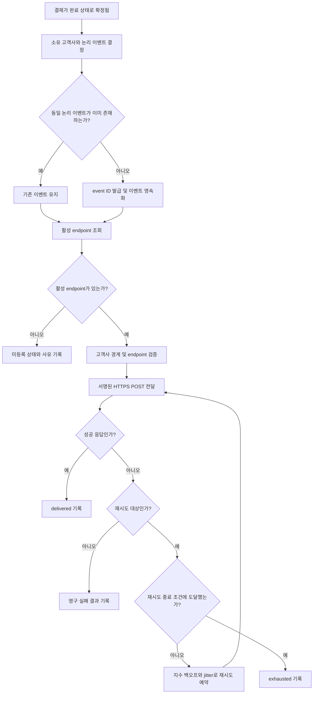

# 결제 완료 웹훅 전달 API PRD

## 1. 문서 정보

- 기능명: 결제 완료 웹훅 전달 API
- 문서 상태: Draft
- 범위: 백엔드 이벤트 생성 및 고객사 HTTPS endpoint 전달
- 대상 릴리스: 1차 출시
- UI: 없음

---

## 2. 적용 범위

| 계약 항목 | 적용 여부 | 근거 |
|---|---|---|
| 문제·목표·비목표 | Required | 결제 완료 이벤트의 외부 전달 범위를 정의해야 함 |
| 사용자·역할·권한 | Required | 고객사별 데이터 격리와 endpoint 소유권 검증이 필요함 |
| 기능 요구사항 | Required | 이벤트 생성, 전달, 재시도, 중복 처리 계약이 필요함 |
| 페이지·라우트 | N/A | 이번 범위에는 UI가 전혀 없음 |
| 사용자 화면 상태 매트릭스 | N/A | 사용자에게 노출되는 화면이 없음 |
| 시스템 흐름 | Required | 결제 완료부터 성공 또는 재시도 종료까지 다단계 생명주기가 존재함 |
| 인가·데이터 경계 | Required | 고객사별 이벤트, endpoint, secret 및 전달 기록을 격리해야 함 |
| 수치형 비기능 요구사항 | N/A | 처리량과 지연 SLA가 측정되지 않았으며 목표 수치를 정할 근거가 없음 |
| 수용 기준 | Required | 최소 1회 전달과 재시도를 관찰 가능한 조건으로 검증해야 함 |
| 가정·열린 결정 | Required | 서명 방식, secret rotation 및 재시도 세부 정책이 미정임 |
| 단계별 출시 조건 | Required | 미정 보안 계약이 출시 전에 해소되어야 함 |

---

## 3. 배경 및 문제

고객사는 결제가 완료된 사실을 자사 시스템에 반영하기 위해 결제 시스템을 반복 조회하지 않고 이벤트를 수신할 수 있어야 한다.

현재 필요한 기능은 결제 완료 시 해당 결제를 소유한 고객사가 등록한 HTTPS endpoint로 이벤트를 전달하는 서버 간 웹훅이다. 네트워크 및 수신 서버 장애가 발생할 수 있으므로 전달은 최소 1회(at-least-once) 보장되어야 하며, 실패 시 지수 백오프 방식으로 자동 재시도해야 한다.

최소 1회 전달 특성상 고객사가 같은 이벤트를 두 번 이상 받을 수 있으므로, 모든 재시도에서 변하지 않는 event ID를 제공해야 한다.

---

## 4. 목표

- 결제 완료 이벤트를 해당 고객사가 등록한 HTTPS endpoint로 자동 전달한다.
- 일시적인 네트워크 또는 수신 서버 장애에도 이벤트를 유실하지 않고 자동 재시도한다.
- 동일 이벤트의 중복 수신을 고객사가 판별할 수 있도록 안정적인 event ID를 제공한다.
- 고객사 간 endpoint, 이벤트 데이터, secret 및 전달 기록을 격리한다.
- 전달 결과와 실패 원인을 내부에서 추적할 수 있게 한다.
- 실제 운영 데이터를 수집해 향후 처리량 및 지연 SLA를 결정할 근거를 만든다.

---

## 5. 비목표

1차 출시에는 다음을 포함하지 않는다.

- endpoint 등록·수정·삭제 API 신규 개발
  - 기존 내부 API가 담당한다.
- endpoint 관리 UI
- 웹훅 전달 현황 대시보드
- 고객사 또는 운영자의 수동 재전송
- 재시도 종료 이벤트의 수동 replay
- 정확히 한 번(exactly-once) 전달 보장
- 고객사 endpoint 내부에서의 처리 성공 보장
- 여러 이벤트 사이의 전달 순서 보장
- 처리량 또는 전달 지연에 대한 수치형 SLA 보장
- 결제 완료 이외의 이벤트 유형 전달

자동 재시도는 비목표인 “수동 재전송”에 해당하지 않는다.

---

## 6. 사용자, 역할 및 권한

| 역할 | 설명 | 허용 범위 |
|---|---|---|
| 결제 시스템 | 결제 상태를 완료로 확정하는 이벤트 원천 | 결제 완료 이벤트 발생 |
| 웹훅 전달 시스템 | 이벤트를 영속화하고 고객사 endpoint로 전달 | 소유 고객사의 활성 endpoint 및 전달용 secret만 조회 |
| 고객사 수신 시스템 | HTTPS endpoint를 통해 웹훅 수신 | 자기 고객사 이벤트만 수신 |
| endpoint 등록 내부 API | 기존 범위의 endpoint 관리 주체 | 인증된 고객사의 endpoint 등록 및 상태 관리 |
| 내부 운영자 | 장애 조사 및 운영 모니터링 | 승인된 내부 권한 범위에서 메타데이터 조회. 수동 재전송은 불가 |

클라이언트가 전달 요청에 고객사 식별자를 임의로 지정하는 방식은 허용하지 않는다. 고객사 식별은 결제 데이터의 소유 관계와 서버 측 인증 정보로 결정한다.

---

## 7. 핵심 용어 및 상태

### 7.1 이벤트

하나의 결제가 최초로 완료 상태에 도달했을 때 생성되는 논리적 `payment.completed` 이벤트다.

동일 결제 완료 전환을 중복 처리하더라도 새로운 논리 이벤트를 반복 생성하지 않는다. 단, 운영 정책상 결제 완료가 취소된 뒤 다시 완료될 수 있다면 이벤트 식별 규칙을 별도로 결정해야 한다.

### 7.2 전달 시도

이벤트를 특정 endpoint로 한 번 HTTP 요청한 기록이다. 동일 이벤트의 모든 전달 시도는 같은 event ID를 사용한다.

### 7.3 전달 상태

| 상태 | 의미 |
|---|---|
| `pending` | 이벤트가 생성되었으나 첫 전달이 시작되지 않음 |
| `in_progress` | 전달 시도가 실행 중임 |
| `retry_scheduled` | 실패 후 다음 자동 재시도가 예약됨 |
| `delivered` | 고객사 endpoint가 성공 응답을 반환함 |
| `exhausted` | 자동 재시도 정책이 종료 조건에 도달함 |

`exhausted`는 이벤트 삭제나 성공을 의미하지 않는다. 1차 출시에서는 이 상태를 수동 재전송할 수 없다.

---

## 8. 기능 요구사항

| ID | 요구사항 | 우선순위 |
|---|---|---|
| FR-001 | 결제가 최초로 완료 상태에 확정되면 `payment.completed` 이벤트를 생성해야 한다. | Must |
| FR-002 | 생성된 이벤트는 전달 프로세스 장애나 재시작 후에도 유실되지 않도록 영속적으로 보존되어야 한다. | Must |
| FR-003 | 결제 완료 처리와 이벤트 전달 등록 사이의 부분 실패로 인해 완료된 결제의 이벤트가 누락되지 않아야 한다. | Must |
| FR-004 | 각 논리 이벤트에는 고객사 전체 범위에서 충돌하지 않는 불변 event ID가 부여되어야 한다. | Must |
| FR-005 | 같은 논리적 결제 완료 처리가 중복 유입되어도 별개의 이벤트가 중복 생성되지 않아야 한다. | Must |
| FR-006 | 웹훅 전달 시스템은 이벤트 소유 고객사의 활성 endpoint만 선택해야 한다. | Must |
| FR-007 | 활성 endpoint가 존재하면 HTTPS `POST` 요청으로 이벤트를 전달해야 한다. | Must |
| FR-008 | 재시도를 포함한 모든 전달 요청은 동일한 event ID와 동일한 논리 이벤트 내용을 포함해야 한다. | Must |
| FR-009 | 고객사가 중복 제거와 스키마 해석을 할 수 있도록 event ID, 이벤트 유형, 스키마 버전, 발생 시각 및 결제 식별자를 제공해야 한다. | Must |
| FR-010 | 확정된 보안 계약에 따라 각 요청을 인증할 수 있는 서명 정보를 포함해야 한다. | Must, 결정 대기 |
| FR-011 | endpoint가 성공으로 정의된 HTTP 응답을 반환하면 이벤트를 `delivered`로 기록하고 추가 자동 재시도를 중단해야 한다. | Must |
| FR-012 | 네트워크 오류, 연결·응답 시간 초과 또는 재시도 대상으로 분류된 HTTP 응답이 발생하면 지수 백오프로 다음 시도를 예약해야 한다. | Must |
| FR-013 | 각 재시도 간격은 이전 간격보다 지수적으로 증가해야 하며, 동시 재시도 집중을 완화하는 jitter를 지원해야 한다. | Must |
| FR-014 | 자동 재시도 횟수 또는 기간의 종료 조건에 도달하면 상태를 `exhausted`로 기록하고 무한 재시도를 방지해야 한다. | Must |
| FR-015 | 영구 실패로 분류된 응답에는 불필요한 자동 재시도를 수행하지 않아야 한다. 구체적인 HTTP 분류는 출시 전에 확정한다. | Must, 결정 대기 |
| FR-016 | 각 전달 시도에 대해 event ID, 고객사 ID, endpoint 참조 ID, 시도 번호, 시각, 결과, HTTP 상태 코드와 정규화된 오류 유형을 내부 기록해야 한다. | Must |
| FR-017 | 로그와 전달 기록에 secret, 서명 원문 또는 불필요한 결제 개인정보를 저장하지 않아야 한다. | Must |
| FR-018 | 고객사 A의 이벤트가 고객사 B의 endpoint, secret 또는 전달 작업과 결합되지 않아야 한다. | Must |
| FR-019 | 동일 고객사에 endpoint가 여러 개 등록될 수 있다면 endpoint 선택 또는 fan-out 규칙을 적용해야 한다. 해당 규칙은 출시 전에 확정한다. | Must, 결정 대기 |
| FR-020 | 활성 endpoint가 없을 경우 외부 요청을 보내지 않고 그 사유를 내부에서 식별 가능한 상태로 기록해야 한다. | Must |
| FR-021 | 서비스 재시작 또는 작업 실행 중 장애가 발생해 전달 결과가 불확실하면 이벤트를 유실 처리하지 않아야 한다. 이 경우 같은 event ID가 다시 전달될 수 있다. | Must |
| FR-022 | 1차 출시에서는 자동 재시도 외의 수동 재전송 진입점을 제공하지 않아야 한다. | Must |
| FR-023 | 실제 처리량, 큐 대기시간, 전달 지연과 성공·재시도·종료 결과를 측정할 운영 지표를 생성해야 한다. | Must |

---

## 9. 웹훅 요청 계약

아래는 서명 필드를 제외한 최소 논리 계약이다. 실제 필드명과 직렬화 형식은 API 계약 확정 시 고정한다.

```json
{
  "id": "evt_<unique-id>",
  "type": "payment.completed",
  "schema_version": "1",
  "occurred_at": "RFC 3339 timestamp",
  "data": {
    "payment_id": "customer-visible-payment-id",
    "status": "completed"
  }
}
```

### 필드 규칙

- `id`
  - 논리 이벤트의 고유 ID다.
  - 재시도마다 변경되지 않는다.
  - 고객사가 중복 제거 키로 사용할 수 있다.
- `type`
  - 1차 출시에서는 `payment.completed`만 지원한다.
- `schema_version`
  - 고객사가 payload 변경을 식별할 수 있어야 한다.
- `occurred_at`
  - 결제가 완료 상태로 확정된 시각이다.
  - 전달 시도 시각이 아니다.
- `data.payment_id`
  - 해당 고객사에게 공개 가능한 결제 식별자여야 한다.
- `data.status`
  - `completed`로 전달한다.

Payload에는 다른 고객사의 식별자나 데이터가 포함되어서는 안 된다. 금액, 통화, 주문 ID 등 추가 결제 필드는 명시적 요구와 데이터 공개 검토가 완료된 경우에만 포함한다.

---

## 10. 시스템 흐름



---

## 11. 성공 및 실패 판정

### 성공

고객사 endpoint가 미리 정의된 성공 HTTP 상태 코드를 반환하고 응답이 제한 시간 내 완료된 경우다.

성공 상태 코드 범위를 모든 `2xx`로 볼지 일부 코드만 허용할지는 열린 결정이다.

### 재시도 후보

- DNS 또는 연결 실패
- TLS 연결 실패
- 연결 시간 초과
- 응답 시간 초과
- 재시도 대상으로 확정된 HTTP 상태 코드
- 전달 결과를 확정할 수 없는 내부 처리 장애

### 영구 실패 후보

- 재시도해도 해결되지 않는 것으로 정의된 HTTP 상태 코드
- endpoint 설정 자체가 유효하지 않은 경우
- 보안 정책상 차단된 목적지
- payload 또는 서명 계약의 비복구 오류

정확한 HTTP 상태 코드별 분류는 출시 전 결정해야 한다. 특히 `429`, `408`, `5xx` 및 `Retry-After` 처리 정책이 필요하다.

---

## 12. 인가 및 데이터 경계

### 12.1 고객사 격리

- 이벤트 레코드는 소유 고객사 ID와 결합되어야 한다.
- endpoint 및 secret 조회에는 반드시 같은 고객사 ID 조건을 적용해야 한다.
- 전달 작업이 가진 고객사 ID와 조회된 endpoint의 소유 고객사 ID가 일치하지 않으면 요청을 차단해야 한다.
- event ID만으로 다른 고객사의 이벤트를 조회하거나 조작할 수 없어야 한다.
- 고객사별 큐 또는 저장소 분리가 필수라는 의미는 아니지만, 논리적 접근 경계는 서버에서 강제되어야 한다.
- 내부 운영 조회도 권한과 고객사 범위가 검증되어야 한다.

### 12.2 endpoint 보안

- endpoint는 HTTPS만 허용한다.
- TLS 인증서의 유효성을 검증해야 한다.
- HTTP로의 downgrade를 허용하지 않는다.
- secret은 저장 및 전송 과정에서 보호되어야 하며 로그에 노출되어서는 안 된다.
- 내부망 및 메타데이터 서비스 접근을 통한 SSRF를 방지해야 한다.
- endpoint 등록 시 검증하더라도 실제 전달 시 DNS 재해석 및 목적지 검증 우회 가능성을 고려해야 한다.

### 12.3 서명

서명 알고리즘, canonical payload, timestamp 포함 여부, 허용 시간 오차, 서명 헤더 이름, secret 발급 및 rotation 방식은 보안 담당자 결정 사항이다.

이 계약이 확정되기 전까지 FR-010의 구현 및 외부 출시를 완료한 것으로 간주할 수 없다.

---

## 13. 비기능 요구사항

| ID | 요구사항 |
|---|---|
| NFR-001 | 시스템은 최소 1회 전달을 보장해야 하며, 장애 상황에서 중복 전달이 가능함을 API 계약에 명시해야 한다. |
| NFR-002 | 전달 작업과 재시도 예약은 프로세스 재시작 후에도 복구 가능해야 한다. |
| NFR-003 | 서로 다른 고객사의 작업이 동시에 처리되더라도 데이터 경계가 유지되어야 한다. |
| NFR-004 | 로그와 지표는 event ID를 기준으로 이벤트 생명주기와 각 시도를 추적할 수 있어야 한다. |
| NFR-005 | endpoint 응답 본문은 기본적으로 보관하지 않는다. 장애 분석에 필요하면 크기 제한, 민감정보 처리 및 보존 기간을 별도로 승인해야 한다. |
| NFR-006 | secret 및 결제 민감정보는 로그, 메트릭 label 또는 오류 메시지에 포함하지 않아야 한다. |
| NFR-007 | 처리량 및 전달 지연 목표는 운영 측정 후 결정한다. 근거가 확보되기 전에는 수치형 SLA를 설정하지 않는다. |

### 측정해야 할 지표

목표값은 지정하지 않되 다음 지표는 측정 가능해야 한다.

- 결제 완료부터 이벤트 영속화까지의 시간
- 이벤트 영속화부터 첫 전달 시도까지의 큐 대기시간
- 결제 완료부터 최초 성공 전달까지의 시간
- 고객사별·전체 이벤트 생성량
- 전달 시도량
- 최초 시도 성공률
- 재시도 후 성공률
- `exhausted` 전환 수
- endpoint 미등록 수
- 네트워크 오류 및 HTTP 상태 코드별 실패 수
- 현재 대기 및 재시도 작업 수

고객사 ID처럼 cardinality가 큰 값이나 민감할 수 있는 값은 메트릭 label로 직접 사용하지 않고, 필요한 경우 접근 통제된 로그나 추적 시스템에서 조회한다.

---

## 14. 수용 기준

| ID | 연결 요구사항 | Given | When | Then | 검증 방식 |
|---|---|---|---|---|---|
| AC-001 | FR-001~003 | 고객사 소유 결제가 완료 이전 상태임 | 결제가 최초로 완료됨 | 전달 가능한 이벤트가 영속적으로 생성됨 | 통합 테스트 및 장애 주입 테스트 |
| AC-002 | FR-004, FR-008 | 하나의 이벤트 전달이 두 번 이상 시도됨 | 각 요청 payload를 비교함 | 모든 시도에서 event ID가 동일함 | 통합 테스트 |
| AC-003 | FR-005 | 동일 결제 완료 입력이 중복 유입됨 | 입력을 반복 처리함 | 하나의 논리 이벤트만 존재함 | 동시성 포함 통합 테스트 |
| AC-004 | FR-006, FR-018 | 고객사 A와 B에 서로 다른 endpoint가 있음 | 고객사 A의 결제가 완료됨 | A의 endpoint에만 A의 이벤트가 전달됨 | 테넌트 격리 통합 테스트 |
| AC-005 | FR-007, FR-009 | 활성 HTTPS endpoint가 등록됨 | 이벤트 전달이 실행됨 | 정의된 최소 필드를 가진 POST 요청을 수신함 | 계약 테스트 |
| AC-006 | FR-010 | 서명 계약과 활성 secret이 확정됨 | 웹훅 요청이 전송됨 | 고객사가 문서화된 방식으로 요청을 검증할 수 있음 | 보안 계약 테스트 |
| AC-007 | FR-011 | endpoint가 성공으로 정의된 상태 코드를 반환함 | 전달 시도가 완료됨 | 이벤트가 `delivered`가 되고 추가 재시도가 없음 | 통합 테스트 |
| AC-008 | FR-012, FR-013 | endpoint에 일시적 네트워크 장애가 있음 | 최초 전달이 실패함 | 증가하는 지연과 jitter가 적용된 재시도가 예약됨 | 가상 시계 기반 테스트 |
| AC-009 | FR-012 | endpoint가 재시도 대상 HTTP 상태를 반환함 | 요청이 실패함 | 확정된 정책에 따라 재시도가 예약됨 | 상태 코드별 계약 테스트 |
| AC-010 | FR-014 | 이벤트가 자동 재시도 종료 조건에 도달함 | 마지막 시도가 실패함 | 상태가 `exhausted`가 되고 추가 자동 시도가 없음 | 통합 테스트 |
| AC-011 | FR-015 | endpoint가 영구 실패로 정의된 응답을 반환함 | 전달이 완료됨 | 불필요한 재시도가 예약되지 않음 | 상태 코드별 계약 테스트 |
| AC-012 | FR-016, FR-017 | 전달이 성공 또는 실패함 | 전달 기록과 로그를 조회함 | 추적 메타데이터는 존재하고 secret 및 금지 데이터는 없음 | 로그 검사 테스트 |
| AC-013 | FR-020 | 고객사에 활성 endpoint가 없음 | 결제가 완료됨 | 외부 요청 없이 미등록 사유가 기록됨 | 통합 테스트 |
| AC-014 | FR-021 | 외부 요청 후 결과 기록 전에 전달 프로세스가 중단됨 | 프로세스가 복구됨 | 이벤트가 유실되지 않으며 같은 event ID로 재시도될 수 있음 | 장애 주입 테스트 |
| AC-015 | FR-022 | 이벤트가 실패 또는 `exhausted` 상태임 | 고객사 또는 운영자가 시스템을 사용함 | 수동 재전송 API나 UI를 사용할 수 없음 | API 및 권한 검사 |
| AC-016 | NFR-003 | 두 고객사의 이벤트가 동시에 처리됨 | endpoint 및 secret 조회에 경쟁 상황을 유발함 | 고객사 간 데이터 혼합이 발생하지 않음 | 동시성·격리 테스트 |
| AC-017 | NFR-006 | 다양한 실패 메시지가 발생함 | 로그와 메트릭을 검사함 | secret, 서명 원문 및 결제 민감정보가 노출되지 않음 | 자동 민감정보 스캔 |
| AC-018 | FR-023 | 이벤트 생성과 전달이 발생함 | 운영 지표를 조회함 | 정의된 처리량·지연·결과 지표가 측정 가능함 | 관측성 검증 |
| AC-019 | endpoint 보안 | endpoint가 HTTP이거나 TLS 검증에 실패함 | 전달이 시도됨 | 요청이 차단되고 안전한 오류로 기록됨 | 보안 테스트 |
| AC-020 | SSRF 방어 | endpoint가 내부·예약 주소 또는 DNS 우회 목적지를 가리킴 | 전달이 시도됨 | 보호 대상 네트워크로 요청이 전송되지 않음 | SSRF 침투 테스트 |

---

## 15. 합리적 가정

아래 항목은 브리프에 명시되지는 않았지만, 되돌릴 수 있거나 일반적인 계약으로 간주해 PRD 작성에 적용한 가정이다.

| ID | 가정 | 영향 |
|---|---|---|
| AS-001 | 결제에는 서버가 신뢰할 수 있는 고객사 소유 관계가 이미 존재한다. | endpoint 선택의 기준으로 사용 |
| AS-002 | 기존 내부 API가 endpoint의 활성·비활성 상태와 고객사 소유권을 제공한다. | 이번 기능은 등록 API를 새로 만들지 않음 |
| AS-003 | 웹훅은 HTTPS `POST`와 JSON payload를 사용한다. | 요청 계약의 기본 형식 |
| AS-004 | 고객사는 event ID를 저장하고 중복 처리를 방지할 책임이 있다. | 정확히 한 번 전달을 보장하지 않음 |
| AS-005 | 전달 성공 여부는 고객사 시스템의 업무 처리 결과가 아니라 HTTP 응답으로 판단한다. | endpoint 내부 처리 상태는 알 수 없음 |
| AS-006 | 고객사에게 공개 가능한 안정적인 결제 식별자가 존재한다. | payload의 `payment_id`로 사용 |
| AS-007 | 한 논리 이벤트의 payload는 재시도 중 변경하지 않는다. | 서명과 중복 제거의 일관성 확보 |
| AS-008 | event ID는 고객사별 유일성을 넘어 시스템 전체에서 유일하게 생성한다. | 운영 추적과 고객사 통합을 단순화 |
| AS-009 | redirect 응답은 자동 추적하지 않는다. | 목적지 변경 및 SSRF 위험 방지 |
| AS-010 | 재시도에는 jitter를 적용한다. | 장애 복구 시 동시 요청 집중 완화 |
| AS-011 | `exhausted` 이벤트와 전달 기록은 운영 조사에 필요한 기간 동안 보존한다. | 정확한 보존 기간은 열린 결정 |
| AS-012 | endpoint가 없는 경우에도 결제 완료 이벤트 자체는 기록한다. | 설정 누락을 관측 가능하게 함 |

가정이 기존 시스템 계약과 충돌하면 해당 항목은 구현 전에 수정해야 한다.

---

## 16. 열린 결정

### 출시 차단 결정

| ID | 결정 필요 사항 | 결정 주체 | 필요한 결정 |
|---|---|---|---|
| OD-001 | 요청 서명 방식 | 보안 담당자 | 알고리즘, 서명 대상 bytes, 헤더 형식, timestamp 및 replay 방어 방식 |
| OD-002 | secret rotation | 보안 담당자·플랫폼 담당자 | rotation 주기, 신규·기존 secret 동시 허용 기간, 폐기 및 사고 대응 절차 |
| OD-003 | secret 저장 정책 | 보안 담당자 | 암호화 및 접근 통제 방식, 조회 권한, 감사 요구 |
| OD-004 | 성공·재시도·영구 실패 HTTP 분류 | API·플랫폼 담당자 | `2xx`, `3xx`, `4xx`, `408`, `429`, `5xx` 처리 및 `Retry-After` 준수 여부 |
| OD-005 | 재시도 정책 | 제품·플랫폼 담당자 | 최초 간격, 배수, 최대 간격, jitter 방식, 최대 시도 횟수 또는 총 재시도 기간 |
| OD-006 | 연결 및 응답 제한 시간 | 플랫폼 담당자 | connect/read/total timeout 값 |
| OD-007 | endpoint 다중 등록 규칙 | 기존 내부 API 담당자·제품 담당자 | 고객사당 단일 활성 endpoint인지, 복수 endpoint fan-out인지 |
| OD-008 | endpoint 미등록 이벤트 처리 | 제품·운영 담당자 | 이후 endpoint가 등록되어도 과거 이벤트를 보내지 않는지 여부 |
| OD-009 | 재완료 이벤트 의미 | 결제 도메인 담당자 | 취소·환불 후 재완료가 가능한 경우 새 이벤트를 생성할 조건 |
| OD-010 | payload 공개 범위 | 제품·보안 담당자 | 금액, 통화, 주문 ID 등 추가 필드와 민감정보 분류 |

### 출시 후 결정 가능

| ID | 결정 필요 사항 | 결정 주체 | 결정 시점 |
|---|---|---|---|
| OD-011 | 처리량 및 지연 SLA | 제품·플랫폼 담당자 | 운영 측정치와 고객 요구가 확보된 후 |
| OD-012 | 이벤트 및 전달 기록 보존 기간 | 보안·운영·법무 담당자 | 데이터 정책 검토 후 |
| OD-013 | 고객사별 공정성·rate limit | 플랫폼 담당자 | 실제 부하와 noisy-neighbor 현상 측정 후 |
| OD-014 | replay 대시보드 및 수동 재전송 | 제품 담당자 | 1차 출시 운영 결과를 검토한 후 |
| OD-015 | 이벤트 순서 보장 | 제품·플랫폼 담당자 | 추가 이벤트 유형 도입 전에 |
| OD-016 | payload 스키마 변경 정책 | API 담당자 | 최초 외부 계약 공개 전에 버전 호환 원칙 확정 권장 |

처리량, 지연 SLA, 재시도 횟수 및 timeout에는 이 문서에서 근거 없는 수치를 부여하지 않는다.

---

## 17. 위험 및 완화 방안

| 위험 | 영향 | 완화 |
|---|---|---|
| 전달 결과 불확실로 인한 중복 | 고객사가 동일 결제를 중복 처리할 수 있음 | 불변 event ID 제공, 중복 가능성 문서화, 고객사 idempotency 권고 |
| 이벤트 영속화 누락 | 완료 결제가 고객사에 전달되지 않음 | 결제 완료와 이벤트 등록 사이의 원자적 또는 복구 가능한 계약, 장애 테스트 |
| 고객사 데이터 혼합 | 심각한 정보 유출 | 서버 측 소유권 검증, 복합 고객사 경계, 격리·동시성 테스트 |
| 잘못된 endpoint를 통한 SSRF | 내부 시스템 또는 클라우드 메타데이터 노출 | HTTPS 제한, 목적지 검증, redirect 차단, egress 통제 |
| secret 노출 | 위조 웹훅 가능 | 암호화 저장, 최소 권한, 로그 마스킹, rotation 계약 |
| 장기 장애 시 재시도 폭증 | 전달 시스템과 고객사 endpoint 과부하 | 지수 백오프, jitter, 최대 간격과 종료 조건 |
| 한 고객사의 장애가 전체 전달을 지연 | 고객사 간 영향 전파 | 고객사별 작업량 관측, 필요 시 격리 및 공정성 정책 도입 |
| endpoint가 없거나 설정 오류 | 결제 이벤트가 외부에 반영되지 않음 | 상태 및 지표 기록, 내부 알림 정책 검토 |
| 서명 계약 미확정 | 보안 수준 또는 고객 연동 방식 불명확 | OD-001~003을 외부 출시 게이트로 지정 |
| 성능 목표 부재 | 출시 후 기대 수준 불일치 | 실제 지표 수집 후 SLA 결정, 초기에는 수치 약속 금지 |

---

## 18. 출시 계획

| 단계 | 포함 요구사항 | 검증 가능한 종료 조건 |
|---|---|---|
| 1. 계약 확정 | FR-009~010, FR-012~015, FR-019 | OD-001~010 중 해당 시스템에 필요한 출시 차단 결정이 승인되고 요청·응답 계약이 문서화됨 |
| 2. 이벤트 생성 및 격리 | FR-001~006, FR-018, FR-020~021 | AC-001~004, AC-013~014, AC-016 통과 |
| 3. 전달 및 자동 재시도 | FR-007~015 | AC-005~011 및 서명 보안 테스트 통과 |
| 4. 운영 안전성 | FR-016~017, FR-022~023 및 NFR 전체 | AC-012, AC-015, AC-017~020 통과 |
| 5. 제한 출시 | 전체 Must 요구사항 | 선택된 고객사 대상으로 격리·서명·재시도·관측성 검증 완료, 미해결 출시 차단 결정 없음 |
| 6. 1차 정식 출시 | 전체 1차 범위 | 운영 지표와 장애 대응 절차가 준비되고 replay UI나 수동 재전송 없이 운영 가능함 |

---

## 19. 완료 정의

다음 조건을 모두 만족하면 1차 출시 구현이 완료된 것으로 본다.

- 모든 `Must` 요구사항과 연결된 수용 기준이 통과한다.
- 서명 및 secret rotation을 포함한 보안 계약이 승인되어 있다.
- 고객사 간 endpoint, payload, secret 및 전달 작업 격리 테스트가 통과한다.
- 결제 완료 처리 중 장애와 전달 결과 불확실 상황에서 이벤트가 유실되지 않는다.
- 네트워크 실패에 대한 지수 백오프 자동 재시도가 동작한다.
- 고객사가 불변 event ID로 중복 이벤트를 식별할 수 있다.
- 로그와 메트릭에서 secret 및 금지된 결제 데이터가 노출되지 않는다.
- 처리량과 지연을 측정할 수 있지만, 근거 없는 수치형 SLA는 외부 계약에 포함되지 않는다.
- replay 대시보드와 수동 재전송 기능이 노출되지 않는다.