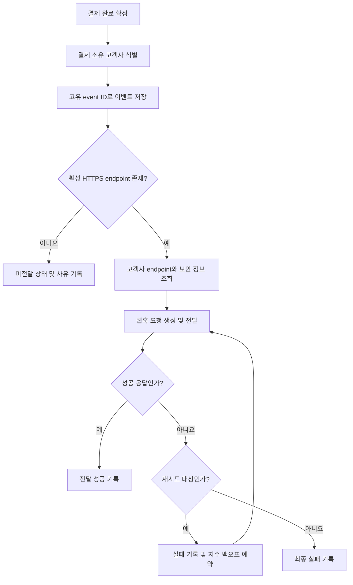

# 결제 완료 웹훅 전달 API PRD

## 1. 문서 개요

- 기능명: 결제 완료 웹훅 전달 API
- 문서 상태: 초안
- 대상 출시: 1차 출시
- 범위: 백엔드 웹훅 생성·전달·재시도
- UI 포함 여부: 없음

## 2. 적용 범위

| 계약 항목 | 적용 여부 | 근거 |
|---|---|---|
| 문제, 목표, 비목표 | Required | 신규 서버 기능의 목적과 1차 출시 범위를 확정해야 함 |
| 사용자·역할·권한 | Required | 고객사별 endpoint와 데이터 격리가 필요함 |
| 기능 요구사항 | Required | 이벤트 생성, 전달, 재시도 동작을 구현 계약으로 정의해야 함 |
| 페이지·라우트 | N/A | 이번 범위에는 UI가 없으며 endpoint 등록도 기존 내부 API가 담당함 |
| 사용자 화면 상태 매트릭스 | N/A | 사용자에게 노출되는 화면이 없음 |
| 시스템 흐름 | Required | 결제 완료부터 재시도·종료까지 다단계 수명주기가 존재함 |
| 권한 및 데이터 경계 | Required | 고객사 간 이벤트·endpoint·secret 격리가 핵심 요구사항임 |
| 수치형 성능 요구사항 | N/A | 처리량과 지연 기준을 정할 측정 근거가 없음 |
| 수용 기준 | Required | 최소 1회 전달과 중복 전달 등 핵심 동작을 검증해야 함 |
| 위험·열린 결정 | Required | 서명 방식, secret rotation, 재시도 종료 정책 등이 미확정임 |
| 단계별 출시 조건 | Required | 미확정 보안 정책과 운영 준비 여부를 출시 전에 확인해야 함 |

## 3. 배경 및 문제

결제가 완료되면 해당 결제를 소유한 고객사의 등록된 HTTPS endpoint로 결제 완료 이벤트를 전달해야 한다.

외부 네트워크와 고객사 시스템은 일시적으로 실패할 수 있으므로 단일 전달 시도만으로는 이벤트 도달을 보장할 수 없다. 시스템은 최소 1회(at-least-once) 전달을 제공해야 하며, 이에 따라 고객사는 동일한 이벤트를 여러 번 받을 수 있다.

따라서 모든 논리적 이벤트에는 재시도 간 변하지 않는 고유 event ID가 필요하다. 고객사는 이 ID를 기준으로 중복 처리를 방지할 수 있어야 한다.

고객사별 결제 데이터, endpoint 및 향후 사용할 서명 secret은 서로 격리되어야 한다.

## 4. 목표

- 완료된 결제마다 해당 고객사의 등록된 HTTPS endpoint로 웹훅 이벤트를 생성하고 전달한다.
- 일시적인 네트워크 실패에 지수 백오프를 적용해 자동 재시도한다.
- 최소 1회 전달 의미론을 제공한다.
- 동일 논리 이벤트의 모든 전달 시도에서 같은 event ID를 사용한다.
- 이벤트가 항상 해당 결제와 endpoint를 소유한 고객사의 경계 안에서만 처리되도록 한다.
- 전달 상태와 실패 원인을 내부 운영 환경에서 추적할 수 있게 한다.
- 실제 운영 측정을 통해 향후 처리량 및 지연 목표를 정할 수 있는 기반을 마련한다.

## 5. 비목표

- endpoint 등록·수정·삭제 API의 신규 개발
- endpoint 관리 UI
- 고객사 또는 운영자용 replay 대시보드
- 수동 재전송 기능
- 정확히 1회(exactly-once) 전달 보장
- 고객사 시스템에서의 중복 처리 방지 보장
- 여러 이벤트 사이의 전달 순서 보장
- 근거가 없는 처리량 또는 전달 지연 SLA 설정
- 결제 완료 이외의 이벤트 유형 지원
- 미확정 상태인 서명 알고리즘이나 secret rotation 주기를 임의로 확정하는 것

## 6. 사용자, 시스템 역할 및 권한

| 역할 | 책임 및 권한 |
|---|---|
| 결제 시스템 | 결제 완료 사실과 결제 소유 고객사를 확정해 웹훅 생성 흐름을 시작함 |
| 웹훅 전달 시스템 | 이벤트 생성, endpoint 조회, 전달, 응답 기록 및 자동 재시도를 수행함 |
| 고객사 수신 시스템 | HTTPS endpoint에서 이벤트를 수신하고 event ID를 이용해 중복 처리를 방지함 |
| 내부 운영자 | 허가된 내부 관측 도구를 통해 전달 상태와 오류를 조회함. 1차 출시에서는 수동 재전송할 수 없음 |
| 보안 담당자 | 서명 검증 방식, secret 관리 방법 및 rotation 정책을 확정함 |
| 기존 endpoint 등록 API | 인증된 내부 절차에 따라 고객사와 endpoint의 소유 관계를 관리함 |

고객사는 다른 고객사의 이벤트, endpoint, 전달 기록 또는 secret에 접근할 수 없어야 한다.

## 7. 기능 요구사항

| ID | 요구사항 | 우선순위 |
|---|---|---|
| FR-001 | 결제 시스템이 결제를 완료 상태로 확정하면 결제 완료 웹훅 이벤트를 생성해야 한다. | Must |
| FR-002 | 논리적 이벤트마다 전역적으로 고유한 event ID를 발급해야 한다. | Must |
| FR-003 | 동일 이벤트의 최초 시도와 모든 재시도는 같은 event ID를 사용해야 한다. | Must |
| FR-004 | 이벤트에는 event ID, 이벤트 유형, 이벤트 발생 시각, 결제 식별자 및 고객사가 결제 완료 처리를 위해 필요한 payload를 포함해야 한다. | Must |
| FR-005 | 이벤트 유형에는 명시적인 버전이 있거나 payload schema 버전을 판별할 수 있는 필드가 있어야 한다. | Must |
| FR-006 | 이벤트 생성 시 결제 소유 고객사를 식별하고, 그 고객사에 속한 활성 HTTPS endpoint만 전달 대상으로 선택해야 한다. | Must |
| FR-007 | 다른 고객사의 endpoint로 이벤트가 전달되어서는 안 된다. | Must |
| FR-008 | 등록된 활성 endpoint가 없으면 외부 전달을 시도하지 않고, 해당 이벤트을 별도의 실패 또는 미전달 상태로 기록해야 한다. | Must |
| FR-009 | 시스템은 등록된 endpoint에 HTTPS 요청으로 이벤트를 전달해야 한다. | Must |
| FR-010 | 전달 요청은 수신자가 event ID와 이벤트 유형을 식별할 수 있도록 해야 한다. | Must |
| FR-011 | 고객사 endpoint가 성공으로 인정되는 HTTP 응답을 반환하면 해당 이벤트 전달을 성공 상태로 기록해야 한다. | Must |
| FR-012 | 네트워크 연결 실패, DNS 실패, TLS 실패 또는 요청 timeout 등 네트워크 실패가 발생하면 지수 백오프로 자동 재시도해야 한다. | Must |
| FR-013 | 재시도는 신규 이벤트를 생성하지 않으며 기존 이벤트에 새로운 delivery attempt를 추가해야 한다. | Must |
| FR-014 | 시스템 장애나 작업자 재시작 이후에도 아직 성공하지 않은 이벤트의 재시도 상태가 유실되어서는 안 된다. | Must |
| FR-015 | 최소 1회 전달 의미론상 성공 응답이 유실되는 경우 동일 event ID가 다시 전달될 수 있어야 한다. | Must |
| FR-016 | 각 전달 시도에 고객사, event ID, 시도 시각, 대상 endpoint 식별자, 결과, HTTP 상태 코드(존재하는 경우), 오류 분류 및 다음 재시도 정보를 기록해야 한다. | Must |
| FR-017 | 로그와 내부 관측 정보에서 결제 정보, payload 및 secret 등 민감정보를 불필요하게 노출하지 않아야 한다. | Must |
| FR-018 | 전달 시 적용할 서명 방식은 보안 담당자가 확정한 정책을 따라야 하며 출시 전에 상호운용성 검증을 완료해야 한다. | Must |
| FR-019 | endpoint에 연결된 서명 secret은 고객사별로 격리하고 평문 로그에 기록하지 않아야 한다. | Must |
| FR-020 | 자동 재시도가 종료되거나 더 이상 진행할 수 없는 이벤트는 운영자가 식별할 수 있는 최종 실패 상태로 남겨야 한다. | Must |
| FR-021 | replay 대시보드 또는 수동 재전송 endpoint를 제공하지 않아야 한다. | Must |
| FR-022 | 이벤트 생성 수, 전달 시도 수, 성공·실패 수, 재시도 수 및 전달 지연을 측정할 수 있어야 한다. | Must |
| FR-023 | endpoint URL을 사용할 때 내부망 접근, DNS 재바인딩 등 서버 측 요청 위조 위험을 보안 정책에 따라 차단해야 한다. | Must |

## 8. 이벤트 계약

정확한 필드명과 payload 내용은 API 계약 확정 과정에서 결정하되, 다음 의미 정보는 반드시 포함한다.

| 필드 의미 | 필수 여부 | 설명 |
|---|---|---|
| event ID | 필수 | 논리적 이벤트의 고유 식별자. 재시도 간 동일 |
| event type | 필수 | 결제 완료 이벤트임을 나타내는 안정적인 값 |
| schema version | 필수 | 수신자가 payload 구조를 판별할 수 있는 버전 |
| occurred at | 필수 | 결제가 완료된 시각 |
| payment ID | 필수 | 고객사 범위 안에서 결제를 식별할 수 있는 값 |
| payload | 필수 | 고객사가 결제 완료를 처리하는 데 필요한 최소 정보 |
| signature metadata | 조건부 필수 | 보안 담당자가 정한 서명 정책에 따라 포함 |

전달 시도 ID가 필요한 경우 event ID와 별개의 내부 식별자를 사용한다. 전달 시도 ID가 달라져도 event ID는 바뀌지 않는다.

Payload에는 해당 고객사가 소유하지 않은 결제 또는 다른 고객사의 식별 정보가 포함되어서는 안 된다.

## 9. 시스템 흐름

결제 완료와 이벤트 저장 사이의 장애로 이벤트가 누락되지 않도록 두 상태의 정합성을 보장해야 한다. 구체적인 구현 방식은 기술 설계에서 정하되, 결제만 완료되고 웹훅 이벤트가 영구적으로 생성되지 않는 상태를 방치해서는 안 된다.

## 10. 상태 모델

| 상태 | 의미 | 허용되는 다음 상태 |
|---|---|---|
| Pending | 이벤트가 생성됐지만 아직 전달 시도 전 | Delivering, Undeliverable |
| Delivering | 전달 시도가 진행 중 | Delivered, RetryScheduled, Failed |
| RetryScheduled | 재시도가 예약됨 | Delivering, Failed |
| Delivered | 성공 응답이 확인됨 | 종결 |
| Undeliverable | 활성 endpoint 부재 등으로 전달을 시작할 수 없음 | 종결 |
| Failed | 자동 재시도가 종료됐거나 재시도하지 않는 오류로 종결 | 종결 |

1차 출시에는 Failed 또는 Undeliverable 상태를 사용자가 수동으로 재전송하는 전이가 없다.

## 11. 권한 및 데이터 경계

- 모든 이벤트는 생성 시점부터 불변의 customer/tenant 식별자와 연결되어야 한다.
- 결제 소유 고객사와 endpoint 소유 고객사가 일치하는 경우에만 전달할 수 있다.
- endpoint 조회는 customer/tenant 조건을 포함해야 하며 endpoint ID만으로 조회해 전달해서는 안 된다.
- 전달 기록, 재시도 작업 및 관측 데이터에도 customer/tenant 식별자를 유지해야 한다.
- 큐 또는 작업자가 여러 고객사를 처리하더라도 작업 payload와 처리 과정에서 고객사 경계가 검증되어야 한다.
- 고객사별 서명 secret은 다른 고객사나 권한 없는 내부 주체가 읽을 수 없어야 한다.
- 내부 운영 조회 권한과 접근 기록은 기존 내부 접근통제 정책을 따라야 한다.
- 외부 endpoint의 응답 본문은 민감정보 유입 가능성이 있으므로 기본적으로 저장하지 않는 것을 원칙으로 한다. 저장이 필요하면 별도 보안 검토가 필요하다.
- 리디렉션을 허용할 경우 최종 목적지에도 동일한 HTTPS 및 네트워크 접근 제한을 적용해야 한다.

## 12. 비기능 요구사항

### 12.1 신뢰성

- 시스템은 최소 1회 전달을 제공해야 한다.
- 결제 완료 후 이벤트 생성 및 재시도 예약은 프로세스 재시작에도 유지되어야 한다.
- 성공 응답 확인 전에는 이벤트가 전달 완료로 확정되어서는 안 된다.
- 중복 전달은 허용되며 event ID가 멱등 처리의 기준이 된다.

### 12.2 보안

- 외부 통신은 HTTPS만 허용한다.
- 인증서 및 호스트 검증을 우회하지 않는다.
- 서명 방식과 secret rotation은 보안 담당자의 최종 결정을 따른다.
- secret과 서명 생성에 사용되는 원문을 평문 로그에 남기지 않는다.
- 다른 고객사의 데이터가 payload, 로그 또는 endpoint 요청에 혼입되지 않도록 한다.
- endpoint 목적지에 대한 서버 측 요청 위조 방어 정책을 적용한다.

### 12.3 관측성

다음 지표를 고객사와 이벤트 유형 차원에서 집계할 수 있어야 한다. 단, 고객사 식별자를 외부 모니터링 시스템에 노출하는 방식은 내부 보안 정책을 따라야 한다.

- 생성된 이벤트 수
- 전달 시도 수
- 성공 및 실패 수
- 재시도 수
- 미전달 이벤트 수
- 결제 완료부터 최초 시도까지의 지연
- 결제 완료부터 성공 확인까지의 지연
- 시도별 외부 endpoint 응답 시간
- 오류 분류별 발생 수

초기 운영 데이터를 수집하기 전에는 처리량 및 지연 SLA를 설정하지 않는다.

### 12.4 호환성

- 이벤트 schema의 호환성을 식별할 수 있는 버전 정책이 필요하다.
- 기존 필드의 의미 변경이나 제거는 명시적인 버전 변경 없이 수행해서는 안 된다.

## 13. 수용 기준

| ID | 연결 요구사항 | Given | When | Then | 검증 방법 |
|---|---|---|---|---|---|
| AC-001 | FR-001~FR-006 | 고객사 A의 결제가 완료되고 A의 활성 endpoint가 등록돼 있음 | 결제 완료 이벤트가 처리됨 | 고유 event ID를 가진 이벤트가 생성되고 A의 endpoint로 요청됨 | 통합 테스트 |
| AC-002 | FR-002, FR-003, FR-013 | 첫 전달이 네트워크 실패함 | 자동 재시도가 실행됨 | 모든 시도의 event ID는 같고 시도 기록은 별개로 남음 | 통합 테스트 |
| AC-003 | FR-007 | 고객사 A와 B가 서로 다른 endpoint를 보유함 | A의 결제가 완료됨 | B의 endpoint에는 A의 이벤트가 전달되지 않음 | 격리 통합 테스트 |
| AC-004 | FR-008 | 결제 소유 고객사에 활성 endpoint가 없음 | 결제가 완료됨 | 외부 요청 없이 이벤트와 미전달 사유가 기록됨 | 통합 테스트 |
| AC-005 | FR-009, FR-011 | endpoint가 성공으로 인정되는 응답을 반환함 | 웹훅을 전달함 | 이벤트가 Delivered로 기록되고 추가 재시도가 예약되지 않음 | 통합 테스트 |
| AC-006 | FR-012 | DNS, 연결, TLS 또는 timeout 실패가 발생함 | 전달이 실패함 | 지수 백오프 규칙에 따른 다음 재시도가 예약됨 | 오류 주입 테스트 |
| AC-007 | FR-014 | 재시도가 예약된 상태임 | 전달 작업 프로세스가 재시작됨 | 예약 정보가 유지되고 이후 재시도가 실행됨 | 장애 복구 테스트 |
| AC-008 | FR-015 | 고객사가 요청을 처리했지만 성공 응답이 전달 시스템에 도달하지 않음 | 시스템이 실패로 판단함 | 동일 event ID로 다시 전달할 수 있음 | 응답 유실 시뮬레이션 |
| AC-009 | FR-004, FR-005 | 유효한 결제 완료 이벤트가 있음 | 고객사가 요청을 수신함 | event ID, event type, schema version, 발생 시각 및 결제 식별자를 판별할 수 있음 | 계약 테스트 |
| AC-010 | FR-016, FR-017 | 전달이 성공 또는 실패함 | 운영자가 허가된 관측 수단을 조회함 | 시도 결과와 오류 분류를 확인할 수 있고 secret은 노출되지 않음 | 로그·보안 테스트 |
| AC-011 | FR-018, FR-019 | 보안 담당자가 서명 정책을 확정함 | 서명된 요청을 전달함 | 고객사가 정해진 절차로 서명을 검증할 수 있고 타 고객사 secret으로는 검증되지 않음 | 상호운용·격리 테스트 |
| AC-012 | FR-020 | 확정된 자동 재시도 종료 조건에 도달함 | 마지막 시도가 실패함 | 이벤트가 Failed로 기록되고 자동 시도가 더 예약되지 않음 | 통합 테스트 |
| AC-013 | FR-021 | 이벤트가 Failed 상태임 | 1차 출시 API와 UI를 조사함 | replay 대시보드와 수동 재전송 기능이 존재하지 않음 | API·제품 범위 검사 |
| AC-014 | FR-022 | 다양한 전달 결과가 발생함 | 관측 지표를 조회함 | 생성, 시도, 성공, 실패, 재시도 및 지연을 측정할 수 있음 | 메트릭 검증 |
| AC-015 | FR-023 | endpoint가 금지된 내부 주소 또는 금지된 목적지로 해석됨 | 전달을 시도함 | 요청이 차단되고 보안 오류로 기록됨 | 보안 테스트 |
| AC-016 | FR-001, FR-014 | 결제 완료 처리 중 이벤트 처리 구성요소에 장애가 발생함 | 시스템이 복구됨 | 완료된 결제에 대응하는 이벤트가 영구 누락되지 않음 | 장애 주입·정합성 테스트 |

## 14. 합리적 가정

다음은 요구사항을 진행하기 위한 가역적 가정이며, 열린 결정에서 다른 결론이 나면 수정할 수 있다.

- A-001: 하나의 결제 완료 건은 하나의 논리적 결제 완료 이벤트를 만든다.
- A-002: 결제 완료 상태는 결제 시스템이 확정하며, 웹훅 시스템은 이를 임의로 재판정하지 않는다.
- A-003: endpoint 등록 API는 endpoint와 고객사 소유 관계 및 활성 상태를 신뢰할 수 있게 제공한다.
- A-004: 고객사당 1차 출시에서 활성 결제 완료 endpoint는 하나라고 가정한다. 여러 endpoint가 이미 지원된다면 각 endpoint별 전달 상태가 필요하다.
- A-005: HTTP `2xx` 응답을 전달 성공으로 취급한다.
- A-006: 네트워크 실패 외에 `408`, `429`, `5xx` 응답은 일시적 실패로 보고 재시도 대상으로 취급한다.
- A-007: 그 외 `4xx` 응답은 요청을 그대로 반복해도 회복될 가능성이 낮으므로 자동 재시도하지 않는 최종 실패로 취급한다.
- A-008: 이벤트 간 전역 순서는 보장하지 않으며, 재시도로 인해 후속 이벤트가 먼저 도착할 수 있다.
- A-009: 고객사는 event ID를 저장하고 이미 처리한 event ID를 다시 받으면 비즈니스 처리를 중복 수행하지 않는다.
- A-010: endpoint URL은 기존 내부 API에서 등록되지만, 전달 시점에도 HTTPS 여부와 보안상 허용된 목적지인지 재검증한다.
- A-011: 1차 출시에서도 별도 사용자 UI 없이 내부 로그와 모니터링을 통한 운영 관측은 필요하다.
- A-012: payload는 결제 완료 처리에 필요한 최소 데이터만 포함하고 전체 결제 원장이나 불필요한 개인정보는 포함하지 않는다.

## 15. 열린 결정

| ID | 결정할 내용 | 책임자 | 결정 시점 | 영향 |
|---|---|---|---|---|
| OD-001 | 서명 알고리즘, 서명 대상, 헤더 형식, timestamp 및 replay 방어 허용 시간 | 보안 담당자 | 개발 완료 전, 출시 차단 조건 | 고객사 검증 구현과 요청 계약 |
| OD-002 | secret 생성·저장·배포 방식과 rotation 주기 | 보안 담당자 | 출시 전 | 키 관리 및 운영 절차 |
| OD-003 | rotation 중 이전·신규 secret 동시 허용 여부와 유예 기간 | 보안 담당자 | 출시 전 | 무중단 rotation 가능 여부 |
| OD-004 | 최대 재시도 횟수 또는 최대 재시도 기간, 백오프 초기값·상한·jitter | 제품·플랫폼 운영 | 부하·장애 시험 전 | 최종 실패 시점과 시스템 부하 |
| OD-005 | HTTP 상태 코드별 재시도 분류와 `Retry-After` 준수 여부 | API·플랫폼 담당자 | 계약 테스트 전 | 고객사 장애 시 전달 동작 |
| OD-006 | 요청 timeout 및 연결 timeout 값 | 플랫폼 운영 | 부하 시험 전 | 작업 점유 시간 및 재시도 빈도 |
| OD-007 | 고객사당 하나 또는 복수 endpoint 지원 여부 | 제품 담당자 | 상세 설계 전 | 이벤트 대 전달 상태의 데이터 모델 |
| OD-008 | 결제 완료 payload의 정확한 필드와 개인정보 포함 범위 | 결제 도메인·보안 담당자 | API 계약 확정 전 | 고객사 연동 및 데이터 보호 |
| OD-009 | endpoint가 없을 때 이후 등록된 endpoint로 자동 전달할지 여부 | 제품 담당자 | 출시 전 | Undeliverable 상태의 종결성 |
| OD-010 | endpoint 변경 시 기존 대기 이벤트가 이전 또는 새 endpoint 중 어디로 전달되는지 | 제품·API 담당자 | 상세 설계 전 | 전달 대상의 일관성 |
| OD-011 | 리디렉션을 허용할지 여부 | 보안 담당자 | 보안 검토 전 | SSRF 및 목적지 검증 |
| OD-012 | 이벤트 및 전달 기록의 보존 기간과 삭제 정책 | 보안·데이터 거버넌스 | 출시 전 | 저장 비용, 감사 및 개인정보 |
| OD-013 | 최종 실패를 운영자에게 알릴 경보 기준과 대응 절차 | 운영 담당자 | 운영 준비 검토 전 | 장애 탐지 및 고객 지원 |
| OD-014 | 성능 기준 설정을 위한 측정 기간, 예상 트래픽 입력 및 SLA 결정 시점 | 제품·SRE | 운영 데이터 확보 후 | 향후 용량 계획 및 SLA |
| OD-015 | 결제 취소·환불 등 후속 상태가 발생했을 때 별도 이벤트를 제공할지 여부 | 제품 담당자 | 후속 버전 기획 시 | 이벤트 모델 확장 |

OD-001부터 OD-003까지는 보안 계약의 핵심이므로 확정과 검증 없이 외부 출시할 수 없다. OD-004와 OD-006은 숫자를 임의로 정하지 않고 예상 트래픽, 장애 시험 및 운영 환경 측정을 근거로 확정한다.

## 16. 위험 및 완화책

| 위험 | 영향 | 완화책 |
|---|---|---|
| 동일 이벤트 중복 전달 | 고객사에서 결제 처리를 중복 수행할 수 있음 | 안정적인 event ID 제공, 고객사 멱등 처리 가이드와 계약 테스트 제공 |
| 결제 완료와 이벤트 생성 사이의 장애 | 웹훅이 영구 누락될 수 있음 | 두 상태의 정합성을 보장하고 장애 복구 테스트 수행 |
| 고객사 경계 오류 | 다른 고객사의 결제 정보가 유출될 수 있음 | 결제·이벤트·endpoint의 tenant 일치 검증과 격리 테스트 |
| 고객사 endpoint 장기 장애 | 재시도 적체와 시스템 부하 증가 | 근거 기반 재시도 한도, jitter, 최종 실패 상태 및 경보 정책 확정 |
| 공격자가 내부 주소를 endpoint로 등록 | 내부 시스템 접근 또는 정보 유출 | 등록 및 전달 시 목적지 검증, DNS 재검증, 리디렉션 제한 |
| secret rotation 중 검증 실패 | 정상 웹훅이 거부될 수 있음 | 구·신 secret 유예 정책과 rotation 상호운용 테스트 |
| payload 또는 secret 로그 노출 | 민감정보 유출 | 구조화 로그 허용 목록, 마스킹 및 로그 보안 테스트 |
| schema 변경 | 고객사 연동 장애 | schema version과 하위 호환 정책 운영 |
| 확정되지 않은 SLA를 약속 | 달성 불가능한 제품 계약 발생 | 초기 측정 후 근거를 갖춰 별도 SLA 승인 |
| replay 기능 부재 | 최종 실패 후 자동 복구가 어려움 | 1차 출시에서 명시적으로 수용하고 경보·운영 대응 절차 마련; 재전송 기능은 후속 검토 |

## 17. 출시 및 검증 계획

| 단계 | 포함 요구사항 | 검증 가능한 완료 조건 |
|---|---|---|
| 1. 이벤트 계약 확정 | FR-001~FR-005 | event ID, event type, schema version 및 payload 계약이 승인되고 계약 테스트가 작성됨 |
| 2. 기본 전달 및 격리 | FR-006~FR-011, FR-023 | HTTPS 전달, endpoint 부재, 성공 처리, 고객사 격리 및 SSRF 테스트가 통과함 |
| 3. 재시도 및 복구 | FR-012~FR-015, FR-020 | 확정된 백오프 정책, 중복 전달, 프로세스 재시작 및 최종 실패 테스트가 통과함 |
| 4. 보안 계약 적용 | FR-017~FR-019 | 보안 담당자가 서명·rotation 정책을 승인하고 고객사 검증 상호운용 및 secret 격리 테스트가 통과함 |
| 5. 운영 준비 | FR-016, FR-021, FR-022 | 전달 이력과 필수 지표가 관측되고, 경보·장애 대응 절차가 준비되며 제외 기능이 노출되지 않음 |
| 6. 출시 승인 | 전체 Must 요구사항 | 모든 수용 기준이 통과하고 열린 결정 중 출시 차단 항목이 해소됨 |

## 18. 출시 차단 조건

다음 조건 중 하나라도 충족되지 않으면 외부 출시를 진행하지 않는다.

- 서명 검증 계약과 secret 관리·rotation 정책이 보안 담당자에게 승인되지 않음
- 결제 완료 후 이벤트가 영구 누락되지 않음을 장애 테스트로 검증하지 못함
- 고객사 간 endpoint 또는 payload 격리 테스트가 실패함
- 네트워크 실패 재시도와 프로세스 재시작 복구가 검증되지 않음
- 금지된 네트워크 목적지에 대한 접근 차단이 검증되지 않음
- 최종 실패를 식별하고 대응할 운영 절차가 준비되지 않음

처리량과 전달 지연 SLA는 출시 차단 조건에 임의의 수치로 추가하지 않는다. 초기 부하 시험과 운영 측정 결과를 확보한 후 별도의 승인 절차로 정한다.