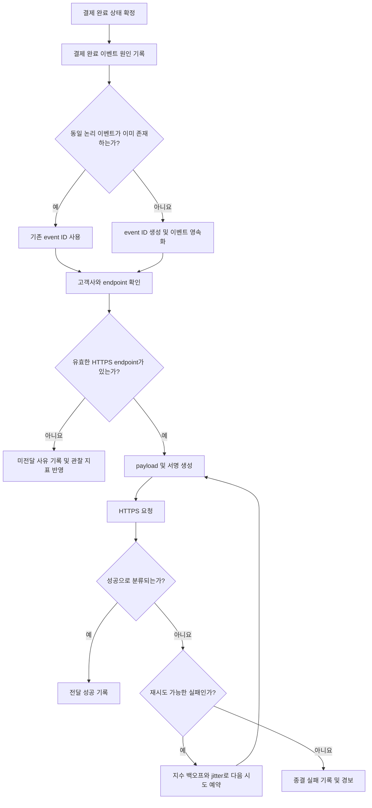

# 결제 완료 웹훅 전달 API PRD

## 1. 문서 개요

- 기능명: 결제 완료 웹훅 전달 API
- 상태: Draft
- 대상 출시: 1차 출시
- 범위: 백엔드 이벤트 생성 및 HTTPS 웹훅 전달
- UI: 없음
- 목적: 고객사가 결제 완료 사실을 자사 시스템에 비동기적으로 반영할 수 있도록 신뢰성 있는 이벤트 전달 기능을 제공한다.

---

## 2. 적용성

| 계약 항목 | 적용 여부 | 근거 |
|---|---|---|
| 문제, 목표, 비목표 | Required | 신규 전달 기능의 범위와 출시 경계를 정의해야 함 |
| 사용자·역할·권한 | Required | 고객사별 endpoint 및 이벤트 데이터 격리가 필요함 |
| 기능 요구사항 | Required | 이벤트 생성, 서명, 전달, 재시도 동작을 구현해야 함 |
| 화면·라우트 | N/A | 이번 범위에 UI가 없으며 endpoint 등록은 기존 내부 API가 담당함 |
| 사용자 화면 상태 매트릭스 | N/A | 사용자에게 노출되는 화면이 없음 |
| 시스템 흐름 | Required | 결제 완료부터 전달 및 재시도까지 다단계 생명주기가 존재함 |
| 인증·인가·데이터 경계 | Required | 고객사별 데이터 격리가 명시적 요구사항임 |
| 수치형 성능 NFR | N/A | 처리량과 지연 기준이 측정되지 않았으며 근거 있는 목표치가 없음 |
| 인수 조건 | Required | 최소 1회 전달, event ID, 격리 및 재시도를 검증해야 함 |
| 단계별 출시 기준 | Required | 미결 보안 결정과 운영 준비 상태를 출시 전에 확인해야 함 |

---

## 3. 배경 및 문제

현재 결제가 완료되어도 고객사 시스템에 해당 사실을 능동적으로 전달하는 표준화된 수단이 없다. 고객사가 결제 결과를 주기적으로 조회하지 않고 후속 처리를 수행하려면, 결제 완료 시 등록된 HTTPS endpoint로 이벤트를 비동기 전달하는 기능이 필요하다.

인터넷을 통한 전달은 타임아웃, 연결 실패, 일시적인 수신 서버 장애 등으로 실패할 수 있다. 따라서 시스템은 실패한 전달을 재시도해야 한다. 이 과정에서 같은 이벤트가 여러 번 전달될 수 있으므로 고객사가 중복을 식별할 수 있는 안정적인 event ID를 제공해야 한다.

---

## 4. 목표

- 결제가 완료되면 해당 결제를 소유한 고객사의 등록된 HTTPS endpoint로 이벤트를 전달한다.
- 전달 이벤트마다 전역적으로 고유하고 재시도 간 변하지 않는 event ID를 제공한다.
- 네트워크 실패 시 지수 백오프 정책에 따라 자동 재시도한다.
- 최소 1회 전달(at-least-once delivery) 의미론을 제공한다.
- 고객사 간 endpoint, 결제 데이터, 이벤트 및 전달 이력을 격리한다.
- 요청 서명을 포함할 수 있는 전달 계약을 마련하고, 확정된 보안 정책을 구현한 후 출시한다.
- 향후 처리량 및 지연 SLA를 정할 수 있도록 운영 지표를 수집한다.

---

## 5. 비목표

1차 출시에는 다음 항목을 포함하지 않는다.

- endpoint 등록·수정·삭제 UI
- endpoint 등록용 신규 공개 API
- replay 대시보드
- 고객사 또는 운영자의 수동 재전송
- 정확히 1회 전달(exactly-once delivery)
- 이벤트 전달 순서 보장
- 처리량 또는 전달 지연에 대한 수치형 SLA
- 결제 완료 이외 이벤트 유형
- 고객사 수신 시스템의 중복 제거 처리

수동 재전송을 제외하는 것은 자동 재시도를 제거한다는 의미가 아니다.

---

## 6. 사용자, 역할 및 권한

| 역할 | 권한 및 책임 |
|---|---|
| 고객사 수신 시스템 | 자사에 속한 결제 완료 이벤트를 수신하고 event ID를 기준으로 중복 처리 방지 |
| 기존 내부 endpoint 관리 주체 | 고객사와 연결된 HTTPS endpoint 및 관련 설정 등록·변경 |
| 결제 시스템 | 결제 완료 상태를 확정하고 웹훅 이벤트 생성의 원인이 되는 신호 발생 |
| 웹훅 전달 시스템 | 이벤트 저장, 고객사 endpoint 조회, 요청 생성, 자동 재시도 및 결과 기록 |
| 보안 담당자 | 서명 검증 방식, secret 관리 및 rotation 정책 결정 |
| 운영 담당자 | 시스템 지표와 로그를 통해 실패 및 적체를 관찰하되 1차 출시에서는 수동 재전송하지 않음 |

endpoint를 알고 있다는 사실만으로 다른 고객사의 이벤트나 전달 이력에 접근할 수 있어서는 안 된다.

---

## 7. 핵심 용어 및 전달 의미론

- **Payment completion:** 결제 도메인에서 결제가 최종 완료 상태로 확정된 상태 전이.
- **Event:** 한 번의 결제 완료 사실을 나타내는 논리적 레코드.
- **Delivery attempt:** 동일 이벤트를 고객사 endpoint에 한 번 HTTP 요청한 기록.
- **Event ID:** 논리적 이벤트의 고유 식별자. 모든 재시도에서 동일하다.
- **Attempt ID:** 개별 전달 시도를 구분하는 내부 식별자. 고객사 공개 여부는 필수가 아니다.
- **최소 1회 전달:** 이벤트가 유실되지 않도록 실패 시 재시도하지만, 장애 경계에서 같은 event ID가 중복 전달될 수 있는 방식.
- **전달 성공:** 합리적 가정에 따라 고객사 endpoint가 HTTP 2xx 응답을 반환한 경우. 미결 정책이 이를 변경하면 전달 상태와 인수 조건도 함께 갱신해야 한다.

---

## 8. 기능 요구사항

| ID | 요구사항 | 우선순위 |
|---|---|---|
| FR-001 | 결제가 완료 상태로 확정되면 해당 결제에 대응하는 `payment.completed` 이벤트를 생성해야 한다. | Must |
| FR-002 | 이벤트 생성은 결제 완료 처리를 직접 실패시키지 않는 비동기 경계로 구성하되, 결제 완료 사실과 전달 대상 이벤트 사이의 유실을 방지해야 한다. | Must |
| FR-003 | 동일한 논리적 결제 완료 신호가 중복 처리되어도 별개의 고객사 이벤트가 중복 생성되지 않아야 한다. | Must |
| FR-004 | 각 이벤트에는 전역적으로 고유한 event ID가 있어야 하며, 동일 이벤트의 모든 전달 시도에서 값이 유지되어야 한다. | Must |
| FR-005 | 이벤트는 소유 고객사의 현재 유효한 등록 endpoint에만 전달되어야 한다. | Must |
| FR-006 | 전달 대상 URL은 HTTPS scheme이어야 한다. HTTPS가 아닌 endpoint에는 요청을 보내지 않아야 한다. | Must |
| FR-007 | 요청 본문에는 최소한 event ID, 이벤트 유형, 이벤트 발생 시각, 스키마 버전 및 결제 완료 데이터가 포함되어야 한다. | Must |
| FR-008 | 고객사가 event ID를 이용해 중복 요청을 판별할 수 있도록 event ID를 요청 본문 또는 명세된 헤더에 노출해야 한다. | Must |
| FR-009 | 각 요청에는 보안 담당자가 확정한 방식으로 검증 가능한 서명 또는 동등한 인증 정보를 포함해야 한다. | Must, 정책 확정 필요 |
| FR-010 | 서명 대상 바이트, 알고리즘, timestamp 포함 여부, 헤더 형식 및 허용 시간 오차를 하나의 버전된 검증 계약으로 정의해야 한다. | Must, 정책 확정 필요 |
| FR-011 | 네트워크 연결 실패, DNS 실패 및 응답 타임아웃이 발생하면 설정된 지수 백오프 정책으로 같은 이벤트를 자동 재시도해야 한다. | Must |
| FR-012 | HTTP 응답 코드별 성공, 재시도, 영구 실패 분류는 출시 전 확정된 정책을 따라야 한다. | Must, 정책 확정 필요 |
| FR-013 | 재시도 시 event ID와 논리적 이벤트 payload는 동일하게 유지되어야 한다. 전달 시각·서명처럼 시도별 필드만 변경될 수 있다. | Must |
| FR-014 | 재시도 정책은 초기 지연, 증가 배수, 최대 지연, jitter, 최대 시도 횟수 또는 최대 재시도 기간을 설정 가능하게 지원해야 한다. 구체 값은 측정 및 운영 정책으로 결정한다. | Must |
| FR-015 | 각 전달 시도에 대해 고객사 ID, event ID, 시도 시각, 결과 분류, HTTP 상태 코드, 지연 시간 및 다음 재시도 예정 여부를 기록해야 한다. | Must |
| FR-016 | 로그 및 저장 데이터에는 secret, 서명 생성 키, 결제수단 원문 등 민감정보가 노출되지 않아야 한다. | Must |
| FR-017 | 이벤트, endpoint 및 전달 이력 조회·처리 시 고객사 ID를 데이터 경계의 필수 조건으로 사용해야 한다. | Must |
| FR-018 | 한 고객사의 endpoint 오류나 처리 적체가 다른 고객사의 전달을 부당하게 차단하지 않도록 고객사 단위 격리 또는 공정성 제어가 가능해야 한다. | Must |
| FR-019 | endpoint가 없거나 비활성인 고객사의 이벤트는 외부 URL로 전달하지 않고 사유를 관찰 가능한 상태로 기록해야 한다. | Must |
| FR-020 | endpoint 변경 시 이미 생성되어 대기 또는 재시도 중인 이벤트가 어느 endpoint로 전달될지 일관된 정책을 적용해야 한다. | Must, 정책 확정 필요 |
| FR-021 | 자동 재시도 한도에 도달한 이벤트는 더 이상 자동 요청하지 않는 종결 상태로 전환하고 운영 지표 및 경보 대상이 되게 해야 한다. | Must |
| FR-022 | 1차 출시에서는 고객사나 운영자에게 수동 재전송 인터페이스를 제공하지 않아야 한다. | Must |
| FR-023 | 이벤트 payload 스키마는 버전 필드를 포함하고, 기존 고객사의 파싱을 깨는 변경을 명시적 버전 변경 없이 배포하지 않아야 한다. | Must |
| FR-024 | 동일 결제에 취소·환불 등 후속 상태 변화가 발생해도 이미 생성된 결제 완료 이벤트의 의미와 event ID를 변경하지 않아야 한다. | Must |

---

## 9. 제안 이벤트 계약

아래는 구현을 시작할 수 있게 하는 논리적 형태이며, 필드명과 결제 데이터의 상세 범위는 열린 결정이다.

```json
{
  "id": "evt_...",
  "type": "payment.completed",
  "schema_version": "1",
  "created_at": "RFC3339 timestamp",
  "data": {
    "payment_id": "customer-visible payment identifier",
    "status": "completed",
    "completed_at": "RFC3339 timestamp",
    "amount": {
      "value": "decimal or minor-unit representation",
      "currency": "ISO 4217 currency code"
    }
  }
}
```

계약 원칙:

- `id`는 재시도 간 변경되지 않는다.
- 고객사 ID, 내부 라우팅 키, secret 등 내부 정보는 필요하지 않다면 payload에 포함하지 않는다.
- 금액 표현은 부동소수점 오차가 발생하지 않는 형식으로 확정해야 한다.
- nullable 필드와 선택 필드는 스키마 문서에 명시한다.
- 서명 헤더는 보안 정책 확정 후 별도로 명세한다.

---

## 10. 시스템 흐름



---

## 11. 상태 모델

| 상태 | 의미 | 허용되는 다음 상태 |
|---|---|---|
| `pending` | 이벤트가 저장되었고 첫 전달을 기다림 | `delivering`, `undeliverable` |
| `delivering` | 현재 전달 시도 진행 중 | `delivered`, `retry_scheduled`, `failed` |
| `retry_scheduled` | 재시도 가능 실패 후 다음 시도를 기다림 | `delivering`, `failed` |
| `delivered` | 성공 응답을 기록한 종결 상태 | 없음 |
| `failed` | 영구 실패 또는 자동 재시도 한도 도달 | 없음 |
| `undeliverable` | 유효한 endpoint가 없어 요청하지 못함 | 정책 결정에 따라 종결 또는 자동 회복 |

프로세스 장애로 `delivering` 상태가 고착되지 않도록 lease, timeout 또는 동등한 복구 방식이 필요하다. 특정 구현 방식은 강제하지 않는다.

---

## 12. 인증, 인가 및 데이터 경계

### 12.1 고객사 격리

- 결제, 이벤트, endpoint 및 전달 시도는 모두 하나의 고객사 소유권에 연결되어야 한다.
- 전달 작업은 이벤트에 기록된 고객사와 endpoint의 고객사가 일치할 때만 요청을 수행해야 한다.
- 고객사 식별자가 누락되거나 소유권이 불일치하면 요청을 보내지 않고 보안 오류로 기록해야 한다.
- 저장소 조회, 작업 큐 소비 및 운영 도구 조회에서도 고객사 조건이 누락되어서는 안 된다.
- 한 고객사의 secret으로 다른 고객사의 이벤트 서명을 생성해서는 안 된다.
- 격리 검증은 애플리케이션 테스트뿐 아니라 사용 중인 저장소 및 메시징 경계에도 적용해야 한다.

### 12.2 endpoint 보안

- HTTPS만 허용한다.
- redirect 허용 여부와 허용 시 검증 방식은 출시 전에 결정해야 한다.
- DNS rebinding, 사설망·loopback·link-local·클라우드 메타데이터 주소 접근 등 SSRF 위험을 차단해야 한다.
- endpoint URL 또는 DNS 결과가 변경되어도 내부 네트워크 접근 방지 정책이 유지되어야 한다.
- TLS 인증서 검증을 우회해서는 안 된다.

### 12.3 secret 관리

- secret은 고객사별로 격리한다.
- 저장 시 평문 노출을 방지하고 접근 권한을 최소화한다.
- 애플리케이션 로그, 오류 메시지 및 추적 데이터에 secret을 기록하지 않는다.
- rotation 중 이전 secret과 신규 secret의 동시 허용 여부 및 기간은 보안 담당자 결정 후 명세한다.

---

## 13. 비기능 요구사항

| ID | 요구사항 |
|---|---|
| NFR-001 | 결제 완료 경로와 외부 endpoint 호출을 분리하여 고객사 endpoint 지연이 결제 완료 응답을 직접 지연시키지 않아야 한다. |
| NFR-002 | 이벤트가 영속화된 이후 작업 프로세스가 재시작되어도 미완료 이벤트를 복구할 수 있어야 한다. |
| NFR-003 | 전달 요청에는 무한 대기를 방지하는 연결 및 응답 timeout이 적용되어야 한다. 구체 값은 운영 측정 후 확정한다. |
| NFR-004 | 재시도에는 동시 재시도 집중을 완화하기 위한 jitter가 포함되어야 한다. |
| NFR-005 | 처리량 제한과 backpressure를 적용할 수 있어야 하며, 한 고객사의 장애가 전체 작업자를 고갈시키지 않아야 한다. |
| NFR-006 | event ID를 기준으로 이벤트 생성부터 각 전달 시도까지 추적할 수 있어야 한다. |
| NFR-007 | 이벤트 payload와 전달 이력의 보존 기간 및 삭제 정책은 개인정보·결제 데이터 정책과 일치해야 한다. 구체 기간은 별도 결정한다. |
| NFR-008 | 스키마 및 서명 계약 변경은 버전 호환성 검증을 거쳐야 한다. |

수치형 성능 목표는 설정하지 않는다. 대신 아래 지표를 출시 시점부터 측정한다.

- 결제 완료부터 이벤트 영속화까지의 지연
- 이벤트 영속화부터 첫 전달 시도까지의 지연
- 결제 완료부터 최초 성공까지의 end-to-end 지연
- 시간 구간별 생성량 및 전달 시도량
- 성공률 및 재시도율
- HTTP 상태 코드와 실패 원인별 건수
- 고객사별 대기열 깊이 및 최고 대기 시간
- 자동 재시도 소진 건수
- endpoint 미등록·비활성 이벤트 건수

SLA/SLO 수치와 용량 목표는 운영 데이터가 축적된 후 제품·운영·인프라 담당자가 결정한다.

---

## 14. 인수 조건

| ID | 연결 요구사항 | Given | When | Then | 검증 방법 |
|---|---|---|---|---|---|
| AC-001 | FR-001, FR-004 | 유효한 endpoint를 가진 고객사의 결제가 완료됨 | 결제 완료 이벤트가 처리됨 | 고유한 event ID를 가진 `payment.completed` 이벤트가 한 개 생성됨 | 통합 테스트 |
| AC-002 | FR-003 | 동일한 논리적 결제 완료 신호가 두 번 입력됨 | 두 입력이 처리됨 | 논리적 이벤트와 event ID는 하나만 존재함 | 동시성 포함 통합 테스트 |
| AC-003 | FR-005, FR-017 | 고객사 A와 B가 서로 다른 endpoint를 가짐 | A의 결제가 완료됨 | A의 endpoint에만 A의 이벤트가 전달되고 B에는 요청되지 않음 | 격리 통합 테스트 |
| AC-004 | FR-006 | 등록 endpoint가 HTTP URL임 | 전달 대상이 평가됨 | 외부 요청 없이 유효성 실패가 기록됨 | 통합 테스트 |
| AC-005 | FR-004, FR-008, FR-013 | 첫 전달이 실패함 | 같은 이벤트가 재시도됨 | 모든 요청에서 동일한 event ID를 확인할 수 있음 | mock endpoint 통합 테스트 |
| AC-006 | FR-011, FR-014 | endpoint 연결이 실패함 | 재시도 스케줄러가 실행됨 | 설정된 지수 백오프 및 jitter 범위에 따라 다음 시도가 예약됨 | 결정론적 clock 기반 테스트 |
| AC-007 | FR-015 | 전달 성공 또는 실패가 발생함 | 시도가 종료됨 | event ID, 결과, 시각, 지연 및 상태 코드 또는 실패 원인이 기록됨 | 통합 테스트 |
| AC-008 | FR-009, FR-010 | 보안 담당자가 확정한 secret과 서명 계약이 적용됨 | 웹훅 요청이 생성됨 | 고객사가 명세된 방식으로 요청 무결성과 발신자를 검증할 수 있음 | 공식 검증 벡터 및 통합 테스트 |
| AC-009 | FR-016 | 전달 및 오류 로그가 생성됨 | 로그를 검사함 | secret 및 금지된 민감정보가 평문으로 존재하지 않음 | 자동 로그 검사 |
| AC-010 | FR-017 | 이벤트 고객사와 endpoint 고객사가 다름 | 작업자가 전달을 시도함 | 외부 요청이 차단되고 보안 오류가 기록됨 | 부정 통합 테스트 |
| AC-011 | FR-018 | 고객사 A endpoint가 지속적으로 실패하고 B endpoint는 정상임 | 두 고객사의 이벤트가 함께 처리됨 | A의 재시도가 B의 전달 진행을 고갈시키지 않음 | 격리·부하 시나리오 테스트 |
| AC-012 | FR-019 | 고객사에 유효한 endpoint가 없음 | 결제가 완료됨 | 외부 요청은 발생하지 않고 미전달 사유가 기록됨 | 통합 테스트 |
| AC-013 | FR-021 | 이벤트가 확정된 자동 재시도 한도에 도달함 | 마지막 시도가 실패함 | 이벤트가 종결 실패 상태가 되고 추가 자동 요청이 예약되지 않음 | 상태 전이 테스트 |
| AC-014 | FR-002, NFR-002 | 이벤트 저장 후 전달 작업자가 종료됨 | 작업자가 재시작됨 | 미완료 이벤트가 유실되지 않고 다시 처리 대상이 됨 | 장애 복구 테스트 |
| AC-015 | FR-023 | 기존 v1 고객사가 이벤트를 파싱하고 있음 | 호환되지 않는 payload 변경이 배포됨 | v1을 조용히 변경하지 않고 새 스키마 버전으로 구분됨 | 계약 테스트 |
| AC-016 | FR-022 | 1차 출시 빌드가 준비됨 | 외부 및 운영 인터페이스를 검사함 | replay 대시보드와 수동 재전송 기능이 존재하지 않음 | 범위 검토 |
| AC-017 | endpoint 보안 | endpoint가 사설망 또는 금지 주소로 해석됨 | 전달을 시도함 | 요청이 차단되고 보안 이벤트가 기록됨 | SSRF 보안 테스트 |
| AC-018 | NFR-001 | 고객사 endpoint가 응답하지 않음 | 결제가 완료됨 | 외부 요청 timeout과 무관하게 결제 완료 처리가 정상 종료됨 | 통합 테스트 |

---

## 15. 합리적 가정

다음은 브리프를 변경하지 않으면서 구현을 진행하기 위한 가역적 가정이다.

1. 기존 내부 API가 endpoint와 고객사 소유권을 검증해 저장하며, 전달 시스템은 그 저장 결과를 읽을 수 있다.
2. 결제 완료는 결제 도메인의 최종 상태 전이이며, 단순 승인 요청이나 처리 중 상태는 이벤트를 발생시키지 않는다.
3. 고객사별 활성 endpoint는 1차 출시에서 하나다. 다중 endpoint가 필요하면 fan-out 및 부분 성공 의미론을 별도로 정의해야 한다.
4. HTTP 2xx 응답은 전달 성공으로 간주한다.
5. 네트워크 실패뿐 아니라 일시적 서버 오류와 rate limit 응답도 재시도 후보가 될 가능성이 높다. 단, 정확한 HTTP 분류는 열린 결정이다.
6. 이벤트 간 전달 순서는 보장하지 않으며 고객사는 event ID와 결제 상태를 기준으로 멱등 처리한다.
7. 재시도로 요청을 다시 만들 때 event ID와 비즈니스 payload는 유지되지만 timestamp 기반 서명 값은 변경될 수 있다.
8. 결제 완료 신호와 웹훅 이벤트 사이의 유실 방지를 위해 transactional outbox 또는 동등한 내구성 패턴을 사용할 수 있다. PRD는 특정 기술을 강제하지 않는다.
9. replay와 수동 재전송이 제외되어도 실패 이력과 원본 이벤트는 정해진 보존 정책에 따라 저장한다. 그래야 장애 분석과 향후 기능 확장이 가능하다.

---

## 16. 열린 결정

### 출시 차단 결정

| ID | 결정 사항 | 결정권자 | 결정 시점 | 영향 |
|---|---|---|---|---|
| OD-001 | 서명 알고리즘과 헤더 형식 | 보안 담당자 | 외부 연동 테스트 전 | FR-009, FR-010 및 고객사 검증 구현 |
| OD-002 | 서명 대상 원문, timestamp·nonce 포함 여부와 허용 시간 오차 | 보안 담당자 | 외부 연동 테스트 전 | 재전송 공격 방어 및 공식 검증 벡터 |
| OD-003 | secret 생성·저장 방식, rotation 주기, overlap 기간 및 폐기 절차 | 보안 담당자 | 운영 출시 전 | 무중단 rotation 및 사고 대응 |
| OD-004 | HTTP 상태 코드별 성공·재시도·영구 실패 분류 | 제품·플랫폼·운영 | 구현 확정 전 | 최소 1회 전달의 실제 동작 |
| OD-005 | 자동 재시도 최대 횟수 또는 최대 기간과 백오프 설정값 | 플랫폼·운영 | 운영 출시 전 | 복구 가능 기간, 비용 및 적체 규모 |
| OD-006 | endpoint 변경 시 대기·재시도 이벤트가 기존 URL과 신규 URL 중 어느 곳을 사용하는지 | 제품·플랫폼 | 구현 확정 전 | 이벤트 라우팅 일관성 |
| OD-007 | 유효한 endpoint가 없는 이벤트를 endpoint 등록 후 자동 전달할지 종결할지 | 제품·운영 | 구현 확정 전 | `undeliverable` 상태와 자동 동작 |
| OD-008 | redirect 허용 여부 및 redirect 대상 재검증 정책 | 보안 담당자 | 보안 테스트 전 | SSRF 및 목적지 통제 |

### 출시 후 측정으로 결정 가능한 항목

| ID | 결정 사항 | 필요한 근거 | 결정권자 |
|---|---|---|---|
| OD-009 | 처리량 및 동시성 목표 | 실제 이벤트 생성량, burst, 고객사 분포 | 제품·플랫폼·인프라 |
| OD-010 | 전달 지연 SLO/SLA | 첫 시도 및 성공 지연 분포 | 제품·운영 |
| OD-011 | timeout 및 rate limit 수치 | endpoint 응답 분포와 작업자 자원 사용량 | 플랫폼·운영 |
| OD-012 | 이벤트 및 전달 이력 보존 기간 | 장애 분석 필요, 개인정보·결제 데이터 정책, 저장 비용 | 보안·법무·운영 |
| OD-013 | replay 대시보드와 수동 재전송 도입 시점 | 종결 실패량과 고객 지원 수요 | 제품·운영 |

### payload 계약 결정

- 외부에 노출할 결제 식별자의 종류
- 금액 표현 방식
- 주문·구매자·결제수단 관련 필드 포함 여부
- 개인정보 및 민감 결제 데이터 최소화 기준
- nullable 및 선택 필드 규칙
- 이벤트 콘텐츠 타입과 문자 인코딩
- event ID를 함께 노출할 표준 헤더명

---

## 17. 위험 및 완화책

| 위험 | 영향 | 완화 |
|---|---|---|
| 이벤트 생성 전 프로세스 장애 | 결제 완료 이벤트 영구 유실 | 결제 완료 사실과 이벤트 생성 사이에 내구성 있는 원자적 경계 적용 |
| 응답 유실로 인한 중복 전달 | 고객사 중복 후속 처리 | 안정적인 event ID 제공 및 고객사 멱등 처리 가이드 |
| 대규모 endpoint 장애 | 재시도 폭증과 전체 지연 | 지수 백오프, jitter, backpressure, 고객사별 공정성 제어 |
| 고객사 간 라우팅 오류 | 데이터 유출 | 고객사 소유권 필수 검증 및 교차 고객사 부정 테스트 |
| 악성 endpoint 등록 | 내부망 접근 또는 데이터 유출 | HTTPS 강제, SSRF 방어, TLS 검증, redirect 정책 |
| secret 유출 | 위조 이벤트 생성 | 격리 저장, 로그 마스킹, 최소 권한, rotation 절차 |
| rotation 정책 미확정 | 고객사 검증 중단 또는 장기 키 노출 | 보안 결정과 공식 검증 벡터를 출시 게이트로 지정 |
| 근거 없는 재시도 한도 | 너무 빠른 포기 또는 무한 적체 | 설정 가능하게 구현하고 운영 정책으로 수치 확정 |
| 스키마의 비호환 변경 | 고객사 수신 장애 | 스키마 버전 및 계약 테스트 |
| UI·수동 재전송 부재 | 종결 실패 복구 지연 | 명확한 경보와 운영 runbook 마련; 기능 자체는 후속 범위로 유지 |

---

## 18. 운영 준비 요구사항

1차 출시 전에 다음 항목이 준비되어야 한다.

- event ID 기반 로그 및 추적
- 생성량, 성공률, 재시도율, 종결 실패 및 대기열 적체 지표
- 고객사별 이상 트래픽을 식별할 수 있는 지표
- secret과 payload 민감정보 로그 노출 검사
- 자동 재시도 적체 및 종결 실패 경보
- 전달 시스템 장애 시 대응 runbook
- 서명 검증 예제와 공식 테스트 벡터
- 고객사용 중복 처리 및 응답 코드 가이드
- 수동 재전송 없이 처리해야 하는 장애 상황에 대한 운영 절차

경보 임계값은 관측 데이터 없이 임의로 정하지 않고, 출시 전 테스트와 초기 운영 데이터를 바탕으로 확정한다.

---

## 19. 전달 단계 및 출시 기준

| 단계 | 포함 요구사항 | 검증 가능한 종료 조건 |
|---|---|---|
| 1. 이벤트 기반 마련 | FR-001~FR-004, FR-023, FR-024 | 중복 결제 완료 신호에도 안정적인 event ID를 가진 이벤트가 유실 없이 생성됨 |
| 2. 격리된 HTTPS 전달 | FR-005~FR-008, FR-017~FR-020 | 올바른 고객사의 유효한 HTTPS endpoint에만 버전된 payload가 전달됨 |
| 3. 자동 재시도 | FR-011~FR-015, FR-021 | 실패 분류와 확정된 백오프 정책에 따라 재시도하고 각 시도가 추적됨 |
| 4. 보안 계약 적용 | FR-009, FR-010, FR-016 | 확정된 서명·secret 정책, 공식 검증 벡터 및 SSRF 테스트를 통과함 |
| 5. 운영 출시 준비 | FR-018, FR-022 및 NFR 전체 | 복구 테스트, 고객사 격리 테스트, 관측 지표, 경보와 runbook이 준비됨 |
| 6. 1차 출시 승인 | 전체 Must 요구사항 | 모든 인수 조건이 통과하고 OD-001~OD-008이 문서화되어 승인됨 |

---

## 20. 출시 완료 정의

다음 조건을 모두 만족해야 1차 출시가 완료된 것으로 본다.

- 결제 완료 이벤트가 내구성 있게 생성된다.
- 동일 논리 이벤트의 event ID가 재시도 간 유지된다.
- 고객사별 등록 HTTPS endpoint로만 이벤트가 전달된다.
- 확정된 실패 분류와 지수 백오프 정책에 따라 자동 재시도된다.
- 서명 검증 및 secret rotation 정책이 보안 담당자의 승인을 받았고 구현·검증되었다.
- 교차 고객사 데이터 및 secret 격리 테스트를 통과했다.
- 장애 복구, SSRF, 중복 전달 및 재시도 소진 시나리오가 검증되었다.
- 운영 지표, 경보 및 runbook이 준비되었다.
- replay 대시보드와 수동 재전송은 포함되지 않았다.
- 측정 근거가 없는 처리량 및 지연 SLA가 출시 계약에 포함되지 않았다.