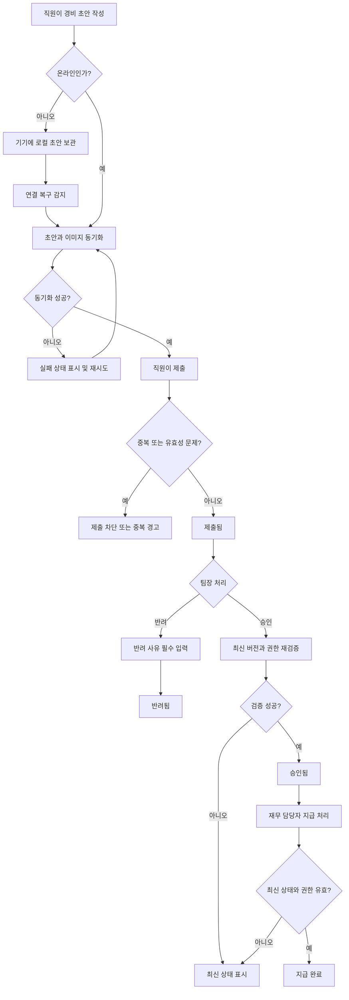

# 모바일 경비 승인 PRD

## 1. 문서 개요

- 기능명: 모바일 경비 승인
- 문서 상태: Draft
- 대상 출시: 1차 출시(MVP)
- 목적: 직원의 경비 제출부터 팀장 승인·반려, 재무 담당자의 지급 완료 처리까지 모바일 환경에서 일관되고 감사 가능한 흐름을 제공한다.

---

## 2. 적용 범위

| 계약 항목 | 적용 여부 | 근거 |
|---|---|---|
| 사용자 화면 및 경로 | Required | 직원·팀장·재무 담당자가 사용하는 사용자 노출 기능이다. |
| 화면 상태 매트릭스 | Required | 오프라인, 업로드 실패, 동기화 충돌 등 복구 가능한 상태를 다뤄야 한다. |
| 사용자·시스템 흐름 | Required | 작성 → 제출 → 승인/반려 → 지급 완료의 다단계 생명주기가 있다. |
| 서버 권한 및 데이터 경계 | Required | 팀 소속 및 역할에 따라 열람·처리 가능한 요청이 달라진다. |
| 접근성 요구사항 | Required | WCAG 2.2 AA가 명시된 목표다. |
| 정량 성능 목표 | N/A | 측정 전이므로 출시 전 기준값을 임의로 정하지 않는다. 측정 지표와 결정 절차만 정의한다. |
| 다중 통화 | N/A | 1차 출시 범위에서 제외된다. |
| ERP 자동 연동 | N/A | 1차 출시 범위에서 제외된다. |

---

## 3. 배경과 문제

현재 경비 처리 과정에서 영수증과 금액 정보가 분산되고, 승인 상태를 추적하기 어렵거나 모바일에서 즉시 처리하지 못할 수 있다. 네트워크가 불안정한 환경에서는 작성 내용이 유실될 수 있으며, 중복 제출이나 승인 도중의 동시 변경은 이중 지급 또는 잘못된 승인으로 이어질 수 있다.

직원, 팀장, 재무 담당자가 각자 허용된 범위에서 동일한 경비 요청의 상태를 확인하고 처리할 수 있어야 하며, 모든 주요 상태 변경은 서버에서 권한과 최신 상태를 검증한 후 기록되어야 한다.

---

## 4. 목표

- 직원이 모바일에서 영수증 사진, 금액, 카테고리를 입력해 경비를 제출할 수 있다.
- 오프라인에서 작성한 초안을 유실 없이 보관하고 연결 복구 후 동기화한다.
- 팀장은 자신이 담당하는 팀의 제출 건만 승인하거나 반려할 수 있다.
- 반려 시 사유를 필수로 기록한다.
- 재무 담당자는 승인된 요청만 지급 완료로 처리할 수 있다.
- 중복 제출, 이미지 업로드 실패, 권한 변경 및 동시 상태 변경을 안전하게 처리한다.
- 경비 요청의 상태 변경 이력을 감사 가능하게 보존한다.
- 주요 사용자 흐름이 WCAG 2.2 AA를 충족하도록 설계하고 검증한다.

## 5. 비목표

1차 출시에서는 다음을 지원하지 않는다.

- 다중 통화 및 환율 계산
- ERP 자동 전표 생성 또는 자동 지급 연동
- 영수증 OCR을 통한 금액·카테고리 자동 입력
- 분할 승인 또는 다단계 승인
- 부분 지급
- 승인 완료 후 경비 내용의 직접 수정
- 오프라인 승인·반려·지급 완료 처리
- 회계 정책에 따른 자동 적격성 판정

---

## 6. 사용자와 역할

| 역할 | 주요 권한 |
|---|---|
| 직원 | 자신의 초안 작성·수정·삭제·동기화, 자신의 경비 제출, 자신의 요청 및 처리 결과 조회 |
| 팀장 | 자신이 현재 담당하는 팀에 귀속된 제출 건 조회, 승인, 반려 |
| 재무 담당자 | 승인된 요청 조회, 지급 완료 처리, 처리 이력 조회 |
| 시스템 | 권한 검증, 중복 방지, 동기화·충돌 감지, 상태 전이 검증, 감사 로그 기록 |

한 사용자가 복수 역할을 가질 수 있지만, 각 작업은 해당 작업에 필요한 서버 권한을 별도로 검증한다.

---

## 7. 핵심 데이터

### 경비 요청

- 경비 요청 ID
- 클라이언트 생성 ID
- 제출자 사용자 ID
- 제출 당시 팀 ID
- 금액
- 통화
- 카테고리
- 영수증 이미지 참조
- 상태
- 반려 사유
- 생성·수정·제출·승인·반려·지급 완료 시각
- 각 상태 처리자 ID
- 버전 번호
- 최근 동기화 시각

### 감사 이력

- 대상 경비 요청 ID
- 작업 유형
- 변경 전·후 상태
- 작업자 ID
- 작업 시각
- 요청 버전
- 반려 사유 또는 실패 사유
- 중복 방지용 작업 ID

감사 이력은 일반 사용자가 수정하거나 삭제할 수 없어야 한다.

---

## 8. 상태 모델

| 상태 | 설명 | 허용되는 다음 상태 |
|---|---|---|
| 로컬 초안 | 기기에만 저장되었거나 서버 동기화 전인 초안 | 동기화된 초안 |
| 동기화 중 | 서버로 초안 또는 이미지를 전송 중 | 동기화된 초안, 동기화 실패 |
| 동기화 실패 | 전송 또는 충돌 해결이 필요한 상태 | 동기화 중 |
| 동기화된 초안 | 서버에 저장됐지만 제출되지 않은 상태 | 제출됨 |
| 제출됨 | 팀장 검토 대기 상태 | 승인됨, 반려됨 |
| 승인됨 | 팀장 승인 완료, 지급 대기 상태 | 지급 완료 |
| 반려됨 | 반려 사유와 함께 종료된 상태 | 없음 |
| 지급 완료 | 재무 처리 완료 상태 | 없음 |

1차 출시에서 제출 이후의 금액, 카테고리 및 영수증은 수정할 수 없다. 수정이 필요하면 기존 요청을 반려하고 직원이 새 요청을 작성한다.

---

## 9. 기능 요구사항

| ID | 요구사항 | 우선순위 |
|---|---|---|
| FR-001 | 직원은 영수증 사진을 촬영하거나 기기에서 선택해 초안에 첨부할 수 있어야 한다. | Must |
| FR-002 | 직원은 0보다 큰 금액과 지원 카테고리를 입력해야 한다. | Must |
| FR-003 | 시스템은 금액을 조직의 단일 기준 통화로 저장하고 화면에 통화 단위를 표시해야 한다. | Must |
| FR-004 | 직원은 제출 전 자신의 초안을 생성·조회·수정·삭제할 수 있어야 한다. | Must |
| FR-005 | 제출하려면 금액, 카테고리 및 업로드가 완료된 영수증 이미지가 모두 있어야 한다. | Must |
| FR-006 | 시스템은 제출 성공 후 요청 ID와 제출 상태를 직원에게 표시해야 한다. | Must |
| FR-007 | 직원은 자신의 경비 요청 목록과 현재 상태, 반려 사유를 조회할 수 있어야 한다. | Must |
| FR-008 | 오프라인에서 입력한 초안과 선택한 이미지는 기기에 보관되고 연결 복구 후 동기화되어야 한다. | Must |
| FR-009 | 동기화 성공 전까지 로컬 초안을 삭제하지 않아야 하며, 사용자에게 동기화 상태를 표시해야 한다. | Must |
| FR-010 | 이미지 업로드가 실패하면 입력 내용을 유지하고 실패 상태, 원인 범주, 재시도 수단을 제공해야 한다. | Must |
| FR-011 | 시스템은 동일한 클라이언트 생성 ID 또는 제출 작업 ID의 재전송을 하나의 요청으로 처리해야 한다. | Must |
| FR-012 | 시스템은 동일 직원이 유사한 금액·카테고리·영수증으로 제출한 기존 요청이 있으면 잠재적 중복을 경고해야 한다. | Should |
| FR-013 | 팀장은 자신이 현재 담당하며 요청에 기록된 팀의 ‘제출됨’ 요청만 조회하고 처리할 수 있어야 한다. | Must |
| FR-014 | 팀장은 최신 버전의 ‘제출됨’ 요청을 승인할 수 있어야 한다. | Must |
| FR-015 | 팀장은 반려 사유를 입력해야만 요청을 반려할 수 있어야 한다. 공백만 있는 사유는 허용하지 않는다. | Must |
| FR-016 | 재무 담당자는 ‘승인됨’ 상태인 요청만 지급 완료로 표시할 수 있어야 한다. | Must |
| FR-017 | 모든 조회 및 상태 변경에서 서버가 현재 역할, 팀 담당 관계, 요청 상태를 재검증해야 한다. | Must |
| FR-018 | 화면 진입 후 사용자의 역할이나 팀 권한이 변경되면 다음 조회 또는 처리 요청부터 변경된 권한을 적용해야 한다. | Must |
| FR-019 | 권한을 잃은 사용자의 처리 요청은 거절하고, 해당 요청을 더 이상 처리할 수 없음을 안내해야 한다. | Must |
| FR-020 | 승인·반려·지급 완료 작업은 요청 버전 또는 조건부 갱신을 사용해 최신 상태에만 적용되어야 한다. | Must |
| FR-021 | 다른 사용자가 먼저 상태를 변경한 경우 후속 작업을 적용하지 않고 최신 상태와 처리자를 다시 표시해야 한다. | Must |
| FR-022 | 승인, 반려, 지급 완료 및 거절된 상태 변경 시도를 감사 이력에 기록해야 한다. | Must |
| FR-023 | 서버에서 허용되지 않은 상태 전이는 클라이언트 요청과 관계없이 거절되어야 한다. | Must |
| FR-024 | 사용자는 상태 변경 작업이 진행 중일 때 중복 탭을 방지하는 UI를 제공받되, 서버도 중복 요청을 안전하게 처리해야 한다. | Must |
| FR-025 | 동기화 충돌 시 서버 초안을 자동 덮어쓰지 않고 사용자에게 보존본과 해결 선택지를 제공해야 한다. | Must |

---

## 10. 화면 및 경로

경로명은 제품 구현 방식에 따라 변경할 수 있으나 다음 화면 책임은 유지한다.

| 화면 | 대상 | 주요 기능 |
|---|---|---|
| 내 경비 목록 | 직원 | 초안·제출·승인·반려·지급 상태 조회, 동기화 상태 확인 |
| 경비 작성/수정 | 직원 | 사진 첨부, 금액·카테고리 입력, 초안 저장, 제출 |
| 경비 상세 | 직원 | 제출 정보, 상태, 반려 사유, 처리 이력 조회 |
| 팀 승인함 | 팀장 | 담당 팀의 제출 대기 요청 조회 |
| 승인 상세 | 팀장 | 영수증·금액·카테고리 확인, 승인 또는 사유 입력 후 반려 |
| 지급 대기 목록 | 재무 담당자 | 승인된 요청 조회 |
| 지급 상세 | 재무 담당자 | 승인 정보 확인, 지급 완료 처리 |
| 동기화 문제 화면/패널 | 직원 | 실패 초안 확인, 재시도, 충돌 해결 |

---

## 11. 화면 상태 매트릭스

| 화면 | 빈 상태 | 로딩 | 오류 | 성공 | 복구 |
|---|---|---|---|---|---|
| 내 경비 목록 | 등록된 경비 없음, 작성 CTA 표시 | 목록 스켈레톤 또는 진행 표시 | 재시도 안내 | 상태별 요청 표시 | 네트워크 복구 시 새로고침 |
| 경비 작성 | 빈 입력 폼 | 이미지 처리·동기화 진행 표시 | 필드 오류 또는 업로드 실패 표시 | 초안 저장/제출 완료 표시 | 입력 유지 후 재시도 |
| 승인함 | 대기 요청 없음 | 목록 로딩 표시 | 권한·네트워크 오류 구분 | 담당 팀 요청만 표시 | 권한 갱신 또는 재시도 |
| 승인 상세 | 해당 없음 | 최신 버전 조회·처리 중 표시 | 권한 상실·상태 충돌·처리 실패 구분 | 승인/반려 결과 표시 | 최신 상태 다시 불러오기 |
| 지급 대기 | 지급 대기 없음 | 목록 로딩 표시 | 권한·네트워크 오류 구분 | 승인된 요청 표시 | 재시도 |
| 동기화 문제 | 실패 항목 없음 | 재동기화 진행 표시 | 항목별 실패 원인 표시 | 동기화 완료 후 목록에서 제거 | 개별/전체 재시도, 충돌 해결 |

오류는 최소한 입력 오류, 네트워크 오류, 이미지 업로드 오류, 권한 오류, 동시 변경 충돌, 서버 오류로 구분한다.

---

## 12. 사용자 및 시스템 흐름

---

## 13. 오프라인 동기화 및 충돌 정책

### 로컬 저장

- 작성 중 변경 사항은 명시적 저장 또는 자동 저장으로 로컬에 보관한다.
- 영수증 원본은 서버 업로드 성공이 확인되기 전까지 로컬에서 제거하지 않는다.
- 로컬 초안마다 기기 내에서 유일한 클라이언트 생성 ID를 부여한다.
- 앱 재시작 후에도 미동기화 초안을 복구할 수 있어야 한다.

### 연결 복구

- 연결이 복구되면 시스템이 동기화를 재개한다.
- 자동 재시도 중임을 사용자에게 표시하되 수동 재시도도 제공한다.
- 업로드와 초안 저장은 재전송되어도 중복 요청을 생성하지 않아야 한다.
- 백그라운드 동기화가 OS 제약으로 실행되지 않으면 다음 앱 실행 또는 화면 진입 시 재개한다.

### 충돌

동일 초안의 로컬 버전과 서버 버전이 모두 변경된 경우:

- 시스템은 어느 한쪽을 자동으로 덮어쓰지 않는다.
- 서버본과 로컬 보존본이 있다는 사실을 알린다.
- 사용자는 서버본 유지 또는 로컬본으로 새 초안 생성을 선택할 수 있다.
- 이미 제출된 서버 요청은 로컬 초안으로 수정하거나 덮어쓸 수 없다.

---

## 14. 중복 제출 정책

중복은 두 수준으로 처리한다.

1. 확정적 중복 방지

   - 동일한 클라이언트 생성 ID 또는 제출 작업 ID가 재전송되면 기존 처리 결과를 반환한다.
   - 네트워크 타임아웃 후 사용자가 다시 제출해도 새 요청을 만들지 않는다.

2. 잠재적 중복 감지

   - 동일 직원의 기존 요청과 금액, 카테고리, 영수증 이미지 지문 등이 유사한 경우 경고한다.
   - 잠재적 중복만으로 요청을 자동 삭제하거나 병합하지 않는다.
   - 경고 후 제출 허용 여부는 열린 결정 OD-002에 따른다.

---

## 15. 권한 및 데이터 경계

- 직원은 자신이 생성한 경비와 초안만 조회·변경할 수 있다.
- 팀장은 요청에 기록된 팀을 현재 담당하는 경우에만 해당 요청을 조회·처리할 수 있다.
- 재무 담당자는 조직 내 승인된 요청을 조회하고 지급 완료로 처리할 수 있다.
- 클라이언트가 전달한 역할, 팀 ID 또는 사용자 ID를 권한 판단의 근거로 신뢰하지 않는다.
- 목록 조회와 상세 조회 모두 서버에서 동일한 데이터 경계를 적용한다.
- 직접 URL 또는 요청 ID를 알고 있더라도 권한 밖의 요청은 조회할 수 없다.
- 권한 밖의 리소스에 대해 불필요한 존재 여부나 상세 정보를 노출하지 않는다.
- 권한 변경은 새로운 서버 요청부터 즉시 반영한다.
- 진행 중인 승인 화면에서 권한을 잃었거나 다른 사용자가 먼저 처리한 경우 작업을 적용하지 않는다.
- 역할·팀 관계·상태 변경은 감사 가능한 서버 시각을 기준으로 기록한다.

---

## 16. 비기능 요구사항

### 접근성

- NFR-001: 주요 화면과 전체 핵심 흐름은 WCAG 2.2 AA를 목표로 한다.
- NFR-002: 모든 기능은 키보드 또는 이에 상응하는 보조 입력만으로 이용 가능해야 한다.
- NFR-003: 입력 필드에는 프로그램적으로 연결된 레이블과 오류 설명을 제공한다.
- NFR-004: 색상만으로 상태나 오류를 전달하지 않는다.
- NFR-005: 업로드, 동기화, 승인 결과와 같은 비동기 상태 변경을 보조 기술에 전달한다.
- NFR-006: 영수증 이미지 확대 시 핵심 조작이 가려지거나 이용 불가능해지지 않아야 한다.
- NFR-007: 출시 전 자동 접근성 검사와 핵심 흐름의 수동 검사를 모두 수행한다.

### 보안 및 개인정보

- NFR-008: 전송 중인 경비 데이터와 이미지는 암호화된 통신을 사용한다.
- NFR-009: 영수증 이미지 접근에도 경비 요청과 동일한 서버 권한 검사를 적용한다.
- NFR-010: 로그와 오류 메시지에 영수증 이미지, 인증 정보 또는 불필요한 개인정보를 기록하지 않는다.
- NFR-011: 상태 변경 API는 인증, 권한, 현재 상태 및 요청 버전을 검증한다.

### 신뢰성

- NFR-012: 제출 및 상태 변경은 멱등적으로 처리되어야 한다.
- NFR-013: 이미지 업로드 성공과 경비 제출 성공을 구분해 추적해야 한다.
- NFR-014: 실패한 동기화가 사용자 입력이나 영수증을 자동 폐기해서는 안 된다.
- NFR-015: 클라이언트 시간이 아니라 서버 시간을 공식 처리 시각으로 사용한다.

### 성능 측정 계획

정량 목표는 초기 계측 후 결정한다.

| 측정 항목 | 측정 구간 | 담당 | 목표 결정 시점 |
|---|---|---|---|
| 목록 체감 로딩 시간 | 화면 진입부터 주요 항목 표시까지 | 제품·클라이언트·백엔드 담당 | 내부 베타 측정 후 출시 기준 확정 |
| 경비 제출 처리 시간 | 제출 선택부터 서버 결과 표시까지 | 제품·백엔드 담당 | 내부 베타 측정 후 확정 |
| 이미지 업로드 성공률 및 시간 | 업로드 시작부터 완료/실패까지 | 클라이언트·백엔드 담당 | 실제 기기·네트워크 측정 후 확정 |
| 오프라인 초안 동기화 성공률 | 연결 복구부터 동기화 완료까지 | 클라이언트·백엔드 담당 | 내부 베타 측정 후 확정 |
| 승인·지급 상태 변경 시간 | 작업 확인부터 결과 표시까지 | 백엔드 담당 | 내부 베타 측정 후 확정 |

성능 목표가 정해지기 전에는 특정 SLA나 백분위 수치를 출시 계약으로 간주하지 않는다.

---

## 17. 수용 기준

| ID | 연결 요구사항 | Given | When | Then | 검증 |
|---|---|---|---|---|---|
| AC-001 | FR-001~006 | 직원이 온라인이고 유효한 영수증·금액·카테고리를 입력했다 | 제출한다 | 하나의 경비 요청이 ‘제출됨’으로 생성되고 요청 ID가 표시된다 | 통합 테스트 |
| AC-002 | FR-002, FR-005 | 필수값이 없거나 금액이 0 이하이거나 이미지 업로드가 미완료다 | 제출한다 | 제출되지 않고 각 문제의 수정 방법이 표시된다 | UI·API 테스트 |
| AC-003 | FR-008~009 | 직원이 오프라인에서 초안을 작성했다 | 앱을 종료 후 다시 실행한다 | 입력과 이미지가 복구되고 미동기화 상태가 표시된다 | 실제 기기 테스트 |
| AC-004 | FR-008~010 | 미동기화 초안이 있고 연결이 복구됐다 | 자동 또는 수동 동기화한다 | 서버 초안이 생성되고 성공 전까지 로컬 원본이 유지된다 | 통합 테스트 |
| AC-005 | FR-010 | 이미지 업로드 중 네트워크 오류가 발생했다 | 업로드가 실패한다 | 입력이 유지되고 실패 상태와 재시도 수단이 표시된다 | 장애 주입 테스트 |
| AC-006 | FR-011, FR-024 | 동일 제출 작업이 타임아웃으로 두 번 전송된다 | 서버가 두 요청을 수신한다 | 경비 요청은 하나만 생성되고 두 호출은 동일한 처리 결과를 얻는다 | API 통합 테스트 |
| AC-007 | FR-012 | 유사한 기존 요청이 존재한다 | 직원이 새 요청을 제출한다 | 확정된 정책에 따라 잠재적 중복 경고가 표시된다 | 정책·통합 테스트 |
| AC-008 | FR-013, FR-017 | 팀장이 담당하지 않는 팀의 요청 ID를 알고 있다 | 목록·상세 조회 또는 승인을 시도한다 | 서버가 접근을 거절하고 요청 내용은 노출되지 않는다 | 권한 API 테스트 |
| AC-009 | FR-014 | 담당 팀의 요청이 ‘제출됨’ 상태다 | 팀장이 승인한다 | 요청이 ‘승인됨’으로 한 번만 변경되고 작업자·시각이 기록된다 | 통합 테스트 |
| AC-010 | FR-015 | 팀장이 반려 사유를 입력하지 않았거나 공백만 입력했다 | 반려한다 | 반려가 실행되지 않고 사유 입력 오류가 표시된다 | UI·API 테스트 |
| AC-011 | FR-015 | 팀장이 유효한 반려 사유를 입력했다 | 반려한다 | 요청이 ‘반려됨’으로 변경되고 직원이 사유를 조회할 수 있다 | 통합 테스트 |
| AC-012 | FR-016 | 요청이 ‘승인됨’이고 사용자가 재무 권한을 보유한다 | 지급 완료 처리한다 | 요청이 ‘지급 완료’로 변경되고 처리자가 기록된다 | 통합 테스트 |
| AC-013 | FR-016, FR-023 | 요청이 ‘승인됨’이 아니다 | 지급 완료를 시도한다 | 서버가 상태 전이를 거절하고 기존 상태를 유지한다 | API 테스트 |
| AC-014 | FR-018~019 | 팀장이 승인 화면을 연 뒤 담당 팀 권한을 잃었다 | 승인을 시도한다 | 서버가 작업을 거절하고 권한 변경 안내를 표시한다 | 권한 변경 통합 테스트 |
| AC-015 | FR-020~021 | 두 팀장이 동일 버전의 요청을 열었다 | 한 명이 승인한 후 다른 사람이 반려한다 | 첫 작업만 적용되고 두 번째 작업자는 최신 상태를 확인한다 | 동시성 테스트 |
| AC-016 | FR-020~021 | 재무 담당자 두 명이 동일 승인 건을 연다 | 동시에 지급 완료 처리한다 | 지급 완료 전이는 한 번만 기록되고 중복 처리되지 않는다 | 동시성 테스트 |
| AC-017 | FR-025 | 로컬 초안과 서버 초안이 마지막 동기화 후 각각 변경됐다 | 동기화한다 | 자동 덮어쓰지 않고 서버본 유지 또는 로컬본으로 새 초안 생성 선택지를 제공한다 | 충돌 테스트 |
| AC-018 | FR-022 | 승인·반려·지급 완료 또는 거절된 상태 변경이 발생했다 | 감사 이력을 조회한다 | 작업자, 시각, 대상, 결과 및 상태 변화가 확인된다 | 감사 로그 테스트 |
| AC-019 | NFR-001~007 | 핵심 사용자 흐름이 구현됐다 | 접근성 검사를 수행한다 | 자동 검사와 수동 검토에서 WCAG 2.2 AA 차단 결함이 남지 않는다 | 접근성 감사 |
| AC-020 | NFR-008~011 | 사용자가 권한 없는 영수증 이미지 주소나 ID로 접근한다 | 이미지 조회를 요청한다 | 서버가 접근을 거절하고 이미지가 노출되지 않는다 | 보안 테스트 |

---

## 18. 합리적 가정

다음은 1차 구현을 진행하기 위해 채택한, 비교적 쉽게 변경 가능한 가정이다.

- A-001: 조직은 1차 출시에서 하나의 기준 통화만 사용하며 모든 금액 입력에 해당 통화를 적용한다.
- A-002: 경비 한 건에는 영수증 이미지 한 장이 필수다.
- A-003: 제출 이후 직원은 요청 내용을 직접 수정할 수 없다.
- A-004: 반려된 요청은 재제출하지 않고 새 경비 요청으로 작성한다.
- A-005: 오프라인에서는 초안 작성·수정만 지원하며 제출, 승인, 반려, 지급 완료는 온라인에서 수행한다.
- A-006: 요청에는 제출 당시 팀을 기록하고, 해당 팀을 현재 담당하는 팀장만 처리할 수 있다.
- A-007: 재무 담당자는 조직 전체의 승인된 요청을 처리할 수 있다.
- A-008: 권한은 각 서버 작업 시점의 최신 조직·역할 정보를 기준으로 한다.
- A-009: 카테고리는 관리되는 단일 선택 목록이며 사용자가 임의 문자열을 추가하지 않는다.
- A-010: 지급 완료는 실제 송금 실행이 아니라 외부에서 지급이 끝났음을 기록하는 행위다.
- A-011: 단말 분실 및 개인정보 노출 위험을 줄이기 위해 로컬 초안은 앱이 제공하는 보호 저장소에 보관한다.
- A-012: 승인·반려·지급 완료 후 상태를 되돌리는 기능은 MVP에 포함하지 않는다.

---

## 19. 열린 결정

| ID | 결정 필요 사항 | 선택지 및 영향 | 결정 시점/담당 |
|---|---|---|---|
| OD-001 | 지원할 이미지 개수·형식·최대 용량 | 1장 고정 또는 복수 첨부. 업로드 UX, 저장 비용, 검증 규칙에 영향 | 개발 착수 전 / 제품·재무 |
| OD-002 | 잠재적 중복 경고 후 제출 허용 여부 | 허용하면 예외 경비를 처리하기 쉽고, 차단하면 중복 위험은 줄지만 오탐 대응이 필요 | 개발 착수 전 / 제품·재무 |
| OD-003 | 중복 이미지 판별 방식 | 파일 해시만 사용하거나 시각적 유사도까지 적용. 정확도, 비용, 개인정보 처리에 영향 | 상세 설계 전 / 제품·보안·개발 |
| OD-004 | 팀 이동 후 기존 요청의 처리 주체 | 제출 당시 팀장, 현재 소속 팀장 또는 재무 이관. 승인 책임과 목록 노출 범위에 영향 | 권한 모델 확정 전 / 인사·재무 |
| OD-005 | 반려 사유의 최대 길이 및 템플릿 | 자유 입력만 제공하거나 표준 사유와 자유 입력을 결합 | UI 설계 전 / 재무 |
| OD-006 | 카테고리 목록과 관리 주체 | 고정 배포 또는 관리자 설정. 운영 변경 방식에 영향 | 개발 착수 전 / 재무 |
| OD-007 | 지급 완료에 필요한 추가 정보 | 상태만 기록하거나 지급일·지급 참조번호를 필수화 | 데이터 모델 확정 전 / 재무 |
| OD-008 | 보존 기간과 삭제 정책 | 영수증·경비·감사 로그의 법적·사내 보존 기간 확인 필요 | 출시 전 / 법무·보안·재무 |
| OD-009 | 오프라인 초안의 기기 내 만료 기간 | 무기한 보관 또는 일정 기간 후 사용자 확인을 거쳐 정리 | 보안 설계 전 / 제품·보안 |
| OD-010 | 성능 합격 기준 | 베타 측정 결과를 바탕으로 로딩·업로드·동기화 지표의 백분위 목표 설정 | 내부 베타 후 / 제품·개발 |
| OD-011 | 승인 취소·지급 완료 정정 | MVP 제외를 유지할지, 관리자 정정 흐름을 둘지 결정 | 출시 운영 정책 확정 전 / 재무 |
| OD-012 | 알림 채널 | 인앱만 제공하거나 푸시·이메일을 포함할지 결정 | 출시 범위 확정 전 / 제품 |

---

## 20. 위험과 완화 방안

| 위험 | 영향 | 완화 |
|---|---|---|
| 네트워크 타임아웃으로 중복 제출 | 이중 승인·지급 위험 | 클라이언트 생성 ID와 작업 ID 기반 멱등 처리 |
| 영수증 업로드 실패 후 입력 유실 | 사용자 재작업 | 로컬 원본과 입력 유지, 항목별 재시도 |
| 팀 변경 또는 역할 회수 지연 | 권한 밖 승인 | 모든 서버 요청에서 최신 권한 재검증 |
| 동시 승인·반려 | 상충하는 상태와 잘못된 감사 이력 | 버전 기반 조건부 갱신과 원자적 상태 전이 |
| 지급 완료 중복 처리 | 이중 지급 또는 회계 오류 | 승인 상태 조건 검사와 멱등 작업 ID |
| 로컬 영수증 노출 | 개인정보 유출 | 보호 저장소 사용, 앱 접근 통제, 보존 정책 확정 |
| 중복 감지 오탐 | 정상 경비 제출 방해 | 자동 삭제 금지, 명시적 경고 및 정책 결정 |
| 성능 목표 미정 | 출시 품질 판단 불명확 | 초기 계측, 내부 베타 후 정량 기준 확정 |
| 접근성 검증 지연 | 출시 직전 수정 비용 증가 | 설계·컴포넌트·기능 테스트 단계마다 검사 |

---

## 21. 출시 계획

| 단계 | 포함 요구사항 | 검증 가능한 종료 조건 |
|---|---|---|
| 1. 정책·모델 확정 | FR-002~005, FR-012~023 | 열린 결정 OD-001~007이 확정되고 상태 전이·권한 모델이 승인됨 |
| 2. 직원 초안·제출 | FR-001~012, FR-024~025 | AC-001~007, AC-017 통과 |
| 3. 팀장 승인·반려 | FR-013~015, FR-017~024 | AC-008~011, AC-014~015 통과 |
| 4. 재무 지급 완료 | FR-016~024 | AC-012~013, AC-016, AC-018 통과 |
| 5. 접근성·보안·성능 검증 | NFR-001~015 | AC-019~020 통과, 성능 계측 데이터 확보, OD-008~010 결정 |
| 6. 출시 판정 | 전체 Must 요구사항 | Must 수용 기준 통과, 차단급 접근성·보안 결함 없음, 운영 책임자 승인 |

출시 후에는 중복 경고율·실제 중복률, 이미지 업로드 실패율, 초안 동기화 성공률, 권한 거절 건수, 상태 충돌률 및 핵심 흐름 성능을 관찰해 후속 개선 우선순위를 결정한다.