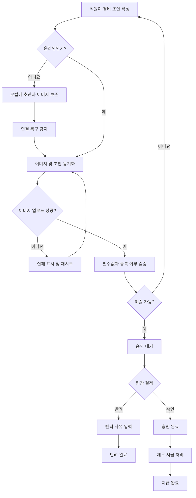

# 모바일 경비 승인 PRD

## 1. 문서 개요

- 제품/기능명: 모바일 경비 승인
- 문서 상태: 1차 출시 제안안
- 대상 플랫폼: 모바일 웹 또는 모바일 앱
- 목적: 직원의 경비 제출부터 팀장 승인, 재무 지급 완료 처리까지의 흐름을 모바일 환경에서 제공한다.
- 범위 원칙: 본 문서에서 확정되지 않은 사항은 **합리적 가정**과 **열린 결정**으로 구분한다.

## 2. 적용 범위

| 계약 항목 | 적용 여부 | 근거 |
|---|---|---|
| 역할 및 권한 | Required | 직원, 팀장, 재무 담당자의 권한과 데이터 접근 범위가 다름 |
| 화면 및 사용자 상태 | Required | 제출·승인·반려·지급 완료가 사용자에게 노출되는 기능 |
| 상태 전이 | Required | 여러 역할을 거치는 경비 생명주기가 존재 |
| 오프라인 동기화 | Required | 오프라인 초안 작성 및 연결 복구 후 동기화가 명시됨 |
| 중복 및 동시성 제어 | Required | 중복 제출과 승인 중 동시 수정 처리가 명시됨 |
| 파일 업로드 복구 | Required | 이미지 업로드 실패 처리가 명시됨 |
| 서버 권한 검증 | Required | 팀 단위 접근과 권한 변경을 안전하게 처리해야 함 |
| 접근성 기준 | Required | WCAG 2.2 AA 목표가 명시됨 |
| 정량적 성능 목표 | N/A | 현재 측정값이 없으며 측정 후 목표를 결정하기로 함 |
| 다중 통화 | N/A | 1차 출시 범위에서 명시적으로 제외 |
| ERP 자동 연동 | N/A | 1차 출시 범위에서 명시적으로 제외 |

## 3. 문제 정의

현재 직원은 모바일 환경에서 영수증과 경비 정보를 간편하게 제출하고, 팀장은 자기 팀의 요청을 신속하게 승인하거나 반려하며, 재무 담당자는 승인된 경비의 지급 여부를 관리할 필요가 있다.

모바일 네트워크가 불안정한 상황에서도 작성 내용을 잃지 않아야 하며, 중복 제출, 이미지 업로드 실패, 승인 과정의 동시 작업, 조직 변경으로 인한 권한 변화를 안전하게 처리해야 한다.

## 4. 목표

- 직원이 영수증 사진, 금액, 카테고리를 입력해 경비를 제출할 수 있다.
- 오프라인에서도 초안을 작성하고 보존할 수 있다.
- 연결 복구 후 오프라인 초안을 안전하게 동기화할 수 있다.
- 팀장이 현재 자기 팀 소속 직원의 요청만 조회하고 승인 또는 반려할 수 있다.
- 반려 시 사유를 반드시 기록한다.
- 재무 담당자가 승인된 요청을 지급 완료로 표시할 수 있다.
- 동일한 요청의 중복 생성과 중복 처리를 방지한다.
- 이미지 업로드 실패와 동기화 충돌을 사용자에게 명확하게 알리고 복구 경로를 제공한다.
- 조직 또는 역할 변경이 발생하면 최신 권한을 즉시 적용한다.
- 승인과 수정이 동시에 발생해 오래된 데이터를 기준으로 처리되는 것을 방지한다.
- 주요 사용자 흐름이 WCAG 2.2 AA를 충족하도록 구현한다.

## 5. 비목표

1차 출시에는 다음을 포함하지 않는다.

- 다중 통화 입력, 환율 계산 또는 환차손익 처리
- ERP로의 자동 지급 요청 또는 자동 전표 생성
- 경비 규정에 따른 자동 승인
- OCR을 통한 금액·카테고리 자동 입력
- 분할 승인 또는 다단계 승인
- 여러 영수증을 하나의 경비로 묶는 기능
- 부분 지급 또는 지급 취소
- 직원 간 초안 공유
- 정량적 성능 SLA 확정

## 6. 사용자와 권한

### 6.1 직원

- 자신의 경비 초안을 생성·수정·삭제할 수 있다.
- 자신의 경비만 조회할 수 있다.
- 영수증 사진, 금액, 카테고리를 입력해 제출할 수 있다.
- 제출 후 승인 대기 중인 요청을 수정할 수 있다.
- 승인, 반려 또는 지급 완료된 요청은 수정할 수 없다.
- 반려된 요청과 반려 사유를 조회할 수 있다.
- 반려된 요청은 직접 수정하지 않고, 해당 요청을 복사해 새 초안을 만들 수 있다.

### 6.2 팀장

- 현재 자신에게 할당된 팀에 속한 직원의 제출 요청만 조회할 수 있다.
- 접근 가능한 요청을 승인하거나 반려할 수 있다.
- 반려 시 사유를 입력해야 한다.
- 자신이 제출한 경비는 팀장 권한만으로 직접 승인할 수 없다.
- 승인·반려 완료 후에는 결정을 직접 변경할 수 없다.

### 6.3 재무 담당자

- 승인된 요청을 조회할 수 있다.
- 승인된 요청을 지급 완료로 표시할 수 있다.
- 초안, 승인 대기 또는 반려 상태의 요청을 지급 완료로 변경할 수 없다.
- 1차 출시에서는 지급 완료 처리를 취소하거나 되돌릴 수 없다.

### 6.4 서버 권한 원칙

- 화면에서 버튼을 숨기는 것만으로 권한을 통제하지 않는다.
- 모든 조회와 상태 변경 시 서버가 현재 사용자 역할, 팀 관계, 요청 상태를 다시 검증한다.
- 클라이언트가 보유한 이전 권한 정보는 서버 권한 판단보다 우선할 수 없다.

## 7. 경비 데이터

경비 요청은 최소한 다음 정보를 가진다.

| 필드 | 설명 | 필수 여부 |
|---|---|---|
| 요청 ID | 서버가 부여한 고유 식별자 | 서버 생성 후 필수 |
| 로컬 초안 ID | 오프라인 초안을 식별하는 기기 내 고유값 | 오프라인 작성 시 필수 |
| 제출 멱등 키 | 재시도에 의한 중복 생성을 막는 고유값 | 제출 시 필수 |
| 직원 ID | 경비 소유자 | 필수 |
| 소속 팀 ID | 제출 또는 최신 수정 시점의 조직 정보 | 필수 |
| 영수증 이미지 | 업로드 완료된 이미지 참조 | 필수 |
| 금액 | 0보다 큰 금액 | 필수 |
| 통화 | 1차 출시의 단일 기준 통화 | 필수 |
| 카테고리 | 관리자가 제공한 활성 카테고리 | 필수 |
| 상태 | 경비 처리 상태 | 필수 |
| 반려 사유 | 팀장이 입력한 반려 설명 | 반려 시 필수 |
| 요청 버전 | 동시 수정 감지용 버전 | 필수 |
| 생성·수정 일시 | 감사 및 정렬 목적 | 필수 |
| 제출·승인·반려·지급 일시 | 처리 이력 | 해당 상태에서 필수 |
| 처리자 ID | 승인, 반려 또는 지급 완료 수행자 | 해당 상태에서 필수 |

금액은 부동소수점이 아닌 통화 최소 단위 또는 정확한 decimal 형식으로 저장한다.

## 8. 상태 모델

### 8.1 서버 상태

| 상태 | 의미 | 허용되는 다음 상태 |
|---|---|---|
| `DRAFT` | 서버에 동기화됐으나 제출되지 않은 초안 | `SUBMITTED`, 삭제 |
| `SUBMITTED` | 팀장 승인 대기 | `SUBMITTED`(직원 수정), `APPROVED`, `REJECTED` |
| `APPROVED` | 팀장 승인 완료 | `PAID` |
| `REJECTED` | 팀장 반려 완료 | 없음 |
| `PAID` | 재무 지급 완료 | 없음 |

### 8.2 로컬 동기화 상태

서버 업무 상태와 별도로 클라이언트는 다음 동기화 상태를 관리한다.

| 상태 | 의미 |
|---|---|
| `LOCAL_ONLY` | 서버에 아직 저장되지 않은 로컬 초안 |
| `SYNCING` | 서버 또는 이미지 저장소로 전송 중 |
| `SYNCED` | 로컬 변경과 서버 상태가 일치 |
| `UPLOAD_FAILED` | 이미지 업로드 실패 |
| `SYNC_FAILED` | 이미지 외 데이터 동기화 실패 |
| `CONFLICT` | 서버 버전과 로컬 수정본이 충돌 |
| `ACTION_REQUIRED` | 권한·카테고리 변경 등으로 자동 동기화 불가 |

로컬 동기화 상태가 `SYNCED`가 아니더라도 이전 서버 상태를 별도로 표시해야 한다. 예: “승인 대기 · 수정사항 동기화 실패”.

## 9. 사용자 흐름

## 10. 기능 요구사항

| ID | 요구사항 | 우선순위 |
|---|---|---|
| FR-001 | 직원은 카메라 촬영 또는 기기 이미지 선택을 통해 영수증 사진을 첨부할 수 있어야 한다. | Must |
| FR-002 | 직원은 0보다 큰 금액과 활성 카테고리를 입력할 수 있어야 한다. | Must |
| FR-003 | 영수증 이미지, 금액 또는 카테고리가 누락되면 제출을 허용하지 않고 누락 필드를 식별해야 한다. | Must |
| FR-004 | 1차 출시에서는 시스템에 설정된 단일 통화만 사용하며 직원은 통화를 변경할 수 없어야 한다. | Must |
| FR-005 | 사용자가 입력을 시작하면 초안을 자동 보존하고, 앱 종료 또는 화면 이탈 후에도 복원할 수 있어야 한다. | Must |
| FR-006 | 오프라인 상태에서도 영수증, 금액, 카테고리를 포함한 초안을 작성·수정할 수 있어야 한다. | Must |
| FR-007 | 오프라인에서는 서버 제출 완료로 오인시키지 않고 “기기에 저장됨” 또는 동등한 상태를 표시해야 한다. | Must |
| FR-008 | 연결 복구 시 로컬 초안 동기화를 자동 시도하고 진행·성공·실패 상태를 표시해야 한다. | Must |
| FR-009 | 자동 동기화 실패 시 사용자가 수동으로 재시도할 수 있어야 한다. | Must |
| FR-010 | 이미지 업로드가 완료되기 전에는 요청을 `SUBMITTED` 상태로 확정하지 않아야 한다. | Must |
| FR-011 | 이미지 업로드 실패 시 입력 데이터와 로컬 이미지 원본을 보존하고 재시도 기능을 제공해야 한다. | Must |
| FR-012 | 업로드 재시도는 이미 성공한 동일 이미지를 불필요하게 중복 저장하지 않아야 한다. | Must |
| FR-013 | 각 제출 작업에 멱등 키를 사용해 네트워크 재시도나 중복 탭으로 동일 요청이 여러 건 생성되지 않게 해야 한다. | Must |
| FR-014 | 시스템은 동일 직원, 동일 금액, 동일 이미지 해시를 가진 기존 요청을 잠재적 중복으로 감지해야 한다. | Must |
| FR-015 | 잠재적 중복이 발견되면 기존 요청을 보여주고 사용자 확인 전 새 요청 제출을 중단해야 한다. | Must |
| FR-016 | 사용자가 중복이 아님을 확인하면 제출을 계속할 수 있으며 확인 사실을 기록해야 한다. | Should |
| FR-017 | 직원은 자신의 요청 목록과 현재 상태를 조회할 수 있어야 한다. | Must |
| FR-018 | 직원은 `SUBMITTED` 요청을 수정할 수 있으며 수정 성공 시 요청 버전을 증가시켜야 한다. | Must |
| FR-019 | `APPROVED`, `REJECTED`, `PAID` 상태의 요청은 직원이 수정할 수 없어야 한다. | Must |
| FR-020 | 팀장은 현재 자기 팀 직원의 `SUBMITTED` 요청만 승인 또는 반려할 수 있어야 한다. | Must |
| FR-021 | 팀장이 반려를 선택하면 공백이 아닌 반려 사유를 입력하기 전에는 처리를 완료할 수 없어야 한다. | Must |
| FR-022 | 승인·반려 요청에는 팀장이 열람한 요청 버전이 포함되어야 한다. | Must |
| FR-023 | 승인 처리 전에 요청 버전이 변경되었다면 처리를 거부하고 최신 내용을 다시 검토하도록 안내해야 한다. | Must |
| FR-024 | 동일 요청에 대한 두 승인 작업이 동시에 발생하면 최초 유효 작업 하나만 성공해야 한다. | Must |
| FR-025 | 승인과 반려가 동시에 요청되면 최초로 서버에 확정된 유효 작업만 성공하고 나머지는 최신 상태를 받아야 한다. | Must |
| FR-026 | 재무 담당자는 `APPROVED` 상태의 요청만 `PAID`로 변경할 수 있어야 한다. | Must |
| FR-027 | 지급 완료 처리 역시 현재 요청 버전을 검증하고 중복 처리를 방지해야 한다. | Must |
| FR-028 | 모든 상태 변경은 이전 상태, 이후 상태, 처리자, 처리 시각, 요청 버전을 기록해야 한다. | Must |
| FR-029 | 서버는 모든 조회 및 변경 요청에서 현재 역할과 팀 관계를 검증해야 한다. | Must |
| FR-030 | 권한이 변경된 사용자는 다음 서버 요청부터 변경된 권한을 적용받아야 한다. | Must |
| FR-031 | 열려 있던 화면에서 권한이 상실되면 서버가 작업을 거부하고 화면을 읽기 전용으로 전환하거나 접근 가능한 목록으로 이동시켜야 한다. | Must |
| FR-032 | 오프라인 작업 중 직원 권한 또는 계정 접근이 상실되면 자동 제출하지 않고 `ACTION_REQUIRED`로 표시해야 한다. | Must |
| FR-033 | 카테고리가 초안 작성 후 비활성화되면 동기화 시 대체 카테고리 선택을 요구해야 한다. | Must |
| FR-034 | 사용자는 반려된 요청에서 반려 사유를 조회하고 이를 복사해 새 초안을 만들 수 있어야 한다. | Should |
| FR-035 | 사용자에게 표시되는 오류는 데이터 보존 여부와 가능한 다음 행동을 명확히 설명해야 한다. | Must |

## 11. 화면 정의

구체적인 URL이나 네이티브 내비게이션 구조는 플랫폼 결정 후 확정하되, 다음 사용자 화면이 필요하다.

### 11.1 직원 경비 목록

- 상태별 요청 목록
- 오프라인 및 동기화 상태
- 새 경비 작성 진입점
- 빈 상태
- 새로고침 및 재시도
- 잠재적 중복 또는 조치 필요 표시

### 11.2 경비 작성·수정

- 영수증 촬영 또는 선택
- 이미지 미리보기 및 교체
- 금액 입력
- 카테고리 선택
- 저장·동기화 상태
- 제출 버튼
- 필드별 오류
- 이미지 업로드 재시도
- 잠재적 중복 확인

### 11.3 경비 상세

- 영수증 이미지
- 금액, 통화, 카테고리
- 현재 상태
- 처리 이력
- 반려 사유
- 역할과 상태에 따른 수정·승인·반려·지급 버튼

### 11.4 팀장 승인함

- 자기 팀의 승인 대기 요청
- 요청 상세 확인
- 승인
- 반려 사유 입력
- 데이터 변경 또는 권한 상실 안내

### 11.5 재무 지급 목록

- 승인 완료 요청 목록
- 요청 상세 확인
- 지급 완료 처리
- 이미 처리된 요청 또는 동시 처리 충돌 안내

## 12. 화면 상태 매트릭스

| 화면 | 빈 상태 | 로딩 상태 | 오류 상태 | 성공 상태 | 복구 |
|---|---|---|---|---|---|
| 직원 목록 | 제출한 경비 없음 | 목록 로딩 | 목록 조회 실패 | 요청 및 상태 표시 | 새로고침 |
| 작성 화면 | 초기 입력 폼 | 초안 복원·동기화 | 저장 또는 업로드 실패 | 저장됨·제출됨 | 자동/수동 재시도 |
| 경비 상세 | 해당 없음 | 상세 로딩 | 삭제됨·권한 없음·조회 실패 | 상세 및 이력 표시 | 목록 이동 또는 재조회 |
| 팀장 승인함 | 승인할 요청 없음 | 요청 로딩 | 권한 상실·조회 실패 | 승인 대기 목록 | 새로고침 |
| 반려 입력 | 사유 미입력 | 처리 중 | 버전 충돌·권한 상실 | 반려 완료 | 최신 내용 재검토 |
| 재무 지급 목록 | 지급할 요청 없음 | 요청 로딩 | 조회 실패 | 승인 요청 목록 | 새로고침 |
| 지급 처리 | 해당 없음 | 처리 중 | 이미 처리됨·버전 충돌 | 지급 완료 | 최신 상태 표시 |

## 13. 동시 수정 및 충돌 처리

- 모든 변경 가능한 요청은 정수형 또는 동등한 단조 증가 버전을 가진다.
- 직원 수정, 승인, 반려 및 지급 완료 요청은 클라이언트가 마지막으로 읽은 버전을 서버에 전달한다.
- 서버의 현재 버전과 일치하지 않으면 변경을 적용하지 않는다.
- 충돌 응답에는 민감하지 않은 범위에서 현재 상태와 최신 버전을 포함한다.
- 팀장은 직원이 수정한 내용을 자동으로 승인한 것으로 처리할 수 없다. 최신 요청을 다시 열람한 뒤 승인해야 한다.
- 직원이 승인과 동시에 수정한 경우:
  - 수정이 먼저 확정되면 이전 버전에 대한 승인은 실패한다.
  - 승인이 먼저 확정되면 직원 수정은 실패하며 승인된 최신 상태를 표시한다.
- 충돌 후 클라이언트는 성공 메시지를 표시해서는 안 된다.
- 오프라인 초안과 서버 초안이 모두 수정된 경우 자동 병합하지 않고 `CONFLICT` 상태로 전환한다.
- 충돌 화면은 서버 버전과 로컬 버전의 금액·카테고리·영수증을 비교하고 사용자가 유지할 버전을 선택하게 한다.

## 14. 중복 제출 정책

중복은 두 단계로 처리한다.

1. **기술적 중복**

   동일한 제출 멱등 키로 반복된 요청은 하나의 요청으로 취급한다. 기존 요청이 성공했다면 같은 요청 ID와 결과를 반환한다.

2. **업무상 잠재적 중복**

   동일 직원, 동일 금액, 동일 영수증 이미지 해시가 기존 요청과 일치하면 잠재적 중복으로 판단한다. 사용자는 기존 요청을 확인한 뒤 중복이 아님을 명시적으로 선택해야 새 요청을 제출할 수 있다.

잠재적 중복 비교 대상 상태는 최소 `SUBMITTED`, `APPROVED`, `PAID`로 한다. 반려 요청을 비교 대상에 포함할지는 열린 결정으로 남긴다.

## 15. 권한 및 데이터 경계

- 직원은 다른 직원의 초안, 영수증, 금액, 반려 사유를 조회할 수 없다.
- 팀장은 서버의 현재 조직 관계를 기준으로 자기 팀 직원의 요청만 조회할 수 있다.
- 과거에 자기 팀이었던 직원의 요청은 현재 관계만으로 접근할 수 없다.
- 재무 담당자는 업무 수행에 필요한 승인된 요청과 지급 완료 요청만 조회할 수 있다.
- 팀장과 재무 담당자의 목록 API는 허용된 데이터만 반환해야 하며, 클라이언트에서 전체 데이터를 받은 뒤 필터링해서는 안 된다.
- 요청 ID를 추측하거나 직접 호출해도 권한이 없는 영수증 이미지와 요청 정보는 반환하지 않는다.
- 영수증 이미지 접근에도 요청 데이터와 동일한 권한 검사를 적용한다.
- 이미지 접근 URL을 사용하는 경우 장기간 공개되는 URL을 사용하지 않는다.
- 역할과 팀 변경은 캐시된 권한만으로 처리하지 않고 서버의 최신 권한을 기준으로 검증한다.
- 상태 변경 이력은 일반 직원이 임의로 수정하거나 삭제할 수 없다.

## 16. 비기능 요구사항

### 16.1 접근성

- 주요 사용자 흐름은 WCAG 2.2 AA를 목표로 한다.
- 모든 입력 요소는 프로그램적으로 연결된 레이블을 제공한다.
- 오류는 색상만으로 표현하지 않고 텍스트와 상태로 제공한다.
- 키보드 또는 플랫폼 보조 입력만으로 모든 기능을 사용할 수 있어야 한다.
- 포커스 순서와 포커스 표시가 명확해야 한다.
- 승인, 반려, 지급 완료 결과와 동기화 오류는 스크린 리더가 인지할 수 있어야 한다.
- 영수증 미리보기에는 파일 상태를 설명하는 접근 가능한 이름을 제공한다.
- 터치 대상 크기, 색상 대비, 확대 및 텍스트 리플로우는 WCAG 2.2 AA 기준으로 검증한다.
- 자동 재시도나 상태 갱신이 사용자의 입력 또는 포커스를 예고 없이 이동시키지 않아야 한다.

### 16.2 보안 및 개인정보

- 전송 중인 요청 데이터와 영수증 이미지는 암호화된 연결을 사용한다.
- 기기에 저장되는 오프라인 초안과 이미지에는 운영체제가 제공하는 보호 저장소 또는 동등한 보호 수단을 적용한다.
- 로그에 영수증 원본, 전체 금액 정보, 인증 토큰을 기록하지 않는다.
- 로그아웃 또는 계정 전환 후 이전 계정의 오프라인 초안이 다른 계정에 노출되지 않아야 한다.
- 권한이 없는 사용자는 이미지 저장소의 직접 주소를 알아도 이미지를 조회할 수 없어야 한다.

### 16.3 안정성

- 제출과 상태 변경 API는 네트워크 재시도에 안전해야 한다.
- 클라이언트는 서버 성공 응답을 받기 전까지 제출·승인·반려·지급 완료를 확정 표시하지 않는다.
- 실패한 동기화 항목은 입력 데이터를 유지한 채 재시도할 수 있어야 한다.
- 자동 재시도는 무한 반복하지 않으며, 지속 실패 시 사용자 조치가 필요한 상태로 전환한다.

### 16.4 성능

1차 출시 전 측정할 지표:

- 경비 목록 표시 시간
- 경비 상세 표시 시간
- 이미지 업로드 완료 시간
- 연결 복구 후 동기화 완료 시간
- 승인·반려·지급 상태 변경 응답 시간
- 업로드 및 동기화 실패율

현재 수치 목표는 설정하지 않는다. 베타 또는 내부 시범 운영에서 기기·네트워크 조건별 기준값을 측정한 뒤 제품 책임자와 기술 책임자가 출시 기준을 확정한다.

## 17. 수용 기준

| ID | 연결 요구사항 | Given | When | Then | 검증 |
|---|---|---|---|---|---|
| AC-001 | FR-001~004 | 직원이 새 경비를 작성 중일 때 | 영수증, 유효한 금액, 카테고리를 입력하고 제출하면 | 단일 기준 통화로 승인 대기 요청이 생성된다 | UI/API 통합 테스트 |
| AC-002 | FR-003 | 필수 입력 중 하나가 없을 때 | 제출을 선택하면 | 제출되지 않고 누락 필드별 오류가 표시된다 | UI 테스트 |
| AC-003 | FR-005~009 | 직원이 오프라인일 때 | 초안을 작성하고 앱을 다시 열면 | 입력 내용과 이미지가 복원되며 기기 저장 상태가 표시된다 | 오프라인 E2E 테스트 |
| AC-004 | FR-008~009 | 동기화 대기 초안이 있을 때 | 연결이 복구되면 | 자동 동기화가 시작되고 결과가 표시된다 | 네트워크 전환 테스트 |
| AC-005 | FR-010~012 | 이미지 업로드가 실패할 때 | 직원이 제출을 시도하면 | 요청은 제출 완료되지 않고 입력과 이미지가 보존되며 재시도가 제공된다 | 장애 주입 테스트 |
| AC-006 | FR-013 | 제출 성공 응답 전에 연결이 끊겼을 때 | 동일 멱등 키로 재시도하면 | 새 요청이 추가되지 않고 기존 요청 결과가 반환된다 | API 통합 테스트 |
| AC-007 | FR-014~016 | 동일 직원의 동일 금액·이미지 요청이 존재할 때 | 새 요청을 제출하면 | 기존 요청이 제시되고 명시적 확인 전 제출이 중단된다 | API/UI 통합 테스트 |
| AC-008 | FR-017~019 | 직원이 승인 대기 요청을 열었을 때 | 내용을 수정하면 | 요청이 수정되고 버전이 증가한다 | API 테스트 |
| AC-009 | FR-019 | 요청이 승인·반려·지급 완료 상태일 때 | 직원이 수정을 시도하면 | 서버가 거부하고 현재 상태를 반환한다 | 권한/상태 테스트 |
| AC-010 | FR-020, FR-029 | 팀장이 다른 팀 요청 ID를 알고 있을 때 | 상세 조회 또는 승인 API를 호출하면 | 요청 데이터가 노출되지 않고 작업이 거부된다 | 보안 통합 테스트 |
| AC-011 | FR-021 | 팀장이 반려 사유를 비워 둔 상태일 때 | 반려 완료를 선택하면 | 반려되지 않고 사유 입력 오류가 표시된다 | UI/API 테스트 |
| AC-012 | FR-022~023 | 팀장이 버전 3의 요청을 보고 있을 때 | 직원이 버전 4로 수정한 후 팀장이 승인하면 | 승인이 거부되고 최신 내용을 다시 검토하라는 안내가 표시된다 | 동시성 테스트 |
| AC-013 | FR-024~025 | 두 사용자가 동일 요청을 동시에 처리할 때 | 승인 또는 반려 요청을 보내면 | 하나만 성공하고 나머지는 확정된 최신 상태를 받는다 | 병렬 API 테스트 |
| AC-014 | FR-026~027 | 요청이 승인 상태일 때 | 재무 담당자가 지급 완료 처리하면 | 요청이 한 번만 지급 완료 상태로 변경되고 처리 이력이 기록된다 | API 통합 테스트 |
| AC-015 | FR-026 | 요청이 승인 상태가 아닐 때 | 재무 담당자가 지급 완료 API를 호출하면 | 상태 변경이 거부된다 | 상태 전이 테스트 |
| AC-016 | FR-030~032 | 사용자가 화면을 연 뒤 역할 또는 팀 권한을 상실했을 때 | 상태 변경을 시도하면 | 서버가 거부하고 클라이언트가 최신 권한 상태를 표시한다 | 권한 변경 테스트 |
| AC-017 | FR-032 | 오프라인 초안 작성 후 직원 권한이 상실됐을 때 | 연결이 복구되면 | 초안이 자동 제출되지 않고 조치 필요 상태가 표시된다 | 오프라인 권한 테스트 |
| AC-018 | FR-033 | 초안의 카테고리가 동기화 전에 비활성화됐을 때 | 동기화를 시도하면 | 제출되지 않고 유효한 카테고리 재선택을 요구한다 | 데이터 변경 테스트 |
| AC-019 | FR-028 | 상태 변경이 성공했을 때 | 이력을 조회하면 | 이전·이후 상태, 처리자, 처리 시각, 버전이 존재한다 | API/데이터 테스트 |
| AC-020 | 접근성 요구사항 | 주요 흐름이 구현됐을 때 | WCAG 2.2 AA 기준으로 검사하면 | 자동 검사와 수동 보조기기 검사에서 출시 차단 결함이 없다 | 자동·수동 접근성 감사 |
| AC-021 | 보안 요구사항 | 다른 계정으로 로그아웃 후 로그인했을 때 | 로컬 초안 화면을 열면 | 이전 계정의 초안과 이미지가 노출되지 않는다 | 보안 E2E 테스트 |
| AC-022 | FR-035 | 동기화 또는 처리 작업이 실패했을 때 | 오류가 표시되면 | 데이터 보존 여부와 재시도·재검토 등 다음 행동이 함께 표시된다 | 콘텐츠/UI 테스트 |

## 18. 합리적 가정

아래 항목은 브리프를 구현 가능한 수준으로 만들기 위해 적용한, 변경 가능한 가정이다.

- 1차 출시에서는 조직이 정한 하나의 기준 통화만 사용한다.
- 한 경비 요청에는 영수증 이미지 한 장을 첨부한다.
- 한 직원은 제출 시점에 하나의 기본 팀에 속한다.
- 팀장은 하나 이상의 팀을 담당할 수 있다.
- 재무 담당자는 전사 범위의 승인된 요청을 처리한다.
- 직원은 승인 대기 요청을 수정할 수 있지만, 수정할 때마다 요청 버전이 변경된다.
- 승인·반려·지급 완료는 최종 상태 변경이며 1차 출시에서 사용자 취소 기능을 제공하지 않는다.
- 반려된 요청은 원본 이력 보존을 위해 직접 재제출하지 않고 새 초안으로 복사한다.
- 잠재적 중복은 동일 직원, 동일 금액, 동일 이미지 해시를 기준으로 판단한다.
- 오프라인 기능은 초안 작성과 수정에 한정하며 승인·반려·지급 처리는 온라인에서만 가능하다.
- 연결 복구 후 자동 동기화를 시도하되, 업무 상태가 확정되기 전까지 사용자에게 서버 제출 완료로 표시하지 않는다.
- 조직 및 역할 정보는 별도의 사내 인증·조직 시스템에서 제공된다고 가정하지만, 해당 시스템 구축은 범위에 포함하지 않는다.

## 19. 열린 결정

구현 착수 또는 베타 출시 전 다음 결정을 확정해야 한다.

| ID | 결정 항목 | 선택지 및 영향 | 결정 시점/담당 |
|---|---|---|---|
| OD-001 | 대상 플랫폼 | 네이티브 앱, 모바일 웹, 하이브리드에 따라 오프라인 저장소·카메라·백그라운드 동기화 방식이 달라짐 | 기술 설계 전 / 제품·기술 책임자 |
| OD-002 | 단일 기준 통화 | 실제 통화 코드와 금액 소수 자릿수를 확정해야 함 | 데이터 모델 확정 전 / 재무 |
| OD-003 | 영수증 수량 | 요청당 1장 유지 또는 여러 장 지원 여부 | UI·데이터 모델 확정 전 / 제품 |
| OD-004 | 팀 관계 기준 시점 | 현재 팀 기준 또는 제출 당시 팀 기준. 본 PRD는 현재 팀 기준을 가정함 | 권한 구현 전 / 인사·보안·제품 |
| OD-005 | 팀장 본인 요청 승인 | 본인 승인 금지 후 상위 팀장 처리, 별도 승인자 배정 또는 제출 제한 중 선택 필요 | 승인 정책 확정 전 / 재무·감사 |
| OD-006 | 반려 요청의 중복 검사 포함 여부 | 포함하면 정당한 재제출에 경고가 많아질 수 있고, 제외하면 동일 반려 요청 반복 제출 탐지가 약해짐 | 중복 정책 구현 전 / 제품·재무 |
| OD-007 | 잠재적 중복 시간 범위 | 전체 이력 또는 일정 기간. 실제 업무 빈도 측정 후 결정 | 베타 전 / 제품·재무 |
| OD-008 | 오프라인 보존 기간 및 용량 | 장기 보존은 편리하지만 기기 저장공간과 개인정보 노출 위험이 증가함 | 보안 설계 전 / 보안·제품 |
| OD-009 | 자동 동기화 실행 조건 | 앱 활성 시만 수행하거나 OS 백그라운드 작업도 사용할지 결정 | 플랫폼 확정 후 / 기술 |
| OD-010 | 승인·반려 수정 기능 | 1차 출시 이후 관리자 정정 절차가 필요한지 결정 | 운영 정책 수립 시 / 재무 |
| OD-011 | 지급 완료의 의미 | 실제 송금 완료, 지급 파일 생성 완료, 또는 수동 확인 완료 중 업무 정의 필요 | 재무 화면 구현 전 / 재무 |
| OD-012 | 이미지 형식·크기 제한 | 지원 포맷, 최대 크기, 압축 품질 및 원본 보존 여부 확정 | 업로드 구현 전 / 기술·보안 |
| OD-013 | 반려 사유 제한 | 최소·최대 길이, 서식 및 금지 콘텐츠 정책 확정 | UI/API 계약 전 / 제품 |
| OD-014 | 성능 목표 | 베타 측정 후 기기·네트워크 조건별 목표와 출시 차단 기준 확정 | 베타 종료 시 / 제품·기술 |
| OD-015 | 감사 이력 보존 기간 | 조직의 회계·보안·개인정보 정책 확인 필요 | 운영 출시 전 / 법무·재무·보안 |

## 20. 위험과 완화책

| 위험 | 영향 | 완화 |
|---|---|---|
| 불안정한 네트워크에서 중복 요청 생성 | 이중 승인 또는 이중 지급 가능성 | 멱등 키, 서버 고유 제약, 상태 변경 멱등 처리 |
| 업로드 중 앱 종료 | 영수증 또는 입력 유실 | 로컬 자동 저장, 재개 가능한 재시도, 업로드 상태 분리 |
| 오래된 화면에서 승인 | 수정 전 정보를 기준으로 잘못 승인 | 요청 버전 검증과 최신 내용 재검토 |
| 조직 변경 후 이전 권한 사용 | 다른 팀의 민감 정보 노출 | 모든 요청에서 서버 최신 권한 검증 |
| 로컬 이미지 노출 | 영수증 개인정보 유출 | 계정별 격리, 보호 저장소, 로그아웃 정리 정책 |
| 중복 탐지 오탐 | 정상 경비 제출 지연 | 기존 요청 제시 후 명시적 예외 제출 허용 |
| 동기화 충돌 자동 병합 | 잘못된 금액 또는 영수증 제출 | 명시적 충돌 상태와 사용자 선택 |
| 지급 완료 오조작 | 회계 상태 불일치 | 확인 단계, 권한 검증, 감사 이력; 취소 기능은 후속 검토 |
| 접근성 후반 대응 | 핵심 흐름 재작업 | 설계 단계부터 AA 기준 적용, 자동·수동 검증 |
| 성능 목표 부재 | 출시 품질 판단 불명확 | 베타 계측 후 책임자와 결정 시점을 명시 |

## 21. 출시 및 검증 계획

| 단계 | 포함 요구사항 | 종료 조건 |
|---|---|---|
| 1. 데이터·권한 기반 | FR-002~004, FR-017, FR-020, FR-026, FR-028~031 | 역할별 조회 범위, 상태 전이, 서버 권한 테스트 통과 |
| 2. 직원 제출 | FR-001~005, FR-010~13, FR-17~19 | 온라인 작성·업로드·제출 및 기술적 중복 방지 E2E 통과 |
| 3. 승인·지급 | FR-020~28 | 승인, 반려, 지급 완료와 병렬 동시성 테스트 통과 |
| 4. 오프라인 동기화 | FR-006~009, FR-011~12, FR-032~33 | 네트워크 전환, 앱 재실행, 업로드 실패, 권한 변경 시나리오 통과 |
| 5. 업무상 중복·복구 | FR-014~016, FR-034~035 | 잠재적 중복, 반려 복사, 오류 복구 흐름 통과 |
| 6. 출시 검증 | 전체 요구사항 | 수용 기준 통과, WCAG 2.2 AA 감사 완료, 보안 점검 완료, 성능 기준값 측정 및 출시 목표 확정 |

요청에 따라 문서를 파일로 저장하거나 저장소를 탐색하지 않았으므로 별도의 PRD 파일 검증기는 실행하지 않았다.