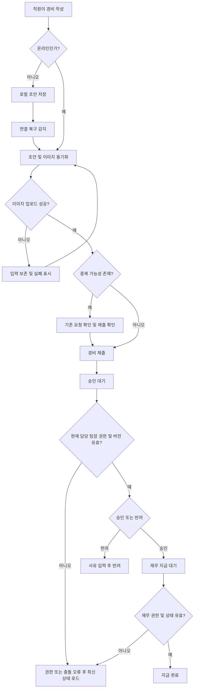

# 모바일 경비 승인 PRD

- 문서 상태: Draft
- 대상 출시: 1차 출시(MVP)
- 작성 기준: 제공된 브리프
- 검증 상태: 저장소·기존 정책·기술 구조를 탐색하지 않았으므로 조직 정책 및 기술 적합성 검증 전

## 1. 적용 범위

| 계약 항목 | 적용 여부 | 근거 |
|---|---|---|
| 문제·목표·비목표 | Required | 신규 업무 흐름과 1차 출시 제외 범위를 정의해야 함 |
| 사용자·역할·권한 | Required | 직원, 팀장, 재무 담당자의 권한이 서로 다름 |
| 기능 요구사항 | Required | 제출부터 지급 완료까지의 동작을 구현 가능한 수준으로 정의해야 함 |
| 화면·경로 | Required | 모바일 사용자 화면이 존재함 |
| 화면 상태 매트릭스 | Required | 오프라인, 업로드 실패, 충돌 등 사용자 노출 상태가 중요함 |
| 사용자·시스템 흐름 | Required | 초안부터 지급 완료까지 다단계 생명주기가 존재함 |
| 권한·데이터 경계 | Required | 팀 범위 제한과 권한 변경을 서버에서 강제해야 함 |
| 수치형 성능 목표 | N/A | 측정 후 결정한다는 조건이며 현재 근거 수치가 없음 |
| 접근성 요구사항 | Required | WCAG 2.2 AA가 명시됨 |
| 분석 이벤트 | N/A | 브리프에 제품 분석 목적이나 도구가 명시되지 않음 |
| 다중 통화 | N/A | 1차 출시 제외 |
| ERP 자동 연동 | N/A | 1차 출시 제외 |

---

## 2. 배경과 문제

현재 직원의 경비 제출, 팀장의 승인, 재무 담당자의 지급 처리를 모바일에서 연결하는 표준 흐름이 필요하다.

모바일 환경에서는 네트워크 단절, 영수증 이미지 업로드 실패, 요청 재전송으로 인한 중복 제출이 발생할 수 있다. 또한 제출 이후 사용자의 권한이나 팀 소속이 변경되거나, 팀장이 승인하는 동안 직원이 같은 요청을 수정할 수 있으므로 단순한 화면 단위 처리만으로는 데이터 무결성과 권한 경계를 보장하기 어렵다.

본 기능은 경비 요청의 상태와 변경 버전을 서버의 단일 기준으로 관리하고, 각 역할이 허용된 범위에서만 다음 업무를 수행하도록 만드는 것을 목적으로 한다.

## 3. 목표

- 직원이 모바일에서 영수증 사진, 금액, 카테고리를 포함한 경비를 작성하고 제출할 수 있다.
- 네트워크가 없더라도 초안을 작성하고, 연결 복구 후 안전하게 동기화할 수 있다.
- 팀장이 현재 자기 팀에 속한 직원의 요청만 승인하거나 반려할 수 있다.
- 반려 시 사유를 필수로 기록하고 직원에게 보여준다.
- 재무 담당자가 팀장 승인 완료 건만 지급 완료로 전환할 수 있다.
- 재전송, 중복 조작, 이미지 업로드 실패 및 동시 변경 상황에서도 중복 처리나 데이터 유실을 방지한다.
- 모든 민감한 권한 검사를 서버에서 실행한다.
- 사용자 화면이 WCAG 2.2 AA를 충족하도록 설계·검증한다.

## 4. 비목표

1차 출시에서는 다음을 제공하지 않는다.

- 다중 통화 입력, 환율 계산 및 환차손익 처리
- ERP로의 자동 전표 생성 또는 자동 지급 연동
- 부분 승인 또는 부분 지급
- 여러 단계의 결재선
- 팀장 외 대리 승인자 지정
- 영수증 OCR 및 자동 금액·카테고리 추출
- 요청 일괄 승인 또는 일괄 지급
- 직원이 직접 지급 완료를 취소하거나 요청 상태를 되돌리는 기능
- 회계 정책별 예산 한도 및 규정 위반 자동 판정

## 5. 사용자와 역할

| 역할 | 주요 권한 |
|---|---|
| 직원 | 본인 경비 초안 작성·수정·삭제, 제출, 본인 요청 및 처리 결과 조회 |
| 팀장 | 현재 자기 팀 직원의 제출 요청 조회, 승인 또는 사유를 포함한 반려 |
| 재무 담당자 | 팀장 승인 요청 조회, 지급 완료 처리 |
| 시스템 | 오프라인 초안 동기화, 중복 방지, 이미지 업로드 상태 관리, 권한 및 버전 검증 |

한 사용자가 복수 역할을 가질 수 있지만, 각 작업은 해당 작업에 필요한 권한과 데이터 범위를 독립적으로 검사한다.

## 6. 요청 데이터

### 6.1 필수 데이터

| 필드 | 설명 |
|---|---|
| 요청 ID | 서버가 발급한 고유 식별자 |
| 클라이언트 요청 ID | 재시도 및 오프라인 동기화 중 동일 요청을 식별하는 고유 값 |
| 직원 ID | 요청 소유자 |
| 직원의 현재 팀 ID | 조회 및 승인 권한 판정에 사용 |
| 영수증 이미지 | 직원이 첨부한 영수증 사진 |
| 금액 | 0보다 큰 금액 |
| 통화 | 1차 출시의 단일 기준 통화 |
| 카테고리 | 관리자가 허용한 활성 카테고리 중 하나 |
| 상태 | 요청 생명주기 상태 |
| 버전 | 동시 수정 충돌을 검사하는 증가 값 |
| 작성·수정 시각 | 감사 및 동기화에 사용 |
| 승인·반려 정보 | 처리자, 처리 시각, 반려 사유 |
| 지급 정보 | 지급 처리자와 지급 완료 시각 |

### 6.2 요청 상태

- `LOCAL_DRAFT`: 기기에만 저장된 오프라인 초안
- `DRAFT`: 서버에 동기화됐으나 제출되지 않은 초안
- `SYNC_FAILED`: 동기화 또는 이미지 업로드가 완료되지 않은 초안
- `PENDING_APPROVAL`: 팀장 승인 대기
- `APPROVED`: 팀장 승인 완료, 재무 지급 대기
- `REJECTED`: 팀장 반려
- `PAID`: 지급 완료

`SYNC_FAILED`는 서버의 업무 상태와 별개로 구현할 수도 있으나, 사용자가 “제출 가능한 상태인지” 명확히 알 수 있도록 화면에는 독립적인 동기화 상태로 노출해야 한다.

## 7. 기능 요구사항

| ID | 요구사항 | 우선순위 |
|---|---|---|
| FR-001 | 직원은 영수증 이미지, 금액, 카테고리를 입력해 경비 초안을 생성할 수 있다. | Must |
| FR-002 | 금액은 0보다 커야 하며 기준 통화의 허용 자릿수 형식에 맞아야 한다. | Must |
| FR-003 | 직원은 활성 상태인 허용 카테고리 중 하나를 선택해야 한다. | Must |
| FR-004 | 직원은 본인이 소유한 초안만 조회·수정·삭제할 수 있다. | Must |
| FR-005 | 직원은 필수 데이터와 이미지 업로드가 모두 완료된 초안을 제출할 수 있다. | Must |
| FR-006 | 제출 요청은 고유한 클라이언트 요청 ID를 사용해 멱등 처리하며, 동일 요청이 재전송돼도 서버 요청을 하나만 생성한다. | Must |
| FR-007 | 시스템은 동일 직원의 이미지 지문, 금액 및 설정된 비교 기간을 기준으로 의심 중복을 탐지해 제출 전에 경고한다. | Must |
| FR-008 | 중복 경고가 발생한 경우 직원은 기존 요청을 확인하거나 중복이 아님을 확인하고 제출을 계속할 수 있다. 확인 사실을 기록한다. | Should |
| FR-009 | 이미지 업로드 실패 시 입력한 금액·카테고리 및 이미지 로컬 참조를 보존하고 재시도 기능을 제공한다. | Must |
| FR-010 | 이미지 업로드가 완료되지 않았거나 서버에서 이미지 접근을 확인할 수 없으면 제출을 완료하지 않는다. | Must |
| FR-011 | 네트워크가 없을 때 직원은 로컬 초안을 생성하고 수정할 수 있다. | Must |
| FR-012 | 연결이 복구되면 시스템은 로컬 초안을 자동 동기화하고 결과를 사용자에게 표시한다. | Must |
| FR-013 | 동기화 실패는 다른 초안의 동기화를 막지 않으며, 실패한 항목별 원인과 재시도 동작을 제공한다. | Must |
| FR-014 | 자동 동기화 전 사용자가 로컬 초안을 삭제한 경우 해당 초안을 서버에 생성하지 않는다. | Must |
| FR-015 | 팀장은 서버가 판정한 현재 자기 팀 직원의 `PENDING_APPROVAL` 요청만 조회하고 처리할 수 있다. | Must |
| FR-016 | 팀장은 `PENDING_APPROVAL` 요청을 승인해 `APPROVED`로 전환할 수 있다. | Must |
| FR-017 | 팀장은 `PENDING_APPROVAL` 요청을 반려할 때 비어 있지 않은 반려 사유를 입력해야 한다. | Must |
| FR-018 | 직원은 반려 상태와 반려 사유를 조회할 수 있다. | Must |
| FR-019 | 재무 담당자는 `APPROVED` 요청만 `PAID`로 전환할 수 있다. | Must |
| FR-020 | 지급 완료 처리에는 처리자와 서버 기준 처리 시각을 기록한다. | Must |
| FR-021 | 승인, 반려 및 지급 완료 명령은 요청 ID와 사용자가 마지막으로 조회한 버전을 함께 보내야 한다. | Must |
| FR-022 | 서버 버전과 명령의 버전이 다르면 상태 변경을 거부하고 최신 내용을 다시 불러오도록 안내한다. | Must |
| FR-023 | 직원이 승인 대기 중인 요청을 수정하면 요청 버전을 증가시키고 팀장 화면에 최신 정보임을 표시한다. | Must |
| FR-024 | 팀장 승인 완료 이후에는 직원이 요청 내용을 수정할 수 없다. | Must |
| FR-025 | 서버는 모든 조회 및 상태 변경 시점에 역할, 팀 소속, 소유권과 현재 상태를 다시 검사한다. | Must |
| FR-026 | 요청을 열어 둔 동안 역할이나 팀 소속이 변경되면 다음 조회 또는 변경 명령에서 새로운 권한을 즉시 적용한다. | Must |
| FR-027 | 권한을 잃은 사용자의 상태 변경 명령을 거부하고 권한 변경 안내 후 해당 목록에서 제거한다. | Must |
| FR-028 | 승인·반려·지급 명령의 재시도는 멱등 처리해 동일 명령이 중복 실행되지 않게 한다. | Must |
| FR-029 | 업무 상태 변경 이력에는 이전·이후 상태, 수행자, 서버 시각 및 요청 버전을 기록한다. | Must |
| FR-030 | 목록과 상세 화면은 서버의 최신 상태와 로컬 동기화 상태를 구분해서 표시한다. | Must |

## 8. 화면 및 경로

실제 URL 체계는 기존 애플리케이션 규칙에 맞춘다.

| 화면 | 대상 | 주요 기능 |
|---|---|---|
| 내 경비 목록 | 직원 | 상태별 본인 요청 조회, 동기화·업로드 실패 표시 |
| 경비 작성·수정 | 직원 | 영수증 촬영·선택, 금액 입력, 카테고리 선택, 초안 저장·제출 |
| 경비 상세 | 직원 | 제출 내용, 현재 상태, 반려 사유, 지급 여부 조회 |
| 팀 승인 목록 | 팀장 | 현재 자기 팀의 승인 대기 요청 조회 |
| 팀 승인 상세 | 팀장 | 요청 내용·영수증 확인, 승인, 반려 사유 입력 |
| 지급 대기 목록 | 재무 | 승인 완료 요청 조회 |
| 지급 상세 | 재무 | 요청과 승인 정보 확인, 지급 완료 처리 |
| 동기화 상태 | 직원 | 대기·실패 항목 확인 및 항목별 재시도 |

## 9. 화면 상태 매트릭스

| 화면 | 비어 있음 | 로딩 | 오류 | 성공 | 복구 |
|---|---|---|---|---|---|
| 내 경비 목록 | 등록된 경비 없음, 작성 CTA | 목록 스켈레톤 또는 진행 표시 | 네트워크 오류와 마지막 동기화 정보 | 상태별 요청 표시 | 다시 시도, 오프라인 저장 목록 유지 |
| 경비 작성 | 빈 입력 폼 | 이미지 처리·업로드 진행률 | 유효성 또는 업로드 오류 | 초안 저장 또는 제출 완료 | 입력 보존, 이미지 재업로드 |
| 팀 승인 목록 | 승인 대기 없음 | 목록 로딩 | 권한·네트워크 오류 | 자기 팀의 대기 건 표시 | 새로고침 또는 권한 변경 후 목록 이탈 |
| 팀 승인 상세 | 해당 없음 | 상세·이미지 로딩 | 접근 거부, 삭제·상태 변경, 이미지 로딩 실패 | 승인·반려 완료 | 최신 버전 다시 불러오기 |
| 지급 대기 목록 | 지급 대기 없음 | 목록 로딩 | 권한·네트워크 오류 | 승인 완료 건 표시 | 새로고침 |
| 지급 상세 | 해당 없음 | 상세 로딩 | 이미 지급됨, 상태 충돌, 권한 오류 | 지급 완료 | 최신 상태 표시 |
| 동기화 상태 | 대기 항목 없음 | 동기화 진행 | 항목별 실패 원인 | 동기화 완료 | 항목별·전체 재시도 |

## 10. 핵심 흐름

## 11. 상세 업무 규칙

### 11.1 오프라인과 동기화

- 오프라인에서는 초안 작성·수정·삭제만 허용한다.
- 제출, 승인, 반려 및 지급 완료는 서버의 최신 권한과 상태 검사가 필요하므로 온라인에서만 수행한다.
- 각 로컬 초안은 생성 시 클라이언트 요청 ID를 발급받고 재설치 전까지 안정적으로 유지한다.
- 동기화는 먼저 요청 메타데이터를 식별한 뒤 이미지를 업로드하고, 서버가 이미지 접근 가능성을 확인하면 제출 가능한 상태로 만든다.
- 앱 종료나 네트워크 재단절 이후에도 완료되지 않은 단계부터 재시도할 수 있어야 한다.
- 동기화 성공 여부를 단순 네트워크 연결 여부와 동일하게 취급하지 않는다.

### 11.2 중복 제출

중복은 두 종류로 처리한다.

1. 동일 동작 재전송  
   동일 클라이언트 요청 ID 또는 명령 ID가 재전송되면 기존 처리 결과를 반환하고 새 요청이나 상태 이력을 만들지 않는다.

2. 별도 요청으로 다시 등록된 의심 중복  
   이미지 지문, 직원, 금액 등을 비교해 경고하되, 영수증이 유사한 정상 요청 가능성이 있으므로 1차 출시에서는 자동 삭제하지 않는다.

### 11.3 승인 중 동시 수정

- 모든 변경 가능한 요청에는 서버 버전을 둔다.
- 직원이 `PENDING_APPROVAL` 요청을 수정할 수는 있으나 저장 시 버전이 증가한다.
- 팀장이 이전 버전을 보고 승인 또는 반려하면 서버는 명령을 거부한다.
- 팀장은 “요청 내용이 변경되었습니다” 안내와 함께 최신 버전을 다시 확인한 후 처리해야 한다.
- 승인된 요청은 직원 수정이 금지된다.
- 요청 수정으로 인해 승인 대기 상태 자체는 유지하되, 팀장 목록에는 “제출 후 수정됨”을 표시한다.

### 11.4 권한 변경

- 화면 진입 시 한 번 검사한 권한을 이후 작업에 재사용하지 않는다.
- 팀장 승인 범위는 요청 생성 시점이 아니라 작업 시점의 최신 팀 관계로 판정한다.
- 승인 상세를 연 상태에서 팀장 권한이나 팀 소속이 변경되면, 이후 승인·반려 요청은 `403`에 해당하는 권한 오류로 거부한다.
- 이미 정상 완료된 이력은 권한 변경 이후에도 유지된다.
- 직원의 팀 이동 전에 처리되지 않은 요청을 어느 팀장이 이어받는지는 열린 결정 OD-003을 따른다.

## 12. 권한 및 데이터 경계

| 작업 | 직원 | 팀장 | 재무 담당자 |
|---|---|---|---|
| 초안 생성 | 본인만 | 불가 | 불가 |
| 초안 조회·수정·삭제 | 본인만 | 불가 | 불가 |
| 제출 요청 조회 | 본인 요청 | 현재 자기 팀 요청만 | 승인 완료 및 지급 업무에 필요한 요청 |
| 승인·반려 | 불가 | 현재 자기 팀의 승인 대기 건만 | 불가 |
| 지급 완료 | 불가 | 불가 | 승인 완료 건만 |
| 상태 이력 조회 | 본인 요청의 사용자 노출 이력 | 담당 범위에 필요한 이력 | 지급 업무에 필요한 이력 |

추가 정책:

- UI에서 버튼이나 항목을 숨기는 것만으로 권한을 보장하지 않는다.
- 목록, 상세, 이미지 다운로드 및 상태 변경 API 모두 동일한 데이터 경계를 적용한다.
- 클라이언트가 보낸 직원 ID, 팀 ID, 역할 또는 상태를 권한 판단의 근거로 신뢰하지 않는다.
- 직원은 다른 직원의 요청 ID를 알고 있더라도 상세나 영수증 이미지에 접근할 수 없어야 한다.
- 영수증 이미지의 접근 주소는 인증·인가를 거쳐야 하며 공개 영구 URL로 노출하지 않는다.
- 감사 이력은 일반 사용자가 수정하거나 삭제할 수 없다.

## 13. 비기능 요구사항

### 13.1 접근성

- NFR-001: 사용자 노출 화면은 WCAG 2.2 AA 충족을 목표로 한다.
- NFR-002: 모든 기능은 외부 키보드 및 스위치 입력을 포함한 키보드 방식으로 실행 가능해야 한다.
- NFR-003: 입력 항목은 프로그램적으로 연결된 레이블, 오류 설명 및 필수 여부를 제공한다.
- NFR-004: 오류는 색상만으로 전달하지 않으며 텍스트와 아이콘 또는 상태 레이블을 함께 사용한다.
- NFR-005: 업로드·동기화·승인 결과와 충돌 안내는 보조 기술이 인식할 수 있는 상태 메시지로 제공한다.
- NFR-006: 영수증 이미지 자체의 대체 텍스트는 문서 유형과 업로드 상태를 전달하되, 영수증의 모든 텍스트를 수동 입력하도록 요구하지 않는다.
- NFR-007: 구현 완료 후 자동 검사와 핵심 흐름의 수동 접근성 검사를 모두 수행한다.

### 13.2 보안 및 개인정보

- 전송 및 저장 구간에서 조직의 개인정보·재무 데이터 보안 기준을 적용한다.
- 서버 로그에 영수증 이미지, 인증 정보 또는 불필요한 개인 데이터를 남기지 않는다.
- 이미지 파일의 확장자만 신뢰하지 않고 실제 파일 형식과 허용 크기를 검증한다.
- 손상되거나 지원되지 않는 이미지에는 안전한 오류를 반환한다.
- 상태 변경과 이미지 접근은 인증된 요청에 한해 허용한다.
- 최소한 승인·반려·지급 완료 이력은 감사 가능한 형태로 보존한다.

보존 기간, 악성 파일 검사 방식 및 구체적인 파일 제한은 조직 정책 확인 후 확정한다.

### 13.3 신뢰성

- 동일 제출 및 동일 상태 변경 명령의 재전송은 하나의 논리 작업으로 처리한다.
- 부분 업로드, 앱 종료 및 네트워크 전환 이후에도 작성 데이터가 유실되지 않아야 한다.
- 상태 전환은 서버에서 원자적으로 처리한다.
- 허용되지 않은 이전 상태에서 들어온 상태 변경은 거부한다.

### 13.4 성능 측정 및 결정

현재 수치형 목표는 지정하지 않는다. 베타 또는 내부 파일럿에서 다음 지표를 측정한다.

| 지표 | 측정 범위 | 결정 책임자 | 목표 결정 시점 |
|---|---|---|---|
| 목록 조회 응답 시간 | 중앙값 및 상위 백분위 | 제품·엔지니어링 | 파일럿 종료 후 출시 승인 전 |
| 상세 조회 응답 시간 | 이미지 제외·포함 구분 | 제품·엔지니어링 | 파일럿 종료 후 출시 승인 전 |
| 이미지 업로드 시간·실패율 | 파일 크기와 네트워크 유형별 | 모바일·백엔드 담당 | 파일럿 종료 후 출시 승인 전 |
| 오프라인 동기화 성공률 | 자동 및 수동 재시도 구분 | 모바일 담당 | 파일럿 종료 후 출시 승인 전 |
| 승인·지급 명령 성공률 | 충돌·권한 오류 제외/포함 | 백엔드·운영 | 파일럿 종료 후 출시 승인 전 |

출시 승인 전 각 지표의 목표값, 측정 환경, 표본 기간 및 경보 기준을 별도 운영 기준으로 확정한다.

## 14. 인수 조건

| ID | 연결 요구사항 | Given | When | Then | 검증 |
|---|---|---|---|---|---|
| AC-001 | FR-001~005 | 직원이 필수 입력을 완료하고 이미지 업로드가 성공함 | 제출을 선택함 | 요청이 한 건 생성되고 `PENDING_APPROVAL`이 됨 | 통합·E2E |
| AC-002 | FR-002~003 | 금액이 0 이하이거나 카테고리가 비어 있음 | 제출을 시도함 | 제출되지 않고 해당 입력에 접근 가능한 오류가 표시됨 | UI·E2E |
| AC-003 | FR-006, FR-028 | 동일 클라이언트 요청 ID 또는 명령 ID가 존재함 | 동일 작업을 재전송함 | 기존 결과가 반환되고 요청·이력이 추가 생성되지 않음 | 통합 |
| AC-004 | FR-007~008 | 동일 직원의 중복 기준과 일치하는 기존 요청이 있음 | 새 요청을 제출함 | 중복 가능성 및 기존 요청 확인 수단이 표시됨 | 통합·E2E |
| AC-005 | FR-009~010 | 이미지 업로드 중 네트워크 오류가 발생함 | 업로드가 실패함 | 입력이 보존되고 제출은 완료되지 않으며 재시도할 수 있음 | 장애 주입·E2E |
| AC-006 | FR-011~014 | 기기가 오프라인임 | 직원이 초안을 작성함 | 로컬에 저장되고 온라인 복구 후 한 건만 동기화됨 | 모바일 통합 |
| AC-007 | FR-013 | 여러 초안 중 하나의 이미지 업로드가 실패함 | 자동 동기화가 실행됨 | 나머지는 계속 동기화되고 실패 항목만 오류 상태가 됨 | 통합 |
| AC-008 | FR-015~016 | 팀장이 현재 자기 팀의 승인 대기 요청을 보고 있음 | 승인함 | 요청이 `APPROVED`가 되고 처리자·시각이 기록됨 | 권한·E2E |
| AC-009 | FR-015, FR-025 | 팀장이 다른 팀 직원의 요청 ID를 알고 있음 | 목록·상세·이미지·승인 API에 접근함 | 요청 데이터가 노출되지 않고 작업이 거부됨 | 보안 통합 |
| AC-010 | FR-017~018 | 팀장이 승인 대기 요청을 반려하려 함 | 사유 없이 반려함 | 반려가 거부되고 사유 입력 오류가 표시됨 | UI·통합 |
| AC-011 | FR-017~018 | 팀장이 유효한 사유를 입력함 | 반려함 | 요청이 `REJECTED`가 되고 직원이 사유를 조회할 수 있음 | E2E |
| AC-012 | FR-019~020 | 재무 담당자가 승인 완료 건을 보고 있음 | 지급 완료를 선택함 | 요청이 `PAID`가 되고 처리자·시각이 기록됨 | E2E |
| AC-013 | FR-019 | 재무 담당자가 승인되지 않은 요청에 접근함 | 지급 완료를 시도함 | 상태 변경이 거부됨 | 통합 |
| AC-014 | FR-021~024 | 팀장이 버전 3을 보고 있는 동안 직원이 요청을 수정해 버전 4가 됨 | 팀장이 버전 3으로 승인함 | 승인이 거부되고 최신 요청 재확인이 요구됨 | 동시성 통합·E2E |
| AC-015 | FR-024 | 요청이 이미 승인됨 | 직원이 내용을 수정함 | 서버가 변경을 거부하고 최신 승인 상태를 반환함 | 통합 |
| AC-016 | FR-025~027 | 팀장이 상세를 연 뒤 팀 또는 역할 권한을 잃음 | 승인 또는 반려함 | 작업이 거부되고 화면에 권한 변경 안내가 표시됨 | 권한 통합·E2E |
| AC-017 | FR-029 | 상태 변경이 정상 완료됨 | 감사 이력을 조회함 | 이전·이후 상태, 수행자, 서버 시각, 버전이 존재함 | 통합 |
| AC-018 | NFR-001~007 | 핵심 화면과 흐름이 구현됨 | 접근성 검사를 수행함 | 자동 검사 위반이 해소되고 수동 WCAG 2.2 AA 체크리스트를 통과함 | 자동·수동 접근성 검사 |

## 15. 합리적 가정

다음은 구현을 진행하기 위해 임시로 채택한, 비교적 되돌리기 쉬운 가정이다.

| ID | 가정 |
|---|---|
| AS-001 | 1차 출시에서는 조직이 사용하는 하나의 기준 통화만 입력할 수 있다. |
| AS-002 | 직원은 `PENDING_APPROVAL` 상태까지 요청을 수정할 수 있고, 수정 시 버전이 증가한다. |
| AS-003 | 승인 또는 반려 이후 직원은 요청 내용을 수정할 수 없다. |
| AS-004 | 오프라인에서는 초안만 다루며 제출·승인·반려·지급은 온라인에서 수행한다. |
| AS-005 | 의심 중복은 정상 요청 가능성 때문에 자동 삭제하지 않고 경고 및 사용자 확인 방식으로 처리한다. |
| AS-006 | 재무 담당자의 지급 완료 표시는 실제 송금 실행이 아니라 외부에서 지급이 끝났음을 기록하는 행위다. |
| AS-007 | 팀장은 한 팀에 속하며 그 팀의 현재 구성원 요청을 담당한다. |
| AS-008 | 카테고리 목록은 기존 관리 체계에서 제공되며 본 기능에는 카테고리 관리 화면을 포함하지 않는다. |
| AS-009 | 서버 시각을 승인·반려·지급 및 감사 기록의 기준 시각으로 사용한다. |

## 16. 열린 결정

구현 착수 전 제품·재무·보안 담당자가 결정해야 한다.

| ID | 결정 사항 | 선택지 및 영향 | 권장 기본안 |
|---|---|---|---|
| OD-001 | 기준 통화 | 조직·법인별 기준 통화가 다르면 테넌트 설정 필요 | 출시 대상 조직의 회계 기준 통화 1개 |
| OD-002 | 의심 중복 비교 기간과 판정 기준 | 기간이 길고 기준이 넓으면 오탐 증가, 좁으면 중복 누락 증가 | 직원+이미지 지문+금액 중심으로 파일럿 측정 후 확정 |
| OD-003 | 직원의 팀 이동 시 미처리 요청 담당자 | 현재 팀장, 제출 당시 팀장, 재무 재배정 중 선택 필요 | 현재 팀장이 인계받되 감사 이력에 팀 변경 기록 |
| OD-004 | 반려된 요청의 재작성 방식 | 기존 요청 수정 후 재제출 또는 새 요청 생성 | 기존 요청을 복제한 새 초안 생성, 원요청과 연결 |
| OD-005 | 승인 대기 중 직원 수정 허용 여부 | 허용하면 충돌 처리가 필요하고, 금지하면 수정 편의가 낮음 | 버전 충돌 검사를 전제로 허용 |
| OD-006 | 반려 사유 길이와 형식 | 최소·최대 길이 및 서식 결정 필요 | 일반 텍스트, 공백 제외 필수, 제한은 UI·DB 설계 시 확정 |
| OD-007 | 이미지 정책 | 허용 형식, 개수, 파일 크기, 압축 품질 결정 필요 | 모바일 사진의 대표 형식을 지원하고 측정 후 제한 확정 |
| OD-008 | 영수증·감사 이력 보존 기간 | 회계·세무·개인정보 정책에 따라 달라짐 | 법무·재무 정책 확인 후 확정 |
| OD-009 | 지급 완료 오입력 수정 | 취소 권한·감사 방식이 없으면 운영 복구가 어려움 | MVP에서는 일반 UI 취소를 제외하고 제한된 운영 절차 마련 |
| OD-010 | 알림 채널 | 앱 내, 푸시, 이메일에 따라 추가 권한과 운영 범위 발생 | MVP는 앱 내 상태 표시, 푸시는 후속 검토 |
| OD-011 | 성능 목표값 | 실제 네트워크·이미지 크기·사용량 측정 필요 | 파일럿 측정 후 출시 승인 전에 확정 |
| OD-012 | 접근성 검증 책임자와 지원 기기 | 지원 OS·보조 기술 범위가 테스트 비용에 영향 | 지원 OS별 대표 스크린 리더와 키보드 흐름 지정 |

## 17. 위험과 완화책

| 위험 | 영향 | 완화책 |
|---|---|---|
| 불안정한 네트워크로 이미지와 요청 상태가 분리됨 | 영수증 없는 요청 또는 데이터 유실 | 단계별 동기화, 업로드 완료 검증, 항목별 재시도 |
| 사용자의 반복 탭이나 클라이언트 재전송 | 중복 요청·중복 지급 표시 | 클라이언트 요청 ID 및 명령 ID 기반 멱등 처리 |
| 유사 영수증 중복 판정의 오탐 | 정상 요청 제출 방해 | MVP에서는 차단 대신 경고와 사용자 확인 |
| 화면을 연 뒤 권한이 변경됨 | 다른 팀 데이터 접근 또는 무권한 승인 | 모든 API 호출에서 최신 권한 재검사 |
| 승인하는 동안 요청이 수정됨 | 팀장이 확인하지 않은 내용을 승인 | 버전 기반 낙관적 잠금과 최신 내용 재확인 |
| 지급 완료 오입력 | 재무 기록 불일치 | 확인 단계, 감사 이력, 제한된 운영 복구 절차 |
| 영수증에 개인정보가 포함됨 | 개인정보 노출 | 인증된 이미지 접근, 최소 권한, 보존 정책 |
| 성능 기준이 미정임 | 출시 판단이 주관적이 됨 | 파일럿 계측 후 출시 승인 전에 목표값 확정 |
| 접근성 검증이 개발 후반에 몰림 | 재작업과 출시 지연 | 컴포넌트 단계 자동 검사와 핵심 흐름 수동 검사를 병행 |

## 18. 출시 계획

| 단계 | 포함 요구사항 | 검증 가능한 종료 조건 |
|---|---|---|
| 1. 데이터·권한 기반 | FR-001~005, FR-015~020, FR-024~025, FR-029 | 상태 전환과 역할별 데이터 경계에 대한 서버 통합 테스트 통과 |
| 2. 직원 제출 흐름 | FR-001~010 | 정상 제출, 유효성 검사, 중복 재전송 및 이미지 실패 E2E 통과 |
| 3. 오프라인 동기화 | FR-011~014, FR-030 | 오프라인 작성, 연결 복구, 부분 실패 및 재시도 테스트 통과 |
| 4. 승인·지급 흐름 | FR-015~020, FR-028 | 팀 승인·반려와 재무 지급 완료 E2E 통과 |
| 5. 충돌·권한 변경 | FR-021~027 | 동시 수정 및 실행 중 권한 변경 테스트 통과 |
| 6. 출시 검증 | FR-001~030, NFR-001~007 | 전체 인수 조건, 권한 보안 테스트, WCAG 2.2 AA 검사 통과 및 성능 기준 확정 |

출시 차단 조건은 권한 경계 위반, 중복 상태 변경, 요청 데이터 유실, 필수 접근성 검사 실패 또는 성능 목표 미확정이다. ERP 자동 연동과 다중 통화는 본 출시 조건에 포함하지 않는다.