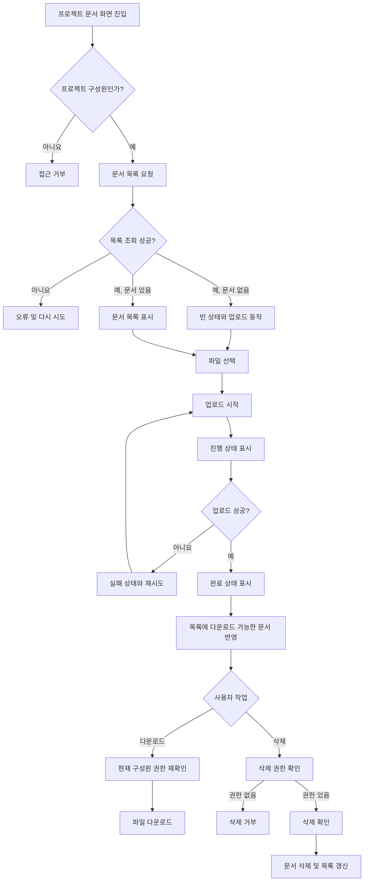

# 사내 프로젝트 문서 공유 PRD

## 1. 문서 개요

- 제품/기능명: 사내 프로젝트 문서 공유
- 문서 상태: 내부 베타 구현 기준 초안
- 목표 일정: 개발 착수 후 4주 이내 내부 베타
- 대상 사용자: 사내 직원
- 1차 출시 범위: 문서 업로드, 목록 조회, 다운로드, 삭제
- 제외 범위: 검색, 외부 공유, 신규 구성원 관리 UI

---

## 2. 적용성

| 계약 항목 | 적용 여부 | 근거 |
|---|---|---|
| 사용자 화면 및 상태 정의 | Required | 업로드, 목록, 다운로드, 삭제에 사용자 화면과 상태 피드백이 필요함 |
| 다단계 사용자 흐름 | Required | 업로드 진행·실패·재시도·완료 생명주기가 존재함 |
| 역할 및 서버 권한 | Required | 프로젝트 관리자와 일반 구성원의 삭제 권한이 다름 |
| 프로젝트 간 데이터 경계 | Required | 문서는 같은 프로젝트 구성원에게만 노출되어야 함 |
| 수치형 성능 요구사항 | Required | 목록 2초 표시 목표가 있으나 확정 SLA가 아니므로 측정 지표와 열린 결정을 명시함 |
| 외부 공유 보안 계약 | N/A | 1차 출시 범위에서 외부 공유가 명시적으로 제외됨 |
| 검색 요구사항 | N/A | 1차 출시 범위에서 검색이 명시적으로 제외됨 |
| 법적 보존·컴플라이언스 | N/A | 브리프에 근거가 없으며 별도 정책 확인이 필요함 |

---

## 3. 배경 및 문제

프로젝트 관련 문서가 여러 채널에 분산되면 구성원이 최신 문서를 찾거나 접근 권한을 관리하기 어렵다. 직원이 프로젝트 단위로 문서를 업로드하고 해당 프로젝트 구성원에게만 공유할 수 있는 중앙화된 문서 공간이 필요하다.

초기 버전은 4주 내 내부 베타가 가능하도록 핵심 문서 작업에 집중한다.

---

## 4. 목표

- 직원이 자신이 속한 프로젝트에 문서를 업로드할 수 있다.
- 프로젝트 구성원이 해당 프로젝트의 문서 목록을 조회하고 다운로드할 수 있다.
- 일반 구성원과 프로젝트 관리자에게 서로 다른 삭제 권한을 적용한다.
- 업로드 진행률, 실패, 재시도, 완료 상태를 명확하게 제공한다.
- 문서가 없는 프로젝트에서도 사용자가 현재 상태와 다음 행동을 이해할 수 있다.
- 실제 사용 환경에서 문서 목록 표시 시간을 측정하여 SLA 결정 근거를 확보한다.
- 4주 안에 사내 사용자를 대상으로 내부 베타를 제공한다.

---

## 5. 비목표

1차 출시에는 다음 기능을 포함하지 않는다.

- 문서 검색, 필터, 정렬 사용자 설정
- 외부 사용자 또는 공개 링크 공유
- 프로젝트 생성·수정·삭제
- 문서 미리보기 및 온라인 편집
- 문서 버전 관리
- 폴더 또는 계층형 문서 분류
- 문서에 대한 댓글, 멘션, 승인 워크플로
- 휴지통 또는 사용자 직접 복구
- 프로젝트 구성원 초대·제거 UI

프로젝트 관리자의 구성원 초대·제거 권한은 전체 제품 권한 모델에는 포함하지만, 1차 출시 범위에는 포함하지 않는 것으로 가정한다. 이 결정은 아래 열린 결정에서 확인이 필요하다.

---

## 6. 사용자와 역할

| 역할 | 설명 | 문서 목록/다운로드 | 업로드 | 삭제 | 구성원 관리 |
|---|---|---:|---:|---:|---:|
| 비구성원 | 해당 프로젝트에 속하지 않은 직원 | 불가 | 불가 | 불가 | 불가 |
| 일반 구성원 | 프로젝트에 참여 중인 직원 | 가능 | 가능 | 본인이 업로드한 문서만 가능 | 불가 |
| 프로젝트 관리자 | 프로젝트 관리 권한을 가진 구성원 | 가능 | 가능 | 프로젝트 내 모든 문서 가능 | 권한은 보유하나 1차 UI 제공 여부 미정 |

모든 권한은 화면의 버튼 노출 여부와 별개로 서버에서 검증해야 한다.

---

## 7. 기능 요구사항

| ID | 요구사항 | 우선순위 |
|---|---|---|
| FR-001 | 프로젝트 구성원은 자신이 속한 프로젝트의 문서 목록을 조회할 수 있어야 한다. | Must |
| FR-002 | 문서 목록에는 최소한 문서명, 업로더, 업로드 완료 시각, 다운로드 동작이 표시되어야 한다. | Must |
| FR-003 | 프로젝트에 문서가 없으면 빈 목록 안내와 업로드 행동을 제공해야 한다. | Must |
| FR-004 | 프로젝트 구성원은 로컬 파일을 선택하여 해당 프로젝트에 업로드할 수 있어야 한다. | Must |
| FR-005 | 업로드 중인 각 파일에는 진행률을 표시해야 한다. 진행률 산출이 불가능한 경우 확정되지 않은 숫자를 표시하지 않고 진행 중 상태를 표시해야 한다. | Must |
| FR-006 | 업로드 성공 시 해당 파일을 완료 상태로 표시하고 문서 목록에서 조회 및 다운로드할 수 있어야 한다. | Must |
| FR-007 | 업로드 실패 시 실패 상태와 재시도 동작을 제공해야 한다. | Must |
| FR-008 | 재시도는 사용자가 기존에 선택한 동일 파일의 업로드를 다시 시도해야 하며, 성공하지 않은 시도로 다운로드 가능한 문서가 생성되어서는 안 된다. | Must |
| FR-009 | 문서 업로드가 완료되기 전에는 다른 구성원이 해당 문서를 다운로드 가능한 정상 문서로 볼 수 없어야 한다. | Must |
| FR-010 | 프로젝트 구성원은 해당 프로젝트의 업로드 완료 문서를 다운로드할 수 있어야 한다. | Must |
| FR-011 | 일반 구성원은 자신이 업로드한 문서만 삭제할 수 있어야 한다. | Must |
| FR-012 | 프로젝트 관리자는 해당 프로젝트의 모든 문서를 삭제할 수 있어야 한다. | Must |
| FR-013 | 삭제 권한이 없는 사용자에게는 삭제 동작을 제공하지 않아야 하며, 직접 요청하더라도 서버가 거부해야 한다. | Must |
| FR-014 | 삭제 전에 대상 문서명을 포함한 확인 절차를 제공해야 한다. | Must |
| FR-015 | 삭제가 성공하면 문서를 목록에서 제거하고 이후 다운로드 요청을 허용하지 않아야 한다. | Must |
| FR-016 | 목록 조회, 업로드, 다운로드 또는 삭제가 실패하면 사용자가 실패 사실을 알 수 있어야 한다. 다시 수행 가능한 작업에는 재시도 수단을 제공해야 한다. | Must |
| FR-017 | 비구성원은 프로젝트 식별자나 문서 다운로드 주소를 알고 있더라도 해당 프로젝트의 문서 정보와 파일에 접근할 수 없어야 한다. | Must |
| FR-018 | 프로젝트 구성원 자격 또는 역할이 변경되면 이후의 목록, 다운로드, 업로드 및 삭제 요청에 변경된 권한이 적용되어야 한다. | Must |
| FR-019 | 프로젝트 관리자는 구성원을 초대하거나 제거할 수 있어야 한다. 단, 1차 출시 포함 여부는 OD-001 결정에 따른다. | Deferred |
| FR-020 | 구성원 제거 후 해당 사용자는 프로젝트 문서에 새로 접근할 수 없어야 한다. 이미 내려받은 로컬 파일의 회수는 범위에 포함하지 않는다. | Deferred |

---

## 8. 화면 및 진입점

### 8.1 프로젝트 문서 목록 화면

사용자가 특정 프로젝트에서 문서를 조회하고 핵심 작업을 수행하는 단일 화면이다.

필수 요소:

- 현재 프로젝트 식별 정보
- 문서 목록
- 문서별 문서명, 업로더, 업로드 완료 시각
- 다운로드 동작
- 권한이 있는 경우 삭제 동작
- 파일 선택 또는 업로드 시작 동작
- 업로드 진행·실패·완료 표시 영역
- 목록 로딩, 빈 목록, 오류 상태

구체적인 URL 구조와 별도 업로드 화면 사용 여부는 기존 제품의 정보 구조에 맞춰 구현한다.

### 8.2 삭제 확인 화면 또는 대화상자

- 삭제할 문서명
- 삭제가 미치는 영향
- 취소
- 삭제 확인
- 처리 중 중복 제출 방지
- 실패 시 오류 안내 및 재시도

### 8.3 구성원 관리 화면

1차 출시에는 포함하지 않는 것으로 가정한다. OD-001에서 1차 포함으로 결정될 경우 별도 화면 요구사항과 수용 기준을 추가해야 한다.

---

## 9. 사용자 상태 매트릭스

| 표면 | 빈 상태 | 로딩/진행 상태 | 오류 상태 | 성공 상태 | 복구 |
|---|---|---|---|---|---|
| 문서 목록 | 문서 없음 안내와 업로드 동작 | 목록 로딩 표시 | 목록을 불러오지 못했다는 안내 | 문서 목록 표시 | 목록 다시 시도 |
| 업로드 | 선택된 파일 없음 | 파일별 진행률 또는 진행 중 표시 | 실패한 파일과 실패 안내 | 파일별 완료 상태 및 목록 반영 | 실패 파일 재시도 |
| 다운로드 | 해당 없음 | 다운로드 시작 또는 처리 중 표시 | 다운로드 실패 안내 | 브라우저/클라이언트 다운로드 시작 | 다시 다운로드 |
| 삭제 | 해당 없음 | 삭제 처리 중, 중복 실행 방지 | 문서를 삭제하지 못했다는 안내 | 목록에서 제거 및 성공 안내 | 다시 시도 또는 취소 |
| 접근 권한 | 해당 없음 | 권한 확인 중 | 접근 불가 안내 | 허용된 화면 표시 | 프로젝트 목록 등 안전한 위치로 이동 |

완료 상태는 최소한 현재 화면에서 사용자가 업로드 성공을 인지할 수 있을 만큼 유지되어야 한다. 구체적인 표시 지속 방식은 UI 설계 단계에서 결정한다.

---

## 10. 주요 사용자 흐름

---

## 11. 권한 및 데이터 경계

### 11.1 프로젝트 경계

- 모든 문서는 정확히 하나의 프로젝트에 속한다.
- 사용자는 현재 구성원인 프로젝트의 문서만 조회할 수 있다.
- 목록 응답에 다른 프로젝트의 문서 또는 메타데이터가 섞여서는 안 된다.
- 다운로드, 삭제, 업로드 요청마다 대상 프로젝트에 대한 현재 구성원 자격을 확인한다.
- 클라이언트가 전달한 프로젝트 ID, 문서 ID, 업로더 ID 또는 역할 값만 신뢰해서는 안 된다.

### 11.2 소유권

- 문서에는 업로드를 완료한 사용자 식별자가 소유자 정보로 기록되어야 한다.
- 일반 구성원의 삭제 권한은 현재 요청 사용자와 기록된 업로더가 같은지 서버에서 판단한다.
- 프로젝트 관리자는 업로더와 관계없이 같은 프로젝트의 문서를 삭제할 수 있다.
- 관리자라는 이유로 다른 프로젝트의 문서를 삭제할 수는 없다.

### 11.3 구성원 변경

- 프로젝트에서 제거된 사용자는 이후 목록 조회, 신규 업로드 및 다운로드를 할 수 없다.
- 구성원 제거와 동시에 진행 중이던 업로드를 취소할지 여부는 열린 결정으로 남긴다.
- 관리자 역할이 해제된 사용자는 이후 다른 사용자의 문서를 삭제할 수 없다.

### 11.4 다운로드

- 영구 공개 파일 주소를 제공하지 않는다.
- 다운로드가 시작되는 시점에 사용자의 현재 프로젝트 접근 권한을 확인한다.
- 접근이 거부된 요청에서 문서명, 업로더 등 불필요한 메타데이터를 노출하지 않는다.

---

## 12. 핵심 데이터 개념

구현 방식과 저장 기술은 지정하지 않지만, 다음 정보는 제품 동작을 위해 필요하다.

### 프로젝트 구성원

- 프로젝트 식별자
- 사용자 식별자
- 역할: 일반 구성원 또는 프로젝트 관리자
- 현재 활성 여부

### 문서

- 문서 식별자
- 소속 프로젝트 식별자
- 원본 문서명
- 업로더 사용자 식별자
- 업로드 상태
- 업로드 완료 시각
- 저장된 파일을 식별할 수 있는 내부 참조
- 필요한 경우 파일 크기와 콘텐츠 유형

### 업로드 상태

최소 상태:

- 진행 중
- 실패
- 완료

사용자에게 노출할 필요가 없는 내부 정리 상태는 구현에서 추가할 수 있다. 실패하거나 중단된 업로드가 완료 문서로 취급되어서는 안 된다.

---

## 13. 비기능 요구사항

### NFR-001 성능 측정

- 문서 목록은 사용자가 화면에 진입하거나 목록 조회를 시작한 시점부터 2초 이내에 첫 번째 유의미한 결과를 보여주는 것을 제품 목표로 한다.
- 유의미한 결과는 문서 목록, 빈 상태 또는 오류 상태 중 하나다.
- 2초는 현재 내부 베타의 목표이며 확정 SLA나 출시 차단 기준이 아니다.
- 실제 측정 환경, 대상 문서 수, 네트워크 조건, 백분위 기준 및 SLA는 제품 책임자가 결정해야 한다.
- 내부 베타에서는 목록 표시 소요 시간을 측정할 수 있어야 한다.

### NFR-002 보안

- 인증된 사내 사용자만 기능에 접근할 수 있어야 한다.
- 목록, 업로드, 다운로드, 삭제의 권한은 서버에서 요청마다 검증해야 한다.
- 파일명과 오류 메시지는 실행 가능한 콘텐츠로 처리하지 않고 안전하게 표시해야 한다.
- 허용 파일 유형, 최대 크기, 악성 파일 검사 정책은 보안·운영 결정 전까지 확정 요구사항으로 간주하지 않는다.

### NFR-003 일관성

- 업로드 성공 응답 후 문서는 동일 사용자의 목록에서 조회 가능해야 한다.
- 삭제 성공 응답 후 이후의 목록과 다운로드에서는 해당 문서를 이용할 수 없어야 한다.
- 네트워크 재시도나 중복 요청이 동일한 문서의 의도하지 않은 중복 생성 또는 반복 삭제로 이어지지 않도록 해야 한다.

### NFR-004 접근성 및 사용성

- 진행, 실패, 완료 상태는 색상만으로 구분하지 않는다.
- 업로드, 다운로드, 삭제, 재시도 동작은 키보드로 수행할 수 있어야 한다.
- 처리 중 상태와 오류 안내는 보조 기술이 인식할 수 있어야 한다.

### NFR-005 운영 가시성

내부 베타에서 다음 실패를 구분하여 진단할 수 있어야 한다.

- 목록 조회 실패
- 업로드 실패
- 다운로드 실패
- 삭제 실패
- 권한 거부
- 목록 표시 시간

개인정보나 실제 파일 내용을 진단 로그에 기록해서는 안 된다.

---

## 14. 수용 기준

| ID | 연결 요구사항 | Given | When | Then | 검증 방법 |
|---|---|---|---|---|---|
| AC-001 | FR-001, FR-002 | 사용자가 프로젝트 구성원이고 완료된 문서가 존재한다 | 문서 화면에 진입한다 | 해당 프로젝트 문서의 문서명, 업로더, 완료 시각 및 다운로드 동작이 표시된다 | 통합/E2E 테스트 |
| AC-002 | FR-003 | 사용자가 프로젝트 구성원이고 문서가 없다 | 문서 목록을 조회한다 | 빈 목록 안내와 업로드 동작이 표시된다 | E2E 테스트 |
| AC-003 | FR-004, FR-005 | 구성원이 유효한 파일을 선택했다 | 업로드를 시작한다 | 파일별 진행률 또는 진행 중 상태가 표시된다 | E2E 테스트 |
| AC-004 | FR-006, FR-009 | 파일 업로드가 진행 중이다 | 업로드가 완료된다 | 완료 전에는 다운로드 가능한 문서로 노출되지 않고, 완료 후 완료 상태와 목록 항목이 표시된다 | 통합/E2E 테스트 |
| AC-005 | FR-007, FR-008 | 업로드 요청이 실패하도록 구성되어 있다 | 사용자가 업로드를 시도한다 | 실패 상태와 재시도 동작이 표시되고 다운로드 가능한 문서는 생성되지 않는다 | 장애 주입 테스트 |
| AC-006 | FR-007, FR-008 | 파일이 실패 상태다 | 사용자가 재시도를 실행하고 후속 요청이 성공한다 | 동일 파일의 새 업로드 시도가 시작되고 최종적으로 하나의 완료 문서가 제공된다 | 통합 테스트 |
| AC-007 | FR-010 | 사용자가 현재 프로젝트 구성원이며 완료 문서가 존재한다 | 다운로드를 실행한다 | 권한 확인 후 해당 문서 다운로드가 시작된다 | 통합/E2E 테스트 |
| AC-008 | FR-011 | 일반 구성원이 자신이 올린 문서를 보고 있다 | 삭제를 확인한다 | 삭제가 성공하고 문서가 목록과 후속 다운로드에서 제거된다 | 통합/E2E 테스트 |
| AC-009 | FR-011, FR-013 | 일반 구성원이 다른 구성원이 올린 문서를 보고 있다 | UI 또는 직접 요청으로 삭제를 시도한다 | UI에는 삭제 동작이 없고 직접 요청은 서버에서 거부된다 | 권한 통합 테스트 |
| AC-010 | FR-012 | 프로젝트 관리자가 프로젝트 내 다른 사용자의 문서를 보고 있다 | 삭제를 확인한다 | 삭제가 성공하고 문서가 더 이상 제공되지 않는다 | 통합/E2E 테스트 |
| AC-011 | FR-014 | 삭제 권한이 있는 사용자가 삭제를 선택한다 | 확인 단계가 나타난다 | 대상 문서명이 표시되며 취소 전에는 문서가 삭제되지 않는다 | E2E 테스트 |
| AC-012 | FR-017 | 비구성원이 프로젝트 또는 문서 식별자를 알고 있다 | 목록, 업로드, 다운로드 또는 삭제를 직접 요청한다 | 모든 요청이 거부되고 문서 메타데이터와 파일 내용이 노출되지 않는다 | 보안 통합 테스트 |
| AC-013 | FR-018 | 접근 가능했던 사용자가 프로젝트에서 제거되었다 | 제거 후 목록 또는 다운로드를 요청한다 | 요청이 거부된다 | 권한 통합 테스트 |
| AC-014 | FR-016 | 목록 조회가 실패하도록 구성되어 있다 | 사용자가 문서 화면에 진입한다 | 오류 안내와 목록 다시 시도 동작이 표시된다 | 장애 주입 E2E 테스트 |
| AC-015 | FR-016 | 삭제 요청이 실패하도록 구성되어 있다 | 사용자가 삭제를 확인한다 | 실패 안내와 재시도 수단이 표시되고 문서는 목록에 남는다 | 장애 주입 E2E 테스트 |
| AC-016 | NFR-001 | 내부 베타 측정 기능이 활성화되어 있다 | 사용자가 문서 화면에 진입한다 | 시작부터 목록·빈 상태·오류 중 하나가 표시될 때까지의 시간이 기록된다 | 계측 검증 |
| AC-017 | NFR-004 | 사용자가 키보드와 보조 기술을 사용한다 | 업로드, 다운로드, 삭제 및 재시도를 수행한다 | 동작에 접근할 수 있고 상태 변화가 텍스트 또는 의미 정보로 전달된다 | 접근성 테스트 |

FR-019와 FR-020은 1차 범위 밖이므로 OD-001에서 포함 결정이 내려지기 전까지 내부 베타 수용 기준에서 제외한다.

---

## 15. 합리적 가정

다음은 구현 진행을 위해 되돌릴 수 있는 가정이다.

- A-001: 프로젝트와 구성원 정보, 로그인 체계는 기존 시스템에 존재한다.
- A-002: 한 사용자는 여러 프로젝트에 참여할 수 있으며 역할은 프로젝트별로 다를 수 있다.
- A-003: 1차 출시는 기존 프로젝트의 문서 관리만 제공하며 프로젝트 생성 기능은 제공하지 않는다.
- A-004: 구성원 초대·제거 UI는 1차 출시 범위에 포함하지 않고 기존 관리 수단을 사용한다.
- A-005: 문서 목록에는 업로드가 완료된 문서만 정상 문서로 노출한다.
- A-006: 업로드 완료 상태는 현재 화면에서 확인 가능하며 이후에는 일반 문서 목록 항목으로 표시한다.
- A-007: 삭제 성공 후 사용자가 직접 복구할 수 있는 휴지통은 제공하지 않는다.
- A-008: 다운로드는 원본 파일명으로 제공하되 파일명은 안전하게 처리한다.
- A-009: 목록의 기본 순서는 최신 업로드 완료 문서 우선으로 한다. 검색·정렬 UI는 제공하지 않는다.
- A-010: 2초 목표는 내부 베타의 관찰 지표이며 확정 SLA나 자동 출시 차단 조건이 아니다.

---

## 16. 열린 결정

| ID | 결정 사항 | 책임자 | 결정 시점 | 미결정 시 영향 |
|---|---|---|---|---|
| OD-001 | 프로젝트 구성원 초대·제거 UI를 1차 출시에 포함할 것인가 | 제품 책임자 | 개발 1주 차 시작 전 | 포함 시 일정과 화면·권한·초대 상태 요구사항 재산정 필요 |
| OD-002 | 목록 성능의 실제 SLA, 측정 환경, 대상 문서 수, 백분위 기준은 무엇인가 | 제품 책임자 | 내부 베타 데이터 검토 후 GA 이전 | 2초는 목표로만 운영되며 계약상 보장 불가 |
| OD-003 | 업로드 가능한 최대 파일 크기와 허용/차단 파일 유형은 무엇인가 | 제품·보안·인프라 책임자 | 개발 1주 차 | 업로드 검증, 오류 문구, 저장 비용 및 테스트 범위 확정 불가 |
| OD-004 | 악성코드 검사 또는 격리 절차가 필요한가 | 보안 책임자 | 내부 베타 전 | 다운로드 안전성과 업로드 완료 시점 정의에 영향 |
| OD-005 | 삭제는 즉시 영구 삭제인가, 운영자 복구가 가능한 논리 삭제인가 | 제품·보안·운영 책임자 | 개발 1주 차 | 저장 구조, 보존 정책, 사용자 문구에 영향 |
| OD-006 | 문서 보존 기간 및 퇴사자·종료 프로젝트의 문서 처리 정책은 무엇인가 | 제품·보안 책임자 | 정식 출시 전 | 장기 보관과 삭제 운영 정책이 정의되지 않음 |
| OD-007 | 동일 프로젝트 내 같은 이름의 파일 업로드를 허용할 것인가 | 제품 책임자 | 개발 1주 차 | 중복 문서 표시 및 사용자의 최신본 인지 방식에 영향 |
| OD-008 | 프로젝트에서 제거된 사용자의 진행 중 업로드를 즉시 취소할 것인가 | 제품·보안 책임자 | 개발 2주 차 | 업로드 완료 처리와 권한 경쟁 조건에 영향 |
| OD-009 | 업로드 완료 알림의 표현과 유지 시간은 무엇인가 | 제품·디자인 책임자 | UI 구현 전 | 기능에는 영향이 작지만 완료 상태의 일관성에 영향 |
| OD-010 | 내부 베타 대상 사용자·프로젝트와 성공 판단 기준은 무엇인가 | 제품 책임자 | 개발 2주 차 | 베타 종료 및 정식 출시 판단 기준 부재 |

---

## 17. 위험 및 완화책

| 위험 | 영향 | 완화책 |
|---|---|---|
| 구성원 관리 범위가 1차 출시와 충돌함 | 4주 일정 초과 가능 | OD-001을 1주 차 전에 확정하고, 포함 시 별도 요구사항과 일정 산정 |
| 파일 크기와 유형 정책이 미정임 | 저장 비용, 보안, 오류 처리 불확실 | OD-003과 OD-004를 구현 초기에 확정 |
| UI에서만 삭제 권한을 제한함 | 직접 요청을 통한 무단 삭제 가능 | 모든 요청에 서버 권한 테스트를 필수 적용 |
| 다운로드 주소가 재사용됨 | 제거된 구성원이 계속 접근할 가능성 | 다운로드 시점에 현재 구성원 권한 확인 |
| 업로드 재시도로 중복 문서가 생김 | 목록 신뢰도 저하 | 실패 시도를 완료 문서와 분리하고 중복 요청 안전성 검증 |
| 삭제 정책이 불명확함 | 복구 불가 또는 보존 정책 위반 | OD-005 확정 전 사용자에게 “영구 삭제”라고 단정하지 않음 |
| 2초 목표가 SLA로 오인됨 | 잘못된 출시 판단 또는 약속 | 계측은 수행하되 SLA와 출시 차단 기준은 별도 결정으로 관리 |
| 프로젝트 간 데이터가 섞임 | 심각한 정보 노출 | 프로젝트 경계 기반 목록·다운로드·삭제 보안 테스트 수행 |

---

## 18. 4주 내부 베타 전달 계획

| 단계 | 기간 | 대상 요구사항 | 검증 가능한 종료 조건 |
|---|---|---|---|
| 범위·정책 확정 | 1주 차 초반 | OD-001, OD-003, OD-004, OD-005, FR-001~FR-020 범위 | 1차 포함 요구사항과 파일·삭제 정책이 기록되고 테스트 범위가 확정됨 |
| 권한·목록·다운로드 기반 | 1주 차 | FR-001~FR-003, FR-010, FR-017, FR-018 | 구성원은 목록과 다운로드에 접근하고 비구성원은 서버에서 거부되는 통합 테스트 통과 |
| 업로드 상태 구현 | 2주 차 | FR-004~FR-009 | 진행, 실패, 재시도, 완료 흐름과 불완전 문서 비노출 테스트 통과 |
| 삭제 권한 구현 | 3주 차 | FR-011~FR-016 | 일반 구성원·관리자별 삭제 권한 및 실패 복구 테스트 통과 |
| 통합 검증·계측·베타 준비 | 4주 차 | 전체 Must 요구사항, NFR-001~NFR-005 | 수용 기준 AC-001~AC-017 통과, 알려진 결함과 열린 결정 기록, 베타 대상자 접근 가능 |

### 내부 베타 출시 조건

- 모든 Must 요구사항에 연결된 수용 기준이 통과한다.
- 비구성원의 목록·다운로드·업로드·삭제 접근이 서버에서 거부된다.
- 일반 구성원이 다른 구성원의 문서를 삭제할 수 없다.
- 업로드 실패와 재시도가 사용자 화면에서 검증된다.
- 목록 표시 시간 계측이 동작한다.
- 파일 보안 정책과 삭제 정책이 내부 베타에 필요한 수준으로 결정되어 있다.
- 베타를 중단해야 할 알려진 데이터 손실 또는 프로젝트 간 정보 노출 결함이 없다.