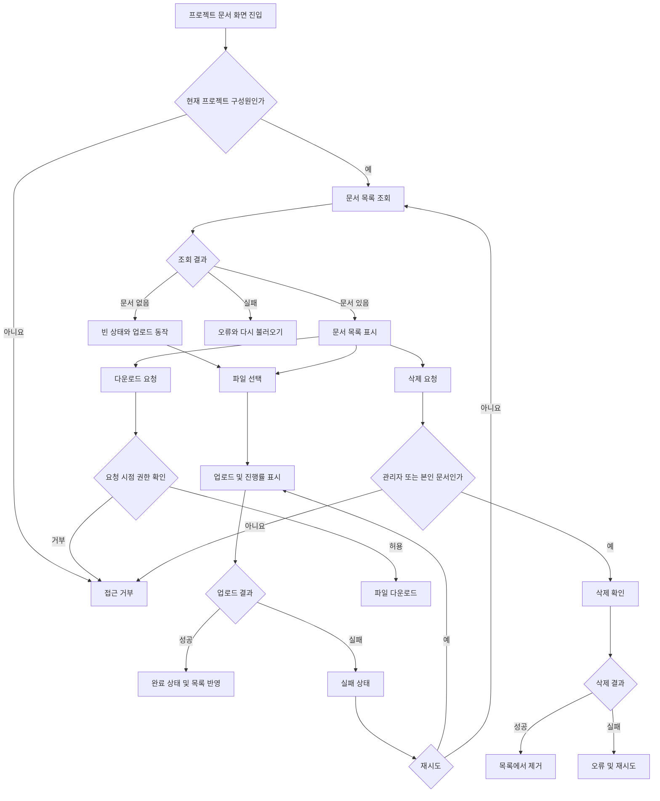

# 사내 프로젝트 문서 공유 PRD

- 문서 상태: Draft
- 목표 출시: 4주 내 내부 베타
- 대상 범위: 1차 출시
- 제품 책임자: 미정
- 핵심 원칙: 프로젝트 단위 접근 통제, 서버 측 권한 검증

## 1. 적용성

| 계약 항목 | 적용 여부 | 근거 |
|---|---|---|
| 사용자 화면 및 경로 | Required | 업로드·목록·다운로드·삭제 UI가 필요함 |
| 사용자 상태 매트릭스 | Required | 빈 목록, 업로드 진행·실패·완료 상태가 명시됨 |
| 사용자 흐름 | Required | 업로드 및 삭제가 여러 상태를 거치는 작업임 |
| 역할 및 권한 | Required | 프로젝트 관리자와 일반 구성원의 권한이 다름 |
| 데이터 경계 | Required | 프로젝트 구성원에게만 문서가 공유되어야 함 |
| 정량 성능 요구사항 | Required | 목록 2초 표시 목표가 있으나 SLA는 미결정 |
| 검색 | N/A | 1차 출시 제외 범위 |
| 외부 공유 | N/A | 1차 출시 제외 범위 |
| 구성원 관리 UI | N/A(1차 출시) | 관리자 권한으로 필요하지만 “업로드·목록·다운로드·삭제만 포함”과 충돌함. 베타에서는 기존 구성원 정보를 사용한다고 가정 |
| 분석·리포팅 | N/A | 브리프에 요구되지 않았으며 4주 베타 핵심 범위가 아님 |

---

## 2. 배경과 문제

프로젝트 문서가 개인 저장 공간이나 여러 커뮤니케이션 도구에 분산되어 있어, 같은 프로젝트 구성원이 필요한 문서를 일관된 권한 아래 업로드하고 내려받기 어렵다.

직원에게 프로젝트별 문서 공유 공간을 제공하되, 프로젝트 구성원이 아닌 사용자의 접근을 차단하고 역할 및 문서 소유권에 따라 삭제 권한을 제한해야 한다.

---

## 3. 목표

1. 직원이 자신이 참여하는 프로젝트에 문서를 업로드할 수 있다.
2. 같은 프로젝트 구성원이 문서 목록을 확인하고 다운로드할 수 있다.
3. 일반 구성원은 자신이 업로드한 문서만 삭제할 수 있다.
4. 프로젝트 관리자는 해당 프로젝트의 모든 문서를 삭제할 수 있다.
5. 업로드 진행, 실패, 재시도, 완료 상태를 명확하게 제공한다.
6. 4주 내 내부 사용자를 대상으로 베타를 제공한다.
7. 문서 목록이 빠르게 표시되도록 측정 가능한 성능 지표를 수집한다.

## 4. 비목표

1차 출시에는 다음을 포함하지 않는다.

- 문서 검색, 필터, 정렬 설정
- 외부 사용자 또는 공개 링크 공유
- 문서 미리보기 및 온라인 편집
- 문서 버전 관리 또는 기존 문서 교체
- 폴더 및 태그 관리
- 문서 공동 편집
- 휴지통 또는 사용자 직접 복구
- 감사 로그 조회 UI
- 알림
- 별도의 프로젝트 생성·관리 기능
- 구성원 초대·제거 UI. 단, 최종 포함 여부는 열린 결정 OD-01 참조

---

## 5. 사용자, 역할 및 권한

| 역할 | 문서 목록 | 업로드 | 다운로드 | 본인 문서 삭제 | 타인 문서 삭제 | 구성원 초대·제거 |
|---|---:|---:|---:|---:|---:|---:|
| 프로젝트 관리자 | 가능 | 가능 | 가능 | 가능 | 가능 | 권한상 가능하나 1차 UI 범위는 미결정 |
| 일반 구성원 | 가능 | 가능 | 가능 | 가능 | 불가 | 불가 |
| 프로젝트 비구성원 | 불가 | 불가 | 불가 | 불가 | 불가 | 불가 |

- 권한은 프로젝트별로 적용한다.
- 동일 사용자가 프로젝트 A에서는 관리자이고 프로젝트 B에서는 일반 구성원일 수 있다.
- 화면에서 버튼을 숨기는 것만으로 권한을 처리하지 않는다. 모든 목록 조회, 업로드, 다운로드, 삭제 요청에서 서버가 현재 구성원 여부와 역할을 검증해야 한다.
- 프로젝트에서 제거된 사용자는 제거 이후 해당 프로젝트의 목록 조회 및 파일 접근 권한을 잃는다.

---

## 6. 기능 요구사항

| ID | 요구사항 | 우선순위 |
|---|---|---|
| FR-01 | 사용자는 자신이 구성원으로 등록된 프로젝트의 문서 화면에만 접근할 수 있다. | Must |
| FR-02 | 문서 화면은 현재 프로젝트의 문서 목록만 반환하고 표시한다. | Must |
| FR-03 | 각 목록 항목에는 문서명, 파일 크기, 업로더, 업로드 완료 시각을 표시한다. | Must |
| FR-04 | 문서가 없을 때 빈 목록 안내와 업로드 진입점을 표시한다. | Must |
| FR-05 | 프로젝트 구성원은 로컬 파일 하나를 선택하여 업로드를 시작할 수 있다. | Must |
| FR-06 | 업로드 중 파일명과 0~100% 진행률을 표시한다. 진행률 산출이 불가능한 경우 확정되지 않은 진행 상태를 표시한다. | Must |
| FR-07 | 업로드가 성공하면 완료 상태를 표시하고 해당 문서를 목록에 반영한다. | Must |
| FR-08 | 업로드가 실패하면 실패 상태와 재시도 동작을 제공한다. | Must |
| FR-09 | 재시도는 사용자가 선택했던 동일 파일로 새로운 업로드 요청을 실행한다. | Must |
| FR-10 | 업로드가 완료되지 않은 문서는 다른 구성원의 목록에 정상 문서로 노출되지 않는다. | Must |
| FR-11 | 프로젝트 구성원은 목록의 문서를 다운로드할 수 있다. | Must |
| FR-12 | 다운로드 요청 시 서버가 요청 시점의 프로젝트 구성원 권한을 다시 검증한다. | Must |
| FR-13 | 일반 구성원에게는 자신이 업로드한 문서에만 삭제 동작을 제공한다. | Must |
| FR-14 | 프로젝트 관리자는 프로젝트 내 모든 문서를 삭제할 수 있다. | Must |
| FR-15 | 삭제 전에 대상 문서명을 포함한 확인 절차를 제공한다. | Must |
| FR-16 | 삭제가 성공하면 문서를 목록에서 제거하고 완료 피드백을 표시한다. | Must |
| FR-17 | 삭제가 실패하면 문서를 목록에 유지하고 실패 피드백 및 재시도 동작을 제공한다. | Must |
| FR-18 | 서버는 삭제 시 구성원 여부, 관리자 역할 또는 업로더 소유권을 검증한다. | Must |
| FR-19 | 동일한 파일명의 문서가 존재해도 별개의 문서로 업로드한다. 기존 문서를 자동 덮어쓰지 않는다. | Should |
| FR-20 | 접근 권한이 없거나 더 이상 유효하지 않은 경우 일반적인 권한 오류를 표시하고 문서 내용을 노출하지 않는다. | Must |
| FR-21 | 목록 조회 실패 시 오류 상태와 목록 다시 불러오기 동작을 제공한다. | Must |

---

## 7. 화면 및 경로

구체적인 URL 체계는 기존 제품 라우팅 규칙을 따른다.

### 프로젝트 문서 화면

예시 경로: `/projects/{projectId}/documents`

포함 요소:

- 프로젝트 식별 정보
- 문서 업로드 버튼 또는 파일 선택 영역
- 활성 업로드 상태 영역
- 문서 목록
- 행 단위 다운로드 동작
- 권한이 있는 사용자에게만 표시되는 삭제 동작
- 빈 목록, 로딩, 오류 상태

별도 검색 화면, 외부 공유 화면, 문서 상세 화면은 만들지 않는다.

---

## 8. 사용자 상태 매트릭스

| 영역 | 초기/로딩 | 빈 상태 | 실패 상태 | 성공 상태 | 복구 |
|---|---|---|---|---|---|
| 문서 목록 | 목록 로딩 표시 | “아직 문서가 없습니다”와 업로드 동작 표시 | 목록을 불러오지 못했다는 메시지 | 문서 목록 표시 | 다시 불러오기 |
| 업로드 | 선택 전 기본 상태 | 해당 없음 | 실패 원인 범주의 메시지 표시 | 업로드 완료 표시 후 목록 반영 | 동일 파일 재시도 |
| 업로드 진행 | 파일명과 진행률 표시 | 해당 없음 | 진행 표시를 종료하고 실패로 전환 | 100% 또는 완료 상태 | 재시도 |
| 다운로드 | 시작 피드백 | 해당 없음 | 다운로드 실패 메시지 | 브라우저 또는 클라이언트 다운로드 시작 | 다시 다운로드 |
| 삭제 확인 | 확인창 표시 | 해당 없음 | 해당 없음 | 사용자 확인 후 삭제 요청 | 취소 |
| 삭제 처리 | 처리 중 표시 및 중복 요청 방지 | 해당 없음 | 문서를 유지하고 실패 메시지 | 목록에서 제거 | 다시 삭제 |
| 권한 상실 | 해당 없음 | 해당 없음 | 접근 불가 안내 | 해당 없음 | 접근 가능한 화면으로 이동 |

업로드 완료 상태는 목록 반영 여부를 사용자가 인지할 수 있을 만큼 유지하되, 정확한 표시 시간은 UI 설계 단계에서 결정한다.

---

## 9. 주요 사용자 흐름

---

## 10. 권한 및 데이터 경계

1. 모든 문서는 정확히 하나의 프로젝트에 귀속되어야 한다.
2. 목록 API는 요청한 프로젝트에 귀속된 문서만 반환해야 한다.
3. 업로드 시 클라이언트가 전달한 프로젝트 및 업로더 정보만 신뢰하지 않고, 인증 사용자와 서버의 프로젝트 구성원 정보를 기준으로 검증해야 한다.
4. 다운로드는 추측 가능한 파일 저장 경로나 문서 ID만으로 허용해서는 안 된다.
5. 삭제는 다음 조건 중 하나를 만족할 때만 허용한다.

   - 요청 사용자가 해당 프로젝트의 관리자이다.
   - 요청 사용자가 해당 프로젝트의 일반 구성원이며 문서의 업로더이다.

6. 프로젝트 관리자는 다른 프로젝트의 문서를 관리할 수 없다.
7. 문서명, 업로더 등 메타데이터도 비구성원에게 노출하지 않는다.
8. 구성원 제거와 동시에 이후의 신규 접근 요청을 거부한다. 이미 진행 중인 다운로드의 처리 기준은 OD-06에서 결정한다.
9. 업로드 실패 또는 중단으로 생성된 불완전 파일은 정상 문서로 조회하거나 다운로드할 수 없어야 한다.
10. 파일 저장소의 물리적 삭제 방식과 보존 기간은 데이터 정책 결정 후 확정한다.

---

## 11. 비기능 요구사항

| ID | 영역 | 요구사항 |
|---|---|---|
| NFR-01 | 성능 | 문서 목록이 화면 진입 후 2초 이내 보이는 것을 제품 목표로 삼는다. 이는 확정 SLA가 아니다. |
| NFR-02 | 측정 | 목록 요청 시작부터 목록 또는 빈 상태가 표시되기까지의 시간을 측정할 수 있어야 한다. 측정 환경과 백분위 기준은 OD-02에서 확정한다. |
| NFR-03 | 보안 | 인증되지 않은 요청과 프로젝트 비구성원의 목록·업로드·다운로드·삭제 요청을 거부한다. |
| NFR-04 | 무결성 | 업로드가 성공으로 확정된 문서만 목록 및 다운로드 대상으로 제공한다. |
| NFR-05 | 오류 안전성 | 동일한 삭제 요청이 반복되어도 다른 문서가 삭제되거나 삭제된 문서가 복원되어서는 안 된다. |
| NFR-06 | 파일 안전성 | 파일명 및 콘텐츠 유형을 신뢰 가능한 서버 저장 경로나 실행 여부 판단에 직접 사용하지 않는다. |
| NFR-07 | 운영성 | 베타 기간 동안 목록 조회, 업로드, 다운로드, 삭제 실패를 운영자가 원인 조사할 수 있도록 요청 단위 오류 기록을 남긴다. 파일 내용과 인증 비밀은 기록하지 않는다. |

확정 SLA, 동시 사용자 수, 최대 문서 수, 가용성 수치는 근거가 없으므로 본 PRD에서 임의로 정하지 않는다.

---

## 12. 수용 기준

| ID | 연결 요구사항 | Given | When | Then | 검증 |
|---|---|---|---|---|---|
| AC-01 | FR-01, FR-02, FR-20 | 프로젝트 비구성원이 인증된 상태에서 | 문서 화면 또는 목록 API에 접근하면 | 요청이 거부되고 문서 메타데이터가 노출되지 않는다 | API 통합 테스트 |
| AC-02 | FR-02, FR-03 | 프로젝트에 문서가 존재할 때 | 구성원이 목록을 열면 | 해당 프로젝트 문서만 문서명·크기·업로더·완료 시각과 함께 표시된다 | UI/API 통합 테스트 |
| AC-03 | FR-04 | 프로젝트에 문서가 없을 때 | 구성원이 목록을 열면 | 빈 목록 안내와 업로드 동작이 표시된다 | UI 테스트 |
| AC-04 | FR-05, FR-06 | 구성원이 파일을 선택했을 때 | 업로드가 진행되면 | 파일명과 진행 상태가 표시된다 | UI/E2E 테스트 |
| AC-05 | FR-07, FR-10 | 업로드 요청이 성공했을 때 | 서버가 업로드 완료를 확정하면 | 완료 상태가 표시되고 문서가 목록과 다운로드 대상에 포함된다 | E2E 테스트 |
| AC-06 | FR-08, FR-09 | 업로드가 실패했을 때 | 사용자가 재시도를 선택하면 | 동일 파일의 새 업로드가 시작되고 진행 상태가 다시 표시된다 | 실패 주입 E2E 테스트 |
| AC-07 | FR-10 | 업로드가 중단되거나 실패했을 때 | 다른 구성원이 목록을 조회하면 | 미완료 문서가 표시되지 않는다 | 통합 테스트 |
| AC-08 | FR-11, FR-12 | 현재 프로젝트 구성원이 문서를 선택했을 때 | 다운로드를 요청하면 | 권한 재검증 후 올바른 파일 다운로드가 시작된다 | E2E 테스트 |
| AC-09 | FR-12, FR-20 | 구성원에서 제거된 사용자가 파일 식별자를 알고 있을 때 | 다운로드를 요청하면 | 요청이 거부되고 파일 내용이 반환되지 않는다 | 보안 통합 테스트 |
| AC-10 | FR-13, FR-18 | 일반 구성원이 본인 문서를 보고 있을 때 | 삭제를 확인하면 | 문서가 삭제되고 목록에서 제거된다 | E2E 테스트 |
| AC-11 | FR-13, FR-18 | 일반 구성원이 타인 문서 식별자를 알고 있을 때 | 삭제 API를 직접 호출하면 | 요청이 거부되고 문서는 유지된다 | 권한 통합 테스트 |
| AC-12 | FR-14, FR-18 | 프로젝트 관리자가 프로젝트 문서를 보고 있을 때 | 타인이 올린 문서의 삭제를 확인하면 | 문서가 삭제되고 목록에서 제거된다 | E2E 테스트 |
| AC-13 | FR-15 | 삭제 권한이 있는 사용자가 | 삭제 동작을 선택하면 | 문서명을 포함한 확인 절차가 먼저 표시된다 | UI 테스트 |
| AC-14 | FR-17 | 삭제 요청이 실패했을 때 | 실패 응답을 받으면 | 문서는 목록에 남고 오류 및 재시도 동작이 표시된다 | 실패 주입 UI 테스트 |
| AC-15 | FR-19 | 같은 이름의 문서가 이미 존재할 때 | 새 문서를 업로드하면 | 기존 문서는 유지되고 새 문서가 별도 항목으로 생성된다 | 통합 테스트 |
| AC-16 | FR-21 | 목록 조회가 실패했을 때 | 사용자가 다시 불러오기를 선택하면 | 새로운 목록 요청이 실행되고 성공 시 정상 목록 또는 빈 상태가 표시된다 | UI 테스트 |
| AC-17 | NFR-01, NFR-02 | 합의된 베타 측정 환경에서 | 문서 화면을 열면 | 표시 소요 시간이 기록되고 2초 목표 달성 여부를 판단할 수 있다 | 성능 측정 |
| AC-18 | NFR-05 | 동일 문서에 대한 삭제 요청이 중복 전송될 때 | 서버가 요청을 처리하면 | 대상 외 문서는 영향받지 않고 결과가 일관되게 처리된다 | 통합 테스트 |

---

## 13. 합리적 가정

| ID | 가정 | 근거 및 변경 영향 |
|---|---|---|
| AS-01 | 사내 인증과 사용자 식별 체계가 이미 존재한다. | 신규 인증 구축은 4주 베타 범위를 크게 초과함 |
| AS-02 | 프로젝트, 구성원, 관리자 역할 정보는 기존 시스템 또는 베타용 관리 절차에서 제공된다. | 별도 구성원 관리 UI를 1차 범위에서 제외하기 위한 전제 |
| AS-03 | 1차 베타는 한 번에 파일 하나를 업로드한다. | 다중 업로드 요구가 명시되지 않았으며 상태와 재시도 복잡도를 제한함 |
| AS-04 | 동일한 파일명은 허용하고 각 업로드를 고유 문서로 취급한다. | 덮어쓰기와 버전 관리가 범위에 없음 |
| AS-05 | 목록 기본 표시 정보는 문서명, 크기, 업로더, 업로드 완료 시각이다. | 사용자가 파일을 식별하기 위한 최소 메타데이터 |
| AS-06 | 삭제는 문서 단위로 수행하며 일괄 삭제는 제공하지 않는다. | 일괄 작업 요구가 없음 |
| AS-07 | 베타 지원 대상은 회사에서 공식 지원하는 기존 웹 환경이다. | 별도 모바일 앱 요구가 없음 |
| AS-08 | 목록은 우선 기본 순서로 제공하며 사용자 지정 정렬 기능은 제공하지 않는다. | 검색·필터와 함께 탐색 기능을 최소화함. 기본 순서는 OD-07에서 확정 |

---

## 14. 열린 결정

| ID | 결정 사항 | 결정권자 | 결정 시점 | 영향 |
|---|---|---|---|---|
| OD-01 | 구성원 초대·제거 UI를 1차 출시에 포함할지, 기존 시스템 또는 운영 절차로 대체할지 | 제품 책임자 | 1주 차 종료 전 | 범위, 화면, API, 일정에 큰 영향 |
| OD-02 | “2초 이내”의 측정 기준: 네트워크 환경, 데이터 규모, 캐시 여부, 백분위 기준 | 제품 책임자 + 엔지니어링 | 1주 차 종료 전 | 성능 수용 여부 및 SLA 후보 |
| OD-03 | 실제 SLA 및 베타 이후의 가용성·성능 약속 | 제품 책임자 | 베타 측정 결과 이후 | 운영 및 인프라 비용 |
| OD-04 | 허용 파일 유형, 최대 파일 크기, 사용자·프로젝트별 저장 한도 | 보안/제품/엔지니어링 | 구현 착수 전 | 업로드 검증, 오류 문구, 저장 비용 |
| OD-05 | 악성코드 검사, 차단 정책 및 검사 중 문서 상태 | 보안 책임자 | 구현 착수 전 | 업로드 완료 정의와 출시 가능성 |
| OD-06 | 구성원 제거 시 진행 중인 업로드·다운로드를 즉시 중단할지 | 보안 + 제품 책임자 | 2주 차 전 | 권한 모델과 구현 복잡도 |
| OD-07 | 문서 기본 정렬 순서 및 대규모 목록의 페이지네이션 기준 | 제품 책임자 | 1주 차 종료 전 | 목록 UX 및 2초 목표 |
| OD-08 | 삭제가 즉시 영구 삭제인지, 일정 기간 복구 가능한 논리 삭제인지 | 제품/보안/법무 | 1주 차 종료 전 | 저장 정책, 복구, 사용자 문구 |
| OD-09 | 업로드 완료 상태의 표시 방식과 유지 시간 | 제품 디자인 | UI 확정 시 | 상태 피드백 UX |
| OD-10 | 업로드 중 페이지 이탈 경고 및 업로드 지속 여부 | 제품 + 엔지니어링 | 2주 차 전 | 클라이언트 구조와 사용자 경험 |
| OD-11 | 지원 브라우저 및 접근성 준수 기준 | 제품 책임자 | 1주 차 종료 전 | 테스트 범위 |
| OD-12 | 관리자에 의한 타인 문서 삭제 기록의 보존 여부와 기간 | 보안/제품 | 베타 전 | 감사 가능성 및 운영 대응 |

OD-04와 OD-05는 보안 및 업로드 API 계약에 직접 영향을 주므로 개발 착수 전에 반드시 결정해야 한다. OD-01이 1차 포함으로 결정되면 4주 일정과 본 PRD 범위를 재산정해야 한다.

---

## 15. 위험과 완화책

| 위험 | 영향 | 완화 |
|---|---|---|
| 구성원 관리 범위의 모순 | 일정 지연 또는 핵심 기능 누락 | 1주 차에 OD-01 결정, 기본안은 기존 구성원 정보 사용 |
| 파일 크기·형식 정책 미정 | API 재작업 및 보안 문제 | 구현 전 OD-04 확정 |
| 악성 파일 업로드 | 사내 사용자와 시스템 위험 | 다운로드 실행 방지 원칙 적용, 보안 책임자가 OD-05 결정 |
| 클라이언트 UI에만 의존한 권한 처리 | 타 프로젝트 문서 노출·삭제 | 모든 요청에 서버 측 구성원·역할·소유권 검증 |
| 실패한 업로드의 잔여 데이터 | 저장 비용 및 불완전 문서 노출 | 미완료 상태 분리 및 운영 정리 정책 마련 |
| 2초 목표 정의 불명확 | 성능 달성 여부를 판정할 수 없음 | 측정 구간과 데이터 조건을 1주 차에 확정 |
| 삭제 정책 미정 | 복구 불가 또는 보존 정책 위반 | 베타 전 OD-08 확정, UI 문구와 동작을 일치시킴 |
| 프로젝트별 문서 수 증가 | 목록 응답 지연 | 베타 사용량 측정 후 페이지네이션 기준 확정 |

---

## 16. 4주 전달 계획

| 단계 | 기간 | 요구사항 | 검증 가능한 종료 조건 |
|---|---|---|---|
| 계약 확정 | 1주 차 초반 | 전체, OD-01~OD-08 | 핵심 열린 결정의 담당자와 기한이 확정되고 OD-04·OD-05가 해소됨 |
| 기반 및 목록 | 1주 차 | FR-01~FR-04, FR-20~FR-21, NFR-02~NFR-03 | 프로젝트 격리 목록과 빈·오류 상태가 AC-01~AC-03, AC-16을 통과함 |
| 업로드 | 2주 차 | FR-05~FR-10, FR-19, NFR-04, NFR-06 | 진행·완료·실패·재시도 및 미완료 격리가 AC-04~AC-07, AC-15를 통과함 |
| 다운로드·삭제 | 3주 차 | FR-11~FR-18, NFR-05 | 역할·소유권 기반 다운로드와 삭제가 AC-08~AC-14, AC-18을 통과함 |
| 통합 검증 및 베타 준비 | 4주 차 | 전체, NFR-01~NFR-07 | 핵심 E2E·권한·실패 테스트가 통과하고, 2초 목표 측정 결과와 알려진 제한사항이 기록됨 |
| 내부 베타 | 4주 차 말 | Must 전체 | 지정된 내부 사용자가 업로드·목록·다운로드·삭제 흐름을 수행할 수 있고 중대한 권한 우회 결함이 없음 |

## 17. 베타 출시 기준

다음을 모두 만족하면 내부 베타 출시 가능으로 판단한다.

- Must 요구사항에 연결된 수용 기준이 통과했다.
- 프로젝트 비구성원의 목록·다운로드·삭제 접근이 서버에서 차단된다.
- 일반 구성원이 타인 문서를 삭제할 수 없다.
- 업로드 실패 후 재시도가 가능하고 미완료 문서가 공유 목록에 노출되지 않는다.
- 파일 크기·형식 및 악성 파일 처리 정책이 확정되어 적용됐다.
- 목록 표시 시간이 합의된 방법으로 측정되며, 2초 목표 미달 시에도 원인과 후속 계획이 기록됐다.
- SLA는 베타 출시 조건으로 간주하지 않으며 제품 책임자의 별도 결정으로 확정한다.