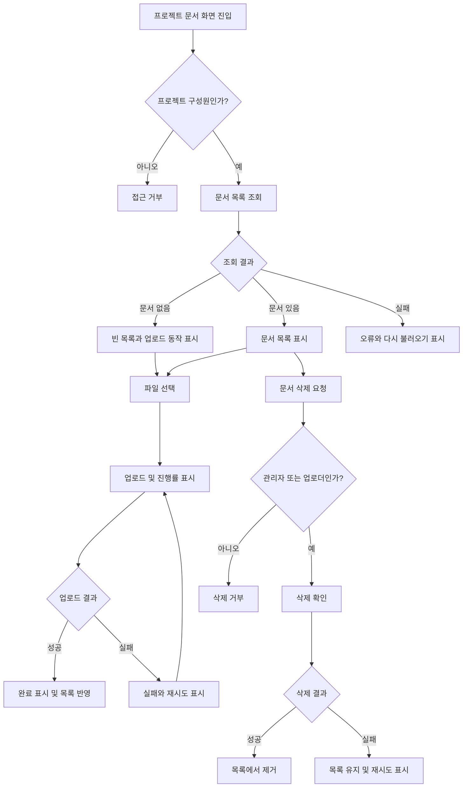

# 사내 프로젝트 문서 공유 PRD

## 1. 문서 정보

- 제품/기능명: 사내 프로젝트 문서 공유
- 문서 상태: Draft
- 목표 출시: 4주 이내 내부 베타
- 대상 범위: 1차 출시
- 제품 책임자: 미정

## 2. 적용 범위

| 계약 항목 | 적용 여부 | 근거 |
|---|---|---|
| 역할 및 권한 | Required | 프로젝트 관리자와 일반 구성원의 권한이 다름 |
| 서버 권한 검증 | Required | 프로젝트 외부 접근과 무단 삭제를 차단해야 함 |
| 화면 및 상태 정의 | Required | 목록, 업로드 진행률, 빈 목록, 실패, 완료 상태가 사용자에게 노출됨 |
| 다단계 흐름 | Required | 업로드와 삭제가 요청·처리·완료 또는 실패 단계를 가짐 |
| 성능 지표 | Required | 문서 목록을 2초 안에 표시하는 목표가 있으나 SLA는 미정 |
| 검색 | N/A | 1차 출시 제외 범위 |
| 외부 공유 | N/A | 1차 출시 제외 범위 |
| 관리자용 구성원 관리 UI | N/A | 관리자 권한으로 정의되었으나 1차 출시 기능 목록에는 포함되지 않음 |
| 분석 이벤트 | N/A | 브리프에 분석 목적이나 지표 요구가 없음 |
| 법적·규제 준수 | N/A | 별도 규제나 인증 요구가 제시되지 않음 |

---

## 3. 배경과 문제

프로젝트 관련 문서가 여러 채널에 분산되면 구성원이 최신 자료를 찾거나 공유 대상을 통제하기 어렵다. 프로젝트 구성원이 하나의 공간에서 문서를 업로드하고 내려받을 수 있으며, 역할에 따라 안전하게 삭제할 수 있는 내부 문서 공유 기능이 필요하다.

1차 출시는 핵심 문서 작업의 유효성과 사용성을 확인하는 내부 베타로 한정한다.

## 4. 목표

- 직원이 자신이 참여 중인 프로젝트에 문서를 업로드할 수 있다.
- 같은 프로젝트 구성원이 문서 목록을 확인하고 다운로드할 수 있다.
- 업로드 진행 상태와 성공·실패 결과를 명확히 알 수 있다.
- 관리자와 일반 구성원에게 서로 다른 삭제 권한을 적용한다.
- 프로젝트 간 문서 접근을 서버에서 차단한다.
- 4주 이내에 내부 사용자가 검증할 수 있는 베타를 제공한다.

## 5. 비목표

다음 항목은 1차 출시에서 제외한다.

- 문서 검색, 필터, 정렬 설정
- 회사 외부 사용자 또는 공개 링크를 통한 공유
- 문서 미리보기 및 온라인 편집
- 문서 버전 관리와 변경 이력
- 폴더 또는 태그 관리
- 다중 파일 일괄 업로드
- 관리자용 구성원 초대·제거 화면
- 휴지통 및 삭제 문서 복구
- 댓글, 멘션, 알림
- 모바일 앱 전용 기능

프로젝트 관리자의 구성원 초대·제거 권한 자체는 제품 도메인의 권한으로 유지한다. 다만 1차 출시에서는 기존 프로젝트 또는 별도 시스템에서 구성원이 관리된다고 가정한다.

## 6. 사용자와 역할

| 역할 | 정의 | 목록 조회·다운로드 | 업로드 | 문서 삭제 | 구성원 관리 |
|---|---|---:|---:|---:|---:|
| 프로젝트 관리자 | 해당 프로젝트의 관리 권한을 가진 직원 | 가능 | 가능 | 프로젝트 내 모든 문서 | 초대·제거 가능하나 1차 UI 제외 |
| 일반 구성원 | 해당 프로젝트에 참여 중인 직원 | 가능 | 가능 | 본인이 업로드한 문서만 | 불가 |
| 비구성원 | 해당 프로젝트에 참여하지 않은 직원 | 불가 | 불가 | 불가 | 불가 |

동일 사용자가 프로젝트별로 다른 역할을 가질 수 있다.

## 7. 기능 요구사항

| ID | 요구사항 | 우선순위 |
|---|---|---|
| FR-01 | 인증된 직원은 자신이 구성원인 프로젝트의 문서 화면에 접근할 수 있다. | Must |
| FR-02 | 구성원은 프로젝트 문서 목록에서 파일명, 업로더, 업로드 완료 시각, 파일 크기를 확인할 수 있다. | Must |
| FR-03 | 목록은 기본적으로 최신 업로드 완료 문서부터 표시한다. | Must |
| FR-04 | 문서가 없으면 빈 목록 상태와 업로드 유도 동작을 표시한다. | Must |
| FR-05 | 구성원은 로컬 파일 하나를 선택해 현재 프로젝트에 업로드할 수 있다. | Must |
| FR-06 | 업로드가 진행되는 동안 파일명과 0~100% 진행률을 표시한다. | Must |
| FR-07 | 업로드 성공 시 완료 상태를 표시하고 해당 문서를 목록에 반영한다. | Must |
| FR-08 | 업로드 실패 시 실패 상태와 재시도 동작을 제공한다. | Must |
| FR-09 | 재시도 시 사용자가 동일한 파일을 다시 선택하지 않아도 같은 업로드를 다시 시도한다. 단, 브라우저가 파일 참조를 유지하는 현재 세션에 한한다. | Should |
| FR-10 | 구성원은 접근 가능한 문서를 원래 파일명으로 다운로드할 수 있다. | Must |
| FR-11 | 일반 구성원은 본인이 업로드한 문서만 삭제할 수 있다. | Must |
| FR-12 | 프로젝트 관리자는 프로젝트 내 모든 문서를 삭제할 수 있다. | Must |
| FR-13 | 삭제 전 대상 파일명을 포함한 확인 절차를 제공한다. | Must |
| FR-14 | 삭제 성공 시 문서를 목록에서 제거하고 완료 결과를 표시한다. | Must |
| FR-15 | 삭제 실패 시 원래 목록 상태를 유지하고 오류와 재시도 가능한 삭제 동작을 제공한다. | Must |
| FR-16 | 서버는 모든 조회·업로드·다운로드·삭제 요청에서 프로젝트 구성원 여부와 필요한 역할 또는 소유권을 검증한다. | Must |
| FR-17 | 업로드가 완료되지 않은 파일은 다른 구성원의 목록이나 다운로드 대상에 노출하지 않는다. | Must |
| FR-18 | 목록 조회 실패 시 오류 상태와 목록 다시 불러오기 동작을 제공한다. | Must |
| FR-19 | 중복 파일명은 허용하며 각 문서는 별도 항목으로 취급한다. | Should |
| FR-20 | 구성원 초대·제거는 관리자만 수행할 수 있어야 하지만, 해당 조작 UI와 API는 1차 출시 범위에서 제외한다. | Later |

## 8. 화면 및 경로

### 프로젝트 문서 화면

권장 경로: `/projects/{projectId}/documents`

주요 구성 요소:

- 프로젝트명 및 문서 화면 제목
- 파일 선택 또는 업로드 버튼
- 현재 업로드 작업 영역
- 문서 목록
- 각 문서의 다운로드 동작
- 권한이 있는 문서에만 표시되는 삭제 동작
- 빈 목록, 오류 및 재시도 상태
- 삭제 확인 대화상자

프로젝트 선택이나 프로젝트 생성 화면은 이 PRD의 범위가 아니다.

## 9. 사용자 노출 상태

| 영역 | 초기·빈 상태 | 진행 상태 | 오류 상태 | 성공 상태 | 복구 동작 |
|---|---|---|---|---|---|
| 문서 목록 | 문서가 없다는 안내와 업로드 동작 | 목록 로딩 표시 | 불러오기 실패 안내 | 문서 목록 표시 | 다시 불러오기 |
| 업로드 | 파일 선택 동작 | 파일명과 진행률 표시 | 실패 원인에 대한 일반 안내 | 업로드 완료 표시 후 목록 반영 | 업로드 재시도 |
| 다운로드 | 별도 상태 없음 | 다운로드 시작 피드백 | 다운로드 실패 안내 | 브라우저 다운로드 시작 | 다시 다운로드 |
| 삭제 | 삭제 확인 대화상자 | 중복 요청을 막고 처리 중 표시 | 문서를 목록에 유지하고 실패 안내 | 목록에서 제거하고 완료 안내 | 삭제 재시도 |
| 접근 권한 없음 | 해당 없음 | 해당 없음 | 접근 불가 안내 | 해당 없음 | 접근 가능한 프로젝트로 이동 |

업로드 완료 표시는 목록 반영과 동시에 사라지지 않도록 짧은 확인 상태를 제공하되, 표시 시간은 디자인 단계에서 정한다.

## 10. 주요 흐름

## 11. 권한 및 데이터 경계

- 프로젝트가 문서 접근의 기본 데이터 경계다.
- 문서에는 최소한 문서 ID, 프로젝트 ID, 업로더 사용자 ID, 원래 파일명, 파일 크기, 저장 위치, 업로드 상태, 생성 시각이 연결되어야 한다.
- 목록 조회와 다운로드는 요청 시점에 프로젝트 구성원인 사용자에게만 허용한다.
- 일반 구성원의 삭제 요청은 문서의 업로더 사용자 ID가 현재 사용자와 일치할 때만 허용한다.
- 프로젝트 관리자는 같은 프로젝트에 속한 모든 문서를 삭제할 수 있다.
- 삭제 버튼을 숨기는 것만으로 권한을 구현해서는 안 되며 서버가 매 요청을 검증해야 한다.
- 사용자가 프로젝트에서 제거되면 그 시점부터 기존 문서의 목록 조회와 다운로드가 불가능해야 한다.
- 구성원 제거 여부와 관계없이 과거 업로드 문서의 소유자 기록은 유지한다.
- 파일 다운로드 주소는 비구성원이 재사용할 수 없는 권한 검증 방식이어야 한다. 임시 URL을 사용한다면 만료 시간이 필요하며 구체적 시간은 열린 결정으로 둔다.
- 업로드 중이거나 실패한 파일은 완료 문서 데이터와 분리하거나 완료 상태로 전환되기 전까지 목록에 노출하지 않는다.

## 12. 비기능 요구사항

### 성능

- NFR-01: 문서 목록의 사용자 체감 표시 시간을 측정할 수 있어야 한다.
- NFR-02: 내부 베타의 제품 목표는 정상 네트워크 조건에서 화면 진입 후 2초 이내에 문서 목록 또는 빈 상태가 보이는 것이다.
- 위 2초는 현재 제품 목표이며 보장 SLA가 아니다.
- 측정 시작점, 종료점, 대상 백분위수, 네트워크 조건 및 실제 SLA는 제품 책임자가 베타 전 결정한다.

### 안정성 및 일관성

- NFR-03: 업로드 실패가 기존 완료 문서의 조회나 다운로드에 영향을 주어서는 안 된다.
- NFR-04: 동일한 삭제 요청이 반복되어도 권한 없는 문서가 삭제되거나 다른 문서가 삭제되어서는 안 된다.
- NFR-05: 목록에는 다운로드 가능한 완료 문서만 노출해야 한다.
- NFR-06: 실패 응답은 사용자에게 재시도 가능 여부를 전달해야 하며 내부 저장 경로나 민감한 서버 정보를 노출해서는 안 된다.

### 보안

- NFR-07: 모든 기능은 사내 인증을 통과한 사용자만 사용할 수 있다.
- NFR-08: 파일명과 메타데이터를 포함한 모든 입력은 화면 출력과 저장 처리에서 안전하게 다뤄야 한다.
- NFR-09: 허용 파일 유형, 파일 크기, 악성 파일 검사 정책은 출시 전 보안 담당자 또는 제품 책임자의 승인을 받아야 한다.

### 접근성

- NFR-10: 업로드 진행률과 성공·실패 상태는 색상만으로 전달하지 않는다.
- NFR-11: 업로드, 다운로드, 삭제, 확인 및 재시도 동작은 키보드로 수행할 수 있어야 한다.

## 13. 수용 기준

| ID | 연결 요구사항 | Given | When | Then | 검증 |
|---|---|---|---|---|---|
| AC-01 | FR-01, FR-02, FR-03 | 프로젝트 구성원이며 완료 문서가 존재한다 | 문서 화면에 진입한다 | 최신 완료 문서부터 필수 메타데이터가 표시된다 | 통합/E2E |
| AC-02 | FR-04 | 프로젝트에 완료 문서가 없다 | 목록 조회가 성공한다 | 빈 목록 안내와 업로드 동작이 표시된다 | E2E |
| AC-03 | FR-05~FR-07, FR-17 | 구성원이 유효한 파일을 선택한다 | 업로드를 시작한다 | 진행률이 표시되고 성공 후에만 문서가 목록에 나타난다 | 통합/E2E |
| AC-04 | FR-08, FR-09 | 업로드 요청이 실패한다 | 실패 응답을 받는다 | 실패 상태와 재시도 동작이 표시되고 재시도로 업로드를 다시 요청할 수 있다 | 통합/E2E |
| AC-05 | FR-10, FR-16 | 프로젝트 구성원이 완료 문서를 선택한다 | 다운로드를 요청한다 | 서버 권한 확인 후 해당 파일 다운로드가 시작된다 | API/E2E |
| AC-06 | FR-11, FR-13, FR-14 | 일반 구성원이 본인 문서를 보고 있다 | 삭제를 확인한다 | 문서가 삭제되고 목록에서 제거된다 | API/E2E |
| AC-07 | FR-11, FR-16 | 일반 구성원이 다른 사용자의 문서를 알고 있다 | UI 또는 직접 API로 삭제를 요청한다 | 요청이 거부되고 문서는 유지된다 | API 보안 테스트 |
| AC-08 | FR-12 | 프로젝트 관리자가 다른 구성원의 문서를 보고 있다 | 삭제를 확인한다 | 문서가 삭제되고 목록에서 제거된다 | API/E2E |
| AC-09 | FR-15 | 권한 있는 삭제 요청의 서버 처리가 실패한다 | 실패 응답을 받는다 | 목록에 문서가 유지되고 오류 및 재시도 동작이 표시된다 | 통합/E2E |
| AC-10 | FR-16 | 비구성원이 프로젝트 ID 또는 문서 ID를 알고 있다 | 목록·업로드·다운로드·삭제 API를 호출한다 | 모든 요청이 거부되고 문서 내용과 메타데이터가 노출되지 않는다 | API 보안 테스트 |
| AC-11 | FR-18 | 목록 조회가 실패한다 | 오류 상태가 표시된 후 다시 불러오기를 선택한다 | 목록 조회가 재실행되고 성공 시 목록 또는 빈 상태가 표시된다 | E2E |
| AC-12 | NFR-02 | 합의된 내부 베타 측정 조건이 준비되어 있다 | 문서 화면 성능을 측정한다 | 목록 또는 빈 상태 표시 시간이 기록되며 2초 목표 달성 여부를 보고할 수 있다 | 성능 테스트 |
| AC-13 | NFR-10, NFR-11 | 키보드만 사용하는 사용자가 있다 | 업로드와 문서 작업을 수행한다 | 모든 주요 동작에 접근할 수 있고 상태가 텍스트 또는 보조기술로 전달된다 | 접근성 테스트 |

## 14. 합리적 가정

다음은 개발 진행을 위해 적용하는 가역적 가정이다.

- AS-01: 사내 인증과 직원 식별자는 기존 시스템에서 제공된다.
- AS-02: 프로젝트, 프로젝트 구성원, 프로젝트별 관리자 역할도 기존 시스템에 존재한다.
- AS-03: 1차 출시에서는 구성원 초대·제거를 이 기능 안에서 구현하지 않고 기존 관리 수단을 사용한다.
- AS-04: 1차 출시의 업로드 단위는 파일 하나다.
- AS-05: 목록은 페이지 진입 시 자동으로 불러오며 최신 업로드 완료 순으로 표시한다.
- AS-06: 동일한 파일명을 가진 여러 문서를 허용한다.
- AS-07: 삭제는 즉시 영구 삭제이며 복구 기능은 제공하지 않는다.
- AS-08: 업로드·삭제 완료 상태는 현재 사용자에게만 표시하고 별도 알림은 발송하지 않는다.
- AS-09: 내부 베타는 데스크톱 웹을 우선 지원하며 반응형 모바일 웹은 핵심 검증 범위가 아니다.
- AS-10: 동시 수정 기능이 없으므로 목록 갱신 시 서버 상태를 기준으로 한다.

## 15. 열린 결정

| ID | 결정 항목 | 필요한 결정 | 책임자 | 결정 시점 | 미결정 시 영향 |
|---|---|---|---|---|---|
| OD-01 | 목록 성능 SLA | 2초의 시작·종료점, 백분위수, 네트워크 조건, SLA 여부 | 제품 책임자 | 2주 차 종료 전 | 성능 합격 여부를 확정할 수 없음 |
| OD-02 | 파일 제한 | 최대 파일 크기, 허용·차단 확장자 및 MIME 유형 | 제품 책임자·보안 담당자 | 개발 1주 차 | 검증 규칙과 오류 문구 확정 불가 |
| OD-03 | 악성 파일 대응 | 업로드 시 검사 여부와 감염 파일 처리 정책 | 보안 담당자 | 베타 전 | 내부 보안 위험 |
| OD-04 | 저장 및 삭제 정책 | 물리 파일 삭제 시점, 백업 보존 기간, 복구 가능성 | 제품 책임자·인프라 담당자 | 개발 2주 차 | 영구 삭제 의미와 운영 절차 불명확 |
| OD-05 | 목록 규모 | 예상 프로젝트별 문서 수와 페이지네이션 필요 여부 | 제품 책임자 | 개발 1주 차 | 목록 성능과 API 형태에 영향 |
| OD-06 | 다운로드 URL | 서버 스트리밍 또는 만료형 임시 URL, 임시 URL 만료 시간 | 기술 책임자 | 개발 2주 차 | 권한과 성능 구현에 영향 |
| OD-07 | 지원 환경 | 지원 브라우저와 최소 버전 | 제품 책임자 | QA 시작 전 | 베타 테스트 범위 불명확 |
| OD-08 | 감사 기록 | 업로드·다운로드·삭제 이벤트의 감사 로그 필요 여부와 보존 기간 | 보안·제품 책임자 | 베타 전 | 사고 조사 및 내부 통제 수준에 영향 |
| OD-09 | 관리자 구성원 관리 | 초대·제거 UI/API의 후속 출시 시점과 기존 시스템 연동 방식 | 제품 책임자 | 베타 회고 시 | 전체 관리자 기능 완성 시점 미정 |
| OD-10 | 삭제 확인 UX | 일반 확인창 또는 파일명 재입력 등 확인 강도 | 제품·디자인 책임자 | 디자인 확정 시 | 오삭제 위험과 사용성에 영향 |

## 16. 위험과 완화책

| 위험 | 영향 | 완화책 |
|---|---|---|
| 1차 범위와 관리자 구성원 관리 요구의 혼동 | 4주 일정 확대 | 구성원 관리는 기존 시스템 의존으로 명시하고 FR-20으로 후속 분리 |
| UI에만 의존한 권한 처리 | 무단 조회·다운로드·삭제 | 모든 API에서 프로젝트 구성원·역할·소유권 검증 |
| 대용량 파일 또는 다수 문서 | 업로드 실패와 목록 지연 | 파일·목록 규모를 1주 차에 결정하고 필요 시 페이지네이션 적용 |
| 업로드 중 연결 종료 | 불완전 파일 또는 고아 데이터 | 완료 상태 전 비노출, 실패 업로드 정리 정책 적용 |
| 삭제와 다운로드의 동시 실행 | 삭제 후에도 일시적으로 다운로드 가능 | 서버 상태 기준 권한 검사와 저장소 삭제 일관성 규칙 정의 |
| 악성 파일 공유 | 내부 보안 사고 | 허용 파일 정책 및 악성 파일 검사 결정을 베타 전 필수화 |
| SLA 미정 | 출시 판정 기준 모호 | 베타 전 측정 방식과 책임자를 확정하고, 그전에는 2초를 제품 목표로만 취급 |
| 영구 삭제 오조작 | 데이터 손실 | 대상 파일명을 포함한 확인 절차와 감사 기록 여부 결정 |

## 17. 4주 전달 계획

| 단계 | 대상 요구사항 | 검증 가능한 종료 조건 |
|---|---|---|
| 1주 차: 계약 및 기반 확정 | FR-01~FR-05, FR-16, OD-02, OD-05 | 데이터 경계와 API 계약이 합의되고 구성원만 빈 목록 또는 목록을 조회할 수 있다 |
| 2주 차: 핵심 업로드·다운로드 | FR-05~FR-10, FR-17~FR-19 | 진행률, 성공, 실패, 재시도 업로드와 권한 검증 다운로드가 통합 환경에서 동작한다 |
| 3주 차: 삭제 및 상태 완성 | FR-11~FR-15 | 관리자·소유자·비소유자 삭제 시나리오와 모든 주요 오류 상태가 E2E 테스트를 통과한다 |
| 4주 차: 보안·성능·베타 준비 | 전체 Must 요구사항, NFR-01~NFR-11 | 수용 기준 테스트 결과가 기록되고, 알려진 제한 및 열린 결정의 베타 처리 방침이 승인된다 |

### 내부 베타 출시 조건

- 모든 Must 기능 요구사항이 구현되어 있다.
- AC-01부터 AC-13까지 검증 결과가 기록되어 있다.
- 권한 우회 테스트에서 프로젝트 간 데이터 노출이나 무단 삭제가 발생하지 않는다.
- 파일 제한과 악성 파일 처리 방침이 승인되어 있다.
- 목록 표시 시간은 합의된 조건으로 측정되며, 2초 목표 미달 시에도 제품 책임자가 베타 허용 여부를 명시적으로 결정한다.
- 차단 등급의 알려진 결함이 없다.
- 검색, 외부 공유, 구성원 관리 UI가 제외 범위임을 베타 사용자에게 안내한다.