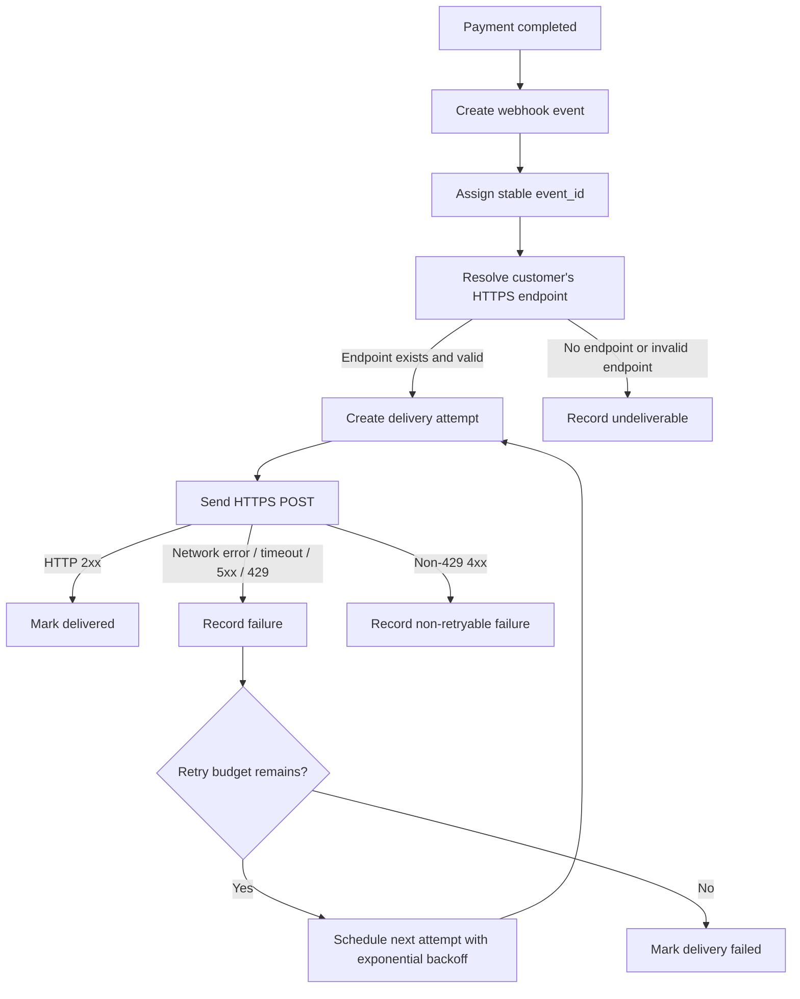

# 결제 완료 웹훅 전달 API PRD

## Applicability

| Contract | Required / N/A | Evidence |
|---|---:|---|
| Problem / goals / non-goals | Required | 결제 완료 이벤트를 고객사 endpoint로 전달해야 하며 제외 범위가 명시됨 |
| Roles and permissions | Required | 고객사별 endpoint와 데이터 격리가 필요함 |
| Functional requirements with stable IDs | Required | 구현 가능한 API/worker 동작 정의 필요 |
| Pages and routes | N/A | UI는 이번 범위에 전혀 없음 |
| State matrix | N/A | 사용자-visible 화면 상태 없음 |
| System flow | Required | 결제 완료부터 웹훅 전달, 재시도까지의 lifecycle 존재 |
| Authorization and data boundaries | Required | 고객사별 데이터 격리 필요 |
| Numeric NFR | N/A | 처리량과 지연 SLA는 측정되지 않았으며 수치 생성 금지 |
| Acceptance criteria | Required | 최소 1회 전달, 중복 가능성, 재시도 검증 필요 |

## Context and Problem

결제가 완료되면 시스템은 해당 결제의 고객사에 등록된 HTTPS endpoint로 결제 완료 이벤트를 전달해야 한다. 네트워크 실패가 발생할 수 있으므로 최소 1회 전달을 보장하고, 고객사는 동일 이벤트를 여러 번 받을 수 있다. 따라서 고객사가 멱등 처리를 할 수 있도록 안정적인 `event_id`가 필요하다.

endpoint 등록은 기존 내부 API가 담당하므로 이번 범위는 결제 완료 이벤트 생성, 고객사 endpoint 조회, 웹훅 전달, 재시도, 전달 기록, 데이터 격리에 한정한다.

## Goals

1. 결제 완료 시 등록된 고객사 HTTPS endpoint로 결제 완료 이벤트를 전달한다.
2. 네트워크 실패 또는 일시적 수신 실패에 대해 지수 백오프 기반 재시도를 수행한다.
3. 최소 1회 전달을 보장하며, 중복 전달 가능성을 명시적으로 지원한다.
4. 모든 이벤트에 고객사가 멱등 처리에 사용할 수 있는 고유하고 안정적인 `event_id`를 포함한다.
5. 고객사별 endpoint, 이벤트, 전달 기록이 다른 고객사와 섞이지 않도록 데이터 경계를 보장한다.
6. 1차 출시 범위에서 UI, replay 대시보드, 수동 재전송 기능을 제외한다.

## Non-goals

1. endpoint 등록/수정/삭제 API 구현.
2. replay 대시보드 구현.
3. 운영자 또는 고객사용 수동 재전송 기능.
4. 처리량, 지연 시간, 성공률에 대한 정량 SLA 확정.
5. 최종 서명 검증 방식과 secret rotation 정책 확정.
6. 고객사 endpoint의 비즈니스 처리 성공 여부 보장. 본 기능은 HTTP 전달과 응답 수신까지만 책임진다.

## Users, Roles, and Permissions

| Role | Description | Permission |
|---|---|---|
| Payment System | 결제 완료 이벤트의 원천 시스템 | 결제 완료 사실을 웹훅 이벤트 생성 흐름에 전달 |
| Webhook Delivery Service | 이벤트 전달 담당 내부 서비스 | 고객사 endpoint 조회, 이벤트 생성, 전달, 재시도, 기록 |
| Customer System | 고객사가 운영하는 HTTPS endpoint | 결제 완료 이벤트 수신 및 `event_id` 기반 멱등 처리 |
| Internal Operator | 내부 운영자 | 1차 출시에서는 수동 재전송 UI/기능 없음. 로그/DB 접근은 기존 내부 운영 권한 정책을 따름 |

## Functional Requirements

| ID | Requirement | Priority |
|---|---|---|
| FR-001 | 결제 상태가 완료로 확정되면 결제 완료 웹훅 이벤트를 생성해야 한다. | P0 |
| FR-002 | 각 웹훅 이벤트는 전역적으로 고유하고 재시도 동안 변하지 않는 `event_id`를 가져야 한다. | P0 |
| FR-003 | 이벤트 payload에는 최소한 `event_id`, 이벤트 타입, 발생 시각, 고객사 식별자, 결제 식별자, 결제 완료 상태를 포함해야 한다. | P0 |
| FR-004 | 시스템은 이벤트의 고객사에 등록된 HTTPS endpoint를 기존 내부 API 또는 저장소를 통해 조회해야 한다. | P0 |
| FR-005 | 등록된 endpoint가 없으면 외부 전달을 시도하지 않고 전달 불가 상태로 기록해야 한다. | P0 |
| FR-006 | endpoint URL은 HTTPS만 허용해야 하며 HTTP 또는 유효하지 않은 URL에는 전달하지 않아야 한다. | P0 |
| FR-007 | 웹훅 전달은 고객사별 데이터 경계를 유지해야 하며, 다른 고객사의 endpoint로 이벤트가 전달되어서는 안 된다. | P0 |
| FR-008 | 최초 전달 실패 시 지수 백오프 정책에 따라 자동 재시도해야 한다. | P0 |
| FR-009 | 동일 이벤트의 모든 재시도는 동일한 `event_id`와 동일한 논리 이벤트 내용을 사용해야 한다. | P0 |
| FR-010 | 고객사는 같은 `event_id`를 여러 번 받을 수 있으며, API 문서 또는 계약상 이를 명시해야 한다. | P0 |
| FR-011 | HTTP 2xx 응답은 전달 성공으로 처리해야 한다. | P0 |
| FR-012 | 네트워크 오류, timeout, HTTP 5xx, 재시도 대상 HTTP 429는 실패로 기록하고 재시도 대상이 되어야 한다. | P0 |
| FR-013 | HTTP 4xx 응답 중 429를 제외한 응답은 고객사 endpoint 또는 요청 계약 문제로 간주하고 기본적으로 재시도하지 않아야 한다. | P1 |
| FR-014 | 각 전달 시도는 attempt 번호, 요청 대상 endpoint, 응답 코드 또는 오류 유형, 시도 시각, 다음 재시도 예정 시각, 최종 상태를 기록해야 한다. | P0 |
| FR-015 | 재시도 횟수, 최대 재시도 기간, timeout 값은 설정값으로 관리되어야 하며 운영 환경별 조정 가능해야 한다. | P1 |
| FR-016 | 서명 헤더와 secret rotation 방식은 보안 담당자 결정 전까지 열린 결정으로 두되, 전달 구조는 향후 서명 헤더 추가가 가능해야 한다. | P0 |
| FR-017 | payload에는 해당 고객사에 속한 결제 데이터만 포함해야 하며, 다른 고객사의 식별자나 결제 정보가 포함되어서는 안 된다. | P0 |
| FR-018 | 재시도 worker는 중복 실행 또는 장애 복구 상황에서도 같은 이벤트를 무제한 병렬 전달하지 않도록 이벤트/attempt 단위의 동시성 제어를 해야 한다. | P1 |
| FR-019 | replay 대시보드와 수동 재전송 기능은 1차 출시에서 제공하지 않아야 한다. | P0 |
| FR-020 | 처리량과 지연 시간은 계측해야 하지만, 1차 출시 전 측정 근거 없이 SLA 수치를 제품 계약으로 고정하지 않아야 한다. | P1 |

## Pages and Routes

N/A. 이번 범위에는 UI와 사용자-visible route가 없다.

## State Matrix

N/A. 이번 범위에는 사용자-visible 화면 상태가 없다.

## System Flow

## Authorization and Data Boundaries

1. 모든 이벤트는 단일 고객사 tenant에 귀속되어야 한다.
2. endpoint 조회는 이벤트의 고객사 식별자를 기준으로만 수행해야 한다.
3. 전달 worker는 임의의 endpoint를 입력받아 호출하지 않고, 등록된 고객사 endpoint만 사용해야 한다.
4. payload 생성 시 결제 데이터의 tenant ownership을 검증해야 한다.
5. 전달 기록 조회 또는 운영 접근이 있는 경우에도 고객사별 데이터 경계를 적용해야 한다.
6. UI 숨김은 권한 통제가 아니며, 서버 측에서 tenant boundary를 강제해야 한다.
7. 서명 검증 방식은 미정이지만, 향후 고객사별 secret을 적용할 수 있도록 이벤트 전달 모델은 고객사별 secret 참조를 수용해야 한다.

## Non-functional Requirements

| Area | Requirement |
|---|---|
| Reliability | 최소 1회 전달을 목표로 하며, 성공 응답을 받기 전 실패 케이스는 재시도 대상 정책에 따라 재시도한다. |
| Idempotency | 고객사가 중복 이벤트를 안전하게 처리할 수 있도록 모든 이벤트에 안정적인 `event_id`를 포함한다. |
| Observability | 이벤트 생성, 전달 시도, 성공, 실패, 재시도 예약, 최종 실패 상태를 추적 가능해야 한다. |
| Security | HTTPS endpoint만 허용한다. 서명 방식과 secret rotation은 열린 결정으로 관리한다. |
| Isolation | 고객사별 endpoint, payload, delivery log가 분리되어야 한다. |
| Performance | 처리량, end-to-end 전달 지연, 재시도 큐 지연을 계측한다. 목표 수치는 측정 후 별도 확정한다. |
| Operability | 재시도 정책과 timeout은 설정으로 조정 가능해야 한다. 1차 출시에서는 수동 재전송 기능은 없다. |

## Acceptance Criteria

| ID | Requirement | Given | When | Then | Verification |
|---|---|---|---|---|---|
| AC-001 | FR-001 | 결제가 완료 상태로 확정됨 | 결제 완료 이벤트가 발생함 | 웹훅 이벤트가 1건 생성된다 | 결제 완료 integration test |
| AC-002 | FR-002, FR-009 | 하나의 이벤트가 여러 번 재시도됨 | 각 attempt payload를 확인함 | 모든 attempt의 `event_id`가 동일하다 | worker retry test |
| AC-003 | FR-003 | 웹훅 이벤트가 생성됨 | payload를 직렬화함 | 필수 필드가 포함된다 | payload schema test |
| AC-004 | FR-004, FR-007 | 고객사 A의 결제가 완료됨 | endpoint를 조회함 | 고객사 A의 endpoint만 사용한다 | tenant isolation test |
| AC-005 | FR-005 | 고객사에 endpoint가 없음 | 이벤트 전달 흐름이 실행됨 | 외부 HTTP 호출 없이 undeliverable 상태가 기록된다 | mocked HTTP test |
| AC-006 | FR-006 | endpoint가 HTTP URL임 | 전달 흐름이 실행됨 | HTTP 호출하지 않고 invalid endpoint 상태가 기록된다 | validation test |
| AC-007 | FR-008, FR-012 | endpoint 호출이 timeout 또는 5xx로 실패함 | retry budget이 남아 있음 | 다음 attempt가 지수 백오프 일정으로 예약된다 | retry scheduling test |
| AC-008 | FR-011 | 고객사 endpoint가 2xx를 반환함 | 전달 attempt가 완료됨 | 이벤트가 delivered 상태로 기록되고 추가 재시도하지 않는다 | delivery success test |
| AC-009 | FR-013 | 고객사 endpoint가 400을 반환함 | 전달 attempt가 완료됨 | non-retryable failure로 기록하고 기본 재시도하지 않는다 | non-retryable test |
| AC-010 | FR-014 | 전달 attempt가 실행됨 | 성공 또는 실패가 발생함 | attempt 번호, 시간, endpoint, 응답/오류, 상태가 기록된다 | persistence test |
| AC-011 | FR-017 | 고객사 A 이벤트 payload 생성 중 | 결제 데이터를 조회함 | 고객사 B의 데이터가 포함되지 않는다 | data boundary test |
| AC-012 | FR-018 | 동일 이벤트 처리 worker가 중복 실행됨 | 동시에 attempt를 생성하려 함 | 동일 attempt의 중복 병렬 전송이 방지된다 | concurrency test |
| AC-013 | FR-019 | 1차 출시 빌드 | 기능 목록을 확인함 | replay 대시보드와 수동 재전송 endpoint/UI가 없다 | scope verification |
| AC-014 | FR-020 | 운영 환경에서 전달이 발생함 | metric/log를 확인함 | 처리량과 지연 측정값은 수집되지만 SLA 수치는 계약으로 고정되어 있지 않다 | observability review |

## Assumptions

1. 결제 완료 상태는 내부 결제 시스템에서 신뢰 가능한 단일 이벤트 또는 상태 전이로 제공된다.
2. endpoint 등록/관리 데이터는 기존 내부 API 또는 저장소에서 고객사 식별자로 조회 가능하다.
3. 웹훅 전달 방식은 HTTPS `POST` JSON payload를 기본으로 한다.
4. 고객사는 `event_id`를 기준으로 멱등 처리를 구현해야 한다.
5. 재시도 정책의 구체 값은 설정으로 관리하며, 초기값은 엔지니어링/운영 검토를 통해 정한다.
6. 고객사 endpoint의 TLS 인증서가 유효하지 않거나 연결이 불가능한 경우 네트워크 실패로 취급한다.

## Open Decisions

1. 서명 방식: HMAC 기반인지, 비대칭 서명인지, 서명 대상 문자열은 무엇인지 미정.
2. Secret rotation: rotation 주기, 복수 secret 허용 기간, 고객사별 secret 배포 방식 미정.
3. Payload schema versioning: `event_type`, `api_version` 또는 `schema_version` 필드의 명명과 호환성 정책 결정 필요.
4. 재시도 정책 값: 최대 재시도 횟수, 최대 보관 기간, 초기 backoff, 최대 backoff, jitter 적용 여부 결정 필요.
5. HTTP 4xx 재시도 정책: 408, 409 등 일부 4xx를 재시도 대상으로 볼지 결정 필요.
6. endpoint 미등록 이벤트 보관 기간과 후속 처리 정책 결정 필요.
7. 처리량과 지연 SLA: 계측 후 실제 데이터 기반으로 목표치 결정 필요.
8. 개인정보 또는 민감 결제 정보 포함 범위: payload 최소화 원칙에 따라 보안/법무 검토 필요.

## Risks and Mitigations

| Risk | Impact | Mitigation |
|---|---|---|
| 중복 전달로 고객사 시스템이 중복 처리함 | 고객사 주문/정산 오류 | 안정적인 `event_id` 제공, 중복 가능성 문서화 |
| 잘못된 tenant endpoint로 전달 | 심각한 데이터 유출 | tenant ownership 검증, endpoint 조회 제한, isolation test |
| 서명 정책 미정으로 출시 보안 수준 불명확 | 고객사 신뢰 및 보안 리스크 | 서명/rotation을 출시 전 blocker 또는 제한 출시 조건으로 명확히 결정 |
| 재시도 폭주 | 내부 큐/네트워크 부하 | 지수 백오프, retry budget, timeout, rate control 설정 |
| SLA 수치 임의 설정 | 지키지 못할 계약 발생 | 계측만 우선 도입하고 목표는 측정 후 확정 |
| 수동 재전송 부재 | 운영 대응 지연 | 1차 범위 제외를 명시하고, 로그/상태 추적으로 원인 분석 가능하게 함 |

## Delivery

| Phase | Requirement IDs | Verifiable Exit Condition |
|---|---|---|
| Phase 1: Event model and payload | FR-001, FR-002, FR-003, FR-009, FR-010 | 결제 완료 시 stable `event_id`를 가진 payload 생성 테스트 통과 |
| Phase 2: Endpoint resolution and tenant boundary | FR-004, FR-005, FR-006, FR-007, FR-017 | 고객사별 endpoint 조회와 잘못된 URL 차단 테스트 통과 |
| Phase 3: Delivery and retry worker | FR-008, FR-011, FR-012, FR-013, FR-018 | 성공/실패/재시도/동시성 테스트 통과 |
| Phase 4: Logging and observability | FR-014, FR-020 | attempt 기록과 처리량/지연 계측 확인 |
| Phase 5: Scope and security readiness | FR-015, FR-016, FR-019 | 설정 기반 정책 확인, excluded feature 부재 확인, 서명/rotation 결정 상태 기록 |

Validator는 실행하지 않았습니다. 요청이 “이 응답에만 작성”이고 파일을 만들지 말라는 조건이 있어 PRD 파일 저장 및 파일 기반 검증을 수행하지 않았습니다.