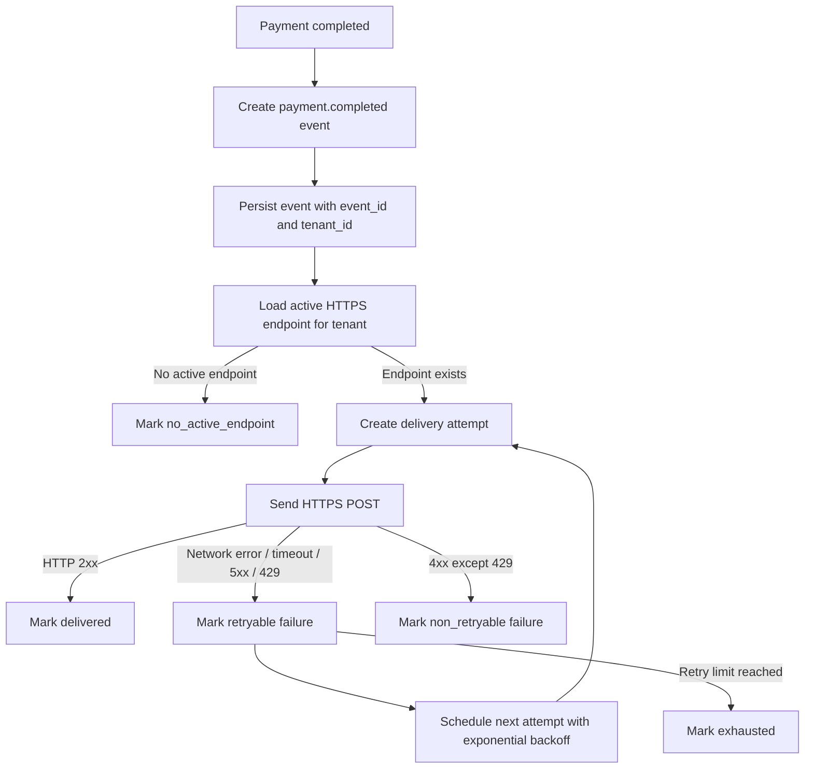

# 결제 완료 웹훅 전달 API PRD

## Applicability

| Contract | Required / N/A | Evidence |
|---|---:|---|
| Problem / goals / non-goals | Required | 결제 완료 이벤트를 고객사 HTTPS endpoint로 전달해야 함 |
| Roles / permissions | Required | 고객사별 endpoint와 데이터 격리가 필요함 |
| Functional requirements | Required | 전달, 재시도, event ID, 격리 요구가 있음 |
| Pages / routes | N/A | UI는 이번 범위에 전혀 없음 |
| State matrix | N/A | 사용자 표시 화면 없음 |
| System flow | Required | 결제 완료부터 웹훅 전달, 실패 재시도까지 lifecycle 존재 |
| Authorization / data boundaries | Required | 고객사별 데이터 격리 필요 |
| Numeric NFR | N/A | 처리량과 지연 SLA가 아직 측정되지 않았으며 수치 생성 금지 |

## Context and Problem

결제가 완료되면 시스템은 해당 고객사가 등록해 둔 HTTPS endpoint로 결제 완료 이벤트를 전달해야 한다. 네트워크 실패나 일시적 고객사 장애가 있을 수 있으므로 전달은 최소 1회 보장되어야 하며, 고객사는 같은 이벤트를 여러 번 받을 수 있다. 이를 위해 모든 이벤트에는 안정적인 event ID가 포함되어야 한다.

endpoint 등록은 기존 내부 API가 담당하며, 이번 범위는 결제 완료 이벤트 생성, 고객사 endpoint 조회, 웹훅 전달, 실패 재시도, 전달 기록, 고객사별 데이터 격리에 한정한다.

## Goals

1. 결제 완료 이벤트를 고객사별 등록 HTTPS endpoint로 자동 전달한다.
2. 네트워크 실패 또는 재시도 가능한 응답에 대해 지수 백오프로 재시도한다.
3. 최소 1회 전달 모델을 명확히 지원하고, 고객사가 중복 이벤트를 식별할 수 있도록 event ID를 제공한다.
4. 웹훅 이벤트, 전달 이력, endpoint 접근이 고객사별로 격리되도록 한다.
5. 서명 검증 및 secret rotation 방식이 확정되기 전까지 해당 항목을 열린 결정으로 추적한다.

## Non-goals

1. 고객사용 UI, 내부 운영 UI, replay 대시보드 제공.
2. 수동 재전송 기능.
3. endpoint 등록 API 신규 구현 또는 변경.
4. 처리량, 지연 시간, 성공률 SLA 수치 확정.
5. 보안 담당자가 결정하지 않은 서명 알고리즘, 헤더 포맷, secret rotation 주기 확정.
6. 고객사 endpoint의 비즈니스 처리 성공 여부 보장. 시스템은 HTTP 전달 결과만 기록한다.

## Users, Roles, and Permissions

| Role | Description | Permissions |
|---|---|---|
| Payment System | 결제 완료를 발생시키는 내부 시스템 | 결제 완료 이벤트 생성 요청 가능 |
| Webhook Delivery Service | 웹훅 이벤트를 저장하고 전달하는 내부 서비스 | 고객사별 endpoint 조회, 전달 시도, 전달 이력 기록 |
| Customer Endpoint | 고객사가 운영하는 HTTPS endpoint | 자신의 tenant 이벤트 수신 |
| Internal API | 기존 endpoint 등록 담당 API | 이번 범위 밖. 단, delivery service가 활성 endpoint를 조회할 수 있어야 함 |
| Security Owner | 서명 검증 및 secret rotation 정책 결정자 | 서명 방식과 rotation 주기 확정 |

## Functional Requirements

| ID | Requirement | Priority |
|---|---|---:|
| FR-001 | 결제 완료가 확정되면 고객사별 `payment.completed` 웹훅 이벤트를 생성해야 한다. | P0 |
| FR-002 | 각 이벤트는 전역적으로 고유하고 안정적인 `event_id`를 가져야 한다. 같은 이벤트 재시도 시 `event_id`는 변경되지 않는다. | P0 |
| FR-003 | 이벤트 payload에는 고객사가 중복 처리 방지와 결제 식별에 필요한 최소 필드를 포함해야 한다. | P0 |
| FR-004 | 시스템은 기존 내부 API 또는 내부 저장소를 통해 해당 고객사의 활성 HTTPS endpoint를 조회해야 한다. | P0 |
| FR-005 | endpoint URL은 HTTPS만 허용된 것으로 취급하며, 비HTTPS endpoint에는 전달하지 않아야 한다. | P0 |
| FR-006 | 등록된 활성 endpoint가 없으면 이벤트는 전달 시도 없이 `no_active_endpoint` 상태로 기록해야 한다. | P1 |
| FR-007 | 웹훅 전달은 최소 1회 전달 모델을 따른다. 성공 응답을 받기 전까지 재시도 정책에 따라 여러 번 전달될 수 있다. | P0 |
| FR-008 | 고객사가 HTTP 2xx 응답을 반환하면 해당 endpoint 전달을 성공으로 기록해야 한다. | P0 |
| FR-009 | 네트워크 오류, timeout, HTTP 5xx, HTTP 429는 재시도 가능한 실패로 분류해야 한다. | P0 |
| FR-010 | HTTP 4xx는 429를 제외하고 재시도하지 않는 실패로 기록해야 한다. | P0 |
| FR-011 | 재시도 가능한 실패는 지수 백오프로 다음 시도 시간을 계산해야 한다. | P0 |
| FR-012 | 최대 재시도 횟수 또는 최대 재시도 기간은 설정값으로 관리되어야 하며, 제품/운영 결정값으로 확정되어야 한다. | P0 |
| FR-013 | 모든 전달 시도는 tenant, event_id, endpoint, attempt number, timestamp, response status 또는 error category, next retry time을 기록해야 한다. | P0 |
| FR-014 | 동일 이벤트의 병렬 중복 전달을 방지하기 위해 이벤트 또는 endpoint 단위의 동시 처리 제어가 있어야 한다. | P0 |
| FR-015 | 고객사별 데이터는 tenant boundary를 기준으로 저장, 조회, 처리되어야 하며 다른 고객사의 event, endpoint, delivery log가 섞이면 안 된다. | P0 |
| FR-016 | payload에는 tenant 내부 식별자 또는 고객사가 계약상 받을 수 있는 데이터만 포함해야 하며, 다른 tenant 데이터는 포함하면 안 된다. | P0 |
| FR-017 | 서명 검증 방식이 확정되면 모든 outbound webhook 요청에 서명 관련 헤더를 포함할 수 있도록 delivery layer가 확장 가능해야 한다. | P1 |
| FR-018 | secret rotation 방식이 확정되면 고객사별 active/previous secret을 고려할 수 있도록 secret metadata와 전달 로직의 확장 지점을 마련해야 한다. | P1 |
| FR-019 | replay 대시보드와 수동 재전송 기능은 1차 출시에서 제공하지 않아야 한다. | P0 |
| FR-020 | 처리량, 지연, 재시도 성공률은 측정 가능한 지표로 기록하되, SLA 수치는 이번 PRD에서 정의하지 않는다. | P1 |

## Event Payload

초기 payload는 구현 계약을 위해 아래 형태를 기준으로 한다. 필드명은 기존 API naming convention이 있으면 그 규칙을 따른다.

```json
{
  "event_id": "evt_...",
  "event_type": "payment.completed",
  "created_at": "2026-07-27T00:00:00Z",
  "tenant_id": "tenant_...",
  "data": {
    "payment_id": "pay_...",
    "order_id": "ord_...",
    "amount": 10000,
    "currency": "KRW",
    "status": "completed",
    "completed_at": "2026-07-27T00:00:00Z"
  }
}
```

`tenant_id` 노출 가능 여부는 고객사 계약 및 보안 정책에 따라 확인이 필요하다. 노출이 부적절하면 고객사별 external account ID로 대체한다.

## Pages and Routes

N/A. 이번 범위에 UI는 없다.

## State Matrix

N/A. 사용자 표시 화면이 없다.

## System Flow



## Authorization and Data Boundaries

1. 모든 이벤트, endpoint 조회, delivery attempt, log record는 `tenant_id` 또는 동등한 tenant boundary key를 필수로 가져야 한다.
2. delivery service는 특정 tenant의 이벤트를 처리할 때 같은 tenant의 활성 endpoint만 조회해야 한다.
3. cross-tenant endpoint delivery는 심각한 보안 결함으로 간주한다.
4. 내부 운영자 또는 서비스 계정이 delivery log를 조회하는 경우에도 tenant filter가 강제되어야 한다.
5. payload 생성 시 결제 데이터는 해당 tenant 소유 여부가 검증된 뒤 포함되어야 한다.
6. endpoint 등록은 기존 내부 API가 담당하지만, delivery service는 해당 API의 응답을 신뢰하기 전에 tenant 일치성과 HTTPS 여부를 검증해야 한다.

## Non-functional Requirements

| Area | Requirement |
|---|---|
| Reliability | 최소 1회 전달을 지원한다. 중복 전달 가능성은 명시된 계약으로 취급한다. |
| Retry | 재시도 가능한 실패는 지수 백오프를 사용한다. 초기 간격, multiplier, jitter, 최대 횟수/기간은 열린 결정이다. |
| Observability | event 생성 수, attempt 수, 성공/실패 수, retry scheduled 수, exhausted 수, delivery latency 측정값을 기록한다. SLA 수치는 정의하지 않는다. |
| Security | HTTPS endpoint만 전달 대상이다. 서명 방식과 secret rotation은 보안 담당자 결정 후 확정한다. |
| Isolation | 저장, 조회, 처리, 로그에서 tenant boundary를 강제한다. |
| Idempotency | 고객사가 중복 수신을 처리할 수 있도록 안정적인 `event_id`를 제공한다. |
| Operability | 1차 출시에는 수동 재전송이 없으므로 실패 원인과 최종 상태가 로그/메트릭으로 식별 가능해야 한다. |

## Acceptance Criteria

| ID | Requirement | Given | When | Then | Verification |
|---|---|---|---|---|---|
| AC-001 | FR-001 | 결제가 완료됨 | payment completed 이벤트가 발생함 | `payment.completed` 이벤트가 생성된다 | 단위/통합 테스트 |
| AC-002 | FR-002 | 동일 이벤트가 재시도 대상임 | 여러 번 전달 시도됨 | 모든 요청 payload의 `event_id`가 동일하다 | 통합 테스트 |
| AC-003 | FR-004, FR-005 | tenant에 활성 HTTPS endpoint가 있음 | 이벤트가 생성됨 | 해당 endpoint로 HTTPS POST를 보낸다 | 통합 테스트 |
| AC-004 | FR-006 | tenant에 활성 endpoint가 없음 | 이벤트가 생성됨 | 외부 요청 없이 `no_active_endpoint` 상태가 기록된다 | 단위/통합 테스트 |
| AC-005 | FR-007, FR-008 | endpoint가 HTTP 2xx를 반환함 | 전달 시도함 | 전달 상태가 `delivered`로 기록되고 추가 재시도는 예약되지 않는다 | 통합 테스트 |
| AC-006 | FR-009, FR-011 | endpoint 요청이 timeout 됨 | 전달 시도함 | retryable failure가 기록되고 다음 시도 시간이 지수 백오프로 예약된다 | 통합 테스트 |
| AC-007 | FR-009, FR-011 | endpoint가 HTTP 500 또는 429를 반환함 | 전달 시도함 | retryable failure로 분류되고 재시도 예약된다 | 통합 테스트 |
| AC-008 | FR-010 | endpoint가 HTTP 400을 반환함 | 전달 시도함 | non-retryable failure로 기록되고 재시도하지 않는다 | 통합 테스트 |
| AC-009 | FR-013 | 전달 시도가 발생함 | 성공 또는 실패함 | attempt number, timestamp, endpoint, status/error, next retry time이 기록된다 | 단위/통합 테스트 |
| AC-010 | FR-014 | 같은 이벤트 처리 작업이 중복 실행됨 | 동시에 전달하려 함 | 병렬 중복 전달이 방지되거나 하나의 처리만 유효하게 기록된다 | 동시성 테스트 |
| AC-011 | FR-015, FR-016 | tenant A와 tenant B 데이터가 존재함 | tenant A 이벤트를 전달함 | tenant B endpoint 또는 결제 데이터가 사용되지 않는다 | 보안/통합 테스트 |
| AC-012 | FR-019 | 1차 출시 기능을 확인함 | UI 또는 운영 API surface를 검사함 | replay 대시보드와 수동 재전송 기능이 없다 | 기능 검증 |
| AC-013 | FR-020 | 운영 메트릭 수집이 활성화됨 | 전달 작업이 실행됨 | 처리량, 지연, 성공/실패, 재시도 관련 raw metric이 기록된다 | 관측성 테스트 |

## Assumptions

1. 결제 완료는 내부적으로 중복 없이 확정되는 이벤트 또는 상태 전이를 통해 감지할 수 있다.
2. endpoint 등록 정보는 기존 내부 API 또는 내부 저장소에서 tenant 단위로 조회 가능하다.
3. 1차 출시는 고객사별 단일 활성 endpoint를 기준으로 한다. 다중 endpoint가 이미 존재한다면 endpoint별 delivery 상태가 필요하다.
4. 고객사는 `event_id`를 기준으로 idempotency 처리를 수행할 수 있다.
5. HTTP 2xx는 고객사 수신 성공으로 간주한다. 고객사 내부 비즈니스 처리 결과는 별도 확인하지 않는다.
6. 서명 방식이 미확정이어도 delivery pipeline의 저장, 재시도, 격리 기능은 병렬 개발 가능하다.

## Open Decisions

| ID | Decision | Owner | Impact |
|---|---|---|---|
| OD-001 | 웹훅 서명 알고리즘, 서명 대상 문자열, 헤더 이름, timestamp 허용 오차 | Security Owner | 보안 계약 및 고객사 연동 문서 확정 필요 |
| OD-002 | secret rotation 주기, active/previous secret 허용 기간, rotation API 책임 범위 | Security Owner | 고객사 secret 관리 모델 및 호환성 영향 |
| OD-003 | 최대 재시도 횟수 또는 최대 재시도 기간 | Product / Engineering / Operations | 실패 이벤트가 `exhausted`가 되는 시점 결정 |
| OD-004 | 지수 백오프 초기 간격, multiplier, 최대 간격, jitter 적용 방식 | Engineering / Operations | 장애 시 트래픽 패턴과 복구 속도 영향 |
| OD-005 | 고객사별 단일 endpoint인지 다중 endpoint인지 | Product / Existing Internal API Owner | delivery record 모델과 성공 판정 기준 영향 |
| OD-006 | payload에 `tenant_id`를 그대로 노출할지, external customer ID로 대체할지 | Security / Product | 고객사 계약 및 데이터 노출 정책 영향 |
| OD-007 | timeout 기준값 | Engineering / Operations | 실패 분류와 재시도 빈도 영향 |
| OD-008 | 측정 후 정의할 처리량 및 지연 SLA | Product / Operations | 출시 후 SLO/SLA 계약 가능성 영향 |

## Risks and Mitigations

| Risk | Impact | Mitigation |
|---|---|---|
| 고객사가 중복 이벤트를 처리하지 못함 | 중복 주문 처리 등 downstream 문제 | 문서와 payload에 `event_id`를 명확히 제공하고 최소 1회 모델을 계약에 명시 |
| cross-tenant delivery | 심각한 데이터 유출 | tenant boundary key 필수화, endpoint 조회 시 tenant 검증, 통합 테스트 추가 |
| 재시도 폭주 | 고객사 장애 또는 네트워크 장애 시 부하 증가 | 지수 백오프, jitter, 최대 재시도 정책 설정 |
| 서명 정책 미확정 | 보안 승인 또는 고객사 연동 지연 | delivery pipeline과 signing layer를 분리하고 OD-001/OD-002를 출시 차단 결정으로 추적 |
| 수동 재전송 부재 | 운영자가 실패 이벤트를 즉시 복구하기 어려움 | 1차 출시에서는 상태와 실패 원인을 충분히 기록하고, replay는 후속 범위로 분리 |
| SLA 미정 | 기대치 불일치 | raw metric부터 수집하고 측정 후 SLA/SLO를 별도 결정 |

## Delivery

| Phase | Requirement IDs | Verifiable Exit Condition |
|---|---|---|
| Phase 1: Event model and persistence | FR-001, FR-002, FR-003, FR-013, FR-015 | 결제 완료 이벤트가 tenant와 event_id 포함 형태로 저장되고 delivery attempt 기록이 가능함 |
| Phase 2: Endpoint resolution and delivery | FR-004, FR-005, FR-006, FR-008, FR-016 | 활성 HTTPS endpoint 조회 후 POST 전달이 가능하고 endpoint 없음 상태가 기록됨 |
| Phase 3: Retry and failure classification | FR-007, FR-009, FR-010, FR-011, FR-012, FR-014 | 실패 유형별 재시도 여부가 동작하고 지수 백오프 예약 및 동시성 제어 테스트가 통과함 |
| Phase 4: Observability and launch guardrails | FR-020, FR-019 | raw metric과 상태 로그가 확인되며 replay dashboard/manual resend가 포함되지 않음 |
| Phase 5: Security policy integration | FR-017, FR-018 | 보안 담당자가 확정한 서명 및 rotation 정책이 반영되고 고객사 검증 문서가 준비됨 |

검증 참고: 사용자가 파일 생성과 저장소 탐색을 금지했으므로 PRD validator 실행이나 저장소 기반 검증은 수행하지 않았다.