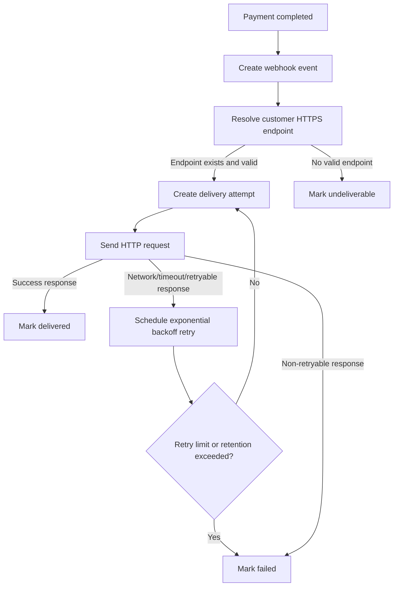

# 결제 완료 웹훅 전달 API PRD

## Applicability

| Contract | Required / N/A | Evidence |
|---|---:|---|
| Context/problem | Required | 결제 완료 이벤트를 고객사 endpoint로 전달해야 함 |
| Goals/non-goals | Required | UI 제외, replay 대시보드/수동 재전송 제외 명시 |
| Roles/permissions | Required | 고객사별 endpoint 및 데이터 격리 필요 |
| Functional requirements | Required | 전달, 재시도, event ID, HTTPS endpoint |
| Pages/routes | N/A | 이번 범위에 UI 없음 |
| State matrix | N/A | 사용자 노출 화면 없음 |
| System flow | Required | 결제 완료 후 비동기 전달/재시도 lifecycle 존재 |
| Authorization/data boundaries | Required | 고객사별 데이터 격리 필요 |
| Numeric NFR | N/A | 처리량/지연 SLA는 아직 측정되지 않음 |

## Context and Problem

결제가 완료되면 해당 결제를 소유한 고객사의 등록된 HTTPS endpoint로 `payment.completed` 이벤트를 전달해야 한다. 네트워크 실패가 발생할 수 있으므로 최소 1회 전달을 보장하고, 고객사는 동일 이벤트를 여러 번 받을 수 있어야 한다. 따라서 모든 전달 이벤트에는 멱등 처리를 위한 안정적인 `event_id`가 포함되어야 한다.

endpoint 등록은 기존 내부 API가 담당하므로 이번 범위는 “등록된 endpoint 조회 후 결제 완료 이벤트를 전달하는 API/백엔드 기능”에 한정한다.

## Goals

1. 결제 완료 시 고객사별 등록 endpoint로 웹훅 이벤트를 전달한다.
2. 네트워크 실패 또는 일시적 HTTP 실패에 대해 지수 백오프 기반 재시도를 수행한다.
3. 고객사가 중복 수신을 감지할 수 있도록 모든 이벤트에 고유하고 안정적인 `event_id`를 포함한다.
4. 고객사별 데이터가 다른 고객사 endpoint 또는 로그/재시도 작업에 섞이지 않도록 격리한다.
5. 서명 검증 방식과 secret rotation 정책이 확정되면 연결할 수 있도록 전달 구조를 준비한다.

## Non-goals

1. 고객사용 또는 운영자용 UI 제공.
2. endpoint 등록/수정/삭제 API 구현.
3. replay 대시보드.
4. 수동 재전송 기능.
5. 처리량, 지연 시간, 성공률에 대한 근거 없는 SLA 수치 정의.
6. 고객사 endpoint의 비즈니스 처리 성공 여부 보장. 본 기능은 HTTP 전달 결과까지만 책임진다.

## Users, Roles, and Permissions

| Role | Description | Permissions |
|---|---|---|
| Payment System | 결제 완료 이벤트를 발생시키는 내부 시스템 | 결제 완료 이벤트 생성 |
| Webhook Delivery Service | 이벤트를 고객사 endpoint로 전달하는 내부 백엔드 | 고객사 endpoint 조회, 전달 시도 생성, 재시도 예약 |
| Customer System | 고객사가 운영하는 HTTPS endpoint | 웹훅 이벤트 수신, `event_id` 기반 멱등 처리 |
| Internal Admin/API | 기존 endpoint 등록 API를 운영하는 내부 주체 | 이번 범위에서는 endpoint 정보를 제공하는 의존성 |

## Functional Requirements

| ID | Requirement | Priority |
|---|---|---:|
| FR-001 | 결제 완료가 확정되면 `payment.completed` 웹훅 이벤트를 생성해야 한다. | P0 |
| FR-002 | 이벤트에는 전역 고유하고 재시도 간 변하지 않는 `event_id`가 포함되어야 한다. | P0 |
| FR-003 | 이벤트에는 고객사를 식별하는 내부 `customer_id` 또는 동등한 tenant identifier가 포함되어야 하며, 다른 고객사로 노출되면 안 되는 내부 식별자는 payload 정책에 따라 제외 가능해야 한다. | P0 |
| FR-004 | 이벤트 payload에는 고객사가 결제 완료를 식별하고 처리하는 데 필요한 결제 식별자, 결제 상태, 완료 시각, 금액/통화 등 최소 필드가 포함되어야 한다. | P0 |
| FR-005 | 전달 대상은 기존 내부 API 또는 저장소에 등록된 고객사별 HTTPS endpoint만 사용해야 한다. | P0 |
| FR-006 | HTTPS가 아닌 endpoint에는 웹훅을 전달하지 않아야 한다. | P0 |
| FR-007 | 각 이벤트는 최소 1회 전달을 시도해야 한다. | P0 |
| FR-008 | 네트워크 오류, timeout, 또는 재시도 대상 HTTP 응답에 대해 지수 백오프 방식으로 재시도해야 한다. | P0 |
| FR-009 | 재시도 시 동일한 `event_id`와 동일한 event semantic을 유지해야 한다. | P0 |
| FR-010 | 고객사 endpoint가 성공 응답을 반환하면 해당 이벤트 전달을 성공 처리해야 한다. 성공으로 간주할 HTTP status 범위는 열린 결정으로 둔다. | P0 |
| FR-011 | 재시도 한도 또는 보존 기간을 초과한 이벤트는 실패 상태로 보존되어야 하며 자동 재시도 대상에서 제외되어야 한다. 구체 한도는 열린 결정으로 둔다. | P1 |
| FR-012 | 모든 전달 시도는 event 단위로 추적 가능해야 하며, 시도 시각, endpoint, HTTP status 또는 오류 유형, 다음 재시도 예정 시각을 기록해야 한다. | P0 |
| FR-013 | 고객사 A의 이벤트, endpoint, 전달 로그, 재시도 작업은 고객사 B에서 조회되거나 사용될 수 없어야 한다. | P0 |
| FR-014 | 서명 방식과 secret rotation 정책이 확정되지 않았으므로, 1차 구현은 서명 헤더 생성부를 교체 가능한 경계로 분리해야 한다. 실제 서명 적용 여부는 보안 결정에 따른다. | P1 |
| FR-015 | 동일 결제 완료 이벤트가 내부적으로 중복 발생해도 같은 결제 완료 사실에 대해 중복 event 생성을 방지하거나, 중복 생성 시 고객사가 구분 가능한 별도 `event_id`를 갖도록 해야 한다. 정책은 구현 전에 확정해야 한다. | P0 |
| FR-016 | 전달 처리는 결제 완료 확정 처리의 성공 경로를 장시간 blocking하지 않아야 한다. | P0 |

## Pages and Routes

N/A. 이번 범위에 UI, 화면 route, 대시보드는 포함하지 않는다.

## State Matrix

N/A. 사용자 노출 화면이 없다.

## System Flow

## Authorization and Data Boundaries

1. 웹훅 이벤트 생성, endpoint 조회, 전달 시도 생성은 내부 서비스 권한으로만 수행한다.
2. 모든 event, delivery attempt, retry job은 tenant/customer scope를 필수로 가진다.
3. endpoint 조회 시 결제의 소유 고객사와 endpoint의 소유 고객사가 일치해야 한다.
4. payload에는 해당 고객사의 결제 데이터만 포함한다.
5. 로그와 모니터링 데이터에는 다른 고객사의 payload 또는 secret이 섞이면 안 된다.
6. 서명 secret이 도입될 경우 customer별 secret을 사용해야 하며, 다른 customer secret으로 서명하면 안 된다.

## Non-functional Requirements

1. Reliability: 최소 1회 전달을 보장한다. 정확히 1회 전달은 보장하지 않는다.
2. Idempotency support: 고객사가 중복 수신을 처리할 수 있도록 안정적인 `event_id`를 제공한다.
3. Observability: event 생성, 전달 성공, 전달 실패, 재시도 예약, 최종 실패를 추적할 수 있어야 한다.
4. Security: HTTPS endpoint만 허용한다.
5. Security pending: 서명 검증 방식과 secret rotation 주기는 보안 담당자 결정 후 확정한다.
6. Performance/SLA: 처리량, 평균/최대 지연, 재시도 지연 SLA는 1차 측정 전까지 목표 수치를 정의하지 않는다. 대신 측정 가능한 지표를 수집한다.

## Acceptance Criteria

| ID | Requirement | Given | When | Then | Verification |
|---|---|---|---|---|---|
| AC-001 | FR-001 | 결제가 완료됨 | 완료 이벤트가 발행됨 | `payment.completed` 웹훅 이벤트가 생성됨 | 단위/통합 테스트 |
| AC-002 | FR-002, FR-009 | 동일 이벤트가 재시도됨 | 2회 이상 전달 시도됨 | 모든 요청 payload의 `event_id`가 동일함 | 통합 테스트 |
| AC-003 | FR-005, FR-006 | 고객사 endpoint가 HTTPS로 등록됨 | 이벤트 전달 대상 조회 | 해당 HTTPS endpoint로만 요청함 | 통합 테스트 |
| AC-004 | FR-006 | endpoint가 HTTP로 등록됨 | 이벤트 전달 대상 조회 | 전달하지 않고 invalid/undeliverable 상태로 기록함 | 단위/통합 테스트 |
| AC-005 | FR-007 | 결제 완료 이벤트가 생성됨 | endpoint가 유효함 | 최소 1회 HTTP 전달을 시도함 | 통합 테스트 |
| AC-006 | FR-008 | 첫 전달이 network error로 실패함 | 재시도 스케줄러가 실행됨 | 이전보다 늦은 시간으로 재시도가 예약되며 backoff가 증가함 | 단위 테스트 |
| AC-007 | FR-010 | 고객사 endpoint가 성공 응답을 반환함 | 전달 시도 완료 | 이벤트가 delivered 상태로 저장됨 | 통합 테스트 |
| AC-008 | FR-011 | 재시도 한도 또는 보존 기간을 초과함 | 다음 재시도 평가 | 이벤트가 failed 상태가 되고 자동 재시도되지 않음 | 단위 테스트 |
| AC-009 | FR-012 | 전달 시도가 발생함 | 성공 또는 실패함 | 시도 시각, endpoint, 결과, 다음 재시도 시간이 기록됨 | DB/assertion 테스트 |
| AC-010 | FR-013 | 고객사 A 결제가 완료됨 | endpoint 조회 및 전달 수행 | 고객사 B endpoint로 요청하지 않음 | 권한/tenant 통합 테스트 |
| AC-011 | FR-014 | 서명 방식이 미확정임 | 웹훅 요청 생성 | 서명 생성 책임이 분리되어 보안 정책 확정 후 교체 가능함 | 코드 구조 리뷰 |
| AC-012 | FR-016 | 결제 완료 처리 중 웹훅 endpoint가 지연됨 | 결제 완료 transaction이 완료됨 | 외부 endpoint 지연이 결제 완료 확정 경로를 장시간 blocking하지 않음 | 통합/타임아웃 테스트 |

## Assumptions

1. 결제 완료는 내부적으로 신뢰 가능한 단일 상태 전이 또는 이벤트로 감지할 수 있다.
2. endpoint 등록 데이터는 기존 내부 API 또는 저장소에서 customer scope로 조회할 수 있다.
3. 1차 출시에서는 고객사별 활성 endpoint가 0개 또는 1개라고 가정한다. 여러 endpoint 지원이 필요하면 별도 요구사항으로 확장한다.
4. 웹훅 전달은 비동기 worker 또는 queue 기반 처리로 구현한다.
5. 고객사는 `event_id`를 저장해 중복 이벤트를 멱등 처리할 책임이 있다.
6. payload schema version을 포함해 향후 필드 추가에 대비한다.

## Open Decisions

1. 웹훅 서명 방식: HMAC 알고리즘, 서명 대상 문자열, timestamp 포함 여부, header 이름.
2. secret rotation 주기와 rotation 중 dual-secret 검증 지원 여부.
3. 성공으로 간주할 HTTP status 범위. 예: `2xx` 전체인지, 특정 status만인지.
4. 재시도 대상 HTTP status 범위. 예: `408`, `429`, `5xx` 포함 여부.
5. timeout 값, 초기 backoff, 최대 backoff, jitter 적용 여부, 최대 시도 횟수, 보존 기간.
6. endpoint 미등록 고객사의 이벤트 처리 정책. 예: undeliverable 기록만 할지, endpoint 등록 후 자동 전달할지.
7. 동일 결제 완료 이벤트 중복 발생 시 event 생성 정책. 예: 결제 ID + 이벤트 타입 기준 dedupe 여부.
8. payload에 포함할 정확한 필드 목록과 PII/민감정보 제외 기준.
9. 1차 출시 전 서명 미적용 상태로 production 전달을 허용할지 여부.

## Risks and Mitigations

| Risk | Impact | Mitigation |
|---|---|---|
| 서명 방식 미확정 | 고객사가 요청 진위를 검증하기 어려움 | 보안 결정 전 production enable 여부를 release gate로 둠 |
| 재시도 정책 미확정 | 과도한 재시도 또는 너무 빠른 포기 가능 | 설정 가능한 retry policy로 구현하고 출시 전 운영 기본값 확정 |
| 중복 전달 | 고객사 시스템 중복 처리 가능 | 안정적인 `event_id` 제공 및 문서화 |
| 고객사별 데이터 혼선 | 심각한 데이터 유출 | 모든 event/delivery/retry record에 tenant scope 강제 |
| SLA 미측정 | 성능 기대치 불명확 | 지연, 성공률, 재시도 횟수 metric을 먼저 수집 |
| endpoint 장애 장기화 | 실패 이벤트 누적 | 재시도 한도/보존 기간 확정 및 최종 실패 상태 보존 |

## Delivery

| Phase | Requirement IDs | Verifiable Exit Condition |
|---|---|---|
| Phase 1: Event creation and tenant boundary | FR-001, FR-002, FR-003, FR-013, FR-015 | 결제 완료 시 customer-scoped event가 생성되고 중복/tenant 테스트 통과 |
| Phase 2: Delivery worker | FR-004, FR-005, FR-006, FR-007, FR-010, FR-016 | HTTPS endpoint로 최소 1회 비동기 전달되고 성공 상태 기록 |
| Phase 3: Retry and failure lifecycle | FR-008, FR-009, FR-011, FR-012 | 네트워크 실패 시 backoff 재시도, 최종 실패 기록, delivery log 검증 |
| Phase 4: Security integration boundary | FR-014 | 서명 구현부가 분리되어 있고 보안 결정 후 header/signing policy 적용 가능 |
| Phase 5: Measurement readiness | NFR observability | 처리량, 지연, 성공률, 재시도 횟수, 최종 실패 수를 측정할 수 있음 |