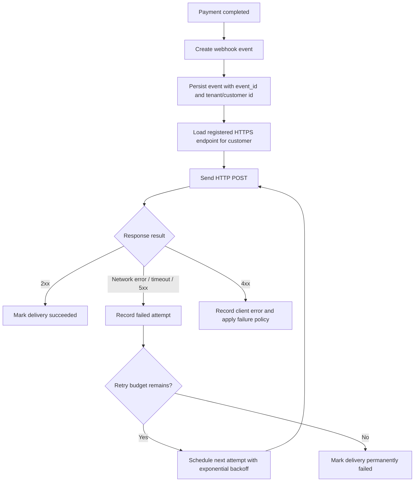

# 결제 완료 웹훅 전달 API PRD

## Applicability

| Contract | Required / N/A | Evidence |
|---|---:|---|
| 문제, 목표, 비목표 | Required | 결제 완료 시 고객사 endpoint로 이벤트 전달 필요 |
| 역할과 권한 | Required | 고객사별 endpoint와 데이터 격리 필요 |
| 기능 요구사항 ID | Required | 구현 가능한 API/시스템 요구사항 필요 |
| 인증/인가 및 데이터 경계 | Required | 고객사별 데이터 격리, 서명 검증 미결정 |
| 페이지/라우트 | N/A | UI는 이번 범위에 없음 |
| 상태 매트릭스 | N/A | 사용자 화면 없음 |
| 시스템 플로우 | Required | 결제 완료부터 재시도까지 다단계 lifecycle 존재 |
| 숫자형 NFR/SLA | N/A | 처리량과 지연 SLA는 아직 측정되지 않음 |

## Context and Problem

결제가 완료되면 등록된 고객사 HTTPS endpoint로 결제 완료 이벤트를 전달해야 한다. 고객사는 네트워크 오류, timeout, 5xx 등으로 인해 첫 전달을 받지 못할 수 있으므로 최소 1회 이상 전달을 보장해야 한다.

웹훅은 중복 전달될 수 있으므로 고객사가 idempotency 처리를 할 수 있도록 안정적인 `event_id`를 포함해야 한다. 고객사별 endpoint, secret, 이벤트, 전달 이력은 다른 고객사와 격리되어야 한다.

서명 검증 방식과 secret rotation 정책은 아직 보안 담당자가 결정하지 않았으므로 1차 PRD에서는 확정 요구사항과 열린 결정을 분리한다.

## Goals

1. 결제 완료 이벤트를 등록된 고객사 HTTPS endpoint로 자동 전달한다.
2. 네트워크 실패 또는 일시적 endpoint 실패 시 지수 백오프로 재시도한다.
3. 고객사가 중복 수신을 감지할 수 있도록 모든 이벤트에 고유한 `event_id`를 제공한다.
4. 고객사별 webhook 설정, 이벤트 payload, 전달 이력, secret 관련 데이터가 격리되도록 한다.
5. 1차 출시 범위를 API/백엔드 처리로 제한하고 UI 기능은 포함하지 않는다.

## Non-goals

1. Replay 대시보드 제공.
2. 운영자 또는 고객사의 수동 재전송 기능.
3. endpoint 등록 UI.
4. 서명 알고리즘, header 포맷, secret rotation 주기 확정.
5. 근거 없는 처리량, 지연 시간, 성공률 SLA 선언.
6. 결제 완료 외 이벤트 타입 지원.

## Users, Roles, and Permissions

| Role | Description | Permissions |
|---|---|---|
| 결제 시스템 | 결제 완료를 발생시키는 내부 시스템 | 결제 완료 이벤트 생성 요청 가능 |
| 웹훅 전달 시스템 | 이벤트 저장, 전송, 재시도 담당 내부 시스템 | 고객사 endpoint 조회, 전달 이력 기록, 재시도 스케줄링 가능 |
| 고객사 endpoint | 이벤트를 수신하는 외부 HTTPS endpoint | 자신에게 전달된 이벤트 수신 |
| 내부 API | 기존 endpoint 등록 API | 고객사별 endpoint 등록/수정 담당. 이번 범위에서는 변경하지 않음 |
| 보안 담당자 | 서명 검증/secret rotation 정책 결정자 | 서명 방식과 rotation 정책 확정 |

## Functional Requirements

| ID | Requirement | Priority |
|---|---|---:|
| FR-001 | 결제 완료가 확정되면 웹훅 이벤트를 생성해야 한다. | P0 |
| FR-002 | 각 이벤트는 전역적으로 고유하고 재시도 간 변경되지 않는 `event_id`를 가져야 한다. | P0 |
| FR-003 | 이벤트 payload에는 고객사가 중복 처리를 할 수 있는 `event_id`, 이벤트 타입, 결제 식별자, 발생 시각이 포함되어야 한다. | P0 |
| FR-004 | 이벤트는 해당 결제의 고객사에 등록된 HTTPS endpoint로만 전달되어야 한다. | P0 |
| FR-005 | endpoint URL은 HTTPS만 허용해야 한다. | P0 |
| FR-006 | 최초 전달 실패 시 최소 1회 이상 재시도해야 한다. | P0 |
| FR-007 | 재시도는 지수 백오프를 사용해야 한다. | P0 |
| FR-008 | 같은 이벤트의 모든 전달 시도는 전달 이력으로 기록되어야 한다. | P0 |
| FR-009 | 2xx 응답은 전달 성공으로 간주해야 한다. | P0 |
| FR-010 | 네트워크 오류, timeout, 5xx 응답은 재시도 가능한 실패로 간주해야 한다. | P0 |
| FR-011 | 4xx 응답 처리 정책은 구분되어야 하며, 기본적으로 영구 실패 후보로 기록해야 한다. | P1 |
| FR-012 | 최대 재시도 횟수 또는 재시도 만료 기간은 설정 가능해야 한다. | P0 |
| FR-013 | 최종 실패 상태가 된 이벤트는 재시도 큐에서 제외하되, 이력은 조회 가능하도록 보존해야 한다. | P0 |
| FR-014 | 고객사별 webhook endpoint, 이벤트, 전달 이력은 tenant/customer boundary를 넘어 조회되거나 사용되면 안 된다. | P0 |
| FR-015 | 이벤트 생성 및 전달 처리는 결제 완료 처리와 분리되어야 하며, 웹훅 전달 실패가 결제 완료 상태를 되돌리면 안 된다. | P0 |
| FR-016 | 동일 결제 완료 이벤트가 내부적으로 중복 입력되더라도 동일한 결제 완료에 대해 중복 이벤트 생성 여부가 정책적으로 통제되어야 한다. | P1 |
| FR-017 | 서명 관련 데이터 모델은 향후 서명 방식과 secret rotation을 수용할 수 있도록 고객사 단위로 secret 식별자를 연결할 수 있어야 한다. | P1 |
| FR-018 | 1차 출시에는 replay 대시보드와 수동 재전송 API를 제공하지 않는다. | P0 |

## Pages and Routes

N/A. 이번 범위에는 사용자 또는 운영자 UI가 없다.

## State Matrix

N/A. 사용자 화면 상태가 없다.

## System Flow

## Authorization and Data Boundaries

1. 모든 webhook event, endpoint 설정, delivery attempt는 `customer_id` 또는 동등한 tenant 식별자에 귀속되어야 한다.
2. 이벤트 전달 시 endpoint 조회는 이벤트의 customer boundary 내부에서만 수행해야 한다.
3. 다른 고객사의 endpoint로 이벤트가 전달되면 안 된다.
4. delivery history 조회 API가 존재한다면 tenant-scoped authorization을 강제해야 한다. 단, 이번 PRD는 조회 UI를 포함하지 않는다.
5. 서명 검증 방식은 미정이나, 향후 서명에 필요한 secret은 고객사별로 분리 저장되어야 한다.
6. 로그에는 다른 고객사의 payload, secret, endpoint credential이 노출되면 안 된다.
7. UI 숨김은 권한 통제가 아니며, 서버 레벨에서 tenant boundary를 검증해야 한다.

## Non-functional Requirements

| Area | Requirement |
|---|---|
| Reliability | 최소 1회 이상 전달을 목표로 하며, 실패 시 지수 백오프 재시도를 수행한다. |
| Idempotency Support | 고객사가 중복 수신을 처리할 수 있도록 안정적인 `event_id`를 제공한다. |
| Security | HTTPS endpoint만 허용한다. 서명 방식은 열린 결정으로 둔다. |
| Isolation | 고객사별 데이터 격리를 서버 레벨에서 강제한다. |
| Observability | 이벤트 생성, 각 전달 시도, 응답 코드, 실패 사유, 다음 재시도 예정 시각을 기록한다. |
| SLA | 처리량, 지연 시간, 성공률 SLA는 현재 설정하지 않는다. 측정 후 별도 정의한다. |

## Acceptance Criteria

| ID | Requirement | Given | When | Then | Verification |
|---|---|---|---|---|---|
| AC-001 | FR-001 | 결제가 완료됨 | 결제 완료 이벤트가 발생함 | webhook event가 생성된다 | 단위/통합 테스트 |
| AC-002 | FR-002 | webhook event가 생성됨 | 동일 이벤트가 재시도됨 | 모든 시도에서 동일한 `event_id`가 사용된다 | 단위 테스트 |
| AC-003 | FR-003 | event payload 생성 시 | 고객사 endpoint로 전송됨 | payload에 `event_id`, event type, payment id, occurred_at이 포함된다 | 계약 테스트 |
| AC-004 | FR-004, FR-014 | 고객 A와 고객 B의 endpoint가 존재함 | 고객 A의 결제가 완료됨 | 고객 A endpoint로만 전송된다 | 통합 테스트 |
| AC-005 | FR-005 | endpoint URL이 HTTP임 | 등록 또는 전달 대상 검증 시 | 전달 대상에서 제외되거나 등록이 거부된다 | 단위/통합 테스트 |
| AC-006 | FR-006, FR-007 | 최초 전송이 네트워크 오류로 실패함 | retry scheduler가 실행됨 | 지수 백오프 기반 다음 시도가 예약된다 | 단위 테스트 |
| AC-007 | FR-008 | 여러 번 전달 시도됨 | 각 시도가 종료됨 | attempt별 응답 상태와 실패 사유가 기록된다 | 통합 테스트 |
| AC-008 | FR-009 | 고객사 endpoint가 2xx 응답함 | 전송 완료됨 | delivery status가 succeeded로 변경되고 추가 재시도되지 않는다 | 통합 테스트 |
| AC-009 | FR-010 | endpoint timeout 또는 5xx 발생 | 전송 실패 처리됨 | retry budget 내에서 재시도가 예약된다 | 통합 테스트 |
| AC-010 | FR-012, FR-013 | retry budget이 소진됨 | 마지막 실패가 기록됨 | 이벤트가 permanently failed 상태가 되고 자동 재시도되지 않는다 | 단위/통합 테스트 |
| AC-011 | FR-015 | webhook 전달이 실패함 | 결제 완료 처리가 이미 확정됨 | 결제 완료 상태는 변경되지 않는다 | 통합 테스트 |
| AC-012 | FR-018 | 1차 출시 API 목록 검토 | 기능 배포 전 | replay dashboard와 manual resend endpoint가 포함되지 않는다 | 릴리스 체크 |

## Assumptions and Open Decisions

### 합리적 가정

1. endpoint 등록은 기존 내부 API가 이미 담당하며, 이번 범위에서는 등록 UI나 등록 API 변경을 하지 않는다.
2. 결제 완료 이벤트는 내부 결제 시스템에서 신뢰 가능한 상태 전환 후 발생한다.
3. 고객사 endpoint는 HTTP POST로 호출한다.
4. 고객사 성공 응답은 HTTP 2xx로 판단한다.
5. payload schema는 versioning을 지원하는 것이 바람직하다. 예: `event_type`, `event_id`, `api_version`.
6. retry budget은 환경 설정으로 관리한다. 단, 구체적인 횟수와 기간은 운영 근거 없이 PRD에서 확정하지 않는다.

### 열린 결정

| ID | Decision | Owner | Needed By |
|---|---|---|---|
| OD-001 | 웹훅 서명 알고리즘과 header 포맷 | 보안 담당자 | 외부 고객사 연동 가이드 배포 전 |
| OD-002 | secret rotation 주기와 grace period | 보안 담당자 | 서명 기능 구현 전 |
| OD-003 | 4xx 응답별 재시도 정책. 예: 400/401/403/404/410/429 처리 | API/보안/운영 | 재시도 정책 구현 전 |
| OD-004 | 최대 재시도 횟수 또는 retry expiration 기간 | 운영/제품 | 1차 배포 전 |
| OD-005 | payload schema의 정확한 필드 목록과 민감정보 제외 기준 | 제품/보안/결제 | 계약 테스트 작성 전 |
| OD-006 | 처리량, 지연 시간, 성공률 SLA | 제품/운영 | 운영 측정 데이터 확보 후 |
| OD-007 | 중복 내부 결제 완료 입력 시 같은 `event_id`를 재사용할지, 별도 이벤트를 만들지 | 결제/플랫폼 | 이벤트 생성 로직 구현 전 |

## Risks and Mitigations

| Risk | Impact | Mitigation |
|---|---|---|
| 중복 전달로 고객사 시스템이 중복 처리함 | 고객사 데이터 오류 | `event_id`를 필수 제공하고 idempotency 처리를 연동 가이드에 명시 |
| 잘못된 tenant endpoint로 전달됨 | 심각한 데이터 유출 | 모든 event, endpoint, delivery attempt에 tenant boundary 강제 |
| 서명 정책 미확정으로 보안 구현 지연 | 외부 연동 차질 | 서명/rotation은 열린 결정으로 두되 secret 식별자 확장 가능성 확보 |
| 재시도 폭증 | 시스템 부하 증가 | 지수 백오프, retry budget, 실패 상태 전환 적용 |
| SLA 수치 임의 설정 | 운영 신뢰도 저하 | 초기 배포에서는 측정 지표만 수집하고 SLA는 측정 후 확정 |
| 4xx 처리 불명확 | 불필요한 재시도 또는 조기 실패 | 4xx 세부 정책을 출시 전 열린 결정으로 확정 |

## Delivery

| Phase | Requirement IDs | Verifiable Exit Condition |
|---|---|---|
| Phase 1: Event creation | FR-001, FR-002, FR-003, FR-015 | 결제 완료 시 event가 생성되고 결제 상태와 독립적으로 저장된다 |
| Phase 2: Tenant-scoped delivery | FR-004, FR-005, FR-014 | 고객사별 HTTPS endpoint로만 POST가 전송된다 |
| Phase 3: Retry and history | FR-006, FR-007, FR-008, FR-009, FR-010, FR-012, FR-013 | 실패 시 지수 백오프 재시도와 attempt 기록이 동작한다 |
| Phase 4: Security readiness | FR-017 | 향후 서명/rotation 정책을 연결할 수 있는 customer-scoped secret 식별 구조가 준비된다 |
| Phase 5: Scope guard | FR-018 | replay dashboard와 manual resend 기능 없이 배포된다 |

검증: 사용자가 파일 생성 금지를 요청했으므로 PRD validator는 실행하지 않았습니다.