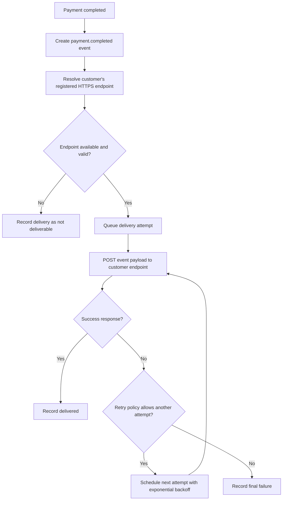

# 결제 완료 웹훅 전달 API PRD

## Applicability

| Contract | Required / N/A | Evidence |
|---|---:|---|
| Problem, goals, non-goals | Required | 결제 완료 이벤트 전달 기능 정의 필요 |
| Roles and permissions | Required | 고객사별 endpoint, 고객사별 데이터 격리 필요 |
| Functional requirements | Required | 웹훅 전달, 재시도, event ID, 중복 수신 허용 |
| Authorization and data boundaries | Required | 고객사별 데이터 격리 명시 |
| Pages and routes | N/A | UI는 이번 범위에 없음 |
| State matrix | N/A | 사용자 가시 화면 없음 |
| System flow | Required | 결제 완료 후 비동기 전달 및 재시도 흐름 존재 |
| Numeric NFR/SLA | N/A | 처리량과 지연 SLA 근거 없음 |
| Acceptance criteria | Required | 구현 가능성 검증 필요 |

## Context and Problem

결제가 완료되면 시스템은 해당 고객사에 등록된 HTTPS endpoint로 결제 완료 이벤트를 전달해야 한다. 네트워크 실패가 발생할 수 있으므로 최소 1회 전달을 보장하고, 고객사는 같은 이벤트를 여러 번 받을 수 있음을 전제로 event ID를 통해 멱등 처리를 할 수 있어야 한다.

## Goals

1. 결제 완료 이벤트를 등록된 고객사 HTTPS endpoint로 전달한다.
2. 네트워크 실패 또는 일시적 오류에 대해 지수 백오프 재시도를 수행한다.
3. 모든 전달 이벤트에 고객사가 식별 가능한 고유 `event_id`를 포함한다.
4. 고객사별 endpoint, secret, 전달 이력, 이벤트 데이터가 서로 격리되도록 한다.
5. 1차 출시 범위에서 UI 없이 서버/API/worker 동작만 제공한다.

## Non-goals

1. replay 대시보드 제공.
2. 수동 재전송 기능 제공.
3. 신규 endpoint 등록 UI 또는 관리 UI 제공.
4. 서명 검증 방식 최종 확정.
5. secret rotation 주기 최종 확정.
6. 근거 없는 처리량, 지연 시간, 성공률 SLA 확정.

## Users, Roles, and Permissions

| Role | Description | Permissions |
|---|---|---|
| Payment System | 결제 완료 이벤트를 발생시키는 내부 시스템 | 결제 완료 이벤트 생성 가능 |
| Webhook Delivery Service | 이벤트를 고객사 endpoint로 전달하는 내부 서비스 | 고객사별 endpoint 조회, 전달 작업 생성, 재시도 수행 |
| Customer Endpoint | 고객사가 운영하는 HTTPS 수신 서버 | 이벤트 수신, `event_id` 기반 중복 처리 |
| Internal Endpoint API | 기존 내부 API | 고객사 endpoint 등록 및 관리 담당, 이번 범위에서 구현 제외 |
| Security Owner | 보안 담당자 | 서명 방식과 secret rotation 정책 결정 |

## Functional Requirements

| ID | Requirement | Priority |
|---|---|---|
| FR-001 | 결제 상태가 완료로 확정되면 결제 완료 웹훅 이벤트를 생성해야 한다. | P0 |
| FR-002 | 각 웹훅 이벤트는 전역적으로 고유한 `event_id`를 가져야 한다. | P0 |
| FR-003 | 이벤트 payload에는 고객사가 중복 수신을 감지할 수 있도록 `event_id`가 포함되어야 한다. | P0 |
| FR-004 | 이벤트 payload에는 이벤트 유형을 식별할 수 있는 `event_type`을 포함해야 하며, 1차 이벤트 유형은 `payment.completed`이다. | P0 |
| FR-005 | 이벤트 payload에는 이벤트 생성 시각을 포함해야 한다. | P0 |
| FR-006 | 이벤트 payload에는 고객사가 결제 완료를 처리하는 데 필요한 결제 식별자와 완료 상태 정보를 포함해야 한다. | P0 |
| FR-007 | 웹훅 전달 대상은 기존 내부 API로 등록된 고객사별 HTTPS endpoint만 사용해야 한다. | P0 |
| FR-008 | endpoint URL이 HTTPS가 아니면 전달 대상으로 사용하지 않아야 한다. | P0 |
| FR-009 | 고객사별로 해당 고객사의 endpoint에만 이벤트를 전달해야 한다. | P0 |
| FR-010 | 전달은 최소 1회 시도되어야 한다. | P0 |
| FR-011 | 고객사 endpoint가 성공 응답을 반환하면 해당 이벤트 전달을 성공으로 기록해야 한다. | P0 |
| FR-012 | 네트워크 오류, timeout, 또는 재시도 대상 HTTP 응답이 발생하면 지수 백오프로 재시도해야 한다. | P0 |
| FR-013 | 같은 이벤트가 여러 번 전달될 수 있으며, 시스템은 exactly-once 전달을 보장하지 않는다. | P0 |
| FR-014 | 각 전달 시도는 시도 시각, 결과, HTTP status 또는 오류 유형, 다음 재시도 예정 시각을 기록해야 한다. | P1 |
| FR-015 | 재시도 횟수, 최대 재시도 기간, timeout 값은 설정값으로 관리되어야 한다. | P1 |
| FR-016 | 최종 실패 상태에 도달한 이벤트는 자동 재시도를 중단하고 실패 상태로 기록해야 한다. | P1 |
| FR-017 | 서명 헤더는 향후 보안 담당자의 결정에 따라 적용 가능하도록 확장 지점을 가져야 한다. 1차 구현에서 최종 알고리즘을 임의 확정하지 않는다. | P1 |
| FR-018 | 고객사별 secret은 다른 고객사에서 조회하거나 사용할 수 없어야 한다. | P0 |
| FR-019 | 웹훅 이벤트 데이터와 전달 이력은 고객사 단위로 격리되어야 한다. | P0 |
| FR-020 | replay 대시보드와 수동 재전송 API는 1차 출시 범위에 포함하지 않는다. | P0 |

## Pages and Routes

N/A. 이번 범위에 사용자 가시 UI, 대시보드, replay 화면, 수동 재전송 화면은 없다.

## System Flow

## Authorization and Data Boundaries

1. 모든 이벤트, endpoint 조회, 전달 작업, 전달 이력은 `customer_id` 또는 동등한 tenant 식별자에 귀속되어야 한다.
2. 고객사 A의 이벤트는 고객사 B의 endpoint로 전달될 수 없다.
3. 고객사 A의 secret, endpoint, 전달 이력은 고객사 B의 처리 경로에서 조회 또는 사용될 수 없다.
4. 내부 운영자 또는 내부 서비스 권한이 있더라도 tenant scope 없이 전체 고객사 데이터를 혼합 처리해서는 안 된다.
5. UI 숨김은 권한 제어로 간주하지 않는다. 서버 측 tenant 검증이 필요하다.

## Non-functional Requirements

| Area | Requirement |
|---|---|
| Delivery guarantee | 최소 1회 전달. 중복 전달 가능. exactly-once 보장 없음. |
| Retry | 네트워크 실패와 일시적 실패에는 지수 백오프를 적용한다. 구체 횟수와 기간은 설정값으로 둔다. |
| Security | 서명 방식과 secret rotation 주기는 열린 결정으로 남긴다. 단, 고객사별 secret 격리와 향후 서명 적용 가능성은 설계에 포함한다. |
| Observability | 이벤트별 전달 상태와 시도 이력을 추적 가능해야 한다. |
| SLA | 처리량, 지연 시간, 성공률 SLA는 아직 정의하지 않는다. 출시 전 측정 후 별도 확정한다. |

## Acceptance Criteria

| ID | Requirement | Given | When | Then | Verification |
|---|---|---|---|---|---|
| AC-001 | FR-001 | 결제가 완료 상태로 확정됨 | 결제 완료 이벤트 핸들러가 실행됨 | `payment.completed` 웹훅 이벤트가 생성됨 | 단위/통합 테스트 |
| AC-002 | FR-002, FR-003 | 웹훅 이벤트가 생성됨 | payload가 구성됨 | payload에 고유한 `event_id`가 포함됨 | 단위 테스트 |
| AC-003 | FR-004, FR-005, FR-006 | 웹훅 이벤트가 생성됨 | 고객사 endpoint로 전송됨 | payload에 `event_type`, 생성 시각, 결제 식별자, 완료 상태가 포함됨 | 계약 테스트 |
| AC-004 | FR-007, FR-008 | 고객사 endpoint가 등록됨 | 전달 대상 조회가 수행됨 | HTTPS endpoint만 전달 대상으로 사용됨 | 단위 테스트 |
| AC-005 | FR-009, FR-018, FR-019 | 여러 고객사의 endpoint가 존재함 | 고객사 A의 결제가 완료됨 | 고객사 A endpoint로만 이벤트가 전달되고 B 데이터는 참조되지 않음 | 통합 테스트 |
| AC-006 | FR-010 | 결제가 완료되고 유효 endpoint가 있음 | 전달 작업이 생성됨 | 최소 1회 POST 시도가 수행됨 | 통합 테스트 |
| AC-007 | FR-011 | 고객사 endpoint가 성공 응답을 반환함 | 전달 시도가 완료됨 | 이벤트 전달 상태가 성공으로 기록됨 | 통합 테스트 |
| AC-008 | FR-012 | 네트워크 오류 또는 timeout 발생 | 전달 시도가 실패함 | 다음 재시도가 지수 백오프로 예약됨 | 단위/통합 테스트 |
| AC-009 | FR-013 | 동일 이벤트가 재시도 대상임 | 재시도가 수행됨 | 동일 `event_id`로 다시 전달됨 | 통합 테스트 |
| AC-010 | FR-014 | 전달 시도가 수행됨 | 성공 또는 실패 결과가 발생함 | 시도 시각, 결과, status/error, 다음 재시도 시각이 기록됨 | DB/assertion 테스트 |
| AC-011 | FR-015, FR-016 | 재시도 한도에 도달함 | 추가 실패가 발생함 | 자동 재시도가 중단되고 최종 실패로 기록됨 | 단위/통합 테스트 |
| AC-012 | FR-020 | 1차 출시 빌드 | API surface를 확인함 | replay 대시보드와 수동 재전송 기능이 노출되지 않음 | API/라우트 검사 |

## Reasonable Assumptions

1. “결제 완료”는 내부 결제 시스템에서 이미 확정된 상태 이벤트로 제공된다.
2. endpoint 등록과 조회는 기존 내부 API 또는 저장소를 통해 가능하다.
3. 성공 응답은 기본적으로 HTTP 2xx로 간주한다.
4. 네트워크 오류, timeout, HTTP 5xx, HTTP 429는 재시도 대상으로 간주한다.
5. HTTP 4xx는 기본적으로 비재시도 실패로 간주하되, 429는 예외로 재시도한다.
6. payload schema는 내부 API 버전 관리 또는 이벤트 버전 필드로 확장 가능해야 한다.
7. 웹훅 전달은 결제 완료 처리 경로를 장시간 blocking하지 않는 비동기 작업으로 처리한다.

## Open Decisions

1. 서명 방식: HMAC, 비대칭 서명, 헤더 포맷, timestamp 포함 여부 미정.
2. secret rotation 주기와 rotation 중 dual-secret 검증 지원 여부 미정.
3. 최대 재시도 횟수, 최대 재시도 기간, 초기 backoff, 최대 backoff 값 미정.
4. 요청 timeout 값 미정.
5. 재시도 대상 HTTP status의 최종 목록 미정.
6. payload의 정확한 필드 목록과 개인정보 포함 범위 미정.
7. 이벤트 보관 기간과 전달 이력 보관 기간 미정.
8. 처리량, 지연 시간, 성공률 SLA 미정. 운영 측정 후 결정 필요.

## Risks and Mitigations

| Risk | Impact | Mitigation |
|---|---|---|
| 고객사가 중복 이벤트를 처리하지 못함 | 중복 주문 처리 또는 중복 후속 작업 발생 | `event_id`를 필수 제공하고 최소 1회/중복 가능 계약을 명확히 문서화 |
| 서명 방식 미정으로 보안 구현 지연 | 고객사 검증 불가 또는 재작업 발생 | 서명 확장 지점과 고객사별 secret 격리를 먼저 구현하고 알고리즘은 열린 결정으로 관리 |
| tenant 격리 누락 | 다른 고객사로 이벤트 또는 secret 유출 | 모든 이벤트/endpoint/secret/전달 이력에 tenant scope 검증 추가 |
| SLA 수치 임의 설정 | 운영 기대치 불일치 | 1차 출시 전 측정 항목만 정의하고 수치는 측정 후 확정 |
| 재시도 폭증 | 내부 queue 또는 고객사 endpoint 부하 증가 | backoff, 최대 재시도, timeout, 최종 실패 상태를 설정값으로 관리 |

## Delivery

| Phase | Requirement IDs | Verifiable Exit Condition |
|---|---|---|
| Phase 1: Event Contract | FR-001~FR-006, FR-013 | `payment.completed` 이벤트가 고유 `event_id`와 필수 payload 필드를 포함해 생성됨 |
| Phase 2: Delivery Worker | FR-007~FR-012 | 등록된 HTTPS endpoint로 최소 1회 전달되고 실패 시 재시도 예약됨 |
| Phase 3: Tracking and Failure State | FR-014~FR-016 | 전달 시도 이력, 성공, 재시도 예정, 최종 실패 상태가 검증 가능함 |
| Phase 4: Tenant and Security Boundary | FR-017~FR-019 | 고객사별 데이터 격리 테스트가 통과하고 서명 확장 지점이 존재함 |
| Phase 5: Scope Guard | FR-020 | replay 대시보드와 수동 재전송 기능이 출시 범위에 포함되지 않음 |