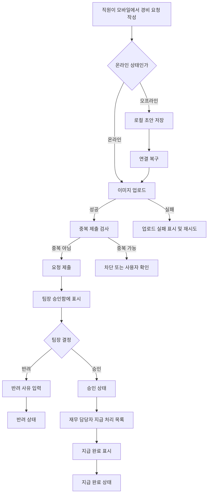

# 모바일 경비 승인 PRD

## Applicability

| Contract | Required / N/A | Evidence |
|---|---:|---|
| Context and problem | Required | 모바일 경비 제출, 승인, 지급 완료 흐름 필요 |
| Goals / non-goals | Required | 1차 출시 범위와 제외 범위가 명시됨 |
| Roles and permissions | Required | 직원, 팀장, 재무 담당자 역할이 다름 |
| Stable functional requirement IDs | Required | 구현·검증 추적 필요 |
| Pages/routes | Required | 모바일 사용자 화면이 있는 기능 |
| State matrix | Required | 제출, 승인, 반려, 지급 완료, 오류 상태 존재 |
| Lifecycle flow | Required | 제출부터 지급 완료까지 다단계 상태 전이 |
| Authorization/data boundaries | Required | 팀장은 자기 팀 요청만 처리 가능 |
| Numeric NFR | N/A | 성능 수치는 측정 후 결정한다고 명시됨 |
| Acceptance criteria | Required | 구현 가능성 검증 필요 |
| Risks/open decisions | Required | 중복 제출, 동시 수정, 권한 변경 등 엣지 케이스 존재 |
| Delivery mapping | Required | 1차 출시 범위 통제 필요 |

## Context and Problem

직원은 모바일에서 영수증 사진, 금액, 카테고리를 입력해 경비 요청을 제출해야 한다. 팀장은 본인 팀의 요청만 검토해 승인 또는 반려하고, 재무 담당자는 승인된 요청을 지급 완료 처리해야 한다.

현재 요구에는 오프라인 초안 작성, 이미지 업로드 실패, 중복 제출, 권한 변경, 승인 중 동시 수정까지 포함되므로 단순 폼 제출이 아니라 요청 상태, 권한, 동기화, 충돌 처리가 명확해야 한다.

## Goals

1. 직원이 모바일에서 영수증 기반 경비 요청을 생성, 저장, 제출할 수 있다.
2. 오프라인 상태에서도 초안을 작성하고, 연결 복구 시 동기화할 수 있다.
3. 팀장이 자기 팀의 요청만 승인 또는 반려할 수 있다.
4. 반려 시 팀장이 반려 사유를 필수 입력한다.
5. 재무 담당자가 승인된 요청을 지급 완료로 표시할 수 있다.
6. 중복 제출, 이미지 업로드 실패, 권한 변경, 동시 수정 충돌을 사용자에게 명확히 처리한다.
7. 1차 출시 접근성 목표는 WCAG 2.2 AA로 한다.

## Non-goals

1. 1차 출시에서 다중 통화는 지원하지 않는다.
2. 1차 출시에서 ERP 자동 연동은 지원하지 않는다.
3. 성능 수치 목표는 1차 출시 전에 측정 후 별도 결정한다.
4. 경비 정책 자동 판정, 예산 잔액 확인, 세금 자동 계산은 1차 범위에 포함하지 않는다.
5. 영수증 OCR 자동 입력은 1차 필수 범위에 포함하지 않는다.

## Users, Roles, and Permissions

| Role | Description | Permissions |
|---|---|---|
| 직원 | 경비를 신청하는 사용자 | 본인 요청 생성, 초안 저장, 제출, 본인 요청 조회 |
| 팀장 | 팀 경비를 검토하는 사용자 | 본인 소속 팀 직원의 제출 요청 조회, 승인, 반려, 반려 사유 입력 |
| 재무 담당자 | 지급 상태를 관리하는 사용자 | 승인된 요청 조회, 지급 완료 표시 |
| 관리자 또는 권한 시스템 | 사용자 역할과 팀 소속을 관리하는 외부/내부 시스템 | 사용자 역할, 팀 소속 변경 |

권한은 서버에서 매 요청마다 검증해야 한다. 클라이언트에서 버튼을 숨기는 것은 권한 검증으로 간주하지 않는다.

## Functional Requirements

| ID | Requirement | Priority |
|---|---|---|
| FR-001 | 직원은 모바일에서 영수증 사진, 금액, 카테고리를 입력해 경비 요청 초안을 생성할 수 있다. | P0 |
| FR-002 | 직원은 필수값이 모두 유효할 때 경비 요청을 제출할 수 있다. | P0 |
| FR-003 | 금액은 1차 출시 기준 단일 통화로 입력되며, 0보다 큰 숫자여야 한다. | P0 |
| FR-004 | 카테고리는 사전에 정의된 단일 카테고리 목록에서 선택한다. | P0 |
| FR-005 | 영수증 이미지는 제출 전 또는 제출 과정에서 업로드되어 요청에 연결되어야 한다. | P0 |
| FR-006 | 이미지 업로드 실패 시 요청은 제출 완료로 처리되지 않으며, 사용자는 재시도하거나 초안으로 보존할 수 있다. | P0 |
| FR-007 | 직원은 오프라인 상태에서 초안을 작성하고 로컬에 저장할 수 있다. | P0 |
| FR-008 | 오프라인 초안은 연결 복구 시 서버와 동기화되어 서버 초안 또는 제출 요청으로 생성된다. | P0 |
| FR-009 | 동기화 실패 시 사용자는 실패 사유와 재시도 액션을 볼 수 있어야 한다. | P0 |
| FR-010 | 시스템은 동일 사용자의 동일 영수증/금액/카테고리 기반 중복 제출 가능성을 감지하고 차단 또는 확인 절차를 제공해야 한다. | P0 |
| FR-011 | 직원은 본인이 제출한 요청의 현재 상태를 조회할 수 있다. | P0 |
| FR-012 | 팀장은 본인 팀 직원이 제출한 요청만 조회할 수 있다. | P0 |
| FR-013 | 팀장은 검토 대상 요청을 승인할 수 있다. | P0 |
| FR-014 | 팀장은 검토 대상 요청을 반려할 수 있으며 반려 사유는 필수다. | P0 |
| FR-015 | 팀장이 승인 또는 반려를 시도하는 순간 서버는 최신 팀 소속과 역할 권한을 재검증해야 한다. | P0 |
| FR-016 | 재무 담당자는 승인 상태의 요청만 지급 완료로 표시할 수 있다. | P0 |
| FR-017 | 지급 완료 요청은 직원, 팀장, 재무 담당자에게 지급 완료 상태로 표시된다. | P0 |
| FR-018 | 승인, 반려, 지급 완료 같은 상태 변경은 원자적으로 처리되어야 하며 변경 이력이 남아야 한다. | P0 |
| FR-019 | 승인 중 다른 사용자가 요청을 수정하거나 상태를 변경한 경우, 시스템은 충돌을 감지하고 최신 상태를 다시 표시해야 한다. | P0 |
| FR-020 | 이미 승인, 반려, 지급 완료된 요청에 대해 유효하지 않은 상태 변경은 거부되어야 한다. | P0 |
| FR-021 | 권한 변경으로 더 이상 접근할 수 없는 요청은 즉시 접근 불가로 처리되어야 한다. | P0 |
| FR-022 | 모든 주요 액션은 성공, 실패, 대기, 충돌 상태를 사용자에게 명확히 표시해야 한다. | P1 |
| FR-023 | 모바일 UI는 WCAG 2.2 AA 목표를 충족하도록 구현한다. | P0 |
| FR-024 | 성능 지표는 출시 전 측정 항목과 기준값을 확정할 수 있도록 계측 지점을 포함한다. | P1 |

## Pages and Routes

| Page | Primary users | Purpose |
|---|---|---|
| 경비 요청 목록 | 직원 | 본인 초안, 제출, 승인, 반려, 지급 완료 상태 조회 |
| 경비 요청 작성/수정 | 직원 | 영수증 사진, 금액, 카테고리 입력 및 제출 |
| 동기화 대기/실패 표시 | 직원 | 오프라인 초안 및 동기화 실패 항목 확인 |
| 팀 승인함 | 팀장 | 자기 팀의 제출 요청 목록 조회 |
| 승인 상세 | 팀장 | 요청 상세 확인, 승인, 반려 |
| 지급 처리 목록 | 재무 담당자 | 승인된 요청 목록 조회 |
| 지급 처리 상세 | 재무 담당자 | 승인 요청을 지급 완료 처리 |

## State Matrix

| Surface | Empty | Loading | Error | Success | Recovery |
|---|---|---|---|---|---|
| 직원 요청 목록 | 요청 없음 | 목록 불러오는 중 | 목록 로드 실패 | 요청 목록 표시 | 재시도 |
| 요청 작성 | 입력값 없음 | 이미지 업로드/제출 중 | 유효성 오류, 업로드 실패 | 초안 저장 또는 제출 완료 | 수정, 재업로드, 재시도 |
| 오프라인 초안 | 동기화 대기 없음 | 동기화 중 | 동기화 실패 | 동기화 완료 | 재시도, 초안 수정 |
| 팀 승인함 | 검토 요청 없음 | 요청 불러오는 중 | 권한 없음 또는 로드 실패 | 검토 요청 표시 | 재시도, 권한 안내 |
| 승인 상세 | 해당 없음 | 상태 변경 중 | 충돌, 권한 변경, 상태 변경 실패 | 승인 또는 반려 완료 | 최신 상태 새로고침 |
| 지급 처리 | 지급 대상 없음 | 지급 처리 중 | 권한 없음 또는 상태 변경 실패 | 지급 완료 | 최신 상태 새로고침 |

## User or System Flow

## Authorization and Data Boundaries

1. 직원은 본인이 생성한 요청만 조회할 수 있다.
2. 직원은 제출 전 초안만 수정할 수 있다.
3. 팀장은 현재 권한 기준으로 자기 팀 직원의 제출 요청만 조회하고 승인/반려할 수 있다.
4. 팀장의 팀 소속 또는 역할이 변경된 경우, 기존에 열어둔 화면의 액션도 서버에서 거부되어야 한다.
5. 재무 담당자는 승인된 요청만 지급 완료로 변경할 수 있다.
6. 지급 완료, 반려, 승인 상태의 요청은 허용된 후속 상태로만 전이된다.
7. 모든 상태 변경 API는 요청 ID, 현재 상태 버전, 사용자 권한을 함께 검증해야 한다.
8. 요청 데이터와 영수증 이미지는 권한 있는 사용자에게만 제공되어야 한다.
9. 감사 로그에는 요청 ID, 액션, 이전 상태, 이후 상태, 수행자, 수행 시각, 실패 사유가 기록되어야 한다.

## Non-functional Requirements

1. 접근성: 모바일 UI는 WCAG 2.2 AA를 목표로 한다.
2. 접근성 구현 기준: 키보드 접근 가능성, 명확한 포커스 표시, 적절한 대체 텍스트, 충분한 색 대비, 오류 메시지와 필드 연결을 포함한다.
3. 성능: 구체적인 수치 목표는 측정 후 결정한다.
4. 성능 계측: 목록 로드 시간, 이미지 업로드 시간, 제출 API 응답 시간, 동기화 성공/실패율, 충돌 발생률을 측정 가능해야 한다.
5. 신뢰성: 오프라인 초안은 앱 재시작 후에도 유지되어야 한다.
6. 보안: 서버 권한 검증 없이 클라이언트 상태만으로 승인, 반려, 지급 완료가 처리되어서는 안 된다.
7. 개인정보/민감정보: 영수증 이미지에는 민감 정보가 포함될 수 있으므로 접근 제어와 전송 보안이 필요하다.

## Acceptance Criteria

| ID | Requirement | Given | When | Then | Verification |
|---|---|---|---|---|---|
| AC-001 | FR-001, FR-002 | 직원이 필수값을 입력했다 | 제출을 누른다 | 요청이 제출 상태로 생성된다 | 모바일 E2E 테스트 |
| AC-002 | FR-003 | 직원이 금액 0 또는 음수를 입력했다 | 저장 또는 제출을 시도한다 | 금액 오류가 표시되고 제출되지 않는다 | 유닛/E2E 테스트 |
| AC-003 | FR-005, FR-006 | 이미지 업로드가 실패했다 | 제출을 시도한다 | 요청은 제출 완료되지 않고 재시도 옵션이 표시된다 | API 실패 시뮬레이션 |
| AC-004 | FR-007, FR-008 | 직원이 오프라인이다 | 초안을 작성한다 | 로컬 초안으로 저장되고 온라인 복구 시 동기화된다 | 오프라인 E2E 테스트 |
| AC-005 | FR-009 | 동기화 API가 실패한다 | 연결 복구 후 동기화가 실행된다 | 실패 상태와 재시도 액션이 표시된다 | API 실패 시뮬레이션 |
| AC-006 | FR-010 | 동일 사용자가 동일 조건의 요청을 다시 제출한다 | 제출을 시도한다 | 중복 가능성이 감지되어 차단 또는 확인 절차가 표시된다 | 서버/API 테스트 |
| AC-007 | FR-012 | 팀장이 다른 팀 직원 요청에 접근한다 | 목록 또는 상세를 조회한다 | 서버가 접근을 거부한다 | 권한 테스트 |
| AC-008 | FR-013 | 팀장이 자기 팀 제출 요청을 보고 있다 | 승인을 누른다 | 요청 상태가 승인으로 변경된다 | API/E2E 테스트 |
| AC-009 | FR-014 | 팀장이 반려 사유 없이 반려를 시도한다 | 반려를 누른다 | 반려 사유 필수 오류가 표시된다 | E2E 테스트 |
| AC-010 | FR-015, FR-021 | 팀장의 권한이 화면 진입 후 제거됐다 | 승인 또는 반려를 시도한다 | 서버가 액션을 거부하고 최신 권한 상태를 표시한다 | 권한 변경 테스트 |
| AC-011 | FR-016 | 재무 담당자가 승인된 요청을 보고 있다 | 지급 완료를 누른다 | 요청 상태가 지급 완료로 변경된다 | API/E2E 테스트 |
| AC-012 | FR-016, FR-020 | 재무 담당자가 반려된 요청을 지급 완료 처리한다 | 지급 완료를 시도한다 | 서버가 상태 변경을 거부한다 | 상태 전이 테스트 |
| AC-013 | FR-019 | 팀장이 상세를 열어둔 사이 요청 상태가 변경됐다 | 승인 또는 반려를 시도한다 | 충돌이 감지되고 최신 상태 새로고침이 요구된다 | 동시성 테스트 |
| AC-014 | FR-018 | 상태 변경이 성공했다 | 감사 로그를 조회한다 | 이전 상태, 이후 상태, 수행자, 시각이 기록되어 있다 | DB/API 테스트 |
| AC-015 | FR-023 | 사용자가 스크린 리더 또는 키보드 보조 입력을 사용한다 | 주요 흐름을 수행한다 | 입력, 오류, 버튼, 상태 변경을 인지하고 조작할 수 있다 | 접근성 점검 |
| AC-016 | FR-024 | 운영 또는 테스트 환경에서 기능을 사용한다 | 요청 목록, 업로드, 제출, 동기화가 실행된다 | 성능 측정에 필요한 이벤트가 기록된다 | 계측 확인 |

## Assumptions

1. 1차 출시 단일 통화는 회사 기본 통화 1개로 고정한다.
2. 직원은 제출 후 요청을 수정할 수 없고, 수정이 필요하면 반려 후 재제출하는 방식으로 처리한다.
3. 오프라인에서는 “초안 작성”만 지원하고, 승인/반려/지급 완료 같은 상태 변경은 온라인에서만 허용한다.
4. 중복 제출 판단은 최소한 동일 사용자, 영수증 이미지 식별값, 금액, 카테고리, 근접 제출 시간을 기준으로 한다.
5. 팀 소속은 요청 제출자의 현재 조직 정보 또는 제출 시점 조직 정보 중 하나를 기준으로 해야 하며, 본 PRD에서는 “처리 시점의 최신 권한” 검증을 기본으로 둔다.
6. 영수증 이미지는 모바일 카메라 촬영 또는 사진 보관함 선택을 지원한다.

## Open Decisions

1. 단일 통화의 정확한 통화는 무엇인가?
2. 경비 카테고리 목록과 관리 주체는 누구인가?
3. 중복 제출은 자동 차단할 것인가, 경고 후 사용자 확인을 허용할 것인가?
4. 팀장 승인 기준의 팀 소속은 제출 시점 기준인가, 승인 시점 기준인가?
5. 반려된 요청은 기존 요청을 수정 재제출하는가, 새 요청으로 제출하는가?
6. 영수증 이미지 최대 용량, 허용 포맷, 압축 정책은 무엇인가?
7. 성능 측정 후 확정할 주요 지표와 목표값은 누가 승인하는가?
8. 감사 로그 조회 권한과 보관 기간은 어떻게 정할 것인가?

## Risks and Mitigations

| Risk | Impact | Mitigation |
|---|---|---|
| 오프라인 초안과 서버 상태 불일치 | 중복 요청 또는 데이터 손실 | 로컬 초안 ID, 서버 동기화 ID, 상태별 재시도 정책 사용 |
| 이미지 업로드 실패 | 제출 누락 또는 사용자 혼란 | 제출 완료 전 업로드 성공 필수화, 실패 상태와 재시도 제공 |
| 중복 제출 오탐/미탐 | 과지급 또는 정상 제출 차단 | 중복 기준을 로그로 검증하고 1차 출시 후 기준 조정 |
| 팀 권한 변경 타이밍 | 부적절한 승인 가능성 | 모든 상세 조회와 상태 변경 시 서버 권한 재검증 |
| 동시 승인/반려 | 잘못된 최종 상태 | 상태 버전 기반 조건부 업데이트 사용 |
| 접근성 미달 | 일부 사용자 이용 불가 | WCAG 2.2 AA 체크리스트와 수동 보조기술 테스트 포함 |
| 성능 목표 부재 | 출시 기준 모호 | 1차 개발 중 계측 먼저 적용하고 측정 후 목표 확정 |

## Delivery

| Phase | Requirement IDs | Verifiable exit condition |
|---|---|---|
| Phase 1: 제출 및 초안 | FR-001~FR-011 | 직원이 온라인/오프라인에서 요청을 작성, 제출, 동기화할 수 있고 실패 상태가 처리된다 |
| Phase 2: 승인/반려 | FR-012~FR-015, FR-018~FR-021 | 팀장이 자기 팀 요청만 승인/반려할 수 있고 권한 변경과 충돌이 서버에서 거부된다 |
| Phase 3: 지급 완료 | FR-016~FR-018, FR-020 | 재무 담당자가 승인 요청만 지급 완료 처리할 수 있다 |
| Phase 4: 접근성/계측/출시 검증 | FR-022~FR-024 | WCAG 2.2 AA 목표 항목과 성능 계측 이벤트가 검증된다 |

검증 참고: 요청에 따라 파일을 만들지 않았으므로 PRD validator는 실행하지 않았다.