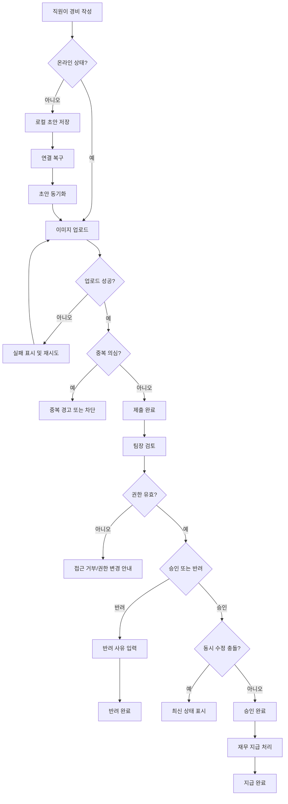

# 모바일 경비 승인 PRD

## Applicability

| Contract | Required / N/A | Evidence |
|---|---:|---|
| Context/problem | Required | 모바일 경비 제출, 승인, 지급 완료 워크플로우가 필요함 |
| Goals/non-goals | Required | 1차 출시 범위와 제외 범위가 명시됨 |
| Roles/permissions | Required | 직원, 팀장, 재무 담당자 권한이 다름 |
| Functional requirements | Required | 제출, 승인/반려, 지급 완료, 오프라인 초안, 예외 상태 필요 |
| Pages/routes | Required | 모바일 사용자 화면이 있는 기능 |
| State matrix | Required | 업로드 실패, 동기화, 동시 수정 등 사용자 상태가 중요함 |
| Flow diagram | Required | 제출부터 지급 완료까지 다단계 생명주기 |
| Authorization/data boundaries | Required | 팀장은 자기 팀 요청만 처리 가능 |
| Numeric NFR | N/A | 성능 수치는 측정 후 결정한다고 명시됨 |
| Acceptance criteria | Required | 구현 검증 가능한 조건 필요 |

## Context And Problem

직원은 모바일에서 경비 영수증을 제출하고, 팀장은 자기 팀의 요청을 승인 또는 반려하며, 재무 담당자는 승인된 요청을 지급 완료 처리해야 한다. 모바일 환경 특성상 네트워크 단절, 이미지 업로드 실패, 중복 제출, 권한 변경, 승인 중 동시 수정 같은 상태를 명시적으로 다뤄야 한다.

## Goals

- 직원이 모바일에서 영수증 사진, 금액, 카테고리를 포함한 경비 요청을 제출할 수 있다.
- 팀장이 자기 팀 직원의 요청만 검토하고 승인 또는 반려할 수 있다.
- 반려 시 팀장이 반려 사유를 입력해야 한다.
- 재무 담당자가 승인된 요청을 지급 완료로 표시할 수 있다.
- 오프라인에서 작성한 초안이 연결 복구 후 동기화된다.
- 중복 제출, 이미지 업로드 실패, 권한 변경, 동시 수정 충돌을 사용자에게 명확히 처리한다.
- 접근성 목표는 WCAG 2.2 AA로 한다.

## Non-Goals

- 1차 출시에서는 다중 통화를 지원하지 않는다.
- 1차 출시에서는 ERP 자동 연동을 지원하지 않는다.
- 성능 목표 수치는 1차 PRD에서 확정하지 않는다. 측정 기준과 결정 시점만 정의한다.
- 세금 계산, 회계 계정 자동 추천, 법인카드 자동 매칭은 포함하지 않는다.
- 대량 승인, 위임 승인, 다단계 승인 라우팅은 포함하지 않는다.

## Users, Roles, And Permissions

| Role | Description | Permissions |
|---|---|---|
| 직원 | 경비를 제출하는 사용자 | 본인 요청 생성, 본인 초안 수정, 본인 요청 상태 조회 |
| 팀장 | 팀원의 경비 요청을 검토하는 사용자 | 자기 팀 요청 조회, 승인, 반려, 반려 사유 입력 |
| 재무 담당자 | 승인된 요청을 지급 처리하는 사용자 | 승인된 요청 조회, 지급 완료 표시 |
| 관리자/시스템 | 권한과 팀 소속을 관리하는 외부 주체로 가정 | 권한 변경 이벤트를 시스템에 반영 |

권한 판단은 서버 기준이어야 하며, 모바일 UI에서 버튼을 숨기는 것은 권한 검증을 대체하지 않는다.

## Functional Requirements

| ID | Requirement | Priority |
|---|---|---:|
| FR-001 | 직원은 모바일에서 영수증 사진, 금액, 카테고리를 입력해 경비 요청을 생성할 수 있다. | P0 |
| FR-002 | 금액은 단일 통화 기준의 양수로 입력되어야 하며, 통화 선택은 제공하지 않는다. | P0 |
| FR-003 | 영수증 이미지는 제출 요청과 연결되어야 하며, 업로드 성공 전까지 제출 완료로 간주하지 않는다. | P0 |
| FR-004 | 직원은 오프라인 상태에서도 경비 초안을 작성하고 로컬에 저장할 수 있다. | P0 |
| FR-005 | 오프라인 초안은 네트워크 연결이 복구되면 서버와 동기화되어 제출 가능한 상태가 된다. | P0 |
| FR-006 | 동기화 실패 시 초안은 유실되지 않아야 하며 사용자가 재시도할 수 있어야 한다. | P0 |
| FR-007 | 시스템은 동일 사용자, 동일 이미지 또는 동일 금액/카테고리/제출 시점 조합 등으로 의심되는 중복 제출을 감지하고 사용자 확인 또는 차단 상태를 제공해야 한다. | P0 |
| FR-008 | 팀장은 자기 팀 직원의 요청만 조회하고 승인 또는 반려할 수 있다. | P0 |
| FR-009 | 팀장이 요청을 반려할 때는 반려 사유 입력이 필수다. | P0 |
| FR-010 | 승인 또는 반려 시점에 요청이 이미 수정 또는 처리된 경우 동시 수정 충돌로 처리하고 최신 상태를 다시 보여준다. | P0 |
| FR-011 | 재무 담당자는 팀장 승인 상태의 요청만 지급 완료로 표시할 수 있다. | P0 |
| FR-012 | 지급 완료된 요청은 직원, 팀장, 재무 담당자에게 상태로 표시된다. | P1 |
| FR-013 | 권한 또는 팀 소속이 변경된 사용자는 다음 권한 검증 시점부터 변경된 권한이 적용되어야 한다. | P0 |
| FR-014 | 사용자가 더 이상 권한이 없는 요청에 접근하거나 처리하려 하면 접근 거부 또는 최신 권한 반영 메시지를 제공해야 한다. | P0 |
| FR-015 | 모든 주요 상태 변경은 요청 상태, 처리자, 처리 시각, 반려 사유를 포함해 추적 가능해야 한다. | P1 |
| FR-016 | 이미지 업로드 실패 시 사용자는 실패 원인을 알 수 있고 동일 초안에서 재업로드할 수 있어야 한다. | P0 |

## Pages And Routes

| Screen | Purpose | Primary Actions |
|---|---|---|
| 경비 목록 | 본인 제출 내역 또는 역할별 처리 대상 확인 | 필터, 상세 진입 |
| 경비 작성/초안 | 영수증 사진, 금액, 카테고리 입력 | 저장, 제출, 업로드 재시도 |
| 경비 상세 | 요청 정보와 상태 이력 확인 | 상태 확인, 권한별 처리 |
| 팀장 승인함 | 자기 팀 요청 검토 | 승인, 반려 |
| 반려 사유 입력 | 반려 사유 작성 | 반려 확정, 취소 |
| 재무 지급함 | 승인된 요청 확인 | 지급 완료 처리 |
| 동기화 상태 | 오프라인 초안 및 실패 상태 확인 | 재시도, 초안 열기 |

## State Matrix

| Surface | Empty | Loading | Error | Success | Recovery |
|---|---|---|---|---|---|
| 경비 목록 | 요청 없음 | 목록 로딩 | 목록 조회 실패 | 요청 목록 표시 | 다시 시도 |
| 작성/초안 | 입력 전 상태 | 이미지 처리/업로드 중 | 업로드 실패, 필수값 누락 | 초안 저장 또는 제출 완료 | 재업로드, 필수값 보완 |
| 오프라인 초안 | 초안 없음 | 연결 복구 후 동기화 중 | 동기화 실패 | 서버 제출 또는 동기화 완료 | 재시도, 초안 유지 |
| 팀장 승인함 | 처리할 요청 없음 | 요청 로딩 | 권한 없음, 충돌, 처리 실패 | 승인/반려 완료 | 최신 상태 새로고침 |
| 재무 지급함 | 지급 대상 없음 | 요청 로딩 | 권한 없음, 이미 처리됨 | 지급 완료 | 최신 상태 새로고침 |
| 경비 상세 | 해당 요청 없음 | 상세 로딩 | 접근 거부, 삭제/권한 변경 | 상세와 이력 표시 | 목록으로 이동 또는 새로고침 |

## User Or System Flow

## Authorization And Data Boundaries

- 직원은 본인 요청과 본인 로컬 초안만 볼 수 있다.
- 팀장은 현재 서버 기준으로 자기 팀에 속한 직원의 요청만 볼 수 있다.
- 팀장은 자기 팀 요청만 승인 또는 반려할 수 있다.
- 재무 담당자는 승인된 요청만 지급 완료 처리할 수 있다.
- 상태 변경 API는 매 요청마다 서버에서 역할, 팀 소속, 요청 상태를 재검증해야 한다.
- 권한 변경이 발생한 경우 기존 화면에 표시된 데이터가 있더라도 처리 액션은 거부되어야 한다.
- 동시 수정 방지를 위해 승인, 반려, 지급 완료 처리에는 요청의 현재 버전 또는 갱신 시각 검증이 필요하다.
- 이미지 파일 접근은 해당 요청 접근 권한을 가진 사용자에게만 허용되어야 한다.

## Non-Functional Requirements

- 접근성: WCAG 2.2 AA 달성을 목표로 한다.
- 접근성 포함 항목: 키보드/스크린리더 호환, 충분한 색 대비, 명확한 오류 메시지, 이미지 업로드 상태의 비시각적 안내, 터치 타깃 크기.
- 성능: 1차 출시 전 계측 항목을 정의하고 베타 또는 내부 테스트 후 목표 수치를 확정한다.
- 성능 계측 후보: 앱 시작 후 목록 표시 시간, 이미지 업로드 성공률, 동기화 성공률, 제출 완료까지 걸린 시간, 승인 액션 응답 시간.
- 신뢰성: 오프라인 초안은 앱 재시작 후에도 유지되어야 한다.
- 보안: 권한 검증은 서버에서 수행하며 이미지 URL 또는 파일 식별자를 통한 우회 접근을 허용하지 않는다.
- 감사성: 승인, 반려, 지급 완료 상태 변경 이력을 추적할 수 있어야 한다.

## Acceptance Criteria

| ID | Requirement | Given | When | Then | Verification |
|---|---|---|---|---|---|
| AC-001 | FR-001 | 직원이 로그인되어 있음 | 사진, 금액, 카테고리를 입력하고 제출함 | 경비 요청이 생성된다 | 모바일 제출 테스트 |
| AC-002 | FR-002 | 직원이 금액을 입력함 | 0 이하 또는 비숫자 값을 제출함 | 제출이 차단되고 오류가 표시된다 | 입력 검증 테스트 |
| AC-003 | FR-003, FR-016 | 이미지 업로드가 실패함 | 직원이 제출을 시도함 | 제출 완료가 되지 않고 재업로드 액션이 제공된다 | 업로드 실패 시뮬레이션 |
| AC-004 | FR-004 | 기기가 오프라인임 | 직원이 경비를 작성함 | 초안이 로컬에 저장된다 | 오프라인 테스트 |
| AC-005 | FR-005, FR-006 | 오프라인 초안이 있음 | 연결이 복구됨 | 동기화가 시도되고 실패 시 초안이 유지된다 | 네트워크 전환 테스트 |
| AC-006 | FR-007 | 중복 의심 조건이 충족됨 | 직원이 제출함 | 중복 경고 또는 차단 상태가 표시된다 | 중복 제출 테스트 |
| AC-007 | FR-008 | 팀장이 다른 팀 직원 요청에 접근함 | 목록 또는 상세 조회를 시도함 | 요청이 표시되지 않거나 접근 거부된다 | 권한 테스트 |
| AC-008 | FR-009 | 팀장이 반려를 선택함 | 사유 없이 확정함 | 반려가 차단된다 | 폼 검증 테스트 |
| AC-009 | FR-010 | 요청이 다른 사용자에 의해 이미 처리됨 | 팀장이 승인 또는 반려함 | 충돌 메시지와 최신 상태가 표시된다 | 동시성 테스트 |
| AC-010 | FR-011 | 재무 담당자가 승인된 요청을 봄 | 지급 완료를 선택함 | 요청 상태가 지급 완료로 변경된다 | 역할별 상태 전이 테스트 |
| AC-011 | FR-013, FR-014 | 사용자의 팀장 권한이 제거됨 | 기존 화면에서 승인 버튼을 누름 | 서버가 처리를 거부하고 권한 변경 안내가 표시된다 | 권한 변경 테스트 |
| AC-012 | FR-015 | 요청 상태가 변경됨 | 상세 이력을 확인함 | 처리자, 처리 시각, 상태, 반려 사유가 확인된다 | 감사 이력 테스트 |

## Assumptions And Open Decisions

### 합리적 가정

- 모바일 앱 또는 모바일 웹에서 동작하는 기능으로 본다.
- 1차 출시 통화는 조직의 기본 통화 1개로 고정한다.
- 카테고리는 사전에 정의된 목록에서 선택한다.
- 직원은 제출 후 승인 전까지 수정할 수 없거나, 수정 시 기존 요청을 취소하고 재제출하는 방식으로 처리한다.
- 로컬 초안에는 영수증 이미지와 입력값이 저장되며, 민감 데이터 보호를 위해 플랫폼 기본 보안 저장소 또는 앱 샌드박스를 사용한다.
- 중복 제출 감지는 완전 자동 판정보다는 “의심 탐지 및 사용자/서버 정책 처리”로 시작한다.

### 열린 결정

- 단일 통화의 기준 통화는 무엇인가?
- 직원이 제출 후 승인 전 요청을 수정하거나 취소할 수 있는가?
- 중복 제출은 경고 후 계속 제출 허용인가, 차단인가?
- 이미지 파일 크기, 형식, 압축 정책은 어떻게 정할 것인가?
- 반려 사유의 최소 길이 또는 템플릿을 둘 것인가?
- 재무 담당자의 지급 완료 취소 또는 정정 권한이 필요한가?
- 성능 목표 수치를 확정할 측정 기간과 책임자는 누구인가?

## Risks And Mitigations

| Risk | Impact | Mitigation |
|---|---|---|
| 오프라인 초안 유실 | 사용자가 경비를 다시 작성해야 함 | 앱 재시작 후 유지되는 로컬 저장, 동기화 실패 시 삭제 금지 |
| 이미지 업로드 실패 | 제출 완료 불가 | 업로드 상태 분리, 재시도, 실패 원인 표시 |
| 권한 변경 지연 | 잘못된 승인 가능성 | 모든 처리 API에서 서버 권한 재검증 |
| 동시 수정 충돌 | 상태 불일치 | 버전 기반 상태 전이 검증 |
| 중복 제출 오탐/미탐 | 지급 오류 또는 사용자 불편 | 의심 조건과 사용자 확인 정책을 운영 데이터로 조정 |
| 접근성 미충족 | 일부 사용자의 업무 수행 제한 | WCAG 2.2 AA 체크리스트 기반 설계/QA 포함 |
| 성능 수치 미정 | 출시 기준 불명확 | 계측 항목을 먼저 심고 내부 테스트 후 목표 확정 |

## Delivery

| Phase | Requirement IDs | Verifiable Exit Condition |
|---|---|---|
| Phase 1: 제출/초안 | FR-001~FR-006, FR-016 | 직원이 온라인/오프라인에서 작성, 저장, 업로드, 동기화 재시도를 수행할 수 있음 |
| Phase 2: 승인 워크플로우 | FR-008~FR-010, FR-013~FR-015 | 팀장이 자기 팀 요청만 승인/반려하고 충돌/권한 변경이 처리됨 |
| Phase 3: 지급 처리 | FR-011~FR-012, FR-015 | 재무 담당자가 승인된 요청을 지급 완료 처리하고 이력이 남음 |
| Phase 4: 예외/품질 강화 | FR-007 및 전체 NFR | 중복 제출, 접근성, 성능 계측, 주요 오류 상태가 검증됨 |

검증 참고: 파일을 만들지 말라는 요청에 따라 PRD 저장 및 별도 validator 실행은 하지 않았습니다.