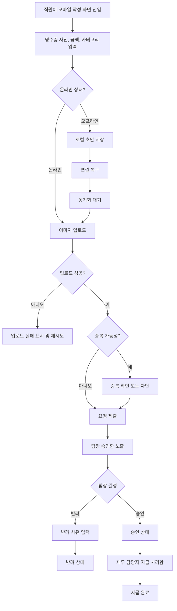

# 모바일 경비 승인 PRD

## Applicability

| Contract | Required / N/A | Evidence |
|---|---:|---|
| 문제, 목표, 비목표 | Required | 브리프에 기능 범위와 제외 범위가 명시됨 |
| 역할과 권한 | Required | 직원, 팀장, 재무 담당자 역할이 명시됨 |
| 안정적인 요구사항 ID | Required | 구현 및 검증 추적 필요 |
| 화면/라우트 | Required | 모바일 사용자 기능 |
| 상태 매트릭스 | Required | 제출, 승인, 지급, 오류, 오프라인 상태가 사용자에게 노출됨 |
| 사용자/시스템 플로우 | Required | 초안 작성부터 지급 완료까지 다단계 라이프사이클 |
| 권한/데이터 경계 | Required | 팀장은 자기 팀 요청만 처리 가능 |
| 수치형 NFR | N/A | 성능 수치는 “측정 후 결정”으로 명시됨 |
| 접근성 NFR | Required | WCAG 2.2 AA 목표 명시 |
| 승인 기준 | Required | 구현 가능 PRD 요청 |
| 저장소 검증 | N/A | 사용자가 파일 생성/저장소 탐색 금지 |

## Context and Problem

직원은 모바일에서 영수증 기반 경비 요청을 제출하고, 팀장은 자기 팀 요청을 승인 또는 반려하며, 재무 담당자는 승인된 요청을 지급 완료 처리해야 한다. 모바일 환경 특성상 오프라인 초안, 이미지 업로드 실패, 중복 제출, 권한 변경, 승인 중 동시 수정 같은 예외 상황을 제품 동작으로 정의해야 한다.

## Goals

1. 직원이 모바일에서 영수증 사진, 금액, 카테고리를 입력해 경비 요청을 제출할 수 있다.
2. 직원이 오프라인 상태에서도 초안을 작성하고, 연결 복구 후 동기화할 수 있다.
3. 팀장이 자기 팀 경비 요청만 검토하고 승인 또는 반려할 수 있다.
4. 반려 시 팀장이 반려 사유를 필수 입력한다.
5. 재무 담당자가 승인된 요청을 지급 완료로 표시할 수 있다.
6. 중복 제출, 이미지 업로드 실패, 권한 변경, 동시 수정 충돌을 명확한 사용자 상태와 복구 방식으로 처리한다.
7. 1차 출시 화면과 주요 흐름은 WCAG 2.2 AA를 목표로 설계한다.

## Non-goals

1. 다중 통화 지원은 1차 출시에서 제외한다.
2. ERP 자동 연동은 1차 출시에서 제외한다.
3. 법인카드 자동 매칭, OCR 자동 추출, 세금계산서 처리, 정산 리포트 자동 생성은 본 PRD 범위가 아니다.
4. 성능 목표 수치 확정은 본 PRD 범위가 아니며, 측정 후 별도 결정한다.

## Users, Roles, and Permissions

| Role | Description | Permissions |
|---|---|---|
| 직원 | 경비를 신청하는 사용자 | 본인 초안 생성/수정/삭제, 본인 요청 제출, 본인 요청 상태 조회 |
| 팀장 | 팀 경비를 검토하는 승인자 | 자기 팀 직원의 제출 요청 조회, 승인, 반려, 반려 사유 입력 |
| 재무 담당자 | 승인된 경비를 지급 처리하는 사용자 | 승인된 요청 조회, 지급 완료 표시 |
| 시스템 | 동기화와 충돌을 처리하는 백엔드/클라이언트 | 오프라인 초안 동기화, 중복 감지, 권한 검증, 상태 전이 검증 |

## Functional Requirements

| ID | Requirement | Priority |
|---|---|---|
| FR-001 | 직원은 모바일에서 경비 요청 초안을 생성할 수 있다. 필수 입력값은 영수증 사진, 금액, 카테고리다. | P0 |
| FR-002 | 금액은 단일 기본 통화로 입력한다. 1차 출시에서는 통화 선택 UI를 제공하지 않는다. | P0 |
| FR-003 | 직원은 제출 전 초안을 수정하거나 삭제할 수 있다. | P0 |
| FR-004 | 직원은 필수 입력값이 모두 유효할 때만 요청을 제출할 수 있다. | P0 |
| FR-005 | 영수증 이미지 업로드 실패 시 요청은 제출 완료로 처리되지 않으며, 사용자는 재시도하거나 초안으로 보존할 수 있다. | P0 |
| FR-006 | 오프라인 상태에서 작성한 초안은 로컬에 저장되고, 연결 복구 후 동기화 대기 상태가 된다. | P0 |
| FR-007 | 동기화 성공 시 서버 요청 ID가 생성되고 제출 또는 초안 상태가 서버와 일치해야 한다. | P0 |
| FR-008 | 동일 사용자가 동일 이미지/금액/카테고리 조합을 짧은 시간 내 반복 제출하는 경우 시스템은 중복 가능성을 감지하고 사용자 확인 또는 차단 상태를 제공한다. | P0 |
| FR-009 | 직원은 본인 요청의 현재 상태를 조회할 수 있다. | P0 |
| FR-010 | 팀장은 자기 팀 직원이 제출한 요청만 목록과 상세에서 조회할 수 있다. | P0 |
| FR-011 | 팀장은 검토 대기 요청을 승인할 수 있다. | P0 |
| FR-012 | 팀장은 검토 대기 요청을 반려할 수 있으며, 반려 사유 입력은 필수다. | P0 |
| FR-013 | 직원은 반려된 요청과 반려 사유를 확인할 수 있다. | P0 |
| FR-014 | 재무 담당자는 승인된 요청만 지급 완료로 표시할 수 있다. | P0 |
| FR-015 | 승인 또는 지급 처리 시 서버는 현재 사용자 권한을 다시 검증한다. UI에 표시된 권한만 신뢰하지 않는다. | P0 |
| FR-016 | 사용자의 팀 또는 역할 권한이 변경된 경우, 이후 요청 조회/승인/지급 작업에는 변경된 권한이 즉시 적용되어야 한다. | P0 |
| FR-017 | 승인 중 직원 수정 또는 다른 승인자의 처리로 상태가 변경된 경우, 시스템은 동시 수정 충돌을 감지하고 최신 상태 재조회 및 재시도를 요구한다. | P0 |
| FR-018 | 상태 전이는 서버에서 검증한다. 허용되지 않은 상태 전이 요청은 실패해야 한다. | P0 |
| FR-019 | 모든 승인, 반려, 지급 완료 이벤트는 처리자, 처리 시각, 이전 상태, 이후 상태를 감사 로그로 남긴다. | P1 |
| FR-020 | 주요 오류는 사용자가 다음 행동을 알 수 있는 메시지로 표시한다. 예: 이미지 재업로드, 동기화 재시도, 권한 없음, 최신 상태 새로고침. | P0 |

## Pages and Routes

| Screen | Primary Users | Main Capabilities |
|---|---|---|
| 경비 요청 목록 | 직원 | 본인 요청 상태 조회, 초안/동기화 대기/제출/승인/반려/지급 완료 필터 |
| 경비 요청 작성 | 직원 | 영수증 사진 첨부, 금액 입력, 카테고리 선택, 초안 저장, 제출 |
| 경비 요청 상세 | 직원, 팀장, 재무 | 입력 정보, 영수증, 상태 이력, 반려 사유, 가능한 액션 표시 |
| 팀 승인함 | 팀장 | 자기 팀 제출 요청 목록, 승인/반려 대상 확인 |
| 반려 사유 입력 | 팀장 | 반려 사유 필수 입력 후 반려 확정 |
| 지급 처리함 | 재무 담당자 | 승인된 요청 목록, 지급 완료 표시 |
| 동기화 상태 화면 또는 배너 | 직원 | 오프라인 초안, 동기화 대기, 실패, 재시도 상태 표시 |

## State Matrix

| Surface | Empty | Loading | Error | Success | Recovery |
|---|---|---|---|---|---|
| 직원 요청 목록 | 요청 없음 | 목록 로딩 | 조회 실패 | 상태별 요청 표시 | 재시도 |
| 작성 화면 | 새 초안 | 이미지 업로드/제출 중 | 필수값 오류, 업로드 실패, 오프라인 | 초안 저장 또는 제출 완료 | 입력 수정, 업로드 재시도, 초안 보존 |
| 동기화 | 동기화 대상 없음 | 동기화 중 | 네트워크 실패, 중복 감지, 서버 검증 실패 | 서버 반영 완료 | 재시도, 중복 확인, 최신 상태 반영 |
| 팀 승인함 | 승인할 요청 없음 | 목록 로딩 | 권한 없음, 조회 실패 | 자기 팀 요청 표시 | 재로그인/권한 갱신, 재시도 |
| 승인/반려 액션 | 해당 없음 | 처리 중 | 권한 변경, 상태 충돌, 사유 누락 | 승인 또는 반려 완료 | 최신 상태 새로고침, 사유 입력 |
| 지급 처리 | 지급 대상 없음 | 처리 중 | 권한 없음, 상태 충돌 | 지급 완료 | 최신 상태 새로고침, 재시도 |

## User or System Flow

## Authorization and Data Boundaries

1. 직원은 본인 요청과 본인 로컬 초안만 볼 수 있다.
2. 팀장은 서버 기준 현재 소속 팀의 직원 요청만 조회, 승인, 반려할 수 있다.
3. 재무 담당자는 승인 상태 요청만 지급 완료 처리할 수 있다.
4. 모든 권한 검사는 서버에서 수행한다.
5. 클라이언트는 권한에 따라 버튼과 메뉴를 숨길 수 있지만, 이는 보조 UX일 뿐 권한 통제 수단이 아니다.
6. 요청 상세, 이미지 원본/URL, 감사 로그는 권한이 있는 사용자에게만 제공한다.
7. 팀 변경 또는 역할 변경이 발생하면 캐시된 목록/상세/액션 권한은 다음 조회 또는 액션 시점에 갱신되어야 한다.
8. 상태 전이 허용 범위:
   - Draft → Submitted
   - Sync Pending → Submitted 또는 Sync Failed
   - Submitted → Approved 또는 Rejected
   - Approved → Paid
   - Rejected, Paid는 1차 출시에서 최종 상태로 본다.

## Non-functional Requirements

1. 접근성: 1차 출시 주요 화면은 WCAG 2.2 AA를 목표로 한다.
2. 접근성 세부 요건:
   - 모든 주요 액션은 스크린 리더에서 의미 있는 이름을 가져야 한다.
   - 승인/반려/지급 완료 같은 상태 변화는 텍스트로도 표현되어야 한다.
   - 색상만으로 상태를 구분하지 않는다.
   - 반려 사유, 금액, 카테고리 오류는 입력 필드와 연결된 오류 메시지로 제공한다.
   - 터치 타깃은 모바일 사용에 적합한 크기로 제공한다.
3. 성능: 초기 출시 전 실제 기기와 네트워크 조건에서 다음 항목을 측정하고 목표 수치를 확정한다.
   - 요청 목록 로딩 시간
   - 이미지 업로드 성공/실패 시간
   - 오프라인 초안 동기화 소요 시간
   - 승인/반려/지급 완료 액션 응답 시간
4. 신뢰성: 네트워크 실패나 앱 종료 후에도 오프라인 초안은 손실되지 않아야 한다.
5. 보안: 영수증 이미지와 경비 데이터는 인증된 요청으로만 접근 가능해야 한다.

## Acceptance Criteria

| ID | Requirement | Given | When | Then | Verification |
|---|---|---|---|---|---|
| AC-001 | FR-001, FR-004 | 직원이 작성 화면에 있다 | 영수증, 금액, 카테고리 중 하나가 비어 있다 | 제출 버튼은 비활성화되거나 제출 시 필드 오류가 표시된다 | 기능 테스트 |
| AC-002 | FR-001, FR-002 | 직원이 모든 필수값을 입력했다 | 요청을 제출한다 | 단일 기본 통화 금액으로 요청이 생성된다 | 기능 테스트 |
| AC-003 | FR-005 | 이미지 업로드가 실패한다 | 직원이 제출을 시도한다 | 요청은 제출 완료가 아니며 재시도와 초안 보존 옵션이 표시된다 | 실패 주입 테스트 |
| AC-004 | FR-006, FR-007 | 직원이 오프라인 상태다 | 초안을 작성한다 | 초안은 로컬 저장되고 연결 복구 후 동기화 대기 상태가 된다 | 오프라인 테스트 |
| AC-005 | FR-007 | 연결이 복구되었다 | 동기화가 성공한다 | 서버 요청 ID가 생성되고 요청 상태가 서버와 일치한다 | 통합 테스트 |
| AC-006 | FR-008 | 동일 사용자가 동일 이미지/금액/카테고리를 반복 제출한다 | 시스템이 제출을 처리한다 | 중복 가능성이 표시되거나 정책에 따라 차단된다 | 기능 테스트 |
| AC-007 | FR-010 | 팀장이 승인함을 연다 | 다른 팀 직원 요청이 존재한다 | 다른 팀 요청은 조회되지 않는다 | 권한 테스트 |
| AC-008 | FR-011 | 팀장이 자기 팀의 제출 요청을 본다 | 승인한다 | 요청 상태가 Approved로 변경되고 감사 로그가 기록된다 | 통합 테스트 |
| AC-009 | FR-012 | 팀장이 반려를 선택한다 | 반려 사유 없이 확정한다 | 반려는 처리되지 않고 사유 입력 오류가 표시된다 | 기능 테스트 |
| AC-010 | FR-012, FR-013 | 팀장이 반려 사유를 입력한다 | 반려를 확정한다 | 요청 상태가 Rejected가 되고 직원이 사유를 볼 수 있다 | 통합 테스트 |
| AC-011 | FR-014 | 재무 담당자가 승인된 요청을 본다 | 지급 완료를 선택한다 | 요청 상태가 Paid로 변경된다 | 통합 테스트 |
| AC-012 | FR-015, FR-016 | 팀장의 팀 권한이 변경되었다 | 이전에 열어둔 요청을 승인하려 한다 | 서버가 현재 권한을 검증하고 권한 없으면 거부한다 | 권한 회귀 테스트 |
| AC-013 | FR-017, FR-018 | 팀장이 요청 상세를 열어둔 사이 요청 상태가 변경되었다 | 승인 또는 반려를 시도한다 | 충돌 오류가 표시되고 최신 상태 재조회가 요구된다 | 동시성 테스트 |
| AC-014 | FR-018 | 클라이언트가 Rejected 요청을 Paid로 변경하려 한다 | 서버에 상태 전이를 요청한다 | 서버는 요청을 거부한다 | API 테스트 |
| AC-015 | FR-020 | 사용자 액션이 실패한다 | 오류가 발생한다 | 사용자는 원인과 가능한 다음 행동을 볼 수 있다 | UX QA |
| AC-016 | 접근성 NFR | 주요 화면이 구현되었다 | 접근성 검사를 수행한다 | WCAG 2.2 AA 목표 기준의 주요 위반이 없어야 한다 | 자동 검사 + 수동 QA |

## Assumptions and Open Decisions

### 합리적 가정

1. “모바일”은 네이티브 앱 또는 모바일 웹 모두 가능하지만, 오프라인 초안 저장이 가능한 클라이언트를 전제로 한다.
2. 기본 통화는 조직의 단일 기준 통화로 고정한다.
3. 팀 소속과 역할 정보는 별도 사용자/조직 시스템에서 제공된다.
4. “자기 팀”은 요청 제출 시점이 아니라 승인 액션 시점의 서버 기준 팀 관계로 판단한다.
5. 반려된 요청은 1차 출시에서 재제출 가능한 새 요청으로 처리하고, 기존 요청 자체 수정 재제출은 제외한다.
6. 중복 감지는 완전한 사기 탐지가 아니라 사용자 실수 방지 목적의 1차 방어로 본다.

### 열린 결정

1. 중복 제출 정책: 경고 후 사용자 확인을 허용할지, 특정 조건에서는 차단할지 결정 필요.
2. 중복 판단 기준: 이미지 해시, 금액, 카테고리, 제출 시간 범위 중 어떤 조합을 사용할지 결정 필요.
3. 기본 통화: 조직별 고정인지, 서비스 전체 고정인지 결정 필요.
4. 카테고리 목록: 고정 목록인지 관리자 설정 목록인지 결정 필요.
5. 반려 후 처리: 직원이 기존 요청을 수정 재제출할 수 있게 할지, 새 요청으로만 제출할지 결정 필요.
6. 감사 로그 조회 범위: 사용자에게 상태 이력 일부를 보여줄지, 내부 운영자 전용으로 둘지 결정 필요.
7. 성능 목표 수치: 실제 측정 후 각 지표별 목표와 최소 허용 기준 결정 필요.
8. 이미지 제한: 허용 파일 형식, 최대 용량, 압축 정책 결정 필요.

## Risks and Mitigations

| Risk | Impact | Mitigation |
|---|---|---|
| 오프라인 초안 손실 | 직원 신뢰 저하, 재작성 비용 | 로컬 저장 성공 상태 표시, 앱 재시작 후 복구 테스트 |
| 이미지 업로드 실패 빈발 | 제출 완료율 저하 | 업로드 재시도, 실패 상태 보존, 용량/형식 검증 |
| 권한 캐시 불일치 | 잘못된 승인 또는 정보 노출 | 모든 액션 서버 권한 재검증 |
| 동시 승인/수정 충돌 | 잘못된 상태 전이 | 서버 상태 버전 또는 updatedAt 기반 충돌 감지 |
| 중복 감지 오탐 | 정상 제출 방해 | 1차에는 명확한 경고와 확인 UX 제공 검토 |
| 접근성 후순위화 | 출시 전 수정 비용 증가 | 주요 컴포넌트 구현 단계에서 접근성 기준 포함 |

## Delivery

| Phase | Requirement IDs | Verifiable Exit Condition |
|---|---|---|
| Phase 1: 직원 제출 | FR-001~FR-005, FR-009, FR-020 | 직원이 필수값 입력, 이미지 업로드, 제출, 실패 복구를 수행할 수 있다 |
| Phase 2: 오프라인 초안/동기화 | FR-006~FR-008 | 오프라인 작성 초안이 연결 복구 후 동기화되고 중복 가능성이 처리된다 |
| Phase 3: 팀장 승인 | FR-010~FR-013, FR-015~FR-018 | 팀장이 자기 팀 요청만 승인/반려하고 권한/충돌 오류가 처리된다 |
| Phase 4: 재무 지급 처리 | FR-014, FR-018, FR-019 | 재무 담당자가 승인 요청을 지급 완료 처리하고 감사 로그가 남는다 |
| Phase 5: 접근성/운영 QA | NFR, FR-020 | 주요 화면 WCAG 2.2 AA 목표 검증, 오류 메시지, 상태 복구 QA 완료 |

검증 참고: 사용자가 파일 생성과 저장소 탐색을 금지했으므로 PRD validator는 실행하지 않았습니다.