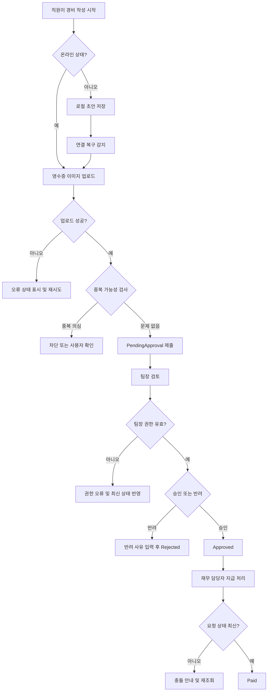

# 모바일 경비 승인 PRD

## Applicability

| Contract | Required / N/A | Evidence |
|---|---:|---|
| 문제, 목표, 비목표 | Required | 모바일 경비 제출, 승인, 지급 완료 범위가 명시됨 |
| 역할 및 권한 | Required | 직원, 팀장, 재무 담당자 역할이 명시됨 |
| 안정적 요구사항 ID | Required | 구현·QA 추적 필요 |
| 페이지/화면 | Required | 모바일 사용자 기능 |
| 상태 매트릭스 | Required | 오프라인, 업로드 실패, 동시 수정 등 사용자 상태가 중요 |
| 플로우 | Required | 제출 → 승인/반려 → 지급 완료 생명주기 |
| 권한/데이터 경계 | Required | 팀장은 자기 팀 요청만 처리 가능 |
| 숫자형 성능 NFR | N/A | 성능 수치는 측정 후 결정한다고 명시됨 |
| 인수 조건 | Required | 구현 가능 PRD 요청 |
| 리스크/열린 결정 | Required | 불확실성 분리 요청 |

## Context and Problem

직원은 모바일에서 영수증 사진, 금액, 카테고리를 입력해 경비 요청을 제출해야 한다. 팀장은 자기 팀 직원의 요청만 검토하고 승인 또는 반려할 수 있어야 하며, 반려 시 사유를 남겨야 한다. 재무 담당자는 팀장 승인 완료 건을 지급 완료 상태로 표시한다.

1차 출시에서는 다중 통화와 ERP 자동 연동은 제외한다. 오프라인 초안 작성, 중복 제출 방지, 이미지 업로드 실패, 권한 변경, 승인 중 동시 수정 충돌을 제품 동작으로 정의해야 한다.

## Goals

- 직원이 모바일에서 경비 요청을 빠르게 작성하고 제출할 수 있다.
- 오프라인 상태에서도 초안을 작성할 수 있고, 연결 복구 후 동기화된다.
- 팀장은 자기 팀 요청만 승인 또는 반려할 수 있다.
- 재무 담당자는 승인된 요청만 지급 완료 처리할 수 있다.
- 중복 제출, 이미지 업로드 실패, 권한 변경, 동시 수정 충돌이 명확한 사용자 경험과 서버 규칙으로 처리된다.
- WCAG 2.2 AA 수준의 접근성 기준을 목표로 한다.

## Non-goals

- 1차 출시에서 다중 통화 지원은 제외한다.
- 1차 출시에서 ERP 자동 연동은 제외한다.
- 복잡한 경비 정책 엔진, 예산 자동 검증, 법인카드 자동 매칭은 제외한다.
- 성능 목표 수치 확정은 제외한다. 단, 측정 항목과 결정 시점은 정의한다.

## Users, Roles, and Permissions

| Role | Description | Permissions |
|---|---|---|
| 직원 | 경비를 신청하는 사용자 | 본인 요청 생성, 본인 초안 수정, 본인 제출 전 요청 수정, 본인 요청 상태 확인 |
| 팀장 | 팀원의 경비를 검토하는 사용자 | 자기 팀 직원의 제출 요청 조회, 승인, 반려, 반려 사유 입력 |
| 재무 담당자 | 승인된 경비를 지급 처리하는 사용자 | 승인된 요청 조회, 지급 완료 표시 |
| 시스템 | 동기화·중복·충돌·권한 검증 수행 | 서버 권한 검증, 상태 전이 검증, 업로드/동기화 처리 |

## Functional Requirements

| ID | Requirement | Priority |
|---|---|---:|
| FR-001 | 직원은 모바일에서 영수증 사진, 금액, 카테고리를 입력해 경비 요청 초안을 생성할 수 있다. | P0 |
| FR-002 | 직원은 필수값인 영수증 사진, 금액, 카테고리가 모두 유효할 때 요청을 제출할 수 있다. | P0 |
| FR-003 | 금액은 1차 출시에서 단일 기준 통화로만 입력·저장·표시한다. | P0 |
| FR-004 | 직원은 본인이 작성한 초안과 제출한 요청의 상태를 확인할 수 있다. | P0 |
| FR-005 | 오프라인 상태에서 작성한 초안은 로컬에 저장되고, 연결 복구 시 서버와 동기화된다. | P0 |
| FR-006 | 오프라인 초안 동기화 중 필수 데이터 또는 이미지 업로드가 실패하면 제출되지 않은 오류 상태로 남고 사용자가 재시도할 수 있다. | P0 |
| FR-007 | 시스템은 동일 사용자의 동일 영수증/금액/카테고리 조합이 짧은 시간 안에 반복 제출되는 경우 중복 가능성으로 차단하거나 확인 절차를 제공한다. | P0 |
| FR-008 | 이미지 업로드 실패 시 요청은 제출 완료로 표시되지 않으며, 실패 원인과 재시도 액션을 제공한다. | P0 |
| FR-009 | 팀장은 자기 팀 직원의 제출된 요청만 목록과 상세에서 조회할 수 있다. | P0 |
| FR-010 | 팀장은 자기 팀의 제출 요청을 승인할 수 있다. | P0 |
| FR-011 | 팀장은 자기 팀의 제출 요청을 반려할 수 있으며, 반려 사유 입력은 필수다. | P0 |
| FR-012 | 재무 담당자는 팀장 승인 상태의 요청만 지급 완료로 표시할 수 있다. | P0 |
| FR-013 | 서버는 모든 조회·상태 변경 요청에서 현재 권한과 팀 소속을 재검증한다. UI 노출 여부에 의존하지 않는다. | P0 |
| FR-014 | 사용자의 역할 또는 팀 소속이 변경된 경우, 이후 API 요청과 동기화 시점에는 변경된 권한이 즉시 적용된다. | P0 |
| FR-015 | 승인, 반려, 지급 완료 처리 중 요청이 다른 사용자 또는 기기에서 변경된 경우 충돌을 감지하고 최신 상태 확인 후 재시도하도록 안내한다. | P0 |
| FR-016 | 요청 상태 전이는 `Draft → PendingApproval → Approved/Rejected → Paid` 규칙을 따른다. `Rejected`와 `Paid`는 최종 상태다. | P0 |
| FR-017 | 직원은 반려된 요청의 반려 사유를 확인할 수 있다. | P1 |
| FR-018 | 접근성은 WCAG 2.2 AA를 목표로 화면, 입력, 오류, 버튼, 이미지 대체 텍스트 영역에 반영한다. | P0 |
| FR-019 | 성능은 출시 전 실제 측정으로 기준을 확정할 수 있도록 주요 화면 로드 시간, 제출 완료 시간, 이미지 업로드 실패율, 동기화 성공률을 계측한다. | P1 |

## Pages and Routes

| Screen | Route Example | Primary Users | Purpose |
|---|---|---|---|
| 경비 요청 목록 | `/expenses` | 직원 | 본인 요청 및 초안 상태 확인 |
| 경비 작성/수정 | `/expenses/new`, `/expenses/:id/edit` | 직원 | 영수증, 금액, 카테고리 입력 |
| 경비 상세 | `/expenses/:id` | 직원, 팀장, 재무 | 요청 상세, 상태, 반려 사유 확인 |
| 팀 승인함 | `/manager/expenses` | 팀장 | 자기 팀 제출 요청 검토 |
| 재무 지급함 | `/finance/expenses` | 재무 담당자 | 승인된 요청 지급 완료 처리 |
| 오프라인/동기화 상태 | 앱 공통 배너 또는 작성 화면 | 직원 | 오프라인 저장, 동기화 진행, 실패 재시도 표시 |

## State Matrix

| Surface | Empty | Loading | Error | Success | Recovery |
|---|---|---|---|---|---|
| 직원 요청 목록 | 요청 없음 안내 | 목록 로딩 표시 | 목록 조회 실패 | 요청 상태별 목록 표시 | 새로고침 |
| 경비 작성 | 빈 입력 폼 | 이미지 업로드/제출 진행 | 필수값 오류, 업로드 실패, 중복 의심 | 초안 저장 또는 제출 완료 | 입력 수정, 업로드 재시도, 중복 확인 |
| 오프라인 초안 | 로컬 초안 없음 | 동기화 중 | 동기화 실패 | 서버 제출 완료 또는 초안 저장 완료 | 재시도, 충돌 상세 확인 |
| 팀 승인함 | 검토할 요청 없음 | 승인함 로딩 | 권한 없음, 조회 실패 | 자기 팀 요청 표시 | 새로고침, 권한 확인 |
| 승인/반려 액션 | N/A | 처리 중 | 권한 변경, 충돌, 필수 반려 사유 누락 | 승인 또는 반려 완료 | 최신 상태 다시 불러오기 |
| 재무 지급함 | 지급 대상 없음 | 목록 로딩 | 권한 없음, 상태 변경 실패 | 지급 완료 처리 | 최신 상태 다시 불러오기 |

## User or System Flow

## Authorization and Data Boundaries

- 모든 권한 검사는 서버에서 수행한다.
- 직원은 본인 요청과 본인 로컬 초안만 접근할 수 있다.
- 팀장은 요청 시점의 최신 조직 정보를 기준으로 자기 팀 직원의 요청만 조회·승인·반려할 수 있다.
- 재무 담당자는 `Approved` 상태 요청만 지급 완료 처리할 수 있다.
- 클라이언트에 보이는 버튼, 탭, 목록 필터는 편의 기능이며 권한의 근거가 아니다.
- 권한 또는 팀 소속 변경 후 기존 화면이 열려 있더라도 상태 변경 API 호출 시 최신 권한으로 재검증한다.
- 오프라인 초안은 사용자 기기 범위에 저장되며, 로그인 사용자 변경 시 다른 사용자의 초안과 섞이면 안 된다.
- 이미지 파일은 요청 레코드와 연결되어야 하며, 이미지 업로드가 완료되지 않은 요청은 제출 완료 상태가 될 수 없다.

## Non-functional Requirements

- 접근성: WCAG 2.2 AA 목표.
- 접근성 세부 기준:
  - 모든 주요 액션은 키보드 및 스크린리더로 접근 가능해야 한다.
  - 입력 오류는 색상만으로 전달하지 않는다.
  - 영수증 이미지 입력에는 상태, 파일명 또는 업로드 결과를 텍스트로 제공한다.
  - 버튼과 상태 배지는 명확한 접근성 이름을 가진다.
- 성능:
  - 1차 출시 전 측정 대상은 목록 초기 로드 시간, 상세 로드 시간, 제출 완료 시간, 이미지 업로드 시간, 오프라인 초안 동기화 성공률이다.
  - 구체적인 성능 목표 수치는 베타 또는 내부 파일럿 측정 후 확정한다.
- 신뢰성:
  - 제출 완료는 서버 저장, 이미지 연결, 중복 검사 통과가 완료된 뒤에만 표시한다.
  - 상태 변경은 멱등성 또는 버전 검사를 통해 중복 요청과 동시 수정을 방지해야 한다.
- 보안:
  - 영수증 이미지는 인증된 사용자만 접근 가능해야 한다.
  - 요청 상세, 이미지, 승인/반려/지급 API는 역할과 소유권을 검증해야 한다.

## Acceptance Criteria

| ID | Requirement | Given | When | Then | Verification |
|---|---|---|---|---|---|
| AC-001 | FR-001, FR-002 | 직원이 모바일 작성 화면에 있음 | 영수증, 금액, 카테고리를 입력함 | 제출 버튼이 활성화되고 제출 가능하다 | 모바일 UI 테스트 |
| AC-002 | FR-002 | 필수값 중 하나가 없음 | 직원이 제출을 시도함 | 제출이 차단되고 누락 항목 오류가 표시된다 | UI/validation 테스트 |
| AC-003 | FR-003 | 사용자가 금액을 입력함 | 요청을 저장 또는 제출함 | 단일 기준 통화로 저장·표시된다 | API/UI 테스트 |
| AC-004 | FR-005 | 직원이 오프라인임 | 경비 초안을 작성함 | 초안이 로컬에 저장되고 오프라인 상태가 표시된다 | 오프라인 E2E 테스트 |
| AC-005 | FR-005, FR-006 | 오프라인 초안이 있음 | 연결이 복구됨 | 시스템이 동기화를 시도한다 | E2E 테스트 |
| AC-006 | FR-006, FR-008 | 이미지 업로드가 실패함 | 제출 또는 동기화가 진행됨 | 요청은 제출 완료가 아니며 재시도 액션이 표시된다 | API fault injection |
| AC-007 | FR-007 | 동일 사용자가 동일한 영수증/금액/카테고리로 반복 제출함 | 두 번째 제출을 시도함 | 중복 가능성 차단 또는 확인 절차가 표시된다 | API/business rule 테스트 |
| AC-008 | FR-009, FR-013 | 팀장 A가 팀 B 직원 요청에 접근함 | 목록 또는 상세 API를 호출함 | 서버가 접근을 거부한다 | Authorization 테스트 |
| AC-009 | FR-010 | 팀장이 자기 팀의 `PendingApproval` 요청을 봄 | 승인함 | 요청 상태가 `Approved`로 변경된다 | API/E2E 테스트 |
| AC-010 | FR-011 | 팀장이 반려 사유 없이 반려를 시도함 | 반려 버튼을 누름 | 반려가 차단되고 사유 입력 오류가 표시된다 | UI/API 테스트 |
| AC-011 | FR-011, FR-017 | 팀장이 사유와 함께 반려함 | 직원이 상세를 봄 | 상태는 `Rejected`이고 반려 사유가 표시된다 | E2E 테스트 |
| AC-012 | FR-012 | 재무 담당자가 `Approved` 요청을 봄 | 지급 완료 처리함 | 요청 상태가 `Paid`로 변경된다 | API/E2E 테스트 |
| AC-013 | FR-012, FR-016 | 재무 담당자가 `PendingApproval` 또는 `Rejected` 요청을 지급 처리함 | API를 호출함 | 서버가 상태 전이를 거부한다 | API 테스트 |
| AC-014 | FR-014 | 팀장의 팀 소속 권한이 변경됨 | 기존 화면에서 승인 API를 호출함 | 최신 권한 기준으로 허용 또는 거부된다 | Authorization 테스트 |
| AC-015 | FR-015 | 팀장이 상세 화면을 연 뒤 다른 사용자가 요청 상태를 변경함 | 팀장이 승인 또는 반려함 | 충돌이 감지되고 최신 상태 재조회가 안내된다 | Concurrency 테스트 |
| AC-016 | FR-018 | 사용자가 스크린리더 또는 키보드로 주요 화면을 사용함 | 요청 작성, 승인, 반려, 지급 액션을 수행함 | 주요 정보와 액션을 인지·조작할 수 있다 | 접근성 점검 |
| AC-017 | FR-019 | 내부 파일럿 또는 베타가 진행됨 | 주요 화면과 제출/동기화가 사용됨 | 정의된 성능 지표가 수집된다 | Telemetry 확인 |

## Assumptions and Open Decisions

### 합리적 가정

- 1차 출시의 단일 기준 통화는 회사 기본 통화 1개다.
- 카테고리 목록은 관리자가 사전에 정의한 고정 목록을 사용한다.
- 직원은 제출 후 `PendingApproval` 상태의 요청을 직접 수정할 수 없고, 수정이 필요하면 반려 후 재제출한다.
- 오프라인 작성은 “초안”까지만 지원하며, 최종 제출은 서버 동기화 성공 후 완료된다.
- 중복 판단은 초기에는 동일 사용자, 동일 금액, 동일 카테고리, 동일 또는 유사 영수증 이미지, 근접 제출 시간을 기준으로 한다.
- 지급 완료는 실제 송금 실행이 아니라 시스템 내 상태 표시다.

### 열린 결정

- 단일 기준 통화를 무엇으로 할지 결정 필요.
- 중복 제출을 “차단”할지, “경고 후 사용자 확인”으로 허용할지 결정 필요.
- 중복 판단 시간 범위와 이미지 유사도 기준 결정 필요.
- 오프라인 초안의 보관 기간과 기기 저장 암호화 정책 결정 필요.
- 반려된 요청을 복사해 재제출할 수 있게 할지 결정 필요.
- 성능 목표 수치를 확정할 측정 기간과 책임자 결정 필요.
- 팀 조직 변경이 과거 요청의 승인권까지 바꾸는지, 요청 제출 시점의 팀장을 유지하는지 정책 결정 필요.

## Risks and Mitigations

| Risk | Impact | Mitigation |
|---|---|---|
| 오프라인 초안과 서버 상태 충돌 | 중복 제출 또는 사용자 혼란 | 서버 버전 검사, 충돌 화면, 재조회 후 재시도 |
| 권한 변경 반영 지연 | 잘못된 승인 또는 정보 노출 | 모든 API에서 최신 권한 재검증 |
| 이미지 업로드 성공 여부 불명확 | 영수증 없는 요청 제출 | 이미지 연결 완료 전 제출 완료 금지 |
| 중복 판단 오탐 | 정상 제출 차단 | 1차 기준은 보수적으로 운영하고 확인 절차 옵션 유지 |
| 성능 목표 미정 | 출시 품질 기준 모호 | 계측 항목 선적용 후 파일럿 데이터로 목표 확정 |
| 접근성 누락 | WCAG 2.2 AA 미달 | 디자인·개발·QA 체크리스트에 접근성 기준 포함 |

## Delivery

| Phase | Requirement IDs | Verifiable Exit Condition |
|---|---|---|
| Phase 1: 직원 제출 MVP | FR-001, FR-002, FR-003, FR-004, FR-008, FR-016 | 직원이 모바일에서 유효한 요청을 제출하고 상태를 확인할 수 있다 |
| Phase 2: 승인/반려/지급 | FR-009, FR-010, FR-011, FR-012, FR-013, FR-017 | 팀장과 재무 담당자의 역할별 상태 변경이 서버 권한 검증과 함께 동작한다 |
| Phase 3: 오프라인 및 예외 처리 | FR-005, FR-006, FR-007, FR-014, FR-015 | 오프라인 동기화, 중복, 권한 변경, 동시 수정 충돌 테스트가 통과한다 |
| Phase 4: 접근성 및 측정 | FR-018, FR-019 | WCAG 2.2 AA 기준 점검 결과와 성능 측정 데이터가 산출된다 |

검증 참고: 이 PRD는 응답 내 작성만 요청되어 파일 저장 및 PRD validator 실행은 하지 않았습니다.