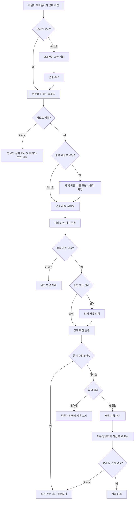

# 모바일 경비 승인 PRD

## Applicability

| Contract | Required / N/A | Evidence |
|---|---:|---|
| 문제, 목표, 비목표 | Required | 모바일 경비 제출·승인·지급 완료 범위가 명시됨 |
| 역할 및 권한 | Required | 직원, 팀장, 재무 담당자 역할이 명시됨 |
| 안정적인 요구사항 ID | Required | 구현·검증 추적 필요 |
| 페이지/화면 | Required | 모바일 사용자 화면이 있는 기능 |
| 상태 매트릭스 | Required | 오프라인, 업로드 실패, 동시 수정 등 사용자 상태가 중요함 |
| 사용자/시스템 플로우 | Required | 제출 → 승인/반려 → 지급 완료 생명주기가 있음 |
| 권한/데이터 경계 | Required | 팀장은 자기 팀 요청만 처리 가능 |
| 수치형 NFR | N/A | 성능 수치는 “측정 후 결정”으로 명시됨 |
| 인수 기준 | Required | 구현 가능 PRD 요청 |
| 리스크/완화 | Required | 중복 제출, 권한 변경, 동시 수정 등 예외 케이스 포함 |

## Context And Problem

직원은 모바일에서 영수증 사진, 금액, 카테고리를 입력해 경비 요청을 제출해야 한다. 팀장은 자기 팀의 요청만 검토해 승인 또는 반려할 수 있어야 하며, 반려 시 사유를 남겨야 한다. 재무 담당자는 팀장 승인 완료된 요청을 지급 완료로 표시해야 한다.

모바일 사용 환경에서는 오프라인 초안 작성, 이미지 업로드 실패, 중복 제출, 권한 변경, 승인 중 동시 수정 같은 상태가 발생할 수 있으므로, 1차 출시 범위 안에서 데이터 무결성과 권한 경계를 명확히 보장해야 한다.

## Goals

- 직원이 모바일에서 영수증 기반 경비 요청을 생성하고 제출할 수 있다.
- 직원이 오프라인에서 초안을 작성하고, 연결 복구 후 동기화할 수 있다.
- 팀장이 자기 팀 소속 직원의 요청만 승인하거나 반려할 수 있다.
- 팀장이 반려 시 필수로 반려 사유를 입력한다.
- 재무 담당자가 승인된 요청만 지급 완료로 표시할 수 있다.
- 중복 제출, 이미지 업로드 실패, 권한 변경, 승인 중 동시 수정 상태를 사용자에게 명확히 처리한다.
- 접근성 목표는 WCAG 2.2 AA로 한다.

## Non-goals

- 1차 출시에서 다중 통화는 지원하지 않는다.
- 1차 출시에서 ERP 자동 연동은 지원하지 않는다.
- 1차 출시에서 성능 목표 수치를 확정하지 않는다.
- 세금 규칙 자동 판정, 회계 계정 자동 추천, OCR 자동 금액 추출은 범위에 포함하지 않는다.
- 복수 단계 승인 워크플로우는 범위에 포함하지 않는다.

## Users, Roles, And Permissions

| Role | Description | Permissions |
|---|---|---|
| 직원 | 경비를 제출하는 사용자 | 본인 경비 요청 생성, 초안 저장, 제출, 본인 요청 상태 조회 |
| 팀장 | 팀 경비를 검토하는 사용자 | 자기 팀 직원의 요청 조회, 승인, 반려, 반려 사유 입력 |
| 재무 담당자 | 승인된 경비 지급 상태를 관리하는 사용자 | 승인된 요청 조회, 지급 완료 표시 |
| 관리자 또는 권한 시스템 | 역할·팀 소속을 관리하는 외부/내부 시스템 | 사용자 역할과 팀 소속 변경 |

권한은 서버에서 검증해야 한다. 클라이언트에서 버튼을 숨기는 것은 권한 통제로 간주하지 않는다.

## Functional Requirements

| ID | Requirement | Priority |
|---|---|---|
| FR-001 | 직원은 모바일에서 영수증 사진, 금액, 카테고리를 입력해 경비 요청 초안을 작성할 수 있다. | P0 |
| FR-002 | 금액과 카테고리는 제출 전 필수 입력값이다. | P0 |
| FR-003 | 영수증 사진은 제출 전 필수 첨부값이다. | P0 |
| FR-004 | 직원은 작성한 요청을 제출할 수 있으며, 제출 후 요청 상태는 `제출됨`이 된다. | P0 |
| FR-005 | 직원은 본인이 생성한 요청과 상태를 조회할 수 있다. | P0 |
| FR-006 | 직원은 오프라인 상태에서 초안을 작성·저장할 수 있다. | P0 |
| FR-007 | 오프라인 초안은 연결 복구 시 동기화 대기열에 들어가며, 동기화 성공 시 서버 초안 또는 제출 요청으로 반영된다. | P0 |
| FR-008 | 오프라인 동기화 실패 시 사용자는 실패 사유와 재시도 액션을 볼 수 있다. | P0 |
| FR-009 | 시스템은 동일 사용자의 동일 영수증 이미지·금액·카테고리 조합이 짧은 시간 안에 반복 제출되는 경우 중복 가능성을 감지하고 차단 또는 확인 절차를 제공한다. | P0 |
| FR-010 | 이미지 업로드 실패 시 요청은 제출 완료로 처리되지 않으며, 사용자는 이미지 재업로드 또는 초안 저장을 선택할 수 있다. | P0 |
| FR-011 | 팀장은 자기 팀 직원의 `제출됨` 요청 목록만 조회할 수 있다. | P0 |
| FR-012 | 팀장은 자기 팀의 `제출됨` 요청을 승인할 수 있으며, 승인 후 상태는 `승인됨`이 된다. | P0 |
| FR-013 | 팀장은 자기 팀의 `제출됨` 요청을 반려할 수 있으며, 반려 사유 입력은 필수다. | P0 |
| FR-014 | 반려된 요청은 `반려됨` 상태와 반려 사유를 직원에게 표시한다. | P0 |
| FR-015 | 재무 담당자는 `승인됨` 요청만 지급 완료로 표시할 수 있다. | P0 |
| FR-016 | 지급 완료 처리 후 요청 상태는 `지급 완료`가 된다. | P0 |
| FR-017 | 요청 상태 변경 시 서버는 현재 상태와 버전을 검증해 동시 수정 충돌을 감지한다. | P0 |
| FR-018 | 동시 수정 충돌 발생 시 사용자는 최신 상태를 다시 불러오고, 이미 처리된 요청에는 중복 처리를 할 수 없다. | P0 |
| FR-019 | 사용자의 역할 또는 팀 소속이 변경되면 이후 요청 조회·승인·반려·지급 권한은 최신 권한 기준으로 검증된다. | P0 |
| FR-020 | 모든 상태 변경에는 처리자, 처리 시각, 이전 상태, 이후 상태가 감사 기록으로 남는다. | P1 |
| FR-021 | 접근성은 WCAG 2.2 AA를 목표로 하며, 주요 제출·승인·반려·지급 완료 흐름은 스크린 리더와 키보드 조작을 지원해야 한다. | P0 |

## Pages And Routes

| Screen | Primary Users | Purpose |
|---|---|---|
| 경비 요청 목록 | 직원 | 본인 요청 상태 확인 |
| 경비 작성/초안 화면 | 직원 | 영수증, 금액, 카테고리 입력 및 제출 |
| 오프라인 초안/동기화 상태 | 직원 | 동기화 대기, 실패, 재시도 관리 |
| 팀 승인 대기 목록 | 팀장 | 자기 팀 제출 요청 검토 |
| 승인 상세 화면 | 팀장 | 요청 상세 확인, 승인 또는 반려 |
| 반려 사유 입력 | 팀장 | 반려 사유 필수 입력 |
| 지급 대기 목록 | 재무 담당자 | 승인된 요청 조회 |
| 지급 처리 상세 화면 | 재무 담당자 | 지급 완료 표시 |

## State Matrix

| Surface | Empty | Loading | Error | Success | Recovery |
|---|---|---|---|---|---|
| 직원 요청 목록 | 요청 없음 표시 | 목록 로딩 | 목록 조회 실패 | 본인 요청 목록 표시 | 다시 시도 |
| 경비 작성 | 빈 입력 폼 | 이미지 업로드 중 | 필수값 누락, 이미지 업로드 실패 | 초안 저장 또는 제출 성공 | 입력 유지 후 재업로드/재제출 |
| 오프라인 초안 | 초안 없음 | 동기화 중 | 동기화 실패, 중복 감지 | 동기화 완료 | 재시도, 초안 수정, 삭제 |
| 팀 승인 목록 | 승인 대기 없음 | 목록 로딩 | 권한 없음, 조회 실패 | 자기 팀 요청 표시 | 새로고침, 권한 재확인 |
| 승인 상세 | 대상 없음 | 최신 상태 확인 중 | 이미 처리됨, 권한 변경, 충돌 | 승인 또는 반려 성공 | 최신 상태 다시 불러오기 |
| 반려 사유 | 입력 전 | 반려 처리 중 | 사유 누락, 처리 실패 | 반려 완료 | 사유 보존 후 재시도 |
| 지급 대기 목록 | 지급 대기 없음 | 목록 로딩 | 조회 실패 | 승인된 요청 표시 | 다시 시도 |
| 지급 처리 | 대상 없음 | 처리 중 | 이미 변경됨, 권한 없음 | 지급 완료 | 최신 상태 다시 불러오기 |

## User Or System Flow

## Authorization And Data Boundaries

- 직원은 본인이 생성한 요청만 조회할 수 있다.
- 직원은 다른 직원의 요청을 조회, 수정, 승인, 반려, 지급 처리할 수 없다.
- 팀장은 현재 서버 기준으로 자기 팀에 속한 직원의 요청만 조회, 승인, 반려할 수 있다.
- 팀장은 자기 팀이 아닌 요청에 접근할 수 없으며, 직접 URL 접근도 서버에서 차단한다.
- 재무 담당자는 승인된 요청만 지급 완료로 변경할 수 있다.
- 재무 담당자는 제출됨 또는 반려됨 상태의 요청을 지급 완료로 변경할 수 없다.
- 역할 또는 팀 소속 변경은 다음 API 요청부터 즉시 반영되는 것으로 간주한다.
- 모든 상태 전이는 서버에서 허용된 이전 상태와 사용자 권한을 함께 검증한다.
- 클라이언트 오프라인 초안은 로컬에 저장되며, 동기화 전에는 서버 공식 요청으로 간주하지 않는다.
- 영수증 이미지는 요청 소유자, 해당 팀장, 재무 담당자만 접근할 수 있어야 한다.

## Non-functional Requirements

- 접근성: WCAG 2.2 AA 목표. 제출, 승인, 반려, 지급 완료 핵심 흐름은 키보드 조작, 스크린 리더 라벨, 명확한 포커스 상태, 오류 메시지 연결을 지원한다.
- 성능: 1차 출시 전 실제 사용 환경에서 목록 조회, 이미지 업로드, 동기화 처리 시간을 측정한다. 목표 수치는 측정 결과와 제품 기준에 따라 별도 결정한다.
- 신뢰성: 이미지 업로드와 요청 제출은 부분 성공 상태를 사용자에게 숨기지 않는다. 이미지 업로드 실패 시 제출 완료 상태로 전환하지 않는다.
- 데이터 무결성: 상태 변경은 버전 또는 동등한 낙관적 잠금 기준으로 충돌을 감지해야 한다.
- 감사성: 승인, 반려, 지급 완료 이벤트는 누가 언제 어떤 상태로 변경했는지 추적 가능해야 한다.
- 보안: 권한 검사는 서버에서 수행한다. 민감 이미지 URL은 권한 없는 사용자에게 노출되지 않아야 한다.

## Acceptance Criteria

| ID | Requirement | Given | When | Then | Verification |
|---|---|---|---|---|---|
| AC-001 | FR-001, FR-002, FR-003 | 직원이 경비 작성 화면에 있다 | 영수증, 금액, 카테고리를 입력한다 | 제출 버튼을 사용할 수 있다 | UI 테스트 |
| AC-002 | FR-002, FR-003 | 필수값이 누락되어 있다 | 직원이 제출을 시도한다 | 누락 항목 오류가 표시되고 제출되지 않는다 | UI/API 테스트 |
| AC-003 | FR-004 | 필수값과 이미지 업로드가 완료되어 있다 | 직원이 제출한다 | 요청 상태가 `제출됨`으로 저장된다 | API 테스트 |
| AC-004 | FR-006, FR-007 | 기기가 오프라인이다 | 직원이 경비 초안을 작성한다 | 초안이 로컬에 저장되고 연결 복구 후 동기화된다 | 모바일 통합 테스트 |
| AC-005 | FR-008 | 오프라인 초안 동기화가 실패한다 | 직원이 동기화 상태를 본다 | 실패 사유와 재시도 액션이 표시된다 | UI 테스트 |
| AC-006 | FR-009 | 동일 사용자가 동일 영수증·금액·카테고리를 반복 제출한다 | 두 번째 제출을 시도한다 | 중복 가능성이 감지되어 차단 또는 확인 절차가 표시된다 | API/통합 테스트 |
| AC-007 | FR-010 | 이미지 업로드가 실패한다 | 직원이 제출을 시도한다 | 요청은 제출 완료가 아니며 재업로드 또는 초안 저장을 선택할 수 있다 | 통합 테스트 |
| AC-008 | FR-011 | 팀장이 승인 목록을 연다 | 목록을 조회한다 | 자기 팀 직원의 제출 요청만 표시된다 | API 권한 테스트 |
| AC-009 | FR-012 | 팀장이 자기 팀의 `제출됨` 요청을 보고 있다 | 승인한다 | 상태가 `승인됨`으로 변경된다 | API/UI 테스트 |
| AC-010 | FR-013 | 팀장이 자기 팀의 `제출됨` 요청을 반려하려 한다 | 반려 사유 없이 제출한다 | 반려가 저장되지 않고 사유 필수 오류가 표시된다 | UI/API 테스트 |
| AC-011 | FR-014 | 요청이 반려되었다 | 직원이 요청 상세를 본다 | `반려됨` 상태와 반려 사유가 표시된다 | UI 테스트 |
| AC-012 | FR-015, FR-016 | 재무 담당자가 `승인됨` 요청을 보고 있다 | 지급 완료로 표시한다 | 상태가 `지급 완료`로 변경된다 | API/UI 테스트 |
| AC-013 | FR-015 | 재무 담당자가 `제출됨` 요청에 접근한다 | 지급 완료 처리를 시도한다 | 서버가 처리를 거부한다 | API 권한 테스트 |
| AC-014 | FR-017, FR-018 | 팀장 A가 요청을 열어둔 사이 요청 상태가 변경되었다 | 팀장 A가 승인 또는 반려한다 | 충돌이 감지되고 최신 상태를 다시 불러오도록 안내한다 | 통합 테스트 |
| AC-015 | FR-019 | 팀장의 팀 소속 권한이 변경되었다 | 기존에 보던 다른 팀 요청을 승인하려 한다 | 서버가 권한 없음으로 거부한다 | API 권한 테스트 |
| AC-016 | FR-020 | 승인, 반려, 지급 완료가 발생한다 | 감사 기록을 조회한다 | 처리자, 처리 시각, 이전 상태, 이후 상태가 기록되어 있다 | API/DB 테스트 |
| AC-017 | FR-021 | 사용자가 스크린 리더 또는 키보드로 핵심 흐름을 사용한다 | 제출, 승인, 반려, 지급 완료를 진행한다 | 라벨, 포커스, 오류 메시지를 인지하고 조작할 수 있다 | 접근성 테스트 |

## Assumptions And Open Decisions

### 합리적 가정

- 단일 기본 통화만 사용한다. 1차 출시에서는 사용자 입력 화면에 통화 선택을 제공하지 않는다.
- 금액은 양수만 허용한다.
- 카테고리는 사전에 정의된 목록에서 선택한다.
- 직원은 제출 후 요청을 직접 수정할 수 없다. 수정이 필요하면 반려 후 재제출하는 방식으로 처리한다.
- “자기 팀”은 서버의 최신 조직/팀 소속 데이터를 기준으로 판단한다.
- 중복 제출 감지는 1차 출시에서 완전한 사기 탐지가 아니라 명백한 반복 제출 방지 수준으로 한다.
- 오프라인 초안에는 이미지 파일 참조 또는 임시 이미지 데이터가 포함될 수 있으며, 서버 동기화 전까지 공식 요청 번호는 부여하지 않는다.

### 열린 결정

- 중복 제출 감지 기준: 이미지 해시, 금액, 카테고리, 제출자, 제출 시간 범위를 어떤 조합으로 사용할지 결정 필요.
- 중복 가능성 감지 시 동작: 완전 차단할지, 경고 후 사용자가 강제 제출할 수 있게 할지 결정 필요.
- 반려 후 재제출 방식: 기존 요청을 수정해 재제출할지, 새 요청으로 생성할지 결정 필요.
- 카테고리 목록의 소유 부서와 변경 프로세스 결정 필요.
- 영수증 이미지 최대 용량, 허용 확장자, 압축 정책 결정 필요.
- 오프라인 초안의 로컬 보관 기간과 사용자 로그아웃 시 처리 방식 결정 필요.
- 성능 측정 지표와 목표치 결정 필요: 예를 들어 목록 초기 로드, 이미지 업로드, 동기화 완료 시간.
- 알림 범위 결정 필요: 승인/반려/지급 완료 시 푸시 또는 이메일 알림을 보낼지 여부.

## Risks And Mitigations

| Risk | Impact | Mitigation |
|---|---|---|
| 오프라인 초안 동기화 중 중복 제출 | 동일 경비가 여러 번 제출될 수 있음 | 클라이언트 임시 ID와 서버 중복 감지 기준을 함께 사용 |
| 이미지 업로드만 성공하고 요청 제출이 실패 | 사용자가 상태를 오해할 수 있음 | 업로드와 제출 상태를 분리 표시하고 재시도 제공 |
| 권한 변경 지연 반영 | 퇴사/이동한 팀장이 잘못 승인할 수 있음 | 모든 조회·상태 변경 API에서 최신 권한 검증 |
| 승인 중 동시 수정 | 이미 처리된 요청이 다시 처리될 수 있음 | 상태 버전 기반 충돌 감지 |
| 접근성 미흡 | 모바일 사용자가 핵심 업무를 완료하지 못할 수 있음 | 핵심 플로우에 WCAG 2.2 AA 기준 테스트 포함 |
| 성능 목표 부재 | 출시 품질 판단이 어려움 | 베타 또는 내부 테스트에서 지표 측정 후 목표 수치 확정 |

## Delivery

| Phase | Requirement IDs | Verifiable Exit Condition |
|---|---|---|
| Phase 1: 직원 제출 MVP | FR-001~FR-005, FR-010 | 직원이 모바일에서 필수값과 영수증을 포함해 경비를 제출하고 본인 상태를 조회할 수 있음 |
| Phase 2: 팀장 승인/반려 | FR-011~FR-014, FR-017~FR-019 | 팀장이 자기 팀 요청만 승인/반려하고 충돌·권한 변경이 서버에서 차단됨 |
| Phase 3: 재무 지급 완료 | FR-015~FR-016, FR-020 | 재무 담당자가 승인된 요청만 지급 완료 처리하고 감사 기록이 남음 |
| Phase 4: 오프라인 및 중복 방지 | FR-006~FR-009 | 오프라인 초안이 연결 복구 후 동기화되고 중복 가능성이 처리됨 |
| Phase 5: 접근성 및 출시 점검 | FR-021 | 핵심 플로우 접근성 테스트가 완료되고 성능 측정 기준이 수집됨 |

검증기 실행: 파일을 생성하지 말라는 요청에 따라 PRD 파일 저장 및 validator 실행은 하지 않았습니다.