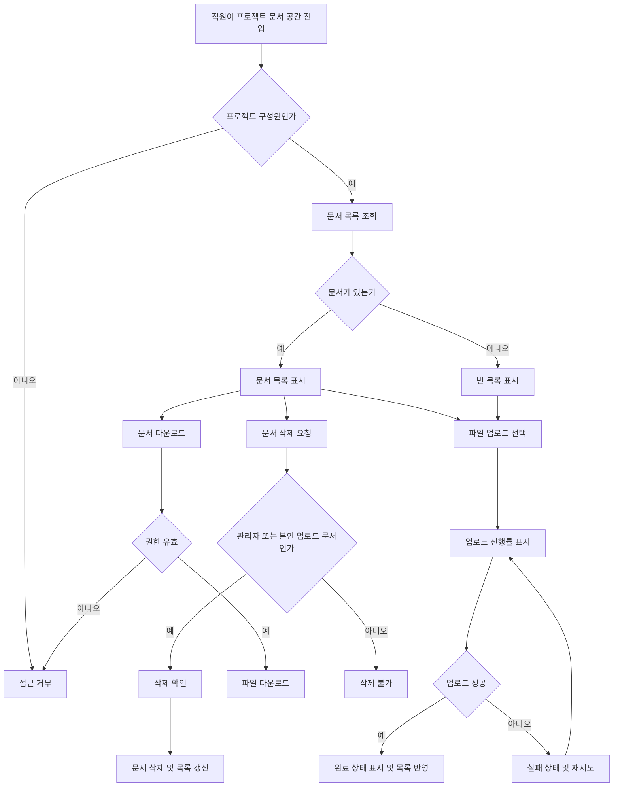

# 사내 프로젝트 문서 공유 PRD

## Applicability

| Contract | Required / N/A | Evidence |
|---|---:|---|
| 문제, 목표, 비목표 | Required | 기능 브리프에 1차 출시 범위와 제외 범위 명시 |
| 역할과 권한 | Required | 직원, 프로젝트 관리자, 일반 구성원 권한 차이 명시 |
| 기능 요구사항 ID | Required | 구현·검증 가능한 계약 필요 |
| 화면/라우트 | Required | 업로드, 목록, 다운로드, 삭제가 사용자 화면에 노출됨 |
| 상태 매트릭스 | Required | 업로드 진행률, 빈 목록, 실패 후 재시도, 완료 상태 필요 |
| 사용자/시스템 플로우 | Required | 업로드·공유·삭제 라이프사이클 존재 |
| 권한·데이터 경계 | Required | 프로젝트별 공유와 삭제 권한이 핵심 동작 |
| 숫자형 NFR | Required, 제한적 | “문서 목록 2초 안에 보이는 것 목표”는 있으나 SLA 미확정 |
| 검색/외부 공유 | N/A | 1차 출시 제외로 명시 |

## Context And Problem

사내 직원은 프로젝트별 문서를 업로드하고 같은 프로젝트 구성원에게 공유해야 한다. 현재 1차 출시는 내부 베타를 목표로 하며, 핵심 범위는 문서 업로드, 목록 조회, 다운로드, 삭제다.

문서 접근은 프로젝트 구성원으로 제한되어야 하며, 삭제 권한은 역할과 소유자에 따라 달라진다. 업로드 과정은 진행률과 성공·실패 상태를 명확히 보여줘야 한다.

## Goals

- 직원이 자신이 속한 프로젝트에 문서를 업로드할 수 있다.
- 같은 프로젝트 구성원이 해당 프로젝트 문서 목록을 보고 다운로드할 수 있다.
- 프로젝트 관리자가 구성원을 초대·제거할 수 있다.
- 프로젝트 관리자가 프로젝트 내 문서를 삭제할 수 있다.
- 일반 구성원은 본인이 업로드한 문서만 삭제할 수 있다.
- 업로드 진행률, 빈 목록, 실패 후 재시도, 업로드 완료 상태를 제공한다.
- 4주 내 내부 베타 출시가 가능하도록 1차 범위를 제한한다.

## Non-goals

- 문서 검색
- 외부 사용자 공유
- 공개 링크 공유
- 프로젝트 외 구성원 접근
- 문서 공동 편집
- 문서 버전 관리
- 승인 워크플로우
- 정식 SLA 보장

## Users, Roles, And Permissions

| Role | Description | Permissions |
|---|---|---|
| 직원 | 사내 인증 사용자 | 자신이 속한 프로젝트 접근 |
| 프로젝트 구성원 | 특정 프로젝트에 초대된 직원 | 프로젝트 문서 목록 조회, 다운로드, 문서 업로드, 본인 문서 삭제 |
| 프로젝트 관리자 | 특정 프로젝트의 관리 권한을 가진 구성원 | 구성원 초대·제거, 프로젝트 내 모든 문서 삭제, 목록 조회, 다운로드, 업로드 |

## Functional Requirements

| ID | Requirement | Priority |
|---|---|---|
| FR-001 | 직원은 자신이 구성원인 프로젝트 목록 또는 프로젝트 진입점을 통해 프로젝트 문서 공간에 접근할 수 있어야 한다. | P0 |
| FR-002 | 프로젝트 구성원은 해당 프로젝트에 문서를 업로드할 수 있어야 한다. | P0 |
| FR-003 | 업로드 중인 문서는 진행률을 사용자에게 표시해야 한다. | P0 |
| FR-004 | 업로드 실패 시 실패 상태와 재시도 동작을 제공해야 한다. | P0 |
| FR-005 | 업로드 완료 시 완료 상태를 표시하고 문서 목록에 반영해야 한다. | P0 |
| FR-006 | 프로젝트 구성원은 같은 프로젝트에 업로드된 문서 목록을 볼 수 있어야 한다. | P0 |
| FR-007 | 문서가 없는 프로젝트는 빈 목록 상태를 표시해야 한다. | P0 |
| FR-008 | 프로젝트 구성원은 같은 프로젝트 문서를 다운로드할 수 있어야 한다. | P0 |
| FR-009 | 프로젝트 관리자는 프로젝트 내 모든 문서를 삭제할 수 있어야 한다. | P0 |
| FR-010 | 일반 구성원은 본인이 업로드한 문서만 삭제할 수 있어야 한다. | P0 |
| FR-011 | 일반 구성원은 다른 구성원이 업로드한 문서를 삭제할 수 없어야 한다. | P0 |
| FR-012 | 프로젝트 관리자는 프로젝트 구성원을 초대할 수 있어야 한다. | P0 |
| FR-013 | 프로젝트 관리자는 프로젝트 구성원을 제거할 수 있어야 한다. | P0 |
| FR-014 | 프로젝트에서 제거된 직원은 해당 프로젝트 문서 목록 조회, 업로드, 다운로드, 삭제를 할 수 없어야 한다. | P0 |
| FR-015 | 프로젝트 구성원이 아닌 직원은 해당 프로젝트의 문서 메타데이터와 파일에 접근할 수 없어야 한다. | P0 |
| FR-016 | 문서 목록은 사용자 요청 후 2초 안에 첫 목록 화면이 보이는 것을 제품 목표로 삼되, 정식 SLA로 표기하지 않는다. | P1 |
| FR-017 | 삭제 전 사용자가 삭제 의도를 확인할 수 있어야 한다. | P1 |
| FR-018 | 삭제 완료 후 목록에서 해당 문서가 제거되어야 한다. | P0 |

## Pages And Routes

실제 라우트명은 제품/개발 컨벤션에 따라 조정 가능하다.

| Page | Route Example | Purpose |
|---|---|---|
| 프로젝트 문서 목록 | `/projects/:projectId/documents` | 문서 목록 조회, 업로드 진입, 다운로드, 삭제 |
| 구성원 관리 | `/projects/:projectId/members` | 프로젝트 관리자용 구성원 초대·제거 |

## State Matrix

| Surface | Empty | Loading | Error | Success | Recovery |
|---|---|---|---|---|---|
| 문서 목록 | “업로드된 문서 없음” 상태 표시 | 목록 로딩 표시 | 목록 조회 실패 표시 | 문서명, 업로더, 업로드 일시, 다운로드/삭제 액션 표시 | 재시도 버튼 |
| 업로드 | 파일 선택 전 기본 상태 | 진행률 표시 | 업로드 실패 표시 | 업로드 완료 표시 및 목록 반영 | 같은 파일 재시도 또는 파일 재선택 |
| 다운로드 | N/A | 다운로드 시작 상태 | 다운로드 실패 표시 | 파일 다운로드 시작 또는 완료 | 다시 다운로드 |
| 삭제 | N/A | 삭제 처리 중 표시 | 삭제 실패 표시 | 목록에서 문서 제거 | 다시 삭제 |
| 구성원 관리 | 구성원 없음 상태는 프로젝트 관리자 최소 1명 정책에 따라 결정 | 구성원 목록 로딩 | 초대·제거 실패 표시 | 구성원 목록 갱신 | 재시도 |

## User Or System Flow

## Authorization And Data Boundaries

- 권한 검사는 서버에서 수행해야 한다. UI에서 버튼을 숨기는 것은 권한 통제로 간주하지 않는다.
- 문서 목록 조회는 프로젝트 구성원에게만 허용한다.
- 문서 파일 다운로드는 프로젝트 구성원에게만 허용한다.
- 문서 업로드는 프로젝트 구성원에게만 허용한다.
- 문서 삭제는 다음 조건 중 하나를 만족해야 한다.
  - 요청자가 해당 프로젝트 관리자다.
  - 요청자가 일반 구성원이고 문서 업로더와 동일하다.
- 구성원 초대·제거는 프로젝트 관리자만 수행할 수 있다.
- 구성원 제거 후 해당 직원은 즉시 해당 프로젝트 문서 접근 권한을 잃어야 한다.
- 문서 데이터는 프로젝트 단위로 격리되어야 하며, 다른 프로젝트의 문서 메타데이터 또는 파일 URL이 노출되면 안 된다.
- 다운로드 URL 또는 파일 접근 토큰이 사용된다면 프로젝트 권한이 확인된 사용자에게만 발급되어야 한다.

## Non-functional Requirements

| ID | Requirement | Status |
|---|---|---|
| NFR-001 | 문서 목록은 요청 후 2초 안에 사용자에게 보이는 것을 제품 목표로 한다. | 목표, SLA 미확정 |
| NFR-002 | 업로드 진행률은 사용자가 업로드가 진행 중임을 인지할 수 있을 만큼 주기적으로 갱신되어야 한다. | Required |
| NFR-003 | 권한 오류는 데이터 존재 여부를 과도하게 노출하지 않는 방식으로 처리해야 한다. | Required |
| NFR-004 | 내부 베타 범위에서는 검색과 외부 공유로 인한 성능·보안 요구사항을 포함하지 않는다. | Required |

## Acceptance Criteria

| ID | Requirement | Given | When | Then | Verification |
|---|---|---|---|---|---|
| AC-001 | FR-002 | 프로젝트 구성원인 직원이 문서 공간에 있다 | 파일을 선택해 업로드한다 | 업로드가 시작된다 | 기능 테스트 |
| AC-002 | FR-003 | 업로드가 진행 중이다 | 파일 전송 중이다 | 진행률이 표시된다 | UI 테스트 |
| AC-003 | FR-004 | 업로드가 실패했다 | 사용자가 실패 상태를 본다 | 재시도 액션이 제공된다 | UI/기능 테스트 |
| AC-004 | FR-005 | 업로드가 성공했다 | 완료 응답을 받는다 | 완료 상태가 표시되고 목록에 문서가 보인다 | 기능 테스트 |
| AC-005 | FR-006 | 프로젝트 구성원이 문서 공간에 진입한다 | 목록을 요청한다 | 해당 프로젝트 문서 목록이 보인다 | 기능 테스트 |
| AC-006 | FR-007 | 프로젝트에 문서가 없다 | 목록을 요청한다 | 빈 목록 상태가 보인다 | UI 테스트 |
| AC-007 | FR-008 | 프로젝트 구성원이 문서 목록을 보고 있다 | 다운로드를 선택한다 | 파일 다운로드가 시작된다 | 기능 테스트 |
| AC-008 | FR-009 | 프로젝트 관리자가 문서를 보고 있다 | 임의 문서를 삭제한다 | 문서가 삭제되고 목록에서 사라진다 | 기능/권한 테스트 |
| AC-009 | FR-010 | 일반 구성원이 본인 업로드 문서를 보고 있다 | 삭제한다 | 문서가 삭제되고 목록에서 사라진다 | 기능/권한 테스트 |
| AC-010 | FR-011 | 일반 구성원이 타인 업로드 문서를 보고 있다 | 삭제를 시도한다 | 삭제가 거부된다 | 권한 테스트 |
| AC-011 | FR-012 | 프로젝트 관리자가 구성원 관리 화면에 있다 | 직원을 초대한다 | 직원이 프로젝트 구성원으로 추가된다 | 기능/권한 테스트 |
| AC-012 | FR-013, FR-014 | 프로젝트 관리자가 구성원을 제거했다 | 제거된 직원이 프로젝트 문서에 접근한다 | 목록·업로드·다운로드·삭제가 거부된다 | 권한 테스트 |
| AC-013 | FR-015 | 프로젝트 비구성원이 프로젝트 문서 API에 접근한다 | 목록 또는 파일을 요청한다 | 접근이 거부된다 | API 권한 테스트 |
| AC-014 | FR-016 | 사용자가 문서 목록을 요청한다 | 정상 네트워크와 내부 베타 기준 데이터량에서 응답한다 | 2초 내 목록 화면 표시 여부를 측정할 수 있다 | 성능 계측 |
| AC-015 | FR-017, FR-018 | 삭제 권한이 있는 사용자가 삭제를 선택한다 | 삭제를 확인한다 | 삭제 처리 후 목록이 갱신된다 | UI/기능 테스트 |

## Assumptions

- 직원 인증은 이미 존재하는 사내 인증 체계를 사용한다.
- 프로젝트와 프로젝트 관리자 개념은 이미 존재하거나 1차 범위에서 최소 모델로 제공된다.
- 한 문서는 하나의 프로젝트에만 속한다.
- 업로더는 문서 생성 시점의 직원 계정으로 기록된다.
- 구성원 제거는 문서 소유권을 삭제하지 않는다. 제거된 사용자의 과거 업로드 문서는 남아 있고, 프로젝트 관리자가 삭제할 수 있다.
- 1차 베타에서는 폴더 구조, 태그, 검색, 버전 관리를 제공하지 않는다.
- 문서 목록의 기본 정렬은 최신 업로드 순으로 가정한다.
- 문서 메타데이터 최소 항목은 문서명, 업로더, 업로드 일시, 파일 크기다.

## Open Decisions

| ID | Decision | Owner | Impact |
|---|---|---|---|
| OD-001 | 문서 목록 2초 목표를 정식 SLA로 만들지 여부와 측정 기준 | 제품 책임자 | 성능 목표, 모니터링, 출시 기준 |
| OD-002 | 파일 크기 제한 | 제품/개발 | 업로드 UX, 저장소 비용, 실패 처리 |
| OD-003 | 허용 파일 형식 | 제품/보안 | 보안 정책, 사용자 제약 |
| OD-004 | 바이러스/악성 파일 검사 필요 여부 | 보안/제품 | 출시 일정, 업로드 처리 방식 |
| OD-005 | 프로젝트 관리자 최소 1명 유지 정책 | 제품 | 구성원 제거 규칙 |
| OD-006 | 삭제가 영구 삭제인지 소프트 삭제인지 | 제품/개발 | 복구 가능성, 감사 로그 |
| OD-007 | 문서 다운로드 권한이 제거 즉시 만료되어야 하는 구체 방식 | 개발/보안 | 토큰 만료, 캐시 정책 |
| OD-008 | 내부 베타 대상 사용자 수와 예상 문서 수 | 제품 책임자 | 성능 검증 범위 |

## Risks And Mitigations

| Risk | Impact | Mitigation |
|---|---|---|
| SLA 미확정으로 성능 완료 기준이 모호함 | 베타 승인 기준 혼선 | 2초는 목표로 계측하고, SLA는 OD-001로 분리 |
| 권한 로직 누락 시 프로젝트 간 문서 노출 가능 | 보안 사고 | 서버 권한 테스트를 P0 acceptance로 포함 |
| 파일 크기·형식 미정으로 업로드 실패 UX가 흔들릴 수 있음 | 구현 지연 | 베타 전 OD-002, OD-003 결정 필요 |
| 구성원 제거 후 기존 다운로드 링크가 살아 있을 수 있음 | 권한 우회 | 다운로드 시점 권한 확인 또는 짧은 만료 토큰 적용 |
| 4주 일정 대비 구성원 관리와 파일 처리 범위가 큼 | 베타 지연 | 검색, 외부 공유, 버전 관리 제외 유지 |

## Delivery

| Phase | Requirement IDs | Verifiable Exit Condition |
|---|---|---|
| Week 1: 권한·데이터 모델 확정 | FR-001, FR-006, FR-009, FR-010, FR-011, FR-015 | 프로젝트 구성원/관리자/업로더 기준 권한 테스트 통과 |
| Week 2: 업로드·목록 구현 | FR-002, FR-003, FR-004, FR-005, FR-006, FR-007, FR-016 | 업로드 진행률·실패 재시도·완료·빈 목록 상태 확인 |
| Week 3: 다운로드·삭제·구성원 관리 | FR-008, FR-009, FR-010, FR-012, FR-013, FR-014, FR-017, FR-018 | 다운로드, 삭제, 초대, 제거 플로우 통합 테스트 통과 |
| Week 4: 내부 베타 안정화 | 전체 P0, NFR-001~003 | 핵심 acceptance criteria 통과, 2초 목표 계측 결과 확인, 미결정 SLA는 베타 노트에 명시 |

검증 참고: 사용자의 요청에 따라 파일을 만들지 않았고 저장소도 탐색하지 않았으므로 PRD validator는 실행하지 않았습니다.