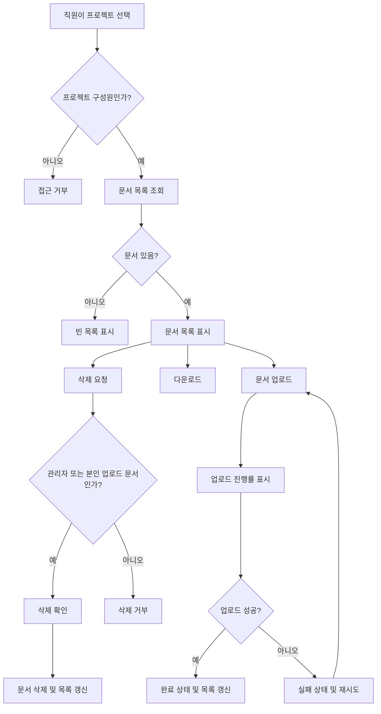

# 사내 프로젝트 문서 공유 PRD

## Applicability

| Contract | Required / N/A | Evidence |
|---|---:|---|
| 문제, 목표/비목표 | Required | 브리프에 1차 출시 범위와 제외 범위가 명시됨 |
| 역할 및 권한 | Required | 직원, 프로젝트 관리자, 일반 구성원 권한이 명시됨 |
| 기능 요구사항 ID | Required | 구현·검증 가능한 요구사항 필요 |
| 페이지/라우트 | Required | 업로드, 목록, 다운로드, 삭제, 구성원 관리 UI 필요 |
| 상태 매트릭스 | Required | 업로드 진행률, 빈 목록, 실패 후 재시도, 완료 상태 요구 |
| 사용자/시스템 플로우 | Required | 업로드·공유·삭제·초대/제거 lifecycle 존재 |
| 권한 및 데이터 경계 | Required | 프로젝트별 접근 제어와 문서 소유권 규칙 필요 |
| 숫자형 NFR | Required with caveat | “목록 2초 안에 보이는 것을 목표”는 있으나 SLA 미확정 |
| 승인 기준 | Required | 내부 베타 전 검증 필요 |
| 릴리스 계획 | Required | 4주 내 내부 베타 목표 |

## Context and Problem

사내 직원은 프로젝트별 문서를 한곳에 업로드하고 같은 프로젝트 구성원과 공유해야 한다. 현재 요구 범위는 내부 베타용 1차 출시이며, 핵심 작업은 문서 업로드, 목록 확인, 다운로드, 삭제, 프로젝트 구성원 관리다.

검색과 외부 공유는 1차 출시에서 제외한다. 문서 목록은 사용자가 2초 안에 볼 수 있는 경험을 목표로 하지만, 공식 SLA는 제품 책임자가 아직 결정하지 않았다.

## Goals

1. 직원이 자신이 속한 프로젝트에 문서를 업로드할 수 있다.
2. 같은 프로젝트 구성원이 해당 프로젝트 문서 목록을 보고 다운로드할 수 있다.
3. 프로젝트 관리자가 구성원을 초대·제거할 수 있다.
4. 프로젝트 관리자가 프로젝트 내 모든 문서를 삭제할 수 있다.
5. 일반 구성원은 본인이 업로드한 문서만 삭제할 수 있다.
6. 업로드 과정에서 진행률, 실패, 재시도, 완료 상태가 명확히 표시된다.
7. 4주 내 내부 베타에 배포 가능한 범위로 구현한다.

## Non-goals

1. 문서 검색
2. 외부 사용자 또는 외부 링크 공유
3. 문서 미리보기
4. 문서 버전 관리
5. 문서 공동 편집
6. 세부 감사 로그 화면
7. 공식 성능 SLA 확정

## Users, Roles, and Permissions

| Role | Description | Permissions |
|---|---|---|
| 직원 | 사내 인증 사용자인 기본 사용자 | 본인이 속한 프로젝트 접근 |
| 프로젝트 구성원 | 특정 프로젝트에 소속된 직원 | 프로젝트 문서 목록 조회, 다운로드, 문서 업로드, 본인 문서 삭제 |
| 프로젝트 관리자 | 특정 프로젝트의 관리자 | 구성원 초대·제거, 프로젝트 내 모든 문서 삭제, 일반 구성원 권한 포함 |

권한은 서버에서 강제되어야 한다. UI에서 버튼을 숨기는 것은 보조 수단이며 권한 검증을 대체하지 않는다.

## Functional Requirements

| ID | Requirement | Priority |
|---|---|---:|
| FR-001 | 사용자는 자신이 구성원인 프로젝트 목록 또는 프로젝트 상세 화면에 접근할 수 있어야 한다. | P0 |
| FR-002 | 사용자는 프로젝트별 문서 목록을 볼 수 있어야 한다. | P0 |
| FR-003 | 문서 목록에는 최소한 파일명, 업로드한 사용자, 업로드 완료 시각, 파일 크기, 다운로드 액션, 삭제 가능 여부가 표시되어야 한다. | P0 |
| FR-004 | 사용자는 자신이 구성원인 프로젝트에 문서를 업로드할 수 있어야 한다. | P0 |
| FR-005 | 업로드 중에는 파일별 진행률이 표시되어야 한다. | P0 |
| FR-006 | 업로드 실패 시 실패 상태와 재시도 액션이 제공되어야 한다. | P0 |
| FR-007 | 업로드 완료 시 완료 상태가 표시되고 문서 목록에 반영되어야 한다. | P0 |
| FR-008 | 사용자는 프로젝트 문서를 다운로드할 수 있어야 한다. | P0 |
| FR-009 | 프로젝트 관리자는 프로젝트 내 모든 문서를 삭제할 수 있어야 한다. | P0 |
| FR-010 | 일반 구성원은 본인이 업로드한 문서만 삭제할 수 있어야 한다. | P0 |
| FR-011 | 삭제 전 사용자 확인 단계가 있어야 한다. | P1 |
| FR-012 | 삭제 완료 후 문서 목록에서 해당 문서가 제거되어야 한다. | P0 |
| FR-013 | 프로젝트 관리자는 직원을 프로젝트 구성원으로 초대할 수 있어야 한다. | P0 |
| FR-014 | 프로젝트 관리자는 프로젝트 구성원을 제거할 수 있어야 한다. | P0 |
| FR-015 | 제거된 구성원은 더 이상 해당 프로젝트 문서 목록, 업로드, 다운로드, 삭제를 수행할 수 없어야 한다. | P0 |
| FR-016 | 프로젝트에 문서가 없을 때 빈 목록 상태가 표시되어야 한다. | P0 |
| FR-017 | 문서 목록 조회 실패 시 오류 상태와 재시도 액션이 제공되어야 한다. | P1 |
| FR-018 | 검색 및 외부 공유 진입점은 1차 출시 UI에 노출하지 않는다. | P0 |

## Pages and Routes

| Page | Purpose | Primary Actions |
|---|---|---|
| 프로젝트 목록 | 사용자가 접근 가능한 프로젝트 진입 | 프로젝트 선택 |
| 프로젝트 문서 목록 | 프로젝트별 문서 확인 및 작업 | 업로드, 다운로드, 삭제 |
| 프로젝트 구성원 관리 | 관리자 전용 구성원 관리 | 초대, 제거 |

라우트 명칭은 구현 환경에 맞춰 결정하되, 프로젝트 단위 식별자가 포함되어야 한다.

## State Matrix

| Surface | Empty | Loading | Error | Success | Recovery |
|---|---|---|---|---|---|
| 문서 목록 | “아직 업로드된 문서가 없음” 상태 표시 | 목록 로딩 표시 | 조회 실패 메시지 | 문서 목록 표시 | 다시 시도 |
| 업로드 | 업로드 대기 상태 | 파일별 진행률 표시 | 실패 상태 표시 | 완료 상태 표시 | 재시도 |
| 다운로드 | N/A | 다운로드 시작 상태 | 다운로드 실패 메시지 | 파일 다운로드 | 다시 시도 |
| 삭제 | N/A | 삭제 처리 중 표시 | 삭제 실패 메시지 | 목록에서 제거 | 다시 시도 |
| 구성원 관리 | 구성원 없음 또는 관리자만 표시 | 구성원 목록 로딩 | 조회/초대/제거 실패 메시지 | 구성원 목록 표시 | 다시 시도 |

## User or System Flow

## Authorization and Data Boundaries

1. 프로젝트 문서는 프로젝트 단위로 격리된다.
2. 사용자는 본인이 구성원인 프로젝트의 문서만 조회, 업로드, 다운로드할 수 있다.
3. 프로젝트 관리자는 해당 프로젝트 내 모든 문서를 삭제할 수 있다.
4. 일반 구성원은 `uploadedBy`가 본인인 문서만 삭제할 수 있다.
5. 구성원 제거 즉시 해당 사용자의 프로젝트 접근 권한은 철회되어야 한다.
6. 문서 다운로드 URL 또는 파일 접근 토큰이 사용된다면 프로젝트 멤버십과 만료 시간이 서버에서 검증되어야 한다.
7. 클라이언트가 전달한 역할, 프로젝트 ID, 업로더 ID는 신뢰하지 않는다.

## Non-functional Requirements

| Area | Requirement |
|---|---|
| Performance | 문서 목록은 사용자가 2초 안에 볼 수 있는 경험을 목표로 한다. 공식 SLA는 제품 책임자 결정 전까지 베타 목표치로만 사용한다. |
| Reliability | 업로드 실패 시 같은 파일을 다시 업로드할 수 있어야 한다. |
| Security | 모든 문서 조회·다운로드·삭제·구성원 관리 작업은 서버 권한 검사를 통과해야 한다. |
| Privacy | 외부 공유는 1차 출시에서 제공하지 않는다. |
| Usability | 빈 목록, 진행률, 실패, 재시도, 완료 상태는 사용자가 다음 행동을 판단할 수 있을 정도로 명확해야 한다. |
| Compatibility | 내부 베타 대상 직원의 표준 업무 브라우저에서 동작해야 한다. 구체 브라우저 범위는 열린 결정으로 둔다. |

## Acceptance Criteria

| ID | Requirement | Given | When | Then | Verification |
|---|---|---|---|---|---|
| AC-001 | FR-002 | 프로젝트 구성원인 사용자가 있다 | 프로젝트 문서 화면에 진입한다 | 해당 프로젝트 문서 목록이 표시된다 | E2E |
| AC-002 | FR-016 | 프로젝트에 문서가 없다 | 문서 목록을 조회한다 | 빈 목록 상태가 표시된다 | E2E |
| AC-003 | FR-004, FR-005 | 구성원이 업로드 가능한 파일을 선택했다 | 업로드를 시작한다 | 파일별 진행률이 표시된다 | E2E |
| AC-004 | FR-006 | 업로드가 실패했다 | 실패 상태가 표시된다 | 사용자는 재시도할 수 있다 | E2E |
| AC-005 | FR-007 | 업로드가 성공했다 | 처리가 완료된다 | 완료 상태가 표시되고 목록에 문서가 추가된다 | E2E |
| AC-006 | FR-008 | 구성원이 문서 목록을 보고 있다 | 다운로드를 선택한다 | 파일이 다운로드된다 | E2E/API |
| AC-007 | FR-009 | 프로젝트 관리자가 문서를 보고 있다 | 삭제를 확정한다 | 문서가 삭제되고 목록에서 사라진다 | E2E/API |
| AC-008 | FR-010 | 일반 구성원이 타인이 올린 문서를 보고 있다 | 삭제를 시도한다 | 삭제가 거부된다 | API 권한 테스트 |
| AC-009 | FR-010 | 일반 구성원이 본인이 올린 문서를 보고 있다 | 삭제를 확정한다 | 문서가 삭제된다 | E2E/API |
| AC-010 | FR-013 | 프로젝트 관리자가 구성원 관리 화면에 있다 | 직원을 초대한다 | 해당 직원이 프로젝트 구성원이 된다 | E2E/API |
| AC-011 | FR-014, FR-015 | 프로젝트 관리자가 기존 구성원을 제거했다 | 제거된 사용자가 프로젝트에 접근한다 | 접근이 거부된다 | API 권한 테스트 |
| AC-012 | FR-018 | 1차 출시 환경이다 | 사용자가 문서 공유 기능을 사용한다 | 검색과 외부 공유 기능이 노출되지 않는다 | UI 검증 |

## Assumptions

1. 사내 직원 인증 시스템은 이미 존재하며, 사용자 식별자를 제공한다.
2. 프로젝트와 프로젝트 관리자 정보는 기존 시스템 또는 별도 관리 데이터로 제공된다.
3. “초대”는 이메일 초대 링크가 아니라 기존 직원 계정을 프로젝트 구성원으로 추가하는 동작으로 간주한다.
4. 1차 출시는 단일 파일 업로드를 기본으로 한다. 다중 파일 업로드는 가능하면 지원하되 필수 범위는 아니다.
5. 파일 형식 제한은 1차 베타에서는 최소 정책으로 시작하고, 보안 요구에 따라 차단 확장자를 정한다.
6. 삭제는 사용자 관점에서 즉시 목록에서 사라지는 삭제로 정의한다. 물리 삭제 또는 보관 정책은 구현/보안 정책에 따른다.

## Open Decisions

1. 제품 책임자가 공식 문서 목록 SLA를 확정해야 한다.
2. 최대 파일 크기와 허용 파일 형식을 결정해야 한다.
3. 업로드 가능한 저장 용량 한도와 프로젝트별 quota 필요 여부를 결정해야 한다.
4. 구성원 초대 방식이 “기존 직원 검색 후 추가”인지 “초대 알림/승인” 흐름인지 결정해야 한다.
5. 삭제된 문서의 복구 가능 여부와 보관 기간을 결정해야 한다.
6. 내부 베타 대상 브라우저와 모바일 지원 범위를 결정해야 한다.
7. 다운로드 링크 만료 시간과 재사용 가능 여부를 결정해야 한다.

## Risks and Mitigations

| Risk | Impact | Mitigation |
|---|---|---|
| 권한 검증 누락 | 프로젝트 외부 문서 유출 | 모든 API에서 프로젝트 멤버십과 역할을 서버 검증 |
| 파일 업로드 실패율 | 베타 사용성 저하 | 실패 상태, 재시도, 진행률을 P0로 구현 |
| SLA 미확정 | 성능 기준 혼선 | 2초는 베타 목표로 기록하고 공식 SLA는 열린 결정으로 관리 |
| 파일 크기/형식 미결정 | 보안·비용 리스크 | 베타 전 최소 제한값 결정 필요 |
| 구성원 제거 후 접근 유지 | 퇴장자 문서 접근 | 다운로드 시점에도 멤버십 재검증 |

## Delivery

| Phase | Requirement IDs | Verifiable exit condition |
|---|---|---|
| Week 1: 권한·데이터 모델 | FR-001, FR-002, FR-009, FR-010, FR-015 | 프로젝트 멤버십 기반 API 권한 테스트 통과 |
| Week 2: 문서 업로드·목록 | FR-002, FR-003, FR-004, FR-005, FR-006, FR-007, FR-016, FR-017 | 업로드 상태와 목록 상태 E2E 통과 |
| Week 3: 다운로드·삭제·구성원 관리 | FR-008, FR-009, FR-010, FR-011, FR-012, FR-013, FR-014, FR-015 | 다운로드, 삭제, 초대, 제거 E2E/API 테스트 통과 |
| Week 4: 내부 베타 안정화 | 전체 P0, 주요 P1 | 베타 체크리스트 통과, 알려진 P0 버그 없음 |

검증 스크립트는 실행하지 않았습니다. 요청 범위가 “응답에만 작성”이고 파일을 만들지 않는 것이었기 때문입니다.