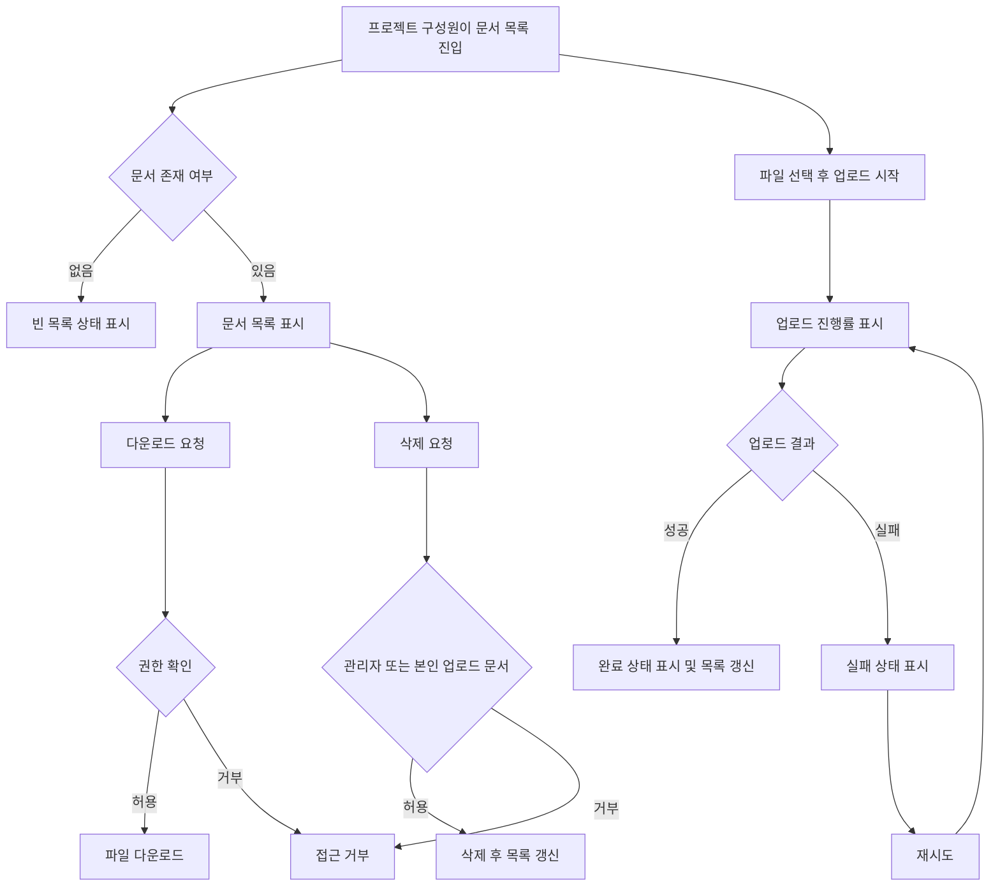

# 사내 프로젝트 문서 공유 PRD

## Applicability

| Contract | Required / N/A | Evidence |
|---|---:|---|
| Context and problem | Required | 프로젝트별 문서 업로드, 공유, 다운로드, 삭제가 핵심 기능 |
| Goals / Non-goals | Required | 1차 출시 범위와 제외 범위가 명시됨 |
| Roles and permissions | Required | 직원, 프로젝트 관리자, 일반 구성원 권한 차이가 있음 |
| Functional requirements | Required | 구현 가능한 요구사항 ID 필요 |
| Pages and routes | Required | 업로드, 목록, 다운로드, 삭제, 구성원 관리 UI 필요 |
| State matrix | Required | 업로드 진행률, 빈 목록, 실패 재시도, 완료 상태 필요 |
| User/system flow | Required | 업로드와 삭제, 초대·제거는 다단계 흐름 |
| Authorization and data boundaries | Required | 프로젝트 구성원만 접근 가능해야 함 |
| Numeric NFR | Required, partial | “2초 안에 보이는 것”은 목표이나 SLA 미확정 |
| Acceptance criteria | Required | 베타 출시에 필요한 검증 기준 필요 |
| Delivery plan | Required | 4주 내 내부 베타 목표 |

## Context and Problem

사내 직원들이 프로젝트별 문서를 업로드하고 같은 프로젝트 구성원에게 공유할 수 있는 기능을 제공한다. 현재 요구 범위는 1차 내부 베타 기준으로, 문서 업로드, 목록 조회, 다운로드, 삭제, 프로젝트 구성원 관리에 집중한다.

검색, 외부 공유, 고급 문서 관리 기능은 1차 출시에서 제외한다.

## Goals

1. 직원이 본인이 속한 프로젝트에 문서를 업로드할 수 있다.
2. 같은 프로젝트 구성원은 해당 프로젝트의 문서 목록을 보고 다운로드할 수 있다.
3. 프로젝트 관리자는 프로젝트 구성원을 초대·제거할 수 있다.
4. 프로젝트 관리자는 프로젝트 내 모든 문서를 삭제할 수 있다.
5. 일반 구성원은 본인이 업로드한 문서만 삭제할 수 있다.
6. 업로드 중 진행률, 실패 후 재시도, 완료 상태, 빈 목록 상태를 제공한다.
7. 4주 내 내부 베타에서 핵심 문서 공유 흐름을 검증한다.

## Non-goals

1. 문서 검색
2. 외부 사용자 공유 또는 공개 링크
3. 문서 버전 관리
4. 문서 미리보기
5. 폴더, 태그, 댓글, 승인 워크플로
6. 감사 로그 UI
7. 정식 SLA 확정

## Users, Roles, and Permissions

| Role | Description | Permissions |
|---|---|---|
| 직원 | 사내 인증 사용자 | 본인이 속한 프로젝트 접근 |
| 프로젝트 구성원 | 특정 프로젝트에 초대된 직원 | 문서 목록 조회, 다운로드, 문서 업로드, 본인 문서 삭제 |
| 프로젝트 관리자 | 특정 프로젝트의 관리자 | 구성원 초대·제거, 모든 문서 삭제, 목록 조회, 다운로드, 업로드 |
| 비구성원 | 프로젝트에 속하지 않은 직원 | 해당 프로젝트 문서 및 구성원 정보 접근 불가 |

권한 검사는 반드시 서버에서 수행한다. UI에서 버튼을 숨기는 것은 보조 동작일 뿐 권한 통제로 간주하지 않는다.

## Functional Requirements

| ID | Requirement | Priority |
|---|---|---|
| FR-001 | 직원은 본인이 구성원인 프로젝트 목록 또는 프로젝트 상세 화면에 접근할 수 있다. | Must |
| FR-002 | 프로젝트 구성원은 해당 프로젝트에 문서를 업로드할 수 있다. | Must |
| FR-003 | 업로드 중 사용자는 파일별 진행률을 볼 수 있다. | Must |
| FR-004 | 업로드 실패 시 사용자는 같은 파일 업로드를 재시도할 수 있다. | Must |
| FR-005 | 업로드 완료 시 완료 상태가 표시되고 문서 목록에 새 문서가 반영된다. | Must |
| FR-006 | 프로젝트 구성원은 해당 프로젝트의 문서 목록을 볼 수 있다. | Must |
| FR-007 | 문서가 없을 때 빈 목록 상태를 표시한다. | Must |
| FR-008 | 프로젝트 구성원은 프로젝트 문서를 다운로드할 수 있다. | Must |
| FR-009 | 일반 구성원은 본인이 업로드한 문서만 삭제할 수 있다. | Must |
| FR-010 | 프로젝트 관리자는 프로젝트 내 모든 문서를 삭제할 수 있다. | Must |
| FR-011 | 프로젝트 관리자는 직원을 프로젝트 구성원으로 초대할 수 있다. | Must |
| FR-012 | 프로젝트 관리자는 기존 구성원을 프로젝트에서 제거할 수 있다. | Must |
| FR-013 | 구성원 제거 후 해당 직원은 프로젝트 문서 목록, 다운로드, 업로드, 삭제에 접근할 수 없다. | Must |
| FR-014 | 삭제된 문서는 문서 목록에서 제거되고 다운로드할 수 없다. | Must |
| FR-015 | 권한 없는 사용자의 문서 조회, 다운로드, 삭제, 구성원 관리 요청은 거부된다. | Must |
| FR-016 | 문서 목록은 사용자 요청 후 2초 안에 첫 화면에 표시되는 것을 제품 목표로 추적한다. 실제 SLA는 확정 전까지 명시하지 않는다. | Should |
| FR-017 | 파일명, 업로더, 업로드 시각, 파일 크기를 문서 목록에 표시한다. | Should |
| FR-018 | 삭제 전 확인 절차를 제공한다. | Should |

## Pages and Routes

| Page | Route Example | Main Capabilities |
|---|---|---|
| 프로젝트 문서 목록 | `/projects/:projectId/documents` | 문서 목록, 빈 상태, 다운로드, 삭제, 업로드 진입 |
| 문서 업로드 | `/projects/:projectId/documents/upload` 또는 목록 내 업로드 패널 | 파일 선택, 진행률, 실패 재시도, 완료 상태 |
| 프로젝트 구성원 관리 | `/projects/:projectId/members` | 관리자 전용 구성원 초대·제거 |

라우트명은 예시이며 실제 라우팅 구조는 기존 제품 IA에 맞춘다.

## State Matrix

| Surface | Empty | Loading | Error | Success | Recovery |
|---|---|---|---|---|---|
| 문서 목록 | “아직 업로드된 문서가 없음” 상태 표시 | 목록 로딩 표시 | 목록 불러오기 실패 표시 | 문서 목록 표시 | 다시 시도 |
| 업로드 | 선택된 파일 없음 | 파일별 진행률 표시 | 업로드 실패 표시 | 업로드 완료 표시 | 실패 파일 재시도 |
| 다운로드 | N/A | 다운로드 시작 상태 | 다운로드 실패 또는 권한 없음 표시 | 파일 저장 시작 | 다시 시도 |
| 삭제 | N/A | 삭제 처리 중 | 삭제 실패 또는 권한 없음 표시 | 목록에서 제거 | 다시 시도 |
| 구성원 관리 | 구성원 없음은 N/A, 최소 관리자 존재 가정 | 구성원 목록 로딩 | 초대·제거 실패 표시 | 구성원 목록 갱신 | 다시 시도 |

## User or System Flow

## Authorization and Data Boundaries

1. 프로젝트 문서는 해당 프로젝트의 구성원에게만 노출된다.
2. 프로젝트별 문서 데이터는 다른 프로젝트에서 조회, 다운로드, 삭제될 수 없다.
3. 다운로드 URL 또는 파일 접근 토큰이 사용되는 경우, 프로젝트 구성원 권한을 반영해야 하며 비구성원이 재사용할 수 없어야 한다.
4. 일반 구성원 삭제 권한은 `document.uploaderId == currentUser.id` 조건을 서버에서 검증한다.
5. 프로젝트 관리자의 전체 문서 삭제 권한은 서버에서 프로젝트 관리자 여부로 검증한다.
6. 구성원 제거 후 기존 세션에서도 해당 프로젝트 리소스 접근은 즉시 또는 다음 권한 검증 시 차단되어야 한다.
7. 관리자는 구성원 제거 시 자기 자신을 제거할 수 있는지 여부가 열린 결정이다.

## Non-functional Requirements

| Area | Requirement |
|---|---|
| Performance | 문서 목록 첫 표시 목표는 2초 이내다. 단, 실제 SLA와 측정 기준은 제품 책임자가 결정한다. |
| Reliability | 업로드 실패 시 사용자가 재시도할 수 있어야 한다. |
| Security | 모든 프로젝트·문서 접근은 서버 권한 검사를 통과해야 한다. |
| Privacy | 프로젝트 비구성원에게 파일명, 업로더, 파일 메타데이터가 노출되지 않아야 한다. |
| Usability | 빈 목록, 로딩, 실패, 완료 상태가 명확히 구분되어야 한다. |
| Auditability | 1차 베타에서는 감사 로그 UI는 제외하되, 삭제·업로드 이벤트 기록 필요 여부는 열린 결정으로 둔다. |

## Acceptance Criteria

| ID | Requirement | Given | When | Then | Verification |
|---|---|---|---|---|---|
| AC-001 | FR-002 | 프로젝트 구성원인 직원 | 파일을 선택해 업로드하면 | 업로드가 시작된다 | 기능 테스트 |
| AC-002 | FR-003 | 업로드가 진행 중일 때 | 사용자가 업로드 영역을 보면 | 진행률이 표시된다 | UI 테스트 |
| AC-003 | FR-004 | 업로드가 실패했을 때 | 사용자가 재시도를 누르면 | 같은 파일 업로드가 다시 시도된다 | 기능 테스트 |
| AC-004 | FR-005 | 업로드가 성공했을 때 | 완료 후 목록을 보면 | 새 문서가 목록에 표시된다 | E2E 테스트 |
| AC-005 | FR-006, FR-007 | 프로젝트 문서가 없을 때 | 구성원이 문서 목록에 진입하면 | 빈 목록 상태가 표시된다 | UI 테스트 |
| AC-006 | FR-008 | 프로젝트 구성원 | 문서 다운로드를 요청하면 | 파일 다운로드가 시작된다 | E2E 테스트 |
| AC-007 | FR-009 | 일반 구성원 A와 B가 있고 B가 올린 문서가 있을 때 | A가 B의 문서 삭제를 요청하면 | 삭제가 거부된다 | API 권한 테스트 |
| AC-008 | FR-009 | 일반 구성원 A가 본인이 올린 문서를 볼 때 | 삭제를 요청하면 | 문서가 삭제되고 목록에서 사라진다 | E2E 테스트 |
| AC-009 | FR-010 | 프로젝트 관리자 | 임의 구성원이 올린 문서 삭제를 요청하면 | 문서가 삭제된다 | API 권한 테스트 |
| AC-010 | FR-011 | 프로젝트 관리자 | 직원을 초대하면 | 해당 직원이 프로젝트 구성원이 된다 | 기능 테스트 |
| AC-011 | FR-012, FR-013 | 프로젝트 관리자 | 구성원을 제거하면 | 제거된 직원은 프로젝트 문서에 접근할 수 없다 | API 권한 테스트 |
| AC-012 | FR-015 | 비구성원 | 문서 목록, 다운로드, 삭제 API를 호출하면 | 요청이 거부된다 | 보안 테스트 |
| AC-013 | FR-016 | 문서 목록 요청 | 목록 화면을 열면 | 첫 목록 표시 시간이 측정 가능하다 | 성능 계측 확인 |
| AC-014 | FR-018 | 삭제 가능한 문서 | 사용자가 삭제를 누르면 | 확인 절차 후 삭제된다 | UI 테스트 |

## Assumptions and Open Decisions

### Reasonable Assumptions

1. 사용자는 이미 사내 인증을 거친 직원이다.
2. 프로젝트와 프로젝트 관리자 개념은 기존 시스템에 존재한다.
3. 1차 베타는 웹 기준이다.
4. 파일은 프로젝트 단위로 저장되며 문서 메타데이터에는 파일명, 크기, 업로더, 업로드 시각, 프로젝트 ID가 포함된다.
5. 업로드 파일 크기 제한과 허용 확장자는 초기 베타 전에 별도 정책으로 확정한다.
6. 구성원 초대는 사내 직원 계정 검색 또는 이메일 기반 선택으로 처리한다.
7. 삭제는 1차 베타에서 사용자에게 즉시 목록에서 사라지는 동작으로 제공한다. 물리 삭제 또는 소프트 삭제 방식은 구현 결정으로 둔다.

### Open Decisions

1. 문서 목록의 실제 SLA: 2초 목표를 정식 SLA로 채택할지, 측정 기준을 “첫 콘텐츠 표시”로 할지 “전체 목록 로딩 완료”로 할지 결정 필요.
2. 최대 파일 크기, 허용 파일 형식, 동시 업로드 개수.
3. 중복 파일명 허용 여부.
4. 업로드 실패의 재시도 횟수 제한 여부.
5. 구성원 제거 시 해당 사용자가 업로드한 문서의 유지 또는 삭제 정책.
6. 프로젝트 관리자가 자기 자신을 제거할 수 있는지 여부.
7. 다운로드 URL 만료 시간 또는 접근 방식.
8. 문서 삭제를 소프트 삭제로 처리할지 영구 삭제로 처리할지.
9. 업로드·삭제·다운로드 감사 로그가 베타 필수인지 여부.
10. 모바일 웹 지원 범위.

## Risks and Mitigations

| Risk | Impact | Mitigation |
|---|---|---|
| 권한 검사가 UI에만 의존할 위험 | 비구성원 또는 일반 구성원의 부적절한 접근 | 모든 API에서 서버 권한 검증 필수 |
| 파일 크기·형식 정책 미정 | 업로드 실패, 저장 비용 증가 | 베타 전 정책 결정 항목으로 고정 |
| 목록 2초 목표의 측정 기준 불명확 | 성능 완료 여부 판단 어려움 | 계측은 먼저 추가하고 SLA는 PO 결정 후 확정 |
| 구성원 제거 후 접근 차단 지연 | 퇴출된 구성원의 문서 접근 가능성 | 다운로드·목록·삭제 요청마다 최신 권한 검증 |
| 삭제 정책 미정 | 복구, 감사, 컴플라이언스 이슈 | 소프트 삭제 여부를 베타 전 결정 |

## Delivery

| Phase | Timeline | Requirement IDs | Verifiable Exit Condition |
|---|---:|---|---|
| Phase 1: 권한·데이터 모델 | Week 1 | FR-001, FR-006, FR-015 | 프로젝트 구성원만 문서 목록 API 접근 가능 |
| Phase 2: 업로드·목록 | Week 2 | FR-002, FR-003, FR-004, FR-005, FR-007, FR-017 | 업로드 진행률, 실패 재시도, 완료 후 목록 반영 검증 |
| Phase 3: 다운로드·삭제 | Week 3 | FR-008, FR-009, FR-010, FR-014, FR-018 | 권한별 다운로드·삭제 시나리오 통과 |
| Phase 4: 구성원 관리·베타 안정화 | Week 4 | FR-011, FR-012, FR-013, FR-016 | 초대·제거 후 접근 권한 반영, 목록 표시 시간 계측 가능 |

## Beta Readiness Criteria

1. Must 요구사항 FR-001부터 FR-015까지 통과한다.
2. 관리자와 일반 구성원의 삭제 권한 차이가 API 테스트로 검증된다.
3. 비구성원 접근 거부가 API 테스트로 검증된다.
4. 업로드 실패 후 재시도와 완료 상태가 E2E로 검증된다.
5. 문서 목록 첫 표시 시간이 계측된다.
6. 열린 결정 중 파일 크기, 파일 형식, 삭제 방식, SLA 측정 기준은 내부 베타 전 최소 정책으로 확정된다.