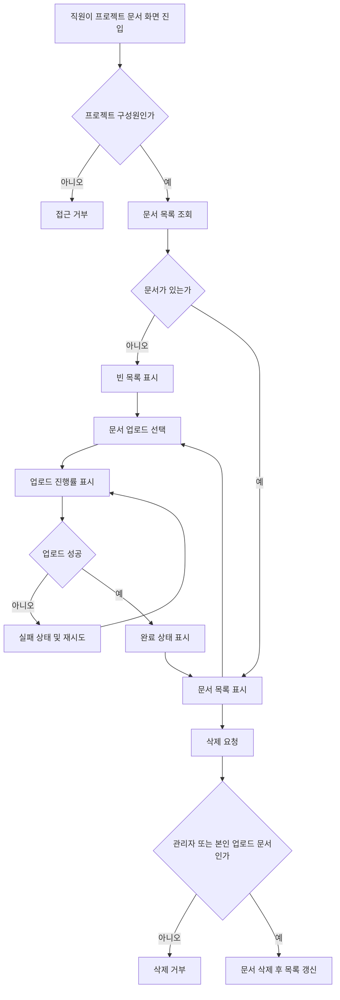

# 사내 프로젝트 문서 공유 PRD

## Applicability

| Contract | Required / N/A | Evidence |
|---|---:|---|
| 문제, 목표, 비목표 | Required | 1차 출시 범위와 제외 범위가 명시됨 |
| 역할/권한 | Required | 직원, 프로젝트 관리자, 일반 구성원 권한 차이가 명시됨 |
| 안정적 요구사항 ID | Required | 구현·QA 추적 필요 |
| 화면/라우트 | Required | 업로드, 목록, 다운로드, 삭제가 사용자 가시 기능 |
| 상태 매트릭스 | Required | 진행률, 빈 목록, 실패 후 재시도, 완료 상태가 명시됨 |
| 사용자/시스템 플로우 | Required | 업로드와 공유/삭제가 다단계 생명주기 |
| 권한/데이터 경계 | Required | 프로젝트별 공유와 삭제 권한이 핵심 |
| 숫자형 NFR | Required, 제한적 | “문서 목록 2초 안 표시 목표”는 있으나 SLA 미결정 |
| 검색/외부 공유 | N/A | 1차 출시 제외 명시 |

## Context and Problem

사내 직원이 프로젝트별 문서를 업로드하고 같은 프로젝트 구성원에게 공유할 수 있는 내부 문서 공유 기능이 필요하다. 현재 1차 출시는 핵심 문서 작업인 업로드, 목록 조회, 다운로드, 삭제에 집중하며, 프로젝트 관리자와 일반 구성원의 권한 차이를 명확히 보장해야 한다.

## Goals

- 직원이 본인이 속한 프로젝트에 문서를 업로드할 수 있다.
- 같은 프로젝트 구성원은 해당 프로젝트 문서 목록을 보고 다운로드할 수 있다.
- 프로젝트 관리자는 프로젝트 구성원을 초대·제거할 수 있다.
- 프로젝트 관리자는 프로젝트 내 모든 문서를 삭제할 수 있다.
- 일반 구성원은 본인이 업로드한 문서만 삭제할 수 있다.
- 업로드 과정에서 진행률, 실패, 재시도, 완료 상태를 명확히 표시한다.
- 문서 목록은 사용자가 2초 안에 볼 수 있는 경험을 목표로 한다.

## Non-goals

- 문서 검색
- 외부 사용자 공유 또는 공개 링크
- 문서 공동 편집
- 문서 버전 관리
- 문서 미리보기
- 승인 워크플로우
- 감사 로그 고도화
- 정식 SLA 보장

## Users, Roles, and Permissions

| Role | Description | Permissions |
|---|---|---|
| 직원 | 사내 인증 사용자 | 본인이 속한 프로젝트 접근 |
| 프로젝트 관리자 | 특정 프로젝트의 관리자 | 구성원 초대·제거, 프로젝트 문서 전체 삭제, 업로드, 목록, 다운로드 |
| 일반 구성원 | 특정 프로젝트의 멤버 | 업로드, 목록, 다운로드, 본인 업로드 문서 삭제 |

권한은 서버에서 강제되어야 하며, UI에서 버튼을 숨기는 것만으로는 충분하지 않다.

## Functional Requirements

| ID | Requirement | Priority |
|---|---|---:|
| FR-001 | 직원은 본인이 구성원인 프로젝트 목록 또는 프로젝트 상세 진입점을 통해 프로젝트 문서 공간에 접근할 수 있다. | P0 |
| FR-002 | 직원은 본인이 구성원인 프로젝트에 문서를 업로드할 수 있다. | P0 |
| FR-003 | 업로드 중인 문서는 진행률을 표시해야 한다. | P0 |
| FR-004 | 업로드 실패 시 실패 상태와 재시도 액션을 제공해야 한다. | P0 |
| FR-005 | 업로드 완료 시 완료 상태를 표시하고 문서 목록에 반영해야 한다. | P0 |
| FR-006 | 프로젝트 구성원은 해당 프로젝트의 문서 목록을 볼 수 있다. | P0 |
| FR-007 | 문서 목록이 비어 있으면 빈 목록 상태를 표시해야 한다. | P0 |
| FR-008 | 프로젝트 구성원은 해당 프로젝트 문서를 다운로드할 수 있다. | P0 |
| FR-009 | 프로젝트 관리자는 해당 프로젝트의 모든 문서를 삭제할 수 있다. | P0 |
| FR-010 | 일반 구성원은 본인이 업로드한 문서만 삭제할 수 있다. | P0 |
| FR-011 | 삭제 권한이 없는 사용자는 서버 API를 직접 호출해도 문서를 삭제할 수 없어야 한다. | P0 |
| FR-012 | 프로젝트 관리자는 구성원을 초대할 수 있다. | P0 |
| FR-013 | 프로젝트 관리자는 구성원을 제거할 수 있다. | P0 |
| FR-014 | 제거된 구성원은 해당 프로젝트 문서 목록, 다운로드, 업로드, 삭제에 접근할 수 없어야 한다. | P0 |
| FR-015 | 검색 기능은 1차 출시에서 제공하지 않는다. | P1 |
| FR-016 | 외부 공유 기능은 1차 출시에서 제공하지 않는다. | P1 |

## Pages and Routes

| Surface | Purpose | Main Actions |
|---|---|---|
| 프로젝트 문서 목록 화면 | 프로젝트별 문서 조회 | 업로드, 다운로드, 삭제 |
| 업로드 상태 영역 | 업로드 진행 상황 표시 | 취소 여부는 열린 결정, 재시도 |
| 구성원 관리 화면 | 프로젝트 관리자용 구성원 관리 | 초대, 제거 |

라우트 예시는 구현체에 맞춰 조정 가능하다.

- `/projects/:projectId/documents`
- `/projects/:projectId/members`

## State Matrix

| Surface | Empty | Loading | Error | Success | Recovery |
|---|---|---|---|---|---|
| 문서 목록 | 문서 없음 메시지와 업로드 액션 표시 | 목록 로딩 표시 | 목록 조회 실패 메시지와 다시 시도 | 문서명, 업로더, 업로드 일시, 다운로드/삭제 액션 표시 | 다시 시도 |
| 업로드 | 업로드 대기 | 진행률 표시 | 실패 메시지와 원인 요약 | 업로드 완료 표시 후 목록 반영 | 재시도 |
| 다운로드 | N/A | 다운로드 시작 상태 | 다운로드 실패 메시지 | 파일 다운로드 | 다시 다운로드 |
| 삭제 | N/A | 삭제 처리 중 | 삭제 실패 메시지 | 목록에서 제거 | 다시 시도 |
| 구성원 관리 | 구성원 없음 상태, 관리자 본인은 예외 가능 | 구성원 로딩 | 초대/제거 실패 메시지 | 구성원 목록 표시 | 다시 시도 |

## User or System Flow

## Authorization and Data Boundaries

- 프로젝트 문서는 프로젝트 단위로 격리된다.
- 사용자는 본인이 구성원인 프로젝트의 문서만 조회, 업로드, 다운로드할 수 있다.
- 프로젝트 관리자는 해당 프로젝트 내 모든 문서를 삭제할 수 있다.
- 일반 구성원은 `uploadedByUserId`가 본인인 문서만 삭제할 수 있다.
- 프로젝트 관리자가 구성원을 제거하면 제거된 사용자의 이후 접근은 즉시 차단되어야 한다.
- 다운로드 URL 또는 파일 접근 토큰이 있다면 프로젝트 멤버십 검증 후 발급되어야 한다.
- 클라이언트에서 삭제 버튼을 숨기더라도 서버는 매 요청마다 권한을 재검증해야 한다.

## Non-functional Requirements

| ID | Requirement | Status |
|---|---|---|
| NFR-001 | 문서 목록은 사용자가 2초 안에 볼 수 있는 경험을 목표로 한다. | 목표 |
| NFR-002 | 실제 SLA 수치와 측정 기준은 제품 책임자가 결정한다. | Open |
| NFR-003 | 업로드 실패는 사용자가 재시도 가능한 방식으로 복구 가능해야 한다. | Required |
| NFR-004 | 권한 검사는 서버에서 강제되어야 한다. | Required |

## Acceptance Criteria

| ID | Requirement | Given | When | Then | Verification |
|---|---|---|---|---|---|
| AC-001 | FR-002 | 프로젝트 구성원인 직원이 문서 화면에 있다 | 파일을 업로드한다 | 업로드가 시작된다 | 기능 테스트 |
| AC-002 | FR-003 | 업로드가 진행 중이다 | 전송이 계속된다 | 진행률이 표시된다 | UI 테스트 |
| AC-003 | FR-004 | 업로드가 실패했다 | 실패 상태가 표시된다 | 사용자는 재시도할 수 있다 | UI/기능 테스트 |
| AC-004 | FR-005 | 업로드가 성공했다 | 완료 응답을 받는다 | 완료 상태가 표시되고 목록에 문서가 보인다 | 통합 테스트 |
| AC-005 | FR-006, FR-007 | 프로젝트에 문서가 없다 | 목록 화면에 진입한다 | 빈 목록 상태가 표시된다 | UI 테스트 |
| AC-006 | FR-008 | 프로젝트 구성원이 문서 목록을 보고 있다 | 다운로드를 선택한다 | 문서 파일을 다운로드한다 | 기능 테스트 |
| AC-007 | FR-009 | 프로젝트 관리자가 문서 목록을 보고 있다 | 임의 문서를 삭제한다 | 문서가 삭제되고 목록에서 사라진다 | 통합 테스트 |
| AC-008 | FR-010 | 일반 구성원이 본인 업로드 문서를 보고 있다 | 삭제를 선택한다 | 문서가 삭제된다 | 통합 테스트 |
| AC-009 | FR-011 | 일반 구성원이 타인 업로드 문서 삭제 API를 호출한다 | 서버가 요청을 처리한다 | 삭제가 거부된다 | API 테스트 |
| AC-010 | FR-012 | 프로젝트 관리자가 구성원 관리 화면에 있다 | 직원을 초대한다 | 직원이 프로젝트 구성원으로 추가된다 | 통합 테스트 |
| AC-011 | FR-013, FR-014 | 프로젝트 관리자가 구성원을 제거했다 | 제거된 사용자가 문서 목록에 접근한다 | 접근이 거부된다 | API/통합 테스트 |
| AC-012 | NFR-001 | 사용자가 프로젝트 문서 화면에 진입한다 | 문서 목록을 요청한다 | 2초 안 표시 목표를 측정할 수 있다 | 성능 계측 |

## Assumptions

- 사내 직원 인증 시스템은 이미 존재하며, 본 PRD는 인증 자체를 새로 정의하지 않는다.
- 프로젝트와 프로젝트 관리자 역할은 기존 프로젝트 관리 도메인에 존재한다.
- 문서 메타데이터는 최소한 문서 ID, 프로젝트 ID, 파일명, 업로더 ID, 업로드 일시, 파일 크기를 포함한다.
- 1차 출시에서는 문서 수정이나 버전 교체 없이 새 업로드와 삭제만 제공한다.
- 삭제는 사용자에게 보이지 않는 상태가 되면 성공으로 간주한다. 물리 삭제와 보관 정책은 열린 결정으로 둔다.
- 구성원 초대는 사내 직원 대상 초대이며 외부 이메일 초대는 포함하지 않는다.

## Open Decisions

- 실제 SLA: 문서 목록 표시의 정식 SLA, 측정 구간, percentile 기준을 제품 책임자가 결정해야 한다.
- 파일 제한: 허용 파일 형식, 최대 파일 크기, 프로젝트별 저장 용량 제한이 필요하다.
- 악성 파일 검사: 업로드 파일에 대한 바이러스/보안 스캔 요구 여부가 필요하다.
- 삭제 정책: 즉시 물리 삭제, 소프트 삭제, 복구 가능 기간 중 어떤 정책을 사용할지 결정해야 한다.
- 다운로드 보안: 다운로드 링크 만료 시간과 재사용 가능 여부를 결정해야 한다.
- 업로드 취소: 1차 출시에 업로드 취소를 포함할지 결정해야 한다.
- 구성원 제거 시 기존 업로드 문서 소유권을 유지할지, 관리자 소유로 이전할지 결정해야 한다.
- 감사 로그: 누가 업로드/삭제/다운로드/초대/제거했는지 기록할 범위를 결정해야 한다.

## Risks and Mitigations

| Risk | Impact | Mitigation |
|---|---|---|
| 권한 검증 누락 | 타 프로젝트 문서 노출 또는 무단 삭제 | 서버 권한 테스트를 P0 인수 기준에 포함 |
| SLA 미확정 | 성능 목표 해석 차이 | 베타 전 제품 책임자가 SLA 기준 확정 |
| 파일 크기 제한 미정 | 업로드 실패, 저장 비용 증가 | 베타 전 제한값 결정 |
| 삭제 정책 미정 | 복구/감사 요구와 충돌 | 소프트 삭제 여부를 베타 전 결정 |
| 4주 일정 압박 | 구성원 관리와 문서 기능 동시 구현 리스크 | 1차 범위를 검색/외부 공유 제외로 유지 |

## Delivery

| Phase | Requirement IDs | Verifiable Exit Condition |
|---|---|---|
| Week 1: 설계 및 권한 모델 | FR-001, FR-009, FR-010, FR-011, FR-014 | 프로젝트 멤버십과 삭제 권한 API 계약 확정 |
| Week 2: 문서 업로드/목록 | FR-002, FR-003, FR-004, FR-005, FR-006, FR-007 | 업로드 상태와 목록 표시가 통합 환경에서 동작 |
| Week 3: 다운로드/삭제/구성원 관리 | FR-008, FR-009, FR-010, FR-012, FR-013, FR-014 | 관리자/일반 구성원 권한별 동작 검증 완료 |
| Week 4: 내부 베타 준비 | 전체 P0, NFR-001 | 주요 플로우 QA 통과, 목록 표시 시간 계측 가능, 베타 배포 후보 확정 |

검증 참고: 요청에 따라 파일을 생성하지 않았으므로 PRD validator는 실행하지 않았습니다.