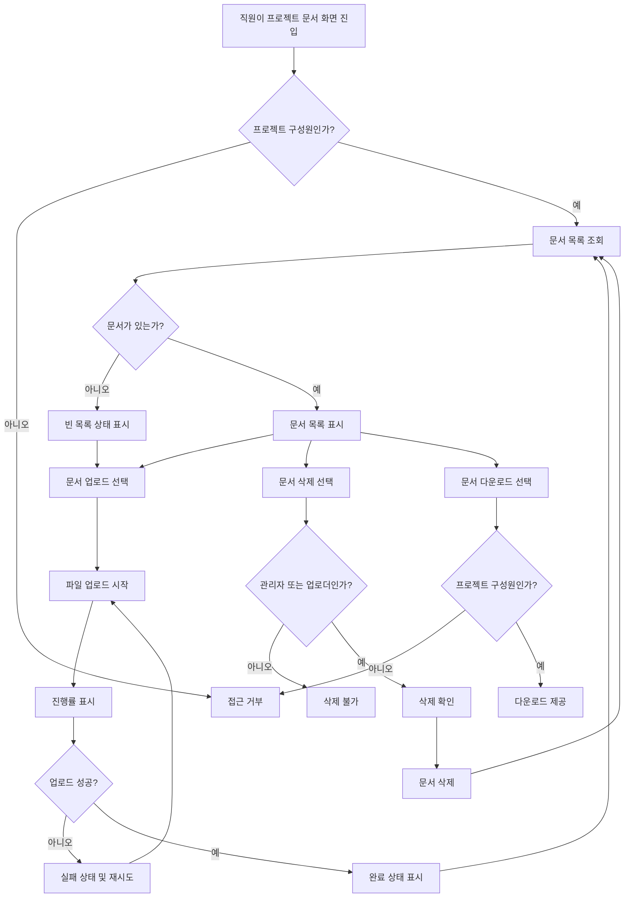

# 사내 프로젝트 문서 공유 PRD

## Applicability

| Contract | Required / N/A | Evidence |
|---|---:|---|
| 문제, 목표, 비목표 | Required | 기능 브리프에 1차 출시 범위와 제외 범위가 명시됨 |
| 역할 및 권한 | Required | 직원, 프로젝트 관리자, 일반 구성원 권한 차이가 명시됨 |
| 안정적 요구사항 ID | Required | 구현·검증 가능한 PRD 요청 |
| 화면/라우트 | Required | 업로드, 목록, 다운로드, 삭제가 사용자 화면에 노출됨 |
| 상태 매트릭스 | Required | 업로드 진행률, 빈 목록, 실패 후 재시도, 완료 상태 필요 |
| 사용자/시스템 플로우 | Required | 업로드·공유·삭제 생명주기가 있음 |
| 권한 및 데이터 경계 | Required | 프로젝트 구성원 공유, 관리자/작성자 삭제 권한 필요 |
| 수치형 NFR | Required | “문서 목록 2초 안에 보이는 것 목표”가 있으나 SLA 미정 |
| 인수 기준 | Required | 구현 가능 PRD 요청 |
| 리스크 및 열린 결정 | Required | SLA 미정, 4주 내부 베타 목표 |

## Context and Problem

사내 직원이 프로젝트별 문서를 한곳에 업로드하고, 같은 프로젝트 구성원만 문서를 확인·다운로드할 수 있는 내부 문서 공유 기능이 필요하다. 현재 1차 출시는 핵심 문서 흐름인 업로드, 목록 조회, 다운로드, 삭제에 집중하며 검색과 외부 공유는 제외한다.

## Goals

- 직원이 자신이 속한 프로젝트에 문서를 업로드할 수 있다.
- 같은 프로젝트 구성원은 해당 프로젝트 문서 목록을 보고 다운로드할 수 있다.
- 프로젝트 관리자는 프로젝트 구성원을 초대·제거할 수 있다.
- 프로젝트 관리자는 프로젝트 내 모든 문서를 삭제할 수 있다.
- 일반 구성원은 본인이 업로드한 문서만 삭제할 수 있다.
- 업로드 상태를 사용자가 명확히 알 수 있다: 진행률, 실패, 재시도, 완료.
- 빈 문서 목록 상태를 명확히 표시한다.
- 4주 내 내부 베타에서 핵심 흐름을 검증한다.

## Non-goals

- 문서 검색
- 외부 사용자 공유
- 공개 링크 공유
- 문서 공동 편집
- 문서 버전 관리
- 승인 워크플로우
- 고급 권한 그룹 또는 부서별 정책
- 정식 SLA 확정

## Users, Roles, and Permissions

| Role | Description | Permissions |
|---|---|---|
| 직원 | 사내 인증된 사용자 | 본인이 속한 프로젝트 접근 |
| 프로젝트 구성원 | 특정 프로젝트에 초대된 직원 | 프로젝트 문서 목록 조회, 다운로드, 문서 업로드, 본인 업로드 문서 삭제 |
| 프로젝트 관리자 | 특정 프로젝트의 관리자 | 구성원 초대·제거, 프로젝트 내 모든 문서 삭제, 목록 조회, 다운로드, 업로드 |
| 비구성원 | 프로젝트에 속하지 않은 직원 | 프로젝트 문서 접근 불가 |

## Functional Requirements

| ID | Requirement | Priority |
|---|---|---|
| FR-001 | 직원은 본인이 속한 프로젝트의 문서 목록을 조회할 수 있어야 한다. | P0 |
| FR-002 | 문서 목록에는 최소한 문서명, 업로드한 사용자, 업로드 일시, 파일 크기, 다운로드 액션, 삭제 가능 여부가 표시되어야 한다. | P0 |
| FR-003 | 프로젝트에 문서가 없을 때 빈 목록 상태를 표시해야 한다. | P0 |
| FR-004 | 프로젝트 구성원은 프로젝트에 문서를 업로드할 수 있어야 한다. | P0 |
| FR-005 | 업로드 중에는 진행률을 표시해야 한다. | P0 |
| FR-006 | 업로드 실패 시 실패 상태와 재시도 액션을 제공해야 한다. | P0 |
| FR-007 | 업로드 완료 시 완료 상태를 표시하고 문서 목록에 새 문서가 반영되어야 한다. | P0 |
| FR-008 | 프로젝트 구성원은 프로젝트 문서를 다운로드할 수 있어야 한다. | P0 |
| FR-009 | 프로젝트 관리자는 프로젝트 내 모든 문서를 삭제할 수 있어야 한다. | P0 |
| FR-010 | 일반 구성원은 본인이 업로드한 문서만 삭제할 수 있어야 한다. | P0 |
| FR-011 | 삭제 전 사용자에게 확인 절차를 제공해야 한다. | P1 |
| FR-012 | 삭제 완료 후 해당 문서는 목록에서 제거되어야 한다. | P0 |
| FR-013 | 삭제 실패 시 실패 상태를 표시하고 사용자가 다시 시도할 수 있어야 한다. | P1 |
| FR-014 | 프로젝트 관리자는 직원을 프로젝트 구성원으로 초대할 수 있어야 한다. | P0 |
| FR-015 | 프로젝트 관리자는 기존 구성원을 프로젝트에서 제거할 수 있어야 한다. | P0 |
| FR-016 | 프로젝트에서 제거된 사용자는 이후 해당 프로젝트 문서 목록, 다운로드, 업로드, 삭제에 접근할 수 없어야 한다. | P0 |
| FR-017 | 서버는 모든 문서 조회, 다운로드, 업로드, 삭제, 구성원 관리 요청에서 프로젝트 멤버십과 역할을 검증해야 한다. | P0 |
| FR-018 | 검색과 외부 공유 기능은 1차 출시에서 제공하지 않아야 한다. | P0 |

## Pages and Routes

| Page | Purpose | Primary Actions |
|---|---|---|
| 프로젝트 문서 목록 | 프로젝트별 문서 조회 | 업로드, 다운로드, 삭제 |
| 업로드 상태 영역 | 업로드 진행 상황 표시 | 취소는 열린 결정, 재시도 |
| 구성원 관리 | 프로젝트 관리자용 구성원 관리 | 초대, 제거 |
| 삭제 확인 모달 | 문서 삭제 전 확인 | 삭제 확정, 취소 |

라우트 예시는 구현팀이 제품 구조에 맞게 결정한다.

- `/projects/:projectId/documents`
- `/projects/:projectId/members`

## State Matrix

| Surface | Empty | Loading | Error | Success | Recovery |
|---|---|---|---|---|---|
| 문서 목록 | “아직 업로드된 문서가 없음” 표시 및 업로드 액션 제공 | 목록 스켈레톤 또는 로딩 표시 | 목록 조회 실패 메시지와 재시도 | 문서 목록 표시 | 재시도 버튼 |
| 업로드 | 업로드 전 파일 선택 가능 | 진행률 표시 | 실패 사유 요약 및 재시도 | 완료 상태 표시 후 목록 반영 | 같은 파일 재시도 또는 파일 재선택 |
| 다운로드 | N/A | 다운로드 시작 상태 표시 가능 | 다운로드 실패 메시지 | 파일 다운로드 시작 또는 완료 | 다시 다운로드 |
| 삭제 | N/A | 삭제 처리 중 표시 | 삭제 실패 메시지 | 목록에서 제거 | 다시 삭제 |
| 구성원 관리 | 구성원이 관리자만 있는 경우 빈 초대 상태 표시 | 구성원 목록 로딩 | 구성원 조회·변경 실패 | 구성원 목록 표시 | 재시도 |

## User or System Flow

## Authorization and Data Boundaries

- 모든 문서는 단일 프로젝트에 귀속된다.
- 프로젝트 문서는 해당 프로젝트 구성원만 조회·다운로드할 수 있다.
- 업로드는 해당 프로젝트 구성원만 가능하다.
- 삭제 권한은 서버에서 다음 조건으로 검증해야 한다.
  - 프로젝트 관리자: 프로젝트 내 모든 문서 삭제 가능
  - 일반 구성원: 본인이 업로드한 문서만 삭제 가능
- UI에서 삭제 버튼을 숨기더라도 서버 권한 검증은 반드시 수행해야 한다.
- 구성원 초대·제거는 프로젝트 관리자만 가능하다.
- 프로젝트에서 제거된 사용자는 제거 이후 해당 프로젝트 문서에 접근할 수 없다.
- 다운로드 URL 또는 파일 접근 방식이 있더라도 권한 우회가 불가능해야 한다.
- 외부 공유 URL은 1차 출시에서 생성하지 않는다.

## Non-functional Requirements

| ID | Requirement | Status |
|---|---|---|
| NFR-001 | 문서 목록은 사용자가 화면에 진입한 뒤 2초 안에 보이는 것을 목표로 한다. | 목표, SLA 미정 |
| NFR-002 | 실제 목록 조회 SLA는 제품 책임자가 결정해야 한다. | 열린 결정 |
| NFR-003 | 업로드 진행률은 사용자가 업로드가 멈췄는지 진행 중인지 판단할 수 있을 정도로 갱신되어야 한다. | Required |
| NFR-004 | 권한 없는 접근은 문서 메타데이터와 파일 내용을 노출하지 않아야 한다. | Required |
| NFR-005 | 내부 베타 대상 기능은 4주 내 검증 가능한 상태여야 한다. | Required |

## Acceptance Criteria

| ID | Requirement | Given | When | Then | Verification |
|---|---|---|---|---|---|
| AC-001 | FR-001 | 프로젝트 구성원인 직원이 있다 | 문서 화면에 진입한다 | 해당 프로젝트 문서 목록을 볼 수 있다 | UI/API 테스트 |
| AC-002 | FR-003 | 프로젝트에 문서가 없다 | 문서 목록을 조회한다 | 빈 목록 상태와 업로드 액션이 표시된다 | UI 테스트 |
| AC-003 | FR-004 | 프로젝트 구성원인 직원이 있다 | 유효한 파일을 업로드한다 | 업로드가 시작된다 | UI/API 테스트 |
| AC-004 | FR-005 | 업로드가 진행 중이다 | 업로드 화면을 본다 | 진행률이 표시된다 | UI 테스트 |
| AC-005 | FR-006 | 업로드가 실패한다 | 실패 상태가 표시된다 | 사용자는 재시도할 수 있다 | UI/API 실패 케이스 테스트 |
| AC-006 | FR-007 | 업로드가 성공한다 | 완료 상태가 표시된다 | 새 문서가 목록에 반영된다 | 통합 테스트 |
| AC-007 | FR-008 | 프로젝트 구성원인 직원이 문서를 선택한다 | 다운로드를 실행한다 | 파일을 다운로드할 수 있다 | API/E2E 테스트 |
| AC-008 | FR-009 | 프로젝트 관리자가 문서를 선택한다 | 삭제를 확정한다 | 문서가 삭제되고 목록에서 사라진다 | 권한/API 테스트 |
| AC-009 | FR-010 | 일반 구성원이 타인이 올린 문서를 본다 | 삭제를 시도한다 | 삭제할 수 없다 | 권한/API 테스트 |
| AC-010 | FR-010 | 일반 구성원이 본인이 올린 문서를 선택한다 | 삭제를 확정한다 | 문서가 삭제된다 | 권한/API 테스트 |
| AC-011 | FR-014 | 프로젝트 관리자가 직원을 초대한다 | 초대가 완료된다 | 해당 직원은 프로젝트 문서에 접근할 수 있다 | 통합 테스트 |
| AC-012 | FR-015, FR-016 | 프로젝트 관리자가 구성원을 제거한다 | 제거가 완료된다 | 제거된 사용자는 문서 목록·다운로드·업로드에 접근할 수 없다 | 권한/API 테스트 |
| AC-013 | FR-017 | 비구성원이 프로젝트 문서 API를 호출한다 | 조회·다운로드·업로드·삭제를 시도한다 | 요청이 거부되고 문서 정보가 노출되지 않는다 | 보안 테스트 |
| AC-014 | FR-018 | 사용자가 1차 출시 화면을 사용한다 | 문서 기능을 탐색한다 | 검색과 외부 공유 기능은 제공되지 않는다 | QA 확인 |
| AC-015 | NFR-001 | 정상적인 내부 베타 환경이다 | 문서 목록 화면에 진입한다 | 목록 표시 시간이 측정된다 | 성능 측정, SLA 판정은 보류 |

## Assumptions and Open Decisions

### 합리적 가정

- 사용자는 이미 사내 인증 시스템으로 로그인되어 있다.
- 프로젝트와 프로젝트 관리자 개념은 기존 시스템에 존재하거나 베타 범위에서 최소 구현된다.
- 한 문서는 하나의 프로젝트에만 속한다.
- “공유”는 같은 프로젝트 구성원이 목록에서 조회하고 다운로드할 수 있음을 의미한다.
- 문서 삭제는 1차 출시에서 사용자 관점의 삭제이며, 물리 삭제·소프트 삭제·보관 정책은 구현팀이 정책에 맞게 결정한다.
- 업로드 가능한 파일 형식과 크기 제한은 내부 베타 전 최소 정책으로 정한다.

### 열린 결정

| ID | Decision | Owner | Needed By |
|---|---|---|---|
| OD-001 | 문서 목록 조회의 실제 SLA 확정 | 제품 책임자 | 베타 성능 기준 확정 전 |
| OD-002 | 업로드 파일 최대 크기 | 제품/엔지니어링 | 업로드 구현 전 |
| OD-003 | 허용/차단 파일 형식 | 보안/제품 | 업로드 구현 전 |
| OD-004 | 삭제 방식: 소프트 삭제, 휴지통, 즉시 삭제 | 제품/엔지니어링 | 삭제 구현 전 |
| OD-005 | 업로드 중 취소 기능 포함 여부 | 제품 | UI 상세 설계 전 |
| OD-006 | 프로젝트 초대 방식: 즉시 추가, 초대 수락 필요, 이메일 알림 여부 | 제품 | 구성원 관리 구현 전 |
| OD-007 | 제거된 구성원이 과거에 다운로드한 파일에 대한 통제 범위 | 보안/제품 | 보안 검토 전 |
| OD-008 | 내부 베타 대상 사용자 수와 문서 규모 | 제품 책임자 | 성능 검증 계획 전 |

## Risks and Mitigations

| Risk | Impact | Mitigation |
|---|---|---|
| SLA가 확정되지 않아 성능 합격 기준이 모호함 | 베타 판정 기준 불명확 | 2초 목표는 측정 지표로 두고, 제품 책임자가 SLA를 확정하기 전까지 합격/불합격 기준으로 사용하지 않음 |
| 권한 검증을 UI에만 의존할 가능성 | 문서 유출 위험 | 모든 API에서 서버 권한 검증을 P0로 명시 |
| 파일 크기·형식 정책 미정 | 업로드 실패, 보안 리스크 | 베타 전 OD-002, OD-003 결정 필요 |
| 4주 일정 대비 구성원 관리까지 포함되어 범위가 커질 수 있음 | 베타 지연 | 1차 출시는 업로드, 목록, 다운로드, 삭제, 최소 구성원 관리에 집중 |
| 삭제 정책 미정 | 감사·복구 요구와 충돌 가능 | 베타 전 삭제 방식 결정 또는 소프트 삭제 기본값 채택 검토 |

## Delivery

| Phase | Requirement IDs | Verifiable Exit Condition |
|---|---|---|
| Week 1: 권한·데이터 모델 확정 | FR-001, FR-014, FR-015, FR-016, FR-017, OD-002, OD-003, OD-004 | 프로젝트 멤버십, 관리자 권한, 문서 소유자 기준이 API 수준에서 정의됨 |
| Week 2: 문서 목록·업로드 | FR-001, FR-002, FR-003, FR-004, FR-005, FR-006, FR-007 | 구성원이 문서 목록을 보고 업로드 상태 전환을 확인할 수 있음 |
| Week 3: 다운로드·삭제·구성원 관리 | FR-008, FR-009, FR-010, FR-011, FR-012, FR-013, FR-014, FR-015 | 역할별 다운로드·삭제·초대·제거 테스트가 통과함 |
| Week 4: 내부 베타 안정화 | FR-016, FR-017, FR-018, NFR-001 | 핵심 E2E, 권한 테스트, 목록 표시 시간 측정이 완료되고 검색/외부 공유가 노출되지 않음 |

검증 참고: 요청에 따라 파일을 만들지 않았으므로 PRD 파일 검증 스크립트는 실행하지 않았다.