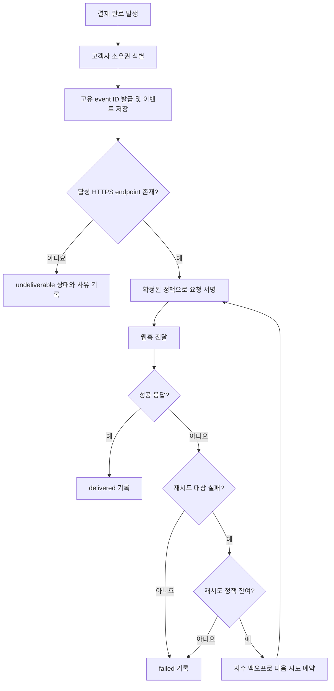

# 결제 완료 웹훅 전달 API PRD

## 1. 문서 개요

- 기능명: 결제 완료 웹훅 전달 API
- 대상 릴리스: 1차 출시
- 문서 상태: 초안
- 범위: 백엔드 이벤트 생성 및 고객사 HTTPS endpoint 전달
- UI 범위: 없음

## 2. 적용성

| 계약 항목 | 적용 여부 | 근거 |
|---|---|---|
| 문제·목표·비목표 | Required | 신규 웹훅 전달 기능의 범위와 성공 조건 정의 필요 |
| 사용자·역할·권한 | Required | 고객사별 endpoint와 결제 데이터 격리가 필요 |
| 기능 요구사항 | Required | 이벤트 생성, 전달, 재시도 및 중복 처리 계약 필요 |
| 페이지·라우트 | N/A | 이번 범위에 UI가 없음 |
| 사용자 화면 상태 | N/A | 사용자에게 노출되는 화면이 없음 |
| 시스템 흐름 | Required | 결제 완료부터 전달 종료까지 다단계 비동기 흐름이 존재 |
| 권한·데이터 경계 | Required | 고객사별 데이터 격리가 명시 요구사항 |
| 수치형 SLA | N/A | 처리량과 지연 기준이 측정되지 않아 목표 수치를 정할 근거가 없음 |
| 수용 기준 | Required | 최소 1회 전달과 재시도를 관찰 가능한 조건으로 검증해야 함 |
| 위험·열린 결정 | Required | 서명, secret rotation, 재시도 세부 정책 등이 미결정 |

## 3. 배경과 문제

결제가 완료되면 해당 결제를 소유한 고객사의 시스템에 완료 사실을 전달해야 한다. 고객사는 사전에 기존 내부 API를 통해 HTTPS endpoint를 등록한다.

외부 네트워크와 고객사 endpoint는 일시적으로 실패하거나, 요청 처리에 성공한 뒤 응답만 유실될 수 있다. 따라서 전달 시스템은 이벤트를 유실하지 않도록 최소 1회(at-least-once) 전달을 보장해야 한다.

최소 1회 전달에서는 동일 이벤트가 여러 번 전달될 수 있으므로 고객사가 중복을 식별할 수 있는 안정적인 event ID가 필요하다.

## 4. 목표

- 결제 완료 이벤트를 해당 고객사의 등록된 HTTPS endpoint로 전달한다.
- 일시적인 전달 실패에 지수 백오프 재시도를 적용한다.
- 동일 논리 이벤트의 모든 전달 시도에서 동일한 event ID를 제공한다.
- 장애나 프로세스 재시작이 발생해도 전달 대상 이벤트가 유실되지 않게 한다.
- 고객사 간 endpoint, 이벤트, 결제 데이터 및 전달 기록을 격리한다.
- 운영자가 전달 상태와 실패 원인을 확인할 수 있는 최소한의 로그와 지표를 제공한다.
- 서명 및 secret rotation 정책이 결정될 수 있도록 전달 보안 계약의 확장 지점을 둔다.

## 5. 비목표

다음 항목은 1차 출시 범위에서 제외한다.

- endpoint 등록·수정·삭제 UI
- endpoint 등록용 신규 외부 API
- 웹훅 replay 대시보드
- 운영자 또는 고객사의 수동 재전송
- 정확히 한 번(exactly-once) 전달 보장
- 고객사 endpoint 내부에서의 중복 제거
- 이벤트 간 전달 순서 보장
- 근거가 확보되지 않은 처리량, 가용성 또는 전달 지연 SLA
- 결제 완료 외 다른 이벤트 유형의 전달

비목표인 수동 재전송과 별개로, 시스템이 재시도 정책에 따라 자동 재전송하는 것은 핵심 범위에 포함된다.

## 6. 사용자, 시스템 역할 및 권한

| 역할 | 책임 및 권한 |
|---|---|
| 결제 시스템 | 결제 완료 사실과 해당 결제의 고객사 소유 정보를 제공 |
| 웹훅 전달 시스템 | 이벤트 생성·보존·전달·자동 재시도·상태 기록 |
| 기존 내부 endpoint 관리 API | 고객사별 endpoint 및 활성 상태를 관리 |
| 고객사 수신 서버 | 웹훅 수신, event ID 기반 중복 제거, 성공 여부 응답 |
| 내부 운영자 | 로그와 지표를 통해 상태를 관찰. 1차 출시에서는 수동 재전송 불가 |
| 보안 담당자 | 서명 검증 방식과 secret rotation 정책 결정 |

내부 운영 기능을 포함한 모든 조회 및 처리는 서버 측 고객사 권한 검증을 거쳐야 한다. 클라이언트 입력만으로 고객사 소유권을 결정해서는 안 된다.

## 7. 이벤트 계약

### 7.1 최소 이벤트 envelope

정확한 payload schema는 열린 결정이지만, 다음 필드는 필수다.

| 필드 | 설명 |
|---|---|
| `event_id` | 논리적인 결제 완료 이벤트의 전역 고유 식별자 |
| `event_type` | 결제 완료 이벤트 유형을 나타내는 고정 식별자 |
| `occurred_at` | 결제 완료가 발생한 시각 |
| `schema_version` | payload 계약 버전 |
| `data` | 고객사에 전달할 결제 완료 데이터 |

요청 헤더에는 최소한 event ID와 서명 정책에서 결정되는 서명 관련 값을 전달할 수 있어야 한다. 구체적인 헤더 이름은 payload 및 서명 계약 결정 시 확정한다.

### 7.2 event ID 규칙

- 동일 결제 완료 사실에 대해 생성된 동일 논리 이벤트는 모든 재시도에서 같은 `event_id`를 사용한다.
- 새로운 전달 시도마다 event ID를 다시 생성하지 않는다.
- 서로 다른 논리 이벤트가 같은 event ID를 가져서는 안 된다.
- 고객사는 `event_id`를 멱등성 키로 사용할 수 있다.
- event ID 형식과 길이는 API 계약 확정 시 문서화한다.
- 결제 시스템에서 같은 완료 신호가 중복 유입되는 경우 하나의 논리 이벤트로 합칠 기준은 열린 결정으로 둔다.

## 8. 기능 요구사항

| ID | 요구사항 | 우선순위 |
|---|---|---|
| FR-01 | 시스템은 결제가 완료되면 해당 결제의 고객사를 식별하고 결제 완료 이벤트를 생성해야 한다. | P0 |
| FR-02 | 이벤트는 외부 전달을 시도하기 전에 복구 가능한 저장소에 기록되어야 한다. | P0 |
| FR-03 | 이벤트 생성은 동일한 결제 완료 입력의 중복 처리 정책을 적용해야 한다. 구체적인 중복 판별 키는 출시 전 확정한다. | P0 |
| FR-04 | 시스템은 이벤트 소유 고객사의 현재 활성 HTTPS endpoint를 기존 내부 관리 체계에서 조회해야 한다. | P0 |
| FR-05 | 시스템은 해당 고객사의 endpoint에만 이벤트를 전달해야 한다. | P0 |
| FR-06 | 모든 전달 시도는 동일 논리 이벤트에 대해 동일한 event ID와 payload 의미를 유지해야 한다. | P0 |
| FR-07 | endpoint가 성공 응답을 반환하면 해당 이벤트 전달을 성공 상태로 기록하고 자동 재시도를 종료해야 한다. | P0 |
| FR-08 | 재시도 대상 실패가 발생하면 구성된 지수 백오프 정책에 따라 자동으로 다시 전달해야 한다. | P0 |
| FR-09 | 재시도 횟수 또는 재시도 보존 기간이 소진되면 이벤트를 최종 실패 상태로 기록하고 자동 재시도를 종료해야 한다. | P0 |
| FR-10 | 프로세스 재시작이나 일시적 내부 장애 이후에도 대기 중인 이벤트와 예정된 재시도를 복구할 수 있어야 한다. | P0 |
| FR-11 | endpoint가 없거나 비활성 상태인 경우 외부 요청을 보내지 않고 명시적인 미전달 상태와 사유를 기록해야 한다. | P0 |
| FR-12 | 각 전달 시도에 대해 event ID, 고객사 식별자, 시도 번호, 시각, 결과 분류, 응답 상태 코드 또는 실패 유형을 기록해야 한다. | P0 |
| FR-13 | 로그, 지표 및 오류 메시지에 secret, 서명 키 또는 불필요한 결제 민감정보를 기록해서는 안 된다. | P0 |
| FR-14 | 시스템은 확정된 서명 정책에 따라 요청을 서명하고 고객사가 검증에 필요한 정보를 전달해야 한다. 정책 확정 전에는 운영 출시할 수 없다. | P0 |
| FR-15 | secret rotation 중 허용되는 구·신 secret, 적용 시점 및 폐기 규칙을 확정된 보안 정책에 따라 처리해야 한다. | P0 |
| FR-16 | 1차 출시에서는 자동 정책 외의 수동 재전송 진입점을 제공하지 않아야 한다. | P1 |
| FR-17 | endpoint 변경이 대기·재시도 중 이벤트에 적용되는 방식을 일관된 정책으로 처리하고 기록해야 한다. 해당 정책은 출시 전 확정한다. | P0 |

## 9. 전달 및 재시도 상태

| 상태 | 의미 | 가능한 다음 상태 |
|---|---|---|
| `pending` | 이벤트가 저장되었으나 아직 전달되지 않음 | `delivering`, `undeliverable` |
| `delivering` | 고객사 endpoint로 전달 시도 중 | `delivered`, `retry_scheduled`, `failed` |
| `retry_scheduled` | 재시도 대상 실패 후 다음 시각을 기다림 | `delivering`, `failed` |
| `delivered` | 성공 응답을 받아 전달 완료 | 종료 |
| `failed` | 자동 재시도 정책이 소진되었거나 재시도하지 않는 오류 발생 | 종료 |
| `undeliverable` | 활성 endpoint 부재 등으로 외부 전달을 시작할 수 없음 | 종료 또는 향후 별도 정책 |

`failed`와 `undeliverable` 이벤트를 1차 출시에서 수동 재전송하는 기능은 제공하지 않는다.

## 10. 시스템 흐름

성공 응답을 고객사가 처리했지만 응답이 시스템에 도착하지 않은 경우 재시도가 발생할 수 있다. 이는 최소 1회 전달 방식에서 허용되는 동작이다.

## 11. 재시도 정책

### 11.1 합리적 기본 가정

출시 전 별도 결정이 없다면 다음 분류를 기본안으로 사용한다.

- HTTP `2xx`: 성공
- DNS, 연결, TLS, 요청 시간 초과 등 네트워크 오류: 재시도
- HTTP `408`, `429`: 재시도
- HTTP `5xx`: 재시도
- 그 밖의 HTTP `4xx`: 재시도하지 않는 최종 실패
- redirect 응답: 자동 추적하지 않는 것을 기본안으로 하되 보안 검토 후 확정
- 모든 재시도에 지수 백오프를 적용
- 다수 이벤트의 동시 재시도로 부하가 집중되지 않도록 jitter 적용
- 이벤트 간 순서 보장 없음

### 11.2 출시 전 구성해야 할 값

근거 없이 고정값을 만들지 않으며 다음 값은 설정 가능한 정책으로 구현한다.

- 최초 재시도 지연
- 백오프 배수
- 최대 재시도 간격
- 최대 시도 횟수 또는 최대 재시도 기간
- 요청 연결 및 응답 제한 시간
- jitter 방식과 범위
- HTTP `Retry-After` 존중 여부 및 상한
- 최종 실패 이벤트와 전달 기록의 보존 기간

정책값은 부하·장애 시험과 운영 관측 결과를 근거로 담당자가 승인해야 한다.

## 12. 권한 및 데이터 경계

- 모든 이벤트와 전달 시도는 하나의 고객사 소유권에 귀속되어야 한다.
- 이벤트에 연결된 endpoint는 동일 고객사 소유인 경우에만 사용할 수 있다.
- 고객사 식별자를 외부 요청이나 endpoint 입력에서 신뢰하지 않고, 결제 및 내부 endpoint 등록 데이터의 서버 측 관계로 검증한다.
- 한 고객사의 이벤트, payload, endpoint, secret 및 전달 기록을 다른 고객사의 요청 처리에 사용해서는 안 된다.
- 조회 쿼리, 작업 큐 소비 및 재시도 처리에도 고객사 경계를 적용해야 한다.
- secret은 고객사별로 분리하고 승인된 비밀 저장 방식으로 보관해야 한다.
- 로그와 지표에서는 고객사 구분이 가능해야 하지만 secret 및 불필요한 결제 데이터는 노출하지 않는다.
- endpoint 호출은 HTTPS만 허용한다.
- 기존 endpoint 등록 API가 목적지 안전성 검증을 담당하는지 확인해야 한다. 담당하지 않는다면 내부망·메타데이터 주소 접근 등 SSRF 위험을 막는 검증 및 송신 제어가 출시 조건이다.
- redirect를 허용하는 경우에도 최종 목적지에 동일한 안전성 검증을 적용해야 한다.

## 13. 비기능 요구사항

### 13.1 신뢰성

- 전달 의미는 최소 1회다.
- 성공 응답을 확인하기 전까지 이벤트를 전달 완료로 처리하지 않는다.
- 이벤트 저장과 재시도 상태는 프로세스 재시작 후 복구 가능해야 한다.
- exactly-once 또는 중복 없는 전달을 주장해서는 안 된다.

### 13.2 보안

- TLS 인증서 검증을 비활성화해서는 안 된다.
- 웹훅 요청은 출시 전에 확정된 방식으로 서명되어야 한다.
- secret은 평문 로그나 오류 응답에 노출되어서는 안 된다.
- secret rotation은 고객사별로 격리되어야 한다.
- payload에는 고객사에 필요한 최소 데이터만 포함한다.
- 서명 정책, 허용 알고리즘, 재전송 공격 방어 방식은 보안 승인을 받아야 한다.

### 13.3 관측성

수치 목표는 정하지 않되 다음 항목을 측정할 수 있어야 한다.

- 생성된 이벤트 수
- 전달 시도 수
- 첫 시도 성공률
- 최종 전달 성공률
- 실패 유형 및 HTTP 상태별 건수
- 재시도 횟수 분포
- 결제 완료부터 첫 전달 시도까지의 지연
- 결제 완료부터 성공 전달까지의 지연
- `pending`, `retry_scheduled`, `failed`, `undeliverable` 이벤트 수와 체류 시간
- 고객사별 이상 징후를 조사할 수 있는 구분 정보

고객사 식별자는 지표 시스템의 cardinality와 개인정보 정책을 고려해 원문 대신 내부적으로 안전한 식별 방식을 사용할 수 있다.

### 13.4 성능 및 SLA

처리량과 지연 SLA는 이번 PRD에서 수치로 규정하지 않는다.

- 1차 출시 전 예상 트래픽과 버스트 특성을 조사한다.
- 스테이징 또는 부하 시험으로 처리량과 지연의 기준선을 측정한다.
- 출시 후 실제 지표를 관찰한다.
- 제품 책임자와 운영 책임자가 측정 결과를 검토한 후 SLA/SLO 도입 여부와 목표값을 결정한다.

## 14. 수용 기준

| ID | 연결 요구사항 | Given | When | Then | 검증 방법 |
|---|---|---|---|---|---|
| AC-01 | FR-01, FR-02 | 결제 완료 입력과 고객사 정보가 유효함 | 완료 처리가 발생함 | 고객사에 귀속된 이벤트가 고유 event ID와 함께 전달 시도 전에 저장됨 | 통합 테스트 |
| AC-02 | FR-03 | 동일한 완료 입력이 중복 유입됨 | 이벤트 생성 로직이 반복 실행됨 | 확정된 중복 판별 정책에 따라 하나의 논리 이벤트로 처리됨 | 통합 테스트 |
| AC-03 | FR-04, FR-05 | 서로 다른 두 고객사가 각각 endpoint를 보유함 | 한 고객사의 결제가 완료됨 | 해당 고객사의 endpoint만 호출되고 다른 고객사의 endpoint는 호출되지 않음 | 격리 통합 테스트 |
| AC-04 | FR-06 | 동일 이벤트의 첫 전달이 실패함 | 자동 재시도가 실행됨 | 최초 요청과 재시도 요청의 event ID 및 payload 의미가 동일함 | 계약 테스트 |
| AC-05 | FR-07 | 고객사 endpoint가 성공으로 분류되는 응답을 반환함 | 요청 결과가 처리됨 | 상태가 `delivered`로 기록되고 추가 자동 재시도가 없음 | 통합 테스트 |
| AC-06 | FR-08 | endpoint가 네트워크 오류 또는 재시도 대상 응답을 반환함 | 전달이 실패함 | 설정된 지수 백오프와 jitter 정책에 따라 다음 시도가 예약됨 | 시간 제어 통합 테스트 |
| AC-07 | FR-09 | 재시도 정책의 마지막 허용 시도에 도달함 | 해당 시도도 실패함 | 상태가 `failed`가 되고 추가 시도가 예약되지 않음 | 통합 테스트 |
| AC-08 | FR-10 | 이벤트가 `pending` 또는 `retry_scheduled` 상태임 | 전달 프로세스가 종료 후 재시작됨 | 이벤트가 유실되지 않고 적절한 시점에 전달 처리를 재개함 | 장애 복구 테스트 |
| AC-09 | FR-11 | 고객사에 활성 endpoint가 없음 | 결제가 완료됨 | 외부 호출 없이 `undeliverable` 상태와 사유가 기록됨 | 통합 테스트 |
| AC-10 | FR-12, FR-13 | 웹훅 전달이 성공하거나 실패함 | 전달 기록과 로그를 확인함 | 시도 번호와 결과는 추적 가능하고 secret 및 금지된 민감정보는 없음 | 로그 검사 |
| AC-11 | FR-14 | 서명 정책과 고객사 secret이 설정됨 | 웹훅을 전달함 | 고객사가 확정된 방식으로 요청의 출처와 무결성을 검증할 수 있음 | 보안 계약 테스트 |
| AC-12 | FR-15 | secret rotation이 진행 중임 | 구·신 secret 적용 경계에서 요청을 전달함 | 확정된 rotation 정책에 맞게 검증 가능하며 다른 고객사의 secret은 사용되지 않음 | 보안 통합 테스트 |
| AC-13 | FR-16 | 이벤트가 최종 실패함 | 외부 또는 운영 API 목록을 검사함 | 1차 범위에 수동 재전송 endpoint나 UI가 존재하지 않음 | API 및 기능 검사 |
| AC-14 | FR-17 | 이벤트가 재시도 대기 중이고 endpoint가 변경됨 | 다음 시도가 실행됨 | 확정된 endpoint 변경 정책에 따라 일관된 목적지가 사용되고 기록됨 | 통합 테스트 |
| AC-15 | FR-05, FR-13 | 공격자가 다른 고객사의 식별자나 event ID를 입력함 | 내부 조회 또는 전달을 유도함 | 다른 고객사의 endpoint, payload, secret 또는 전달 기록에 접근하지 못함 | 권한·침투 테스트 |
| AC-16 | FR-04 | endpoint가 HTTP이거나 허용되지 않은 목적지를 가리킴 | 전달을 시도함 | 요청이 차단되고 안전한 실패 사유가 기록됨 | 보안 테스트 |

## 15. 합리적 가정

다음은 진행을 위해 채택할 수 있지만 새로운 증거에 따라 변경 가능한 가정이다.

- 기존 내부 API가 고객사별 endpoint와 활성 상태를 신뢰 가능한 형태로 제공한다.
- 결제 완료 입력에서 고객사 소유권을 서버 측 데이터로 판별할 수 있다.
- HTTP `2xx`를 성공으로 본다.
- 네트워크 오류, `408`, `429`, `5xx`는 재시도하고 기타 `4xx`는 최종 실패로 본다.
- 전달 순서는 보장하지 않는다.
- 고객사가 event ID를 저장하고 중복 이벤트를 안전하게 처리할 책임을 가진다.
- payload는 재시도 중 의미적으로 변경되지 않는다.
- 백오프 상세 값은 코드 상수가 아니라 배포 환경별 정책으로 구성할 수 있다.
- endpoint가 변경된 경우 다음 시도부터 최신 활성 endpoint를 사용하는 것을 기본안으로 한다. 감사 추적을 위해 실제 호출 URL의 안전한 표현을 시도 기록에 남긴다.
- 자동 redirect는 기본적으로 허용하지 않는다.

## 16. 열린 결정

### 16.1 출시 차단 결정

| ID | 결정 사항 | 결정 책임자 | 필요한 시점 |
|---|---|---|---|
| OD-01 | 서명 알고리즘, canonicalization, 헤더 형식, timestamp 및 재전송 공격 방어 방식 | 보안 담당자 | 구현 확정 전 |
| OD-02 | secret 생성·저장·배포 방식과 rotation 주기, 중첩 기간, 폐기 절차 | 보안 담당자 | 구현 확정 전 |
| OD-03 | payload 필드, 데이터 최소화 기준, `schema_version` 정책 | 제품·결제·보안 담당자 | API 계약 확정 전 |
| OD-04 | 결제 완료의 권위 있는 발생 조건과 중복 입력 판별 키 | 결제 도메인 담당자 | 이벤트 생성 구현 전 |
| OD-05 | endpoint 등록 API가 수행하는 HTTPS, 도메인, IP 및 SSRF 검증 범위 | 내부 API·보안 담당자 | 보안 검토 전 |
| OD-06 | 재시도 횟수·기간, 백오프 파라미터, timeout 및 jitter 값 | 플랫폼·운영 담당자 | 운영 배포 전 |
| OD-07 | endpoint 변경 시 대기 이벤트가 최신 endpoint 또는 이벤트 생성 당시 endpoint 중 어느 것을 사용할지 | 제품·플랫폼 담당자 | 계약 테스트 작성 전 |
| OD-08 | 최종 실패 이벤트, payload 및 전달 시도 기록의 보존 기간 | 제품·보안·운영 담당자 | 운영 배포 전 |

### 16.2 측정 후 결정

| ID | 결정 사항 | 결정 책임자 | 결정 시점 |
|---|---|---|---|
| OD-09 | 처리량 목표와 허용 버스트 | 제품·플랫폼 담당자 | 트래픽 조사 및 부하 시험 후 |
| OD-10 | 첫 전달 및 최종 전달 지연 SLO/SLA | 제품·운영 담당자 | 기준선 측정 후 |
| OD-11 | `Retry-After` 존중 방식과 최대 대기 상한 | 플랫폼 담당자 | 고객사 응답 패턴 측정 후 |
| OD-12 | replay 대시보드 또는 수동 재전송의 후속 출시 여부 | 제품 담당자 | 1차 출시 운영 데이터 검토 후 |

## 17. 위험과 완화책

| 위험 | 영향 | 완화 |
|---|---|---|
| 중복 전달 | 고객사가 결제를 중복 처리할 수 있음 | 안정적인 event ID 제공, 고객사에 멱등 처리 계약 명시 |
| 이벤트 저장과 결제 처리 사이의 불일치 | 완료된 결제 이벤트가 누락되거나 잘못 생성될 수 있음 | 복구 가능한 생성 방식과 중복 판별 키 확정, 장애 복구 테스트 |
| 고객사 간 데이터 혼합 | 심각한 정보 유출 | 서버 측 소유권 검증, 고객사별 endpoint·secret 격리, 격리 테스트 |
| 미확정 서명 정책 | 위조 또는 변조 요청 위험 | OD-01과 OD-02를 출시 차단 조건으로 관리 |
| 악성 endpoint | 내부망 접근 또는 데이터 유출 | HTTPS 강제, SSRF 방어, redirect 정책, 송신 네트워크 제한 |
| 과도한 재시도 | 내부 시스템과 고객사 endpoint 부하 증가 | 지수 백오프, jitter, 상한, 최종 실패 정책 |
| 영구 실패의 무한 적체 | 저장 공간 및 운영 부담 증가 | 최대 재시도 범위와 보존 기간 확정, backlog 지표와 경보 |
| 수동 재전송 부재 | 최종 실패 후 즉시 복구하기 어려움 | 실패 원인과 event ID를 관측 가능하게 하고 후속 기능을 운영 데이터로 판단 |
| 근거 없는 SLA 설정 | 달성 불가능한 약속 또는 과잉 설계 | 기준선 측정 전 수치 목표를 두지 않고 지표부터 수집 |

## 18. 출시 계획

| 단계 | 포함 요구사항 | 검증 가능한 종료 조건 |
|---|---|---|
| 1. 계약 확정 | FR-01~FR-17 | OD-01~OD-08이 승인되고 payload·서명·재시도 계약 테스트가 작성 가능함 |
| 2. 핵심 전달 구현 | FR-01~FR-09, FR-11 | 이벤트 생성, 저장, 고객사 endpoint 전달, 성공·실패 및 자동 재시도 테스트 통과 |
| 3. 복구·격리·보안 구현 | FR-10, FR-13~FR-15, FR-17 | 재시작 복구, 고객사 격리, 서명, rotation 및 endpoint 안전성 테스트 통과 |
| 4. 관측성 및 범위 검증 | FR-12, FR-16 | 필수 지표·로그 확인, 민감정보 미노출 확인, 수동 재전송 기능 부재 확인 |
| 5. 출시 준비 | 전체 | AC-01~AC-16 통과, 부하 시험 기준선 기록, 운영 담당자와 보안 담당자 승인 |

## 19. 출시 판정 조건

다음 조건이 모두 충족되어야 1차 출시가 가능하다.

- 서명 검증 방식과 secret rotation 정책이 확정되고 검증됨
- payload 및 결제 완료 판별 계약이 확정됨
- 재시도와 최종 실패 정책값이 승인됨
- 최소 1회 전달, 중복 event ID 유지 및 장애 복구 테스트 통과
- 고객사 간 endpoint·payload·secret 격리 테스트 통과
- HTTPS 및 SSRF 방어 검증 통과
- 필수 로그와 지표가 수집되며 secret과 금지된 민감정보가 노출되지 않음
- 처리량과 지연의 측정 기준선이 기록됨
- 수동 재전송 및 replay 대시보드가 출시 범위에 포함되지 않았음