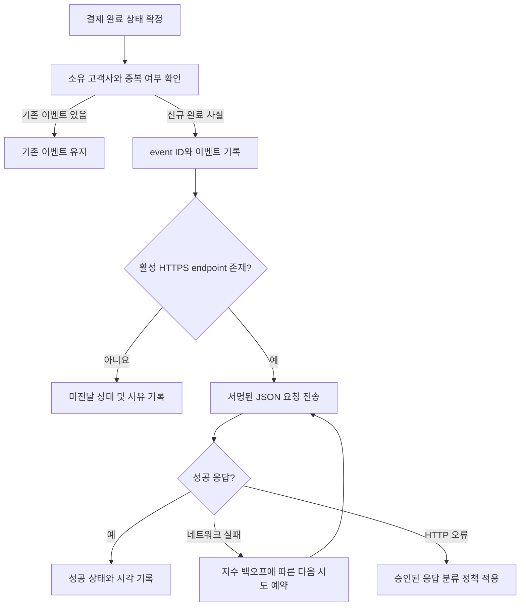

# 결제 완료 웹훅 전달 API PRD

## 1. 문서 정보

- 기능명: 결제 완료 웹훅 전달 API
- 문서 상태: Draft
- 대상 릴리스: 1차 출시
- 범위: 서버 간 웹훅 전달
- UI 범위: 없음

## 2. 적용성

| 계약 항목 | 적용 여부 | 근거 |
|---|---|---|
| 문제·목표·비목표 | Required | 신규 외부 이벤트 전달 기능 |
| 사용자·역할 | Required | 고객사, 내부 결제 시스템, 운영자 역할 구분 필요 |
| 기능 요구사항 | Required | 전달·재시도·중복·격리 동작 정의 필요 |
| 페이지·라우트 | N/A | 이번 범위에 사용자 UI가 없음 |
| 화면 상태 매트릭스 | N/A | 사용자에게 노출되는 화면이 없음 |
| 시스템 흐름 | Required | 결제 완료부터 전달 성공 또는 재시도까지 다단계 처리 |
| 권한·데이터 경계 | Required | 고객사별 데이터 격리가 명시적 요구사항 |
| 수치형 성능 목표 | N/A | 처리량과 지연 기준이 측정되지 않아 목표 수치 설정 불가 |
| 수용 기준 | Required | 구현 및 테스트 가능한 완료 조건 필요 |
| 단계별 출시 조건 | Required | 서명 방식 등 출시 전 결정이 필요한 항목 존재 |

## 3. 배경과 문제

고객사는 결제 완료 사실을 자사 시스템에 반영하기 위해 결제 상태를 반복 조회하지 않고 비동기 이벤트를 받아야 한다.

결제 시스템은 결제가 완료되면 해당 고객사에 등록된 HTTPS endpoint로 웹훅을 전달해야 한다. 네트워크 오류와 프로세스 장애가 발생하더라도 전달 시도가 유실되지 않아야 하지만, 최소 1회 전달 특성상 고객사가 같은 이벤트를 중복 수신할 수 있다.

현재 다음 사항은 확정되지 않았다.

- 웹훅 서명 및 검증 방식
- 서명 secret 발급·보관·교체 방식과 rotation 주기
- 재시도 횟수, 보존 기간 및 정확한 백오프 파라미터
- 처리량과 전달 지연 SLA

확정되지 않은 수치나 보안 방식을 본 PRD에서 임의로 설정하지 않는다.

## 4. 목표

- 결제 완료 이벤트를 올바른 고객사의 등록된 HTTPS endpoint에 전달한다.
- 장애가 발생해도 전달 대상 이벤트와 재시도 상태가 유실되지 않게 한다.
- 네트워크 실패에 지수 백오프 방식으로 자동 재시도한다.
- 모든 재시도에서 동일한 event ID를 사용해 고객사가 중복을 식별할 수 있게 한다.
- 고객사 간 endpoint, 이벤트, payload 및 전달 기록을 격리한다.
- 전달 결과를 운영 환경에서 관찰하고 장애를 진단할 수 있게 한다.
- 미확정된 보안 정책과 재시도 파라미터를 배포 전에 명시적으로 결정할 수 있게 한다.

## 5. 비목표

1차 출시에는 다음을 포함하지 않는다.

- endpoint 등록·수정·삭제 UI
- endpoint 등록을 위한 신규 외부 API
- 고객사용 replay 대시보드
- 고객사 또는 운영자의 수동 재전송 기능
- 정확히 한 번(exactly-once) 전달 보장
- 고객사 시스템에서의 중복 제거 구현
- 결제 완료 이외의 이벤트 유형
- 웹훅 endpoint 소유권 확인을 위한 별도 검증 흐름
- 근거 없는 처리량, 가용성 또는 지연 SLA 설정

수동 재전송이 제외되더라도 내부 자동 재시도와 운영 관측 기능은 범위에 포함된다.

## 6. 용어 정의

- 고객사: 웹훅 endpoint를 등록하고 결제 완료 이벤트를 수신하는 테넌트.
- 결제 완료: 결제 도메인이 최종 완료 상태로 판정한 상태 전이.
- 이벤트: 하나의 결제 완료 사실을 표현하는 논리적 레코드.
- 전달 시도: 특정 이벤트를 고객사 endpoint로 한 번 전송한 행위.
- event ID: 논리적 이벤트를 식별하는 불변 식별자. 재시도마다 바뀌지 않는다.
- attempt ID: 개별 전달 시도를 구분하기 위한 내부 식별자.
- 네트워크 실패: DNS 조회, 연결, TLS 협상, 전송 또는 응답 대기 중 발생한 통신 실패.

## 7. 사용자, 역할 및 권한

| 역할 | 책임 및 권한 |
|---|---|
| 결제 시스템 | 결제 완료 사실과 소유 고객사를 확정하고 이벤트 생성을 요청 |
| 웹훅 전달 시스템 | 고객사 endpoint 조회, 이벤트 전달, 재시도 및 결과 기록 |
| 고객사 수신 서버 | 웹훅 수신, 향후 확정될 서명 검증, event ID 기반 중복 처리 |
| 내부 endpoint 관리 API | 고객사별 endpoint 등록·변경·비활성화 담당 |
| 운영자 | 로그와 지표를 통한 장애 확인. 1차 출시에서는 수동 재전송 불가 |
| 보안 담당자 | 서명 방식, secret 관리 및 rotation 정책 결정 |

## 8. 기능 요구사항

| ID | 요구사항 | 우선순위 |
|---|---|---|
| FR-001 | 결제가 최초로 완료 상태에 진입하면 해당 결제의 소유 고객사를 기준으로 결제 완료 이벤트를 하나 생성해야 한다. | P0 |
| FR-002 | 같은 결제 완료 사실이 중복 처리되더라도 새로운 논리적 이벤트가 중복 생성되지 않아야 한다. | P0 |
| FR-003 | 각 이벤트에는 고객사 범위에서 중복되지 않고 생성 후 변경되지 않는 event ID가 있어야 한다. | P0 |
| FR-004 | 동일 이벤트의 최초 전달과 모든 재시도는 동일한 event ID를 사용해야 한다. 개별 시도는 별도 attempt ID로 구분할 수 있어야 한다. | P0 |
| FR-005 | 전달 시스템은 이벤트 소유 고객사에 활성 상태로 등록된 HTTPS endpoint만 대상으로 사용해야 한다. | P0 |
| FR-006 | endpoint가 없거나 비활성화된 경우 다른 고객사의 endpoint를 대체 사용하지 않고, 이벤트를 미전달 상태로 기록해야 한다. | P0 |
| FR-007 | 전달 요청은 JSON 형식이어야 하며 최소한 `event_id`, `event_type`, `occurred_at`, `schema_version`, `data`를 포함해야 한다. `event_type`은 결제 완료 이벤트임을 나타내는 고정 값이어야 한다. | P0 |
| FR-008 | `data`에는 이벤트 소유 고객사의 해당 결제 정보만 포함해야 하며 다른 고객사의 데이터가 포함되어서는 안 된다. | P0 |
| FR-009 | 전달 시스템은 이벤트가 기록된 후 최초 전달을 자동으로 시도해야 하며, 프로세스 재시작이나 일시 장애로 이벤트가 유실되어서는 안 된다. | P0 |
| FR-010 | DNS, 연결, TLS, 전송 및 응답 timeout 등 네트워크 실패가 발생하면 설정된 정책에 따라 지수 백오프로 자동 재시도해야 한다. | P0 |
| FR-011 | 재시도 간격은 시도 횟수 증가에 따라 지수적으로 증가해야 하며, 기준 간격·최대 간격·jitter·종료 조건은 코드 변경 없이 운영 설정으로 적용할 수 있어야 한다. | P0 |
| FR-012 | 성공으로 분류되지 않은 전달 시도는 성공으로 기록되어서는 안 되며, 응답 코드와 실패 유형을 기록해야 한다. | P0 |
| FR-013 | 이벤트별 현재 상태, 시도 횟수, 최근 시도 시각, 다음 시도 예정 시각, 최근 실패 사유 및 성공 시각을 추적할 수 있어야 한다. | P0 |
| FR-014 | 동시 실행되는 작업자가 같은 이벤트를 의도치 않게 중복 선점하지 않도록 해야 한다. 중복 전달 가능성 자체는 제거하지 않으며 고객사는 event ID로 이를 처리한다. | P0 |
| FR-015 | 요청에는 보안 담당자가 승인한 방식으로 계산된 서명과 검증에 필요한 메타데이터가 포함되어야 한다. 서명 방식이 확정되기 전에는 외부 고객사 대상 운영 출시를 허용하지 않는다. | P0 |
| FR-016 | secret rotation 시 기존 secret과 신규 secret의 유효 구간 및 서명에 사용할 secret 선택 규칙을 승인된 정책대로 지원해야 한다. | P0 |
| FR-017 | endpoint 응답 본문은 전달 성공 판정에 필요한 범위를 제외하고 고객사 데이터로 신뢰하거나 후속 명령으로 해석하지 않아야 한다. | P0 |
| FR-018 | HTTP redirect 응답을 자동으로 따라가서는 안 된다. redirect 처리 정책이 별도로 승인되기 전까지 해당 응답은 성공으로 간주하지 않는다. | P0 |
| FR-019 | 고객사별 전달 결과를 진단할 수 있는 내부 로그와 지표를 제공하되 payload와 secret을 평문 로그에 기록해서는 안 된다. | P0 |
| FR-020 | endpoint 등록과 변경은 기존 내부 API가 담당하며, 이번 기능은 별도의 endpoint 관리 인터페이스나 UI를 제공하지 않는다. | P0 |
| FR-021 | replay 대시보드와 수동 재전송 동작을 제공하지 않는다. | P0 |
| FR-022 | payload 스키마는 버전으로 식별되어야 하며, 기존 버전의 의미를 깨뜨리는 변경에는 새로운 schema version을 사용해야 한다. | P1 |

## 9. 제안 이벤트 계약

정확한 결제 객체 스키마는 출시 전 확정해야 하지만, 공통 envelope는 다음 계약을 따른다.

```json
{
  "event_id": "opaque-stable-id",
  "event_type": "payment.completed",
  "occurred_at": "ISO-8601 timestamp",
  "schema_version": "approved-version",
  "data": {
    "payment": {
      "...": "approved customer-visible payment fields"
    }
  }
}
```

계약 규칙:

- `event_id`는 문자열이며 고객사가 저장하고 비교할 수 있는 불변 값이다.
- `occurred_at`은 전달 시각이 아니라 결제가 완료된 시각이다.
- 재시도 시 envelope와 결제 데이터의 의미는 변하지 않는다.
- 전달 시도 횟수나 내부 오류 정보는 고객용 결제 데이터에 포함하지 않는다.
- 내부 전용 필드, 다른 고객사의 식별자 및 불필요한 민감정보는 payload에서 제외한다.
- 필드 선택과 개인정보 포함 여부는 payload 스키마 승인 과정에서 확정한다.

## 10. 시스템 흐름



## 11. 권한 및 데이터 경계

- 모든 이벤트는 생성 시 하나의 고객사에 귀속되어야 한다.
- endpoint 조회는 반드시 이벤트의 고객사 식별자를 조건으로 수행해야 한다.
- 전달 작업은 이벤트 고객사와 endpoint 고객사가 일치하지 않으면 요청을 보내지 않고 격리 위반으로 기록해야 한다.
- 결제 조회 역시 이벤트와 동일한 고객사 경계 안에서 수행해야 한다.
- 고객사 A의 자격증명, endpoint, payload, 전달 기록 또는 오류 상세를 고객사 B의 요청 처리에 사용해서는 안 된다.
- 데이터 격리는 애플리케이션 조회 조건뿐 아니라 저장소 접근 및 작업 선점 과정에서도 유지되어야 한다.
- endpoint URL 및 secret에 접근할 수 있는 내부 주체는 전달에 필요한 최소 권한만 가져야 한다.
- secret, 서명 원문, 전체 payload 및 민감 결제정보는 로그에 남기지 않는다.
- 외부 URL로 요청을 보내는 기능이므로 HTTPS 강제, redirect 차단 및 내부 네트워크 접근 방지 정책을 적용해야 한다. 구체적인 egress 정책은 보안 담당자 승인이 필요하다.

## 12. 비기능 요구사항

### 신뢰성

- 이벤트와 전달 상태는 프로세스 메모리에만 의존해서는 안 된다.
- 장애 후 재개 시 성공하지 않은 이벤트를 식별하고 정책에 따라 계속 처리할 수 있어야 한다.
- 성공 기록과 실제 요청 사이의 장애 구간에서는 중복 전달이 발생할 수 있으며, 이는 최소 1회 전달 모델의 허용된 결과다.
- 시스템은 정확히 한 번 전달을 주장해서는 안 된다.

### 보안

- HTTPS가 아닌 endpoint에는 요청하지 않는다.
- 운영 출시 전 서명 및 secret 정책이 승인되어야 한다.
- 네트워크 목적지 검증은 등록 시점뿐 아니라 실제 연결 시점의 DNS 결과와 redirect 동작까지 고려해야 한다.
- payload 최소화 원칙을 적용한다.

### 관측성

목표 수치는 설정하지 않지만 최소한 다음을 측정할 수 있어야 한다.

- 생성된 이벤트 수
- 전달 시도·성공·실패 수
- 실패 유형 및 HTTP 상태 코드 분포
- 이벤트 생성부터 성공까지의 전달 지연
- 대기 중 이벤트 수와 가장 오래 대기한 이벤트의 경과 시간
- 이벤트당 시도 횟수
- 고객사별 endpoint 미등록·비활성 건수
- 데이터 경계 불일치 또는 차단된 목적지 건수

지표의 기준선은 1차 출시 전 부하 테스트와 제한된 운영 관찰을 통해 수집한다. SLA 또는 알림 임계치는 이 근거를 확보한 뒤 제품·엔지니어링·운영 담당자가 결정한다.

### 성능

- 현재 처리량과 지연 SLA를 명시하지 않는다.
- 구현은 처리량, 성공 지연, 큐 대기 시간 및 병목을 측정할 수 있어야 한다.
- 운영 목표를 확정하기 전 대표 트래픽을 사용한 부하 테스트를 수행한다.

## 13. 수용 기준

| ID | 연계 요구사항 | Given | When | Then | 검증 방법 |
|---|---|---|---|---|---|
| AC-001 | FR-001, FR-002 | 동일 결제 완료 사실이 두 번 입력됨 | 이벤트 생성 처리가 실행됨 | 논리적 이벤트는 하나만 존재함 | 통합 테스트 |
| AC-002 | FR-003, FR-004 | 한 이벤트가 세 번 전달됨 | 요청을 비교함 | 세 요청의 event ID는 같고 내부 attempt ID는 각각 구분됨 | 통합 테스트 |
| AC-003 | FR-005, FR-006 | 고객사에 활성 endpoint가 없음 | 결제가 완료됨 | 외부 요청 없이 미전달 사유가 기록되며 다른 고객사 endpoint는 사용되지 않음 | 통합 테스트 |
| AC-004 | FR-005 | HTTPS와 비 HTTPS endpoint가 각각 등록됨 | 전달을 시도함 | HTTPS 대상만 허용되고 비 HTTPS 대상은 차단됨 | 보안 테스트 |
| AC-005 | FR-007, FR-008, FR-022 | 고객사 A의 결제가 완료됨 | payload가 생성됨 | 필수 envelope 필드와 승인된 A의 결제 필드만 포함됨 | 계약 테스트 |
| AC-006 | FR-009 | 이벤트 기록 직후 전달 프로세스가 중단됨 | 프로세스가 재시작됨 | 이벤트가 유실되지 않고 다시 처리 대상이 됨 | 장애 복구 테스트 |
| AC-007 | FR-010, FR-011 | 설정된 백오프 정책과 연속 네트워크 실패가 있음 | 재시도가 예약됨 | 설정된 지수 증가와 jitter 범위에 맞춰 다음 시도가 예약됨 | 결정론적 clock 기반 테스트 |
| AC-008 | FR-012, FR-013 | endpoint가 실패 응답을 반환함 | 전달 시도가 종료됨 | 성공으로 기록되지 않고 상태 코드, 실패 유형, 시각 및 다음 동작이 저장됨 | 통합 테스트 |
| AC-009 | FR-014 | 작업자 두 개가 동일 이벤트를 동시에 조회함 | 전달 작업을 선점함 | 정상 경로에서 하나만 선점하며, 장애 구간의 중복 가능성은 event ID로 식별 가능함 | 동시성 테스트 |
| AC-010 | FR-015, FR-016 | 승인된 서명·rotation 정책과 테스트 secret이 있음 | 웹훅을 전송함 | 고객사가 승인된 절차로 서명을 검증할 수 있고 정책에 맞는 secret이 사용됨 | 보안 계약 테스트 |
| AC-011 | FR-018 | endpoint가 redirect를 반환함 | 전달 시스템이 응답을 처리함 | redirect 목적지로 후속 요청을 보내지 않음 | 보안 통합 테스트 |
| AC-012 | FR-019 | 전달 성공과 실패가 발생함 | 로그와 지표를 조회함 | event ID, 고객사 범위, 결과 및 실패 유형은 추적 가능하고 secret과 전체 payload는 노출되지 않음 | 로그 검사 |
| AC-013 | 데이터 경계 | 고객사 A 이벤트가 고객사 B endpoint와 잘못 연결됨 | 전달을 시도함 | 요청이 차단되고 격리 위반이 기록됨 | 테넌시 보안 테스트 |
| AC-014 | FR-020, FR-021 | 1차 출시 빌드를 검토함 | 제공 기능을 확인함 | endpoint 관리 UI/API, replay 대시보드 및 수동 재전송 기능이 존재하지 않음 | 범위 검토 |
| AC-015 | NFR 관측성 | 대표 트래픽 테스트가 실행됨 | 운영 지표를 조회함 | 처리량과 전달 지연을 측정할 수 있으나 근거 없는 SLA 판정은 노출하지 않음 | 부하·관측성 테스트 |

## 14. 합리적 가정

다음은 브리프와 충돌하지 않고 수정 가능한 초기 가정이다.

| ID | 가정 | 영향 |
|---|---|---|
| A-001 | 결제 도메인에 고객사 소유권과 완료 상태를 판정하는 신뢰 가능한 원천이 이미 존재한다. | 이 기능이 결제 완료 자체를 재판정하지 않음 |
| A-002 | endpoint 레코드는 기존 내부 API를 통해 고객사에 귀속되고 활성 여부를 제공한다. | 신규 등록 API가 필요하지 않음 |
| A-003 | HTTP 2xx 응답을 전달 성공으로 간주한다. | 최종 응답 분류 정책에서 변경 가능 |
| A-004 | 고객사는 event ID를 저장해 이미 처리한 이벤트를 중복 적용하지 않는다. | 중복 수신은 정상 동작으로 문서화해야 함 |
| A-005 | event ID는 고객사가 내부 결제정보를 추론할 수 없는 opaque 값이다. | 특정 UUID 형식은 요구하지 않음 |
| A-006 | endpoint 응답 본문은 업무 데이터로 사용하지 않는다. | 응답 본문 의존성을 제거 |
| A-007 | redirect는 1차 출시에서 따라가지 않는다. | SSRF 및 고객사 경계 이탈 위험 감소 |
| A-008 | 서명 정책은 구현 완료와 별도로 운영 출시 전 반드시 확정된다. | 보안 결정 전 외부 운영 트래픽 활성화 불가 |

## 15. 열린 결정

### 출시 차단 결정

| ID | 결정 사항 | 결정권자 | 필요한 시점 |
|---|---|---|---|
| OD-001 | 서명 알고리즘, 서명 대상 문자열, 헤더 이름, timestamp 및 허용 시각 편차 | 보안 담당자 | 보안 구현 착수 전 |
| OD-002 | secret 생성·저장·접근·폐기 방식과 rotation 주기 | 보안 담당자 | 운영 출시 전 |
| OD-003 | rotation 중 구·신 secret 동시 유효 여부와 고객사 전환 절차 | 보안 담당자·제품 담당자 | 계약 테스트 확정 전 |
| OD-004 | 지수 백오프 기준 간격, 배수, 최대 간격, jitter 및 최대 시도/보존 기간 | 엔지니어링·운영 담당자 | 운영 설정 확정 전 |
| OD-005 | HTTP 408, 409, 425, 429, 5xx 등 비 2xx 응답별 재시도 여부 | 제품·엔지니어링 담당자 | 재시도 정책 구현 완료 전 |
| OD-006 | 결제 payload의 정확한 필드, 개인정보 및 민감정보 분류 | 제품·보안·결제 도메인 담당자 | 외부 계약 공개 전 |
| OD-007 | 연결 timeout, 전체 요청 timeout 및 응답 크기 제한 | 엔지니어링·보안 담당자 | 운영 출시 전 |
| OD-008 | 허용할 공인 목적지 범위와 DNS rebinding·사설망 접근 방지 정책 | 보안·인프라 담당자 | 운영 출시 전 |

### 출시 후 결정 가능

| ID | 결정 사항 | 결정권자 | 결정 근거 |
|---|---|---|---|
| OD-009 | endpoint 변경 시 대기 이벤트를 기존 endpoint와 신규 endpoint 중 어디로 보낼지 | 제품 담당자 | 고객사 운영 시나리오 |
| OD-010 | endpoint 미등록 이벤트를 추후 자동 전달할지 또는 종료 상태로 둘지 | 제품 담당자 | 보존 정책과 고객사 기대 |
| OD-011 | 이벤트 간 순서 보장 여부 | 제품·엔지니어링 담당자 | 향후 이벤트 종류 확대 계획 |
| OD-012 | 처리량, 전달 지연, 가용성 SLA 및 알림 임계치 | 제품·운영 담당자 | 부하 테스트와 운영 기준선 |
| OD-013 | replay 대시보드 및 수동 재전송의 후속 릴리스 포함 여부 | 제품 담당자 | 운영 문의와 실패율 데이터 |

`OD-004`의 종료 조건을 정하지 않으면 “최소 1회 전달”의 보장 범위가 모호해진다. 최종 정책에서는 다음 중 무엇을 보장하는지 명시해야 한다.

- 성공할 때까지 무기한 재시도
- 정해진 기간 또는 횟수 동안 최소 1회 이상 전달 시도
- 보존 기간 내 endpoint가 회복되는 경우 최종 전달

## 16. 위험 및 완화책

| 위험 | 영향 | 완화책 |
|---|---|---|
| 결제 완료 처리와 이벤트 기록 사이 장애 | 이벤트 유실 | 결제 완료와 이벤트 생성의 원자성 또는 동등한 복구·대사 보장 |
| 성공 응답 직후 상태 기록 전 장애 | 중복 전달 | 불변 event ID 제공 및 고객사 중복 제거 계약 명시 |
| 잘못된 고객사 매핑 | 데이터 유출 | 이벤트·결제·endpoint의 고객사 일치 검증과 격리 테스트 |
| endpoint를 통한 내부망 접근 | SSRF | HTTPS 강제, redirect 차단, 목적지 및 DNS 검증 정책 |
| 과도한 재시도 | 고객사 장애 증폭 및 시스템 적체 | 지수 백오프, jitter, 최대 간격과 종료 정책 확정 |
| 재시도를 너무 일찍 종료 | 이벤트 미도달 | 보존 기간과 최소 보장 범위를 제품 계약으로 확정 |
| secret 로그 노출 | 위조 요청 가능 | secret·서명 원문·payload 로그 금지 및 최소 권한 적용 |
| payload 스키마 변경 | 고객사 연동 장애 | schema version과 호환성 정책 적용 |
| 미측정 SLA의 조기 약속 | 달성 불가능한 외부 계약 | 계측과 기준선 수집 후 별도 승인 |

## 17. 출시 계획

| 단계 | 포함 요구사항 | 검증 가능한 종료 조건 |
|---|---|---|
| 1. 이벤트 기반 구축 | FR-001~FR-004, FR-009 | 중복 입력 및 장애 복구 테스트에서 이벤트가 유실·중복 생성되지 않음 |
| 2. 격리된 전달 구현 | FR-005~FR-008, FR-014, FR-017~FR-018 | 계약·동시성·테넌시·SSRF 테스트 통과 |
| 3. 자동 재시도 및 추적 | FR-010~FR-013, FR-019 | 승인된 정책을 적용한 재시도 및 관측성 테스트 통과 |
| 4. 보안 계약 적용 | FR-015~FR-016, FR-022 | OD-001~OD-008 결정 완료 및 보안 계약 테스트 통과 |
| 5. 제한적 출시 | 전체 P0 | 대표 트래픽에서 기능·격리·복구 검증 완료, 지표 기준선 확보 |
| 6. 1차 운영 출시 | 전체 P0 | 모든 AC 통과, 보안 승인 완료, 근거 없는 SLA 없이 운영 모니터링 가능 |

## 18. 완료 정의

1차 출시 완료는 다음 조건을 모두 충족할 때로 정의한다.

- P0 기능 요구사항과 연결된 수용 기준이 통과했다.
- 서명, secret rotation, 재시도 및 네트워크 보안 관련 출시 차단 결정이 승인되었다.
- 고객사 간 데이터 격리와 SSRF 방어가 보안 테스트로 검증되었다.
- 장애 복구와 중복 전달 시나리오가 검증되었다.
- 처리량과 전달 지연을 측정할 수 있으나 근거 없는 SLA가 외부 계약에 포함되지 않았다.
- replay 대시보드, 수동 재전송 및 UI가 릴리스 범위에 포함되지 않았다.

요청에 따라 파일을 생성하지 않았으므로 문서 validator는 실행하지 않았다.