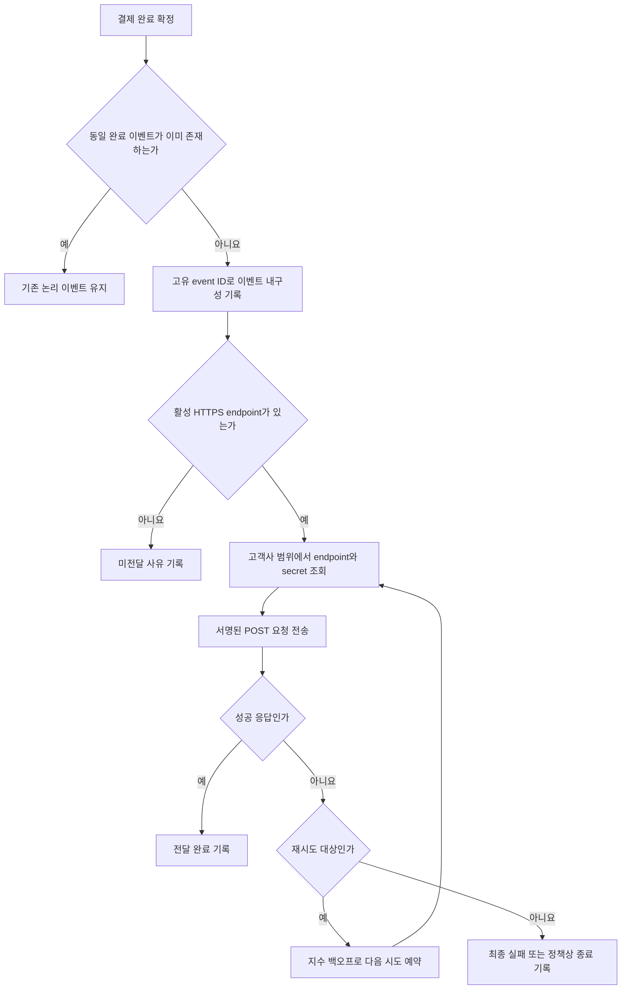

# 결제 완료 웹훅 전달 API PRD

## 1. 문서 상태

- 상태: Draft
- 대상 릴리스: 1차 출시
- 범위: 서버 간 결제 완료 웹훅 전달
- UI: 없음
- 주의: 서명 방식, secret rotation 정책, 재시도 종료 정책은 출시 전 결정이 필요하다.
- 성능 목표: 현재 근거가 없으므로 수치 SLA를 정의하지 않는다.

## 2. 적용성

| 계약 항목 | 적용 여부 | 근거 |
|---|---|---|
| 서버 API 및 비동기 전달 | Required | 결제 완료 이벤트를 고객사 HTTPS endpoint로 전달해야 한다. |
| 사용자 화면·라우트 | N/A | 이번 범위에 UI가 없다. |
| 사용자 화면 상태 매트릭스 | N/A | 사용자에게 노출되는 화면이 없다. |
| 시스템 처리 흐름 | Required | 이벤트 생성, 전달, 실패, 재시도 생명주기가 존재한다. |
| 인증·권한·테넌트 경계 | Required | 고객사별 endpoint와 결제 데이터가 격리되어야 한다. |
| 웹훅 서명 | Required, 방식 TBD | 서명 검증 방식은 보안 담당자 결정이 필요하다. |
| 수치형 성능 SLA | N/A | 현재 처리량과 지연 기준을 뒷받침할 측정값이 없다. |
| 내부 운영 관측성 | Required | 전달 실패와 재시도 상태를 UI 없이 운영자가 확인할 수 있어야 한다. |
| replay·수동 재전송 | N/A | 1차 출시 제외 범위로 명시됐다. |

## 3. 배경과 문제

결제가 완료된 사실을 고객사 시스템에 비동기로 알려 후속 업무를 수행할 수 있게 해야 한다. 네트워크나 고객사 endpoint 장애가 발생할 수 있으므로 전달 상태를 내구성 있게 관리하고 지수 백오프로 재시도해야 한다.

전달 방식은 최소 1회(at-least-once)이므로 같은 논리 이벤트가 중복 전달될 수 있다. 고객사는 고유한 event ID를 사용해 멱등 처리할 수 있어야 한다.

## 4. 목표

- 결제 완료 시 해당 고객사에 등록된 HTTPS endpoint로 웹훅을 전달한다.
- 각 논리 이벤트에 전역적으로 고유하고 재시도 중 변하지 않는 event ID를 부여한다.
- 일시적인 전달 실패에 지수 백오프를 적용한다.
- 프로세스 재시작이나 일시 장애로 전달 대상 이벤트가 유실되지 않게 한다.
- 고객사별 endpoint, secret, 이벤트, 결제 데이터 및 전달 이력을 격리한다.
- 서명 방식과 rotation 정책을 확정한 뒤 안전하게 검증할 수 있는 요청을 제공한다.
- 실제 운영 측정값을 수집해 추후 처리량 및 지연 SLA를 결정할 근거를 만든다.

## 5. 비목표

- endpoint 등록·수정·삭제용 신규 API 또는 UI
- 고객사용 웹훅 관리 UI
- replay 대시보드
- 고객사 또는 운영자의 수동 재전송
- 결제 완료 이외의 이벤트 유형 전달
- 이벤트 순서 보장
- exactly-once 전달
- 근거 없는 처리량, 지연 또는 가용성 수치 보장
- 고객사 endpoint 내부의 처리 성공 보장

## 6. 사용자, 역할 및 권한

| 역할 | 책임 및 권한 |
|---|---|
| 결제 시스템 | 확정된 결제 완료 사실을 웹훅 전달 시스템에 전달한다. |
| 웹훅 전달 시스템 | 이벤트를 내구성 있게 기록하고 해당 고객사의 endpoint에 전달 및 재시도한다. |
| 고객사 endpoint | 서명을 검증하고 event ID를 기준으로 중복을 제거한 뒤 이벤트를 처리한다. |
| 기존 내부 endpoint 관리 API | 인증된 고객사의 endpoint와 secret 설정을 등록·변경한다. 구현은 이번 범위 밖이다. |
| 내부 운영자 | 로그·메트릭·알림을 통해 장애를 조사한다. 수동 재전송 권한은 1차 출시에서 제공하지 않는다. |
| 보안 담당자 | 서명 알고리즘, 헤더 계약, secret rotation 주기와 전환 정책을 확정한다. |

## 7. 기능 요구사항

| ID | 요구사항 | 우선순위 |
|---|---|---|
| FR-001 | 결제 상태가 처음으로 완료 상태에 확정되면 `payment.completed` 논리 이벤트를 생성해야 한다. | Must |
| FR-002 | 동일한 결제 완료 전이가 중복 입력되더라도 새로운 논리 이벤트가 반복 생성되지 않도록 안정적인 중복 방지 기준을 적용해야 한다. | Must |
| FR-003 | 이벤트는 최초 외부 전송 전에 내구성 있게 기록되어야 하며 프로세스 재시작 후에도 미완료 전달을 복구할 수 있어야 한다. | Must |
| FR-004 | 각 논리 이벤트에는 고객사 범위를 넘어 충돌하지 않는 불변 `event_id`가 있어야 한다. 모든 재시도는 동일한 `event_id`를 사용해야 한다. | Must |
| FR-005 | 등록된 활성 HTTPS endpoint가 있는 경우 해당 고객사의 endpoint로 이벤트를 전달해야 한다. | Must |
| FR-006 | 다른 고객사의 endpoint, secret 또는 결제 데이터가 요청에 포함되거나 전달 대상으로 선택되어서는 안 된다. | Must |
| FR-007 | 요청 본문은 동일한 `event_id`의 재시도 사이에서 의미적으로 동일해야 한다. 변경이 필요하면 새 이벤트 또는 새 스키마 버전으로 취급해야 한다. | Must |
| FR-008 | 연결 실패, DNS 오류, TLS 오류, 응답 timeout 등 네트워크 실패 시 지수 백오프로 재시도해야 한다. | Must |
| FR-009 | 재시도마다 시도 횟수, 예정 시각, 시작·종료 시각, 결과 분류 및 응답 상태 코드를 기록해야 한다. 응답 본문의 민감 데이터는 기본적으로 저장하지 않는다. | Must |
| FR-010 | 고객사 endpoint의 성공 응답을 수신한 뒤 해당 이벤트의 전달을 완료 상태로 기록해야 한다. 성공 응답 판정 기준은 OD-003에서 확정한다. | Must |
| FR-011 | 전달이 완료 상태로 기록되기 전에 장애가 발생한 경우 같은 이벤트가 다시 전달될 수 있어야 한다. | Must |
| FR-012 | 요청에는 고객사가 진위와 무결성을 검증할 수 있는 서명이 포함되어야 한다. 알고리즘과 헤더 형식은 OD-001 확정값을 따른다. | Must |
| FR-013 | secret rotation 시 전환 기간 동안 허용할 secret과 서명·검증 동작은 OD-002 정책을 따라야 한다. | Must |
| FR-014 | 등록된 URL의 scheme은 HTTPS여야 하며 요청 대상이 허용된 외부 endpoint인지 서버 측에서 검증해야 한다. | Must |
| FR-015 | HTTP redirect를 자동 추적하지 않는다. redirect 지원이 필요하면 별도 보안 검토와 요구사항 변경을 거친다. | Must |
| FR-016 | endpoint가 없거나 비활성 상태일 때 다른 고객사의 endpoint로 대체 전달해서는 안 되며, 해당 결과를 식별 가능한 상태로 기록해야 한다. | Must |
| FR-017 | 이벤트 envelope에 최소 `event_id`, `event_type`, `schema_version`, `occurred_at`, `data`를 포함해야 한다. | Must |
| FR-018 | `data`에는 해당 고객사가 소유한 결제를 식별할 수 있는 `payment_id`와 완료 시각을 포함해야 한다. 추가 필드는 OD-006에서 확정한다. | Must |
| FR-019 | 고객사가 event ID 기반 멱등 처리를 구현할 수 있도록 중복 가능성과 event ID 사용법을 API 계약에 명시해야 한다. | Must |
| FR-020 | 전달 성공률, 실패 유형, 재시도 횟수, 최초 전달 지연 및 대기 이벤트 수를 측정할 수 있어야 한다. 현 단계에서는 목표 수치를 설정하지 않는다. | Must |
| FR-021 | 로그와 메트릭에서 `event_id`와 고객사 식별자를 이용해 전달 흐름을 추적할 수 있어야 한다. secret, 서명 원문 및 불필요한 결제 정보는 로그에 남기지 않는다. | Must |
| FR-022 | replay 대시보드와 수동 재전송 경로를 1차 출시에서 노출하지 않는다. | Must |

## 8. 외부 요청 계약

다음은 확정 가능한 최소 envelope다. `data`의 추가 필드와 서명 헤더는 열린 결정으로 남긴다.

```json
{
  "event_id": "고유하고 불변인 이벤트 식별자",
  "event_type": "payment.completed",
  "schema_version": "1",
  "occurred_at": "RFC 3339 형식의 결제 완료 시각",
  "data": {
    "payment_id": "해당 고객사의 결제 식별자",
    "completed_at": "RFC 3339 형식의 결제 완료 시각"
  }
}
```

계약 조건:

- HTTP method는 `POST`로 가정한다.
- `Content-Type`은 `application/json`으로 가정한다.
- 고객사는 알 수 없는 추가 필드를 무시할 수 있어야 한다.
- 호환성을 깨는 변경은 `schema_version` 변경 없이 배포하지 않는다.
- event ID는 HTTP 헤더에도 중복 제공할 수 있으나, 정확한 헤더명은 서명 계약과 함께 확정한다.
- 전달 순서는 보장하지 않는다.

## 9. 시스템 흐름



## 10. 상태 모델

| 상태 | 의미 | 허용되는 다음 상태 |
|---|---|---|
| `pending` | 이벤트가 기록됐으나 아직 시도하지 않음 | `delivering`, `undeliverable` |
| `delivering` | 외부 요청이 진행 중 | `delivered`, `retry_scheduled`, `failed` |
| `retry_scheduled` | 정책에 따라 다음 시도가 예약됨 | `delivering`, `failed` |
| `delivered` | 성공 응답을 확인함 | 없음 |
| `undeliverable` | 활성 endpoint 부재 등으로 현재 전달할 수 없음 | 정책 확정 전 자동 전환 없음 |
| `failed` | 재시도 종료 정책에 따라 전달이 종료됨 | 1차 출시에서 수동 재전송 없음 |

상태 이름은 구현체에서 달라질 수 있으나, 외부 동작과 관측 가능 결과는 동일해야 한다.

## 11. 인증, 데이터 경계 및 보안

- 모든 이벤트, endpoint, secret, 시도 이력은 단일 고객사 소유권을 가져야 한다.
- 결제 이벤트의 고객사와 endpoint 소유 고객사가 일치할 때만 전달할 수 있다.
- endpoint 조회는 요청이나 임의 입력에서 받은 고객사 ID가 아니라, 결제 소유권에서 도출된 신뢰 가능한 고객사 식별자를 기준으로 수행한다.
- 저장 및 조회 경로에서 고객사 조건이 누락되지 않도록 데이터 접근 계층 또는 동등한 서버 측 경계를 적용한다.
- 서명 secret은 평문 로그, 오류 메시지, 메트릭 label 또는 요청 추적 데이터에 노출하지 않는다.
- HTTPS 인증서 검증을 비활성화해서는 안 된다.
- webhook URL을 이용한 SSRF를 방지해야 한다. 구체적인 DNS 재해석, 사설·링크로컬 주소 및 egress 제한 정책은 보안 검토에서 확정한다.
- redirect는 1차 출시에서 자동 추적하지 않는다.
- endpoint 등록 API의 호출자 인증과 소유권 검증은 기존 내부 API의 책임이지만, 전달 시스템도 저장된 tenant 소유권을 신뢰 가능한 방식으로 확인해야 한다.

## 12. 비기능 요구사항

### 신뢰성

- 외부 전송 전에 이벤트를 내구성 있게 보존한다.
- worker 또는 프로세스 재시작 후 미완료 이벤트를 다시 처리한다.
- 성공 기록과 실제 외부 수신 사이의 분산 시스템 특성상 중복 전달이 가능함을 명시한다.
- exactly-once 또는 순서 보장을 주장하지 않는다.

### 성능 및 용량

현재 수치 SLA는 정의하지 않는다. 다음 항목만 측정한다.

| 측정 항목 | 정의 | 담당 | 결정 시점 |
|---|---|---|---|
| 최초 전달 지연 | 결제 완료 확정부터 첫 전송 시작까지 | 서비스 운영 담당 | 운영 baseline 확보 후 |
| 최종 전달 지연 | 결제 완료 확정부터 성공 응답까지 | 서비스 운영 담당 | 운영 baseline 확보 후 |
| 처리량 | 단위 시간당 생성·전달 이벤트 수 | 서비스 운영 담당 | 예상 트래픽 또는 부하 측정 후 |
| queue lag | 현재 시각과 가장 오래된 처리 대기 이벤트 시각의 차이 | 서비스 운영 담당 | 출시 전 관측성 검증 후 |
| 전달 성공률 | 생성된 전달 대상 중 성공 완료된 비율 | 서비스 운영 담당 | 실패 정책 확정 및 baseline 확보 후 |

출시 전에는 목표값 대신 메트릭 수집 가능 여부와 병목 없는 기본 동작을 검증한다.

### 관측성

- 이벤트 생성, 각 전달 시도, 성공, 재시도 예약 및 종료 결과를 구조화 로그로 남긴다.
- 네트워크 오류, TLS 오류, timeout, HTTP 상태 코드, 내부 처리 오류를 구분한다.
- 재시도 backlog 증가와 지속적인 전달 실패를 탐지할 수 있어야 한다.
- 알림 임계치는 실제 baseline 또는 운영 요구사항을 근거로 별도 확정한다.

## 13. 수용 기준

| ID | 관련 요구사항 | Given | When | Then | 검증 방법 |
|---|---|---|---|---|---|
| AC-001 | FR-001~004 | 고객사 A의 결제가 완료됨 | 완료 이벤트가 처리됨 | 하나의 논리 이벤트가 내구성 있게 기록되고 고유 event ID가 부여됨 | 통합 테스트 |
| AC-002 | FR-002 | 같은 결제 완료 전이가 중복 입력됨 | 두 입력을 모두 처리함 | 새 논리 이벤트가 중복 생성되지 않음 | 통합·동시성 테스트 |
| AC-003 | FR-005, FR-017, FR-018 | 고객사 A에 활성 HTTPS endpoint가 있음 | 결제가 완료됨 | 등록 endpoint에 계약된 JSON envelope가 POST됨 | 계약 테스트 |
| AC-004 | FR-004, FR-007, FR-011 | 첫 전달이 네트워크 오류로 실패함 | 재시도가 실행됨 | 최초 시도와 재시도의 event ID 및 의미적 payload가 동일함 | 통합 테스트 |
| AC-005 | FR-008 | endpoint 연결이 일시적으로 실패함 | 여러 재시도가 예약됨 | 재시도 간격이 확정된 지수 백오프 정책을 따름 | 시간 제어 테스트 |
| AC-006 | FR-003, FR-011 | 전달 대기 또는 재시도 상태의 이벤트가 있음 | worker가 종료 후 재시작됨 | 이벤트가 유실되지 않고 다시 처리됨 | 장애 복구 테스트 |
| AC-007 | FR-006 | 고객사 A와 B에 서로 다른 endpoint와 결제가 있음 | A의 결제가 완료됨 | A의 endpoint와 데이터만 사용되며 B의 정보는 요청·로그에 나타나지 않음 | 격리 통합 테스트 |
| AC-008 | FR-012, FR-013 | 서명 및 rotation 정책이 확정·설정됨 | 웹훅을 전송함 | 고객사가 계약된 방식으로 진위와 무결성을 검증할 수 있음 | 보안 계약 테스트 |
| AC-009 | FR-014, FR-015 | HTTP URL 또는 redirect 응답 endpoint가 존재함 | 전달 대상 검증 또는 요청을 수행함 | HTTP URL은 거부되고 redirect는 자동 추적되지 않음 | 보안 테스트 |
| AC-010 | FR-010 | endpoint가 성공으로 정의된 응답을 반환함 | 응답을 수신함 | 이벤트가 전달 완료 처리되고 추가 재시도가 예약되지 않음 | 통합 테스트 |
| AC-011 | FR-009, FR-020, FR-021 | 성공 및 실패 전달이 발생함 | 운영 로그와 메트릭을 조회함 | event ID 기반 추적과 실패 유형·재시도·지연 측정이 가능하며 secret은 노출되지 않음 | 관측성 점검 |
| AC-012 | FR-016 | 활성 endpoint가 없음 | 결제가 완료됨 | 다른 endpoint로 전달하지 않고 식별 가능한 미전달 상태를 기록함 | 통합 테스트 |
| AC-013 | FR-019 | 고객사가 동일 event ID를 두 번 수신함 | 고객사 구현 가이드를 따름 | event ID를 멱등 키로 사용해야 한다는 계약이 문서화되어 있음 | 문서 검토 |
| AC-014 | FR-022 | 1차 출시 버전이 배포됨 | 외부 및 내부 인터페이스를 검사함 | replay 대시보드와 수동 재전송 기능이 제공되지 않음 | 범위 점검 |

## 14. 합리적 가정

다음은 브리프에 명시되지 않았지만 현재 PRD를 진행하기 위해 둔 되돌릴 수 있는 가정이다.

- A-001: 전달 요청은 HTTPS `POST`와 JSON body를 사용한다.
- A-002: 이벤트 유형명은 `payment.completed`이다.
- A-003: 고객사는 event ID를 멱등 키로 저장해 중복 처리를 방지한다.
- A-004: 동일 결제에 대한 완료 상태 전이는 하나의 논리 이벤트를 만든다.
- A-005: 재시도 시 event ID와 payload의 의미는 변하지 않는다.
- A-006: HTTP redirect는 보안상 자동 추적하지 않는다.
- A-007: endpoint가 없는 이벤트를 나중에 자동 전달하거나 replay하지 않는다. 1차 출시에서는 사유만 기록한다.
- A-008: 이벤트 간 전달 순서는 보장하지 않는다.
- A-009: event ID 생성 형식은 외부 계약에서 특정 UUID 버전 등에 결합하지 않는다.
- A-010: endpoint URL은 이벤트 생성 시점의 활성 설정을 기준으로 선택한다. URL 변경 후 기존 미완료 이벤트의 목적지 처리 방식은 OD-007에서 최종 확정한다.

가정이 변경되면 관련 요구사항과 수용 기준도 함께 갱신해야 한다.

## 15. 열린 결정

| ID | 결정 필요 사항 | 선택 시 고려사항 | 담당 | 결정 시점 |
|---|---|---|---|---|
| OD-001 | 서명 알고리즘, canonicalization, timestamp, 헤더 이름 및 허용 시간 오차 | 상호운용성, replay 공격 방지, 키 관리 | 보안 담당자 | 구현 완료 전 |
| OD-002 | secret rotation 주기와 전환 방식 | 구·신 secret 동시 허용 여부, 롤백, 고객사 전환 시간 | 보안 담당자 | 구현 완료 전 |
| OD-003 | HTTP 성공·재시도 판정 | 일반적으로 2xx 성공, 429·5xx 재시도, 기타 4xx 종료를 고려하되 확정 필요 | 제품·플랫폼 담당 | 재시도 로직 구현 전 |
| OD-004 | 재시도 초기 간격, 배수, jitter, 최대 간격, 최대 횟수 또는 최대 기간 | 장애 증폭 방지, 최소 1회 전달 의미, 고객사 복구 시간 | 플랫폼·운영 담당 | 재시도 로직 구현 전 |
| OD-005 | 연결·응답 timeout 값 | worker 점유, 고객사 처리 시간, 중복 가능성 | 플랫폼 담당 | 부하·통합 테스트 전 |
| OD-006 | `data`의 추가 결제 필드와 개인정보 포함 범위 | 고객사 후속 처리에 필요한 최소 데이터, 데이터 최소화 | 결제 도메인·보안 담당 | 외부 계약 확정 전 |
| OD-007 | endpoint 또는 secret 변경 시 이미 대기 중인 이벤트 처리 | 이벤트 생성 시점 snapshot과 최신 설정 사용의 장단점 | 플랫폼·보안 담당 | 데이터 모델 확정 전 |
| OD-008 | 실패 이벤트와 전달 이력의 보존 기간 | 장애 조사, 저장 비용, 개인정보 보존 정책 | 보안·운영 담당 | 운영 전 |
| OD-009 | SSRF 방어 세부 정책 | 사설 IP, DNS rebinding, proxy·egress allow 정책 | 보안 담당자 | 보안 검토 전 |
| OD-010 | 운영 알림 조건 | 실제 트래픽 baseline, 반복 실패, backlog 증가 | 운영 담당 | 출시 후 baseline 확보 시 |

OD-001~OD-005와 OD-009는 보안 또는 전달 동작을 결정하므로 프로덕션 출시 전 반드시 닫아야 한다. 특히 재시도 종료 정책이 없으면 “최소 1회 전달”의 운영 의미와 실패 상태를 확정할 수 없다.

## 16. 위험과 완화책

| 위험 | 영향 | 완화 |
|---|---|---|
| 중복 전달 | 고객사에서 중복 주문 처리 또는 중복 지급 발생 | 불변 event ID 제공, 멱등 처리 계약과 예제 문서화 |
| 이벤트 유실 | 고객사가 결제 완료를 인지하지 못함 | 외부 전송 전 내구성 기록, 재시작 복구 테스트 |
| 재시도 폭주 | 내부 및 고객사 endpoint 부하 증가 | 지수 백오프, jitter 정책 확정, backlog 관측 |
| 잘못된 tenant 연결 | 고객사 간 데이터 유출 | 결제 소유권 기반 endpoint 조회, 격리 테스트 |
| 위조 또는 replay 요청 | 고객사의 허위 이벤트 처리 | 서명, timestamp 검증 정책, secret rotation |
| webhook URL을 통한 SSRF | 내부망 접근 또는 데이터 노출 | HTTPS 검증, redirect 차단, egress 및 DNS 정책 |
| 로그의 민감정보 노출 | secret 또는 결제 데이터 유출 | 구조화 로그 허용 목록, secret 마스킹, 응답 본문 미저장 |
| 장기간 실패 이벤트 누적 | 저장 공간과 운영 부하 증가 | 재시도 종료·보존 정책 확정, backlog 메트릭 |
| 근거 없는 SLA 약속 | 달성 불가능한 운영 계약 | 먼저 지표 수집 후 baseline을 근거로 별도 SLA 승인 |

## 17. 전달 계획

| 단계 | 포함 요구사항 | 검증 가능한 종료 조건 |
|---|---|---|
| 0. 계약 및 보안 결정 | FR-008, FR-010, FR-012~015 | OD-001~005, OD-009가 승인되고 테스트 가능한 값과 요청 계약이 문서화됨 |
| 1. 이벤트 생성·격리 | FR-001~004, FR-006, FR-017, FR-018 | 중복 입력, 내구성 및 고객사 격리 테스트 통과 |
| 2. 전달·재시도 | FR-005, FR-007~011, FR-016 | 성공, 네트워크 실패, 백오프, 재시작 복구 및 endpoint 부재 테스트 통과 |
| 3. 보안 적용 | FR-012~015 | 서명 계약, rotation, TLS, redirect 및 SSRF 방어 테스트 통과 |
| 4. 운영 준비 | FR-019~022 | 중복 처리 문서, 로그·메트릭·알림 점검 완료 및 제외 기능 미노출 확인 |
| 5. 출시 후 측정 | FR-020 | 최초 전달 지연, 최종 전달 지연, 처리량, queue lag, 성공률의 baseline 수집 가능 확인 |

이 PRD는 파일로 저장하거나 저장소를 탐색하지 않고 작성했으며, 따라서 파일 기반 PRD validator는 실행하지 않았다.