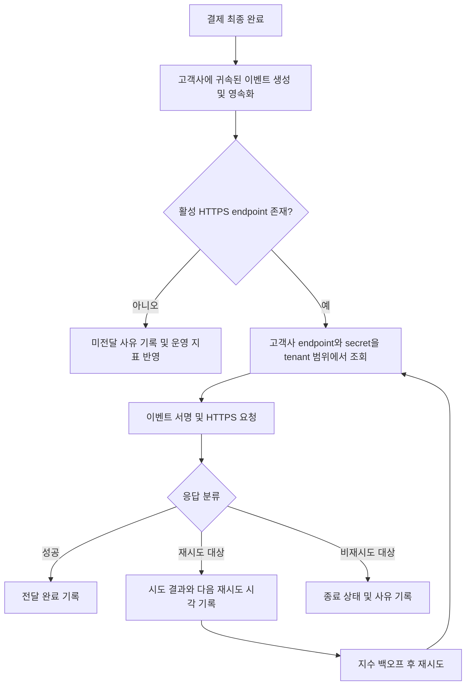

# 결제 완료 웹훅 전달 API PRD

## 1. 문서 개요

- 기능명: 결제 완료 웹훅 전달 API
- 문서 상태: Draft
- 대상 릴리스: 1차 출시
- 인터페이스 유형: 서버 간 웹훅
- UI 범위: 없음
- 핵심 전달 보장: At-least-once delivery attempt
- 주요 미결 사항: 서명 방식, secret rotation 정책, 재시도 종료 정책, 이벤트 payload 계약

## 2. 적용 범위

| 계약 항목 | 적용 여부 | 근거 |
|---|---|---|
| 문제, 목표, 비목표 | Required | 신규 외부 이벤트 전달 기능 |
| 사용자·역할·권한 | Required | 고객사별 endpoint 및 데이터 격리 필요 |
| 안정적인 요구사항 ID | Required | 구현·테스트 추적 필요 |
| 권한 및 데이터 경계 | Required | 고객사 간 데이터 유출 방지가 핵심 요구사항 |
| 인수 조건 | Required | 비동기 전달·재시도 동작을 검증해야 함 |
| 위험 및 열린 결정 | Required | 보안·운영 정책 일부가 미정 |
| 단계별 출시 조건 | Required | 보안 결정과 운영 준비가 출시를 제한함 |
| 페이지 및 라우트 | N/A | 이번 범위에는 사용자 UI가 없음 |
| 사용자 화면 상태 매트릭스 | N/A | 사용자에게 노출되는 화면이 없음 |
| 시스템 흐름 | Required | 결제 완료부터 비동기 전달·재시도까지 다단계 처리 |
| 수치형 SLA | N/A | 처리량과 지연이 아직 측정되지 않아 근거 있는 목표가 없음 |

## 3. 배경과 문제

고객사는 결제 완료 이후 주문 확정, 이용권 발급, 회계 처리 등의 후속 작업을 수행하기 위해 결제 완료 사실을 받아야 한다.

현재 요구사항은 결제 완료 이벤트를 등록된 고객사 HTTPS endpoint로 자동 전달하는 것이다. 네트워크와 외부 시스템은 일시적으로 실패할 수 있으므로 전달 요청을 유실하지 않고 재시도해야 한다. 재시도로 인해 동일 이벤트가 중복 전달될 수 있으므로 고객사가 중복 여부를 판단할 수 있는 안정적인 event ID가 필요하다.

웹훅 서명 방식과 secret rotation 정책은 아직 정해지지 않았다. 따라서 전송 파이프라인 구현은 진행할 수 있지만, 외부 프로덕션 트래픽 활성화는 보안 정책 확정 및 검증 이후에만 가능하다.

## 4. 목표

- 결제 완료 이벤트를 해당 고객사에 등록된 HTTPS endpoint로 비동기 전달한다.
- 결제 처리와 웹훅 endpoint의 가용성을 분리한다.
- 네트워크 및 일시적 서버 실패에 지수 백오프 재시도를 적용한다.
- 고객사가 중복 이벤트를 식별할 수 있도록 이벤트별로 불변 event ID를 제공한다.
- 모든 처리 단계에서 고객사별 데이터 및 설정을 격리한다.
- 전달 상태와 실패 원인을 운영자가 관찰할 수 있도록 계측한다.
- 보안 담당자가 결정한 서명 및 secret rotation 정책을 적용할 수 있는 구조를 갖춘다.

## 5. 비목표

1차 출시에서는 다음을 제공하지 않는다.

- endpoint 등록·수정 UI
- endpoint 등록 API 신규 개발
- 고객사용 웹훅 replay 대시보드
- 고객사 또는 운영자의 수동 재전송 기능
- 처리량 또는 전달 지연 SLA 보장
- 고객사 endpoint 내부에서 이벤트가 실제 처리되었는지 확인
- 고객사 간 이벤트 순서 또는 동일 고객사 내 이벤트 순서 보장
- 결제 완료 이외 이벤트 유형 지원
- 고객사별 retry 정책 커스터마이징

수동 재전송 기능은 제외하지만, 자동 재시도 상태를 확인하고 장애를 탐지하기 위한 내부 관측성은 범위에 포함한다.

## 6. 사용자, 역할 및 권한

| 역할 | 권한 및 책임 |
|---|---|
| 결제 시스템 | 결제 완료 사실을 발생시키고 웹훅 이벤트 생성을 요청한다. |
| 웹훅 전달 시스템 | 이벤트를 영속적으로 기록하고 올바른 고객사 endpoint로 전달·재시도한다. |
| 고객사 시스템 | 웹훅을 수신하고 event ID를 기준으로 멱등 처리한다. |
| 기존 내부 endpoint 관리 API | 고객사 endpoint와 활성 상태를 등록·관리한다. 구현은 본 PRD 범위 밖이다. |
| 내부 운영자 | 시스템 지표와 로그를 통해 장애를 조사한다. 수동 재전송 권한은 제공하지 않는다. |
| 보안 담당자 | 서명 방식, secret 수명 및 rotation 정책을 결정하고 승인한다. |

내부 운영자의 조회 도구나 별도 운영 UI 개발은 본 PRD에 포함되지 않는다. 기존 로그·모니터링 체계를 사용한다고 가정한다.

## 7. 기능 요구사항

| ID | 요구사항 | 우선순위 |
|---|---|---|
| FR-01 | 결제가 최종 완료 상태로 전환되면 고객사 식별자가 연결된 `payment.completed` 이벤트를 한 번 생성해야 한다. | Must |
| FR-02 | 동일한 결제 완료 사실을 중복 처리하더라도 논리적으로 동일한 이벤트가 무제한 생성되지 않도록 중복 생성 방지 기준을 가져야 한다. | Must |
| FR-03 | 각 이벤트에는 전역적으로 유일하고 생성 후 변경되지 않는 `event_id`가 있어야 한다. 모든 재시도는 최초와 동일한 `event_id`를 사용해야 한다. | Must |
| FR-04 | 결제 완료 처리 성공과 웹훅 전달 대기 상태 사이에 이벤트가 유실되지 않도록 이벤트를 영속적으로 인계해야 한다. 프로세스 장애 후에도 미완료 전달을 재개할 수 있어야 한다. | Must |
| FR-05 | 전달 시스템은 이벤트에 연결된 고객사의 활성 HTTPS endpoint만 조회하여 사용해야 한다. | Must |
| FR-06 | endpoint가 없거나 비활성 상태라면 외부 요청을 보내지 않고 원인을 구분 가능한 상태로 기록해야 한다. | Must |
| FR-07 | HTTP 요청 body에는 최소한 `event_id`, `event_type`, `occurred_at` 및 결제 완료 payload를 포함해야 한다. | Must |
| FR-08 | 첫 전달과 모든 재시도는 의미적으로 동일한 이벤트 내용을 전달해야 한다. 변경 가능한 전달 메타데이터는 별도 필드 또는 header로 구분해야 한다. | Must |
| FR-09 | 연결 실패, DNS 실패, TLS 실패, timeout 및 재시도 대상으로 정의된 HTTP 응답에는 지수 백오프를 적용해야 한다. | Must |
| FR-10 | 동일 이벤트의 재시도가 동시에 중복 실행되지 않도록 경쟁 상태를 통제해야 한다. 다만 장애 경계에서는 중복 전달이 발생할 수 있다. | Must |
| FR-11 | HTTP 성공 응답으로 정의된 응답을 받으면 해당 endpoint에 대한 전달을 완료 상태로 기록하고 자동 재시도를 중단해야 한다. | Must |
| FR-12 | 재시도 여부, 다음 시각 및 종료 여부는 응답 분류 정책과 재시도 정책에 따라 결정하고 영속적으로 기록해야 한다. | Must |
| FR-13 | 고객사 endpoint로 전송되는 요청은 보안 담당자가 승인한 방식으로 서명되어야 한다. 서명 방식이 확정되기 전에는 외부 프로덕션 전달을 활성화할 수 없다. | Must |
| FR-14 | 서명 secret은 고객사별로 격리되어야 하며 요청 body, 로그, 오류 메시지 또는 일반 전달 메타데이터에 노출되어서는 안 된다. | Must |
| FR-15 | secret rotation 정책이 복수 secret의 병행 유효 기간을 요구할 경우, 이전 secret에서 신규 secret으로 안전하게 전환할 수 있어야 한다. 구체적 동작은 보안 결정 후 확정한다. | Must |
| FR-16 | 전달 시 고객사 A의 이벤트, endpoint 또는 secret을 고객사 B의 데이터와 조합하거나 노출해서는 안 된다. | Must |
| FR-17 | redirect 응답을 자동 추적하지 않아야 한다. redirect는 응답 분류 정책에 따라 실패로 기록한다. | Must |
| FR-18 | 전달 시도마다 event ID, 고객사 식별자, 시도 횟수, 결과 분류, HTTP 상태 코드, 소요 시간 및 다음 재시도 시각을 구조화된 형태로 기록해야 한다. payload와 secret은 기록하지 않는다. | Must |
| FR-19 | 큐 적체량, 최초 시도까지의 지연, 전달 성공까지의 시간, 시도 횟수 및 결과별 건수를 측정할 수 있어야 한다. | Must |
| FR-20 | replay 대시보드나 수동 재전송 인터페이스를 노출하지 않아야 한다. | Must |

## 8. 이벤트 계약 초안

정확한 결제 payload는 열린 결정으로 남기되, 공통 envelope는 다음을 기본안으로 한다.

```json
{
  "event_id": "evt_...",
  "event_type": "payment.completed",
  "occurred_at": "2026-07-27T12:34:56Z",
  "schema_version": "1",
  "data": {
    "payment_id": "pay_..."
  }
}
```

계약 원칙:

- `event_id`는 재시도 중 변경되지 않는다.
- `occurred_at`은 웹훅 발송 시각이 아니라 결제 완료 이벤트 발생 시각이다.
- 시도 횟수나 다음 재시도 시각은 결제 이벤트의 본문 의미를 변경하지 않는다.
- 카드 원문 정보, 인증정보, secret 등 결제 완료 통지에 불필요한 민감정보는 포함하지 않는다.
- payload 필드의 추가·변경·폐기 정책은 스키마 버전 정책 확정 후 적용한다.

## 9. 시스템 흐름



## 10. 상태 모델

| 상태 | 의미 |
|---|---|
| `pending` | 이벤트가 영속화되었으나 전달 시도가 시작되지 않음 |
| `delivering` | 특정 worker가 전달 시도를 수행 중 |
| `retry_scheduled` | 재시도 대상 실패이며 다음 시도가 예약됨 |
| `delivered` | 성공 응답을 받아 자동 전달이 완료됨 |
| `undeliverable` | endpoint 부재 등 현재 정책상 요청할 수 없음 |
| `terminal_failed` | 비재시도 응답 또는 재시도 종료 정책에 의해 자동 처리가 종료됨 |

프로세스 장애로 `delivering` 상태가 고착되지 않도록 복구 가능한 소유권 또는 lease가 필요하다. 구체적인 큐·DB·outbox 제품 선택은 구현 설계에 맡긴다.

## 11. 응답 및 재시도 분류

다음은 구현 진행을 위한 합리적 가정이며, 보안·플랫폼 담당자 승인 시 확정한다.

| 결과 | 기본 처리 |
|---|---|
| HTTP 2xx | 전달 성공 |
| 연결·DNS·TLS·timeout 실패 | 지수 백오프 재시도 |
| HTTP 408 | 재시도 |
| HTTP 429 | 재시도. 유효한 `Retry-After` 처리 여부는 열린 결정 |
| HTTP 5xx | 재시도 |
| 그 외 HTTP 4xx | 비재시도 실패 |
| HTTP 3xx | redirect를 추적하지 않고 비재시도 실패 |

지수 백오프의 초기 간격, 배수, 최대 간격, jitter, 최대 시도 횟수 또는 최대 보존 기간은 근거 없이 설정하지 않고 열린 결정으로 남긴다.

## 12. 권한 및 데이터 경계

- 모든 이벤트에는 서버가 신뢰할 수 있는 고객사 식별자가 연결되어야 한다.
- endpoint 및 secret 조회는 이벤트에 연결된 고객사 식별자로 제한해야 한다.
- 요청에서 전달받은 임의 고객사 ID만으로 endpoint나 secret을 선택해서는 안 된다.
- 이벤트 조회, 상태 갱신 및 retry 예약 시 고객사 범위 조건을 유지해야 한다.
- 고객사별 secret은 공유하지 않는다.
- 로그에는 secret, 서명 원문, 전체 payload 또는 결제 민감정보를 기록하지 않는다.
- 내부 운영자가 데이터를 조회할 수 있다면 기존 내부 권한 체계를 적용하고 접근을 감사할 수 있어야 한다.
- endpoint 등록 API는 최소한 HTTPS 강제 및 내부·사설 네트워크 목적지 차단 정책을 보장해야 한다. 이 계약이 충족되지 않으면 SSRF 위험 때문에 프로덕션 출시할 수 없다.
- DNS 재해석, redirect 또는 우회 주소를 통해 내부 네트워크에 접근하지 못하도록 전송 시점에도 목적지 보호가 적용되어야 한다.

## 13. 비기능 요구사항

### 신뢰성

- 결제 완료 처리와 외부 HTTP 요청을 동기적으로 결합하지 않는다.
- 이벤트가 영속화된 후 worker 또는 프로세스가 재시작되어도 자동 전달을 이어갈 수 있어야 한다.
- 전달은 중복될 수 있으며, exactly-once를 보장하지 않는다.
- 고객사의 성공 응답 유실 등으로 동일 이벤트가 성공 처리 후 다시 도착할 수 있음을 문서화한다.

### 보안

- HTTPS만 허용한다.
- 인증서 검증을 비활성화하지 않는다.
- 프로덕션 출시 전 서명 검증 계약과 secret rotation 정책을 보안 담당자가 승인해야 한다.
- endpoint 목적지 보호와 고객사별 secret 격리가 검증되어야 한다.

### 관측성

다음 지표를 수집하되 목표 수치는 초기 운영 데이터가 확보된 후 정한다.

- 이벤트 생성부터 최초 전달 시도까지의 지연
- 이벤트 생성부터 전달 성공까지의 지연
- 전달 시도 HTTP 소요 시간
- pending 및 retry 예정 이벤트 수
- 결과 분류별 전달 시도 수
- 이벤트당 시도 횟수
- endpoint 부재, 비재시도 실패 및 retry 종료 건수

지표에는 고객사 식별에 필요한 통제된 차원을 사용할 수 있지만, event ID처럼 고유값이 많은 필드를 무제한 metric label로 사용해서는 안 된다.

### 성능 및 SLA

- 1차 출시에는 처리량 및 지연 SLA를 선언하지 않는다.
- 출시 후 실측 데이터를 수집하여 부하 특성, 병목, 정상 지연 분포를 확인한다.
- SLA 또는 SLO는 측정 방법, 표본 기간 및 운영 책임자가 합의된 이후 별도 승인한다.

## 14. 인수 조건

| ID | 연결 요구사항 | Given | When | Then | 검증 |
|---|---|---|---|---|---|
| AC-01 | FR-01~04 | 활성 endpoint가 있는 고객사의 결제가 완료됨 | 결제 완료 처리가 커밋됨 | 유일한 event ID를 가진 이벤트가 유실 없이 전달 대기 상태가 됨 | 통합 테스트 및 장애 주입 테스트 |
| AC-02 | FR-03, FR-08 | 동일 이벤트의 첫 시도가 실패함 | 자동 재시도가 실행됨 | body의 event ID와 이벤트 의미가 최초 시도와 동일함 | 요청 캡처 기반 통합 테스트 |
| AC-03 | FR-05, FR-16 | 서로 다른 endpoint를 가진 고객사 A와 B가 있음 | A의 결제가 완료됨 | 요청은 A endpoint에만 전송되고 B의 endpoint·secret·데이터는 사용되지 않음 | 다중 tenant 통합 테스트 |
| AC-04 | FR-06 | 고객사의 활성 endpoint가 없음 | 결제가 완료됨 | 외부 요청 없이 `undeliverable` 사유가 기록됨 | 통합 테스트 |
| AC-05 | FR-09, FR-12 | endpoint 연결이 실패함 | worker가 결과를 처리함 | 이벤트가 실패하지 않고 정책에 따른 다음 시각으로 예약됨 | fake endpoint 및 clock 기반 테스트 |
| AC-06 | FR-09 | 연속으로 재시도 대상 실패가 발생함 | 다음 시각이 계산됨 | 승인된 지수 백오프 및 jitter 정책이 적용됨 | 결정론적 단위 테스트 |
| AC-07 | FR-10 | 동일 이벤트를 복수 worker가 동시에 획득하려 함 | 전달 작업이 실행됨 | 정상 경쟁 상황에서 한 worker만 활성 시도를 소유함 | 동시성 테스트 |
| AC-08 | FR-11 | endpoint가 성공으로 정의된 응답을 반환함 | 응답이 기록됨 | 상태가 `delivered`가 되고 추가 자동 재시도가 예약되지 않음 | 통합 테스트 |
| AC-09 | FR-09, FR-12 | endpoint가 각 HTTP 응답 분류를 반환함 | 전달 시스템이 응답을 처리함 | 승인된 분류표에 따라 성공·재시도·종료가 결정됨 | 응답 코드별 테이블 테스트 |
| AC-10 | FR-13~15 | 보안 담당자가 서명 및 rotation 계약을 승인함 | 고객사 endpoint로 요청함 | 승인된 header/body 규격으로 검증 가능한 서명이 포함되고 secret이 로그에 노출되지 않음 | 보안 계약 테스트 및 로그 검사 |
| AC-11 | FR-04 | 이벤트 영속화 후 worker가 강제 종료됨 | worker가 재시작됨 | 미완료 이벤트가 자동으로 다시 처리됨 | 프로세스 종료 장애 주입 테스트 |
| AC-12 | FR-17 | endpoint가 redirect를 반환함 | 응답을 처리함 | redirect 목적지로 요청하지 않고 정책에 따른 실패 상태를 기록함 | 통합 테스트 |
| AC-13 | FR-18~19 | 성공·timeout·5xx·4xx 결과가 각각 발생함 | 운영 지표와 로그를 조회함 | payload·secret 없이 결과, 지연, 시도 횟수 및 적체를 구분할 수 있음 | 로그 및 metric 검증 |
| AC-14 | FR-20 | 1차 출시 배포물이 준비됨 | 외부·내부 인터페이스를 점검함 | replay 대시보드와 수동 재전송 동작이 제공되지 않음 | API·라우트 및 배포 구성 검사 |

## 15. 합리적 가정

다음은 되돌릴 수 있는 가정이며, 열린 결정에서 다른 결론이 나면 PRD와 구현을 갱신한다.

- A-01: 1차 출시에서는 고객사당 활성 endpoint를 최대 1개 사용한다.
- A-02: “최소 1회 전달”은 최소 한 번의 HTTP 전달 시도를 보장하는 at-least-once delivery attempt를 의미한다. 고객사 endpoint의 성공 처리는 보장할 수 없다.
- A-03: HTTP 2xx를 전달 성공으로 간주한다.
- A-04: 네트워크 오류, timeout, 408, 429 및 5xx를 일시적 실패로 본다.
- A-05: 기타 4xx와 redirect는 자동 재시도하지 않는다.
- A-06: 이벤트 간 전달 순서는 보장하지 않는다.
- A-07: endpoint 등록 API는 고객사 소유권, HTTPS, 활성 상태 및 안전한 목적지 검증을 제공한다.
- A-08: 내부 운영 로그와 metric 기반 장애 조사가 가능하며 별도 운영 UI는 필요하지 않다.
- A-09: 결제 시스템에는 하나의 논리적 결제 완료 사실을 안정적으로 식별할 수 있는 키가 존재한다.
- A-10: 결제 완료 이벤트에는 원본 카드정보 등 웹훅 처리에 불필요한 민감정보를 포함하지 않는다.

## 16. 열린 결정

| ID | 결정 사항 | 책임자 | 결정 시점 | 출시 차단 여부 |
|---|---|---|---|---|
| OD-01 | 서명 알고리즘, 서명 대상, header 이름, timestamp·replay 방어 및 검증 규격 | 보안 담당자 | 외부 프로덕션 연동 전 | 차단 |
| OD-02 | secret 생성·보관 방식, rotation 주기, 이전·신규 secret 병행 기간 및 폐기 절차 | 보안 담당자 | 외부 프로덕션 연동 전 | 차단 |
| OD-03 | 정확한 이벤트 payload, 필수·선택 필드, 개인정보 포함 기준 및 schema version 호환 정책 | 결제 도메인·API 담당자 | 계약 테스트 작성 전 | 차단 |
| OD-04 | 지수 백오프 초기값, 배수, 최대 간격, jitter 방식 | 플랫폼·운영 담당자 | retry 구현 완료 전 | 차단 |
| OD-05 | 최대 시도 횟수 또는 최대 retry 기간, 종료 이벤트의 보존·처리 정책 | 제품·플랫폼·운영 담당자 | 프로덕션 출시 전 | 차단 |
| OD-06 | 429 응답의 `Retry-After` 지원 여부와 허용 상한 | 플랫폼 담당자 | 응답 분류 확정 전 | 차단 |
| OD-07 | 고객사당 활성 endpoint 수가 1개인지 복수인지 | 제품·API 담당자 | 데이터 모델 확정 전 | 차단 |
| OD-08 | 요청 연결 및 전체 timeout 정책 | 플랫폼 담당자 | HTTP client 설정 확정 전 | 차단 |
| OD-09 | endpoint가 없는 동안 생성된 이벤트를 endpoint 등록 후 자동 전달할지, 종료 상태로 유지할지 | 제품·운영 담당자 | 상태 전이 구현 전 | 차단 |
| OD-10 | event ID 형식 및 결제 완료 중복 생성 방지 키 | 결제 도메인 담당자 | 이벤트 저장 모델 확정 전 | 차단 |
| OD-11 | 이벤트 및 전달 이력의 보존 기간 | 보안·개인정보·운영 담당자 | 프로덕션 출시 전 | 차단 |
| OD-12 | 초기 운영 데이터를 어느 기간 수집한 뒤 SLA/SLO를 검토할지 | 제품·플랫폼 담당자 | 출시 후 | 비차단 |

## 17. 위험 및 완화책

| 위험 | 영향 | 완화책 |
|---|---|---|
| 결제 완료와 이벤트 생성 사이 장애 | 웹훅 영구 유실 | 원자적 또는 복구 가능한 영속 인계, 장애 주입 테스트 |
| 고객사가 중복 이벤트를 비멱등 처리 | 중복 발급·처리 | 불변 event ID 제공, at-least-once 특성 문서화 |
| 장기 장애 endpoint에 대한 retry 폭증 | 큐 적체 및 타 고객사 영향 | jitter 포함 백오프, 고객사별 자원 격리·공정성, 적체 지표 |
| tenant 조회 조건 누락 | 심각한 고객사 간 데이터 유출 | tenant-scoped 접근, 다중 tenant 음성 테스트 |
| secret 또는 payload 로그 노출 | 보안·개인정보 사고 | 구조화된 허용 목록 로그, 민감정보 로그 검사 |
| 악성 endpoint 등록 | SSRF 및 내부망 접근 | 등록·전송 시 목적지 검증, redirect 금지, egress 통제 |
| 서명 정책 미정 상태로 출시 | 위조 이벤트 또는 검증 불가능 | 보안 승인과 계약 테스트를 출시 게이트로 설정 |
| 재시도 종료 기준 부재 | 무한 적체 또는 조기 데이터 소실 | OD-05를 출시 전 확정하고 종료 상태 계측 |
| 미측정 SLA를 약속 | 달성 불가능한 외부 계약 | 초기에는 지표만 수집하고 실측 후 별도 승인 |

## 18. 출시 계획

| 단계 | 요구사항 ID | 검증 가능한 종료 조건 |
|---|---|---|
| 1. 이벤트 영속화 | FR-01~04 | 결제 완료, 중복 입력 및 프로세스 장애 테스트에서 이벤트 유실 없이 동일 논리 이벤트가 유지됨 |
| 2. 격리된 전달 | FR-05~08, FR-16~17 | 다중 tenant 테스트와 HTTPS·redirect·목적지 보호 테스트 통과 |
| 3. 자동 재시도 | FR-09~12 | 승인된 응답 분류 및 백오프 정책의 단위·통합·동시성 테스트 통과 |
| 4. 보안 적용 | FR-13~15 | OD-01·02 결정 완료, 서명 계약 테스트와 secret 비노출 검사 통과 |
| 5. 운영 준비 | FR-18~20 | 결과·지연·적체 지표 확인, 경보 책임자 지정, 제외 기능이 노출되지 않음을 확인 |
| 6. 제한적 출시 | 전체 | 열린 출시 차단 결정이 모두 종료되고 일부 고객사 대상으로 격리·중복·retry 동작 검증 |
| 7. 1차 출시 | 전체 | 제한적 출시에서 발견된 차단 장애가 해소되고 보안·운영 승인 완료 |

## 19. 완료 정의

1차 출시 완료로 판단하려면 다음 조건을 모두 만족해야 한다.

- 모든 Must 요구사항에 대한 자동화 테스트 또는 명시적인 검증 증거가 있다.
- 보안 서명 및 secret rotation 계약이 확정되었다.
- 재시도 및 종료 정책이 확정되었다.
- 고객사별 데이터 격리와 SSRF 방어가 검증되었다.
- worker 장애 후 미완료 이벤트가 복구되는 것이 검증되었다.
- 운영자가 payload나 secret 없이 실패 원인과 적체를 식별할 수 있다.
- 처리량과 지연 SLA는 약속하지 않으며, 측정 지표만 준비되어 있다.
- replay 대시보드와 수동 재전송 기능이 배포 범위에 포함되지 않았다.