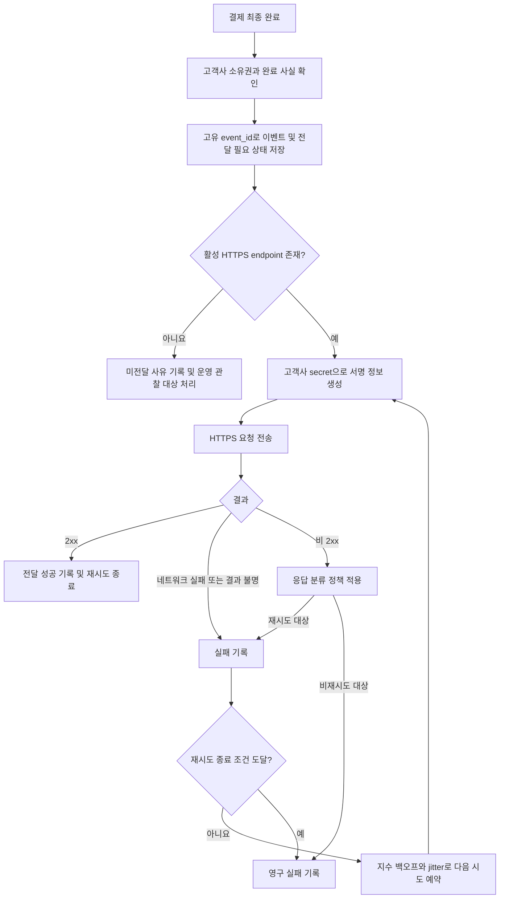

# 결제 완료 웹훅 전달 API PRD

## 1. Applicability

| Contract | Required / N/A | 근거 |
|---|---|---|
| 문제, 목표, 비목표 | Required | 신규 서버 기능의 범위와 성공 조건 정의 필요 |
| 사용자·역할·권한 | Required | 고객사별 endpoint, secret, 결제 데이터 격리 필요 |
| 기능 요구사항 | Required | 이벤트 생성, 전달, 재시도, 중복 처리 계약 필요 |
| Pages / Routes | N/A | 이번 범위에는 UI와 사용자 화면이 없음 |
| 사용자 화면 상태 매트릭스 | N/A | 사용자에게 노출되는 화면이 없음 |
| 시스템 흐름 | Required | 결제 완료부터 재시도 종료까지 다단계 생명주기 존재 |
| 데이터·권한 경계 | Required | 고객사 간 데이터 격리가 명시적 요구사항 |
| 수치형 성능 SLA | N/A | 처리량과 지연 기준이 측정되지 않았으며 근거 있는 목표가 없음 |
| 인수 조건 | Required | 전달 보장, 재시도, 중복 가능성 등을 검증해야 함 |
| 위험·열린 결정 | Required | 서명 방식, secret rotation, 재시도 종료 정책 등이 미정 |
| 단계별 출시 조건 | Required | 보안 결정과 운영 정책 확정이 출시 선행 조건 |

---

## 2. 배경과 문제

결제가 완료되면 해당 고객사가 등록한 HTTPS endpoint로 결제 완료 이벤트를 전달해야 한다.

네트워크 장애나 수신 endpoint의 일시적 장애로 전달이 실패할 수 있으므로 자동 재시도가 필요하다. 시스템은 최소 1회 전달 시도를 보장하며, 재시도 또는 응답 유실로 같은 이벤트가 여러 번 전달될 수 있다. 따라서 고객사가 중복 이벤트를 식별할 수 있도록 재시도 간 변하지 않는 고유 `event_id`가 필요하다.

고객사별 endpoint, secret, 이벤트 본문 및 전달 기록은 서로 섞이거나 다른 고객사에 노출되어서는 안 된다.

여기서 “최소 1회 전달”은 영구적으로 사용할 수 없는 endpoint에도 성공 전달을 보장한다는 의미가 아니다. 이벤트를 유실하지 않고 최소 한 번 시도하며, 정해진 자동 재시도 정책 안에서 성공할 때까지 다시 시도한다는 의미다.

---

## 3. 목표

- 결제 완료 이벤트를 올바른 고객사의 등록된 HTTPS endpoint로 전달한다.
- 프로세스 장애가 발생해도 전달 대상 이벤트가 유실되지 않게 한다.
- 네트워크 실패 시 지수 백오프를 적용해 자동 재시도한다.
- 모든 재시도에서 동일한 `event_id`를 제공해 고객사가 중복을 제거할 수 있게 한다.
- 고객사별 endpoint, secret, payload 및 전달 기록을 격리한다.
- 전달 성공과 실패 상태를 운영자가 추적할 수 있게 한다.
- 측정 데이터를 수집해 추후 처리량 및 지연 SLA를 결정할 근거를 만든다.

## 4. 비목표

- endpoint 등록·수정·삭제 UI
- 신규 endpoint 등록 API 구현
- 고객사용 replay 대시보드
- 고객사 또는 운영자의 수동 재전송 기능
- 결제 완료 이외의 이벤트 유형 지원
- 처리량 또는 전달 지연에 대한 수치형 SLA 선언
- 고객사 시스템 내부의 중복 제거 로직 구현
- 결제 처리 자체의 변경

---

## 5. 사용자, 역할 및 권한

| 역할 | 책임 및 권한 |
|---|---|
| 고객사 수신 시스템 | 자신에게 전달된 이벤트를 수신하고 서명을 검증하며 `event_id` 기준으로 중복을 처리 |
| 결제 도메인 | 고객사에 속한 결제의 최종 완료 사실을 확정하고 이벤트 생성의 원인이 되는 신호를 제공 |
| 웹훅 전달 서비스 | 고객사별 endpoint와 필요한 secret을 조회하여 이벤트를 전달하고 자동 재시도 및 전달 상태를 관리 |
| 기존 endpoint 관리 내부 API | 고객사 endpoint의 등록·변경·활성 상태 관리. 구현은 이번 범위 밖 |
| 운영 담당자 | 시스템 로그와 지표를 통해 전달 장애를 관찰. 수동 재전송 권한은 1차 출시에 포함되지 않음 |
| 보안 담당자 | 서명 방식, 키 관리 방식, secret rotation 정책 승인 |

---

## 6. 용어 및 전달 의미

- **이벤트(event):** 하나의 논리적 결제 완료 사실을 나타내는 고객사별 메시지
- **전달 시도(delivery attempt):** 해당 이벤트를 고객사 endpoint로 한 번 HTTP 요청한 기록
- **성공:** 고객사 endpoint가 요청에 대해 HTTP `2xx`를 반환한 상태
- **중복 전달:** 동일한 `event_id`를 가진 이벤트가 두 번 이상 고객사에 도착하는 것
- **영구 실패:** 확정될 재시도 종료 정책에 따라 더 이상 자동 시도하지 않는 상태
- **전달 지연:** 결제 완료 시점부터 최초 성공 응답 수신 시점까지의 시간

---

## 7. 기능 요구사항

| ID | 요구사항 | 우선순위 |
|---|---|---|
| FR-001 | 결제가 최종 완료 상태가 되면 해당 결제의 고객사를 소유자로 하는 `payment.completed` 이벤트를 생성해야 한다. | P0 |
| FR-002 | 동일한 논리적 결제 완료 사실에 대해 이벤트 생성 요청이 중복 처리되더라도 논리적 이벤트가 중복 생성되지 않아야 한다. | P0 |
| FR-003 | 각 이벤트에는 전역적으로 고유하고 외부에 노출 가능한 `event_id`가 있어야 한다. | P0 |
| FR-004 | 이벤트와 전달 필요 상태는 최초 전달 전에 내구성 있게 기록되어야 하며, 프로세스 재시작이나 일시적 장애로 전달 대상이 유실되지 않아야 한다. | P0 |
| FR-005 | 서비스는 이벤트 소유 고객사에 속한 활성 HTTPS endpoint만 조회하여 전달해야 한다. | P0 |
| FR-006 | 등록된 활성 endpoint가 없으면 다른 고객사의 endpoint나 임의 주소로 대체 전달하지 않고 미전달 사유를 기록해야 한다. | P0 |
| FR-007 | 고객사에 보내는 요청 본문은 정의된 JSON 이벤트 envelope를 따라야 한다. | P0 |
| FR-008 | 동일 이벤트의 모든 재시도는 같은 `event_id`, 이벤트 유형, 발생 시각 및 결제 완료 데이터를 사용해야 한다. 전달 시각이나 시도 횟수 같은 전달 메타데이터는 별도로 기록할 수 있다. | P0 |
| FR-009 | 각 이벤트에 대해 최소 한 번의 자동 전달 시도가 생성되어야 한다. | P0 |
| FR-010 | DNS, 연결, TLS 협상, 요청 전송 또는 응답 대기 중 발생한 네트워크 실패에는 지수 백오프를 적용해 자동 재시도해야 한다. | P0 |
| FR-011 | 자동 재시도는 동일 이벤트에 대한 요청이 병렬로 중복 실행되는 가능성을 최소화해야 하지만, 고객사는 중복 수신 가능성을 전제로 해야 한다. | P0 |
| FR-012 | 고객사 endpoint에서 `2xx` 응답을 받으면 해당 이벤트의 전달을 성공 처리하고 자동 재시도를 중단해야 한다. | P0 |
| FR-013 | 응답을 수신하기 전에 연결이 끊기는 등 성공 여부를 확정할 수 없는 경우 이벤트를 성공으로 간주하지 않고 재시도 대상에 포함해야 한다. | P0 |
| FR-014 | 비 `2xx` HTTP 응답의 상태 코드, 응답 시각 및 결과 분류를 기록해야 한다. 상태 코드별 재시도 여부는 확정된 응답 분류 정책을 따라야 한다. | P0 |
| FR-015 | 재시도 간격은 지수적으로 증가해야 하며, 다수 이벤트가 동시에 재시도되는 현상을 완화하기 위한 jitter를 적용한다. 구체적인 초기 간격, 상한 및 종료 조건은 설정값으로 관리한다. | P0 |
| FR-016 | 확정될 재시도 종료 조건에 도달하면 이벤트를 영구 실패 상태로 전환하고 이후 자동 시도를 중단해야 한다. | P0 |
| FR-017 | 영구 실패 이벤트와 전달 이력은 운영 관찰 및 장애 분석이 가능하도록 보존해야 한다. 보존 기간은 별도 정책을 따른다. | P0 |
| FR-018 | 모든 전달 요청에는 보안 담당자가 승인한 방식으로 고객사가 요청의 출처와 무결성을 검증할 수 있는 서명 정보를 포함해야 한다. | P0 / 출시 차단 |
| FR-019 | 서명 생성에 사용하는 secret은 이벤트 소유 고객사의 secret만 사용해야 하며 로그, 오류 메시지 또는 이벤트 본문에 노출해서는 안 된다. | P0 |
| FR-020 | 승인된 rotation 정책에 따라 고객사별 secret을 교체할 수 있어야 하며, 교체 중 검증 연속성에 관한 정책을 따라야 한다. | P0 / 출시 차단 |
| FR-021 | endpoint가 redirect 응답을 반환해도 자동으로 다른 URL을 따라가지 않아야 한다. | P0 |
| FR-022 | 이벤트, endpoint, secret, 전달 상태 및 전달 이력에 대한 모든 조회와 변경은 고객사 식별자를 적용해야 한다. | P0 |
| FR-023 | 전달 서비스는 다른 고객사의 endpoint, secret 또는 결제 데이터를 한 요청에 조합해서는 안 된다. | P0 |
| FR-024 | 전달 시도마다 이벤트 ID, 고객사 식별자, 결과 분류, HTTP 상태 코드(있는 경우), 시도 시각 및 소요 시간을 구조화된 형태로 기록해야 한다. | P0 |
| FR-025 | secret과 전체 민감 payload는 일반 애플리케이션 로그에 기록하지 않아야 한다. | P0 |
| FR-026 | 자동 전달의 성공, 실패, 재시도, 영구 실패 건수와 전달 지연을 측정할 수 있어야 한다. | P1 |
| FR-027 | 1차 출시에서는 고객사 또는 운영자가 이벤트를 수동 재전송할 수 있는 API나 UI를 제공하지 않는다. | P0 |

### 7.1 최소 이벤트 envelope

정확한 결제 데이터 스키마는 출시 전에 결제 도메인 소유자가 확정해야 한다. 최소 계약은 다음과 같다.

```json
{
  "event_id": "외부 노출 가능한 고유 ID",
  "type": "payment.completed",
  "schema_version": "확정될 버전",
  "occurred_at": "ISO 8601 UTC timestamp",
  "data": {
    "payment_id": "고객사가 식별 가능한 결제 ID"
  }
}
```

계약 조건:

- `event_id`는 재시도마다 변하지 않는다.
- `occurred_at`은 전달 시각이 아니라 결제가 완료된 시각이다.
- `payment_id`는 이벤트 소유 고객사에 속한 결제만 가리킨다.
- `data`에 포함할 금액, 통화, 주문 ID 등의 상세 필드는 열린 결정 OD-04 확정 후 추가한다.
- 하위 호환성을 깨는 변경은 새로운 `schema_version`으로 구분한다.

---

## 8. 시스템 흐름



---

## 9. 상태 모델

| 상태 | 의미 | 다음 상태 |
|---|---|---|
| `pending` | 이벤트가 기록되었고 최초 전달을 기다림 | `delivering` |
| `delivering` | 한 번의 전달 시도가 진행 중 | `delivered`, `retry_scheduled`, `failed` |
| `retry_scheduled` | 재시도 가능 실패 후 다음 시각을 기다림 | `delivering`, `failed` |
| `delivered` | `2xx` 응답을 확인한 최종 성공 상태 | 없음 |
| `failed` | 자동 재시도 종료 또는 비재시도 실패로 종료 | 없음 |
| `undeliverable` | 활성 endpoint가 없어 전달할 수 없음 | endpoint 등록 후 자동 처리 여부는 열린 결정 |

`delivered` 이후에도 응답 유실이나 동시 처리로 고객사가 동일 이벤트를 이미 여러 번 받았을 가능성은 남는다.

---

## 10. 권한 및 데이터 경계

- 고객사 ID는 endpoint 조회, secret 조회, 이벤트 생성, 전달 예약 및 전달 이력 조회의 필수 스코프다.
- 결제의 고객사 ID와 endpoint·secret의 고객사 ID가 일치하지 않으면 전달을 거부하고 보안 오류로 기록한다.
- 고객사 A의 이벤트 처리 과정에서 고객사 B의 endpoint 또는 secret을 조회하거나 사용할 수 없어야 한다.
- 내부 호출자의 인증 여부와 관계없이 고객사 소유권 검증을 생략하지 않는다.
- 이벤트 및 전달 레코드에는 소유 고객사 식별자를 저장한다.
- 고객사별 격리는 애플리케이션 조회 조건뿐 아니라 비동기 작업과 재시도 처리에도 동일하게 적용한다.
- secret 원문을 일반 로그, 추적 데이터, 오류 응답 또는 고객사 payload에 포함하지 않는다.
- endpoint 등록 API의 호출 권한 및 URL 검증은 기존 API의 책임이지만, 전달 서비스도 HTTPS가 아닌 URL로는 요청하지 않는다.

---

## 11. 비기능 요구사항

### 보안

- HTTPS endpoint만 허용한다.
- 전달 요청은 승인된 서명 계약을 사용해야 한다.
- secret은 고객사 단위로 격리되고 저장·전송 과정에서 조직의 비밀정보 관리 정책을 따라야 한다.
- redirect를 자동 추적하지 않는다.
- payload와 로그에는 결제 완료 전달에 필요한 정보만 포함한다.

### 신뢰성

- 이벤트는 전달 시도 전에 내구성 있게 기록한다.
- 작업 프로세스 재시작 후에도 `pending`, `delivering`, `retry_scheduled` 상태를 복구할 수 있어야 한다.
- 결과가 불명확한 전달은 중복 가능성을 감수하고 재시도한다.
- 고객사가 영구 장애 상태이면 성공 전달을 보장할 수 없으므로, 재시도 종료 정책과 운영 관찰이 필요하다.

### 관찰 가능성

다음 항목을 측정하되 이번 PRD에서는 목표 수치를 정하지 않는다.

- 결제 완료부터 최초 전달 시도까지의 지연
- 결제 완료부터 최초 성공까지의 지연
- 전달 시도 수
- 최초 시도 성공률
- 재시도 후 성공률
- 네트워크 실패 및 HTTP 상태 코드별 실패 수
- 영구 실패 수
- endpoint 미등록으로 전달하지 못한 수

지표의 기준선은 1차 출시 후 실제 트래픽으로 측정하고, 이후 SLA 수립 시 근거로 사용한다.

### 성능 및 용량

처리량, 동시성 및 지연 SLA는 현재 정의하지 않는다. 대신 운영 환경에서 실제 분포를 측정할 수 있어야 하며, 출시 전 부하 검증은 알려진 예상 트래픽이 확보된 범위에서 수행한다.

---

## 12. 인수 조건

| ID | 대응 요구사항 | Given | When | Then | 검증 방법 |
|---|---|---|---|---|---|
| AC-001 | FR-001~004 | 한 고객사의 결제가 최종 완료됨 | 완료 처리가 확정됨 | 고객사 소유의 이벤트와 전달 필요 상태가 하나 생성되고 고유 `event_id`가 저장됨 | 통합 테스트 |
| AC-002 | FR-002 | 같은 결제 완료 신호가 중복 입력됨 | 두 입력을 처리함 | 동일 논리적 완료 사실에 대한 이벤트가 중복 생성되지 않음 | 통합·동시성 테스트 |
| AC-003 | FR-005~007 | 고객사에 활성 HTTPS endpoint가 등록됨 | 최초 전달이 실행됨 | 해당 고객사의 endpoint에 정의된 JSON envelope가 전달됨 | 통합 테스트 |
| AC-004 | FR-008, FR-010, FR-013 | 첫 요청이 네트워크 실패 또는 결과 불명으로 종료됨 | 자동 재시도가 실행됨 | 다음 요청의 `event_id`와 이벤트 내용이 최초 요청과 동일함 | 장애 주입 테스트 |
| AC-005 | FR-009 | 이벤트가 정상 생성됨 | 전달 작업이 처리됨 | 해당 이벤트에 최소 한 건의 전달 시도 기록이 존재함 | 통합 테스트 |
| AC-006 | FR-010, FR-015 | 연속된 네트워크 실패가 발생함 | 재시도 예약 시각을 확인함 | 확정된 정책에 따라 간격이 지수적으로 증가하고 jitter가 적용됨 | 단위 테스트 |
| AC-007 | FR-012 | endpoint가 `2xx`를 반환함 | 응답을 수신함 | 이벤트가 `delivered`가 되고 추가 자동 재시도가 예약되지 않음 | 통합 테스트 |
| AC-008 | FR-014~016 | endpoint가 비 `2xx`를 반환함 | 응답 분류 정책을 적용함 | 설정된 분류에 따라 재시도 예약 또는 영구 실패 처리됨 | 상태 코드별 계약 테스트 |
| AC-009 | FR-005, FR-006 | 고객사에 활성 endpoint가 없음 | 이벤트를 처리함 | 외부 요청을 보내지 않고 `undeliverable` 사유가 기록됨 | 통합 테스트 |
| AC-010 | FR-018~020 | 고객사 secret과 승인된 서명 계약이 설정됨 | 이벤트를 전송함 | 고객사가 계약에 따라 출처와 payload 무결성을 검증할 수 있음 | 보안 계약 테스트 |
| AC-011 | FR-019, FR-022, FR-023 | 서로 다른 두 고객사의 결제, endpoint, secret이 존재함 | 두 이벤트를 동시에 전달함 | 각 요청은 자기 고객사의 endpoint·secret·결제 데이터만 사용함 | 격리·동시성 테스트 |
| AC-012 | FR-021 | endpoint가 다른 URL로 redirect를 반환함 | 요청을 처리함 | redirect 대상에 요청하지 않고 원래 응답을 실패 정책에 따라 처리함 | 통합 테스트 |
| AC-013 | FR-024~026 | 성공, 네트워크 실패, HTTP 실패가 각각 발생함 | 전달 이력을 조회하거나 지표를 수집함 | 각 결과가 event 및 tenant 문맥과 함께 구분되며 secret은 노출되지 않음 | 로그·지표 검증 |
| AC-014 | FR-004 | 이벤트 저장 직후 또는 전달 중 프로세스가 중단됨 | 프로세스가 재시작됨 | 미완료 이벤트가 유실되지 않고 다시 처리 대상이 됨 | 복구 테스트 |
| AC-015 | FR-027 | 1차 출시 API와 운영 기능을 검사함 | replay 또는 재전송 기능을 호출하려 함 | 고객사·운영자용 수동 재전송 API 및 UI가 존재하지 않음 | API 명세 및 배포물 검사 |

---

## 13. 합리적 가정

다음은 변경 가능하고 되돌릴 수 있는 가정이다.

| ID | 가정 | 근거·영향 |
|---|---|---|
| AS-01 | 결제 도메인에는 최종 완료 상태와 고객사 소유권을 판별할 수 있는 신뢰 가능한 식별자가 존재한다. | 이것이 없으면 이벤트 생성 조건과 격리를 구현할 수 없음 |
| AS-02 | 기존 내부 API는 고객사별 활성 endpoint와 secret 참조 정보를 전달 서비스가 조회할 수 있게 제공한다. | endpoint 등록 구현은 범위 밖이므로 기존 기능을 사용 |
| AS-03 | 하나의 논리적 결제 완료 사실은 하나의 `payment.completed` 이벤트에 대응한다. | 중복 완료 신호가 별도 이벤트를 만들지 않게 함 |
| AS-04 | `2xx` 응답은 고객사가 이벤트를 수락했다는 뜻이다. | 일반적인 웹훅 성공 계약이며 자동 재시도 종료 기준으로 사용 |
| AS-05 | 백오프에는 jitter를 적용한다. | 장애 복구 시 동시 재시도 집중을 완화하며 기능 의도를 변경하지 않음 |
| AS-06 | HTTP redirect는 따라가지 않는다. | 등록되지 않은 네트워크 목적지로 요청이 확장되는 것을 방지 |
| AS-07 | 이벤트 본문은 JSON이며 시간은 UTC ISO 8601 형식이다. | 상호운용성과 버전 관리가 용이함 |
| AS-08 | 고객사는 `event_id`를 저장하고 멱등하게 처리할 책임이 있다. | 최소 1회 전달에서는 중복 가능성을 제거할 수 없음 |

---

## 14. 열린 결정

다음 결정은 구현 또는 출시 전에 담당자가 확정해야 한다.

| ID | 결정 사항 | 담당자 | 결정 시점 / 영향 |
|---|---|---|---|
| OD-01 | 서명 알고리즘, canonical payload, 서명 대상 바이트, timestamp 포함 여부, 허용 시간 오차, HTTP header 이름 | 보안 담당자 | 구현 착수 전 계약 확정, 출시 차단 |
| OD-02 | secret 생성·저장 방식, rotation 주기, 구·신 secret 중첩 허용 기간, 키 식별 방식, 폐기 절차 | 보안 담당자 | 보안 검증 전 확정, 출시 차단 |
| OD-03 | 지수 백오프의 초기 간격, 배수, 최대 간격, 최대 시도 횟수 또는 최대 재시도 기간 | 서비스 오너·SRE | 운영 부하 시험 전 확정, 출시 차단 |
| OD-04 | `data`에 포함할 결제 필드, 필드별 nullability, 금액·통화 표현 및 개인정보 포함 여부 | 결제 도메인·고객사 API 오너 | API 계약 테스트 작성 전 확정 |
| OD-05 | `schema_version` 표현과 하위 호환성 정책 | API 오너 | 외부 계약 공개 전 확정 |
| OD-06 | HTTP `408`, `409`, `425`, `429`, 기타 `4xx`, `5xx`의 재시도 분류와 `Retry-After` 존중 여부 | 서비스 오너·SRE | 재시도 구현 완료 전 확정 |
| OD-07 | 연결·응답 timeout 값 및 최대 응답 본문 수집 크기 | SRE·보안 담당자 | 부하 및 장애 시험 전 확정 |
| OD-08 | 전달 이벤트·시도 이력·실패 응답의 보존 기간 및 민감정보 마스킹 범위 | 보안·데이터 오너 | 운영 배포 전 확정 |
| OD-09 | endpoint 미등록 상태에서 생성된 이벤트를 endpoint 등록 후 자동 전달할지, 즉시 영구 실패로 볼지 | 제품·서비스 오너 | 상태 전이 구현 전 확정 |
| OD-10 | endpoint가 변경되는 동안 기존 미전달 이벤트를 시도 시점의 최신 endpoint로 보낼지, 이벤트 생성 시점 endpoint로 보낼지 | 제품·보안 담당자 | 전달 대상 선택 구현 전 확정 |
| OD-11 | 실제 트래픽 측정 기간과 SLA를 결정할 리뷰 시점 | 제품·SRE | 1차 출시 후 기준선 확보 뒤 결정 |

---

## 15. 위험 및 완화

| 위험 | 영향 | 완화 |
|---|---|---|
| 서명 계약 미확정 | 고객사가 출처와 무결성을 검증할 수 없음 | OD-01과 OD-02를 출시 차단 결정으로 관리하고 보안 계약 테스트 수행 |
| 중복 전달 | 고객사가 결제를 중복 반영할 수 있음 | 모든 재시도에 동일한 `event_id` 제공, 고객사 문서에 멱등 처리 의무 명시 |
| 프로세스 장애 사이 이벤트 유실 | 결제 완료 웹훅이 영구 누락될 수 있음 | 전달 전 내구성 저장 및 재시작 복구 테스트 |
| 공격적 재시도 | 고객사와 자체 시스템에 부하 집중 | 지수 백오프, jitter, 상한 및 종료 정책 확정 |
| 지나치게 짧은 재시도 기간 | 일시 장애에도 전달 실패 | 실제 장애 특성과 부하 시험을 근거로 OD-03 결정 |
| 고객사 경계 누락 | 다른 고객사의 결제 정보 또는 secret 노출 | 모든 저장·조회·작업에 고객사 스코프 적용, 격리 테스트 필수화 |
| redirect 악용 | 등록되지 않은 내부·외부 주소로 요청 가능 | redirect 미추적 |
| 민감정보 로그 노출 | 결제 정보 또는 secret 유출 | 구조화 로그 필드 제한, secret 및 전체 payload 로깅 금지 |
| 근거 없는 용량 가정 | 과소·과대 설계 또는 잘못된 SLA | 우선 지표 수집 후 실제 분포로 SLA 결정 |
| 수동 replay 제외 | 영구 실패 복구에 운영상 제약 | 1차 출시에서 실패를 식별·보존하고, replay는 후속 범위로 검토 |

---

## 16. 출시 단계

| 단계 | 요구사항 ID | 검증 가능한 종료 조건 |
|---|---|---|
| 1. 외부 계약 확정 | FR-007, FR-008, FR-018~020 | OD-01, OD-02, OD-04, OD-05가 담당자 승인 상태이며 payload·서명 계약 테스트 초안이 존재 |
| 2. 이벤트 생성 및 격리 | FR-001~006, FR-022, FR-023 | 중복 완료 입력, 프로세스 장애 및 두 고객사 동시 처리 테스트 통과 |
| 3. 전달 및 자동 재시도 | FR-009~017, FR-021 | 네트워크 장애, 결과 불명, 상태 코드 분류, 지수 백오프 및 재시작 복구 테스트 통과 |
| 4. 보안 및 운영 준비 | FR-018~026 | 서명 검증, secret 격리, 로그 비노출, 지표 수집 및 영구 실패 관찰 검증 통과 |
| 5. 1차 출시 승인 | FR-001~027 | 모든 P0 인수 조건 통과, 출시 차단 열린 결정 해소, 수동 replay 기능이 배포 범위에 없음을 확인 |
| 6. 출시 후 기준선 측정 | FR-026 | 실제 전달 지연·처리량·실패율 분포가 수집되고 SLA 결정 리뷰 일정이 확정됨 |

1차 출시의 출시 차단 조건은 서명 계약, secret rotation 정책, 재시도 종료 정책, HTTP 응답 분류 및 최소 payload 계약의 확정이다. 처리량과 지연 SLA의 수치화는 출시 전 임의로 정하지 않고 실제 측정 결과를 바탕으로 후속 결정한다.