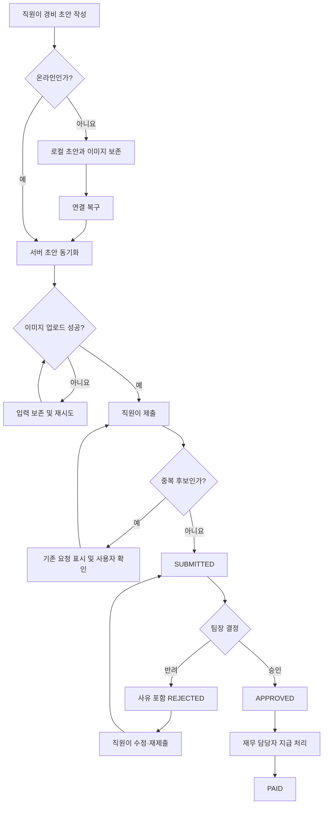

# 모바일 경비 승인 PRD

- 문서 상태: Draft
- 대상 출시: 1차 출시
- 플랫폼: 모바일 우선
- 목적: 직원의 경비 제출부터 팀장 승인, 재무 지급 완료까지의 흐름을 안전하게 처리한다.

## 1. 적용성

| 계약 항목 | 적용 여부 | 근거 |
|---|---|---|
| 문제·목표·비목표 | Required | 역할별 경비 처리 범위와 1차 출시 제외 범위가 명시됨 |
| 사용자·역할·권한 | Required | 직원, 팀장, 재무 담당자의 접근 범위가 다름 |
| 안정적인 요구사항 ID | Required | 구현·테스트·출시 추적이 필요함 |
| 화면 및 상태 정의 | Required | 모바일 사용자 화면과 오프라인·오류 상태가 존재함 |
| 사용자·시스템 흐름 | Required | 제출→승인/반려→지급의 다단계 생명주기 |
| 서버 권한·데이터 경계 | Required | 팀별 요청 격리와 역할 변경 시 재검증 필요 |
| 동시성 제어 | Required | 승인 중 직원 수정 가능성이 명시됨 |
| 오프라인 동기화 | Required | 연결 복구 후 초안 동기화가 핵심 요구사항 |
| 접근성 | Required | WCAG 2.2 AA 목표가 명시됨 |
| 수치형 성능 목표 | N/A | 현재 측정 근거가 없으며 측정 후 결정 예정 |
| 다중 통화 | N/A | 1차 출시 제외 |
| ERP 자동 연동 | N/A | 1차 출시 제외 |

## 2. 배경과 문제

직원은 모바일 환경에서 영수증을 촬영하고 경비를 제출해야 한다. 팀장은 자기 팀에서 발생한 요청만 검토해야 하며, 재무 담당자는 팀 승인까지 완료된 요청만 지급 처리할 수 있어야 한다.

모바일 네트워크 불안정, 이미지 업로드 실패, 반복 탭이나 재시도로 인한 중복 제출, 처리 도중의 권한 변경과 동시 수정 때문에 사용자가 인식하는 상태와 서버의 실제 상태가 달라질 수 있다. 따라서 단순한 화면 흐름뿐 아니라 서버 권한 검증, 멱등성, 버전 충돌 및 복구 동작이 필요하다.

## 3. 목표

- 직원이 영수증 사진, 금액, 카테고리를 입력해 경비를 제출할 수 있다.
- 오프라인에서도 초안을 작성하고 연결 복구 후 안전하게 동기화할 수 있다.
- 팀장은 자기 팀 소유 요청만 승인하거나 반려할 수 있다.
- 반려 시 사유를 필수로 기록한다.
- 재무 담당자는 팀 승인된 요청만 지급 완료로 변경할 수 있다.
- 중복 제출, 이미지 실패, 권한 변경 및 동시 수정에도 결과가 일관되어야 한다.
- 모든 중요 상태 변경을 추적할 수 있어야 한다.
- 핵심 사용자 흐름이 WCAG 2.2 AA를 충족하도록 설계하고 검증한다.

## 4. 비목표

- 다중 통화 입력·환산·환율 관리
- ERP 또는 회계 시스템 자동 연동
- 부분 승인 또는 부분 지급
- 여러 단계의 순차 승인
- 여러 장의 영수증을 하나의 경비에 첨부하는 기능
- 영수증 OCR 및 자동 금액·카테고리 추출
- 지급 취소, 환수 및 회계 분개
- 카테고리 관리용 관리자 화면
- 오프라인 상태에서의 승인·반려·지급 처리

## 5. 사용자와 역할

| 역할 | 권한 |
|---|---|
| 직원 | 자기 경비 초안 생성·수정·삭제, 제출, 자기 요청 조회 |
| 팀장 | 현재 관리 권한이 있는 팀 소유의 제출 요청 조회, 승인, 반려 |
| 재무 담당자 | 팀 승인된 전체 요청 조회, 지급 완료 처리 |
| 시스템 | 동기화, 중복 판정, 권한 재검증, 충돌 감지, 감사 기록 |

한 사용자가 여러 역할을 가질 수 있으나, 각 작업은 해당 작업에 필요한 권한으로 서버에서 독립적으로 검증한다.

## 6. 핵심 데이터와 상태

### 6.1 경비 요청 주요 필드

| 필드 | 설명 |
|---|---|
| `expenseId` | 서버가 발급한 경비 식별자 |
| `clientRequestId` | 클라이언트가 생성한 멱등성 식별자 |
| `employeeId` | 제출 직원 |
| `owningTeamId` | 제출 시점에 확정된 소유 팀 |
| `amount` | 양수 금액 |
| `currency` | 조직에 설정된 단일 기준 통화, 사용자 선택 불가 |
| `categoryId` | 활성 카테고리 |
| `receiptImage` | 업로드가 완료된 영수증 이미지 참조 |
| `status` | 요청 업무 상태 |
| `version` | 동시성 제어용 서버 버전 |
| `rejectionReason` | 반려 시 필수 |
| `createdAt`, `updatedAt` | 생성·수정 시각 |
| `submittedAt`, `approvedAt`, `rejectedAt`, `paidAt` | 상태 변경 시각 |
| `approvedBy`, `rejectedBy`, `paidBy` | 상태 변경 수행자 |

### 6.2 업무 상태

```text
LOCAL_DRAFT
  → SYNCING
  → SERVER_DRAFT
  → SUBMITTED
      → APPROVED
          → PAID
      → REJECTED
          → SERVER_DRAFT(직원이 수정 후 재제출)
```

`SYNC_FAILED`, `UPLOAD_FAILED`, `CONFLICT`, `ACCESS_REVOKED`는 업무 상태를 바꾸지 않는 사용자 표시·복구 상태다.

## 7. 기능 요구사항

| ID | 요구사항 | 우선순위 |
|---|---|---|
| FR-001 | 직원은 영수증 사진 1장, 금액, 카테고리를 포함한 초안을 생성한다. | Must |
| FR-002 | 금액은 조직 기준 단일 통화로 처리하며 통화 선택 UI를 제공하지 않는다. | Must |
| FR-003 | 영수증, 유효한 양수 금액, 활성 카테고리가 모두 있어야 제출할 수 있다. | Must |
| FR-004 | 직원은 자기 초안과 자기 제출 이력만 조회할 수 있다. | Must |
| FR-005 | 기기는 오프라인 상태에서도 초안과 영수증 로컬 사본을 저장한다. | Must |
| FR-006 | 연결 복구 시 인증이 유효하면 로컬 초안을 서버 초안으로 자동 동기화한다. 동기화만으로 제출되지는 않는다. | Must |
| FR-007 | 동기화 실패 시 로컬 원본을 보존하고 실패 원인과 재시도 동작을 제공한다. | Must |
| FR-008 | 이미지 업로드가 완료되지 않은 요청은 제출 상태로 전환하지 않는다. | Must |
| FR-009 | 이미지 업로드 실패 시 입력값을 보존하고 해당 이미지 업로드만 재시도할 수 있다. | Must |
| FR-010 | 동일한 `clientRequestId`의 재요청은 새 경비를 생성하지 않고 기존 결과를 반환한다. | Must |
| FR-011 | 서버는 별도 요청으로 보이는 잠재적 중복도 판정해 사용자에게 기존 요청을 제시하고 확인 없이 제출을 완료하지 않는다. | Must |
| FR-012 | 직원은 `SUBMITTED` 상태의 자기 요청을 결정 전까지 수정할 수 있으며, 수정할 때마다 `version`을 증가시킨다. | Must |
| FR-013 | `APPROVED` 또는 `PAID` 상태가 된 요청은 직원이 수정할 수 없다. | Must |
| FR-014 | 팀장은 자신이 현재 관리 권한을 가진 팀 소유의 `SUBMITTED` 요청만 조회한다. | Must |
| FR-015 | 팀장은 `SUBMITTED` 요청을 승인하거나 반려할 수 있다. | Must |
| FR-016 | 반려 사유는 공백을 제외한 내용이 있어야 하며 직원에게 표시한다. | Must |
| FR-017 | 승인·반려 요청에는 팀장이 화면에서 확인한 `version`을 포함한다. 서버 버전이 다르면 처리를 거부하고 최신 내용을 다시 검토하게 한다. | Must |
| FR-018 | 재무 담당자는 `APPROVED` 요청만 `PAID`로 변경할 수 있다. | Must |
| FR-019 | 지급 완료 처리도 현재 서버 상태와 `version`을 검증하며 같은 요청의 반복 처리는 하나의 결과만 만든다. | Must |
| FR-020 | 서버는 모든 읽기와 상태 변경에서 현재 역할과 팀 권한을 재검증한다. | Must |
| FR-021 | 화면을 연 뒤 권한이 제거되거나 팀이 변경된 사용자의 후속 작업은 거부하고 화면에서 해당 데이터를 제거한다. | Must |
| FR-022 | 생성, 제출, 수정, 승인, 반려, 재제출, 지급 및 실패한 권한 작업을 감사 기록으로 남긴다. | Must |
| FR-023 | 목록과 상세 화면은 업무 상태, 동기화 상태 및 사용 가능한 다음 행동을 구분해 표시한다. | Must |
| FR-024 | 카테고리는 서버에서 제공하는 활성 목록을 사용하며 비활성 카테고리로는 새 제출 또는 재제출할 수 없다. | Must |
| FR-025 | 반려된 요청은 반려 사유를 유지한 채 직원이 수정하여 새 버전으로 재제출할 수 있다. | Should |

## 8. 화면 정의

| 화면 | 주요 사용자 | 핵심 기능 |
|---|---|---|
| 내 경비 목록 | 직원 | 초안·제출·승인·반려·지급 상태 확인, 동기화 오류 확인 |
| 경비 작성/수정 | 직원 | 영수증 촬영·선택, 금액·카테고리 입력, 저장·제출 |
| 경비 상세 | 전 역할 | 권한 범위 내 상세 정보, 변경 이력, 가능한 다음 행동 |
| 팀 승인함 | 팀장 | 자기 팀의 제출 요청 목록과 검토 진입 |
| 승인 검토 | 팀장 | 영수증·금액·카테고리 확인, 승인 또는 사유 입력 후 반려 |
| 지급 대기 목록 | 재무 담당자 | 승인 완료 요청 조회 |
| 지급 상세 | 재무 담당자 | 승인 정보 확인 및 지급 완료 처리 |

실제 네이티브 경로명과 딥링크 규칙은 기술 설계에서 확정한다.

## 9. 사용자 표시 상태

| 화면 | 빈 상태 | 로딩 | 오류 | 성공 | 복구 |
|---|---|---|---|---|---|
| 내 경비 목록 | 경비 없음, 작성 CTA | 스켈레톤 또는 진행 표시 | 조회 실패 | 상태별 목록 | 다시 시도 |
| 경비 작성 | 신규 빈 폼 | 사진 처리·동기화 표시 | 검증·저장·업로드 실패 | 로컬/서버 저장 완료 | 입력 보존 후 재시도 |
| 이미지 영역 | 사진 없음 | 업로드 진행 | 업로드 실패 | 미리보기·완료 표시 | 재업로드 또는 교체 |
| 팀 승인함 | 처리할 요청 없음 | 목록 로딩 | 조회 실패·권한 상실 | 요청 목록 | 새로고침 또는 화면 종료 |
| 승인 검토 | 해당 없음 | 상세 로딩·처리 중 | 버전 충돌·권한 상실 | 승인/반려 완료 | 최신 버전 다시 불러오기 |
| 지급 대기 | 지급 대기 없음 | 목록 로딩 | 조회 실패 | 승인 요청 목록 | 다시 시도 |
| 지급 상세 | 해당 없음 | 처리 중 | 상태 충돌·권한 상실 | 지급 완료 | 최신 상태 확인 |
| 동기화 배너 | 미동기화 없음 | 동기화 중 | 일부/전체 실패 | 동기화 완료 | 항목별 또는 전체 재시도 |

## 10. 주요 흐름



## 11. 권한 및 데이터 경계

- 권한 판단은 클라이언트 표시 여부가 아니라 서버의 현재 권한 데이터를 기준으로 한다.
- 직원은 `employeeId`가 자기 자신인 요청만 읽거나 변경할 수 있다.
- 팀장은 요청의 `owningTeamId`에 대해 현재 관리 권한이 있을 때만 읽고 결정할 수 있다.
- 재무 담당자는 조직 범위의 승인 요청을 볼 수 있지만 지급 외의 팀장 결정을 대신할 수 없다.
- 요청의 소유 팀은 제출 시점에 고정한다. 직원이 이후 다른 팀으로 이동해도 기존 요청을 자동 이전하지 않는다.
- 팀장 권한이 제거되면 이미 열어 둔 상세 화면에서도 승인·반려가 실패해야 한다.
- API는 요청자가 전달한 `employeeId`, `teamId`, 상태 또는 역할 값을 신뢰하지 않고 인증 컨텍스트와 서버 데이터로 판정한다.
- 이미지 접근은 해당 경비 조회 권한과 동일하게 제한한다. 공개 URL을 제공하지 않는다.
- 승인·반려·지급은 조건부 상태 변경과 버전 검사를 한 원자적 작업으로 처리한다.
- 감사 기록에는 행위자, 대상, 이전/이후 상태, 버전, 시각, 결과를 포함한다. 반려 사유 접근 권한은 경비 상세 권한과 동일하다.

## 12. 동시성 및 예외 정책

### 승인 중 직원 수정

1. 팀장이 요청 버전 3을 열어본다.
2. 직원이 금액이나 영수증을 수정하여 버전 4가 된다.
3. 팀장이 버전 3으로 승인하면 서버는 충돌로 거부한다.
4. 팀장 화면은 최신 내용이 변경되었음을 알리고 버전 4를 다시 불러온다.
5. 팀장이 최신 내용을 검토한 뒤 다시 결정한다.

오래된 화면에서의 승인을 자동으로 최신 버전에 적용해서는 안 된다.

### 중복 제출

- 네트워크 재시도나 반복 탭으로 동일한 `clientRequestId`가 전달되면 기존 결과를 반환한다.
- 별도 ID지만 중복 후보로 판정된 경우 기존 요청의 상태와 제출 시점을 제시한다.
- 사용자가 기존 요청을 열거나, 정당한 별도 경비임을 확인한 뒤 제출을 계속할 수 있게 한다.
- 중복 확인을 우회해 제출한 사실은 감사 기록에 남긴다.

### 권한 변경

- 목록 조회 이후라도 승인·반려·지급 시점에 권한을 다시 검증한다.
- 권한 상실 응답을 받은 클라이언트는 민감 데이터를 캐시 화면에서 제거하고 권한 변경 안내를 표시한다.
- 직원 권한이 상실된 상태의 로컬 초안은 자동 제출하지 않는다. 로컬 데이터 처리 정책에 따라 보존 또는 제거한다.

## 13. 비기능 요구사항

| ID | 영역 | 요구사항 |
|---|---|---|
| NFR-001 | 접근성 | 핵심 흐름은 WCAG 2.2 AA 기준으로 설계하고 출시 전 점검한다. |
| NFR-002 | 접근성 | 모든 입력은 프로그램 방식으로 연결된 레이블, 오류 설명 및 상태 메시지를 제공한다. |
| NFR-003 | 접근성 | 색상만으로 상태를 표현하지 않고 텍스트 또는 아이콘 레이블을 함께 제공한다. |
| NFR-004 | 접근성 | 승인·반려·지급, 업로드 재시도 및 충돌 복구를 스크린 리더와 키보드/스위치 입력으로 수행할 수 있어야 한다. |
| NFR-005 | 접근성 | 영수증 확대 시 핵심 조작과 정보가 가려지지 않아야 한다. |
| NFR-006 | 보안 | 전송 및 저장되는 영수증과 경비 데이터는 조직의 기존 보안 정책을 따른다. |
| NFR-007 | 복원력 | 앱 종료나 네트워크 단절 후에도 저장 완료된 로컬 초안과 동기화 상태를 복구한다. |
| NFR-008 | 관찰성 | 업로드·동기화·제출·승인·지급 실패를 원인 유형별로 관찰할 수 있어야 한다. |
| NFR-009 | 성능 | 출시 전 실제 또는 대표 환경에서 목록 로딩, 상세 로딩, 이미지 업로드, 동기화 완료, 상태 변경 응답 시간을 측정한다. |
| NFR-010 | 개인정보 | 권한 상실과 로그아웃 시 로컬에 남은 영수증 및 경비 정보의 접근을 차단한다. |

성능 목표 수치는 기준 측정 후 제품·모바일·백엔드 담당자가 함께 결정한다. 측정 전 임의 SLA를 출시 기준으로 사용하지 않는다.

## 14. 인수 기준

| ID | 연결 요구사항 | Given | When | Then | 검증 |
|---|---|---|---|---|---|
| AC-001 | FR-001~003 | 직원이 작성 화면에 있음 | 영수증, 유효 금액, 활성 카테고리를 입력함 | 제출 버튼이 활성화되고 서버가 요청을 접수함 | E2E |
| AC-002 | FR-003 | 필수값이 누락됨 | 제출을 시도함 | 누락 필드별 오류가 표시되고 요청은 생성되지 않음 | UI/API |
| AC-003 | FR-005~007 | 직원이 오프라인임 | 초안을 저장하고 앱을 재실행함 | 입력과 이미지가 복원되며 연결 복구 후 서버 초안으로 동기화됨 | 오프라인 E2E |
| AC-004 | FR-006 | 로컬 초안이 동기화됨 | 자동 동기화가 완료됨 | 상태는 서버 초안이며 자동으로 제출되지 않음 | 통합 테스트 |
| AC-005 | FR-008~009 | 이미지 업로드가 실패함 | 제출 또는 재시도를 수행함 | 제출 상태로 전환되지 않고 입력이 보존되며 이미지 재시도가 가능함 | 장애 주입 |
| AC-006 | FR-010 | 동일 `clientRequestId` 요청이 이미 처리됨 | 같은 요청을 반복 전송함 | 경비가 하나만 존재하고 기존 결과가 반환됨 | API 통합 |
| AC-007 | FR-011 | 잠재 중복 요청이 존재함 | 별도 ID로 유사 요청을 제출함 | 기존 요청이 표시되고 명시적 확인 전에는 제출되지 않음 | 통합 테스트 |
| AC-008 | FR-014~016 | 팀장에게 자기 팀 제출 요청이 있음 | 승인 또는 사유를 입력해 반려함 | 요청이 각각 승인 또는 반려 상태가 되고 행위자가 기록됨 | E2E |
| AC-009 | FR-014, FR-020 | 다른 팀 요청이 존재함 | 팀장이 목록·상세 API에 직접 접근함 | 서버가 데이터를 반환하지 않고 접근을 거부함 | 권한 API 테스트 |
| AC-010 | FR-016 | 팀장이 반려 사유를 비우거나 공백만 입력함 | 반려를 시도함 | 반려되지 않고 사유 입력 오류가 표시됨 | UI/API |
| AC-011 | FR-012, FR-017 | 팀장이 버전 3을 열고 직원이 버전 4로 수정함 | 팀장이 버전 3으로 결정함 | 처리가 거부되고 최신 버전 재검토 안내가 표시됨 | 동시성 통합 |
| AC-012 | FR-013 | 요청이 승인 또는 지급 완료 상태임 | 직원이 수정 API를 호출함 | 서버가 수정을 거부하고 데이터가 변하지 않음 | API |
| AC-013 | FR-018~019 | 요청이 승인 상태이며 사용자에게 재무 권한이 있음 | 지급 완료를 처리함 | 요청이 한 번만 지급 완료 상태가 되고 행위·시각이 기록됨 | E2E/API |
| AC-014 | FR-018 | 요청이 제출 또는 반려 상태임 | 재무 담당자가 지급 API를 호출함 | 서버가 잘못된 상태 전이를 거부함 | API |
| AC-015 | FR-020~021 | 사용자가 화면을 연 뒤 역할 또는 팀 권한을 잃음 | 상태 변경을 시도함 | 서버가 거부하고 클라이언트가 데이터를 제거한 뒤 안내함 | 권한 변경 E2E |
| AC-016 | FR-022 | 경비 상태 변경이 발생함 | 감사 기록을 조회함 | 행위자, 이전/이후 상태, 버전, 시각 및 결과가 확인됨 | 통합 테스트 |
| AC-017 | NFR-001~005 | 핵심 흐름이 구현됨 | 자동 및 수동 접근성 점검을 수행함 | 확인된 WCAG 2.2 AA 위반이 출시 차단 기준에 따라 처리됨 | 접근성 감사 |
| AC-018 | NFR-009 | 출시 후보 빌드가 준비됨 | 대표 환경에서 성능을 측정함 | 정해진 지표별 기준값이 기록되고 목표 수치 결정 자료가 마련됨 | 성능 측정 |

## 15. 합리적 가정

아래는 구현을 진행하기 위해 적용하는 가역적 기본 가정이다.

- 조직에는 하나의 기준 통화가 설정되어 있으며 직원은 통화를 선택하지 않는다.
- 경비 한 건에는 영수증 이미지 한 장만 첨부한다.
- 오프라인에서는 작성과 로컬 저장만 지원하고 승인·반려·지급은 온라인에서만 가능하다.
- 동기화 완료는 제출 완료를 의미하지 않는다. 직원이 서버 초안을 확인한 후 직접 제출한다.
- 제출 상태에서도 결정 전까지 직원 수정이 가능하며 버전 충돌로 오래된 승인을 방지한다.
- 제출 시점의 팀을 요청 소유 팀으로 고정한다.
- 반려된 요청은 직원이 수정해 재제출할 수 있다.
- 팀장 승인 이후에는 직원 수정이 불가능하다.
- 지급 완료는 1차 출시에서 최종 상태이며 앱에서 취소하지 않는다.
- 중복 후보는 무조건 삭제하지 않고 사용자 확인을 거친다.
- 카테고리 목록과 조직 기준 통화는 기존 조직 설정 또는 백엔드 설정으로 제공된다.

## 16. 열린 결정

| ID | 결정 필요 사항 | 영향 | 결정 시점/담당 |
|---|---|---|---|
| OD-001 | 조직의 1차 출시 기준 통화 | 금액 포맷, 소수점 처리, 서버 검증 | 개발 착수 전 / 제품·재무 |
| OD-002 | 금액 상·하한 및 소수 자릿수 | 입력 검증, 데이터 타입 | 개발 착수 전 / 재무·백엔드 |
| OD-003 | 허용 이미지 형식, 최대 용량, 압축 정책 | 업로드 UX, 저장 비용, 보안 | API 확정 전 / 모바일·백엔드·보안 |
| OD-004 | 잠재 중복의 비교 항목과 검색 범위 | 오탐·미탐, 조회 성능 | 상세 설계 전 / 제품·백엔드 |
| OD-005 | 잠재 중복 제출을 경고 후 허용할지 관리자 해제가 필요한지 | 정상 반복 경비 처리 | QA 전 / 재무·제품 |
| OD-006 | 직원의 제출 후 수정 허용 정책을 유지할지 철회 방식으로 바꿀지 | 승인 충돌 UX, 감사 정책 | 상세 설계 전 / 제품·재무 |
| OD-007 | 직원 이동·팀 해체 시 기존 요청의 담당 팀 | 미처리 요청의 소유권 | 출시 전 / 인사·재무 |
| OD-008 | 권한 상실·로그아웃 시 로컬 초안 보존 기간과 삭제 정책 | 개인정보 보호, 데이터 복구 | 보안 검토 전 / 보안·제품 |
| OD-009 | 감사 기록 보존 기간 및 조회 가능 역할 | 규정 준수, 저장 비용 | 출시 전 / 법무·보안·재무 |
| OD-010 | 성능 목표 수치와 대표 측정 환경 | 출시 게이트 | 기준 측정 후 / 제품·모바일·백엔드 |
| OD-011 | WCAG 2.2 AA 점검 방식과 출시 차단 심각도 | 접근성 출시 판단 | QA 계획 수립 시 / 제품·QA |
| OD-012 | 팀장 부재 시 위임 승인 지원 여부 | 운영 연속성 | 1차 범위 확정 전 / 제품·운영 |

OD-012가 지원으로 결정되면 위임자, 적용 기간, 팀 범위, 감사 기록을 별도 요구사항으로 추가해야 한다. 그렇지 않으면 1차 출시에서는 지원하지 않는다.

## 17. 위험과 완화

| 위험 | 영향 | 완화 |
|---|---|---|
| 이미지 업로드 실패로 입력 손실 | 재작성 및 이탈 | 입력·이미지 로컬 보존, 업로드 분리 재시도 |
| 네트워크 재시도로 중복 생성 | 중복 지급 | `clientRequestId` 멱등성, 중복 후보 확인 |
| 직원 수정 후 오래된 내용 승인 | 잘못된 승인 | 버전 기반 조건부 상태 변경 |
| 권한 변경이 늦게 반영됨 | 다른 팀 정보 노출 | 모든 읽기·쓰기에서 서버 권한 재검증 |
| 장기간 남은 로컬 영수증 | 개인정보 노출 | 암호화 저장, 로그아웃·권한 상실 정책 확정 |
| 중복 판정 오탐 | 정상 경비 제출 방해 | 기존 요청 표시, 명시적 확인 또는 예외 절차 |
| 성능 목표 미정 | 출시 직전 품질 논쟁 | 조기 계측 후 목표와 출시 게이트 확정 |
| 팀 이동·해체 후 승인 주체 불명확 | 요청 장기 미처리 | 소유권 운영 정책 확정 및 관리자 처리 절차 마련 |

## 18. 출시 계획

| 단계 | 요구사항 ID | 검증 가능한 완료 조건 |
|---|---|---|
| 1. 데이터·권한 기반 | FR-002, FR-004, FR-020~024 | 상태 전이, 소유권, 역할 및 감사 API 테스트 통과 |
| 2. 직원 작성·제출 | FR-001~003, FR-008~013 | 온라인 작성, 업로드, 제출, 중복 및 수정 흐름 E2E 통과 |
| 3. 오프라인 동기화 | FR-005~007 | 단절·앱 재실행·연결 복구 시 데이터 보존과 동기화 검증 |
| 4. 승인·지급 | FR-014~019, FR-025 | 팀 격리, 반려 사유, 충돌, 승인 및 지급 E2E 통과 |
| 5. 품질 검증 | NFR-001~010 | 접근성 감사, 보안 검토, 장애 복구 및 성능 기준 측정 완료 |
| 6. 제한 출시 | 전체 Must | 실제 운영 역할로 핵심 흐름 검증, 차단 결함 없음, 열린 결정 중 출시 필수 항목 종결 |

파일을 만들지 않았으므로 PRD 파일 검증기는 실행하지 않았다.