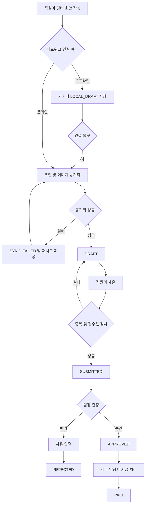

# 모바일 경비 승인 PRD

## 1. 문서 개요

- 기능명: 모바일 경비 승인
- 문서 상태: Draft
- 대상 출시: 1차 출시(MVP)
- 목적: 직원의 경비 제출부터 팀장 승인, 재무 담당자의 지급 완료 처리까지 모바일에서 추적 가능한 단일 흐름으로 제공한다.

## 2. Applicability

| Contract | Required / N/A | 근거 |
|---|---|---|
| 역할·권한 계약 | Required | 직원, 팀장, 재무 담당자의 접근 범위와 행위가 다름 |
| 화면·상태 정의 | Required | 제출, 승인, 반려, 지급 처리 등 사용자 화면이 존재함 |
| 라이프사이클 정의 | Required | 초안부터 지급 완료까지 다단계 상태 전이가 존재함 |
| 오프라인·동기화 계약 | Required | 오프라인 초안 작성과 연결 복구 후 동기화가 명시됨 |
| 동시성 계약 | Required | 승인 중 동시 수정과 중복 제출을 처리해야 함 |
| 파일 업로드 계약 | Required | 영수증 이미지 업로드와 실패 복구가 필요함 |
| 서버 권한 검증 | Required | 팀 범위 및 역할 변경을 UI 숨김만으로 보장할 수 없음 |
| 접근성 계약 | Required | WCAG 2.2 AA가 명시됨 |
| 수치형 성능 목표 | N/A | 현재 측정값이 없으며 측정 후 목표를 결정하기로 함 |
| 다중 통화 | N/A | 1차 출시 범위에서 제외됨 |
| ERP 자동 연동 | N/A | 1차 출시 범위에서 제외됨 |

## 3. 배경과 문제

경비 신청이 이미지, 금액 정보, 승인 기록 및 지급 상태로 분산되면 다음 문제가 발생한다.

- 직원이 제출 및 처리 상태를 확인하기 어렵다.
- 팀장이 자기 팀의 요청만 안전하게 처리하기 어렵다.
- 네트워크가 불안정한 모바일 환경에서 작성 내용이 유실될 수 있다.
- 재시도나 연속 탭으로 같은 요청이 중복 생성될 수 있다.
- 승인 화면을 열어둔 사이 요청이 수정되면 잘못된 버전을 승인할 수 있다.
- 역할 또는 소속 변경 후 기존 화면에 남아 있는 권한이 오용될 수 있다.

본 기능은 경비 요청의 상태와 책임자를 명확히 하고, 오프라인·업로드 실패·동시성·권한 변경을 포함한 예외 상황에서도 데이터 일관성을 유지해야 한다.

## 4. 목표

- 직원이 모바일에서 영수증 사진, 금액, 카테고리를 입력해 경비를 제출할 수 있다.
- 오프라인에서도 초안을 작성하고, 연결 복구 후 안전하게 동기화할 수 있다.
- 팀장이 현재 권한 범위 내 요청만 승인 또는 반려할 수 있다.
- 반려 시 사유를 반드시 기록하고 직원이 확인할 수 있다.
- 재무 담당자가 승인된 요청을 지급 완료로 표시할 수 있다.
- 중복 제출, 이미지 업로드 실패, 권한 변경 및 동시 수정으로 인한 잘못된 처리를 방지한다.
- 누가 언제 무엇을 변경했는지 추적 가능한 이력을 보존한다.
- 주요 사용자 흐름이 WCAG 2.2 AA를 충족한다.

## 5. 비목표

1차 출시에는 다음을 포함하지 않는다.

- 다중 통화 입력, 환율 계산 및 환차손익 처리
- ERP·회계 시스템 자동 등록 또는 지급 자동 실행
- 분할 승인, 다단계 승인, 대결 승인
- 여러 영수증을 하나의 경비 요청에 묶는 기능
- 지급 완료 취소 또는 회계 정정 워크플로
- 영수증 OCR을 통한 자동 입력
- 정책 위반 자동 판정
- 푸시·이메일 알림
- 경비 한도 및 예산 관리
- 관리자용 카테고리 설정 화면

## 6. 사용자, 역할 및 권한

| 역할 | 조회 범위 | 허용 행위 | 금지 행위 |
|---|---|---|---|
| 직원 | 자신이 작성한 요청 | 초안 작성·수정·삭제, 제출, 제출 상태 및 반려 사유 조회 | 타인의 요청 조회, 승인·반려, 지급 처리 |
| 팀장 | 자신이 관리할 권한이 있는 팀의 제출 요청 | 요청 조회, 승인, 반려 및 반려 사유 입력 | 다른 팀 요청 처리, 지급 완료 처리 |
| 재무 담당자 | 승인된 요청 및 지급 완료 요청 | 승인 요청 조회, 지급 완료 표시 | 미승인 요청 지급 처리, 승인·반려 |
| 복수 역할 사용자 | 각 역할에 허용된 범위의 합집합 | 행위별 서버 권한 검증 후 실행 | 역할 하나만으로 다른 역할의 데이터 경계를 우회 |

모든 권한은 API 요청 시점에 서버가 다시 검증한다. 화면에 버튼이 보이지 않는 것만으로 권한을 보장해서는 안 된다.

## 7. 상태 모델

### 7.1 경비 요청 상태

| 상태 | 설명 | 허용되는 다음 상태 |
|---|---|---|
| `LOCAL_DRAFT` | 기기에만 저장된 미동기화 초안 | `SYNCING`, 삭제 |
| `SYNCING` | 서버와 초안 또는 이미지를 동기화하는 중 | `DRAFT`, `SYNC_FAILED` |
| `SYNC_FAILED` | 동기화 또는 이미지 업로드 실패 | `SYNCING`, `LOCAL_DRAFT`, 삭제 |
| `DRAFT` | 서버에 저장됐지만 제출되지 않은 초안 | `SUBMITTED`, 삭제 |
| `SUBMITTED` | 팀장 결정을 기다리는 요청 | `APPROVED`, `REJECTED` |
| `APPROVED` | 팀장이 승인한 요청 | `PAID` |
| `REJECTED` | 팀장이 반려한 종결 요청 | 없음 |
| `PAID` | 재무 담당자가 지급 완료로 표시한 종결 요청 | 없음 |

`SYNCING`과 `SYNC_FAILED`는 클라이언트에 표시되는 동기화 상태이며, 서버의 업무 상태와 분리해 관리할 수 있다.

### 7.2 상태별 변경 가능 범위

| 상태 | 직원 수정 | 팀장 처리 | 재무 처리 |
|---|---|---|---|
| `LOCAL_DRAFT` / `DRAFT` / `SYNC_FAILED` | 가능 | 불가 | 불가 |
| `SUBMITTED` | 조건부 가능¹ | 승인·반려 가능 | 불가 |
| `APPROVED` | 불가 | 재처리 불가 | 지급 완료 가능 |
| `REJECTED` | 불가 | 재처리 불가 | 불가 |
| `PAID` | 불가 | 불가 | 재처리 불가 |

¹ 1차 출시의 잠정 정책은 제출 후에도 팀장 결정 전까지 수정할 수 있도록 하는 것이다. 수정 시 요청 버전은 증가하고 기존 팀장 화면의 승인·반려는 충돌 처리된다. 이 정책은 열린 결정 OD-01의 확정 대상이다.

## 8. 핵심 사용자 흐름

## 9. 기능 요구사항

| ID | 요구사항 | 우선순위 |
|---|---|---|
| FR-001 | 직원은 영수증 이미지 1장, 금액, 카테고리를 포함하는 경비 초안을 생성할 수 있어야 한다. | P0 |
| FR-002 | 금액은 0보다 커야 하며 조직에 설정된 단일 기준 통화로 저장·표시되어야 한다. | P0 |
| FR-003 | 직원은 활성 카테고리 목록에서 카테고리를 하나 선택해야 한다. 제출 당시 카테고리 이름 또는 식별자는 요청 이력에 보존되어야 한다. | P0 |
| FR-004 | 필수값 또는 영수증 업로드가 완료되지 않은 초안은 제출할 수 없어야 하며, 누락 항목을 필드 단위로 안내해야 한다. | P0 |
| FR-005 | 직원은 온라인 상태에서 초안을 서버에 저장하고 다시 열어 수정하거나 삭제할 수 있어야 한다. | P0 |
| FR-006 | 직원은 오프라인 상태에서도 초안과 영수증 이미지를 기기에 저장할 수 있어야 한다. 오프라인 상태에서는 서버 제출이 아닌 로컬 저장임을 표시해야 한다. | P0 |
| FR-007 | 연결이 복구되면 로컬 초안 동기화를 자동으로 시도하고, 사용자가 현재 상태와 실패 여부를 확인할 수 있어야 한다. | P0 |
| FR-008 | 자동 동기화 실패 시 초안과 이미지를 보존하고 수동 재시도 기능을 제공해야 한다. | P0 |
| FR-009 | 이미지 업로드 실패는 요청 데이터 저장 실패와 구분해 표시해야 하며, 이미 입력한 금액과 카테고리를 유실하지 않고 이미지 업로드만 재시도할 수 있어야 한다. | P0 |
| FR-010 | 각 초안은 클라이언트에서 생성한 고유 ID를 사용해야 하며, 동일 ID의 저장·제출 재시도는 하나의 서버 요청만 생성해야 한다. | P0 |
| FR-011 | 서버는 동일 직원이 이미 제출한 요청과 동일한 영수증 이미지 해시를 다시 제출하려는 경우 중복 후보로 차단하고 기존 요청으로 이동할 수 있게 해야 한다. | P0 |
| FR-012 | 팀장은 자신이 처리 권한을 가진 팀의 `SUBMITTED` 요청 목록과 상세만 조회할 수 있어야 한다. | P0 |
| FR-013 | 팀장은 `SUBMITTED` 요청을 승인할 수 있어야 하며, 성공 시 상태를 `APPROVED`로 변경하고 처리자와 처리 시각을 기록해야 한다. | P0 |
| FR-014 | 팀장은 `SUBMITTED` 요청을 반려할 수 있어야 하며, 공백을 제외한 1자 이상 500자 이하의 반려 사유를 입력해야 한다. | P0 |
| FR-015 | 직원은 자신의 요청 상태와 반려 사유를 조회할 수 있어야 한다. | P0 |
| FR-016 | 재무 담당자는 `APPROVED` 요청 목록과 상세를 조회하고 요청을 `PAID`로 변경할 수 있어야 한다. | P0 |
| FR-017 | 지급 완료 처리 시 처리자와 서버 기준 처리 시각을 기록해야 한다. 실제 계좌 지급이나 ERP 전송은 수행하지 않는다. | P0 |
| FR-018 | 승인, 반려 및 지급 완료 명령은 요청 버전을 포함해야 한다. 서버 버전이 달라진 경우 명령을 적용하지 않고 최신 데이터 재조회 안내를 반환해야 한다. | P0 |
| FR-019 | 직원이 `SUBMITTED` 요청을 수정하면 요청 버전이 증가해야 한다. 이전 버전을 보고 있던 팀장의 승인·반려 명령은 실패해야 한다. | P0 |
| FR-020 | 동일 요청에 승인·반려·지급 명령이 동시에 들어오면 서버는 최초로 유효하게 확정된 상태 전이 하나만 반영해야 한다. 후속 요청은 현재 상태를 반환해야 한다. | P0 |
| FR-021 | 역할 또는 팀 권한이 변경된 사용자의 다음 조회·처리 요청부터 변경된 권한을 적용해야 한다. 캐시된 화면에서 실행한 명령도 서버가 거부해야 한다. | P0 |
| FR-022 | 권한 상실로 서버가 명령을 거부하면 사용자가 입력 중이던 반려 사유 등 로컬 입력을 즉시 삭제하지 않고, 권한 변경 안내와 안전한 화면 이동을 제공해야 한다. | P0 |
| FR-023 | 요청 생성, 제출, 수정, 승인, 반려, 지급 완료 및 실패한 상태 전이 시도에 대해 행위자, 시각, 대상 요청, 이전·이후 상태 또는 실패 사유를 감사 기록으로 남겨야 한다. | P0 |
| FR-024 | 종결 상태인 `APPROVED`, `REJECTED`, `PAID`의 직원 수정과 이미 완료된 상태 전이의 반복 실행을 차단해야 한다. | P0 |
| FR-025 | 로그아웃 또는 계정 변경 시 다른 계정이 이전 사용자의 로컬 초안과 영수증을 볼 수 없어야 한다. | P0 |

## 10. 화면 및 라우트

경로는 논리적 식별자이며 실제 모바일 내비게이션 구조에 맞게 변경할 수 있다.

| 화면 | 논리적 경로 | 주요 사용자 | 핵심 기능 |
|---|---|---|---|
| 내 경비 목록 | `/expenses` | 직원 | 상태별 요청 및 동기화 상태 조회 |
| 경비 작성 | `/expenses/new` | 직원 | 이미지, 금액, 카테고리 입력 |
| 경비 상세·수정 | `/expenses/{id}` | 직원 | 초안 수정, 상태 및 반려 사유 조회 |
| 팀 승인함 | `/team/expenses` | 팀장 | 처리 가능한 `SUBMITTED` 목록 |
| 팀 승인 상세 | `/team/expenses/{id}` | 팀장 | 승인 또는 사유 입력 후 반려 |
| 지급 대상 목록 | `/finance/expenses` | 재무 담당자 | `APPROVED` 및 `PAID` 조회 |
| 지급 상세 | `/finance/expenses/{id}` | 재무 담당자 | 지급 완료 표시 및 처리 정보 조회 |

역할이 없는 화면으로 직접 진입하면 데이터를 노출하지 않고 접근 불가 상태를 표시한 뒤 허용된 화면으로 이동시킨다.

## 11. 사용자 표시 상태 매트릭스

| Surface | Empty | Loading | Error | Success | Recovery |
|---|---|---|---|---|---|
| 내 경비 목록 | 작성된 경비 없음, 작성 CTA | 목록 스켈레톤 또는 진행 표시 | 재조회 실패 안내 | 요청 및 상태 표시 | 다시 시도 |
| 경비 작성 | 빈 입력 폼 | 이미지 처리·저장 진행 | 필드 오류 또는 저장 실패 | 초안 저장/제출 완료 | 입력 유지, 실패 항목 재시도 |
| 오프라인 초안 | 로컬 초안 없음 | 동기화 중 | `SYNC_FAILED`와 원인 표시 | 서버 초안과 연결됨 | 수동 재시도 |
| 이미지 업로드 | 이미지 미선택 | 업로드 진행률 또는 진행 상태 | 이미지 업로드 실패 | 미리보기 및 완료 표시 | 이미지 재선택/재업로드 |
| 팀 승인함 | 처리할 요청 없음 | 목록 로딩 | 권한 또는 네트워크 오류 | 요청 목록 표시 | 권한 재검증, 다시 시도 |
| 승인 상세 | 해당 요청 없음/접근 불가 | 최신 버전 로딩 | 권한 상실·버전 충돌·이미 처리됨 | 승인 또는 반려 완료 | 최신 데이터 다시 불러오기 |
| 지급 대상 | 지급 대상 없음 | 목록 로딩 | 권한 또는 네트워크 오류 | 승인 요청 표시 | 다시 시도 |
| 지급 처리 | 접근 불가 또는 대상 아님 | 처리 중 | 버전 충돌·이미 처리됨 | 지급 완료 표시 | 최신 상태 확인 |

## 12. 동기화·중복·동시성 규칙

### 12.1 오프라인 동기화

- 오프라인 초안에는 계정 식별자, 클라이언트 초안 ID, 로컬 수정 시각 및 동기화 상태를 연결한다.
- 전송 순서는 요청 메타데이터 저장과 이미지 업로드가 모두 성공해야 제출 가능 상태가 되도록 보장한다.
- 앱 종료나 네트워크 단절이 발생해도 로컬 초안을 보존한다.
- 같은 클라이언트 초안 ID의 재전송은 새 경비를 만들지 않는다.
- 같은 서버 초안을 여러 기기에서 수정해 서버 버전이 달라졌다면 자동으로 덮어쓰지 않는다. 최신 서버본과 로컬본이 충돌했음을 표시하고 사용자가 보존할 버전을 선택하게 한다.
- 충돌 해결 UI의 상세 방식은 OD-04에서 확정한다.

### 12.2 중복 판정

중복은 다음 두 종류로 분리한다.

1. 기술적 중복: 네트워크 재시도, 더블 탭 또는 앱 재실행으로 동일 명령이 반복된 경우  
   → 클라이언트 요청 ID 및 제출 idempotency key로 기존 결과를 반환한다.

2. 업무상 중복: 동일 직원이 같은 영수증 이미지를 다른 초안 ID로 제출한 경우  
   → 이미지 콘텐츠 해시를 기준으로 기존 `SUBMITTED`, `APPROVED` 또는 `PAID` 요청이 있으면 제출을 차단하고 해당 요청을 안내한다.

삭제된 초안과 실패한 미제출 초안은 업무상 중복 판정 대상에서 제외한다. 반려된 요청을 다시 제출할 수 있는지 여부는 OD-02에서 확정한다.

### 12.3 동시 수정

- 모든 서버 요청은 증가하는 `version` 값을 가진다.
- 수정 및 상태 전이 명령은 사용자가 확인한 `version`을 조건으로 실행한다.
- 버전 불일치 시 HTTP 의미상 충돌 응답 또는 동등한 도메인 오류를 반환하며 변경을 반영하지 않는다.
- 클라이언트는 “요청 내용이 변경되었습니다”를 표시하고 최신 내용을 다시 불러오게 한다.
- 승인과 반려가 동시에 실행된 경우 하나만 성공하며 나머지는 최신 종결 상태를 표시한다.

## 13. 최소 데이터 계약

| 엔터티 | 필수 항목 |
|---|---|
| ExpenseRequest | 요청 ID, 클라이언트 초안 ID, 직원 ID, 제출 팀 ID, 금액, 통화, 카테고리 ID/표시명, 영수증 파일 참조 및 해시, 상태, 버전, 생성·수정·제출 시각 |
| Decision | 요청 ID, 결정 유형, 팀장 ID, 반려 사유, 결정 시각, 처리한 요청 버전 |
| PaymentCompletion | 요청 ID, 재무 담당자 ID, 지급 완료 시각 |
| AuditEvent | 이벤트 ID, 요청 ID, 행위자 ID, 행위 유형, 이전·이후 상태, 대상 버전, 결과, 실패 사유, 서버 시각 |

금액은 부동소수점이 아닌 소수 또는 최소 화폐 단위 기반의 정확한 형식으로 저장한다.

## 14. 권한 및 데이터 경계

- 직원 소유권은 인증된 사용자 ID와 요청의 직원 ID를 서버에서 비교한다.
- 팀장 조회 및 처리 범위는 요청의 제출 팀과 사용자가 현재 관리할 수 있는 팀 범위를 서버에서 비교한다.
- 재무 담당자 권한은 현재 역할을 서버에서 검증하고, `APPROVED` 또는 `PAID` 요청만 반환한다.
- 목록 API뿐 아니라 상세 조회, 이미지 접근, 수정 및 상태 전이 API 모두 동일한 데이터 경계를 적용한다.
- 영수증 파일 URL만 알아내 다른 요청의 이미지를 조회할 수 없어야 한다.
- 역할이나 팀 권한이 철회되면 새 요청부터 즉시 적용한다. 이미 열린 화면은 다음 API 호출에서 접근 불가로 전환한다.
- 감사 기록은 일반 직원 또는 팀장이 수정하거나 삭제할 수 없어야 한다.
- 접근 거부 응답은 권한이 없는 요청의 존재 여부나 민감한 내용을 불필요하게 노출하지 않아야 한다.

## 15. 비기능 요구사항

### 15.1 접근성

- 주요 제출·승인·반려·지급 흐름은 WCAG 2.2 AA를 목표로 한다.
- 모든 입력은 시각적 레이블과 프로그램적으로 연결된 접근 가능한 이름을 가진다.
- 오류는 색상에만 의존하지 않고 텍스트와 상태로 전달한다.
- 키보드 또는 보조기술만으로 모든 동작을 수행할 수 있어야 한다.
- 포커스 순서와 포커스 표시를 유지하고, 오류 발생 시 적절한 위치로 포커스를 이동한다.
- 이미지 미리보기와 삭제·재업로드 버튼에 의미 있는 접근성 레이블을 제공한다.
- 동기화, 업로드 및 처리 상태 변경은 스크린 리더 사용자가 인지할 수 있어야 한다.
- 반려 사유와 충돌 메시지는 해당 요청 및 조치와 명확히 연결되어야 한다.

### 15.2 보안 및 개인정보

- 영수증 이미지와 경비 데이터는 인증된 연결을 통해 전송한다.
- 서버 및 로컬 저장은 조직의 기존 인증·암호화·데이터 보존 정책을 따른다.
- 로그에 영수증 이미지, 반려 사유 전체 또는 인증 토큰을 기록하지 않는다.
- 로컬 초안은 계정별로 격리하고 로그아웃 후 다른 계정에 노출하지 않는다.
- 이미지 파일명이나 메타데이터를 신뢰해 실행 가능한 콘텐츠로 처리해서는 안 된다.

### 15.3 신뢰성

- 제출·승인·반려·지급 완료 명령은 재시도되어도 동일 결과를 유지해야 한다.
- 이미지 업로드 실패가 텍스트 입력 또는 로컬 초안의 유실로 이어져서는 안 된다.
- 서버 시각을 업무 상태 전이의 기준 시각으로 사용한다.

### 15.4 성능 측정 계획

수치 목표는 초기 측정 후 확정한다. 출시 후보 단계에서 다음을 측정한다.

| 지표 | 측정 구간 | 담당 | 목표 확정 시점 |
|---|---|---|---|
| 경비 목록 표시 지연 | 화면 진입부터 주요 콘텐츠 표시까지 | 모바일·백엔드 담당 | 베타 측정 완료 후 |
| 이미지 업로드 소요 및 실패율 | 업로드 시작부터 서버 확정까지 | 모바일·백엔드 담당 | 대표 네트워크별 측정 후 |
| 제출·승인·지급 처리 지연 | 명령 시작부터 결과 표시까지 | 백엔드 담당 | 출시 후보 부하 측정 후 |
| 동기화 성공률 | 연결 복구 후 초안 동기화 결과 | 모바일 담당 | 내부 베타 종료 후 |

성능 수치가 확정되기 전에도 측정 이벤트와 구간 정의는 구현 범위에 포함한다. 구체적인 분석 도구 및 데이터 보존 기간은 별도 결정한다.

## 16. 인수 조건

| ID | 연결 요구사항 | Given | When | Then | 검증 |
|---|---|---|---|---|---|
| AC-001 | FR-001~004 | 직원이 필수값을 모두 입력하고 이미지 업로드를 완료함 | 제출함 | 요청이 한 건 생성되고 `SUBMITTED`가 됨 | API·E2E |
| AC-002 | FR-004 | 이미지, 금액 또는 카테고리가 누락됨 | 제출함 | 제출되지 않고 누락 필드별 오류가 표시됨 | UI·E2E |
| AC-003 | FR-006~008 | 직원이 오프라인에서 초안을 작성함 | 저장 후 앱을 재실행함 | 입력값과 이미지가 유지되고 로컬 초안으로 표시됨 | 모바일 통합 |
| AC-004 | FR-007 | 미동기화 초안이 있고 연결이 복구됨 | 자동 동기화가 실행됨 | 동일 ID의 서버 초안 한 건이 생성됨 | 통합 |
| AC-005 | FR-008~009 | 이미지 업로드 중 네트워크가 끊김 | 실패 후 재시도함 | 금액·카테고리는 유지되고 이미지 업로드만 재개됨 | 통합 |
| AC-006 | FR-010 | 동일 제출 명령이 반복 전송됨 | 서버가 모두 처리함 | 경비 요청은 한 건이며 각 호출은 동일 요청을 반환함 | API |
| AC-007 | FR-011 | 같은 직원의 활성 요청과 이미지 해시가 동일함 | 새 초안을 제출함 | 제출이 차단되고 기존 요청이 안내됨 | API·E2E |
| AC-008 | FR-012 | 팀장 A가 팀 A와 팀 B 요청 ID를 알고 있음 | 두 상세를 조회함 | 팀 A만 조회되고 팀 B 데이터는 노출되지 않음 | 권한 통합 |
| AC-009 | FR-013 | 팀장이 최신 버전의 팀 요청을 조회함 | 승인함 | 상태가 `APPROVED`가 되고 처리자·시각이 기록됨 | API·E2E |
| AC-010 | FR-014 | 팀장이 반려 사유를 비우거나 공백만 입력함 | 반려함 | 반려되지 않고 사유 오류가 표시됨 | UI·API |
| AC-011 | FR-014~015 | 팀장이 유효한 사유로 반려함 | 직원이 상세를 조회함 | 상태와 동일한 반려 사유가 표시됨 | E2E |
| AC-012 | FR-016~017 | 재무 담당자가 `APPROVED` 요청을 조회함 | 지급 완료를 실행함 | `PAID`가 되고 담당자·서버 시각이 기록됨 | API·E2E |
| AC-013 | FR-016 | 재무 담당자가 `SUBMITTED` 요청 ID를 알고 있음 | 지급 완료를 요청함 | 거부되고 상태가 변경되지 않음 | API |
| AC-014 | FR-018~019 | 팀장이 버전 3을 보고 있고 직원 수정으로 버전 4가 됨 | 팀장이 버전 3으로 승인함 | 승인되지 않고 충돌 및 최신 정보 재조회 안내가 표시됨 | 동시성 통합 |
| AC-015 | FR-020 | 같은 버전에 승인과 반려가 동시에 요청됨 | 서버가 처리함 | 하나만 성공하고 최종 상태 전이는 한 건만 기록됨 | 동시성 테스트 |
| AC-016 | FR-021~022 | 팀장의 권한이 화면 진입 후 철회됨 | 승인 또는 반려함 | 서버가 거부하고 요청 정보가 더 이상 노출되지 않음 | 권한 통합 |
| AC-017 | FR-023 | 요청이 제출되고 승인된 상태임 | 감사 기록을 조회함 | 생성·제출·승인의 행위자, 시각, 버전 및 상태 변경이 연결됨 | API·감사 검증 |
| AC-018 | FR-024 | 요청이 `REJECTED` 또는 `PAID`임 | 직원 수정이나 동일 상태 전이를 요청함 | 요청이 거부되고 기존 데이터가 유지됨 | API |
| AC-019 | FR-025 | 사용자 A의 로컬 초안이 존재함 | 로그아웃 후 사용자 B가 로그인함 | 사용자 B에게 A의 초안이나 이미지가 노출되지 않음 | 모바일 보안 |
| AC-020 | 접근성 NFR | 사용자가 스크린 리더 또는 키보드를 사용함 | 제출·승인·반려·지급 흐름을 수행함 | 접근 가능한 이름, 포커스, 오류 및 상태 안내가 WCAG 2.2 AA 기준을 충족함 | 자동 검사+수동 감사 |

## 17. 합리적 가정

아래는 구현을 진행하기 위한 잠정 가정이다. 열린 결정이 확정되면 변경될 수 있다.

| ID | 가정 |
|---|---|
| AS-01 | 하나의 경비 요청에는 영수증 이미지 한 장만 첨부한다. |
| AS-02 | 조직에는 단일 기준 통화가 설정되어 있으며 직원은 통화를 선택하지 않는다. |
| AS-03 | 카테고리 목록은 기존 조직 설정 또는 서버 설정으로 제공되고, 이번 범위에서는 관리 화면을 만들지 않는다. |
| AS-04 | 요청에 팀을 제출 시점 스냅샷으로 기록하며, 제출 후 직원 소속이 바뀌어도 자동 이관하지 않는다. |
| AS-05 | 팀장은 현재 관리 권한이 있는 팀에 제출된 요청만 처리한다. 역할 또는 팀 관리 권한 상실은 즉시 적용한다. |
| AS-06 | 팀장 결정 전까지 직원의 제출 요청 수정을 허용하되, 수정할 때 버전을 올려 오래된 승인 작업을 차단한다. |
| AS-07 | `APPROVED`, `REJECTED`, `PAID`는 1차 출시에서 되돌릴 수 없는 종결 상태다. |
| AS-08 | 지급 완료 표시는 실제 송금이 완료됐다는 재무 담당자의 수동 확인 기록이며 송금을 실행하지 않는다. |
| AS-09 | 반려 사유는 공백 제외 1자 이상 500자 이하의 일반 텍스트다. |
| AS-10 | 기기가 촬영 시각을 조작할 수 있으므로 공식 제출·승인·지급 시각은 서버 시각을 사용한다. |

## 18. 열린 결정

| ID | 결정 필요 사항 | 제안 기본값 | 영향 / 결정 시점 |
|---|---|---|---|
| OD-01 | 제출 후 팀장 결정 전 직원 수정을 허용할지 | 허용하되 버전 충돌로 오래된 승인 차단 | 상태 모델·알림 UX에 영향. 개발 착수 전 확정 |
| OD-02 | 반려된 동일 영수증을 수정 후 재제출할 수 있는지 | 기존 요청은 종결하고 새 요청 생성, 원 요청 참조 유지 | 중복 판정과 감사 이력에 영향. 개발 착수 전 확정 |
| OD-03 | 허용 이미지 형식, 최대 파일 크기, 자동 압축 기준 | 기기 기본 촬영 형식을 지원하되 서버 수용 형식으로 변환 | 모바일 메모리·업로드 비용에 영향. 기술 검증 후 확정 |
| OD-04 | 다중 기기 초안 충돌 시 사용자 선택 방식 | 자동 덮어쓰기 없이 서버본·로컬본 중 선택 | 동기화 UI와 데이터 보존에 영향. UX 설계 전 확정 |
| OD-05 | 직원 소속 변경 시 미처리 요청을 기존 팀에 둘지 새 팀으로 이관할지 | 제출 당시 팀에 유지 | 권한 및 운영 책임에 영향. 조직 정책 확인 후 확정 |
| OD-06 | 영수증 이미지와 감사 기록의 보존 기간 | 기존 조직 데이터 보존 정책 적용 | 저장 비용·개인정보 정책에 영향. 출시 전 확정 |
| OD-07 | 지급 완료 시 외부 지급일이나 지급 참조번호를 추가 입력할지 | MVP에서는 자동 서버 시각만 기록 | 재무 대사 가능성에 영향. 재무 운영 검토 후 확정 |
| OD-08 | 접근성 검증 대상 기기·OS·스크린 리더 조합 | 지원 OS 정책의 대표 조합으로 수동 감사 | QA 범위에 영향. QA 계획 수립 전 확정 |
| OD-09 | 성능 수치와 릴리스 게이트 | 내부 베타 측정 후 백분위 지표와 실패율 기준 확정 | 출시 승인 조건에 영향. 출시 후보 빌드 전 확정 |

## 19. 위험 및 완화책

| 위험 | 영향 | 완화 |
|---|---|---|
| 오프라인 이미지로 로컬 저장 공간이 과도하게 사용됨 | 앱 성능 저하·초안 유실 가능성 | 저장 전 용량 확인, 압축 정책 결정, 초안별 실패 안내 |
| 재시도로 요청이 중복 생성됨 | 이중 지급 위험 | 클라이언트 ID, idempotency key, 이미지 해시 중복 검사 |
| 이미지 해시만으로 정상 재제출을 오탐함 | 정상 경비 제출 차단 | 기존 요청 안내, 반려 건 정책 확정, 감사 가능한 예외 흐름 검토 |
| 팀 또는 역할 캐시가 오래 유지됨 | 무단 조회·승인 가능성 | 모든 API에서 현재 권한 재검증, 파일 접근에도 동일 적용 |
| 승인 중 직원이 내용을 수정함 | 승인자가 보지 않은 내용을 승인 | 버전 조건부 갱신, 충돌 시 최신 내용 강제 재조회 |
| 승인과 반려가 동시에 처리됨 | 모순된 상태·이력 생성 | 원자적 상태 전이와 단일 성공 보장 |
| 업로드 실패가 전체 폼 실패로 처리됨 | 입력 유실과 재작성 | 메타데이터와 이미지 업로드 상태 분리, 재시도 가능 |
| `PAID` 상태가 실제 송금과 불일치함 | 재무 기록 신뢰 저하 | 수동 확인 의미를 명시하고 처리자·시각 기록 |
| 로컬 초안에 민감 정보가 남음 | 계정 간 또는 분실 기기 노출 | 계정별 격리, 기존 보안 저장소 사용, 로그아웃 정책 확정 |
| 수치형 성능 목표가 미정임 | 출시 기준 불명확 | 베타 계측, 담당자와 확정 시점을 릴리스 계획에 포함 |

## 20. 출시 계획

| 단계 | 포함 요구사항 | 검증 가능한 종료 조건 |
|---|---|---|
| 1. 도메인·권한 기반 | FR-001~005, FR-012~017, FR-021, FR-024 | 역할별 API 권한 및 정상 상태 전이 테스트 통과 |
| 2. 파일·오프라인 동기화 | FR-006~011, FR-025 | 오프라인 작성, 재실행 보존, 연결 복구, 업로드 실패 재시도, 계정 격리 테스트 통과 |
| 3. 동시성·감사 | FR-018~023 | 수정 대 승인, 승인 대 반려, 역할 철회 시나리오 및 감사 기록 검증 통과 |
| 4. 접근성·계측 | 전체 주요 흐름 및 NFR | WCAG 2.2 AA 자동·수동 검사 완료, 성능 기준선 측정 가능 |
| 5. 출시 후보 | FR-001~025 | P0 인수 조건 AC-001~020 통과, OD-01~09 중 출시 차단 결정 확정, 알려진 치명적 권한·데이터 유실 결함 없음 |

요청에 따라 파일을 생성하지 않았으며 저장소도 탐색하지 않았다. 따라서 별도 PRD 파일 검증기는 실행하지 않았다.