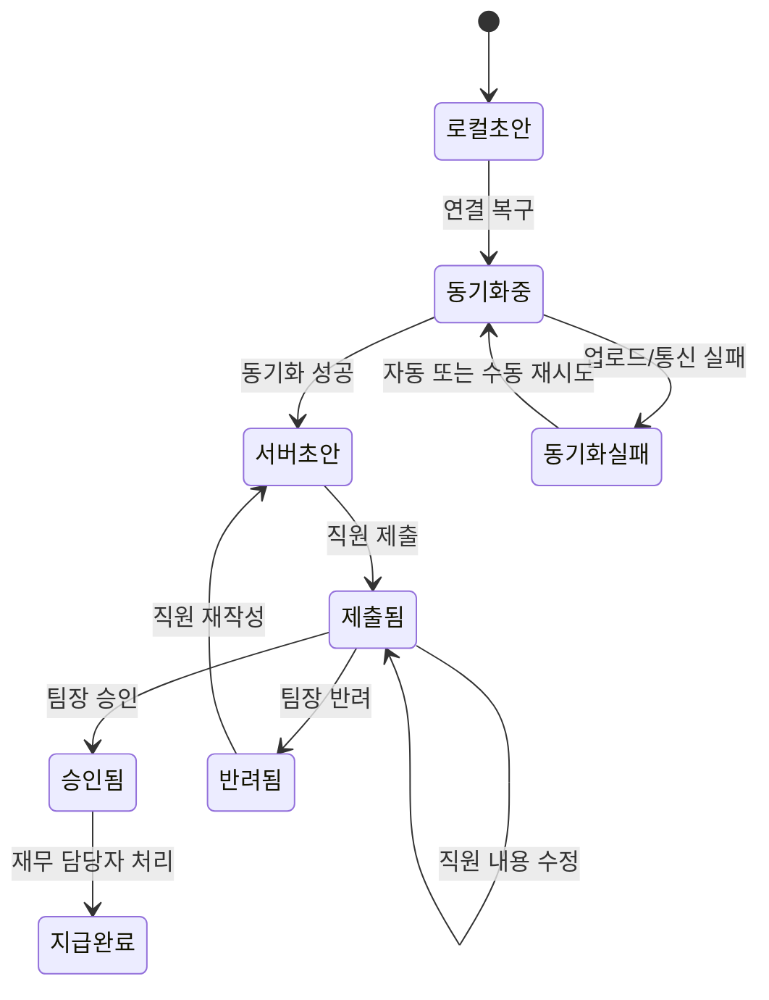

# 모바일 경비 승인 PRD

## 1. 문서 개요

- 제품/기능명: 모바일 경비 승인
- 문서 상태: 초안
- 대상 출시: 1차 출시
- 목적: 직원의 경비 제출부터 팀장 승인, 재무 담당자의 지급 완료 처리까지 모바일 중심으로 지원한다.
- 범위 원칙: 단일 통화만 지원하며 ERP 자동 연동은 제외한다.

## 2. 적용성

| 계약 항목 | 적용 여부 | 근거 |
|---|---|---|
| 역할 및 서버 권한 | Required | 직원, 팀장, 재무 담당자의 조회·처리 범위가 다름 |
| 화면 및 사용자 상태 | Required | 제출, 승인, 지급 처리 화면이 사용자에게 노출됨 |
| 다단계 상태 흐름 | Required | 초안 → 제출 → 승인/반려 → 지급 완료 과정이 존재함 |
| 오프라인 동기화 | Required | 오프라인에서 작성한 초안을 연결 복구 후 동기화해야 함 |
| 동시성 제어 | Required | 직원 수정과 팀장 승인 작업이 충돌할 수 있음 |
| 중복 제출 방지 | Required | 네트워크 재시도 및 사용자 반복 조작으로 중복 생성 가능 |
| 접근성 | Required | WCAG 2.2 AA가 명시적 목표임 |
| 정량 성능 목표 | N/A | 측정 기준선이 없어 1차 측정 후 결정하기로 함 |
| 다중 통화 | N/A | 1차 출시 범위에서 제외됨 |
| ERP 자동 연동 | N/A | 1차 출시 범위에서 제외됨 |

---

## 3. 배경과 문제

현재 경비 처리 과정에서 직원은 영수증과 경비 정보를 제출하고, 팀장은 소속 팀의 경비를 검토하며, 재무 담당자는 승인된 경비의 지급 여부를 관리해야 한다.

모바일 환경에서는 다음 문제가 추가로 발생할 수 있다.

- 불안정한 네트워크로 영수증 업로드 또는 제출 요청이 실패한다.
- 같은 제출 요청이 재시도되면서 중복 경비가 생성된다.
- 작성 도중 연결이 끊겨 입력 내용이 유실된다.
- 사용자의 역할이나 팀 소속이 변경된 뒤 기존 화면에서 잘못된 작업을 시도할 수 있다.
- 직원이 경비를 수정하는 동안 팀장이 이전 내용을 기준으로 승인할 수 있다.

본 기능은 이러한 상황에서도 경비 상태의 정확성과 권한 경계를 보장해야 한다.

## 4. 목표

- 직원이 모바일에서 영수증 사진, 금액, 카테고리를 입력해 경비를 제출할 수 있다.
- 오프라인에서 작성한 초안이 기기에 보존되고 연결 복구 후 동기화된다.
- 팀장은 현재 자기 팀에 속한 직원의 제출 요청만 조회하고 승인 또는 반려할 수 있다.
- 팀장은 반려 시 필수 사유를 입력한다.
- 재무 담당자는 승인된 요청을 지급 완료로 처리할 수 있다.
- 중복 제출, 이미지 업로드 실패, 권한 변경 및 동시 수정 충돌로 인한 잘못된 상태 변경을 방지한다.
- 주요 사용자 흐름이 WCAG 2.2 AA를 충족하도록 구현하고 검증한다.

## 5. 비목표

1차 출시에서는 다음을 제공하지 않는다.

- 다중 통화 및 환율 변환
- ERP 자동 등록 또는 지급 결과 자동 동기화
- 팀장의 일괄 승인·반려
- 오프라인 상태에서의 승인, 반려 또는 지급 완료 처리
- 영수증 OCR을 통한 금액·카테고리 자동 입력
- 부분 승인 또는 부분 지급
- 승인 단계 추가, 다단계 결재선 또는 대결 기능
- 지급 취소 및 승인 상태 되돌리기
- 회계 전표 생성

---

## 6. 사용자와 역할

| 역할 | 주요 권한 |
|---|---|
| 직원 | 자신의 초안 생성·수정·동기화, 자신의 경비 제출 및 상태 조회 |
| 팀장 | 현재 자기 팀 직원이 제출한 경비 조회, 승인, 반려 |
| 재무 담당자 | 승인된 경비 조회, 지급 완료 처리 및 지급 완료 내역 조회 |

### 권한 원칙

- 모든 권한은 UI 노출 여부와 관계없이 서버에서 요청마다 검증한다.
- 직원은 다른 직원의 초안과 경비를 조회하거나 변경할 수 없다.
- 팀장은 현재 자신이 담당하는 팀 범위 밖의 경비를 조회하거나 처리할 수 없다.
- 재무 담당자는 승인 전 경비를 지급 완료로 변경할 수 없다.
- 역할이나 팀 소속이 변경되면 다음 서버 요청부터 변경된 권한이 적용된다.
- 이미 열려 있던 화면의 정보는 작업 권한을 보장하지 않는다.

---

## 7. 핵심 데이터

### 경비 요청

| 필드 | 필수 여부 | 설명 |
|---|---|---|
| 요청 ID | 필수 | 서버에서 사용하는 고유 식별자 |
| 클라이언트 요청 ID | 필수 | 오프라인 작성 및 재시도 중 동일 요청을 식별하는 값 |
| 직원 ID | 필수 | 경비 소유자 |
| 소속 팀 ID | 필수 | 권한 판정 및 목록 분류에 사용하는 팀 |
| 영수증 이미지 | 필수 | 한 장의 영수증 사진 |
| 금액 | 필수 | 0보다 큰 금액 |
| 통화 | 필수 | 1차 출시에서 서비스 기본 통화로 고정 |
| 카테고리 | 필수 | 관리되는 카테고리 중 하나 |
| 상태 | 필수 | 초안, 제출, 승인, 반려, 지급 완료 |
| 반려 사유 | 조건부 필수 | 반려 상태일 때 필수 |
| 버전 | 필수 | 동시 수정 충돌 판정에 사용 |
| 생성·수정 시각 | 필수 | 상태 표시 및 감사 추적 |
| 승인·반려 처리자/시각 | 조건부 필수 | 승인 또는 반려 시 기록 |
| 지급 처리자/시각 | 조건부 필수 | 지급 완료 시 기록 |

### 감사 이력

다음 이벤트에는 행위자, 시각, 대상 요청, 변경 전후 상태를 기록한다.

- 제출
- 제출 후 내용 수정
- 승인
- 반려 및 반려 사유
- 지급 완료
- 중복 가능성을 인지한 후 제출 강행
- 권한 부족 또는 버전 충돌로 거부된 상태 변경

---

## 8. 상태 모델

### 허용되는 상태 전이

| 현재 상태 | 작업 | 다음 상태 | 수행자 |
|---|---|---|---|
| 로컬 초안 | 동기화 | 서버 초안 | 시스템 |
| 서버 초안 | 제출 | 제출됨 | 직원 |
| 제출됨 | 내용 수정 | 제출됨, 버전 증가 | 직원 |
| 제출됨 | 승인 | 승인됨 | 담당 팀장 |
| 제출됨 | 반려 | 반려됨 | 담당 팀장 |
| 반려됨 | 재작성 | 서버 초안 | 직원 |
| 승인됨 | 지급 완료 | 지급 완료 | 재무 담당자 |

명시되지 않은 상태 전이는 거부한다.

---

## 9. 기능 요구사항

| ID | 요구사항 | 우선순위 |
|---|---|---|
| FR-001 | 직원은 영수증 이미지, 금액, 카테고리를 포함한 경비 초안을 생성하고 수정할 수 있어야 한다. | Must |
| FR-002 | 금액은 0보다 커야 하며, 영수증 이미지와 카테고리가 없으면 제출할 수 없어야 한다. | Must |
| FR-003 | 직원은 자신의 초안과 제출 내역만 조회할 수 있어야 한다. | Must |
| FR-004 | 오프라인에서 생성·수정한 초안은 앱을 종료하거나 화면을 이동해도 기기에 보존되어야 한다. | Must |
| FR-005 | 연결이 복구되면 로컬 초안을 자동으로 서버 초안과 동기화하고 결과를 사용자에게 표시해야 한다. | Must |
| FR-006 | 이미지 업로드 실패 시 입력한 금액과 카테고리를 유지하고, 이미지 업로드만 재시도할 수 있어야 한다. | Must |
| FR-007 | 동기화 또는 제출 재시도는 동일한 클라이언트 요청 ID를 사용하여 같은 요청을 여러 건 생성하지 않아야 한다. | Must |
| FR-008 | 기존 경비와 영수증 이미지 및 금액이 같은 요청은 잠재적 중복으로 표시하고 직원의 확인 없이 제출하지 않아야 한다. | Must |
| FR-009 | 팀장은 현재 자기 팀 직원의 `제출됨` 요청만 승인 또는 반려할 수 있어야 한다. | Must |
| FR-010 | 반려 시 공백이 아닌 반려 사유를 필수로 입력해야 한다. | Must |
| FR-011 | 반려된 경비의 직원은 반려 사유를 확인하고 요청을 수정해 다시 제출할 수 있어야 한다. | Must |
| FR-012 | 재무 담당자는 `승인됨` 요청만 `지급 완료`로 변경할 수 있어야 한다. | Must |
| FR-013 | 승인, 반려 및 지급 완료 요청은 서버가 현재 역할, 팀 소속, 요청 상태를 다시 검증한 뒤 처리해야 한다. | Must |
| FR-014 | 역할 또는 팀 권한이 변경되어 작업이 거부되면 현재 입력을 가능한 범위에서 보존하고 권한 변경 안내와 새로고침 경로를 제공해야 한다. | Must |
| FR-015 | 경비의 모든 변경은 버전 값을 증가시켜야 하며, 상태 변경 요청은 사용자가 확인한 버전을 포함해야 한다. | Must |
| FR-016 | 팀장이 확인한 이후 직원이 경비를 수정한 경우, 기존 버전을 이용한 승인·반려는 처리하지 않고 최신 내용을 다시 검토하도록 해야 한다. | Must |
| FR-017 | 승인 또는 반려 이후 직원은 해당 요청의 금액, 카테고리, 영수증을 직접 변경할 수 없어야 한다. | Must |
| FR-018 | 상태 변경 성공 후 처리자, 처리 시각, 상태 및 반려 사유를 해당 권한을 가진 사용자에게 표시해야 한다. | Must |
| FR-019 | 사용자가 처리 버튼을 반복해서 누르더라도 승인, 반려, 지급 완료 이벤트가 중복 생성되지 않아야 한다. | Must |
| FR-020 | 온라인 여부, 동기화 중, 업로드 실패, 충돌, 권한 부족 상태를 색상만이 아닌 텍스트와 아이콘으로 구분해야 한다. | Must |

---

## 10. 화면 및 경로

실제 URL 구조는 구현 단계에서 기존 제품 규칙에 맞추되 다음 화면을 제공한다.

| 화면 | 대상 | 핵심 기능 |
|---|---|---|
| 내 경비 목록 | 직원 | 초안 및 제출 내역, 상태, 동기화 상태 조회 |
| 경비 작성/수정 | 직원 | 영수증 촬영·선택, 금액·카테고리 입력, 저장·제출 |
| 경비 상세 | 직원 | 현재 상태, 반려 사유, 처리 이력 조회 |
| 팀 승인함 | 팀장 | 자기 팀의 제출 요청 목록 |
| 팀 경비 상세 | 팀장 | 최신 내용 확인, 승인 또는 사유 입력 후 반려 |
| 지급 대기 목록 | 재무 담당자 | 승인된 요청 조회 |
| 지급 상세 | 재무 담당자 | 승인 정보 확인, 지급 완료 처리 |

---

## 11. 사용자 노출 상태

| 화면/기능 | 빈 상태 | 로딩/진행 | 오류 | 성공 | 복구 |
|---|---|---|---|---|---|
| 내 경비 목록 | “등록된 경비가 없습니다” | 목록 로딩 표시 | 재시도 안내 | 상태별 목록 표시 | 새로고침 |
| 경비 작성 | 빈 입력 폼 | 이미지 처리 표시 | 필드별 오류 | 초안 저장 표시 | 오류 필드 유지 |
| 오프라인 초안 | 로컬 초안 없음 | 동기화 대기/진행 | 동기화 실패 원인 | 동기화 완료 | 자동·수동 재시도 |
| 이미지 업로드 | 이미지 미선택 | 업로드 진행 | 실패 및 재시도 | 미리보기와 완료 표시 | 이미지 재선택 또는 재시도 |
| 팀 승인함 | “처리할 요청이 없습니다” | 목록 로딩 | 권한/통신 오류 | 요청 목록 표시 | 권한 재확인 및 새로고침 |
| 승인·반려 | 해당 없음 | 중복 조작 방지 진행 상태 | 버전 충돌/권한 변경 | 처리된 상태 표시 | 최신 내용 다시 불러오기 |
| 지급 처리 | 지급 대기 없음 | 처리 진행 | 상태 충돌/권한 오류 | 지급 완료 표시 | 최신 상태 다시 불러오기 |

---

## 12. 주요 흐름

### 12.1 직원 제출

1. 직원이 새 경비를 생성한다.
2. 영수증 사진을 촬영하거나 기기에서 선택한다.
3. 금액과 카테고리를 입력한다.
4. 초안이 로컬에 저장된다.
5. 온라인이면 서버 초안과 동기화한다.
6. 제출 시 필수 필드와 이미지 업로드 완료 여부를 검증한다.
7. 잠재적 중복이 있으면 비교 가능한 기존 요청을 안내한다.
8. 직원이 중복이 아님을 확인하면 제출하고 `제출됨` 상태가 된다.

### 12.2 오프라인 작성 및 복구

1. 오프라인 상태에서 직원이 초안을 생성하거나 수정한다.
2. 앱은 초안과 로컬 이미지 참조를 기기에 보존하고 `동기화 대기`로 표시한다.
3. 연결 복구를 감지하면 자동 동기화를 시작한다.
4. 메타데이터와 이미지가 모두 저장된 경우 서버 초안으로 확정한다.
5. 일부 단계가 실패하면 성공한 부분을 중복 생성하지 않고 실패 단계부터 재시도한다.
6. 동기화 완료 후 직원이 내용을 확인하고 제출한다.

### 12.3 승인 및 반려

1. 팀장이 승인함에서 자기 팀의 제출 요청을 연다.
2. 서버는 조회 시점의 팀 권한을 검증한다.
3. 팀장이 승인하거나 반려 사유를 입력해 반려한다.
4. 서버는 처리 시점에 권한, 현재 상태 및 버전을 다시 확인한다.
5. 버전이 일치하면 상태를 변경한다.
6. 버전이 다르면 처리를 거부하고 최신 요청을 다시 표시한다.

### 12.4 지급 완료

1. 재무 담당자가 승인된 요청을 조회한다.
2. 지급 완료를 선택한다.
3. 서버가 재무 권한과 현재 상태를 재검증한다.
4. 요청을 `지급 완료`로 변경하고 처리자와 처리 시각을 기록한다.

---

## 13. 예외 및 충돌 처리

### 중복 제출

두 수준으로 처리한다.

- 정확한 중복: 동일한 클라이언트 요청 ID로 재시도된 요청은 기존 결과를 반환하고 새 경비를 만들지 않는다.
- 잠재적 중복: 동일 직원의 기존 요청 중 영수증 이미지와 금액이 동일한 요청이 있으면 경고한다. 사용자는 기존 요청을 확인하거나 명시적으로 계속 제출할 수 있다.

잠재적 중복 판정 실패만으로 정상 제출을 영구 차단하지 않는다.

### 이미지 업로드 실패

- 이미지 업로드 실패가 금액·카테고리 입력을 삭제해서는 안 된다.
- 제출은 이미지 업로드가 완료된 뒤에만 허용한다.
- 재시도 시 이미 성공한 경비 초안 또는 이미지가 중복 생성되어서는 안 된다.
- 로컬 이미지에 더 이상 접근할 수 없다면 재선택을 요청한다.

### 권한 변경

- 팀장이 다른 팀으로 이동하거나 팀장 권한을 잃으면 다음 조회 또는 처리 요청부터 기존 팀 경비 접근이 거부된다.
- 직원의 팀이 변경되면 변경 이후 권한 규칙에 따라 담당 팀장을 다시 판정한다.
- 재무 역할을 잃은 사용자는 지급 완료 작업을 할 수 없다.
- 클라이언트가 이전 권한으로 화면을 표시하더라도 서버는 작업을 거부한다.

### 승인 중 동시 수정

- 직원의 제출 후 수정은 `제출됨` 상태에서만 허용한다.
- 직원 수정 시 요청 버전이 증가한다.
- 팀장의 승인·반려 요청이 이전 버전을 기준으로 하면 서버는 충돌로 응답한다.
- 충돌 시 팀장이 누른 승인 또는 반려는 자동 적용하지 않는다.
- 팀장은 최신 영수증, 금액, 카테고리를 다시 확인한 후 작업해야 한다.

---

## 14. 비기능 요구사항

### 접근성

- NFR-A11Y-001: 사용자 흐름은 WCAG 2.2 AA를 목표로 한다.
- NFR-A11Y-002: 모든 입력에는 프로그램적으로 연결된 레이블과 오류 설명을 제공한다.
- NFR-A11Y-003: 승인, 반려, 지급 완료, 업로드 실패, 동기화 상태를 색상만으로 전달하지 않는다.
- NFR-A11Y-004: 키보드 및 보조기술로 모든 주요 작업을 수행할 수 있어야 한다.
- NFR-A11Y-005: 포커스 순서와 포커스 표시가 명확해야 하며 오류 또는 대화상자 발생 시 포커스를 적절히 이동한다.
- NFR-A11Y-006: 터치 대상, 명도 대비, 인증 및 입력 관련 기준을 포함해 WCAG 2.2 AA 검사를 수행한다.

### 보안과 개인정보

- 영수증 이미지는 인증되고 권한이 확인된 사용자에게만 제공한다.
- 클라이언트가 전달한 직원 ID, 팀 ID 또는 역할을 권한 판단의 신뢰 근거로 사용하지 않는다.
- 역할 및 팀 정보는 서버의 현재 권한 데이터로 판정한다.
- 금액과 상태 변경 값은 서버에서 검증한다.
- 감사 이력은 일반 사용자가 수정하거나 삭제할 수 없다.
- 오류 메시지로 다른 팀 또는 다른 직원의 요청 존재 여부를 노출하지 않는다.

### 신뢰성

- 모든 생성 및 상태 변경 요청은 재시도되어도 동일 결과를 내도록 식별자를 사용한다.
- 동기화 도중 앱이 종료되어도 완료되지 않은 작업을 다시 이어갈 수 있어야 한다.
- 서버가 성공했지만 응답이 유실된 경우 재시도가 중복 레코드나 중복 상태 이력을 만들지 않아야 한다.

### 성능

현재 정량 목표는 확정하지 않는다. 다음 항목을 계측한다.

| 측정 항목 | 책임자 | 결정 시점 |
|---|---|---|
| 주요 목록 및 상세 화면 응답 시간 | 제품·엔지니어링 | 파일럿 측정 후 정식 출시 기준 확정 |
| 영수증 업로드 성공률과 소요 시간 | 엔지니어링 | 지원 파일 제한 및 실제 모바일 네트워크 측정 후 확정 |
| 연결 복구 후 초안 동기화 소요 시간 | 엔지니어링 | 베타 사용자 측정 후 확정 |
| 승인·반려·지급 처리 응답 시간 | 제품·엔지니어링 | 베타 측정 후 확정 |
| 충돌 및 동기화 재시도 발생률 | 제품·엔지니어링 | 베타 운영 검토 시 확정 |

계측 이벤트와 측정 기준은 베타 시작 전에 구현되어야 하지만, 근거 없는 임의 수치를 출시 기준으로 사용하지 않는다.

---

## 15. 수용 기준

| ID | 연결 요구사항 | Given | When | Then | 검증 |
|---|---|---|---|---|---|
| AC-001 | FR-001~003 | 로그인한 직원이 작성 화면에 있을 때 | 유효한 이미지, 금액, 카테고리를 저장하면 | 자신의 초안이 생성되고 다른 직원은 접근할 수 없다 | API 통합 + E2E |
| AC-002 | FR-002 | 필수 값이 없거나 금액이 0 이하일 때 | 제출을 선택하면 | 제출되지 않고 각 오류가 입력 항목과 연결되어 표시된다 | 단위 + E2E + 접근성 |
| AC-003 | FR-004 | 직원이 오프라인일 때 | 초안을 작성한 뒤 앱을 종료하고 다시 열면 | 동일 입력과 이미지가 동기화 대기 상태로 복원된다 | 모바일 E2E |
| AC-004 | FR-005 | 동기화 대기 초안이 있을 때 | 연결이 복구되면 | 자동 동기화가 시작되고 성공 시 서버 초안 ID와 완료 상태가 표시된다 | 통합 + 모바일 E2E |
| AC-005 | FR-006 | 이미지 업로드가 실패했을 때 | 직원이 재시도하면 | 금액과 카테고리는 유지되고 이미지 업로드만 재시도된다 | 장애 주입 테스트 |
| AC-006 | FR-007, FR-019 | 서버 처리 후 응답이 유실된 상태에서 | 동일 요청을 반복하면 | 경비 또는 상태 이벤트가 한 건만 존재하고 기존 처리 결과가 반환된다 | API 통합 |
| AC-007 | FR-008 | 동일 직원에게 같은 영수증 이미지와 금액의 요청이 있을 때 | 새 요청을 제출하면 | 잠재적 중복 경고가 표시되고 명시적 확인 전에는 제출되지 않는다 | 통합 + E2E |
| AC-008 | FR-009, FR-013 | 팀장이 자기 팀과 다른 팀의 요청 ID를 알고 있을 때 | 다른 팀 요청을 조회하거나 처리하면 | 데이터가 노출되지 않고 작업이 거부된다 | 권한 통합 테스트 |
| AC-009 | FR-009 | 팀장이 자기 팀의 최신 `제출됨` 요청을 볼 때 | 승인을 선택하면 | 상태가 한 번만 `승인됨`으로 변경되고 처리자가 기록된다 | 통합 + E2E |
| AC-010 | FR-010 | 팀장이 반려 사유를 입력하지 않았을 때 | 반려를 선택하면 | 반려가 처리되지 않고 사유 입력 오류가 표시된다 | 단위 + E2E |
| AC-011 | FR-010, FR-011 | 팀장이 유효한 사유로 반려했을 때 | 직원이 요청 상세를 열면 | 반려 상태와 사유를 확인하고 재작성할 수 있다 | E2E |
| AC-012 | FR-012 | 재무 담당자가 `승인됨` 요청을 볼 때 | 지급 완료를 선택하면 | 상태가 `지급 완료`로 한 번만 변경되고 처리자와 시각이 기록된다 | 통합 + E2E |
| AC-013 | FR-012, FR-013 | 요청 상태가 `제출됨` 또는 `반려됨`일 때 | 재무 담당자가 지급 완료 API를 호출하면 | 상태 변경이 거부된다 | API 통합 |
| AC-014 | FR-014 | 화면을 연 뒤 사용자의 역할 또는 팀 권한이 제거됐을 때 | 승인·반려·지급 작업을 시도하면 | 서버가 거부하고 UI가 권한 변경 및 새로고침 안내를 표시한다 | 권한 통합 + E2E |
| AC-015 | FR-015, FR-016 | 팀장이 버전 3을 보고 있고 직원이 요청을 버전 4로 수정했을 때 | 팀장이 버전 3으로 승인하면 | 승인은 적용되지 않고 최신 내용 재검토가 요구된다 | 동시성 통합 테스트 |
| AC-016 | FR-017 | 요청이 승인 또는 반려된 후 | 직원이 기존 버전으로 내용을 수정하면 | 허용되지 않은 상태 전이 또는 버전 충돌로 거부된다 | API 통합 |
| AC-017 | FR-018 | 경비가 승인, 반려 또는 지급 완료됐을 때 | 권한 있는 사용자가 상세를 열면 | 상태, 처리자, 처리 시각 및 해당 시 반려 사유가 표시된다 | E2E |
| AC-018 | FR-020 | 오프라인·실패·충돌 상태가 표시될 때 | 색상 인지가 어렵거나 보조기술을 사용하면 | 텍스트 또는 접근 가능한 이름으로 상태를 구별할 수 있다 | 자동 접근성 + 수동 검사 |
| AC-019 | NFR-A11Y-001~006 | 주요 직원·팀장·재무 흐름이 구현됐을 때 | 접근성 검사를 수행하면 | 확인된 WCAG 2.2 AA 위반이 출시 전 해결되거나 명시적으로 승인된 예외로 기록된다 | 자동 + 수동 접근성 감사 |

---

## 16. 합리적 가정

다음은 구현을 진행하기 위해 적용한 가역적 가정이다.

- 1차 출시에서는 서비스가 지정한 단일 기본 통화만 사용한다.
- 영수증은 경비 요청당 이미지 한 장을 필수로 첨부한다.
- 카테고리는 자유 입력이 아니라 서비스가 제공하는 목록에서 선택한다.
- 오프라인 범위는 직원의 초안 생성·수정 및 자동 동기화로 제한한다.
- 오프라인에서 승인, 반려, 지급 완료는 지원하지 않는다.
- 오프라인 초안은 연결 복구 후 서버 초안으로 동기화되며, 최종 제출은 직원이 온라인에서 다시 확인하고 수행한다.
- 직원은 팀장이 처리하기 전까지 제출된 요청을 수정할 수 있다.
- 제출 후 수정 시 상태는 `제출됨`으로 유지하되 버전이 증가한다.
- 승인 및 지급 완료는 각각 최종 상태 전이이며 1차 출시에서 되돌리기 기능은 없다.
- 정확한 재시도 중복은 자동 차단하고, 내용상 잠재적 중복은 경고 후 제출을 허용한다.
- 팀 권한은 작업 시점의 현재 팀 소속을 기준으로 판정한다.

## 17. 열린 결정

아래 항목은 제품·정책 결정이 필요하다.

| ID | 결정 사항 | 선택지 및 영향 | 결정 필요 시점 |
|---|---|---|---|
| OD-001 | 지원할 기본 통화 | 국가·법인별 단일 통화인지 서비스 전체 단일 통화인지 결정 필요 | 데이터 모델 확정 전 |
| OD-002 | 영수증 파일 제한 | 지원 형식, 최대 용량, 이미지 압축 및 해상도 기준 | 업로드 구현 전 |
| OD-003 | 카테고리 목록과 관리 주체 | 고정 목록 또는 운영자 관리 방식 | UI·API 계약 확정 전 |
| OD-004 | 잠재적 중복 검색 범위 | 전체 기간, 최근 일정 기간 또는 미지급 건만 비교 | 중복 탐지 구현 전 |
| OD-005 | 팀 이동 시 기존 요청 담당 | 현재 팀장이 처리할지, 제출 당시 팀장이 처리할지 | 권한 모델 확정 전 |
| OD-006 | 제출 후 직원 수정 정책 | 현재 가정처럼 허용하거나, 철회 후 재제출 방식으로 제한 | 상태 모델 확정 전 |
| OD-007 | 오프라인 제출 예약 | 온라인 복구 후 자동 제출까지 할지, 현재 가정처럼 확인 후 제출할지 | 동기화 UX 확정 전 |
| OD-008 | 반려 사유 길이 | 최소·최대 글자 수 및 서식 제한 | API 검증 구현 전 |
| OD-009 | 지급 완료에 추가 정보가 필요한지 | 지급일, 지급 참조번호 또는 메모 포함 여부 | 재무 화면 구현 전 |
| OD-010 | 영수증과 감사 이력 보존 기간 | 법무·세무·개인정보 정책에 따른 보존 및 삭제 기준 | 운영 출시 전 |
| OD-011 | 정량 성능 기준 | 베타 계측 결과를 바탕으로 백분위수와 목표값 결정 | 정식 출시 판정 전 |
| OD-012 | 접근성 예외 승인 절차 | 예외 승인권자, 보완 계획 및 만료일 관리 방식 | 접근성 검수 전 |

---

## 18. 위험과 완화

| 위험 | 영향 | 완화 방안 |
|---|---|---|
| 불안정한 네트워크로 중복 생성 | 이중 지급 가능성 | 클라이언트 요청 ID와 멱등 처리 |
| 이미지 업로드 실패로 입력 유실 | 사용자 재작업 | 메타데이터 로컬 저장, 단계별 재시도 |
| 오래된 화면에서 잘못 승인 | 변경된 금액 승인 | 버전 기반 낙관적 동시성 제어 |
| 클라이언트 권한 정보 변조 | 타 팀 경비 노출·처리 | 모든 조회·변경에 서버 권한 검증 |
| 팀 이동 시 담당 불명확 | 요청 처리 지연 또는 노출 오류 | OD-005를 출시 전 확정하고 일관된 정책 적용 |
| 잠재적 중복 오탐 | 정상 경비 제출 방해 | 경고 후 명시적 제출 허용, 감사 기록 |
| 기기 내 영수증 보관 | 개인정보 노출 | 앱 저장 영역 사용, 동기화 후 로컬 보존 정책 확정 |
| 성능 목표 미확정 | 출시 품질 판단 곤란 | 베타 전 계측 구현, 정식 출시 전 기준 확정 |
| 접근성 검수가 늦어짐 | 구조적 수정 비용 증가 | 컴포넌트 단계 자동 검사와 주요 흐름 수동 검사를 병행 |

---

## 19. 출시 계획

| 단계 | 포함 요구사항 | 검증 가능한 종료 조건 |
|---|---|---|
| 1. 상태·권한 기반 구축 | FR-001~003, FR-009~013, FR-015, FR-017~019 | 상태 전이 및 역할·팀별 API 권한 테스트 통과 |
| 2. 직원 제출 흐름 | FR-001~003, FR-006~008, FR-011 | 유효성 검증, 업로드 실패, 중복 제출 E2E 통과 |
| 3. 오프라인 동기화 | FR-004~007 | 앱 종료, 연결 복구, 부분 실패 및 재시도 테스트 통과 |
| 4. 동시성·권한 변경 | FR-013~016 | 팀 이동, 역할 제거, 직원 수정과 팀장 승인 경합 테스트 통과 |
| 5. 접근성·계측 | FR-020, NFR-A11Y-001~006 | 주요 흐름 접근성 검사 완료 및 성능 기준선 계측 가능 |
| 6. 출시 후보 | 전체 Must 요구사항 | AC-001~019 통과, 열린 결정 중 출시 차단 항목 확정, 알려진 예외 승인 완료 |

문서 검증기는 실행하지 않았다. 요청에 따라 파일을 생성하지 않았으며 저장소도 탐색하지 않았다.