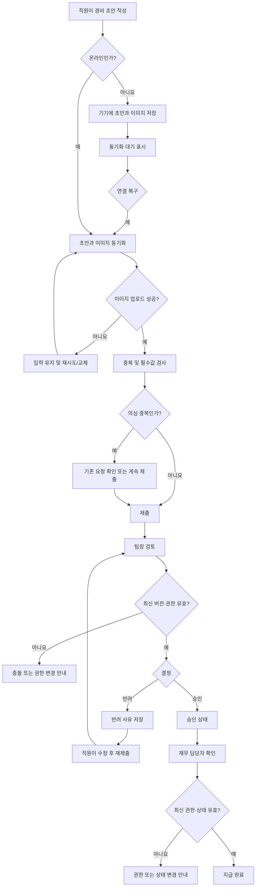

# 모바일 경비 승인 PRD

## 1. 문서 개요

- 제품/기능명: 모바일 경비 승인
- 문서 상태: 초안
- 대상 출시: 1차 출시(MVP)
- 목적: 직원의 경비 제출부터 팀장 승인·반려, 재무 담당자의 지급 완료 처리까지 모바일에서 일관되고 추적 가능한 흐름으로 제공한다.

## 2. 적용 범위

| 계약 항목 | 적용 여부 | 근거 |
|---|---|---|
| 사용자 화면 및 경로 | Required | 직원·팀장·재무 담당자가 사용하는 모바일 화면이 필요함 |
| 화면 상태 매트릭스 | Required | 오프라인, 업로드 실패, 빈 목록, 권한 변경 등 사용자 노출 상태가 다양함 |
| 사용자·시스템 흐름 | Required | 작성 → 제출 → 승인/반려 → 지급의 다단계 생명주기가 있음 |
| 정량 성능 목표 | N/A | 성능 수치는 측정 후 결정하기로 명시됨. 측정 지표와 결정 시점만 정의함 |
| 서버 권한 및 데이터 경계 | Required | 팀 단위 승인 범위와 역할 변경을 서버에서 강제해야 함 |
| 동시성 제어 | Required | 승인 중 동시 수정 상태를 명시적으로 처리해야 함 |
| 오프라인 동기화 | Required | 오프라인 초안 작성 및 연결 복구 후 동기화가 핵심 요구사항임 |
| 감사 이력 | Required | 승인·반려·지급 및 권한 변경 상황을 사후 확인할 수 있어야 함 |

## 3. 배경과 문제

직원은 모바일 환경에서 영수증과 경비 정보를 간단히 제출할 수 있어야 한다. 팀장은 자기 팀의 경비만 검토하고 승인 또는 반려해야 하며, 재무 담당자는 승인된 경비의 지급 여부를 관리해야 한다.

모바일 환경에서는 불안정한 네트워크, 이미지 업로드 실패, 재시도에 따른 중복 제출, 오프라인 작성, 여러 사용자의 동시 작업이 발생할 수 있다. 따라서 단순한 입력 화면뿐 아니라 데이터 유실 방지, 정확한 상태 전이, 서버 권한 검증과 충돌 처리가 필요하다.

## 4. 목표

- 직원이 영수증 사진, 금액, 카테고리를 입력하여 경비를 제출할 수 있다.
- 오프라인에서도 초안을 작성하고 연결 복구 후 안전하게 동기화할 수 있다.
- 팀장이 자기 팀의 제출 건만 승인 또는 반려할 수 있다.
- 반려 시 사유를 반드시 기록한다.
- 재무 담당자가 승인된 요청을 지급 완료로 표시할 수 있다.
- 재시도나 네트워크 오류로 인한 중복 제출을 방지한다.
- 이미지 업로드 실패를 복구 가능하게 처리한다.
- 권한 또는 팀 소속이 변경된 경우 최신 권한을 즉시 적용한다.
- 승인과 직원 수정이 동시에 발생해도 이전 버전을 잘못 승인하지 않는다.
- 모든 주요 상태 변경의 주체와 시각을 추적할 수 있다.
- WCAG 2.2 AA 수준의 접근성을 충족한다.

## 5. 비목표

1차 출시에는 다음을 포함하지 않는다.

- 다중 통화 입력, 환율 계산 및 통화별 정산
- ERP 자동 전송 또는 지급 결과 자동 동기화
- 실제 계좌 이체 또는 결제 실행
- 영수증 OCR 및 자동 금액·카테고리 추출
- 여러 영수증을 하나의 경비 요청으로 묶는 기능
- 다단계 또는 금액별 승인선
- 경비 규정 위반 자동 판정
- 대리 승인, 일괄 승인 및 일괄 지급 처리
- 회계 전표 생성

## 6. 사용자와 역할

| 역할 | 주요 권한 |
|---|---|
| 직원 | 자신의 초안 작성·수정·삭제, 자신의 경비 제출, 제출 내역 및 처리 결과 조회 |
| 팀장 | 현재 승인 권한을 가진 팀에 귀속된 제출 건 조회, 승인, 반려 |
| 재무 담당자 | 승인된 요청 조회, 지급 완료 처리, 지급 상태 조회 |
| 시스템 | 동기화, 중복 방지, 권한 검증, 동시성 제어, 감사 이력 기록 |

한 사용자가 복수 역할을 가질 수 있다. 단, 각 요청에 대한 작업 가능 여부는 화면에 진입할 때뿐 아니라 작업을 실행하는 시점에도 서버가 검증해야 한다.

## 7. 핵심 데이터

### 7.1 경비 요청

| 필드 | 필수 여부 | 설명 |
|---|---|---|
| 요청 ID | 필수 | 서버가 부여하는 고유 식별자 |
| 클라이언트 제출 키 | 필수 | 재시도에 의한 중복 생성을 방지하는 고유 키 |
| 작성자 | 필수 | 직원을 식별하는 값 |
| 승인 대상 팀 | 제출 시 필수 | 어느 팀의 승인 대상인지 나타내는 값 |
| 영수증 이미지 | 제출 시 필수 | 1차 출시에서는 요청당 1개 |
| 금액 | 필수 | 0보다 큰 단일 통화 금액 |
| 카테고리 | 필수 | 제출 시점에 사용 가능한 카테고리 |
| 상태 | 필수 | 초안, 제출, 승인, 반려, 지급 완료 |
| 버전 | 필수 | 동시 수정 및 승인 충돌 검증에 사용 |
| 반려 사유 | 반려 시 필수 | 팀장이 입력한 사유 |
| 생성·수정 시각 | 필수 | 상태 및 데이터 변경 시각 |
| 제출·승인·반려·지급 정보 | 조건부 필수 | 각 작업의 수행자와 수행 시각 |

### 7.2 감사 이력

다음 사건에 대해 수행자, 발생 시각, 변경 전후 상태 및 대상 요청을 기록한다.

- 경비 제출
- 제출 후 내용 수정
- 승인
- 반려 및 반려 사유
- 반려 건 재제출
- 지급 완료
- 동시성 충돌로 거부된 상태 변경
- 의심 중복 경고를 확인하고 제출한 경우

감사 이력은 일반 사용자가 임의로 수정하거나 삭제할 수 없어야 한다.

## 8. 상태 모델

### 8.1 업무 상태

| 현재 상태 | 가능한 다음 상태 | 실행 주체 | 조건 |
|---|---|---|---|
| 초안 | 제출 | 직원 | 필수 입력과 이미지 업로드가 완료됨 |
| 제출 | 제출 | 직원 | 승인·반려 전 수정. 버전이 증가함 |
| 제출 | 승인 | 해당 팀장 | 최신 버전과 권한 검증 성공 |
| 제출 | 반려 | 해당 팀장 | 최신 버전, 권한 검증 및 반려 사유 입력 성공 |
| 반려 | 제출 | 직원 | 내용을 수정하고 다시 제출 |
| 승인 | 지급 완료 | 재무 담당자 | 최신 권한 및 현재 상태 검증 성공 |
| 지급 완료 | 없음 | 없음 | MVP의 최종 상태 |

승인, 반려, 지급 완료 상태는 일반 사용자 화면에서 되돌릴 수 없다. 정정 절차는 1차 출시 범위 밖이며 운영 절차로 처리한다.

### 8.2 로컬 동기화 상태

업무 상태와 별도로 다음 동기화 상태를 표시한다.

- 기기에만 저장됨
- 동기화 대기
- 동기화 중
- 동기화 완료
- 동기화 실패
- 충돌 확인 필요

### 8.3 이미지 상태

- 로컬 저장
- 업로드 대기
- 업로드 중
- 업로드 완료
- 업로드 실패

이미지가 업로드 완료되지 않은 요청은 서버의 `제출` 상태로 전환할 수 없다.

## 9. 기능 요구사항

| ID | 요구사항 | 우선순위 |
|---|---|---|
| FR-01 | 직원은 영수증 사진 1개, 금액, 카테고리를 포함한 경비 초안을 생성할 수 있어야 한다. | P0 |
| FR-02 | 직원은 자신이 작성한 초안과 제출 이력을 목록 및 상세 화면에서 조회할 수 있어야 한다. | P0 |
| FR-03 | 금액은 0보다 커야 하며, 영수증 이미지와 유효한 카테고리가 없으면 제출할 수 없어야 한다. | P0 |
| FR-04 | 시스템은 경비 요청마다 고유한 클라이언트 제출 키를 사용하여 동일한 제출 재시도가 요청을 추가 생성하지 않게 해야 한다. | P0 |
| FR-05 | 동일 직원이 같은 이미지, 금액, 카테고리로 기존 요청과 일치하는 경비를 새로 제출하면 의심 중복을 경고해야 한다. 직원은 기존 요청을 확인하거나 명시적으로 계속 제출할 수 있어야 한다. | P0 |
| FR-06 | 이미지 업로드 실패 시 입력 데이터와 로컬 이미지를 유지하고, 실패 원인 안내와 재시도 또는 이미지 교체 수단을 제공해야 한다. | P0 |
| FR-07 | 오프라인에서 경비 초안을 생성·수정할 수 있어야 하며 연결 복구를 감지하면 동기화를 시도해야 한다. | P0 |
| FR-08 | 오프라인에서는 제출, 승인, 반려 및 지급 완료 처리를 할 수 없어야 하며 온라인 연결이 필요함을 안내해야 한다. | P0 |
| FR-09 | 동기화 실패 시 초안을 삭제하지 않고 실패 상태와 재시도 수단을 제공해야 한다. | P0 |
| FR-10 | 로컬 변경과 서버 변경이 충돌하면 어느 한쪽을 자동으로 덮어쓰지 않고 사용자에게 충돌을 알린 후 최신 서버 버전을 기준으로 다시 적용하게 해야 한다. | P0 |
| FR-11 | 팀장은 승인 권한을 가진 자기 팀의 `제출` 상태 요청만 조회하고 승인 또는 반려할 수 있어야 한다. | P0 |
| FR-12 | 팀장이 반려할 때 공백이 아닌 반려 사유를 반드시 입력해야 하며, 직원은 해당 사유를 조회할 수 있어야 한다. | P0 |
| FR-13 | 제출 후 직원이 요청을 수정하면 요청 버전을 증가시켜야 하며, 팀장은 자신이 조회한 버전이 최신인 경우에만 승인 또는 반려할 수 있어야 한다. | P0 |
| FR-14 | 승인·반려가 동시에 요청되면 최초로 유효하게 완료된 한 건만 반영하고, 나머지 작업에는 최신 상태를 표시해야 한다. | P0 |
| FR-15 | 재무 담당자는 `승인` 상태 요청만 지급 완료로 표시할 수 있어야 한다. | P0 |
| FR-16 | 모든 권한은 각 조회와 상태 변경 시점에 서버에서 최신 역할·팀 정보를 기준으로 검증해야 한다. | P0 |
| FR-17 | 작업 중 역할 또는 팀 권한을 잃은 사용자의 후속 조회·승인·반려·지급 요청은 거부하고 최신 권한 상태를 안내해야 한다. | P0 |
| FR-18 | 시스템은 제출, 수정, 승인, 반려, 지급 완료의 수행자·시각·상태 변화를 감사 이력으로 남겨야 한다. | P0 |
| FR-19 | 직원 목록에는 요청 상태, 금액, 카테고리, 제출 또는 수정 시각을 표시해야 한다. | P1 |
| FR-20 | 팀장과 재무 담당자는 처리 가능한 요청과 이미 처리된 요청을 구분해 조회할 수 있어야 한다. | P1 |
| FR-21 | 모든 화면과 주요 작업은 WCAG 2.2 AA를 충족하도록 구현해야 한다. | P0 |

## 10. 화면 및 논리 경로

실제 URL 또는 네이티브 내비게이션 구조는 기술 설계에서 확정한다.

| 화면 | 대상 | 논리 경로 | 주요 기능 |
|---|---|---|---|
| 내 경비 목록 | 직원 | `/expenses` | 상태별 요청 조회, 동기화 상태 확인 |
| 경비 작성·수정 | 직원 | `/expenses/new`, `/expenses/{id}/edit` | 촬영/선택, 금액·카테고리 입력, 초안 저장, 제출 |
| 경비 상세 | 직원 | `/expenses/{id}` | 처리 상태, 반려 사유, 감사 이력 조회 |
| 팀 승인함 | 팀장 | `/team/expenses` | 자기 팀의 처리 대기 및 처리 완료 요청 조회 |
| 팀 승인 상세 | 팀장 | `/team/expenses/{id}` | 영수증·금액·카테고리 확인, 승인·반려 |
| 재무 지급 목록 | 재무 담당자 | `/finance/expenses` | 승인 요청 및 지급 완료 요청 조회 |
| 재무 지급 상세 | 재무 담당자 | `/finance/expenses/{id}` | 요청 확인, 지급 완료 처리 |

## 11. 화면 상태 매트릭스

| 화면/영역 | 빈 상태 | 로딩 상태 | 오류 상태 | 성공 상태 | 복구 방법 |
|---|---|---|---|---|---|
| 내 경비 목록 | 등록된 요청 없음 | 목록 로딩 표시 | 네트워크/권한 오류 | 요청과 상태 표시 | 재시도, 권한 갱신 |
| 경비 작성 | 빈 입력 양식 | 초안 복원 또는 동기화 중 | 로컬 저장/동기화 실패 | 초안 저장 또는 제출 완료 | 재저장, 동기화 재시도 |
| 이미지 업로드 | 이미지 없음 | 진행 상태 표시 | 업로드 실패 | 미리보기 및 완료 표시 | 재시도, 이미지 교체 |
| 팀 승인함 | 처리할 요청 없음 | 목록 로딩 표시 | 네트워크/권한 오류 | 자기 팀 요청 표시 | 재시도, 화면 갱신 |
| 승인 상세 | 해당 없음 | 최신 버전 확인 중 | 버전 충돌, 이미 처리됨, 권한 상실 | 승인 또는 반려 완료 | 최신 요청 다시 불러오기 |
| 재무 지급 목록 | 지급 대상 없음 | 목록 로딩 표시 | 네트워크/권한 오류 | 승인 건 표시 | 재시도, 권한 갱신 |
| 지급 상세 | 해당 없음 | 최신 상태 확인 중 | 이미 지급됨, 상태 변경, 권한 상실 | 지급 완료 | 최신 상태 다시 불러오기 |
| 오프라인 배너 | 해당 없음 | 연결 확인 중 | 동기화 실패 | 온라인 복구 및 동기화 완료 | 수동 재시도 |

## 12. 사용자 및 시스템 흐름

## 13. 권한 및 데이터 경계

### 13.1 직원

- 자신의 경비 요청만 조회하거나 수정할 수 있다.
- 다른 직원의 요청 ID를 직접 입력해도 데이터가 반환되어서는 안 된다.
- `제출` 상태는 승인 또는 반려 전까지만 수정할 수 있다.
- `승인`, `지급 완료` 상태는 수정할 수 없다.
- 반려된 요청은 본인만 수정하여 재제출할 수 있다.

### 13.2 팀장

- 현재 승인 권한을 보유한 팀에 귀속된 요청만 조회할 수 있다.
- 자기 팀이 아닌 요청은 목록, 상세 및 직접 API 접근 모두 차단한다.
- 팀장 권한 상실 또는 담당 팀 변경은 다음 서버 요청부터 적용한다.
- 화면에서 승인 버튼을 숨기는 것만으로 권한을 처리해서는 안 된다.

### 13.3 재무 담당자

- 재무 담당 권한 범위에 속하는 승인 요청만 조회할 수 있다.
- `승인` 상태가 아닌 요청을 지급 완료로 변경할 수 없다.
- 재무 권한 상실은 다음 서버 요청부터 적용한다.

### 13.4 공통 보안 규칙

- 모든 상태 변경은 인증된 사용자, 최신 권한, 현재 상태 및 요청 버전을 검증한다.
- 조직 또는 회사 경계가 존재하는 경우 다른 조직의 데이터 접근을 서버에서 차단한다.
- 영수증 이미지도 경비 상세와 동일한 접근 권한을 적용하며 공개 URL로 노출하지 않는다.
- 로컬 초안 및 영수증은 운영체제가 제공하는 앱 보호 저장 영역을 사용한다.
- 로그와 오류 메시지에 영수증 이미지나 불필요한 개인정보를 기록하지 않는다.

## 14. 동시성 및 충돌 규칙

- 각 요청은 서버 버전 값을 가진다.
- 직원의 수정, 팀장의 승인·반려, 재무 담당자의 지급 완료 요청은 사용자가 조회한 버전을 함께 전달해야 한다.
- 서버는 현재 버전과 일치하는 경우에만 작업을 원자적으로 적용한다.
- 버전이 일치하지 않으면 작업을 반영하지 않고 충돌 결과와 최신 상태를 반환한다.
- 직원 수정이 먼저 반영된 경우 팀장은 갱신된 내용을 다시 확인한 후 승인 또는 반려해야 한다.
- 팀장 승인이 먼저 반영된 경우 직원의 수정은 거부되고 승인된 최신 상태가 표시된다.
- 승인과 반려 요청이 동시에 발생하면 한 작업만 성공할 수 있다.
- 동일한 지급 완료 요청이 재시도된 경우 추가 상태 변경이나 중복 감사 사건을 만들지 않고 현재 지급 완료 상태를 반환한다.

## 15. 중복 제출 규칙

중복 제출은 두 단계로 처리한다.

1. 기술적 중복 방지

   동일한 클라이언트 제출 키를 가진 요청은 네트워크 재시도 횟수와 관계없이 하나의 요청만 생성한다.

2. 업무상 의심 중복 안내

   동일 직원의 기존 요청과 이미지 내용, 금액, 카테고리가 모두 일치하면 의심 중복으로 표시한다. 사용자는 기존 요청을 열어보거나, 실제 별도 경비인 경우 확인 후 제출을 계속할 수 있다.

의심 중복은 정상적인 반복 지출을 막을 수 있으므로 MVP에서는 경고 대상으로 가정하며 자동 차단하지 않는다.

## 16. 오프라인 및 동기화 규칙

- 오프라인에서 새 초안을 만들거나 기존 초안을 수정할 수 있다.
- 초안의 입력값과 선택한 영수증 이미지는 앱을 종료하거나 재실행해도 유지되어야 한다.
- 연결 복구 시 시스템은 동기화 대기 초안을 자동으로 처리한다.
- 자동 동기화 실패 시 사용자가 수동으로 다시 시도할 수 있다.
- 동기화가 끝나기 전까지 로컬 초안을 삭제하지 않는다.
- 서버가 수신을 확인한 데이터만 동기화 완료로 표시한다.
- 업로드 또는 동기화를 재시도해도 동일 초안이나 이미지가 중복 생성되지 않아야 한다.
- 카테고리가 오프라인 작성 후 비활성화된 경우 제출을 막고 새로운 카테고리를 선택하도록 안내한다.
- 오프라인 상태에서는 서버 권한과 최신 버전을 확인할 수 없으므로 제출 및 상태 변경 작업을 허용하지 않는다.

## 17. 접근성 요구사항

WCAG 2.2 AA를 출시 기준으로 적용한다.

- 모든 입력 필드에 프로그램적으로 연결된 이름과 오류 설명을 제공한다.
- 금액 및 카테고리 오류를 색상만으로 전달하지 않는다.
- 영수증 업로드, 승인, 반려, 지급 완료 작업을 스크린 리더로 수행할 수 있어야 한다.
- 키보드 또는 보조 입력 장치로 모든 기능에 접근할 수 있어야 한다.
- 포커스 순서와 포커스 표시가 논리적이고 식별 가능해야 한다.
- 텍스트 및 UI 구성요소의 명도 대비가 AA 기준을 충족해야 한다.
- 확대 및 큰 글자 설정에서도 필수 정보와 작업 버튼이 잘리거나 겹치지 않아야 한다.
- 업로드, 동기화, 성공, 실패 및 충돌 상태를 보조 기술에 알린다.
- 승인·반려·지급과 같은 중요 작업은 버튼 이름만으로 결과를 이해할 수 있어야 한다.
- 터치 대상 크기와 인증 관련 기준을 포함한 WCAG 2.2 AA 성공 기준을 검증한다.

## 18. 비기능 요구사항

### 18.1 신뢰성

- 재시도 가능한 작업은 멱등성을 보장해야 한다.
- 앱 종료, 네트워크 단절 또는 업로드 실패로 작성 중인 초안이 유실되지 않아야 한다.
- 이미지 업로드 완료와 요청 제출 상태가 불일치하지 않아야 한다.
- 사용자는 현재 로컬·서버 동기화 상태를 확인할 수 있어야 한다.

### 18.2 보안과 개인정보

- 모든 통신은 전송 구간에서 보호되어야 한다.
- 영수증 이미지와 경비 데이터는 인증 및 권한 검사를 통과한 사용자에게만 제공한다.
- 기기 내 초안은 다른 앱이 직접 접근할 수 없는 저장 영역에 보관한다.
- 로그에는 인증 정보, 전체 영수증 이미지 또는 불필요한 개인정보를 남기지 않는다.
- 세션 만료 시 재인증 후 작업을 계속할 수 있도록 저장된 초안을 유지한다.

### 18.3 성능 측정 항목

정량 목표는 현재 확정하지 않는다. 다음 지표를 실제 기기 및 목표 네트워크 환경에서 측정한다.

- 경비 목록의 초기 표시 시간
- 초안 저장 응답 시간
- 이미지 크기별 업로드 시간과 성공률
- 제출, 승인, 반려, 지급 완료 응답 시간
- 연결 복구 후 동기화 시작 및 완료 시간
- 동기화 재시도율과 실패율
- 앱 비정상 종료율

제품 책임자와 엔지니어링 책임자는 베타 측정 결과를 검토한 뒤 정식 출시 승인 전에 목표값과 허용 기준을 확정한다.

## 19. 인수 기준

| ID | 연결 요구사항 | Given | When | Then | 검증 방법 |
|---|---|---|---|---|---|
| AC-01 | FR-01, FR-03 | 직원이 작성 화면에 있음 | 이미지 없이 제출함 | 제출되지 않고 이미지 필수 오류가 표시됨 | UI/E2E |
| AC-02 | FR-01, FR-03 | 이미지와 카테고리를 입력함 | 0 이하 금액을 제출함 | 제출되지 않고 금액 오류가 표시됨 | 단위/UI |
| AC-03 | FR-04 | 제출 응답 전에 연결이 끊김 | 같은 제출 키로 재시도함 | 서버에 요청이 한 건만 존재함 | API/통합 |
| AC-04 | FR-05 | 동일 직원에게 이미지·금액·카테고리가 일치하는 요청이 있음 | 새 요청을 제출함 | 의심 중복 안내와 기존 요청 확인 수단이 표시됨 | 통합/E2E |
| AC-05 | FR-05 | 의심 중복 안내가 표시됨 | 직원이 별도 경비임을 확인함 | 새 요청이 제출되고 확인 사실이 기록됨 | E2E |
| AC-06 | FR-06 | 이미지 업로드 중 오류가 발생함 | 업로드가 실패함 | 입력과 이미지가 유지되고 재시도·교체 수단이 표시됨 | 오류 주입/E2E |
| AC-07 | FR-07, FR-09 | 기기가 오프라인임 | 직원이 초안을 작성하고 앱을 재실행함 | 초안과 이미지가 유지되고 동기화 대기로 표시됨 | 기기/E2E |
| AC-08 | FR-07, FR-09 | 동기화 대기 초안이 있음 | 연결이 복구됨 | 자동 동기화가 시작되고 성공 시 완료 상태가 표시됨 | 네트워크 전환/E2E |
| AC-09 | FR-08 | 기기가 오프라인임 | 제출 또는 승인 작업을 시도함 | 작업은 실행되지 않고 온라인 연결 필요 안내가 표시됨 | E2E |
| AC-10 | FR-10 | 같은 서버 초안을 다른 기기에서 수정함 | 이전 버전의 오프라인 변경을 동기화함 | 자동 덮어쓰기 없이 충돌 확인 상태가 표시됨 | 통합/E2E |
| AC-11 | FR-11, FR-16 | 팀장에게 A팀 권한만 있음 | B팀 요청을 목록 또는 직접 ID로 조회함 | B팀 요청 정보가 노출되지 않음 | 권한/API |
| AC-12 | FR-12 | 팀장이 제출 건을 검토함 | 빈 반려 사유로 반려함 | 반려되지 않고 사유 필수 오류가 표시됨 | UI/API |
| AC-13 | FR-12, FR-18 | 팀장이 유효한 사유로 반려함 | 직원이 상세를 조회함 | 반려 상태, 사유, 처리자와 시각을 확인할 수 있음 | 통합/E2E |
| AC-14 | FR-13 | 팀장이 버전 3을 보고 있음 | 직원이 요청을 버전 4로 수정한 뒤 팀장이 승인함 | 승인은 거부되고 최신 내용 재확인이 요구됨 | 동시성 통합 |
| AC-15 | FR-14 | 두 팀장이 같은 버전을 보고 있음 | 승인과 반려를 동시에 실행함 | 하나만 성공하고 다른 작업은 최신 상태를 반환함 | 동시성 통합 |
| AC-16 | FR-15 | 요청이 승인 상태임 | 재무 담당자가 지급 완료 처리함 | 상태, 수행자, 수행 시각이 기록됨 | 통합/E2E |
| AC-17 | FR-15, FR-16 | 요청이 제출 또는 반려 상태임 | 지급 완료 API를 호출함 | 작업이 거부되고 기존 상태가 유지됨 | API |
| AC-18 | FR-16, FR-17 | 사용자가 승인 화면을 연 뒤 팀장 권한을 잃음 | 승인 또는 반려를 실행함 | 작업이 거부되고 권한 변경 안내가 표시됨 | 권한 변경 통합 |
| AC-19 | FR-18 | 요청이 제출부터 지급 완료까지 처리됨 | 감사 이력을 조회함 | 모든 상태 변경의 순서, 주체, 시각을 확인할 수 있음 | 통합 |
| AC-20 | FR-19, FR-20 | 역할별 목록에 요청이 있음 | 목록을 조회함 | 역할에 맞는 요청과 주요 상태가 표시됨 | UI/E2E |
| AC-21 | FR-21 | 접근성 검사 대상 빌드를 준비함 | 자동 검사와 수동 보조 기술 검사를 수행함 | 확인된 WCAG 2.2 AA 위반이 출시 차단 기준에 따라 해소됨 | 자동/수동 접근성 검사 |

## 20. 합리적 가정

다음은 구현을 진행하기 위한 가정이며, 제품 결정에 따라 변경 가능하다.

- 요청당 영수증 이미지는 1개다.
- 회사 또는 조직마다 기준 통화 하나를 사용하며 직원은 통화를 선택하지 않는다.
- 팀 승인 단계는 한 번이며 팀장 한 명의 결정으로 완료된다.
- 직원은 승인 또는 반려 전까지 제출한 요청을 수정할 수 있다.
- 제출 후 수정된 요청은 계속 `제출` 상태를 유지하되 버전이 증가한다.
- 반려된 요청은 같은 요청 ID와 감사 이력을 유지한 채 수정·재제출할 수 있다.
- 의심 중복은 경고하되 자동 차단하지 않는다.
- 승인 대상 팀은 제출 시점의 직원 소속 팀으로 고정한다.
- 팀장 권한은 특정 팀 단위로 부여된다.
- 재무 담당자는 권한 범위 내의 모든 승인 요청을 조회할 수 있다.
- 오프라인 기능은 초안 작성·수정에 한정한다.
- 지급 완료는 실제 송금이 아니라 외부에서 지급했다는 사실을 기록하는 작업이다.
- 카테고리 목록은 서버에서 제공하며 마지막으로 동기화된 목록을 오프라인에서 사용할 수 있다.

## 21. 열린 결정

출시 전에 다음 사항을 제품·운영·보안 책임자가 확정해야 한다.

| ID | 결정 사항 | 영향 |
|---|---|---|
| OD-01 | 지원할 단일 기준 통화와 소수점 자릿수 | 금액 입력, 저장 정밀도, 표시 형식 |
| OD-02 | 금액 상한 및 이미지 파일 크기·형식 제한 | 검증 규칙, 업로드 UX, 저장 비용 |
| OD-03 | 영수증 촬영만 허용할지 갤러리 선택도 허용할지 | 권한 요청과 사용자 흐름 |
| OD-04 | 제출 시점 이후 직원 팀이 변경될 때 기존 요청을 어느 팀이 처리할지 | 데이터 귀속과 승인 권한 |
| OD-05 | 팀장이 여러 명인 경우 첫 결정 우선인지 담당자 배정이 필요한지 | 동시 승인 UX와 운영 방식 |
| OD-06 | 반려 건을 같은 요청으로 재제출할지 새 요청으로 생성할지 | 감사 이력, 중복 검사, 상태 모델 |
| OD-07 | 의심 중복 판정 기간과 이미지 동일성 판정 방식 | 오탐률, 서버 처리 및 개인정보 |
| OD-08 | 로컬 초안의 보존 기간과 로그아웃·기기 분실 시 삭제 정책 | 데이터 보호와 복구 가능성 |
| OD-09 | 지급 완료 처리 오류를 정정하는 운영 절차 | 재무 운영과 감사 대응 |
| OD-10 | 카테고리의 소유자, 초기 목록 및 비활성화 정책 | 제출 검증과 오프라인 충돌 |
| OD-11 | 영수증 및 감사 이력의 보존 기간 | 개인정보·회계 정책 |
| OD-12 | 베타 대상 기기·OS·네트워크 조건과 성능 목표 확정 기준 | 성능 출시 기준 |
| OD-13 | 조직 경계 및 재무 담당자의 데이터 접근 범위 | 서버 권한 모델 |
| OD-14 | 푸시 알림 또는 인앱 알림을 MVP에 포함할지 | 사용자 재방문 및 처리 속도 |

OD-04와 OD-06은 상태·권한 모델에 직접 영향을 주므로 개발 시작 전에 우선 확정하는 것이 바람직하다.

## 22. 위험과 완화 방안

| 위험 | 영향 | 완화 방안 |
|---|---|---|
| 불안정한 네트워크로 중복 요청 생성 | 중복 지급 가능성 | 클라이언트 제출 키와 서버 멱등성 적용 |
| 이미지 업로드 실패 후 입력 유실 | 재작성 및 이탈 | 로컬 영속 저장, 독립 업로드 상태, 재시도 제공 |
| 의심 중복 오탐 | 정상 경비 제출 방해 | MVP에서는 경고 후 명시적 계속 제출 허용 |
| 권한 변경이 열린 화면에 반영되지 않음 | 무단 승인 또는 정보 노출 | 모든 조회·상태 변경 시 서버에서 최신 권한 재검증 |
| 승인 중 직원 수정 | 변경 내용을 보지 않고 승인 | 버전 기반 낙관적 동시성 제어 및 재확인 |
| 오프라인 카테고리의 비활성화 | 동기화 후 제출 실패 | 동기화 시 재검증하고 카테고리 재선택 안내 |
| 기기에 저장된 영수증 노출 | 개인정보 유출 | 보호 저장 영역, 세션 및 삭제 정책 확정 |
| 지급 완료 오조작 | 회계 상태 불일치 | 확인 단계, 감사 이력, 정정 운영 절차 마련 |
| 성능 목표 부재 | 출시 기준 불명확 | 베타에서 지표를 수집하고 정식 출시 전에 수치 확정 |
| 접근성 검증이 후반으로 밀림 | 출시 지연 및 사용 불가 | 설계·컴포넌트 단계부터 자동 및 수동 검사 포함 |

## 23. 출시 계획

| 단계 | 포함 요구사항 | 검증 가능한 종료 조건 |
|---|---|---|
| 1. 핵심 제출 | FR-01~FR-06, FR-19 | 온라인 경비 작성·이미지 업로드·제출·중복 방지가 AC-01~AC-06을 통과함 |
| 2. 오프라인 동기화 | FR-07~FR-10 | 오프라인 저장, 연결 복구, 실패 복구, 충돌 처리가 AC-07~AC-10을 통과함 |
| 3. 승인 및 동시성 | FR-11~FR-14, FR-20 | 팀 권한, 반려 사유, 동시 수정·결정 처리가 AC-11~AC-15와 AC-20을 통과함 |
| 4. 지급 및 감사 | FR-15~FR-18 | 지급 완료, 최신 권한 검증, 감사 이력이 AC-16~AC-19를 통과함 |
| 5. 출시 준비 | FR-21 및 전체 요구사항 | WCAG 검증 완료, 주요 회귀 테스트 통과, OD-01~OD-13 중 출시 차단 결정을 확정하고 성능 기준을 승인함 |

요청에 따라 문서를 파일로 저장하지 않았으므로 PRD 파일 검증기는 실행하지 않았다.