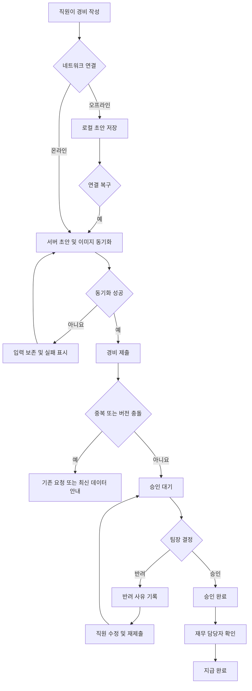

# 모바일 경비 승인 PRD

## 1. 문서 개요

- 기능명: 모바일 경비 승인
- 출시 범위: 1차 출시(MVP)
- 목적: 직원의 경비 제출부터 팀장 승인·반려, 재무 담당자의 지급 완료 처리까지 모바일에서 일관되게 수행한다.
- 상태: 구현 준비 초안
- 검증 방식: 요구사항별 기능 테스트, 권한 테스트, 동시성 테스트, 오프라인 복구 테스트, 접근성 점검
- 문서 검증기: 파일을 생성하지 않았으므로 실행하지 않음

## 2. 적용 범위

| 계약 항목 | 적용 여부 | 근거 |
|---|---|---|
| 사용자 화면 및 상태 정의 | Required | 직원, 팀장, 재무 담당자가 사용하는 사용자 노출 기능 |
| 다단계 상태 흐름 | Required | 초안 → 제출 → 승인/반려 → 지급 완료의 수명주기 존재 |
| 서버 권한 및 데이터 경계 | Required | 팀별 승인 범위와 역할별 변경 권한을 서버에서 보장해야 함 |
| 오프라인 및 동기화 | Required | 오프라인 초안을 연결 복구 후 동기화해야 함 |
| 동시성 및 충돌 처리 | Required | 승인과 수정, 중복 요청, 권한 변경이 동시에 발생할 수 있음 |
| 접근성 요구사항 | Required | WCAG 2.2 AA가 명시된 목표 |
| 정량 성능 목표 | N/A | 현재 측정 기준선이 없어 임의 수치를 확정할 수 없음 |
| 다중 통화 | N/A | 1차 출시 제외 |
| ERP 자동 연동 | N/A | 1차 출시 제외 |

## 3. 배경과 문제

현재 경비 제출과 승인 과정에서 다음 문제가 발생할 수 있다.

- 직원이 모바일에서 영수증과 경비 정보를 즉시 제출하기 어렵다.
- 네트워크가 불안정하면 작성 중인 내용이 유실될 수 있다.
- 팀장과 재무 담당자의 처리 권한이 명확히 분리되지 않으면 잘못된 승인이나 지급 처리가 발생할 수 있다.
- 재시도나 중복 탭으로 동일 경비가 여러 번 제출될 수 있다.
- 승인과 직원의 수정이 동시에 발생하면 승인된 내용이 사용자가 확인한 내용과 달라질 수 있다.
- 권한이나 소속 팀이 변경되는 시점에 오래 열린 화면을 사용하면 권한이 없는 작업이 실행될 수 있다.

## 4. 목표

- 직원이 모바일에서 영수증 사진, 금액, 카테고리를 입력해 경비를 제출할 수 있다.
- 오프라인에서도 초안을 작성하고 연결 복구 후 안전하게 동기화할 수 있다.
- 팀장은 권한이 있는 자기 팀의 요청만 승인하거나 반려할 수 있다.
- 반려 시 사유를 필수로 기록한다.
- 재무 담당자는 승인된 요청만 지급 완료로 처리할 수 있다.
- 중복 제출과 이미지 업로드 실패로 인한 데이터 손실을 방지한다.
- 모든 변경 작업에서 최신 권한과 데이터 버전을 서버가 검증한다.
- 주요 사용자 흐름을 WCAG 2.2 AA 기준에 맞춘다.

## 5. 비목표

1차 출시에서는 다음을 제공하지 않는다.

- 외화 입력, 환율 계산 및 다중 통화 정산
- ERP와의 자동 지급 또는 자동 전표 연동
- 부분 승인 또는 금액 일부 지급
- 다단계 승인선
- 여러 요청의 일괄 승인·반려·지급
- 영수증 OCR 자동 입력
- 앱 내부 실제 송금
- 성능 SLA의 확정

## 6. 사용자와 역할

| 역할 | 주요 권한 |
|---|---|
| 직원 | 자신의 초안 생성·수정·삭제, 자신의 경비 제출, 자신의 요청 및 처리 결과 조회 |
| 팀장 | 현재 승인 권한을 가진 팀에 귀속된 제출 요청 조회, 승인, 반려, 반려 사유 입력 |
| 재무 담당자 | 승인된 요청 조회, 지급 완료 처리, 지급 상태 조회 |
| 시스템 | 오프라인 초안 동기화, 중복 요청 방지, 권한 및 버전 검증, 감사 기록 생성 |

한 사용자가 복수 역할을 가질 수 있으나, 각 작업은 해당 작업에 필요한 권한을 독립적으로 검사한다.

## 7. 핵심 데이터

### 7.1 경비 요청

- 요청 ID
- 제출자 ID
- 귀속 팀 ID
- 영수증 이미지 참조
- 금액
- 통화: 1차 출시에서는 단일 기준 통화
- 카테고리 ID
- 현재 상태
- 반려 사유
- 데이터 버전
- 클라이언트 생성 ID
- 생성·수정·제출·승인·반려·지급 완료 시각
- 각 상태 변경 수행자 ID

### 7.2 감사 기록

다음 이벤트에 대해 변경 전후 상태, 수행자, 수행 시각, 대상 요청 및 데이터 버전을 기록한다.

- 제출
- 제출 내용 수정
- 승인
- 반려
- 지급 완료
- 권한 부족으로 거부된 상태 변경
- 버전 충돌로 거부된 상태 변경

감사 기록은 일반 사용자가 수정하거나 삭제할 수 없다. 보관 기간은 열린 결정으로 둔다.

## 8. 상태 모델

| 상태 | 의미 | 허용되는 다음 상태 |
|---|---|---|
| `LOCAL_DRAFT` | 기기에만 저장된 오프라인 초안 | `SYNCING`, 삭제 |
| `SYNCING` | 서버 동기화 또는 이미지 업로드 진행 중 | `DRAFT`, `SYNC_FAILED` |
| `SYNC_FAILED` | 동기화가 완료되지 않음 | `SYNCING`, 삭제 |
| `DRAFT` | 서버에 저장된 미제출 초안 | `PENDING_APPROVAL`, 삭제 |
| `PENDING_APPROVAL` | 제출되어 팀장 결정을 기다림 | `APPROVED`, `REJECTED` |
| `APPROVED` | 팀장 승인 완료 | `PAID` |
| `REJECTED` | 반려 완료 | `DRAFT` |
| `PAID` | 지급 완료 | 최종 상태 |

- 이미지 업로드가 완료되지 않은 요청은 `DRAFT`에서 `PENDING_APPROVAL`로 전환할 수 없다.
- `PAID`는 1차 출시의 최종 상태이며 일반 화면에서 되돌릴 수 없다.
- 지급 취소나 승인 취소가 필요하면 별도 운영 절차를 사용하며, 제품 기능 추가 여부는 후속 범위로 둔다.

## 9. 기능 요구사항

| ID | 요구사항 | 우선순위 |
|---|---|---|
| FR-001 | 직원은 영수증 사진, 금액, 카테고리를 포함한 경비 초안을 생성할 수 있다. | Must |
| FR-002 | 금액은 0보다 큰 단일 기준 통화 금액이어야 한다. | Must |
| FR-003 | 영수증 이미지 업로드가 완료되고 필수 필드가 유효할 때만 제출할 수 있다. | Must |
| FR-004 | 직원은 자신의 초안과 자신이 제출한 요청만 조회할 수 있다. | Must |
| FR-005 | 오프라인에서 생성·수정한 초안은 기기에 보존되고 연결 복구 후 동기화된다. | Must |
| FR-006 | 동기화 성공 여부와 실패한 항목을 사용자가 구분할 수 있어야 한다. | Must |
| FR-007 | 이미지 업로드 실패 시 입력 내용과 로컬 이미지 참조를 유지하고 재시도할 수 있어야 한다. | Must |
| FR-008 | 동일한 제출 작업의 재시도는 하나의 요청만 생성하도록 멱등 처리한다. | Must |
| FR-009 | 시스템은 내용이 유사한 기존 요청을 잠재적 중복으로 식별하고 제출 전 경고한다. | Should |
| FR-010 | 팀장은 서버가 현재 승인 권한을 인정하는 자기 팀의 `PENDING_APPROVAL` 요청만 조회하고 처리할 수 있다. | Must |
| FR-011 | 팀장은 요청의 최신 내용을 확인한 후 승인할 수 있다. | Must |
| FR-012 | 팀장은 반려 사유를 입력해야 요청을 반려할 수 있다. | Must |
| FR-013 | 재무 담당자는 `APPROVED` 요청만 `PAID`로 변경할 수 있다. | Must |
| FR-014 | 지급 완료 작업에는 수행자와 처리 시각이 기록된다. | Must |
| FR-015 | 모든 조회 및 변경 권한은 UI 노출 여부와 관계없이 서버에서 검증한다. | Must |
| FR-016 | 서버는 상태 변경 시 요청 ID, 예상 버전, 현재 권한, 현재 상태를 함께 검증한다. | Must |
| FR-017 | 예상 버전과 서버 최신 버전이 다르면 작업을 적용하지 않고 충돌 결과를 반환한다. | Must |
| FR-018 | 충돌 발생 시 사용자는 최신 내용을 다시 불러온 뒤 작업을 재시도해야 한다. | Must |
| FR-019 | 화면을 연 뒤 역할이나 팀 권한이 변경된 경우, 다음 서버 요청부터 최신 권한을 적용한다. | Must |
| FR-020 | 권한이 사라진 사용자의 승인·반려·지급 작업은 저장되지 않으며 권한 변경 안내를 표시한다. | Must |
| FR-021 | 각 상태 변경은 감사 기록으로 남는다. | Must |
| FR-022 | 카테고리는 관리되는 활성 목록에서 선택하며, 비활성화된 카테고리는 새 제출에 사용할 수 없다. | Should |
| FR-023 | 반려된 요청은 반려 사유와 함께 직원에게 표시되고 초안으로 전환하여 수정·재제출할 수 있다. | Must |
| FR-024 | 제출 이후의 편집 정책에 따라, 허용된 수정은 반드시 데이터 버전을 증가시킨다. | Must |
| FR-025 | 사용자는 동기화되지 않은 로컬 초안을 명시적으로 삭제할 수 있으며 삭제 전에 확인을 받아야 한다. | Should |

## 10. 화면 정의

경로는 개념적 명칭이며 실제 URL 또는 네이티브 내비게이션 구조는 플랫폼 결정 후 확정한다.

| 화면 | 주요 사용자 | 핵심 기능 |
|---|---|---|
| 내 경비 목록 | 직원 | 초안, 동기화 실패, 승인 대기, 승인, 반려, 지급 완료 상태 조회 |
| 경비 작성/수정 | 직원 | 사진 추가, 금액 입력, 카테고리 선택, 저장, 제출 |
| 경비 상세 | 전 역할 | 권한에 따른 상세 정보, 처리 이력, 반려 사유 조회 |
| 팀 승인함 | 팀장 | 자기 팀의 승인 대기 요청 조회 |
| 승인 검토 | 팀장 | 최신 요청 확인, 승인, 반려 사유 입력 |
| 지급 대기함 | 재무 담당자 | 승인된 요청 조회 |
| 지급 처리 | 재무 담당자 | 요청 확인, 지급 완료 표시 |

## 11. 화면 상태 매트릭스

| 화면 | 빈 상태 | 로딩 상태 | 오류 상태 | 성공 상태 | 복구 |
|---|---|---|---|---|---|
| 내 경비 목록 | 등록된 요청 없음 | 목록 로딩 표시 | 조회 실패 안내 | 상태별 요청 표시 | 다시 시도 |
| 경비 작성 | 신규 입력 폼 | 이미지 처리/동기화 표시 | 검증·업로드 실패 표시 | 초안 저장 또는 제출 완료 | 필드 유지 후 재시도 |
| 팀 승인함 | 승인 대기 요청 없음 | 목록 로딩 표시 | 조회 또는 권한 오류 | 자기 팀 요청 표시 | 새로고침 또는 권한 재확인 |
| 승인 검토 | 해당 없음 | 최신 버전 로딩 | 충돌·권한 변경·상태 변경 안내 | 승인 또는 반려 완료 | 최신 데이터 불러오기 |
| 지급 대기함 | 지급 대기 요청 없음 | 목록 로딩 표시 | 조회 실패 안내 | 승인된 요청 표시 | 다시 시도 |
| 지급 처리 | 해당 없음 | 처리 중 표시 | 이미 처리됨·권한 오류·충돌 안내 | 지급 완료 표시 | 최신 상태 불러오기 |
| 오프라인 초안 | 초안 없음 | 동기화 중 표시 | 항목별 실패 원인 표시 | 동기화 완료 | 항목별 또는 전체 재시도 |

## 12. 주요 사용자 흐름

## 13. 오프라인 및 동기화 정책

### 13.1 로컬 초안

- 오프라인에서는 작성과 초안 저장을 허용한다.
- 초안에는 클라이언트에서 생성한 고유 ID를 부여한다.
- 앱 종료 또는 화면 이동 후에도 초안이 유지되어야 한다.
- 로그인 세션이 만료된 상태에서는 재인증 전 서버 동기화를 수행하지 않는다.
- 공유 기기의 다른 계정에 이전 사용자의 초안을 노출하지 않는다.

### 13.2 동기화

- 연결 복구를 감지하면 사용자에게 동기화 상태를 표시하고 동기화를 시도한다.
- 동일한 클라이언트 생성 ID에 대한 재시도는 같은 서버 초안을 갱신해야 한다.
- 텍스트 데이터 동기화와 이미지 업로드 중 하나라도 실패하면 제출 가능 상태로 표시하지 않는다.
- 실패한 항목만 재시도할 수 있어야 한다.
- 자동 재시도 정책의 횟수와 간격은 연결 품질 측정 후 확정한다.

### 13.3 충돌

같은 초안이 둘 이상의 기기에서 수정된 경우 서버가 조용히 덮어쓰지 않는다.

- 서버 버전이 일치하면 저장한다.
- 버전이 다르면 충돌 상태를 반환한다.
- 사용자에게 서버 최신본과 현재 기기 초안이 충돌했음을 알린다.
- 1차 출시의 기본 복구 방식은 최신본 확인 후 사용자가 저장 또는 재입력하는 방식으로 한다.
- 자동 필드 병합은 범위에서 제외한다.

## 14. 중복 제출 정책

중복은 두 종류로 구분한다.

### 14.1 기술적 중복

같은 제출 버튼의 반복 선택, 타임아웃 후 재시도처럼 하나의 사용자 작업에서 발생한 중복이다.

- 클라이언트 제출 키를 사용하여 서버에서 멱등 처리한다.
- 같은 키로 재요청하면 새 요청을 만들지 않고 기존 처리 결과를 반환한다.
- 사용자가 응답을 받지 못했더라도 목록 새로고침으로 기존 요청을 확인할 수 있어야 한다.

### 14.2 잠재적 업무 중복

다른 제출 키를 사용했지만 동일 영수증 또는 동일 경비일 가능성이 있는 요청이다.

- 탐지 기준은 최소한 제출자, 금액, 카테고리 및 영수증 이미지 식별 정보를 후보로 한다.
- 시스템은 후보를 사용자에게 경고하되, 1차 출시에서는 무조건 차단하지 않는다.
- 사용자가 계속 제출한 경우 중복 경고를 확인했다는 사실을 감사 정보로 남긴다.
- 정확한 탐지 기준과 관리자 처리 정책은 열린 결정으로 둔다.

## 15. 동시 수정 및 승인 정책

모든 변경 API는 클라이언트가 마지막으로 확인한 `expectedVersion`을 전달해야 한다.

예시:

1. 팀장이 버전 4의 요청을 연다.
2. 직원 또는 다른 처리 과정이 요청을 버전 5로 변경한다.
3. 팀장이 버전 4를 기준으로 승인을 시도한다.
4. 서버는 승인을 저장하지 않고 충돌을 반환한다.
5. 팀장은 버전 5의 내용을 다시 확인한 후 승인 또는 반려한다.

추가 규칙:

- 승인과 반려가 동시에 요청되면 서버에 먼저 유효하게 반영된 하나만 성공한다.
- 승인과 지급 완료가 동시에 요청되더라도 지급은 승인 상태가 확정된 뒤에만 가능하다.
- 이미 `APPROVED`, `REJECTED` 또는 `PAID`가 된 요청에 과거 화면에서 다시 결정을 보내면 현재 상태를 반환한다.
- 충돌 화면에서 기존 입력한 반려 사유는 가능한 한 유지하되, 최신 요청을 확인한 후 사용자가 다시 제출해야 한다.

## 16. 권한 및 데이터 경계

### 직원

- 제출자 ID가 본인인 요청만 조회할 수 있다.
- 다른 직원의 요청 ID를 직접 입력해도 접근할 수 없어야 한다.
- 다른 사용자의 로컬 초안에 접근할 수 없어야 한다.

### 팀장

- 현재 승인 권한을 가진 팀에 귀속된 요청만 조회할 수 있다.
- 목록 필터뿐 아니라 상세 조회와 승인·반려 요청에서도 팀 범위를 검증한다.
- 화면을 연 뒤 팀장 권한이 제거되면 승인 또는 반려를 저장하지 않는다.
- 다른 팀의 요청 ID를 알고 있어도 상세 내용을 조회하거나 처리할 수 없다.

### 재무 담당자

- 재무 역할이 있는 사용자만 지급 대기 요청을 조회하고 지급 완료로 변경할 수 있다.
- `APPROVED`가 아닌 요청을 지급 완료로 변경할 수 없다.
- 권한이 제거된 오래된 세션에서는 다음 서버 작업이 거부된다.

### 공통

- 클라이언트가 전달한 역할, 팀 ID 또는 상태를 권한 판단의 근거로 신뢰하지 않는다.
- 서버의 최신 사용자 역할, 팀 관계, 요청 상태 및 데이터 버전을 기준으로 판단한다.
- 권한 오류와 존재하지 않는 자원 응답이 타 팀 데이터의 존재를 불필요하게 노출하지 않아야 한다.

## 17. 비기능 요구사항

### 17.1 접근성

- NFR-A11Y-001: 핵심 사용자 흐름은 WCAG 2.2 AA 충족을 목표로 한다.
- NFR-A11Y-002: 모든 기능은 키보드 또는 플랫폼 보조 입력만으로 수행 가능해야 한다.
- NFR-A11Y-003: 입력 필드에는 프로그램적으로 연결된 레이블과 오류 설명이 있어야 한다.
- NFR-A11Y-004: 상태를 색상만으로 구분하지 않는다.
- NFR-A11Y-005: 업로드, 동기화, 승인 결과 및 오류 변경을 스크린 리더가 인지할 수 있어야 한다.
- NFR-A11Y-006: 터치 대상, 포커스 표시, 대비 및 인증 흐름은 WCAG 2.2 AA 해당 성공 기준을 적용한다.
- NFR-A11Y-007: 자동 접근성 검사와 주요 흐름의 수동 보조기술 검사를 출시 조건에 포함한다.

### 17.2 보안과 개인정보

- 영수증 이미지와 경비 정보는 인증된 사용자에게만 제공한다.
- 전송 및 저장 보호는 조직의 기존 보안 기준을 따른다.
- 기기 로컬 초안은 사용자 계정 간 격리되어야 한다.
- 로그에 영수증 원본이나 불필요한 개인정보를 기록하지 않는다.
- 이미지 파일의 형식과 손상 여부를 서버에서 검증한다.
- 허용 이미지 형식과 크기 제한은 열린 결정으로 둔다.

### 17.3 신뢰성

- 상태 변경은 원자적으로 처리한다.
- 실패 응답을 성공으로 표시하지 않는다.
- 제출, 승인, 반려, 지급 완료는 안전하게 재시도할 수 있어야 한다.
- 동기화 실패가 다른 초안의 동기화를 영구적으로 막지 않아야 한다.

### 17.4 성능 측정 계획

현재 정량 목표는 확정하지 않는다. 출시 전 실제 기기와 대표 네트워크 환경에서 다음을 측정한다.

| 측정 지표 | 측정 조건 | 목표 결정 책임자 | 결정 시점 |
|---|---|---|---|
| 목록 첫 콘텐츠 표시 시간 | 대표 모바일 기기와 모바일 네트워크 | 제품·모바일 개발 책임자 | 베타 기준선 측정 후 |
| 이미지 업로드 완료 시간 | 허용 최대 크기 이미지와 대표 네트워크 | 제품·플랫폼 책임자 | 업로드 정책 확정 후 |
| 승인·반려 처리 응답 시간 | 정상 부하의 서버 요청 | 제품·백엔드 책임자 | 베타 부하 측정 후 |
| 오프라인 초안 동기화 완료 시간 | 연결 복구 및 복수 초안 | 제품·모바일 개발 책임자 | 베타 동기화 테스트 후 |
| 업로드 및 동기화 실패율 | 베타 실사용 환경 | 제품·운영 책임자 | 출시 승인 전 |

수치 목표는 기준선 측정 후 별도 결정 기록으로 승인하고 본 PRD에 반영한다.

## 18. 수용 기준

| ID | 연결 요구사항 | Given | When | Then | 검증 |
|---|---|---|---|---|---|
| AC-001 | FR-001~003 | 직원이 유효한 사진, 금액, 카테고리를 입력함 | 제출함 | 요청이 한 번 생성되고 `PENDING_APPROVAL`이 됨 | 기능 테스트 |
| AC-002 | FR-003, FR-007 | 이미지 업로드가 실패함 | 직원이 제출을 시도함 | 제출되지 않고 입력과 이미지가 보존되며 재시도할 수 있음 | 장애 주입 테스트 |
| AC-003 | FR-005~007 | 직원이 오프라인에서 초안을 작성함 | 연결이 복구됨 | 같은 초안 ID로 서버에 동기화되고 성공 또는 항목별 실패가 표시됨 | 오프라인 E2E |
| AC-004 | FR-008 | 동일 제출 키의 요청이 반복됨 | 서버가 요청을 처리함 | 경비 요청은 하나만 생성되고 동일 결과를 반환함 | API 통합 테스트 |
| AC-005 | FR-009 | 잠재적 중복 조건을 만족하는 기존 요청이 있음 | 새 요청을 제출함 | 중복 가능성을 경고하고 계속 진행 여부를 받음 | 기능 테스트 |
| AC-006 | FR-010, FR-015 | 팀장이 자기 팀의 승인 대기 요청을 조회함 | 승인함 | 요청이 `APPROVED`로 변경되고 수행자가 기록됨 | 권한·기능 테스트 |
| AC-007 | FR-010, FR-015 | 팀장이 다른 팀 요청 ID를 알고 있음 | 조회 또는 승인 요청함 | 데이터가 노출되지 않고 작업이 저장되지 않음 | API 권한 테스트 |
| AC-008 | FR-012 | 팀장이 반려 사유를 입력하지 않음 | 반려를 시도함 | 반려되지 않고 사유 입력 오류가 표시됨 | 기능 테스트 |
| AC-009 | FR-012, FR-023 | 팀장이 사유를 입력해 반려함 | 직원이 요청을 조회함 | `REJECTED` 상태와 반려 사유가 표시되고 수정 경로가 제공됨 | E2E |
| AC-010 | FR-013, FR-014 | 재무 담당자가 승인 요청을 조회함 | 지급 완료 처리함 | 요청이 `PAID`로 변경되고 수행자와 시각이 기록됨 | E2E |
| AC-011 | FR-013 | 요청이 승인 상태가 아님 | 지급 완료를 요청함 | 서버가 거부하고 요청 상태가 바뀌지 않음 | API 상태 테스트 |
| AC-012 | FR-016~018 | 팀장이 버전 4를 보고 있고 서버는 버전 5임 | 버전 4로 승인함 | 승인이 저장되지 않고 최신 데이터 확인 안내가 표시됨 | 동시성 테스트 |
| AC-013 | FR-016~018 | 두 팀장이 같은 버전을 동시에 처리함 | 각각 승인과 반려를 요청함 | 하나만 성공하고 나머지는 상태 충돌을 받음 | 경쟁 조건 테스트 |
| AC-014 | FR-019~020 | 팀장이 화면을 연 뒤 승인 권한을 잃음 | 승인 또는 반려함 | 서버가 최신 권한으로 거부하고 변경이 저장되지 않음 | 권한 변경 테스트 |
| AC-015 | FR-019~020 | 재무 담당자가 화면을 연 뒤 역할을 잃음 | 지급 완료를 요청함 | 서버가 거부하고 요청이 `APPROVED`로 유지됨 | 권한 변경 테스트 |
| AC-016 | FR-021 | 유효한 상태 변경이 완료됨 | 감사 기록을 조회함 | 수행자, 시각, 전후 상태와 버전이 확인됨 | 통합 테스트 |
| AC-017 | FR-004, FR-015 | 직원이 다른 직원 요청에 접근함 | 상세 조회함 | 요청 내용이 노출되지 않음 | API 권한 테스트 |
| AC-018 | NFR-A11Y-001~007 | 사용자가 핵심 흐름을 수행함 | 키보드와 지정 보조기술로 테스트함 | 차단 이슈 없이 완료되고 WCAG 2.2 AA 검사 기준을 충족함 | 자동·수동 접근성 검사 |
| AC-019 | FR-006 | 일부 초안만 동기화에 실패함 | 동기화 화면을 확인함 | 성공과 실패 항목이 구분되고 실패 항목만 재시도할 수 있음 | E2E |
| AC-020 | FR-023~024 | 반려 요청을 수정해 재제출함 | 제출이 성공함 | 버전이 증가하고 `PENDING_APPROVAL`로 전환됨 | 상태 전이 테스트 |

## 19. 합리적 가정

다음은 브리프를 구현 가능한 수준으로 만들기 위해 적용한 가정이다.

- 1차 출시에서는 조직이 정한 하나의 기준 통화만 사용한다.
- 경비 한 건에는 영수증 이미지 한 장이 필수다.
- 팀과 역할 정보는 기존 인증·조직 시스템에서 제공된다.
- 카테고리는 시스템이 제공하는 목록에서 하나를 선택한다.
- 앱 내부 지급 완료는 실제 송금을 실행하는 기능이 아니라 업무 상태를 기록하는 기능이다.
- 반려된 요청은 기존 요청의 이력을 유지한 채 수정·재제출한다.
- 제출, 승인, 반려 및 지급 완료에는 낙관적 잠금 방식의 버전 검증을 적용한다.
- 오프라인에서는 초안 작성·수정까지만 보장하며 최종 제출은 서버 연결 후 수행한다.
- 잠재적 중복은 오탐 가능성이 있으므로 1차 출시에서 경고를 기본값으로 하고 자동 차단하지 않는다.
- 지급 완료 상태는 일반 사용자 기능으로 취소할 수 없다.

## 20. 열린 결정

구현 착수 또는 해당 기능 개발 전에 제품·운영·보안 담당자가 결정해야 한다.

| ID | 결정 항목 | 권장 기본안 | 결정 시점 |
|---|---|---|---|
| OD-001 | 구현 채널: 네이티브 앱, 모바일 웹 또는 PWA | 기존 인증·배포 환경과 오프라인 저장 능력을 기준으로 선택 | 기술 설계 전 |
| OD-002 | 제출 후 승인 대기 상태에서 직원 수정 허용 여부 | 수정 불허, 필요 시 반려 후 수정 | 상태 API 확정 전 |
| OD-003 | 직원이 팀 이동한 경우 기존 요청의 승인 팀 | 제출 당시 팀에 귀속 유지 | 권한 모델 확정 전 |
| OD-004 | 팀장 변경 시 기존 요청 처리 권한 | 해당 팀의 현재 팀장이 처리 | 권한 모델 확정 전 |
| OD-005 | 단일 기준 통화 및 금액 소수점 정책 | 조직 회계 기준 통화와 최소 단위 사용 | 입력 규칙 확정 전 |
| OD-006 | 영수증 허용 형식, 최대 파일 크기 및 압축 정책 | 대표 기기 실측 후 확정 | 이미지 개발 전 |
| OD-007 | 중복 후보 판정 기준과 경고 무시 정책 | 제출자·금액·카테고리·이미지 식별자 기반 경고 | 베타 전 |
| OD-008 | 로컬 초안과 영수증 이미지의 보관 기간 | 운영·개인정보 정책에 맞춰 자동 만료 | 출시 전 |
| OD-009 | 서버 경비 및 감사 기록 보관 기간 | 조직의 회계·법무 정책 적용 | 출시 전 |
| OD-010 | 지급 완료의 취소 또는 정정 절차 | 1차 출시에서는 운영자 수동 절차 | 운영 설계 전 |
| OD-011 | 사용자 알림 방식 | 우선 인앱 상태 표시, 푸시는 후속 검토 | 베타 전 |
| OD-012 | 성능 정량 기준 | 베타 기준선과 실패율 측정 후 확정 | 출시 승인 전 |
| OD-013 | 접근성 수동 검증 대상 기기·브라우저·보조기술 조합 | 실제 지원 환경 기준으로 대표 조합 선정 | QA 계획 확정 전 |

OD-002가 미결정인 동안의 구현 기본안은 `PENDING_APPROVAL` 상태의 직원 수정을 금지하는 것이다. 향후 수정을 허용하더라도 FR-016~018의 버전 충돌 검증을 반드시 적용해, 팀장이 확인하지 않은 변경 내용이 승인되지 않게 한다.

## 21. 위험과 완화 방안

| 위험 | 영향 | 완화 |
|---|---|---|
| 불안정한 네트워크에서 이미지 업로드 반복 실패 | 제출 포기 또는 중복 제출 | 로컬 보존, 항목별 재시도, 멱등 키, 명확한 상태 표시 |
| 여러 기기에서 같은 초안 수정 | 데이터 덮어쓰기 | 버전 검증, 충돌 안내, 자동 병합 제외 |
| 오래 열린 화면에서 권한 변경 | 무권한 승인 또는 지급 | 모든 변경 시 서버의 최신 권한 재검사 |
| 승인과 수정이 동시에 발생 | 검토하지 않은 내용 승인 | 예상 버전 검증 및 충돌 시 작업 전체 거부 |
| 중복 탐지 오탐 | 정상 경비 제출 방해 | 1차 출시에서는 경고 중심, 감사 기록 유지 |
| 중복 탐지 누락 | 이중 지급 가능성 | 지급 전 재무 확인, 후보 규칙 측정·개선 |
| 영수증에 포함된 개인정보 노출 | 개인정보 침해 | 접근 통제, 계정별 로컬 격리, 로그 최소화 |
| 지급 완료 오처리 | 회계 정합성 훼손 | 승인 상태 검증, 감사 기록, 정정 운영 절차 |
| 성능 목표 미확정 | 출시 품질 판단 불명확 | 베타 측정 지표·책임자·결정 시점 사전 지정 |
| 접근성 목표가 선언에 그침 | 사용 불가 및 출시 지연 | 설계 단계 점검, 자동 검사와 수동 보조기술 검사를 출시 조건화 |

## 22. 출시 계획

| 단계 | 포함 요구사항 | 검증 가능한 종료 조건 |
|---|---|---|
| 1. 도메인·권한 기반 | FR-010~021 | 상태 전이, 팀 경계, 역할 변경, 버전 충돌 API 테스트 통과 |
| 2. 직원 제출·오프라인 | FR-001~009, FR-022, FR-025 | 온라인·오프라인 작성, 이미지 실패 복구, 멱등 제출 E2E 통과 |
| 3. 승인·반려 | FR-010~012, FR-016~024 | 자기 팀 승인, 필수 반려 사유, 재제출 및 동시성 테스트 통과 |
| 4. 지급 처리 | FR-013~014, FR-019~021 | 승인 요청만 지급 완료 가능하고 감사 기록 검증 완료 |
| 5. 접근성·성능 기준선 | NFR-A11Y-001~007 및 성능 측정 계획 | 핵심 흐름 WCAG 2.2 AA 점검 완료, 성능 기준선과 출시 목표 승인 |
| 6. 출시 승인 | 전체 Must 요구사항 | 모든 Must 수용 기준 통과, 열린 결정 중 출시 차단 항목 종결, 운영 절차 승인 |

## 23. 출시 승인 조건

- 모든 Must 기능 요구사항과 연결된 수용 기준이 통과해야 한다.
- 타 팀 또는 타 직원의 데이터를 조회·변경할 수 없다는 서버 권한 테스트가 통과해야 한다.
- 이미지 업로드 실패와 오프라인 동기화 실패에서 입력 데이터가 보존되어야 한다.
- 중복 네트워크 요청이 하나의 경비 요청만 생성해야 한다.
- 승인·반려·지급의 동시 요청에서 하나의 유효한 상태 전이만 반영되어야 한다.
- 권한 변경 후 오래 열린 화면을 통한 작업이 서버에서 거부되어야 한다.
- 핵심 흐름에 대한 WCAG 2.2 AA 검증이 완료되어야 한다.
- 성능 기준선이 측정되고 출시 목표 또는 허용 기준이 별도로 승인되어야 한다.
- OD-001~006, OD-008~010, OD-012~013 중 구현 또는 운영을 차단하는 결정이 종결되어야 한다.