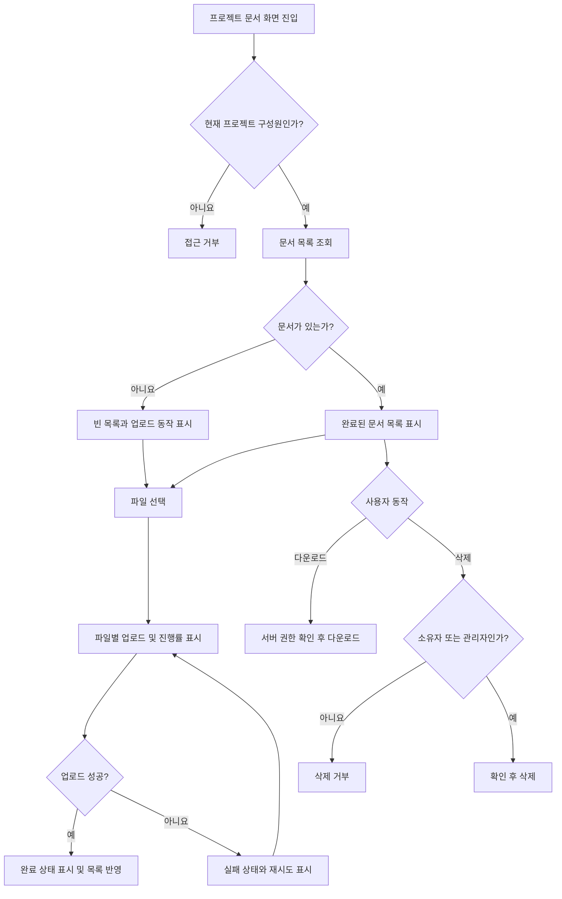

# 사내 프로젝트 문서 공유 PRD

## 1. 적용 범위

| 계약 항목 | 적용 | 근거 |
|---|---|---|
| 사용자 화면 및 경로 | Required | 문서 목록·업로드·다운로드·삭제 UI가 필요함 |
| 사용자 상태 매트릭스 | Required | 빈 목록, 업로드 진행·실패·완료 상태가 명시됨 |
| 사용자 흐름 | Required | 업로드와 권한 변경이 여러 단계의 생명주기를 가짐 |
| 수치형 비기능 요구사항 | Required | 문서 목록 2초 노출 목표가 있으나 SLA는 미확정 |
| 서버 권한 및 데이터 경계 | Required | 프로젝트 소속·역할·문서 소유자에 따라 접근 권한이 달라짐 |

## 2. 배경과 문제

프로젝트 문서가 개인 저장소나 메시지 채널에 분산되어 있어, 구성원이 필요한 문서를 찾거나 최신 공유 상태를 확인하기 어렵다. 프로젝트 단위로 문서를 업로드하고 구성원에게 안전하게 공유할 수 있는 중앙화된 기능이 필요하다.

1차 내부 베타에서는 문서 공유의 핵심 흐름인 업로드, 목록 조회, 다운로드, 삭제를 검증한다.

## 3. 목표

- 프로젝트 구성원이 해당 프로젝트의 문서를 업로드하고 공유할 수 있다.
- 구성원이 프로젝트 문서 목록을 빠르게 확인하고 다운로드할 수 있다.
- 일반 구성원과 프로젝트 관리자의 삭제 권한을 구분한다.
- 업로드 진행, 실패, 재시도, 완료 상태를 명확하게 제공한다.
- 4주 이내 내부 베타를 배포할 수 있는 최소 범위로 제한한다.
- 모든 문서 접근 권한을 서버에서 검증하여 프로젝트 간 정보 노출을 방지한다.

## 4. 비목표

1차 출시에는 다음을 포함하지 않는다.

- 문서 검색, 필터 및 고급 정렬
- 외부 사용자 또는 공개 링크 공유
- 문서 미리보기 및 온라인 편집
- 폴더, 태그, 버전 관리
- 여러 프로젝트에 대한 일괄 업로드·이동
- 삭제 문서 복구 또는 휴지통
- 신규 프로젝트 관리 기능 자체의 구축  
  단, 기존 구성원 초대·제거 기능과의 연동 여부는 열린 결정 `OD-01`을 따른다.

## 5. 사용자 및 권한

### 역할

- 프로젝트 관리자: 프로젝트 구성원 및 모든 프로젝트 문서를 관리하는 직원
- 일반 구성원: 프로젝트에 참여하고 문서를 이용하는 직원
- 비구성원: 해당 프로젝트에 현재 소속되지 않은 직원

### 권한 매트릭스

| 작업 | 프로젝트 관리자 | 일반 구성원 | 비구성원 |
|---|---:|---:|---:|
| 문서 목록 조회 | 허용 | 허용 | 거부 |
| 문서 업로드 | 허용 | 허용 | 거부 |
| 문서 다운로드 | 허용 | 허용 | 거부 |
| 본인이 업로드한 문서 삭제 | 허용 | 허용 | 거부 |
| 다른 사람이 업로드한 문서 삭제 | 허용 | 거부 | 거부 |
| 구성원 초대·제거 | 허용 | 거부 | 거부 |

UI에서 버튼을 숨기는 것만으로 권한을 보장하지 않는다. 목록, 업로드, 다운로드, 삭제 및 구성원 관리 요청마다 서버가 현재 권한을 검증해야 한다.

## 6. 기능 요구사항

| ID | 요구사항 | 우선순위 |
|---|---|---|
| FR-001 | 활성 프로젝트 구성원은 해당 프로젝트의 완료된 문서 목록을 조회할 수 있다. | P0 |
| FR-002 | 목록에는 최소한 파일명, 파일 크기, 업로더, 업로드 완료 시각을 표시한다. | P0 |
| FR-003 | 목록은 기본적으로 업로드 완료 시각의 최신순으로 표시한다. | P0 |
| FR-004 | 문서가 없으면 빈 목록 안내와 업로드 진입점을 표시한다. | P0 |
| FR-005 | 프로젝트 구성원은 하나 이상의 로컬 파일을 선택해 업로드할 수 있다. | P0 |
| FR-006 | 업로드 중인 각 파일에 진행률을 표시한다. 여러 파일은 파일별 상태를 독립적으로 표시한다. | P0 |
| FR-007 | 업로드가 완료되면 해당 파일을 완료 상태로 표시하고 목록에 반영한다. | P0 |
| FR-008 | 업로드가 실패하면 실패한 파일과 원인을 사용자가 이해할 수 있는 수준으로 표시하고 재시도 동작을 제공한다. | P0 |
| FR-009 | 재시도는 성공한 파일에 영향을 주지 않고 실패한 파일만 다시 업로드한다. | P0 |
| FR-010 | 구성원은 권한이 있는 문서를 원래 파일명으로 다운로드할 수 있다. | P0 |
| FR-011 | 일반 구성원은 자신이 업로드한 문서만 삭제할 수 있다. | P0 |
| FR-012 | 프로젝트 관리자는 해당 프로젝트의 모든 문서를 삭제할 수 있다. | P0 |
| FR-013 | 삭제 전 대상 파일을 확인할 수 있는 확인 절차를 제공하고, 성공 후 목록에서 제거한다. | P0 |
| FR-014 | 삭제 실패 시 문서를 목록에 유지하고 실패 안내와 재시도 동작을 제공한다. | P0 |
| FR-015 | 비구성원 또는 권한이 제거된 사용자의 목록·업로드·다운로드·삭제 요청을 거부한다. | P0 |
| FR-016 | 프로젝트 구성원 변경이 발생하면 문서 접근 권한에도 반영한다. | P0 |
| FR-017 | 관리자는 구성원을 초대하거나 제거할 수 있다. 1차에서 신규 UI를 구현할지는 `OD-01`에 따른다. | 조건부 P0 |
| FR-018 | 검색 및 외부 공유 기능은 UI와 API 모두 1차 범위에 포함하지 않는다. | P0 |

## 7. 화면

### 프로젝트 문서 화면

예상 진입 구조: `프로젝트 상세 > 문서`

화면 구성:

- 프로젝트명 및 문서 영역 제목
- 업로드 버튼 또는 파일 선택 영역
- 현재 업로드 작업 목록
- 완료된 문서 목록
- 권한에 따른 다운로드·삭제 동작
- 빈 목록, 로딩, 오류 및 재시도 상태

정확한 URL과 기존 프로젝트 화면 내 배치는 구현 환경에 맞춰 결정한다.

### 프로젝트 구성원 관리 화면

기존 구성원 관리 기능이 있다는 가정 아래 이를 재사용한다. 기존 기능이 없다면 `OD-01` 결정에 따라 1차 범위 또는 후속 범위로 편성한다.

## 8. 사용자 상태 매트릭스

| 영역 | 빈 상태 | 로딩/진행 | 오류 | 성공 | 복구 |
|---|---|---|---|---|---|
| 문서 목록 | “아직 공유된 문서가 없습니다”와 업로드 버튼 | 목록 스켈레톤 또는 로딩 표시 | 목록을 불러오지 못했다는 안내 | 문서 목록 표시 | 목록 다시 불러오기 |
| 업로드 | 선택 파일 없음 | 파일별 진행률 표시 | 파일별 실패 원인 표시 | 완료 표시 후 목록 반영 | 실패 파일 재시도 |
| 다운로드 | 해당 없음 | 다운로드 시작 상태 | 권한·파일 없음·네트워크 오류 안내 | 브라우저 또는 클라이언트 다운로드 시작 | 다시 시도 또는 목록 새로고침 |
| 삭제 | 해당 없음 | 삭제 처리 중, 중복 요청 방지 | 문서를 목록에 유지하고 오류 표시 | 목록에서 제거 | 삭제 재시도 |
| 접근 권한 | 해당 없음 | 권한 확인 중 | 접근 거부 안내 | 허용된 화면 표시 | 프로젝트 화면으로 이동 |

업로드 중 페이지를 이탈하거나 새로고침했을 때의 복구 정책은 `OD-04`에서 결정한다.

## 9. 주요 흐름

## 10. 권한 및 데이터 경계

- 문서는 하나의 프로젝트에만 소속된다.
- 사용자는 현재 구성원인 프로젝트의 문서만 조회·업로드·다운로드할 수 있다.
- 문서 삭제 시 문서의 프로젝트, 요청자의 프로젝트 역할, 업로더 식별자를 서버에서 함께 검증한다.
- 문서 식별자를 직접 변경해 다른 프로젝트 문서에 접근하는 요청은 거부한다.
- 다운로드 주소가 발급되더라도 다른 프로젝트 또는 권한이 제거된 사용자가 장기간 재사용할 수 없어야 한다. 구체적인 전달 방식과 만료 시간은 기술 설계에서 결정한다.
- 구성원에서 제거된 사용자는 이후의 목록·업로드·다운로드·삭제 요청이 즉시 거부되어야 한다.
- 구성원 제거와 업로드 완료가 동시에 발생하면, 완료 처리 시점에 권한을 다시 확인하고 권한이 없으면 문서 등록을 완료하지 않는다.
- 동시에 같은 문서를 삭제한 경우 최초의 유효한 요청만 성공한다. 이후 요청에는 이미 삭제되었음을 알리고 목록 갱신을 유도한다.
- 삭제된 문서는 목록과 신규 다운로드 요청에서 접근할 수 없어야 한다.

## 11. 비기능 요구사항

| ID | 영역 | 요구사항 |
|---|---|---|
| NFR-001 | 성능 | 문서 화면 진입 후 목록 또는 빈 상태가 2초 이내 보이는 것을 제품 목표로 삼는다. 이는 확정 SLA가 아니다. |
| NFR-002 | 성능 측정 | 2초의 시작·종료 시점, 대상 사용자 비율, 네트워크 조건 및 문서 수 기준은 제품 책임자가 내부 베타 종료 전 결정한다. |
| NFR-003 | 보안 | 모든 문서 및 구성원 관리 작업은 인증된 사내 사용자에게만 제공하고, 서버에서 프로젝트 권한을 확인한다. |
| NFR-004 | 일관성 | 업로드 완료 또는 삭제 성공 후 새로고침했을 때 서버의 최종 상태와 동일한 목록을 표시한다. |
| NFR-005 | 오류 처리 | 사용자가 조치할 수 있는 실패에는 재시도 경로를 제공하고, 권한 오류처럼 재시도로 해결되지 않는 실패는 구분해 안내한다. |

가용성, 보존 기간, 백업, 악성코드 검사 및 확정 성능 SLA 수치는 근거가 없으므로 본 PRD에서 임의로 설정하지 않는다.

## 12. 수용 기준

| ID | 연결 요구사항 | Given | When | Then | 검증 |
|---|---|---|---|---|---|
| AC-001 | FR-001~004 | 구성원이 문서 화면에 진입함 | 목록 조회가 완료됨 | 완료 문서를 최신순으로 표시하거나 빈 상태를 표시함 | UI/API 통합 테스트 |
| AC-002 | FR-005~007 | 구성원이 유효한 파일을 선택함 | 업로드를 시작함 | 파일별 진행률이 표시되고 성공 시 완료 상태와 목록 항목이 나타남 | UI 통합 테스트 |
| AC-003 | FR-008~009 | 업로드 중 일부 파일만 실패함 | 실패 파일의 재시도를 선택함 | 성공 파일은 유지되고 실패 파일만 다시 업로드됨 | 실패 주입 테스트 |
| AC-004 | FR-010, FR-015 | 활성 구성원이 문서를 선택함 | 다운로드를 요청함 | 권한 확인 후 파일이 원래 파일명으로 다운로드됨 | API 권한 및 통합 테스트 |
| AC-005 | FR-011 | 일반 구성원이 본인 문서를 선택함 | 삭제를 확인함 | 삭제가 성공하고 목록에서 사라짐 | 권한·UI 통합 테스트 |
| AC-006 | FR-011 | 일반 구성원이 타인의 문서 삭제를 시도함 | 삭제 요청을 보냄 | 서버가 거부하고 문서는 유지됨 | API 권한 테스트 |
| AC-007 | FR-012 | 관리자가 다른 구성원의 문서를 선택함 | 삭제를 확인함 | 삭제가 성공하고 목록에서 사라짐 | API/UI 통합 테스트 |
| AC-008 | FR-013~014 | 삭제 가능한 문서가 있음 | 삭제 요청이 실패함 | 문서는 목록에 유지되고 오류 및 재시도 동작이 표시됨 | 실패 주입 테스트 |
| AC-009 | FR-015~016 | 사용자가 프로젝트에서 제거됨 | 목록 또는 파일 작업을 요청함 | 모든 요청이 거부되고 새 문서 정보가 노출되지 않음 | 권한 변경 통합 테스트 |
| AC-010 | FR-016~017 | 관리자가 구성원 변경을 수행함 | 초대 또는 제거가 완료됨 | 변경된 사용자의 문서 접근 권한에 결과가 반영됨 | 구성원 연동 테스트 |
| AC-011 | FR-018 | 1차 베타가 배포됨 | 문서 화면을 확인함 | 검색과 외부 공유 기능이 제공되지 않음 | 범위 점검 |
| AC-012 | NFR-001~002 | 합의된 측정 조건이 준비됨 | 목록 노출 시간을 측정함 | 2초 목표 결과가 기록되며 SLA 달성으로 표현되지 않음 | 성능 측정 리포트 |

## 13. 합리적 가정

- `AS-01` 회사의 기존 인증 체계가 있으며 모든 사용자는 식별 가능한 직원 계정으로 로그인한다.
- `AS-02` 프로젝트, 프로젝트 관리자 및 구성원 정보의 기준 데이터가 이미 존재한다.
- `AS-03` 1차 문서 기능은 기존 구성원 정보를 사용하며 별도의 프로젝트 역할 체계를 만들지 않는다.
- `AS-04` 문서 한 건은 한 프로젝트와 한 업로더에 귀속된다.
- `AS-05` 목록에는 업로드가 완료된 문서만 영구 항목으로 표시하고, 진행·실패 상태는 업로드한 사용자에게 별도 표시한다.
- `AS-06` 기본 정렬은 업로드 완료 시각 최신순이다.
- `AS-07` 삭제는 1차에서 사용자 복구 기능이 없는 삭제로 취급한다.
- `AS-08` 내부 베타 대상은 사내 직원이며 외부 계정은 지원하지 않는다.

## 14. 열린 결정

| ID | 결정 사항 | 책임자 | 결정 시점 | 미결정 시 영향 |
|---|---|---|---|---|
| OD-01 | 기존 구성원 초대·제거 기능이 실제로 존재하는지, 없다면 1차에 신규 구현할지 | 제품 책임자·개발 리드 | 1주 차 종료 전 | 권한 연동 범위와 4주 일정이 달라짐 |
| OD-02 | 허용 파일 형식, 파일당 최대 크기, 동시 업로드 개수, 프로젝트별 저장 한도 | 제품 책임자·보안·개발 | 1주 차 종료 전 | 업로드 검증 및 오류 문구를 확정할 수 없음 |
| OD-03 | 악성코드 검사, 실행 파일 차단 등 사내 보안 정책 | 보안 책임자 | 개발 착수 전 | 내부 파일 배포 위험 및 업로드 처리 흐름 변경 |
| OD-04 | 새로고침·페이지 이탈 후 진행 중 업로드를 복구할지 취소할지 | 제품 책임자 | 2주 차 전 | 클라이언트 상태 관리 복잡도가 달라짐 |
| OD-05 | 삭제 파일의 물리적 제거 시점, 보존 기간 및 관리자 복구 필요 여부 | 제품 책임자·보안/인프라 | 내부 베타 전 | 저장소 및 개인정보·감사 정책에 영향 |
| OD-06 | 목록 2초 목표의 측정 구간, 문서 수, 네트워크 조건, 백분위 및 향후 SLA | 제품 책임자 | 베타 종료 전 | 성능 결과의 합격 여부를 판정할 수 없음 |
| OD-07 | 업로드 실패 사유 중 사용자에게 노출할 범위와 내부 오류 추적 방식 | 개발·보안 | 2주 차 전 | 지원 및 보안 노출 수준에 영향 |

`OD-01`, `OD-02`, `OD-03`은 구현 범위나 보안을 크게 바꾸므로 우선 결정이 필요하다.

## 15. 위험 및 완화

| 위험 | 영향 | 완화 |
|---|---|---|
| 구성원 관리 범위가 브리프 내에서 상충함 | 4주 일정 초과 가능 | 기존 기능 재사용을 기준선으로 삼고 `OD-01`을 1주 차에 확정 |
| 파일 제한과 보안 정책 미정 | 위험 파일 유통 또는 저장 비용 증가 | 베타 전에 허용 정책을 확정하고 서버 검증 적용 |
| UI에만 삭제 권한 적용 | 다른 구성원의 문서 삭제 가능 | 모든 삭제 요청에서 서버 권한 테스트 수행 |
| 권한 제거 후 다운로드 주소 재사용 | 퇴사·제외 구성원의 문서 접근 | 만료되는 전달 방식과 요청 시점 권한 검증 적용 |
| 대용량 업로드 실패 | 사용자 혼란 및 중복 업로드 | 파일별 상태, 명확한 실패 안내, 개별 재시도 제공 |
| 2초 목표의 측정 기준 부재 | 성능 완료 여부에 대한 이견 | 베타 종료 전 측정 정의와 결과 기록을 별도 승인 |

## 16. 4주 전달 계획

| 단계 | 요구사항 ID | 검증 가능한 완료 조건 |
|---|---|---|
| 1주 차: 범위·권한 확정 | FR-001~003, FR-015~018, NFR-003 | `OD-01~03` 결정 또는 명시적 예외 승인, 권한 매트릭스와 API 계약 합의 |
| 2주 차: 핵심 기능 | FR-001~007, FR-010 | 구성원이 목록 조회, 파일 업로드, 진행률 확인 및 다운로드 가능 |
| 3주 차: 삭제·실패 처리 | FR-008~016 | 재시도, 역할별 삭제, 빈 상태, 오류 상태 및 구성원 변경 연동 테스트 통과 |
| 4주 차: 통합 검증·내부 베타 | 전체 FR, NFR-001~005 | P0 수용 기준 통과, 알려진 제한사항 기록, 성능 목표 측정 결과 확보, 내부 사용자 배포 |

내부 베타 출시 조건은 모든 P0 수용 기준 통과와 중대한 프로젝트 간 권한 노출 결함이 없는 것이다. 2초 성능은 현 단계에서 목표이므로, 미달 자체를 자동 출시 차단 조건으로 사용하려면 제품 책임자의 별도 결정이 필요하다.