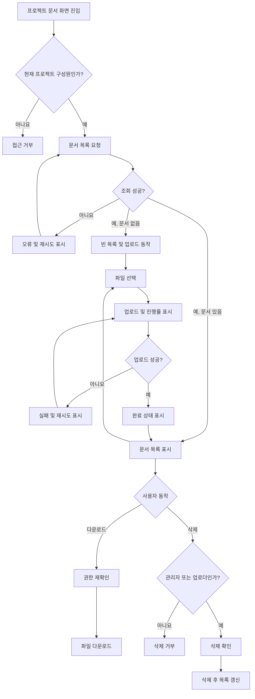

# 사내 프로젝트 문서 공유 PRD

- 문서 상태: Draft
- 목표 출시: 4주 내 내부 베타
- 범위: 1차 출시
- 제품 책임자: 미정
- 기준일: 2026-07-27

## 1. 적용성

| 계약 항목 | 적용 여부 | 근거 |
|---|---|---|
| 화면 및 경로 정의 | Required | 문서 목록, 업로드, 다운로드, 삭제가 사용자에게 노출됨 |
| 사용자 상태 매트릭스 | Required | 빈 목록, 로딩, 실패, 재시도, 업로드 완료 상태가 명시적으로 요구됨 |
| 사용자·시스템 흐름 | Required | 업로드와 삭제가 권한 확인 및 상태 전이를 포함함 |
| 수치형 비기능 요구사항 | Required | 목록을 2초 안에 표시하는 목표가 있으나 실제 SLA는 미정임 |

## 2. 배경과 문제

직원들이 프로젝트 문서를 프로젝트 구성원에게 안전하게 공유할 수 있는 공통 공간이 필요하다. 현재 브리프에서는 문서 업로드, 조회, 다운로드 및 삭제를 핵심 문제로 정의한다.

1차 출시는 4주 내 내부 베타를 목표로 하므로 문서 검색, 외부 공유, 버전 관리와 같은 확장 기능은 포함하지 않는다.

## 3. 목표

- 직원이 자신이 참여 중인 프로젝트에 문서를 업로드할 수 있다.
- 같은 프로젝트 구성원만 해당 프로젝트 문서를 보고 다운로드할 수 있다.
- 프로젝트 관리자와 일반 구성원의 문서 삭제 권한을 구분한다.
- 업로드 진행 및 결과를 사용자가 명확히 알 수 있다.
- 목록 로딩 및 오류 상황에서 사용자가 다음 행동을 판단할 수 있다.
- 4주 내 직원 대상 내부 베타를 제공한다.

## 4. 비목표

1차 출시에는 다음을 포함하지 않는다.

- 문서 검색, 필터 및 고급 정렬
- 회사 외부 사용자와의 공유
- 공개 링크 또는 만료 링크
- 문서 미리보기 및 온라인 편집
- 문서 버전 관리
- 폴더 또는 태그 관리
- 댓글, 멘션 및 승인 워크플로
- 구성원 초대·제거 UI
- 관리자용 감사 로그 UI
- 모바일 전용 앱

프로젝트 구성원 초대·제거는 전체 제품 방향에는 포함되지만, “1차 출시는 업로드, 목록, 다운로드, 삭제만 포함”한다는 범위에 따라 이번 베타에서는 제외한다.

## 5. 사용자와 권한

| 역할 | 정의 | 목록 조회·다운로드 | 업로드 | 문서 삭제 | 구성원 관리 |
|---|---|---:|---:|---:|---:|
| 프로젝트 관리자 | 프로젝트 관리 권한을 가진 직원 | 가능 | 가능 | 프로젝트 내 모든 문서 가능 | 향후 범위 |
| 일반 구성원 | 프로젝트에 참여 중인 직원 | 가능 | 가능 | 본인이 업로드한 문서만 가능 | 불가 |
| 비구성원 | 해당 프로젝트에 속하지 않은 직원 | 불가 | 불가 | 불가 | 불가 |
| 제거된 구성원 | 과거에는 구성원이었으나 현재는 제외된 직원 | 불가 | 불가 | 불가 | 불가 |

모든 권한은 화면 노출 여부와 무관하게 서버에서 검사해야 한다. 삭제 버튼을 숨기는 것만으로 권한을 보장해서는 안 된다.

## 6. 기능 요구사항

| ID | 요구사항 | 우선순위 |
|---|---|---|
| FR-001 | 사용자는 자신이 현재 구성원인 프로젝트의 문서 목록을 조회할 수 있다. | Must |
| FR-002 | 목록에는 최소한 문서명, 파일 크기, 업로더, 업로드 완료 시각을 표시한다. | Must |
| FR-003 | 목록은 기본적으로 업로드 완료 시각의 최신순으로 표시한다. | Must |
| FR-004 | 프로젝트에 문서가 없으면 빈 목록 안내와 업로드 행동을 표시한다. | Must |
| FR-005 | 목록 조회 중임을 알 수 있는 로딩 상태를 표시한다. | Must |
| FR-006 | 목록 조회가 실패하면 오류 안내와 재시도 동작을 제공한다. | Must |
| FR-007 | 프로젝트 구성원은 로컬 기기에서 파일을 선택하여 해당 프로젝트에 업로드할 수 있다. | Must |
| FR-008 | 업로드 중 파일명과 진행률을 표시한다. 진행률은 0~100% 또는 전송량 기준으로 표현할 수 있어야 한다. | Must |
| FR-009 | 업로드가 완료되면 완료 상태를 표시하고, 해당 문서를 목록에서 조회·다운로드할 수 있어야 한다. | Must |
| FR-010 | 업로드가 실패하면 실패 원인을 사용자가 행동할 수 있는 수준으로 안내하고 재시도 동작을 제공한다. | Must |
| FR-011 | 동일한 업로드 시도의 재시도로 인해 문서가 중복 생성되어서는 안 된다. | Must |
| FR-012 | 완료되지 않은 업로드는 정상 문서 목록에 다운로드 가능한 문서로 노출되어서는 안 된다. | Must |
| FR-013 | 현재 프로젝트 구성원은 해당 프로젝트의 문서를 다운로드할 수 있다. | Must |
| FR-014 | 다운로드 요청 시점마다 프로젝트 구성원 권한을 다시 확인한다. | Must |
| FR-015 | 일반 구성원은 본인이 업로드한 문서에 대해서만 삭제 동작을 사용할 수 있다. | Must |
| FR-016 | 프로젝트 관리자는 프로젝트 내 모든 문서를 삭제할 수 있다. | Must |
| FR-017 | 삭제 전 대상 문서명을 포함한 확인 절차를 제공한다. | Must |
| FR-018 | 삭제가 완료된 문서는 목록에서 제거되고 이후 조회 및 다운로드할 수 없다. | Must |
| FR-019 | 삭제가 실패하면 문서를 목록에 유지하고 오류 안내 및 재시도 동작을 제공한다. | Must |
| FR-020 | 비구성원은 URL이나 문서 식별자를 알고 있어도 목록, 업로드, 다운로드 및 삭제에 접근할 수 없다. | Must |
| FR-021 | 사용자는 동시에 하나 이상의 업로드가 진행되는 경우 각 파일의 상태와 진행률을 구분할 수 있다. | Should |
| FR-022 | 동일한 이름의 문서가 존재해도 별도의 문서로 식별할 수 있어야 한다. | Should |
| FR-023 | 권한 변경 또는 다른 사용자의 삭제로 문서가 더 이상 존재하지 않을 경우, 사용자가 목록을 갱신할 수 있는 안내를 제공한다. | Should |

## 7. 화면 및 경로

실제 URL 규칙은 기존 제품 라우팅 체계에 맞추되 다음 사용자 화면이 필요하다.

| 화면 | 주요 내용 |
|---|---|
| 프로젝트 문서 목록 | 문서 목록, 업로드 진입, 다운로드, 권한별 삭제 동작 |
| 업로드 상태 영역 | 파일별 진행률, 실패 사유, 재시도, 완료 상태 |
| 삭제 확인 대화상자 | 대상 문서명, 삭제 경고, 취소 및 확인 |
| 접근 불가 상태 | 비구성원 또는 권한 상실 사용자에 대한 접근 거부 안내 |

별도 업로드 페이지는 필수가 아니며, 문서 목록 화면 안에서 업로드를 처리할 수 있다.

## 8. 사용자 상태 매트릭스

| 영역 | 빈 상태 | 로딩·진행 상태 | 오류 상태 | 성공 상태 | 복구 |
|---|---|---|---|---|---|
| 문서 목록 | “아직 문서가 없습니다”와 업로드 동작 표시 | 목록 로딩 표시 | 조회 실패 안내 | 문서 목록 표시 | 목록 재시도 |
| 업로드 | 선택된 파일 없음 | 파일별 진행률 표시 | 실패 원인 및 실패 상태 표시 | 완료 상태 후 목록 반영 | 동일 파일 재시도 |
| 다운로드 | 해당 없음 | 다운로드 준비 표시가 필요한 경우 제공 | 권한 없음, 문서 없음 또는 서버 오류 안내 | 파일 다운로드 시작 | 목록 갱신 또는 재시도 |
| 삭제 | 해당 없음 | 삭제 처리 중이며 중복 실행 방지 | 문서를 유지하고 실패 안내 | 목록에서 문서 제거 | 삭제 재시도 |
| 접근 권한 | 해당 없음 | 권한 확인 중 | 접근 불가 안내 | 문서 화면 표시 | 프로젝트 화면으로 이동 |

업로드 완료 상태는 목록 반영 직후 사라지더라도 사용자가 완료 여부를 인지할 수 있는 일시적 성공 피드백을 제공해야 한다.

## 9. 주요 사용자 흐름

## 10. 권한 및 데이터 경계

- 프로젝트가 문서 접근의 기본 데이터 경계다.
- 사용자는 현재 참여 중인 프로젝트의 문서만 조회할 수 있다.
- 목록 응답에는 다른 프로젝트의 문서 또는 메타데이터가 포함되어서는 안 된다.
- 업로드 대상 프로젝트와 요청 사용자의 프로젝트 구성원 관계를 서버에서 확인한다.
- 다운로드마다 구성원 여부와 문서의 프로젝트 소속을 확인한다.
- 삭제마다 다음 조건을 확인한다.
  - 프로젝트 관리자이거나
  - 현재 사용자와 문서 업로더가 동일하다.
- 클라이언트가 전달한 업로더 ID나 관리자 여부를 신뢰해서는 안 된다.
- 구성원에서 제거된 사용자는 기존에 받은 화면이나 직접 URL을 사용하더라도 이후 요청에 접근할 수 없다.
- 존재하지 않는 문서와 접근 권한이 없는 문서를 외부적으로 구분할지 여부는 보안 정책에 따라 결정한다.
- 업로드 완료 전 파일은 다운로드 가능한 정상 문서로 취급하지 않는다.
- 문서 식별자는 문서명과 독립적이어야 한다.

## 11. 핵심 데이터 정의

| 항목 | 설명 |
|---|---|
| 문서 ID | 문서를 고유하게 식별하는 값 |
| 프로젝트 ID | 문서가 속한 프로젝트 |
| 원본 문서명 | 사용자가 업로드한 파일명 |
| 파일 크기 | 사용자에게 표시할 파일 크기 |
| 업로더 ID | 업로드한 직원 |
| 업로드 완료 시각 | 정상 업로드가 확정된 시각 |
| 문서 상태 | 최소한 업로드 중, 완료, 실패 또는 이에 상응하는 상태 |
| 저장 파일 참조 | 실제 파일을 조회하기 위한 내부 참조 |

파일 내용과 문서 메타데이터가 서로 다른 프로젝트에 연결되지 않도록 동일한 권한 경계로 관리해야 한다.

## 12. 비기능 요구사항

### 성능

- NFR-001: 프로젝트 문서 화면 진입 또는 목록 재시도 이후 사용 가능한 문서 목록이 보이기까지 2초 이내를 제품 목표로 한다.
- 해당 2초는 내부 베타의 목표값이며 보장된 SLA가 아니다.
- 측정 시작점, 종료점, 네트워크 조건, 문서 수, 측정 백분위는 열린 결정으로 남긴다.
- 실제 SLA와 허용 오류율은 제품 책임자가 베타 전 또는 베타 결과 검토 시 결정한다.
- 목록이 2초를 넘더라도 사용자는 로딩 중임을 확인할 수 있어야 한다.

### 신뢰성

- 업로드 성공 응답을 받은 문서는 목록과 다운로드에서 일관되게 접근 가능해야 한다.
- 실패하거나 중단된 업로드가 정상 문서로 노출되어서는 안 된다.
- 재시도 및 중복 요청으로 하나의 논리적 업로드가 복수 문서로 생성되지 않아야 한다.
- 삭제 성공 응답 이후 문서를 다시 다운로드할 수 없어야 한다.

### 보안

- 모든 목록, 업로드, 다운로드 및 삭제 요청에 인증이 필요하다.
- 프로젝트 소속과 역할 기반 권한을 서버에서 검증한다.
- 파일명과 다운로드 응답을 안전하게 처리하여 실행 코드 삽입 및 경로 조작을 방지한다.
- 허용 파일 형식, 악성 파일 검사, 저장 데이터 암호화 정책은 보안 담당자의 결정이 필요하다.

### 사용성 및 접근성

- 상태를 색상만으로 구분하지 않는다.
- 진행률과 오류 메시지는 보조 기술이 인식할 수 있어야 한다.
- 키보드로 업로드, 다운로드, 삭제 확인 및 재시도를 수행할 수 있어야 한다.
- 삭제 확인 시 어떤 문서를 삭제하는지 명시한다.

## 13. 인수 기준

| ID | 관련 요구사항 | Given | When | Then | 검증 방법 |
|---|---|---|---|---|---|
| AC-001 | FR-001~006 | 구성원이 프로젝트 문서 화면에 접근함 | 목록 요청이 성공함 | 최신순 목록 또는 빈 상태가 표시됨 | UI 통합 테스트 |
| AC-002 | FR-006 | 목록 요청이 실패함 | 오류 상태가 표시되고 사용자가 재시도를 선택함 | 목록 요청을 다시 수행하고 성공 시 목록을 표시함 | UI 통합 테스트 |
| AC-003 | FR-007~009 | 구성원이 유효한 파일을 선택함 | 업로드를 시작함 | 파일명과 진행률이 표시되고 성공 후 완료 상태와 목록 항목이 표시됨 | E2E 테스트 |
| AC-004 | FR-010~012 | 업로드 중 네트워크 또는 서버 오류가 발생함 | 사용자가 재시도함 | 정상 완료되며 동일 시도에서 문서는 하나만 생성됨 | 장애 주입 E2E 테스트 |
| AC-005 | FR-012 | 파일 전송이 완료되기 전에 업로드가 중단됨 | 목록을 다시 조회함 | 중단된 파일은 다운로드 가능한 문서로 표시되지 않음 | API 통합 테스트 |
| AC-006 | FR-013~014 | 현재 프로젝트 구성원이 완료 문서를 선택함 | 다운로드를 요청함 | 권한 확인 후 원본 문서가 다운로드됨 | API 및 E2E 테스트 |
| AC-007 | FR-014, FR-020 | 비구성원 또는 제거된 구성원이 문서 식별자를 알고 있음 | 목록 또는 다운로드를 요청함 | 데이터가 노출되지 않고 접근이 거부됨 | 권한 통합 테스트 |
| AC-008 | FR-015, FR-017~019 | 일반 구성원이 자신이 올린 문서를 보고 있음 | 삭제 확인 후 삭제함 | 문서가 목록에서 제거되고 재다운로드할 수 없음 | E2E 테스트 |
| AC-009 | FR-015 | 일반 구성원이 다른 구성원의 문서를 알고 있음 | 직접 삭제 요청을 보냄 | 서버가 삭제를 거부하고 문서는 유지됨 | API 권한 테스트 |
| AC-010 | FR-016~019 | 관리자가 프로젝트 내 다른 사용자의 문서를 보고 있음 | 삭제 확인 후 삭제함 | 문서가 목록에서 제거되고 재다운로드할 수 없음 | E2E 테스트 |
| AC-011 | FR-020 | 사용자가 자신이 속하지 않은 프로젝트 ID를 사용함 | 목록, 업로드 또는 삭제를 요청함 | 서버가 요청을 거부하고 프로젝트 데이터가 노출되지 않음 | API 권한 테스트 |
| AC-012 | FR-018 | 문서 삭제가 성공함 | 기존 다운로드 주소로 다시 요청함 | 파일을 받을 수 없음 | API 통합 테스트 |
| AC-013 | FR-022 | 같은 이름의 파일이 이미 존재함 | 다른 파일을 같은 이름으로 업로드함 | 각 문서가 고유 ID로 구분되어 독립적으로 다운로드·삭제 가능함 | API 및 UI 테스트 |
| AC-014 | FR-023 | 다른 사용자가 문서를 이미 삭제함 | 사용자가 해당 문서를 다운로드하거나 삭제함 | 더 이상 사용할 수 없다는 안내와 목록 갱신 동작을 제공함 | 동시성 E2E 테스트 |
| AC-015 | NFR-001 | 합의된 베타 측정 조건이 준비됨 | 문서 목록 성능을 측정함 | 2초 목표 달성 여부를 기록하되 SLA 충족으로 표현하지 않음 | 성능 테스트 보고서 |

## 14. 합리적 가정

다음은 구현을 진행하기 위한 가역적 가정이다.

- A-001: 회사 인증과 프로젝트·구성원·관리자 역할 데이터는 기존 시스템에서 제공된다.
- A-002: 1차 출시에서는 프로젝트 구성원을 관리하는 신규 UI를 만들지 않는다.
- A-003: 프로젝트 구성원은 관리자와 일반 구성원 모두 문서를 업로드할 수 있다.
- A-004: 문서 목록에는 업로드가 완료된 문서만 정상 항목으로 표시한다.
- A-005: 동일한 문서명의 업로드를 허용하며 각 문서는 고유 ID로 구분한다.
- A-006: 기본 정렬은 업로드 완료 시각의 최신순이다.
- A-007: 별도의 문서 상세 화면 없이 목록에서 다운로드와 삭제를 수행한다.
- A-008: 삭제 권한의 “본인이 올린 문서”는 현재 사용자 ID와 문서에 저장된 업로더 ID의 일치로 판정한다.
- A-009: 구성원 권한은 요청 시점의 최신 상태를 기준으로 한다.
- A-010: 내부 베타는 회사 인증을 통과한 직원만 사용할 수 있다.
- A-011: 업로드 완료 알림은 목록 화면 내 상태 표시로 충족하며 이메일이나 메신저 알림은 포함하지 않는다.
- A-012: 여러 파일을 선택할 수 있는 경우에도 업로드 상태와 재시도는 파일 단위로 관리한다.

## 15. 열린 결정

### 개발 착수 전에 결정 필요

| ID | 결정 사항 | 결정권자 | 결정 시점 | 미결정 시 영향 |
|---|---|---|---|---|
| OD-001 | 허용 파일 형식 및 차단 형식 | 제품 책임자·보안 담당자 | 1주차 | 유효성 검사 및 보안 테스트 기준을 확정할 수 없음 |
| OD-002 | 파일당 최대 크기 및 사용자·프로젝트별 저장 용량 | 제품 책임자·인프라 담당자 | 1주차 | 업로드 제한, 오류 문구 및 용량 계획을 확정할 수 없음 |
| OD-003 | 악성코드 검사 필요 여부와 검사 중 상태 | 보안 담당자 | 1주차 | 완료 시점과 다운로드 허용 조건이 달라짐 |
| OD-004 | 삭제 방식과 보존 기간: 즉시 영구 삭제, 유예 삭제 또는 복구 가능 삭제 | 제품 책임자·보안 담당자 | 1주차 | 저장소 처리, 복구 및 개인정보 정책이 달라짐 |
| OD-005 | 프로젝트 역할·구성원 정보를 제공하는 기준 시스템과 권한 갱신 지연 | 제품 책임자·개발 책임자 | 1주차 | 핵심 접근 제어를 구현할 수 없음 |
| OD-006 | 한 번에 하나 또는 여러 파일을 선택할 수 있는지 | 제품 책임자 | 1주차 | 업로드 UI 및 상태 모델 복잡도가 달라짐 |

### 베타 전 또는 베타 결과로 결정 가능

| ID | 결정 사항 | 결정권자 | 결정 시점 | 미결정 시 처리 |
|---|---|---|---|---|
| OD-007 | 목록 2초 목표의 시작·종료 시점, 데이터 규모, 네트워크 조건 및 백분위 | 제품 책임자·개발 책임자 | 베타 성능 테스트 전 | 목표로만 관리하고 SLA로 표현하지 않음 |
| OD-008 | 실제 목록 SLA 및 허용 오류율 | 제품 책임자 | 베타 결과 검토 시 | 외부 또는 조직 차원의 보장 없음 |
| OD-009 | 목록 페이지당 문서 수와 페이지네이션 방식 | 제품 책임자·개발 책임자 | 2주차 | 내부 베타의 예상 데이터 규모에 맞춰 임시 기본값 사용 |
| OD-010 | 업로드 취소 및 진행 중 페이지 이탈 경고 포함 여부 | 제품 책임자 | 2주차 | 1차 범위에서는 실패 후 재시도만 보장 |
| OD-011 | 문서 업로드·다운로드·삭제 감사 기록의 보존 요건 | 보안 담당자 | 베타 전 | 필수 규정이 확인되면 출시 조건에 추가 |
| OD-012 | 삭제 또는 업로드 완료 알림의 표시 방식과 유지 시간 | 디자인·제품 책임자 | UI 확정 시 | 인라인 상태 표시를 기본값으로 사용 |
| OD-013 | 구성원 초대·제거 기능의 후속 출시 시점 | 제품 책임자 | 베타 이후 | 기존 구성원 관리 체계를 계속 사용 |

## 16. 위험과 완화책

| 위험 | 영향 | 완화책 |
|---|---|---|
| 구성원 관리 범위가 1차 출시에 다시 포함됨 | 4주 일정 초과 | 1차 범위에서는 기존 구성원 시스템 연동만 승인하고 신규 UI는 후속 단계로 분리 |
| 파일 제한이 늦게 결정됨 | 검증 로직과 사용자 안내 재작업 | OD-001, OD-002를 1주차 출시 게이트로 설정 |
| 클라이언트에서만 삭제 권한을 제어함 | 타인 문서 삭제 또는 정보 노출 | 서버 권한 테스트를 필수 인수 기준으로 운영 |
| 업로드 응답 유실 후 재시도로 중복 생성됨 | 중복 문서와 사용자 혼란 | 논리적 업로드 시도의 중복 생성을 막고 장애 주입 테스트 수행 |
| 대용량 파일이나 느린 네트워크에서 진행률이 부정확함 | 업로드 정지로 오인 | 바이트 기반 진행률 또는 측정 불가 상태를 명확히 표현하고 시간 초과 정책 결정 |
| 삭제 정책이 불명확함 | 복구 요청, 저장 비용 또는 보안 위험 | OD-004를 구현 전 확정 |
| 목록 2초 목표가 SLA로 오해됨 | 잘못된 기대와 출시 판단 | UI 목표와 SLA를 문서 및 성능 보고서에서 분리 표기 |
| 프로젝트 간 접근 제어 결함 | 민감한 사내 문서 노출 | 프로젝트 경계별 부정 권한 테스트와 직접 URL 테스트 수행 |
| 4주 안에 보안 검토가 완료되지 않음 | 베타 지연 또는 위험한 출시 | 1주차에 보안 담당자를 지정하고 파일 정책과 권한 모델을 우선 검토 |

## 17. 제공 계획

| 단계 | 기간 | 관련 요구사항 | 검증 가능한 완료 조건 |
|---|---:|---|---|
| 범위·정책 확정 | 1주차 | FR-001~023 | OD-001~006의 결정권자가 지정되고 핵심 차단 결정이 완료됨 |
| 목록·권한 기반 구축 | 1~2주차 | FR-001~006, FR-020 | 구성원은 목록을 조회하고 비구성원은 모든 직접 요청에서 거부되는 자동화 테스트 통과 |
| 업로드·다운로드 구현 | 2~3주차 | FR-007~014, FR-021~022 | 진행률, 완료, 실패, 재시도, 중복 방지 및 다운로드 테스트 통과 |
| 삭제·예외 처리 구현 | 3주차 | FR-015~019, FR-023 | 관리자·업로더·타 구성원별 삭제 권한 및 동시성 테스트 통과 |
| 내부 베타 준비 | 4주차 | 전체 Must, NFR-001 | Must 인수 기준 통과, 보안 점검 완료, 알려진 결함과 2초 성능 측정 결과 기록, 내부 직원에게 배포 가능 |

## 18. 내부 베타 출시 기준

다음 조건을 모두 만족해야 내부 베타를 시작할 수 있다.

- 모든 Must 요구사항의 인수 기준이 통과한다.
- 프로젝트 간 데이터 접근 차단 테스트가 통과한다.
- 관리자와 일반 구성원의 삭제 권한 테스트가 통과한다.
- 업로드 실패·재시도·중복 방지 테스트가 통과한다.
- 파일 형식, 크기, 삭제 및 보안 검사 정책이 확정되어 제품에 반영된다.
- 목록 2초 목표를 합의된 조건에서 측정하고 결과를 기록한다.
- 2초 목표 미달 시에도 제품 책임자가 베타 진행 여부를 판단할 수 있도록 원인과 개선 계획을 남긴다.
- 검색, 외부 공유 및 구성원 관리 UI가 1차 범위에 포함되지 않았음을 이해관계자가 확인한다.