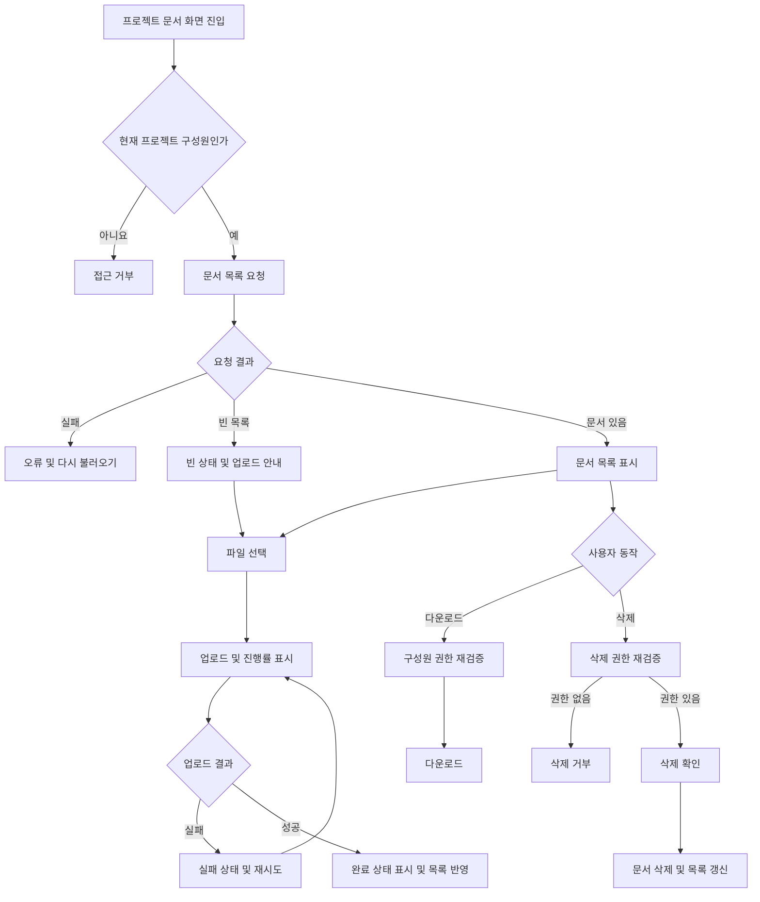

# 사내 프로젝트 문서 공유 PRD

- 문서 상태: Draft
- 목표 출시: 4주 내 내부 베타
- 1차 출시 범위: 업로드, 목록 조회, 다운로드, 삭제
- 제품 책임자: 미정
- 작성 기준: 제공된 브리프와 명시된 합리적 가정

## 1. 적용 범위

| 계약 항목 | 적용 여부 | 근거 |
|---|---|---|
| 사용자 화면 및 경로 | Required | 문서 목록과 업로드 상태를 사용자에게 제공해야 함 |
| 화면 상태 매트릭스 | Required | 빈 목록, 업로드 진행, 실패, 재시도, 완료 상태가 명시됨 |
| 사용자 흐름 | Required | 업로드·재시도·다운로드·삭제의 다단계 흐름이 존재함 |
| 역할 및 서버 권한 | Required | 프로젝트 관리자와 일반 구성원의 삭제 권한이 다름 |
| 데이터 경계 | Required | 문서는 같은 프로젝트 구성원에게만 공유됨 |
| 수치형 성능 요구사항 | Required, 미확정 | 목록 2초 노출은 목표이나 SLA와 측정 조건은 미정 |
| 검색 | N/A | 1차 출시에서 명시적으로 제외됨 |
| 외부 공유 | N/A | 1차 출시에서 명시적으로 제외됨 |
| 구성원 관리 UI | N/A(1차 출시) | 1차 출시 범위가 업로드·목록·다운로드·삭제로 한정됨. 기존 시스템 또는 운영 절차 사용을 가정함 |

## 2. 배경과 문제

프로젝트 문서가 개인 저장소나 분산된 커뮤니케이션 채널에 흩어져 있어, 프로젝트 구성원이 필요한 문서를 일관된 권한 아래 공유하고 다시 찾기 어렵다.

프로젝트 단위 문서 공간을 제공하여 구성원이 문서를 업로드하고, 같은 프로젝트에 속한 구성원이 이를 조회·다운로드할 수 있도록 한다. 삭제 권한은 프로젝트 관리자와 업로더에게 제한해 프로젝트 데이터의 무단 변경을 방지한다.

## 3. 목표

- 프로젝트 구성원이 프로젝트별 문서를 업로드하고 공유할 수 있다.
- 같은 프로젝트 구성원이 문서 목록을 조회하고 다운로드할 수 있다.
- 업로드 진행률과 성공·실패 상태를 명확히 확인할 수 있다.
- 실패한 업로드를 사용자가 다시 시도할 수 있다.
- 역할과 문서 소유권에 따라 삭제 권한을 안전하게 적용한다.
- 4주 내 사내 사용자를 대상으로 내부 베타를 제공한다.
- 목록 체감 성능을 측정하고, 정식 SLA 결정에 필요한 근거를 확보한다.

## 4. 비목표

1차 출시에는 다음을 포함하지 않는다.

- 문서명·본문·작성자 기반 검색
- 회사 외부 사용자 또는 공개 링크를 통한 공유
- 문서 미리보기와 온라인 편집
- 버전 관리 및 변경 이력 복원
- 폴더, 태그, 즐겨찾기
- 다중 프로젝트 일괄 조회
- 1차 출시용 구성원 초대·제거 UI
- 외부 알림 또는 메신저 연동

## 5. 사용자, 역할 및 권한

| 작업 | 프로젝트 관리자 | 일반 구성원 | 프로젝트 비구성원 |
|---|---:|---:|---:|
| 문서 목록 조회 | 허용 | 허용 | 거부 |
| 문서 업로드 | 허용 | 허용 | 거부 |
| 문서 다운로드 | 허용 | 허용 | 거부 |
| 본인이 업로드한 문서 삭제 | 허용 | 허용 | 거부 |
| 다른 구성원이 업로드한 문서 삭제 | 허용 | 거부 | 거부 |
| 구성원 초대·제거 | 권한 보유 | 거부 | 거부 |

권한 판정은 화면에서 버튼을 숨기는 것에 그치지 않고, 모든 목록·업로드·다운로드·삭제 요청에 대해 서버에서 검증해야 한다.

프로젝트 관리자는 일반 구성원의 문서 사용 권한을 모두 포함한다고 가정한다.

## 6. 기능 요구사항

| ID | 요구사항 | 우선순위 |
|---|---|---|
| FR-01 | 인증된 사용자는 자신이 구성원인 프로젝트의 문서 화면에 접근할 수 있다. | Must |
| FR-02 | 시스템은 사용자가 현재 구성원인 프로젝트의 문서만 목록에 반환한다. | Must |
| FR-03 | 문서 목록에는 최소한 문서명, 업로더, 업로드 완료 시각, 파일 크기, 다운로드 및 권한에 따른 삭제 동작을 표시한다. | Must |
| FR-04 | 문서가 없는 프로젝트에는 빈 목록 안내와 업로드 진입 동작을 제공한다. | Must |
| FR-05 | 프로젝트 구성원은 로컬 파일을 선택해 현재 프로젝트에 업로드할 수 있다. | Must |
| FR-06 | 업로드 중인 각 파일에 진행률을 표시한다. 진행률을 산출할 수 없는 구간에는 진행 중임을 식별할 수 있는 상태를 표시한다. | Must |
| FR-07 | 업로드 성공 시 완료 상태를 표시하고, 새 문서를 현재 프로젝트 목록에서 조회할 수 있게 한다. | Must |
| FR-08 | 업로드 실패 시 실패 상태와 재시도 동작을 제공한다. | Must |
| FR-09 | 재시도는 같은 파일을 다시 선택하도록 강제하지 않으며, 중복 문서가 생성되지 않도록 단일 업로드 시도를 식별한다. | Must |
| FR-10 | 프로젝트 구성원은 목록의 문서를 다운로드할 수 있다. | Must |
| FR-11 | 다운로드 시점에도 현재 프로젝트 구성원 여부를 서버에서 다시 확인한다. | Must |
| FR-12 | 일반 구성원은 자신이 업로드한 문서만 삭제할 수 있다. | Must |
| FR-13 | 프로젝트 관리자는 해당 프로젝트의 모든 문서를 삭제할 수 있다. | Must |
| FR-14 | 삭제 전 대상 문서명을 포함한 확인 절차를 제공한다. | Must |
| FR-15 | 삭제가 완료된 문서는 목록과 신규 다운로드에서 즉시 사용할 수 없어야 한다. | Must |
| FR-16 | 권한이 없는 삭제 요청은 대상의 존재 여부와 관계없이 안전하게 거부하고 문서를 변경하지 않는다. | Must |
| FR-17 | 업로드 또는 삭제가 실패하면 기존 문서 목록을 유지하고, 오류 안내와 복구 동작을 제공한다. | Must |
| FR-18 | 구성원 자격을 잃은 사용자는 이후 목록 조회·업로드·다운로드·삭제를 수행할 수 없다. | Must |
| FR-19 | 프로젝트 관리자만 구성원 초대·제거를 수행할 수 있다. 단, 해당 관리 UI의 1차 출시 포함 여부는 OD-01 결정에 따른다. | Must, 출시 미정 |
| FR-20 | 동일한 문서명을 가진 파일의 업로드 정책을 일관되게 적용하고 사용자에게 결과를 알린다. 구체 정책은 OD-05에서 결정한다. | Must, 정책 미정 |

## 7. 화면 및 경로

실제 URL 규칙은 기존 제품 라우팅 규칙에 맞춰 구현한다.

| 화면 | 목적 | 주요 요소 |
|---|---|---|
| 프로젝트 문서 화면 | 선택한 프로젝트의 문서 조회 및 관리 | 업로드 진입, 문서 목록, 빈 상태, 로딩·오류 상태 |
| 업로드 영역 | 파일 선택과 업로드 상태 확인 | 파일명, 진행률, 완료·실패 상태, 재시도 |
| 삭제 확인 대화상자 | 오삭제 방지 | 대상 문서명, 취소, 삭제 확인 |
| 구성원 관리 화면 | 구성원 초대·제거 | 1차 출시 제외를 가정하며 기존 기능 또는 운영 절차 사용 |

## 8. 화면 상태 매트릭스

| 영역 | Empty | Loading | Error | Success | Recovery |
|---|---|---|---|---|---|
| 문서 목록 | 문서 없음 안내 및 업로드 동작 | 목록 로딩 표시 | 목록을 불러오지 못했다는 안내 | 문서 목록 표시 | 목록 다시 불러오기 |
| 업로드 | 선택된 파일 없음 | 파일별 진행률 또는 진행 중 상태 | 파일별 실패 사유와 실패 상태 | 완료 상태 및 목록 반영 | 같은 파일 재시도 |
| 다운로드 | 해당 없음 | 다운로드 시작 상태 | 다운로드 실패 또는 접근 거부 안내 | 브라우저/클라이언트 다운로드 시작 | 다시 다운로드 |
| 삭제 | 해당 없음 | 중복 동작 방지 및 처리 중 표시 | 삭제 실패 안내, 기존 항목 유지 | 목록에서 제거 | 다시 삭제 |
| 접근 권한 | 해당 없음 | 권한 확인 중 | 비구성원 또는 권한 상실 안내 | 허용된 화면 표시 | 접근 가능한 프로젝트로 이동 |

업로드 완료 표시는 목록 반영 후에도 사용자가 결과를 인지할 수 있을 만큼 유지하되, 구체 표현과 유지 시간은 UI 설계에서 결정한다.

## 9. 주요 사용자 흐름

## 10. 권한 및 데이터 경계

- 모든 문서는 정확히 하나의 프로젝트에 소속되어야 한다.
- 모든 문서는 업로더의 사용자 식별자를 기록해야 한다.
- 목록과 개별 문서 접근은 현재 사용자의 프로젝트 구성원 자격을 기준으로 제한한다.
- 클라이언트가 전달한 프로젝트 ID, 업로더 ID 또는 역할 정보만 신뢰해서는 안 된다.
- 다운로드는 추측 가능한 저장소 주소를 직접 노출하는 방식으로 권한 검증을 우회할 수 없어야 한다.
- 삭제 권한은 삭제 요청 시점의 역할과 문서 업로더 정보를 기준으로 판정한다.
- 프로젝트 간 문서 식별자가 노출되더라도 다른 프로젝트의 문서를 조회·다운로드·삭제할 수 없어야 한다.
- 구성원 제거 후 이미 발급된 다운로드 접근 권한을 언제 무효화할지는 OD-07에서 결정한다.
- 문서 삭제 이후 저장소의 물리적 삭제 시점과 복구 가능 여부는 OD-06에서 결정한다.

## 11. 비기능 요구사항

| ID | 영역 | 요구사항 |
|---|---|---|
| NFR-01 | 성능 | 프로젝트 문서 화면 진입 후 사용 가능한 목록이 보이기까지 2초 이내를 제품 목표 후보로 삼는다. 이는 확정 SLA가 아니다. |
| NFR-02 | 측정 | 목록 성능의 시작점, 종료점, 표본 조건, 백분위수 및 제외 조건을 제품 책임자가 내부 베타 전 결정해야 한다. |
| NFR-03 | 보안 | 목록·업로드·다운로드·삭제 권한은 서버에서 검증해야 한다. |
| NFR-04 | 무결성 | 실패 또는 재시도로 인해 부분 문서나 의도하지 않은 중복 문서가 정상 목록에 노출되지 않아야 한다. |
| NFR-05 | 전송 | 문서 콘텐츠와 인증 정보는 전송 중 보호되어야 한다. 구체 방식은 회사의 기존 보안 기준을 따른다. |
| NFR-06 | 관측 가능성 | 내부 베타에서 목록 소요 시간과 업로드 성공·실패를 진단할 수 있어야 한다. 수집 데이터와 보존 정책은 기존 사내 기준을 따른다. |

2초 목표는 현재 약속된 SLA나 출시 차단 조건으로 사용하지 않는다. 제품 책임자가 측정 계약과 허용 기준을 확정한 뒤에만 검증 가능한 SLA로 승격한다.

## 12. 인수 조건

| ID | 연결 요구사항 | Given | When | Then | 검증 |
|---|---|---|---|---|---|
| AC-01 | FR-01, FR-02 | 사용자가 프로젝트 A에는 속하고 B에는 속하지 않음 | 각 프로젝트 문서 목록을 요청함 | A의 목록만 허용되고 B는 거부됨 | API 권한 통합 테스트 |
| AC-02 | FR-03, FR-04 | 문서가 없는 프로젝트 구성원임 | 문서 화면에 진입함 | 빈 상태와 업로드 동작이 표시됨 | UI 테스트 |
| AC-03 | FR-03 | 프로젝트에 문서가 존재함 | 목록 조회가 성공함 | 문서명, 업로더, 완료 시각, 크기 및 허용 동작이 표시됨 | UI·API 테스트 |
| AC-04 | FR-05, FR-06 | 업로드 가능한 파일을 선택함 | 업로드가 진행됨 | 파일별 진행 상태가 완료 전까지 표시됨 | UI 통합 테스트 |
| AC-05 | FR-07 | 업로드가 정상 완료됨 | 서버가 완료를 확정함 | 완료 상태가 표시되고 문서가 목록 및 다운로드에서 사용 가능함 | 종단 간 테스트 |
| AC-06 | FR-08, FR-09 | 업로드가 중간에 실패함 | 사용자가 재시도를 선택함 | 파일 재선택 없이 다시 시도되고 최종적으로 정상 문서가 최대 하나 생성됨 | 장애 주입 종단 간 테스트 |
| AC-07 | FR-10, FR-11 | 현재 프로젝트 구성원이며 문서가 존재함 | 다운로드를 요청함 | 권한 검증 후 올바른 파일 다운로드가 시작됨 | API·종단 간 테스트 |
| AC-08 | FR-11, FR-18 | 사용자가 구성원에서 제거됨 | 기존에 알던 문서 ID로 목록 또는 다운로드를 요청함 | 요청이 거부되고 문서 데이터가 노출되지 않음 | 권한 통합 테스트 |
| AC-09 | FR-12 | 일반 구성원이 본인 문서를 선택함 | 삭제를 확인함 | 문서가 삭제되고 목록 및 신규 다운로드에서 사용할 수 없음 | 종단 간 테스트 |
| AC-10 | FR-12, FR-16 | 일반 구성원이 다른 사람의 문서 삭제를 요청함 | 서버가 요청을 처리함 | 요청이 거부되고 문서는 유지됨 | API 권한 테스트 |
| AC-11 | FR-13 | 프로젝트 관리자가 프로젝트 내 다른 사람의 문서를 선택함 | 삭제를 확인함 | 문서가 삭제되고 더 이상 다운로드되지 않음 | 종단 간 테스트 |
| AC-12 | FR-14 | 삭제 가능한 문서의 삭제 동작을 선택함 | 확인 창이 열림 | 대상 문서명, 취소 및 삭제 확인 동작이 표시됨 | UI 테스트 |
| AC-13 | FR-17 | 목록·업로드 또는 삭제 요청이 실패함 | 오류가 반환됨 | 기존의 유효한 목록은 보존되고 오류 및 재시도 동작이 표시됨 | UI 통합 테스트 |
| AC-14 | FR-16 | 비구성원이 임의의 문서 ID로 삭제를 요청함 | 서버가 요청을 처리함 | 삭제가 거부되고 문서 존재 여부를 불필요하게 노출하지 않음 | 보안 테스트 |
| AC-15 | FR-19 | 일반 구성원과 프로젝트 관리자가 각각 구성원 변경을 요청함 | 서버가 권한을 판정함 | 관리자 요청만 허용됨 | API 권한 테스트 |
| AC-16 | FR-20 | 같은 이름의 문서가 이미 존재함 | 동일 이름의 파일을 업로드함 | OD-05에서 확정한 정책대로 처리되고 결과가 안내됨 | API·UI 테스트 |
| AC-17 | NFR-01, NFR-02 | 성능 측정 계약이 확정되고 대표 데이터가 준비됨 | 문서 목록을 측정함 | 확정된 기준에 따라 결과가 기록됨 | 성능 테스트 보고서 |

## 13. 합리적 가정

아래 가정은 되돌릴 수 있으며, 열린 결정이 확정되면 변경한다.

| ID | 가정 |
|---|---|
| AS-01 | 회사 계정 인증과 프로젝트·구성원·관리자 역할 데이터가 기존 시스템에 존재한다. |
| AS-02 | 프로젝트 관리자는 일반 구성원이 수행할 수 있는 업로드·목록·다운로드 권한도 가진다. |
| AS-03 | 1차 출시에서는 기존 프로젝트 구성원 정보를 사용하며, 신규 구성원 초대·제거 UI는 구현하지 않는다. |
| AS-04 | 문서는 업로드가 완전히 완료된 이후에만 정상 문서 목록과 다운로드에 노출한다. |
| AS-05 | 업로드 실패 항목은 정상 문서 목록에 포함하지 않고 업로드 상태 영역에서만 표시한다. |
| AS-06 | 삭제 완료 후 문서는 사용자 관점에서 즉시 목록과 신규 다운로드에서 사라진다. |
| AS-07 | 1차 출시는 사내 인증 사용자와 데스크톱 웹 사용을 우선 대상으로 한다. 모바일 웹은 핵심 흐름이 깨지지 않는 수준을 목표로 하되 별도 최적화는 범위에 포함하지 않는다. |
| AS-08 | 업로드 도중 프로젝트 구성원 자격을 잃으면 업로드 완료를 허용하지 않고 실패로 처리한다. |

## 14. 열린 결정

| ID | 결정 사항 | 책임자 | 결정 시점 | 영향 |
|---|---|---|---|---|
| OD-01 | 구성원 초대·제거 기능을 1차 출시에 포함할지, 기존 기능 또는 운영 절차로 대체할지 | 제품 책임자 | 개발 착수 전 | 범위, 일정, 화면 및 권한 테스트 |
| OD-02 | 허용 파일 형식과 차단 파일 형식 | 제품·보안 | 1주 차 | 검증, 오류 메시지, 보안 |
| OD-03 | 파일당 최대 크기, 프로젝트별 저장 용량, 동시 업로드 개수 | 제품·인프라 | 1주 차 | UI, API, 비용, 성능 |
| OD-04 | 악성 파일 검사 필요 여부와 검사 중 사용자 상태 | 보안 책임자 | 1주 차 | 업로드 완료 정의, 다운로드 안전성 |
| OD-05 | 동일 문서명 업로드 시 허용, 차단 또는 이름 자동 변경 정책 | 제품 책임자 | 1주 차 | 목록 표현, 중복 처리 |
| OD-06 | 삭제 방식, 보존 기간, 복구 가능 여부 및 물리 삭제 시점 | 제품·보안 | 베타 전 | 개인정보·복구·저장 비용 |
| OD-07 | 구성원 제거 시 기존에 발급된 다운로드 링크 또는 진행 중 다운로드의 무효화 정책 | 보안 책임자 | 베타 전 | 접근 통제 |
| OD-08 | 목록 정렬 기준과 페이지네이션 방식 | 제품 책임자 | 1주 차 | 목록 UX와 성능 |
| OD-09 | 2초 성능 목표의 시작·종료 시점, 대표 네트워크, 데이터 규모, 백분위수 및 실제 SLA | 제품 책임자 | 내부 베타 종료 전 | 성능 인수 기준 |
| OD-10 | 다운로드 시 원본 파일명 보존 및 브라우저 내 열기/강제 저장 정책 | 제품 책임자 | 2주 차 | 사용자 경험 |
| OD-11 | 감사 기록이 필요한 작업과 조회 권한 및 보존 기간 | 보안·제품 | 베타 전 | 운영 대응 및 규정 준수 |

OD-01은 4주 일정에 직접 영향을 주므로 가장 먼저 결정해야 한다. 결정이 없으면 AS-03에 따라 구성원 관리 UI를 1차 출시에서 제외한다.

## 15. 위험과 완화책

| 위험 | 영향 | 완화책 |
|---|---|---|
| 구성원 관리 범위가 뒤늦게 추가됨 | 4주 일정 지연 | OD-01을 착수 전에 결정하고 별도 마일스톤으로 분리 |
| 파일 제한이 늦게 확정됨 | API·UI 재작업 | 1주 차에 형식·크기·용량 정책 확정 |
| 권한을 UI에만 적용함 | 프로젝트 간 데이터 유출 | 모든 API에 서버 권한 테스트 적용 |
| 재시도로 중복 문서가 생성됨 | 목록 오염과 저장 비용 증가 | 업로드 시도 식별 및 중복 완료 방지 |
| 대용량 파일에서 진행률이 부정확함 | 사용자 혼란 | 측정 가능한 전송 진행률과 서버 처리 상태를 구분 |
| 삭제 중 다운로드 경쟁 상태 | 삭제 후 접근 가능성 | 삭제 판정 시점과 다운로드 권한을 원자적으로 검증하도록 계약 테스트 |
| 2초 목표의 측정 정의가 없음 | 성능 달성 여부 판단 불가 | 내부 베타에서 측정하고 제품 책임자가 SLA 계약 확정 |
| 악성 파일이 공유됨 | 사내 보안 사고 | OD-04를 보안 책임자가 결정하고 필요 시 검사 완료 전 다운로드 차단 |

## 16. 전달 계획

| 단계 | 기간 | 요구사항 ID | 검증 가능한 종료 조건 |
|---|---|---|---|
| 1. 계약·정책 확정 | 1주 차 | FR-01~FR-20, NFR-01~06 | OD-01~05, OD-08의 베타 필수 결정을 기록하고 API·UI 계약 및 테스트 계획 승인 |
| 2. 핵심 목록·권한 | 1~2주 차 | FR-01~04, FR-11~13, FR-16, FR-18 | 프로젝트 격리와 역할별 목록·삭제 권한 자동 테스트 통과 |
| 3. 업로드·다운로드 | 2~3주 차 | FR-05~10, FR-17, FR-20 | 진행률, 성공, 실패, 재시도, 다운로드 종단 간 테스트 통과 |
| 4. 삭제·상태 완성 | 3주 차 | FR-12~17 | 삭제 확인, 권한 거부, 실패 복구 및 경쟁 조건 테스트 통과 |
| 5. 내부 베타 준비 | 4주 차 | NFR-01~06 및 전체 Must | 핵심 인수 조건 통과, 알려진 차단 결함 0건, 성능 측정 결과와 미확정 SLA가 명시된 베타 릴리스 기록 작성 |
| 후속 범위 | 베타 이후 | FR-19 및 열린 결정에 따른 항목 | 구성원 관리 포함 여부와 정식 SLA를 제품 책임자가 승인 |

내부 베타 출시 여부는 확정되지 않은 2초 SLA 자체가 아니라, 핵심 권한·업로드·목록·다운로드·삭제 인수 조건과 베타 운영에 필요한 보안 정책 충족 여부로 판단한다.