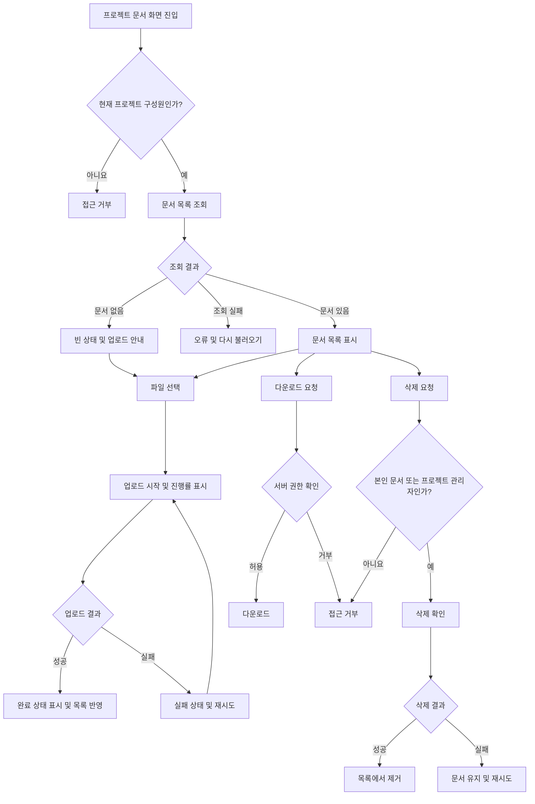

# 사내 프로젝트 문서 공유 PRD

- 문서 상태: Draft
- 목표 출시: 4주 내 내부 베타
- 대상 범위: 1차 출시
- 핵심 범위: 업로드, 목록 조회, 다운로드, 삭제
- 제외 범위: 검색, 외부 공유, 구성원 관리 UI

## 1. 적용 범위

| 계약 항목 | 적용 여부 | 근거 |
|---|---|---|
| 화면 및 경로 | Required | 직원이 문서 목록과 업로드·다운로드·삭제 기능을 직접 사용한다. |
| 사용자 상태 매트릭스 | Required | 로딩, 빈 목록, 업로드 진행, 실패·재시도, 완료 상태가 명시적으로 요구되었다. |
| 사용자 흐름 | Required | 파일 선택부터 업로드 완료 또는 재시도까지 다단계 생명주기가 존재한다. |
| 수치형 비기능 요구사항 | Required | 목록을 2초 안에 표시한다는 제품 목표가 있다. 단, 확정 SLA는 아니다. |

## 2. 배경과 문제

프로젝트 문서가 개인 저장소나 여러 커뮤니케이션 채널에 분산되면, 프로젝트 구성원이 최신 문서를 찾거나 안전하게 공유하기 어렵다.

직원에게 프로젝트 단위의 공통 문서 공간을 제공하되, 프로젝트 소속 여부와 역할에 따라 접근 및 삭제 권한을 제한해야 한다. 특히 일반 구성원의 다른 사람 문서 삭제와 프로젝트 외부 사용자의 접근은 UI뿐 아니라 서버에서도 차단해야 한다.

## 3. 목표

- 직원이 자신이 속한 프로젝트에 문서를 업로드할 수 있다.
- 같은 프로젝트 구성원이 문서 목록을 보고 다운로드할 수 있다.
- 업로드 진행률과 성공·실패 상태를 명확하게 제공한다.
- 실패한 업로드를 사용자가 다시 시도할 수 있다.
- 프로젝트 관리자와 일반 구성원의 삭제 권한을 구분한다.
- 내부 베타에서 핵심 문서 공유 흐름을 4주 안에 검증한다.
- 문서 목록의 체감 표시 시간을 2초 이내로 만드는 것을 제품 목표로 삼는다.

## 4. 비목표

1차 출시에는 다음 기능을 포함하지 않는다.

- 문서 검색, 필터 및 고급 정렬
- 회사 외부 사용자 또는 공개 링크를 통한 공유
- 문서 미리보기 및 웹 편집
- 문서 버전 관리
- 폴더 및 태그 관리
- 여러 프로젝트에 대한 일괄 업로드
- 휴지통 또는 사용자 직접 복구
- 프로젝트 구성원 초대·제거 UI

구성원 초대·제거 권한은 전체 제품 요구에는 포함되지만, “1차 출시는 업로드, 목록, 다운로드, 삭제만 포함”한다는 범위에 따라 후속 단계로 분리한다.

## 5. 사용자, 역할 및 권한

| 역할 | 정의 | 문서 목록 | 업로드 | 다운로드 | 삭제 | 구성원 관리 |
|---|---|---:|---:|---:|---:|---:|
| 프로젝트 관리자 | 해당 프로젝트의 관리 권한을 가진 직원 | 가능 | 가능 | 가능 | 프로젝트 내 모든 문서 | 초대·제거 가능, 단 1차 출시 UI 제외 |
| 일반 구성원 | 해당 프로젝트에 소속된 직원 | 가능 | 가능 | 가능 | 본인이 업로드한 문서만 | 불가 |
| 비구성원 | 해당 프로젝트에 소속되지 않은 직원 | 불가 | 불가 | 불가 | 불가 | 불가 |
| 인증되지 않은 사용자 | 사내 인증을 완료하지 않은 사용자 | 불가 | 불가 | 불가 | 불가 | 불가 |

프로젝트 관리자는 프로젝트 구성원의 상위 권한 역할이며, 문서 사용 기능에서는 프로젝트 구성원으로 간주한다.

## 6. 기능 요구사항

| ID | 요구사항 | 우선순위 |
|---|---|---|
| FR-001 | 시스템은 인증된 사용자에게 사용자가 속한 프로젝트의 문서 화면만 제공해야 한다. | Must |
| FR-002 | 프로젝트 구성원은 해당 프로젝트에 파일을 업로드할 수 있어야 한다. | Must |
| FR-003 | 업로드 중에는 파일별 진행 상태와 0~100% 진행률을 표시해야 한다. | Must |
| FR-004 | 파일 전송과 서버의 저장 처리가 성공한 경우에만 업로드를 완료 상태로 표시해야 한다. | Must |
| FR-005 | 업로드가 완료되면 해당 문서를 목록에 반영하고 완료 상태를 사용자에게 알려야 한다. | Must |
| FR-006 | 업로드가 실패하면 실패 상태와 재시도 동작을 제공해야 한다. | Must |
| FR-007 | 재시도는 실패한 파일을 다시 선택하게 하지 않고 새로운 업로드 시도로 처리해야 한다. | Should |
| FR-008 | 실패한 업로드 시도로 인해 다운로드 가능한 불완전 문서나 중복 문서가 생성되어서는 안 된다. | Must |
| FR-009 | 프로젝트 구성원은 해당 프로젝트의 문서 목록을 볼 수 있어야 한다. | Must |
| FR-010 | 문서 목록에는 최소한 파일명, 업로더, 업로드 완료 일시, 파일 크기와 사용 가능한 동작을 표시해야 한다. | Must |
| FR-011 | 문서가 없으면 빈 목록 상태와 업로드 유도 동작을 표시해야 한다. | Must |
| FR-012 | 목록 조회가 실패하면 오류 상태와 다시 불러오기 동작을 제공해야 한다. | Must |
| FR-013 | 기본 목록은 업로드 완료 일시의 최신순으로 표시해야 한다. | Should |
| FR-014 | 프로젝트 구성원은 목록에서 문서를 다운로드할 수 있어야 한다. | Must |
| FR-015 | 일반 구성원은 자신이 업로드한 문서만 삭제할 수 있어야 한다. | Must |
| FR-016 | 프로젝트 관리자는 해당 프로젝트의 모든 문서를 삭제할 수 있어야 한다. | Must |
| FR-017 | 삭제 전에 대상 파일명을 포함한 확인 절차를 제공해야 한다. | Must |
| FR-018 | 삭제 성공 후 문서를 목록에서 제거하고 성공 결과를 알려야 한다. | Must |
| FR-019 | 삭제 실패 시 문서를 목록에 유지하고 실패 안내 및 재시도 동작을 제공해야 한다. | Must |
| FR-020 | 삭제 권한이 없는 사용자에게 삭제 동작을 노출하지 않아야 하며, 직접 API 요청 역시 거부해야 한다. | Must |
| FR-021 | 목록·업로드·다운로드·삭제 요청마다 현재 프로젝트 소속과 역할을 서버에서 검증해야 한다. | Must |
| FR-022 | 문서 다운로드는 원본 저장 위치를 알더라도 프로젝트 접근 권한을 우회할 수 없도록 해야 한다. | Must |
| FR-023 | 구성원 초대·제거는 프로젝트 관리자만 수행할 수 있어야 한다. | 후속 출시 |
| FR-024 | 프로젝트에서 제거된 사용자는 이후의 목록·업로드·다운로드·삭제 요청부터 해당 프로젝트에 접근할 수 없어야 한다. | 후속 출시 |

## 7. 화면 및 경로

경로는 신규 서비스 기준의 논리적 제안이며, 기존 라우팅 규칙이 있다면 그 규칙을 따른다.

| 화면 | 제안 경로 | 포함 기능 |
|---|---|---|
| 프로젝트 문서 목록 | `/projects/:projectId/documents` | 목록, 빈 상태, 업로드, 다운로드, 삭제 |
| 프로젝트 구성원 관리 | 범위 외 | 후속 출시에서 초대·제거 제공 |

문서 상세 화면은 1차 출시에 만들지 않는다. 다운로드 및 삭제는 목록에서 수행한다.

## 8. 사용자 상태 매트릭스

| 영역 | 초기/빈 상태 | 로딩/진행 상태 | 오류 상태 | 성공 상태 | 복구 |
|---|---|---|---|---|---|
| 문서 목록 | “아직 등록된 문서가 없습니다” 및 업로드 동작 | 목록 스켈레톤 또는 로딩 표시 | 목록을 불러오지 못했다는 안내 | 문서 행과 허용된 동작 표시 | 다시 불러오기 |
| 업로드 | 업로드할 파일 선택 동작 | 파일별 진행률과 업로드 중 표시 | 실패 원인 안내가 가능한 경우 표시 | 업로드 완료 표시 후 목록 반영 | 동일 파일 재시도 |
| 다운로드 | 해당 없음 | 다운로드 시작 표시가 필요한 경우 제공 | 다운로드 실패 안내 | 브라우저 또는 클라이언트 다운로드 시작 | 다시 다운로드 |
| 삭제 | 삭제 확인 모달 | 삭제 동작 비활성화 및 처리 중 표시 | 문서를 목록에 유지하고 실패 안내 | 문서를 목록에서 제거하고 완료 안내 | 삭제 재시도 |
| 접근 권한 | 해당 없음 | 권한 확인 중 표시 | 비구성원 또는 권한 만료 안내 | 권한에 맞는 화면 표시 | 접근 가능한 프로젝트로 이동 |

목록 데이터가 없어서 발생한 빈 상태와 목록 조회 실패 상태는 시각적으로 명확히 구분해야 한다.

## 9. 주요 사용자 흐름

## 10. 권한 및 데이터 경계

- 모든 문서는 정확히 하나의 프로젝트에 귀속되어야 한다.
- 모든 문서는 업로드한 사용자의 식별자를 가져야 한다.
- 문서 조회, 다운로드 및 삭제 권한은 요청 시점의 프로젝트 구성원 정보를 기준으로 판단한다.
- 클라이언트가 전달한 `projectId`, `documentId`, 업로더 정보 또는 역할을 신뢰해서는 안 된다.
- 서버는 문서의 실제 프로젝트와 요청 경로의 프로젝트가 일치하는지 확인해야 한다.
- 비구성원에게는 문서 메타데이터와 파일 내용 모두 노출하지 않는다.
- 일반 구성원의 삭제 요청은 서버에 기록된 업로더 식별자와 요청 사용자가 일치할 때만 허용한다.
- 프로젝트 관리자의 전체 삭제 권한도 자신이 관리자인 해당 프로젝트 안으로 제한한다.
- 다운로드 주소나 토큰을 사용하는 경우 다른 사용자나 프로젝트에서 권한 확인 없이 재사용할 수 없어야 한다.
- 삭제된 문서는 이후 목록 및 신규 다운로드 요청에서 접근할 수 없어야 한다.
- 동시 삭제 요청은 한 번만 유효하게 처리되어야 하며, 후속 요청은 이미 삭제되었음을 안전하게 반환해야 한다.

## 11. 비기능 요구사항

| ID | 영역 | 요구사항 |
|---|---|---|
| NFR-001 | 목록 성능 | 사용자가 문서 화면에 진입한 시점부터 첫 번째 사용 가능한 목록 또는 빈 상태가 보일 때까지 2초 이내를 제품 목표로 한다. |
| NFR-002 | SLA 구분 | NFR-001은 내부 베타의 목표이며 계약상 또는 운영상 SLA로 간주하지 않는다. 측정 조건과 확정 SLA는 제품 책임자가 별도로 결정한다. |
| NFR-003 | 업로드 무결성 | 서버가 완료를 확인하지 않은 업로드는 정상 문서 목록과 다운로드 대상에 포함하지 않는다. |
| NFR-004 | 오류 복구 | 일시적인 목록·업로드·삭제 실패는 전체 페이지를 새로 열지 않고 재시도할 수 있어야 한다. |
| NFR-005 | 보안 | 권한 검증은 UI 표시 여부와 무관하게 서버에서 수행해야 한다. |
| NFR-006 | 전송 보안 | 문서 메타데이터와 파일은 조직에서 승인한 암호화된 전송 경로를 통해 전송해야 한다. |
| NFR-007 | 접근성 | 진행률, 성공 및 실패 상태는 색상만으로 구분하지 않고 텍스트 또는 상태 표시를 함께 제공해야 한다. |

2초 목표의 분모, 백분위수, 테스트 데이터 규모 및 네트워크 조건은 확정되지 않았으므로 임의의 SLA 수치로 확대하지 않는다.

## 12. 수용 기준

| ID | 연결 요구사항 | Given | When | Then | 검증 |
|---|---|---|---|---|---|
| AC-001 | FR-001, FR-009, FR-021 | 사용자가 프로젝트 A의 구성원이다 | 프로젝트 A 문서 화면을 연다 | 프로젝트 A의 문서만 표시된다 | 통합 테스트 |
| AC-002 | FR-001, FR-021 | 사용자가 프로젝트 A의 구성원이 아니다 | URL 또는 API로 문서 목록을 요청한다 | 요청이 거부되고 문서 메타데이터가 반환되지 않는다 | API 권한 테스트 |
| AC-003 | FR-002~FR-005 | 구성원이 유효한 파일을 선택했다 | 업로드를 시작한다 | 진행률이 표시되고 서버 저장 성공 후 완료 상태와 목록 항목이 표시된다 | E2E 테스트 |
| AC-004 | FR-004, FR-008, NFR-003 | 파일 전송 또는 저장 처리가 완료되지 않았다 | 목록을 조회하거나 다운로드를 시도한다 | 해당 업로드는 정상 문서로 표시되거나 다운로드되지 않는다 | 통합 테스트 |
| AC-005 | FR-006, FR-007 | 업로드가 실패했다 | 사용자가 재시도를 선택한다 | 파일 재선택 없이 새 업로드 시도가 시작된다 | E2E 테스트 |
| AC-006 | FR-008 | 최초 업로드가 실패한 뒤 재시도가 성공했다 | 목록을 조회한다 | 다운로드 가능한 문서는 하나만 존재한다 | 통합 테스트 |
| AC-007 | FR-010, FR-013 | 프로젝트에 여러 문서가 있다 | 목록 조회가 성공한다 | 파일명, 업로더, 완료 일시, 크기와 허용 동작이 최신순으로 표시된다 | UI/E2E 테스트 |
| AC-008 | FR-011 | 프로젝트에 문서가 없다 | 목록 조회가 성공한다 | 빈 상태와 업로드 동작이 표시된다 | UI 테스트 |
| AC-009 | FR-012 | 목록 조회가 실패했다 | 사용자가 다시 불러오기를 선택한다 | 새 목록 요청이 발생하고 성공 시 목록 또는 빈 상태로 전환된다 | E2E 테스트 |
| AC-010 | FR-014, FR-022 | 프로젝트 구성원이 문서 다운로드 권한을 가진다 | 다운로드를 선택한다 | 권한 확인 후 올바른 파일 다운로드가 시작된다 | E2E/API 테스트 |
| AC-011 | FR-014, FR-022 | 비구성원이 문서 식별자나 다운로드 주소를 알고 있다 | 다운로드를 요청한다 | 파일 내용이 반환되지 않는다 | 보안 통합 테스트 |
| AC-012 | FR-015, FR-017, FR-018 | 일반 구성원이 자신이 업로드한 문서를 선택했다 | 삭제를 확인한다 | 문서가 삭제되고 목록에서 제거된다 | E2E 테스트 |
| AC-013 | FR-015, FR-020 | 일반 구성원이 다른 구성원의 문서를 알고 있다 | UI 또는 API로 삭제를 시도한다 | UI에는 삭제 동작이 없고 API 요청은 거부된다 | UI 및 API 권한 테스트 |
| AC-014 | FR-016~FR-018 | 프로젝트 관리자가 프로젝트 내 다른 사용자의 문서를 선택했다 | 삭제를 확인한다 | 문서가 삭제되고 목록에서 제거된다 | E2E 테스트 |
| AC-015 | FR-016, FR-021 | 프로젝트 A 관리자가 프로젝트 B 문서를 알고 있다 | 삭제를 요청한다 | 삭제가 거부되고 프로젝트 B 문서는 유지된다 | API 권한 테스트 |
| AC-016 | FR-019 | 삭제 요청이 실패했다 | 오류 상태가 표시된다 | 문서는 목록에 유지되고 사용자는 삭제를 재시도할 수 있다 | E2E 테스트 |
| AC-017 | NFR-001, NFR-002 | 합의된 베타 측정 환경과 테스트 데이터가 준비되어 있다 | 문서 화면 표시 시간을 측정한다 | 첫 사용 가능 목록 또는 빈 상태까지의 시간이 기록되고 2초 목표 대비 결과가 보고된다 | 성능 테스트 |
| AC-018 | NFR-007 | 업로드가 진행·성공·실패 중 하나의 상태다 | 사용자가 상태를 확인한다 | 색상 외에도 텍스트 또는 상태 표시로 현재 상태를 식별할 수 있다 | UI 및 접근성 점검 |
| AC-019 | FR-023, FR-024 | 구성원 관리 기능이 후속 출시 대상으로 확정되었다 | 1차 베타를 검수한다 | 구성원 관리 UI가 없어도 1차 출시 차단 결함으로 처리하지 않는다 | 범위 검토 |

## 13. 합리적 가정

아래 가정은 1차 출시를 진행하기 위한 것으로, 비교적 쉽게 변경할 수 있다.

- 기존 사내 인증 체계와 안정적인 직원 식별자가 존재한다.
- 프로젝트, 프로젝트 구성원 및 관리자 역할 정보는 기존 시스템에서 제공되거나 베타 전에 별도로 설정된다.
- 1차 출시에서는 구성원 초대·제거 UI를 구현하지 않고 기존 구성원 정보를 사용한다.
- 한 문서는 하나의 프로젝트에만 속한다.
- 업로드한 문서는 직접 덮어쓰지 않으며, 같은 이름의 파일은 별개의 문서로 취급한다.
- 목록 기본 정렬은 업로드 완료 일시의 최신순이다.
- 업로드 완료 일시는 서버가 정상 저장을 확인한 시각이다.
- 문서 삭제는 1차 출시 사용자 관점에서 즉시 삭제로 보이며, 보관·백업 정책은 인프라 정책을 따른다.
- 업로드 진행률은 클라이언트가 서버로 전송한 바이트를 기준으로 표시하고, 서버 저장 확인 전까지는 완료로 표시하지 않는다.
- 여러 파일을 선택할 수 있는지는 열려 있지만 파일별 상태와 재시도 단위는 독립적으로 유지한다.

## 14. 열린 결정

| ID | 결정 필요 항목 | 책임자 제안 | 결정 시점 | 결정하지 않을 경우 영향 |
|---|---|---|---|---|
| OD-001 | 2초 목표의 측정 시작·종료점, 백분위수, 네트워크 조건, 문서 수 | 제품 책임자 + 개발 리드 | 1주 차 | 성능 합격 여부를 객관적으로 판정할 수 없음 |
| OD-002 | 실제 운영 SLA 및 가용성 목표 | 제품 책임자 | 베타 결과 검토 후 | 베타 출시는 가능하나 운영 약속을 정할 수 없음 |
| OD-003 | 파일당 최대 크기, 프로젝트별 저장 용량 및 사용자별 제한 | 제품 책임자 + 인프라 담당 | 개발 착수 전 | 업로드 검증과 비용·오류 처리를 완성할 수 없음 |
| OD-004 | 허용 또는 차단할 파일 형식 및 악성 파일 검사 정책 | 보안 담당 + 제품 책임자 | 개발 착수 전 | 보안 검수와 업로드 오류 정의가 불완전해짐 |
| OD-005 | 동명 파일의 최종 표시 규칙 | 제품 책임자 | 1주 차 | 본 PRD의 “별도 문서” 가정을 적용 |
| OD-006 | 한 번에 선택할 수 있는 파일 수와 동시 업로드 수 | 제품 책임자 + 개발 리드 | 1주 차 | 단일 파일 업로드만 보장하는 범위로 축소될 수 있음 |
| OD-007 | 목록 페이지 크기와 페이지네이션 방식 | 개발 리드 + 제품 책임자 | 1주 차 | 대량 문서에서 2초 목표 검증이 어려움 |
| OD-008 | 삭제된 파일의 보존 기간, 복구 및 백업 제외 시점 | 보안/인프라 담당 | 내부 베타 전 | 사용자 화면에서는 삭제돼도 물리 데이터 처리 기준이 불명확 |
| OD-009 | 구성원 초대·제거가 정말 1차 출시 제외인지 여부 | 제품 책임자 | 즉시 | 포함할 경우 4주 일정과 화면·API 범위를 다시 산정해야 함 |
| OD-010 | 구성원 제거 시 진행 중 업로드와 이미 시작한 다운로드의 처리 | 제품 책임자 + 보안 담당 | 구성원 관리 개발 전 | 후속 기능의 권한 경계가 불명확 |
| OD-011 | 파일명, 업로더 등 삭제 감사 기록의 필요성과 보존 기간 | 보안 담당 | 내부 베타 전 | 사고 조사 및 관리자 삭제 추적 수준이 결정되지 않음 |

## 15. 위험과 완화책

| 위험 | 영향 | 완화책 |
|---|---|---|
| 구성원 관리가 1차 범위로 다시 포함됨 | 4주 일정 초과 가능성 | OD-009를 즉시 확정하고 포함 시 별도 일정과 수용 기준 산정 |
| 파일 크기·형식 정책 결정 지연 | 업로드 API와 오류 UX 재작업 | OD-003, OD-004를 개발 착수 전에 확정 |
| 권한을 UI에서만 제한 | 문서 유출 또는 무단 삭제 | 모든 요청에 서버 권한 검증을 적용하고 역할별 API 테스트 수행 |
| 업로드 실패 후 불완전 파일 노출 | 손상 파일 다운로드 및 중복 생성 | 완료 확인 전 비공개 상태로 유지하고 실패 시도를 정상 목록에서 제외 |
| 문서 수 증가로 목록 목표 미달 | 체감 성능 저하 | 페이지네이션 결정, 성능 계측, 대표 데이터셋 기반 테스트 |
| 관리자 오삭제 | 프로젝트 자료 손실 | 파일명이 포함된 확인 절차와 삭제 정책 결정, 필요 시 감사 기록 적용 |
| 2초 목표를 SLA로 오해 | 잘못된 출시 판정 또는 운영 약속 | PRD와 측정 보고서에서 제품 목표와 SLA를 명시적으로 분리 |

## 16. 출시 계획

| 단계 | 기간 | 포함 요구사항 | 검증 가능한 종료 조건 |
|---|---|---|---|
| 1. 범위·정책 확정 | 1주 차 초반 | OD-001, OD-003, OD-004, OD-006, OD-007, OD-009 | 차단성 열린 결정이 책임자 승인 상태이며 테스트 조건이 기록됨 |
| 2. 권한·목록 기반 구축 | 1주 차 | FR-001, FR-009~FR-013, FR-020~FR-022 | 구성원·비구성원 권한 테스트와 목록 상태 테스트 통과 |
| 3. 업로드 구현 | 2주 차 | FR-002~FR-008 | 진행률, 완료, 실패, 재시도 및 불완전 문서 차단 테스트 통과 |
| 4. 다운로드·삭제 구현 | 3주 차 | FR-014~FR-019 | 역할별 다운로드·삭제 및 실패 복구 테스트 통과 |
| 5. 통합 검증·내부 베타 | 4주 차 | NFR-001~NFR-007, AC-001~AC-019 | 핵심 수용 기준 통과, 2초 목표 측정 결과 보고, 알려진 이슈와 베타 운영 기준 승인 |
| 후속 출시 | 별도 산정 | FR-023, FR-024 | 관리자만 초대·제거 가능하고 제거된 사용자의 후속 접근이 서버에서 차단됨 |

## 17. 내부 베타 출시 기준

다음 조건을 모두 충족하면 1차 내부 베타를 출시할 수 있다.

- 업로드, 목록, 다운로드 및 삭제의 Must 요구사항이 구현되어 있다.
- 프로젝트 경계를 넘는 목록·다운로드·삭제 요청이 서버에서 차단된다.
- 일반 구성원과 프로젝트 관리자의 삭제 권한 테스트가 통과한다.
- 빈 목록, 목록 오류, 업로드 진행, 업로드 실패·재시도, 업로드 완료 상태가 검증된다.
- 불완전 업로드가 정상 문서로 노출되지 않는다.
- 합의된 조건에서 목록 표시 시간을 측정하고 결과를 기록한다.
- 2초 목표를 달성하지 못한 경우에도 제품 책임자가 실제 결과와 개선 계획을 검토해 베타 출시 여부를 명시적으로 결정한다.
- 검색, 외부 공유 및 구성원 관리가 1차 출시 범위에 포함되지 않았음을 이해관계자가 확인한다.

요청에 따라 PRD는 이 응답에만 작성했으며 파일 생성, 저장소 탐색 및 별도 검증 스크립트 실행은 하지 않았다.