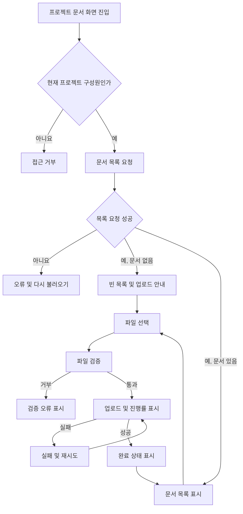

# 사내 프로젝트 문서 공유 PRD

## 1. 문서 정보

- 목표 출시: 4주 내 내부 베타
- 대상: 사내 직원
- 범위: 프로젝트별 문서 업로드, 목록 조회, 다운로드, 삭제
- 상태: Draft
- 제품 책임자: 미정

## 2. 적용성

| 계약 항목 | 적용 여부 | 근거 |
|---|---|---|
| 화면 및 경로 | Required | 직원이 문서 목록과 업로드 상태를 직접 확인하는 기능 |
| 사용자 상태 매트릭스 | Required | 빈 목록, 로딩, 실패, 재시도, 완료 상태가 명시됨 |
| 사용자 흐름 | Required | 업로드 및 삭제가 여러 상태를 거치는 작업 |
| 권한 및 데이터 경계 | Required | 프로젝트 구성원·관리자·문서 소유자별 권한이 다름 |
| 정량적 성능 요구사항 | Required | 목록 2초 표시가 목표이나 SLA는 미확정 |
| 검색 | N/A | 1차 출시 제외 |
| 외부 공유 | N/A | 1차 출시 제외 |
| 구성원 관리 UI/API | N/A | 1차 출시 범위가 업로드·목록·다운로드·삭제로 한정됨. 기존 프로젝트 구성원 정보를 사용한다고 가정 |

---

## 3. 배경 및 문제

프로젝트 문서가 개인 저장소, 메신저, 이메일 등에 분산되면 프로젝트 구성원이 최신 문서에 접근하기 어렵고 권한 관리도 일관되지 않다.

직원이 프로젝트 단위로 문서를 올리고 해당 프로젝트 구성원만 안전하게 조회·다운로드할 수 있는 중앙 공유 공간이 필요하다. 삭제 권한은 프로젝트 관리자와 문서 업로더에게 제한되어야 한다.

## 4. 목표

- 직원이 자신이 속한 프로젝트에 문서를 업로드할 수 있다.
- 같은 프로젝트 구성원이 문서 목록을 확인하고 다운로드할 수 있다.
- 프로젝트 관리자는 프로젝트 내 모든 문서를 삭제할 수 있다.
- 일반 구성원은 자신이 업로드한 문서만 삭제할 수 있다.
- 사용자가 업로드 진행, 실패, 재시도 및 완료 여부를 명확히 알 수 있다.
- 4주 내 실제 직원이 사용해 볼 수 있는 내부 베타를 제공한다.

## 5. 비목표

1차 출시에는 다음 기능을 포함하지 않는다.

- 문서 검색, 필터, 정렬 설정
- 사외 사용자 또는 공개 링크를 통한 외부 공유
- 문서 미리보기 및 온라인 편집
- 폴더 및 문서 분류 체계
- 버전 관리와 이전 버전 복원
- 여러 문서 일괄 다운로드 또는 일괄 삭제
- 구성원 초대·제거 화면 및 API
- 삭제 문서의 사용자 직접 복구
- 업로드 중단 후 이어 올리기

---

## 6. 사용자, 역할 및 권한

| 역할 | 정의 | 목록 조회·다운로드 | 업로드 | 문서 삭제 | 구성원 초대·제거 |
|---|---|---:|---:|---:|---:|
| 비구성원 | 해당 프로젝트에 속하지 않은 직원 | 불가 | 불가 | 불가 | 불가 |
| 일반 구성원 | 프로젝트에 참여 중인 직원 | 가능 | 가능 | 본인이 업로드한 문서만 가능 | 불가 |
| 프로젝트 관리자 | 프로젝트 관리 권한을 가진 구성원 | 가능 | 가능 | 프로젝트 내 모든 문서 가능 | 가능하나 1차 출시 UI/API 범위에서는 제외 |

모든 권한은 화면 노출 여부와 관계없이 서버에서 검증해야 한다.

---

## 7. 핵심 데이터 정의

### 프로젝트

- 프로젝트 ID
- 프로젝트명
- 활성 상태
- 구성원과 각 구성원의 역할

### 문서

- 문서 ID
- 소속 프로젝트 ID
- 원본 파일명
- 파일 크기
- 파일 형식 또는 MIME 유형
- 업로더 직원 ID
- 업로드 완료 시각
- 저장 상태
- 삭제 상태 또는 삭제 시각

문서 목록에는 최소한 다음 정보를 표시한다.

- 파일명
- 파일 크기
- 업로더 이름
- 업로드 완료 시각
- 현재 사용자가 삭제할 수 있는지 여부

---

## 8. 기능 요구사항

| ID | 요구사항 | 우선순위 |
|---|---|---|
| FR-001 | 사용자는 자신이 현재 구성원인 프로젝트의 문서 목록만 조회할 수 있다. | Must |
| FR-002 | 문서 목록은 업로드가 완료된 문서의 파일명, 크기, 업로더 및 완료 시각을 표시한다. | Must |
| FR-003 | 사용자는 자신이 현재 구성원인 프로젝트에 파일을 업로드할 수 있다. | Must |
| FR-004 | 업로드가 시작되면 파일별 진행률을 0~100% 범위로 표시한다. | Must |
| FR-005 | 업로드가 성공하면 해당 파일을 완료 상태로 표시하고 문서 목록에 반영한다. | Must |
| FR-006 | 업로드가 실패하면 실패 상태와 재시도 동작을 제공한다. | Must |
| FR-007 | 재시도하면 동일한 로컬 파일의 업로드를 처음부터 다시 수행한다. | Must |
| FR-008 | 여러 파일을 업로드하는 경우 각 파일의 진행률과 성공·실패 상태를 독립적으로 표시한다. | Should |
| FR-009 | 문서가 없는 프로젝트에는 빈 목록 안내와 업로드 진입 동작을 표시한다. | Must |
| FR-010 | 프로젝트 구성원은 목록의 문서를 다운로드할 수 있다. | Must |
| FR-011 | 프로젝트 관리자는 해당 프로젝트의 모든 문서를 삭제할 수 있다. | Must |
| FR-012 | 일반 구성원은 자신이 업로드한 문서만 삭제할 수 있다. | Must |
| FR-013 | 삭제 권한이 없는 사용자에게는 삭제 동작을 제공하지 않으며, 직접 요청도 서버에서 거부한다. | Must |
| FR-014 | 삭제 전 대상 파일명을 포함한 확인 절차를 제공한다. | Must |
| FR-015 | 삭제가 성공하면 문서를 목록에서 제거하고 이후 조회 및 다운로드를 차단한다. | Must |
| FR-016 | 삭제가 실패하면 기존 목록을 유지하고 사용자가 삭제를 다시 시도할 수 있게 한다. | Must |
| FR-017 | 프로젝트 접근 권한이 제거된 사용자는 이후 목록 조회, 업로드, 다운로드 및 삭제를 할 수 없다. | Must |
| FR-018 | 존재하지 않거나 접근할 수 없는 문서 요청에서 다른 프로젝트의 문서 정보나 저장 위치를 노출하지 않는다. | Must |
| FR-019 | 지원되지 않는 파일 또는 허용 크기를 초과한 파일은 업로드 전에 가능한 범위에서 검증하고, 서버에서도 동일하게 거부한다. | Must |
| FR-020 | 같은 이름의 파일이 이미 존재해도 별도 문서로 업로드하며 기존 문서를 덮어쓰지 않는다. | Should |
| FR-021 | 업로드 도중 페이지를 이탈하려는 경우 진행 중인 업로드가 취소될 수 있음을 알린다. | Should |

---

## 9. 화면 및 경로

구체적인 URL 구조는 기존 제품 규칙을 따르며, 논리적으로 다음 화면이 필요하다.

### 프로젝트 문서 목록 화면

주요 구성:

- 프로젝트명
- 문서 업로드 버튼 또는 드롭 영역
- 진행 중·실패·완료 업로드 항목
- 문서 목록
- 문서별 다운로드 동작
- 권한이 있는 문서의 삭제 동작
- 빈 목록, 로딩 및 오류 상태

별도 검색 화면, 외부 공유 화면 및 휴지통 화면은 제공하지 않는다.

---

## 10. 사용자 표시 상태

| 표면 | 빈 상태 | 로딩·진행 상태 | 오류 상태 | 성공 상태 | 복구 |
|---|---|---|---|---|---|
| 문서 목록 | “등록된 문서가 없습니다” 및 업로드 동작 표시 | 목록 로딩 표시 | 목록을 불러오지 못했다는 안내 | 문서 목록 표시 | 목록 다시 불러오기 |
| 업로드 | 업로드 대기 항목 없음 | 파일별 진행률 표시 | 파일별 실패 원인 또는 일반 오류 표시 | 파일별 업로드 완료 표시 | 실패한 파일 다시 시도 |
| 다운로드 | 해당 없음 | 다운로드 시작 상태 표시 또는 브라우저 기본 동작 | 다운로드 실패 안내 | 파일 다운로드 시작 | 다시 다운로드 |
| 삭제 | 해당 없음 | 삭제 중 중복 동작 방지 | 문서를 목록에 유지하고 실패 안내 | 목록에서 문서 제거 | 삭제 다시 시도 |
| 접근 권한 | 해당 없음 | 권한 확인 중 | 접근 불가 안내 | 허용된 화면 표시 | 프로젝트 목록 등 안전한 화면으로 이동 |

업로드 완료 상태는 사용자가 성공을 인지할 수 있을 만큼 표시한 후, 문서 목록의 일반 항목으로 전환할 수 있다.

---

## 11. 핵심 사용자 흐름

### 삭제 흐름

1. 사용자가 삭제 동작을 선택한다.
2. 시스템이 파일명을 포함한 확인 창을 표시한다.
3. 사용자가 삭제를 확인한다.
4. 서버가 현재 프로젝트 구성원 여부와 삭제 권한을 다시 검증한다.
5. 성공하면 문서를 목록에서 제거하고 다운로드를 차단한다.
6. 실패하면 문서를 목록에 유지하고 재시도 가능한 오류를 표시한다.

---

## 12. 권한 및 데이터 경계

- 프로젝트 ID는 모든 목록, 업로드, 다운로드 및 삭제 요청의 권한 경계다.
- 사용자는 현재 구성원인 프로젝트의 데이터에만 접근할 수 있다.
- 클라이언트가 전달한 프로젝트 ID, 문서 ID 또는 업로더 ID는 신뢰하지 않는다.
- 다운로드 시점에도 구성원 여부를 재검증한다. 과거에 발급된 주소만으로 접근할 수 없어야 한다.
- 삭제 시점에 구성원 여부, 프로젝트 관리자 여부 및 실제 업로더 ID를 서버 데이터로 검증한다.
- 문서 소유자는 업로드를 완료한 직원이다. 요청자가 임의로 업로더를 지정할 수 없다.
- 구성원에서 제거되면 기존에 업로드한 문서가 있더라도 프로젝트 접근 권한을 잃는다.
- 제거된 구성원이 올린 문서는 자동 삭제하지 않는다. 프로젝트 관리자가 필요할 때 삭제할 수 있다.
- 업로드가 실패하거나 중단된 파일은 완료 문서 목록과 다운로드 대상에 노출하지 않는다.
- 다른 프로젝트의 문서 ID를 추측해 요청해도 문서명, 업로더, 저장 위치 등 메타데이터를 반환하지 않는다.
- 실제 파일 전송 주소를 사용하는 경우 짧은 유효기간과 권한 검증을 적용해야 한다. 구체적인 전달 방식은 기술 설계에서 결정한다.

---

## 13. 비기능 요구사항

### 성능

| ID | 요구사항 |
|---|---|
| NFR-001 | 문서 목록은 사용자가 화면에 진입한 후 2초 안에 사용 가능한 목록 또는 빈 상태를 표시하는 것을 제품 목표로 한다. |
| NFR-002 | 2초 목표의 측정 구간, 백분위수, 네트워크 조건 및 정식 SLA 여부는 확정 전까지 출시 보장으로 표현하지 않는다. |
| NFR-003 | 내부 베타에서 목록 표시 시간을 측정할 수 있어야 하며, 제품 책임자가 정식 출시 전에 SLA 채택 여부를 결정한다. |

### 안정성 및 사용성

- 동일한 삭제 요청이 중복 전송되어도 권한이 확대되거나 삭제된 문서가 다시 나타나지 않아야 한다.
- 일부 파일 업로드 실패가 다른 파일의 성공 상태를 실패로 변경해서는 안 된다.
- 새로고침 후에는 서버에서 완료된 문서만 목록에 표시한다.
- 진행률을 알 수 없는 전송 단계에서는 무한 로딩 대신 업로드 진행 중임을 명확하게 표시한다.
- 사용자에게 내부 저장소 경로, 스택 트레이스 또는 민감한 시스템 오류를 노출하지 않는다.
- 키보드만으로 업로드, 다운로드, 삭제 및 재시도 동작에 접근할 수 있어야 한다.

---

## 14. 수용 기준

| ID | 연결 요구사항 | Given | When | Then | 검증 |
|---|---|---|---|---|---|
| AC-001 | FR-001, FR-018 | 사용자가 프로젝트 A의 구성원이고 B의 비구성원일 때 | A와 B의 문서 목록을 각각 요청하면 | A의 목록만 반환되고 B의 문서 정보는 노출되지 않는다 | API 통합 테스트 |
| AC-002 | FR-002, FR-009 | 구성원에게 문서가 있는 또는 없는 프로젝트가 주어졌을 때 | 문서 화면에 진입하면 | 문서 메타데이터 목록 또는 빈 상태가 표시된다 | UI 테스트 |
| AC-003 | FR-003~FR-005 | 유효한 파일을 선택한 구성원이 있을 때 | 업로드를 시작하면 | 진행률이 표시되고 성공 후 완료 상태와 목록 항목이 나타난다 | UI 및 API 통합 테스트 |
| AC-004 | FR-006, FR-007 | 업로드 요청이 실패했을 때 | 사용자가 재시도를 선택하면 | 동일 파일 업로드가 처음부터 다시 시작되고 새 진행률이 표시된다 | 장애 주입 UI 테스트 |
| AC-005 | FR-008 | 여러 파일을 동시에 선택했을 때 | 일부는 성공하고 일부는 실패하면 | 각 파일에 독립적인 성공 또는 실패 상태가 표시된다 | UI 테스트 |
| AC-006 | FR-010, FR-017 | 현재 프로젝트 구성원 또는 제거된 사용자가 있을 때 | 문서를 다운로드하면 | 현재 구성원만 파일을 받을 수 있다 | 권한 통합 테스트 |
| AC-007 | FR-011, FR-014, FR-015 | 프로젝트 관리자가 다른 구성원의 문서를 보고 있을 때 | 확인 후 삭제하면 | 삭제가 성공하고 문서가 목록과 다운로드 대상에서 사라진다 | API 및 UI 테스트 |
| AC-008 | FR-012, FR-013 | 일반 구성원이 본인 문서와 타인 문서를 보고 있을 때 | 각각 삭제를 시도하면 | 본인 문서만 삭제되고 타인 문서는 서버에서 거부된다 | 권한 통합 테스트 |
| AC-009 | FR-016 | 삭제 요청이 서버 오류로 실패할 때 | 삭제를 시도하면 | 문서는 목록에 유지되고 오류와 재시도 동작이 표시된다 | 장애 주입 테스트 |
| AC-010 | FR-017 | 프로젝트 관리자가 사용자를 구성원에서 제거한 상태일 때 | 제거된 사용자가 기존 세션으로 기능을 요청하면 | 목록, 업로드, 다운로드 및 삭제가 모두 거부된다 | 권한 통합 테스트 |
| AC-011 | FR-019 | 제한에 맞지 않는 파일을 선택했을 때 | 업로드를 시도하면 | 명확한 거부 사유가 표시되고 완료 문서가 생성되지 않는다 | 경계값 테스트 |
| AC-012 | FR-020 | 동일 이름의 문서가 이미 있을 때 | 같은 이름의 새 파일을 업로드하면 | 기존 문서를 덮어쓰지 않고 별도 문서로 표시한다 | API 통합 테스트 |
| AC-013 | NFR-001~003 | 베타 기준 데이터와 합의된 시험 환경에서 | 목록 화면 성능을 측정하면 | 2초 목표 달성 여부가 기록되며 이를 SLA 달성으로 간주하지 않는다 | 성능 시험 |
| AC-014 | FR-018 | 사용자가 다른 프로젝트의 문서 ID를 요청할 때 | 조회, 다운로드 또는 삭제 요청을 보내면 | 요청이 거부되고 문서 메타데이터와 파일 내용이 노출되지 않는다 | 보안 테스트 |

---

## 15. 합리적 가정

아래는 1차 구현을 진행하기 위한 가정이며 제품 결정에 따라 변경할 수 있다.

- A-001: 프로젝트, 직원 계정, 프로젝트 구성원 및 관리자 역할을 제공하는 기존 시스템이 있다.
- A-002: 1차 출시에서는 기존 시스템의 구성원 정보를 읽어 권한을 판단한다.
- A-003: 프로젝트 관리자도 프로젝트 구성원이므로 문서 업로드와 다운로드가 가능하다.
- A-004: 일반 구성원이 프로젝트에서 제거되어도 그 사용자가 과거에 업로드한 문서는 유지된다.
- A-005: 업로드 재시도는 이어 올리기가 아니라 파일 전체를 처음부터 다시 전송한다.
- A-006: 동일 파일명은 허용하며 각 업로드를 별도 문서로 취급한다.
- A-007: 삭제된 문서는 사용자 관점에서 즉시 접근 불가능하며 목록에도 나타나지 않는다.
- A-008: 업로드 완료 시각은 서버가 업로드 완료를 확정한 시각이다.
- A-009: 문서 목록의 기본 순서는 최신 업로드 완료 순이다.
- A-010: 다운로드는 원본 파일명으로 제공한다.
- A-011: 내부 베타는 데스크톱 웹 환경을 우선 지원하되 핵심 기능은 작은 화면에서도 차단되지 않는다.

---

## 16. 열린 결정

| ID | 결정 사항 | 결정권자 | 결정 시점 | 미결정 시 기본 처리 또는 영향 |
|---|---|---|---|---|
| OD-001 | 구성원 초대·제거 기능을 4주 베타에 포함할지 | 제품 책임자 | 개발 착수 전 | 명시된 1차 범위에 따라 제외하고 기존 구성원 시스템 사용 |
| OD-002 | 기존 프로젝트·구성원 시스템이 실제로 제공되는지 | 제품·기술 책임자 | 개발 착수 전 | 제공되지 않으면 권한 모델 구현을 위한 별도 범위와 일정 필요 |
| OD-003 | 최대 파일 크기와 프로젝트별 저장 한도 | 제품·보안·인프라 책임자 | 업로드 개발 전 | 결정 전에는 완료 기준 확정 불가 |
| OD-004 | 허용 또는 차단할 파일 형식 | 보안 책임자 | 업로드 개발 전 | 실행 파일 등 위험 형식의 정책 결정 필요 |
| OD-005 | 악성코드 검사 적용 여부와 감염 파일 처리 | 보안 책임자 | 내부 베타 전 | 검사 미적용 시 내부 배포 위험을 명시적으로 승인해야 함 |
| OD-006 | 삭제 데이터의 물리 삭제 시점, 보존 기간 및 관리자 복구 가능 여부 | 제품·보안 책임자 | 저장소 설계 전 | 사용자 접근은 즉시 차단하되 실제 보존 정책은 별도 결정 |
| OD-007 | 목록 2초 목표의 시작·종료 시점, 데이터 규모, 네트워크 조건 및 백분위수 | 제품 책임자 | 성능 시험 전 | 목표만 측정하고 SLA로 공표하지 않음 |
| OD-008 | 정식 SLA 수치와 적용 시점 | 제품 책임자 | 내부 베타 결과 검토 후 | SLA 없음 |
| OD-009 | 동시 업로드 가능한 파일 수 | 제품·기술 책임자 | 업로드 UI 확정 전 | 구현 복잡도와 서버 부하에 영향 |
| OD-010 | 업로드 실패 시 사용자에게 표시할 오류 분류 | 제품·기술 책임자 | QA 시나리오 확정 전 | 최소한 형식·크기·권한·네트워크·일반 오류를 구분 |
| OD-011 | 문서명, 업로더명, 완료 시각 외 추가 목록 정보 | 제품 책임자 | 화면 개발 전 | 핵심 데이터 정의의 최소 항목만 표시 |
| OD-012 | 내부 베타 대상 직원·프로젝트 및 피드백 수집 방식 | 제품 책임자 | 베타 시작 1주 전 | 베타 성공 여부를 판단하기 어려움 |

OD-002, OD-003, OD-004는 구현 또는 검증 기준을 직접 바꾸므로 개발 착수 초기에 반드시 닫아야 한다.

---

## 17. 위험 및 완화 방안

| 위험 | 영향 | 완화 |
|---|---|---|
| 구성원 시스템이 없거나 연동이 불명확함 | 권한 기능과 4주 일정 지연 | 1주 차에 데이터 소스와 권한 API를 확인하고, 없으면 범위를 재산정 |
| 프로젝트 ID나 문서 ID 변조 | 타 프로젝트 문서 유출 | 모든 요청에서 서버가 프로젝트 구성원 여부를 검증 |
| 다운로드 주소 재사용 | 권한 제거 후에도 접근 가능 | 다운로드 시점 권한 확인 또는 짧은 유효기간의 접근 수단 사용 |
| 대용량 파일이 성능과 비용에 미치는 영향 | 업로드 실패 및 저장 비용 증가 | 파일 크기·저장 한도를 개발 전에 확정하고 서버에서 강제 |
| 위험 파일 업로드 | 사내 보안 사고 | 파일 형식 정책과 악성코드 검사 여부를 보안 검토에서 결정 |
| 목록 2초 목표가 SLA로 오인됨 | 잘못된 외부·내부 약속 | UI 및 문서에서 목표와 SLA를 구분하고 베타 후 책임자가 결정 |
| 업로드는 성공했지만 목록 반영이 지연됨 | 중복 업로드 및 사용자 혼란 | 완료 확정 후 목록 갱신, 실패 시 다시 불러오기 제공 |
| 삭제와 다운로드가 동시에 요청됨 | 삭제 문서가 다운로드될 수 있음 | 각 요청 시점에 문서 상태와 권한을 검증 |
| 요구 범위에 구성원 관리가 혼재함 | 일정 초과 | 1차 범위에서는 제외하고 OD-001로 명시적 결정 |

---

## 18. 출시 계획

| 단계 | 기간 | 포함 요구사항 | 검증 가능한 종료 조건 |
|---|---:|---|---|
| 1. 범위·정책 확정 | 1주 차 초반 | FR-001, FR-017~019 기반 결정 | 역할 데이터 소스, 파일 크기·형식, 삭제 정책 및 베타 범위가 승인됨 |
| 2. 목록·권한 기반 구현 | 1주 차 | FR-001, FR-002, FR-009, FR-013, FR-017, FR-018 | 구성원만 목록에 접근하고 빈 상태와 권한 거부 테스트가 통과함 |
| 3. 업로드 구현 | 2주 차 | FR-003~008, FR-019~021 | 진행률, 완료, 실패, 재시도 및 다중 파일 시나리오가 통과함 |
| 4. 다운로드·삭제 구현 | 3주 차 | FR-010~016 | 역할별 다운로드·삭제 권한과 실패 복구 테스트가 통과함 |
| 5. 통합 검증·내부 베타 | 4주 차 | 전체 FR, NFR-001~003 | 수용 기준 테스트를 통과하고 성능 결과 및 미해결 위험이 기록됨 |

### 내부 베타 진입 조건

- Must 요구사항과 관련된 수용 기준이 모두 통과한다.
- 타 프로젝트 문서 접근과 권한 우회 보안 테스트가 통과한다.
- 지원 파일 크기·형식과 삭제 정책이 확정되어 있다.
- 목록 2초 목표의 측정 결과가 기록되어 있다.
- 목표를 달성하지 못했을 경우에도 원인, 사용자 영향 및 개선 계획이 승인되어 있다.
- 검색, 외부 공유 및 구성원 관리가 베타에 포함되지 않음이 사용자와 운영 담당자에게 안내되어 있다.

요청에 따라 파일을 생성하지 않았으며, 저장형 PRD 검증기도 실행하지 않았다.