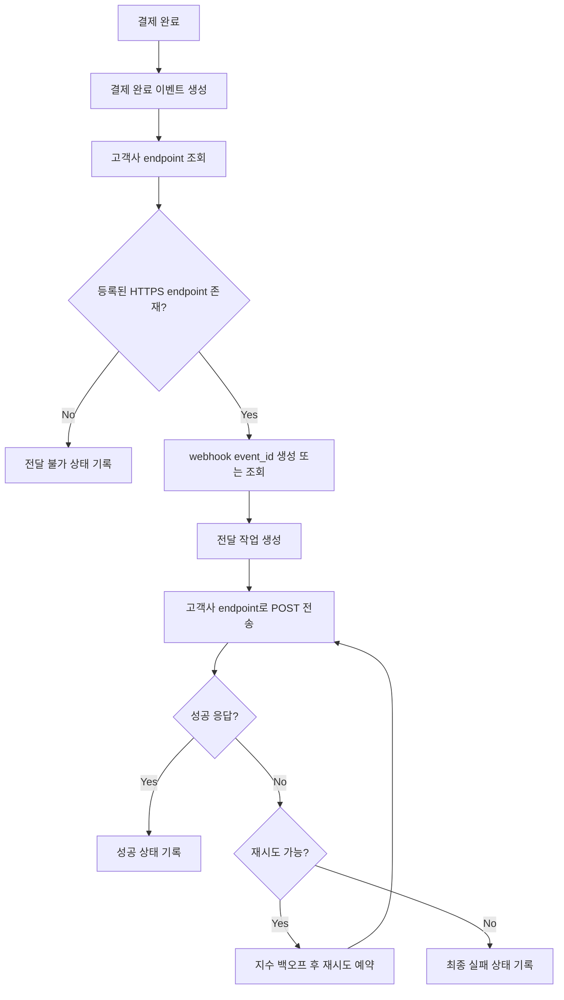

# 결제 완료 웹훅 전달 API PRD

## Applicability

| Contract | Required / N/A | Evidence |
|---|---|---|
| Pages/routes or screen IDs | N/A | 이번 범위에 UI 없음. endpoint 등록은 기존 내부 API가 담당 |
| Empty/loading/error/success/recovery state matrix | N/A | 사용자 화면이 없는 백엔드 전달 기능 |
| Mermaid user or system flow | Required | 결제 완료부터 고객사 endpoint 전달, 실패 재시도까지 다단계 시스템 lifecycle 존재 |

## Context and Problem

결제가 완료되면 고객사가 등록한 HTTPS endpoint로 결제 완료 이벤트를 전달해야 한다. 네트워크 실패나 고객사 endpoint 장애가 있을 수 있으므로 최소 1회 전달을 보장하고, 고객사가 중복 이벤트를 식별할 수 있도록 안정적인 `event_id`를 제공해야 한다.

서명 검증 방식과 secret rotation 정책은 아직 확정되지 않았으므로, 1차 구현은 해당 정책이 확정될 수 있도록 확장 지점을 마련하되 임의의 보안 정책을 만들지 않는다.

## Goals

- 결제 완료 시 등록된 고객사 HTTPS endpoint로 웹훅 이벤트를 비동기 전달한다.
- 네트워크 실패 또는 일시적 실패에 대해 지수 백오프 기반 재시도를 수행한다.
- 동일 이벤트가 여러 번 전달될 수 있음을 전제로 고객사가 중복 처리를 방지할 수 있게 `event_id`를 포함한다.
- 고객사별 데이터 격리를 보장한다.
- 처리량과 지연 SLA는 측정 전까지 수치 목표로 확정하지 않는다.

## Non-goals

- UI, replay 대시보드, 수동 재전송 기능
- endpoint 등록/수정/삭제 API 구현
- 서명 검증 방식 최종 결정
- secret rotation 주기 최종 결정
- 임의의 처리량, 지연 시간, 재시도 횟수 SLA 확정
- 고객사 시스템 내부의 중복 처리 로직 구현

## Users, Roles, and Permissions

| Role | Description | Permissions |
|---|---|---|
| 결제 시스템 | 결제 완료 이벤트를 발생시키는 내부 시스템 | 결제 완료 이벤트 생성 |
| 웹훅 전달 서비스 | 이벤트를 고객사 endpoint로 전달하는 내부 서비스 | 고객사별 등록 endpoint 조회, 전달 작업 생성, 재시도 관리 |
| 고객사 서버 | HTTPS webhook endpoint를 운영하는 외부 수신자 | 자기 고객사 이벤트 수신 |
| 내부 운영자 | 장애 조사 또는 운영 확인 담당자 | 1차 출시에서는 replay/수동 재전송 UI 없음. 운영 조회 권한은 기존 내부 도구 범위에 따름 |

## Functional Requirements

| ID | Requirement | Priority |
|---|---|---|
| FR-001 | 결제 완료 이벤트가 발생하면 해당 결제의 고객사에 등록된 HTTPS endpoint를 조회해 웹훅 전달 작업을 생성한다. | P0 |
| FR-002 | 웹훅 payload에는 고객사가 중복 수신을 식별할 수 있는 전역 고유 `event_id`를 포함한다. | P0 |
| FR-003 | 동일 결제 완료 이벤트에 대한 재시도는 최초 생성된 동일 `event_id`를 유지한다. | P0 |
| FR-004 | 고객사 endpoint에는 HTTPS URL만 전달 대상으로 허용한다. | P0 |
| FR-005 | 고객사별 등록 endpoint, event payload, 전달 이력은 tenant/customer 경계로 격리되어야 한다. | P0 |
| FR-006 | 전달 요청은 고객사 endpoint로 HTTP POST 방식으로 전송한다. | P0 |
| FR-007 | 고객사 endpoint가 성공 응답을 반환하면 해당 이벤트 전달을 성공으로 기록하고 추가 재시도를 예약하지 않는다. | P0 |
| FR-008 | 네트워크 실패, timeout, 또는 재시도 가능한 HTTP 실패 응답이 발생하면 지수 백오프 정책으로 재시도를 예약한다. | P0 |
| FR-009 | 재시도 정책은 설정값으로 관리되어야 하며, 1차 출시 전 운영자가 확인 가능한 기본값을 확정해야 한다. | P0 |
| FR-010 | 최대 재시도 이후에도 성공하지 못한 이벤트는 실패 상태로 기록한다. | P0 |
| FR-011 | 웹훅 payload에는 결제 완료 이벤트 처리에 필요한 최소 결제 식별자, 고객사 식별자, 이벤트 타입, 발생 시각을 포함한다. | P0 |
| FR-012 | 웹훅 전달 요청과 응답 결과는 장애 조사에 필요한 수준으로 기록하되, 고객사 간 데이터가 섞이지 않아야 한다. | P0 |
| FR-013 | 서명 검증 방식과 secret rotation 정책은 보안 결정이 확정된 뒤 적용할 수 있도록 전달 계층에 확장 지점을 둔다. | P1 |
| FR-014 | 1차 출시 범위에는 replay 대시보드와 수동 재전송 기능을 포함하지 않는다. | P0 |
| FR-015 | 처리량, 지연 시간, 성공률, 재시도율은 계측해야 하지만, 측정 전 SLA 수치는 정의하지 않는다. | P1 |

## Pages and Routes

| Page or screen ID | Route, deep link, or explicit TBD + owner | Roles | Purpose |
|---|---|---|---|
| N/A | UI 없음 | N/A | 이번 범위는 백엔드 API/worker 기능만 포함 |

## State Matrix

| Surface | Empty | Loading | Error | Success | Recovery |
|---|---|---|---|---|---|
| N/A | N/A | N/A | N/A | N/A | N/A |

## User or System Flow

## Authorization and Data Boundaries

- 모든 웹훅 이벤트, endpoint 설정, 전달 상태, 로그는 고객사 tenant/customer ID에 귀속되어야 한다.
- 웹훅 전달 서비스는 이벤트의 고객사 ID와 endpoint의 고객사 ID가 일치할 때만 전송해야 한다.
- 고객사 A의 결제 이벤트가 고객사 B의 endpoint로 전달되면 안 된다.
- 내부 조회나 운영 로그에서도 고객사 경계를 유지해야 한다.
- UI 숨김은 권한 통제가 아니며, 백엔드 조회/전달 경로에서 tenant boundary를 검증해야 한다.
- 서명 방식은 열린 결정이나, 보안 정책 확정 전까지 임의 서명 규칙을 고객사 계약으로 공개하지 않는다.

## Non-functional Requirements

| Area | Requirement |
|---|---|
| Reliability | 최소 1회 전달을 목표로 하며, 중복 전달 가능성을 명시적으로 허용한다. |
| Retry | 네트워크 실패 및 재시도 가능한 실패는 지수 백오프로 재시도한다. 구체적인 최대 횟수, 간격, timeout은 열린 결정으로 둔다. |
| Idempotency support | 고객사가 중복 수신을 처리할 수 있도록 모든 이벤트에 안정적인 `event_id`를 제공한다. |
| Security | HTTPS endpoint만 지원한다. 서명 검증과 secret rotation은 보안 담당자 결정 후 확정한다. |
| Observability | 처리량, 전달 지연, 성공/실패, 재시도율, 최종 실패 건수를 계측한다. 수치 SLA는 측정 후 정의한다. |
| Data isolation | 고객사별 데이터 격리를 기능 요구사항과 권한 요구사항으로 모두 보장한다. |

## Acceptance Criteria

| ID | Requirement | Given | When | Then | Verification |
|---|---|---|---|---|---|
| AC-001 | FR-001 | 결제가 완료되고 고객사 endpoint가 등록되어 있음 | 결제 완료 이벤트가 발생함 | 웹훅 전달 작업이 생성됨 | 통합 테스트 |
| AC-002 | FR-002 | 웹훅 이벤트가 생성됨 | payload가 구성됨 | payload에 고유한 `event_id`가 포함됨 | 단위/통합 테스트 |
| AC-003 | FR-003 | 최초 전달이 실패한 이벤트가 있음 | 재시도가 실행됨 | 최초와 동일한 `event_id`로 전송됨 | 통합 테스트 |
| AC-004 | FR-004 | endpoint 등록 정보가 HTTPS가 아님 | 전달 대상 검증이 실행됨 | 해당 endpoint로 전송하지 않고 실패 또는 설정 오류로 기록함 | 단위/통합 테스트 |
| AC-005 | FR-005 | 고객사 A 이벤트와 고객사 B endpoint가 존재함 | 전달 작업이 생성됨 | A 이벤트는 A endpoint로만 전달됨 | 권한/격리 테스트 |
| AC-006 | FR-006 | 전달 작업이 준비됨 | 전송이 실행됨 | 고객사 endpoint에 HTTP POST 요청이 전송됨 | 통합 테스트 |
| AC-007 | FR-007 | 고객사 endpoint가 성공 응답을 반환함 | 응답을 처리함 | 전달 성공으로 기록되고 재시도하지 않음 | 통합 테스트 |
| AC-008 | FR-008 | 네트워크 실패가 발생함 | 응답을 처리함 | 지수 백오프 기반 재시도가 예약됨 | 통합 테스트 |
| AC-009 | FR-010 | 재시도 한도를 초과함 | 마지막 실패를 처리함 | 이벤트가 최종 실패 상태로 기록됨 | 통합 테스트 |
| AC-010 | FR-011 | 결제 완료 이벤트가 있음 | payload가 생성됨 | 결제 식별자, 고객사 식별자, 이벤트 타입, 발생 시각이 포함됨 | 계약 테스트 |
| AC-011 | FR-012 | 전달 요청과 응답이 발생함 | 로그/전달 이력이 저장됨 | 장애 조사에 필요한 상태가 기록되고 다른 고객사 데이터와 섞이지 않음 | 통합/보안 테스트 |
| AC-012 | FR-013 | 서명 정책이 아직 미확정임 | 전달 계층을 구현함 | 서명 모듈을 추후 교체/추가할 수 있는 경계가 존재함 | 설계 리뷰 |
| AC-013 | FR-014 | 1차 출시 범위 검증 | 기능 목록을 확인함 | replay 대시보드와 수동 재전송 기능이 없음 | 릴리즈 체크 |
| AC-014 | FR-015 | 웹훅 전달이 발생함 | 메트릭을 수집함 | 처리량, 지연, 성공/실패, 재시도율이 측정 가능함 | 운영 메트릭 확인 |

## Assumptions and Open Decisions

### 합리적 가정

- endpoint 등록/수정/삭제는 기존 내부 API가 이미 담당하며, 이 PRD는 등록된 endpoint를 읽어 사용하는 범위만 다룬다.
- 결제 완료 이벤트는 내부 결제 시스템에서 신뢰 가능한 방식으로 발생한다.
- 웹훅 전달은 결제 완료 처리와 분리된 비동기 작업으로 수행한다.
- 고객사는 중복 이벤트를 받을 수 있으며, `event_id`를 기준으로 멱등 처리를 한다.
- 성공 응답의 구체 범위는 일반적으로 2xx로 볼 수 있으나, 최종 HTTP 성공 판정 정책은 구현 전 확정한다.

### 열린 결정

| Decision | Owner | Needed by | Impact |
|---|---|---|---|
| 웹훅 서명 방식 | 보안 담당자 | 고객사 공개 문서/연동 전 | 고객사 검증 구현, 보안 계약 |
| secret rotation 주기와 절차 | 보안 담당자 | 운영 전 | 장기 운영 보안, 고객사 migration |
| 재시도 가능한 HTTP status 범위 | 백엔드/플랫폼 담당자 | 구현 전 | 실패 처리와 재시도 비용 |
| 최대 재시도 횟수와 백오프 상한 | 백엔드/운영 담당자 | 출시 전 | 최소 1회 전달 수준, 운영 부하 |
| 요청 timeout | 백엔드/운영 담당자 | 출시 전 | 지연, worker 점유, 재시도 빈도 |
| payload schema의 최종 필드 | 백엔드/고객 연동 담당자 | 고객사 연동 문서 작성 전 | 고객사 개발 계약 |
| 처리량/지연 SLA | 제품/운영 담당자 | 실측 이후 | 공개 SLA와 capacity planning |

## Risks and Mitigations

| Risk | Impact | Mitigation |
|---|---|---|
| 중복 전달로 고객사에서 중복 처리 발생 | 고객사 데이터 불일치 가능 | `event_id`를 필수 제공하고 중복 가능성을 연동 계약에 명시 |
| 고객사 endpoint 장애로 전달 실패 누적 | 큐 적체, 지연 증가 | 지수 백오프, 최종 실패 상태, 메트릭 계측 |
| tenant 격리 오류 | 심각한 데이터 노출 | 고객사 ID 일치 검증, 격리 테스트, 로그 저장 시 tenant scope 강제 |
| 서명 정책 미확정 | 고객사 보안 연동 지연 | 보안 담당자 결정 전까지 열린 결정으로 관리하고 전달 계층 확장 지점 확보 |
| SLA 수치 임의 설정 | 신뢰도 저하, 운영 부담 | 1차 출시에서는 계측만 요구하고 실측 후 SLA 결정 |

## Delivery

| Phase | Requirement IDs | Verifiable exit condition |
|---|---|---|
| Phase 1: Core delivery | FR-001, FR-002, FR-003, FR-004, FR-006, FR-007 | 결제 완료 이벤트가 등록된 HTTPS endpoint로 POST 전달되고 성공 상태가 기록됨 |
| Phase 2: Retry and failure handling | FR-008, FR-009, FR-010 | 실패 시 지수 백오프 재시도가 예약되고 한도 초과 시 최종 실패로 기록됨 |
| Phase 3: Data isolation and observability | FR-005, FR-012, FR-015 | 고객사별 격리 테스트와 전달 메트릭 확인이 통과됨 |
| Phase 4: Security extension readiness | FR-013 | 서명/rotation 정책 확정 후 적용 가능한 설계 경계가 리뷰됨 |
| Phase 5: Scope guard | FR-014 | 1차 출시 산출물에 replay 대시보드와 수동 재전송 기능이 포함되지 않음 |

검증 참고: 요청에 따라 파일을 만들지 않았으므로 PRD validator는 실행하지 않았습니다.