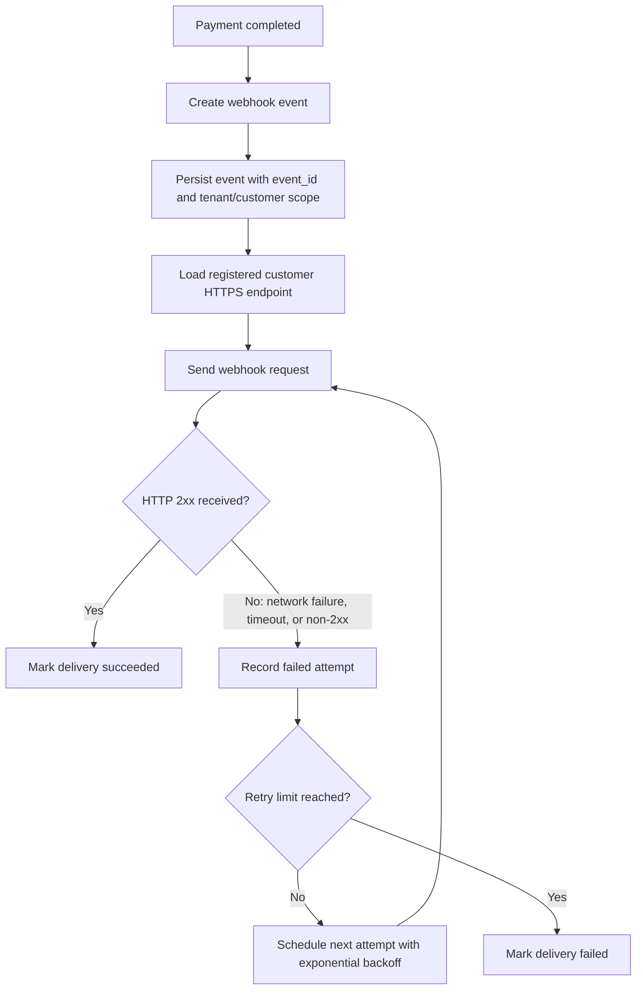

# 결제 완료 웹훅 전달 API PRD

## Applicability

| Contract | Required / N/A | Evidence |
|---|---|---|
| Pages/routes or screen IDs | N/A | 이번 범위에 UI 없음. endpoint 등록은 기존 내부 API가 담당 |
| Empty/loading/error/success/recovery state matrix | N/A | 사용자 화면 없음 |
| Mermaid user or system flow | Required | 결제 완료 후 이벤트 생성, 고객사 endpoint 전달, 실패 재시도까지의 시스템 lifecycle 존재 |

## Context and Problem

결제가 완료되면 고객사 시스템이 후속 처리를 할 수 있도록 등록된 고객사 HTTPS endpoint로 결제 완료 이벤트를 전달해야 한다. 네트워크 실패나 일시 장애가 있어도 최소 1회 전달을 보장해야 하며, 고객사는 같은 이벤트를 여러 번 받을 수 있으므로 중복 처리를 방지할 수 있는 안정적인 `event_id`가 필요하다.

현재 서명 검증 방식과 secret rotation 주기는 보안 담당자가 결정하지 않았으므로, 1차 PRD에서는 결정 필요 항목으로 분리한다.

## Goals

- 결제 완료 시 고객사별 등록 HTTPS endpoint로 웹훅 이벤트를 전달한다.
- 최소 1회 전달을 보장한다.
- 네트워크 실패 또는 일시적 전송 실패 시 지수 백오프로 재시도한다.
- 고객사가 중복 수신을 식별할 수 있도록 모든 이벤트에 고유하고 안정적인 `event_id`를 포함한다.
- 고객사별 데이터 격리를 보장한다.
- 처리량과 지연 시간은 측정 가능한 지표로 수집하되, 1차 출시 전 근거 없는 SLA 수치를 정하지 않는다.

## Non-goals

- 웹훅 endpoint 등록 UI
- replay 대시보드
- 운영자 또는 고객사의 수동 재전송 기능
- 서명 검증 알고리즘 및 secret rotation 정책 확정
- 특정 처리량, 지연 시간 SLA 보장
- 결제 완료 이외 이벤트 타입 지원

## Users, Roles, and Permissions

| Role | Description | Permissions |
|---|---|---|
| Payment System | 결제 완료 이벤트의 원천 시스템 | 결제 완료 사실을 웹훅 전달 API에 알림 |
| Webhook Delivery Service | 이벤트 생성, 저장, 전달, 재시도 담당 시스템 | 고객사별 endpoint 조회, 이벤트 전달, 전달 결과 기록 |
| Customer Endpoint | 고객사가 등록한 HTTPS endpoint | 결제 완료 이벤트 수신 |
| Internal API | 기존 endpoint 등록 담당 API | 고객사별 endpoint와 관련 설정 관리 |
| Operator | 내부 운영자 | 1차 출시에서는 replay 대시보드와 수동 재전송 권한 없음 |

## Functional Requirements

| ID | Requirement | Priority |
|---|---|---|
| FR-001 | 결제 완료가 확정되면 웹훅 전달 대상 이벤트를 생성해야 한다. | Must |
| FR-002 | 각 이벤트는 전역적으로 고유하고 재시도 간 변경되지 않는 `event_id`를 가져야 한다. | Must |
| FR-003 | 이벤트 payload에는 최소한 `event_id`, 이벤트 타입, 결제 식별자, 고객사 식별자, 이벤트 발생 시각이 포함되어야 한다. | Must |
| FR-004 | 웹훅은 등록된 고객사 HTTPS endpoint로만 전달되어야 한다. | Must |
| FR-005 | HTTP 2xx 응답을 수신하면 해당 이벤트 전달을 성공으로 기록해야 한다. | Must |
| FR-006 | 네트워크 실패, timeout, 또는 비-2xx 응답은 전달 실패로 기록하고 재시도 대상이 되어야 한다. | Must |
| FR-007 | 실패한 전달은 지수 백오프 방식으로 재시도해야 한다. | Must |
| FR-008 | 동일 이벤트에 대한 재시도는 같은 `event_id`와 논리적으로 동일한 이벤트 내용을 사용해야 한다. | Must |
| FR-009 | 고객사별 데이터는 저장, 조회, 전달 작업에서 격리되어야 하며 다른 고객사의 endpoint 또는 이벤트 데이터로 전달되면 안 된다. | Must |
| FR-010 | 전달 시도마다 요청 시각, 응답 상태 또는 실패 사유, 시도 번호, 다음 재시도 예정 시각을 기록해야 한다. | Must |
| FR-011 | 재시도 횟수 한도와 최종 실패 처리 상태를 설정 가능하게 설계해야 한다. 실제 기본값은 출시 전 운영/엔지니어링 결정으로 확정한다. | Must |
| FR-012 | 서명 검증 방식이 확정되기 전까지, 서명 관련 구현은 명시적 feature flag 또는 비활성 상태로 분리되어야 한다. | Should |
| FR-013 | 처리량, 전달 지연, 성공률, 재시도율을 측정할 수 있는 운영 지표를 기록해야 한다. 단, 목표 수치는 1차 출시 전 실측 기반으로 별도 결정한다. | Must |

## Pages and Routes

N/A. 이번 범위에는 사용자-visible 화면, route, screen ID가 없다.

## State Matrix

N/A. 이번 범위에는 사용자-visible empty/loading/error/success/recovery 상태가 없다.

## User or System Flow

## Authorization and Data Boundaries

- 모든 이벤트, endpoint 조회, 전달 기록은 고객사 식별자 기준으로 scope가 분리되어야 한다.
- 웹훅 전달 API는 이벤트의 고객사 식별자와 endpoint의 고객사 식별자가 일치할 때만 전송해야 한다.
- 고객사 A의 이벤트가 고객사 B의 endpoint로 전달되는 것은 치명적 데이터 격리 위반으로 간주한다.
- 내부 endpoint 등록 API가 endpoint 소유권을 관리한다는 가정 하에, 전달 API는 해당 소유권 정보를 신뢰하되 전송 전 customer scope 일치를 검증해야 한다.
- 운영자 권한이 있더라도 1차 출시에서는 replay 또는 수동 재전송 기능을 제공하지 않는다.

## Non-functional Requirements

| Area | Requirement |
|---|---|
| Reliability | 최소 1회 전달을 보장해야 한다. 중복 전달 가능성을 제품 동작으로 인정하고 `event_id`로 멱등 처리를 지원한다. |
| Retry | 실패 시 지수 백오프를 사용한다. 구체적인 초기 지연, 최대 지연, 최대 재시도 횟수는 열린 결정이다. |
| Observability | 전달 성공률, 실패율, 재시도율, 최종 실패 수, 전달 지연 시간을 측정 가능해야 한다. |
| Security | 서명 검증 방식과 secret rotation 주기는 보안 담당자 결정 후 반영한다. 미결정 상태에서 임의 알고리즘을 확정하지 않는다. |
| Tenancy | 고객사별 데이터 격리는 필수다. 저장소, 조회 조건, 전송 대상 선택에 customer scope가 포함되어야 한다. |
| Performance | 처리량과 지연 SLA는 아직 근거가 없으므로 수치를 정하지 않는다. 1차 출시 후 또는 베타 중 실측 기반으로 결정한다. |

## Acceptance Criteria

| ID | Requirement | Given | When | Then | Verification |
|---|---|---|---|---|---|
| AC-001 | FR-001 | 결제가 완료됨 | 결제 완료 이벤트가 전달 API에 입력됨 | 웹훅 이벤트가 생성되고 저장됨 | 통합 테스트 |
| AC-002 | FR-002 | 하나의 결제 완료 이벤트가 생성됨 | 최초 전달과 재시도가 발생함 | 모든 시도에서 동일한 `event_id`가 사용됨 | 단위/통합 테스트 |
| AC-003 | FR-003 | 이벤트 payload가 생성됨 | 고객사 endpoint로 전송됨 | payload에 `event_id`, 이벤트 타입, 결제 식별자, 고객사 식별자, 발생 시각이 포함됨 | 계약 테스트 |
| AC-004 | FR-004, FR-009 | 고객사 A 이벤트와 고객사 B endpoint가 존재함 | 고객사 A 이벤트를 전송함 | 고객사 A endpoint로만 전달되고 고객사 B endpoint로는 전달되지 않음 | 격리 테스트 |
| AC-005 | FR-005 | 고객사 endpoint가 HTTP 2xx를 응답함 | 웹훅이 전송됨 | 전달 상태가 성공으로 기록되고 추가 재시도가 예약되지 않음 | 통합 테스트 |
| AC-006 | FR-006, FR-007 | 고객사 endpoint가 timeout 또는 비-2xx를 반환함 | 웹훅 전송이 실패함 | 실패 시도가 기록되고 지수 백오프 기반 다음 시도가 예약됨 | 통합 테스트 |
| AC-007 | FR-008 | 동일 이벤트가 여러 번 재시도됨 | 각 재시도 요청이 생성됨 | `event_id`와 핵심 이벤트 데이터가 변경되지 않음 | 계약 테스트 |
| AC-008 | FR-010 | 웹훅 전달 시도가 발생함 | 성공 또는 실패 결과가 반환됨 | 시도 번호, 시각, 응답 상태 또는 실패 사유가 기록됨 | 단위/통합 테스트 |
| AC-009 | FR-011 | 재시도 한도에 도달함 | 추가 실패가 발생함 | 이벤트가 최종 실패 상태로 기록되고 더 이상 자동 재시도되지 않음 | 통합 테스트 |
| AC-010 | FR-013 | 운영 지표 수집이 활성화됨 | 웹훅 전달 성공, 실패, 재시도가 발생함 | 성공률, 실패율, 재시도율, 전달 지연 측정에 필요한 지표가 기록됨 | 계측 테스트 또는 로그 검증 |

## Assumptions and Open Decisions

### Reasonable Assumptions

- endpoint 등록, 수정, 삭제는 기존 내부 API가 담당하며 이번 범위에서는 변경하지 않는다.
- 등록 가능한 endpoint는 HTTPS URL이다.
- HTTP 2xx는 성공, 네트워크 오류, timeout, 비-2xx는 실패로 분류한다.
- 고객사는 중복 수신 가능성을 알고 `event_id` 기준으로 멱등 처리를 수행해야 한다.
- 결제 완료 이벤트는 결제 상태가 최종적으로 완료된 뒤 한 번 생성된다.
- 1차 출시에서는 결제 완료 이벤트 타입만 지원한다.

### Open Decisions

| Decision | Owner | Impact |
|---|---|---|
| 웹훅 서명 방식 | Security | 고객사 검증 방식, header 형식, payload canonicalization에 영향 |
| secret rotation 주기와 운영 방식 | Security | endpoint 설정 모델, 다중 secret 지원 여부에 영향 |
| 지수 백오프 파라미터 | Engineering / Operations | 재시도 빈도, 장애 시 트래픽, 최종 실패까지 걸리는 시간에 영향 |
| 최대 재시도 횟수 및 최종 실패 보존 기간 | Engineering / Operations | 저장소 용량, 운영 대응, 고객 안내 정책에 영향 |
| timeout 기본값 | Engineering / Operations | 지연, 실패율, 리소스 사용량에 영향 |
| 처리량과 지연 SLA | Product / Engineering | 용량 계획과 출시 기준에 영향. 실측 전 수치 확정 금지 |
| 실패 이벤트 운영 알림 기준 | Operations | 최종 실패 또는 실패율 급증 시 대응 방식에 영향 |

## Risks and Mitigations

| Risk | Impact | Mitigation |
|---|---|---|
| 고객사가 같은 이벤트를 여러 번 수신 | 중복 주문 처리 등 고객사 오류 가능 | 모든 이벤트에 안정적인 `event_id` 제공, 고객사 문서에 멱등 처리 요구 명시 |
| 고객사 간 데이터 혼선 | 보안 및 신뢰도에 치명적 영향 | 모든 저장/조회/전송 경로에 customer scope 검증 추가 |
| 보안 서명 정책 미확정 | 고객사 신뢰 및 위변조 방지 기능 지연 | 서명 정책은 열린 결정으로 관리하고, 임의 방식 출시 금지 |
| 재시도 폭주 | 장애 고객사 또는 네트워크 장애 시 시스템 부하 증가 | 지수 백오프, 재시도 한도, 관측 지표 적용 |
| SLA 수치 조기 확정 | 근거 없는 약속으로 운영 리스크 증가 | 초기에는 측정만 수행하고 실측 기반으로 SLA 결정 |
| 수동 재전송 부재 | 고객사 장애 복구 후 과거 이벤트 재처리 어려움 | 1차 범위에서 명시 제외하고 후속 release candidate로 관리 |

## Delivery

| Phase | Requirement IDs | Verifiable exit condition |
|---|---|---|
| Phase 1: Core event creation | FR-001, FR-002, FR-003, FR-009 | 결제 완료 이벤트가 customer scope와 `event_id`를 포함해 저장되고 테스트로 검증됨 |
| Phase 2: Delivery and result recording | FR-004, FR-005, FR-006, FR-010 | HTTPS endpoint 전송, 성공/실패 분류, 전달 시도 기록이 통합 테스트로 검증됨 |
| Phase 3: Retry behavior | FR-007, FR-008, FR-011 | 실패 시 지수 백오프 재시도, 동일 `event_id` 유지, 한도 도달 후 최종 실패 처리가 검증됨 |
| Phase 4: Observability and release readiness | FR-012, FR-013 | 운영 지표가 기록되고, 서명 정책 미확정 항목이 feature flag 또는 후속 결정 항목으로 분리됨 |

검증 참고: 요청에 따라 파일을 만들지 않았으므로 PRD validator는 실행하지 않았다.