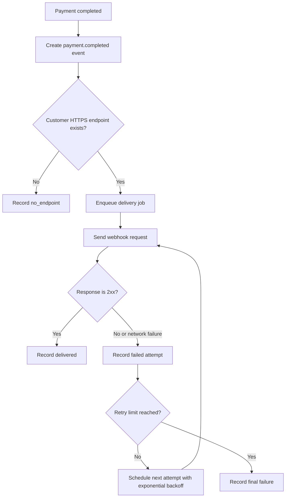

# 결제 완료 웹훅 전달 API PRD

## Applicability

| Contract | Required / N/A | Evidence |
|---|---:|---|
| Pages/routes or screen IDs | N/A | 이번 범위에 UI 없음. endpoint 등록은 기존 내부 API가 담당 |
| Empty/loading/error/success/recovery state matrix | N/A | 사용자 화면 없음 |
| Mermaid user or system flow | Required | 결제 완료 이후 전달, 실패, 재시도, 중복 수신 가능성을 포함한 시스템 lifecycle 필요 |

## Context and Problem

결제가 완료되면 고객사가 등록한 HTTPS endpoint로 결제 완료 이벤트를 전달해야 한다. 네트워크 실패가 발생할 수 있으므로 최소 1회 전달 보장을 제공하고, 고객사는 동일 이벤트를 여러 번 받을 수 있으므로 중복 처리를 위한 고유 `event_id`가 필요하다.

1차 출시 범위는 자동 웹훅 전달 API이며, replay 대시보드와 수동 재전송 기능은 제외한다.

## Goals

- 결제 완료 이벤트를 등록된 고객사 HTTPS endpoint로 자동 전달한다.
- 네트워크 실패 시 지수 백오프로 재시도한다.
- 각 이벤트에 안정적인 고유 `event_id`를 포함해 고객사가 멱등 처리할 수 있게 한다.
- 고객사별 endpoint, secret, 이벤트, 전달 이력을 데이터 경계 안에서 격리한다.
- 처리량과 지연 시간은 계측 가능하게 하되, 1차 출시에서 근거 없는 SLA 수치를 정의하지 않는다.

## Non-goals

- 고객사용 또는 운영자용 replay 대시보드
- 수동 재전송 기능
- endpoint 등록 UI
- endpoint 등록 내부 API 신규 구현
- 서명 알고리즘, secret rotation 정책의 최종 결정
- 처리량/지연 SLA 수치 확정
- 결제 완료 외 이벤트 타입 지원

## Users, Roles, and Permissions

| Role | Description | Permissions |
|---|---|---|
| Payment System | 결제 상태를 완료로 확정하는 내부 시스템 | 결제 완료 이벤트 생성 요청 가능 |
| Webhook Delivery Worker | 이벤트 전달을 수행하는 내부 비동기 처리자 | 고객사별 등록 endpoint 조회, 전달 시도, 결과 기록 가능 |
| Customer Endpoint | 고객사가 등록한 HTTPS endpoint | 이벤트 수신. 내부 데이터 조회 권한 없음 |
| Internal API | 기존 endpoint 등록 담당 API | 고객사별 endpoint/secret 등록 및 갱신 담당. 이번 범위에서는 연동 대상 |

## Functional Requirements

| ID | Requirement | Priority |
|---|---|---:|
| FR-001 | 결제가 완료되면 해당 고객사의 등록된 HTTPS endpoint로 `payment.completed` 이벤트 전달 작업을 생성한다. | P0 |
| FR-002 | 전달 payload에는 최소 `event_id`, `event_type`, `customer_id` 또는 고객사 식별 context, `payment_id`, 결제 완료 시각, 이벤트 생성 시각을 포함한다. | P0 |
| FR-003 | `event_id`는 이벤트별 전역 고유값이며, 재시도 시에도 동일하게 유지한다. | P0 |
| FR-004 | 같은 결제 완료 처리에서 동일 고객사에 중복 이벤트가 생성되지 않도록 내부 이벤트 생성은 멱등성을 가져야 한다. | P0 |
| FR-005 | 고객사 endpoint에는 HTTPS URL만 사용한다. HTTP endpoint는 전달 대상에서 제외하거나 등록 단계에서 거부된 것으로 간주한다. | P0 |
| FR-006 | 2xx 응답을 성공 전달로 간주한다. 3xx, 4xx, 5xx, timeout, DNS/TLS/connect 오류는 실패로 기록한다. | P0 |
| FR-007 | 네트워크 실패와 비-2xx 응답에는 지수 백오프로 자동 재시도한다. | P0 |
| FR-008 | 재시도는 설정 가능한 최대 시도 횟수 또는 최대 경과 시간에 도달하면 중단하고 최종 실패 상태로 기록한다. 구체 값은 열린 결정으로 둔다. | P0 |
| FR-009 | 각 전달 시도는 시도 번호, 요청 대상 endpoint, 응답 status code 또는 오류 유형, 시도 시각, 다음 재시도 예정 시각, 최종 상태를 기록한다. | P0 |
| FR-010 | 고객사별 데이터는 조회, 큐잉, 전달 이력, secret 접근 전 구간에서 tenant boundary를 강제해야 한다. | P0 |
| FR-011 | 서명 검증을 위한 header/payload 확장 지점을 제공하되, 알고리즘과 secret rotation 주기는 보안 담당자 결정 전까지 최종 명세로 고정하지 않는다. | P1 |
| FR-012 | endpoint가 등록되지 않은 고객사의 결제 완료 이벤트는 외부 전달을 시도하지 않고 `no_endpoint` 상태로 기록한다. | P0 |
| FR-013 | payload schema는 버전 필드를 포함해 향후 호환 가능한 변경을 지원한다. | P1 |
| FR-014 | 처리량, 큐 대기 시간, 전달 지연, 성공률, 재시도율, 최종 실패율을 계측한다. 단, 목표 수치는 1차 출시 전 측정 후 별도 결정한다. | P1 |

## Pages and Routes

N/A. 사용자-visible 화면 없음.

## State Matrix

N/A. 사용자-visible 상태 없음.

## User or System Flow

## Authorization and Data Boundaries

- 모든 이벤트, endpoint 설정, delivery attempt, secret 참조는 고객사 tenant ID에 귀속되어야 한다.
- Delivery worker는 이벤트의 tenant ID와 endpoint 설정의 tenant ID가 일치할 때만 전달할 수 있다.
- 한 고객사의 endpoint, secret, 전달 이력은 다른 고객사 요청이나 작업에서 조회 또는 사용될 수 없다.
- 외부 고객사 endpoint에는 해당 이벤트에 필요한 결제 완료 정보만 전달한다.
- 로그에는 secret, 서명 원문 secret, 민감 결제 정보가 평문으로 남지 않아야 한다.
- UI가 없더라도 내부 API와 worker 권한은 서비스 계정/내부 권한으로 제한되어야 한다.

## Non-functional Requirements

| Area | Requirement |
|---|---|
| Delivery guarantee | 최소 1회 전달. 동일 이벤트가 여러 번 전달될 수 있음 |
| Idempotency support | 고객사가 중복 수신을 처리할 수 있도록 안정적인 `event_id` 제공 |
| Retry behavior | 지수 백오프 기반 자동 재시도. 세부 retry cap은 열린 결정 |
| Transport | 고객사 endpoint는 HTTPS |
| Observability | 처리량, 전달 지연, 큐 대기 시간, 성공/실패/재시도 지표 수집 |
| SLA | 처리량과 지연 SLA는 아직 정의하지 않음. 실제 측정 후 결정 |
| Security | 서명 방식과 rotation 주기는 열린 결정. 단, 구현은 향후 서명 적용을 막지 않아야 함 |
| Isolation | 고객사별 데이터 격리 필수 |

## Acceptance Criteria

| ID | Requirement | Given | When | Then | Verification |
|---|---|---|---|---|---|
| AC-001 | FR-001 | 고객사에 HTTPS endpoint가 등록되어 있고 결제가 완료됨 | 결제 완료 이벤트가 발생함 | `payment.completed` 전달 작업이 생성됨 | 통합 테스트 |
| AC-002 | FR-002, FR-003 | 전달 작업이 생성됨 | payload가 구성됨 | payload에 `event_id`, `event_type`, `payment_id`, 완료 시각, 생성 시각, schema version이 포함됨 | 계약 테스트 |
| AC-003 | FR-003 | 동일 이벤트 전달이 실패함 | 재시도가 수행됨 | 최초 전달과 재시도의 `event_id`가 동일함 | 통합 테스트 |
| AC-004 | FR-004 | 같은 결제 완료 처리가 중복 호출됨 | 이벤트 생성 로직이 실행됨 | 동일 고객사/결제 완료 건에 대해 중복 이벤트가 생성되지 않음 | 멱등성 테스트 |
| AC-005 | FR-006 | 고객사 endpoint가 2xx 응답함 | webhook 요청이 완료됨 | 전달 상태가 `delivered`로 기록되고 재시도하지 않음 | 통합 테스트 |
| AC-006 | FR-006, FR-007 | 고객사 endpoint가 timeout 또는 비-2xx 응답함 | webhook 요청이 실패함 | 실패 시도가 기록되고 지수 백오프 재시도가 예약됨 | 통합 테스트 |
| AC-007 | FR-008 | 실패가 retry limit까지 반복됨 | 마지막 허용 시도가 실패함 | 최종 실패 상태로 기록되고 추가 자동 재시도는 예약되지 않음 | 통합 테스트 |
| AC-008 | FR-009 | 전달 시도가 1회 이상 발생함 | 전달 이력을 조회함 | 시도 번호, endpoint, 응답/오류, 시각, 다음 재시도 시각 또는 최종 상태가 기록되어 있음 | DB/이벤트 저장소 검증 |
| AC-009 | FR-010 | 고객사 A 이벤트와 고객사 B endpoint가 존재함 | worker가 고객사 A 이벤트를 처리함 | 고객사 B endpoint 또는 secret을 사용하지 않음 | 권한/tenant isolation 테스트 |
| AC-010 | FR-012 | endpoint가 등록되지 않은 고객사의 결제가 완료됨 | 이벤트 처리 로직이 실행됨 | 외부 HTTP 요청 없이 `no_endpoint` 상태로 기록됨 | 통합 테스트 |
| AC-011 | FR-014 | 시스템이 이벤트를 처리함 | 전달 성공/실패/재시도가 발생함 | 처리량, 지연, 성공률, 재시도율, 최종 실패율 지표가 수집됨 | metric 검증 |

## Assumptions and Open Decisions

### 합리적 가정

- endpoint 등록과 소유권 검증은 기존 내부 API에서 이미 담당한다.
- 결제 완료 이벤트는 내부적으로 신뢰 가능한 결제 시스템에서 발생한다.
- 고객사 endpoint는 공개 인터넷에서 접근 가능한 HTTPS URL이다.
- 고객사는 `event_id`를 기준으로 멱등 처리를 수행할 수 있다.
- 2xx만 성공으로 간주하는 것이 고객사 webhook의 일반적인 기대와 맞다.

### 열린 결정

| Decision | Owner | Impact |
|---|---|---|
| 웹훅 서명 알고리즘, header 이름, timestamp 포함 여부 | Security | 고객사 검증 구현과 payload/header 계약에 영향 |
| secret rotation 주기와 dual-secret grace period | Security | 고객사 운영 절차와 전달 검증 호환성에 영향 |
| 최대 재시도 횟수 또는 최대 재시도 기간 | Product/Engineering | 최소 1회 이후의 내구성과 비용에 영향 |
| timeout 값 | Engineering | 지연, worker 점유, 실패 판정에 영향 |
| payload에 포함할 결제 상세 필드 범위 | Product/Security | 고객사 편의성과 데이터 최소화에 영향 |
| 처리량 및 지연 SLA | Product/Engineering | 용량 계획과 출시 기준에 영향. 측정 후 결정 필요 |

## Risks and Mitigations

| Risk | Impact | Mitigation |
|---|---|---|
| 고객사가 중복 이벤트를 처리하지 못함 | 중복 주문 처리 등 고객사 장애 가능 | `event_id` 안정성 보장, 문서에서 최소 1회 전달과 멱등 처리 필요성 명시 |
| 보안 서명 방식 미확정 | 1차 출시 계약 변경 가능 | header/schema version 확장 지점 확보, 보안 결정 전 알고리즘 고정 금지 |
| retry 폭증 | 외부 endpoint 장애 시 큐 적체 가능 | 지수 백오프, retry cap 설정 가능화, 실패율 metric 수집 |
| tenant boundary 오류 | 고객사 데이터 유출 | tenant ID 기반 조회 제한, isolation 테스트 필수 |
| SLA 미정 상태에서 기대 불일치 | 고객사 기대 관리 실패 | 1차 출시 문서에 SLA 미정 및 측정 후 확정 명시 |
| endpoint 장애 장기화 | 최종 실패 이벤트 누적 | 자동 재시도 후 최종 실패 기록. replay/manual resend는 1차 범위 제외로 명시 |

## Delivery

| Phase | Requirement IDs | Verifiable exit condition |
|---|---|---|
| Phase 1: Event creation and schema | FR-001, FR-002, FR-003, FR-004, FR-013 | 결제 완료 시 고유 `event_id`를 가진 `payment.completed` 이벤트가 멱등 생성되고 계약 테스트 통과 |
| Phase 2: Delivery worker and retry | FR-005, FR-006, FR-007, FR-008, FR-012 | HTTPS endpoint 전달, 성공 판정, 실패 재시도, no-endpoint 처리가 통합 테스트 통과 |
| Phase 3: Audit and isolation | FR-009, FR-010 | 전달 이력 기록과 고객사별 데이터 격리 테스트 통과 |
| Phase 4: Security extension and metrics | FR-011, FR-014 | 서명 확장 지점이 구현되어 있고 운영 metric이 수집됨. 최종 서명 정책과 SLA 수치는 열린 결정으로 남김 |

검증 참고: 요청에 따라 파일을 만들지 않았으므로 PRD validator는 실행하지 않았습니다.