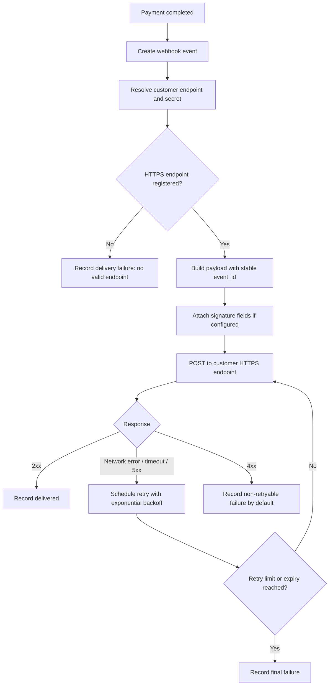

# 결제 완료 웹훅 전달 API PRD

## Applicability

| Contract | Required / N/A | Evidence |
|---|---|---|
| Pages/routes or screen IDs | N/A | UI는 이번 범위에 없으며 endpoint 등록은 기존 내부 API가 담당한다. |
| Empty/loading/error/success/recovery state matrix | N/A | 사용자 화면이 없고, 웹훅 전달은 백엔드 시스템 동작이다. |
| Mermaid user or system flow | Required | 결제 완료 후 이벤트 생성, 서명, 전달, 재시도까지의 다단계 시스템 lifecycle이 있다. |

## Context and problem

결제가 완료되면 고객사 시스템이 후속 처리를 할 수 있도록 등록된 고객사 HTTPS endpoint로 결제 완료 이벤트를 전달해야 한다. 네트워크 실패 가능성이 있으므로 최소 1회 전달을 보장하고, 고객사가 동일 이벤트를 여러 번 받을 수 있음을 전제로 event ID를 제공해야 한다.

서명 검증 방식과 secret rotation 정책은 아직 미정이므로 1차 출시에서는 결정 가능한 범위와 열린 보안 결정을 분리한다.

## Goals

- 결제 완료 이벤트를 고객사별 등록 HTTPS endpoint로 전달한다.
- 네트워크 실패 시 지수 백오프로 자동 재시도한다.
- 고객사가 중복 수신을 식별할 수 있도록 안정적인 `event_id`를 포함한다.
- 고객사별 데이터 격리를 보장한다.
- 처리량과 지연 SLA는 측정 전이므로 수치를 임의로 정하지 않는다.

## Non-goals

- 고객사 endpoint 등록 UI
- endpoint 등록 API 신규 개발
- replay 대시보드
- 수동 재전송 기능
- 처리량, 지연 시간, 성공률 SLA 수치 확정
- 최종 서명 알고리즘 및 secret rotation 주기 확정

## Users, roles, and permissions

| Role | Description | Permissions |
|---|---|---|
| 결제 시스템 | 결제 완료 상태를 확정하는 내부 시스템 | 결제 완료 이벤트 생성을 트리거할 수 있다. |
| 웹훅 전달 시스템 | 이벤트를 고객사 endpoint로 전달하는 내부 시스템 | 고객사별 endpoint, secret, 이벤트 데이터에 접근하되 tenant boundary를 지켜야 한다. |
| 고객사 endpoint | 이벤트를 수신하는 외부 HTTPS 서버 | 본인 고객사 이벤트만 수신한다. |
| 내부 운영자 | 장애 조사 또는 운영 모니터링 담당자 | 1차 출시 범위에서는 replay나 수동 재전송 권한이 없다. |

## Functional requirements

| ID | Requirement | Priority |
|---|---|---|
| FR-001 | 결제가 완료되면 결제 완료 웹훅 이벤트를 생성해야 한다. | P0 |
| FR-002 | 이벤트에는 전역적으로 유일하고 재시도 간 변경되지 않는 `event_id`를 포함해야 한다. | P0 |
| FR-003 | 이벤트에는 고객사가 결제 완료를 처리하는 데 필요한 결제 식별자, 고객사 식별자, 이벤트 타입, 이벤트 생성 시각을 포함해야 한다. | P0 |
| FR-004 | 이벤트 payload에는 다른 고객사의 데이터가 포함되면 안 된다. | P0 |
| FR-005 | 웹훅은 등록된 고객사 HTTPS endpoint로만 전달해야 한다. | P0 |
| FR-006 | endpoint URL scheme이 HTTPS가 아니면 전달 대상에서 제외하거나 실패 처리해야 한다. | P0 |
| FR-007 | 네트워크 오류, timeout, 5xx 응답에는 지수 백오프 방식으로 재시도해야 한다. | P0 |
| FR-008 | 2xx 응답은 전달 성공으로 처리해야 한다. | P0 |
| FR-009 | 4xx 응답의 재시도 여부는 고객사 설정 또는 정책이 없으면 재시도하지 않는 것을 기본 가정으로 한다. | P1 |
| FR-010 | 동일 이벤트 재시도 시 `event_id`와 핵심 payload는 변경하지 않아야 한다. | P0 |
| FR-011 | 전달 시도 이력은 이벤트 단위로 기록되어야 한다. 최소한 시도 시각, 응답 상태 또는 오류 유형, 다음 재시도 예정 시각, 성공 여부를 남긴다. | P0 |
| FR-012 | 최대 재시도 횟수 또는 만료 기간 도달 시 이벤트를 최종 실패 상태로 기록해야 한다. | P0 |
| FR-013 | 서명 검증 방식이 확정되기 전까지도 서명 헤더를 붙일 수 있도록 전달 구조는 확장 가능해야 한다. | P1 |
| FR-014 | 고객사 secret은 고객사별로 분리 저장 및 조회되어야 하며, 다른 고객사 전달에 사용되면 안 된다. | P0 |
| FR-015 | replay 대시보드와 수동 재전송 기능은 1차 출시에서 제공하지 않아야 한다. | P0 |

## Pages and routes

| Page or screen ID | Route, deep link, or explicit TBD + owner | Roles | Purpose |
|---|---|---|---|
| N/A | N/A | N/A | UI 범위 없음 |

## State matrix

| Surface | Empty | Loading | Error | Success | Recovery |
|---|---|---|---|---|---|
| N/A | N/A | N/A | N/A | N/A | N/A |

## User or system flow

## Authorization and data boundaries

- 웹훅 이벤트 생성, 조회, 전달, 재시도 scheduling은 고객사 tenant context를 필수로 가져야 한다.
- endpoint, secret, 결제 데이터, 전달 이력은 고객사별로 격리되어야 한다.
- 한 고객사의 결제 이벤트가 다른 고객사의 endpoint로 전달되면 안 된다.
- 내부 운영자 기능은 1차 출시에서 replay나 수동 재전송을 제공하지 않으므로, 해당 권한 모델도 이번 범위에 포함하지 않는다.
- secret 접근은 전달 시스템의 최소 권한으로 제한되어야 한다.
- UI가 없더라도 서버 측 tenant 검증이 필수다. UI 숨김이나 내부 호출 여부만으로 권한을 대체하지 않는다.

## Non-functional requirements

| Area | Requirement |
|---|---|
| Delivery guarantee | 최소 1회 전달을 목표로 한다. 따라서 고객사는 중복 이벤트를 받을 수 있다. |
| Idempotency support | 고객사가 중복 처리를 방지할 수 있도록 안정적인 `event_id`를 제공한다. |
| Retry behavior | 네트워크 실패와 5xx 응답은 지수 백오프로 재시도한다. 구체 횟수와 만료 기간은 열린 결정이다. |
| Security | 서명 방식과 secret rotation 주기는 보안 담당자 결정 전까지 열린 결정으로 둔다. 구현은 서명 헤더 추가와 secret 버전 확장에 대비한다. |
| Observability | 이벤트 생성, 전달 시도, 성공, 최종 실패 상태를 추적 가능해야 한다. |
| Performance | 처리량과 지연 SLA 수치는 아직 측정되지 않았으므로 정의하지 않는다. 단, 측정 지표는 수집 가능해야 한다. |
| Reliability | 전달 worker 장애 후에도 미완료 이벤트가 유실되지 않아야 한다. |

## Acceptance criteria

| ID | Requirement | Given | When | Then | Verification |
|---|---|---|---|---|---|
| AC-001 | FR-001 | 결제가 완료됨 | 결제 완료 상태가 확정됨 | 결제 완료 웹훅 이벤트가 생성된다. | 통합 테스트 |
| AC-002 | FR-002, FR-010 | 웹훅 이벤트가 생성됨 | 동일 이벤트가 재시도됨 | 모든 전달 시도에서 동일한 `event_id`가 사용된다. | 단위/통합 테스트 |
| AC-003 | FR-004, FR-014 | 고객사 A의 결제가 완료됨 | payload와 secret을 구성함 | 고객사 A 데이터와 secret만 사용된다. | 단위/권한 경계 테스트 |
| AC-004 | FR-005, FR-006 | 고객사 endpoint가 등록됨 | 전달 대상 검증을 수행함 | HTTPS endpoint에만 전달된다. | 단위 테스트 |
| AC-005 | FR-007 | 고객사 endpoint가 timeout 또는 5xx를 반환함 | 전달이 실패함 | 다음 시도가 지수 백오프로 예약된다. | 통합 테스트 |
| AC-006 | FR-008 | 고객사 endpoint가 2xx를 반환함 | 웹훅을 전달함 | 이벤트가 성공 상태로 기록되고 추가 재시도되지 않는다. | 통합 테스트 |
| AC-007 | FR-009 | 고객사 endpoint가 4xx를 반환함 | 웹훅을 전달함 | 기본 정책상 재시도하지 않고 실패 상태로 기록된다. | 통합 테스트 |
| AC-008 | FR-011 | 전달 시도가 발생함 | 성공 또는 실패 응답을 받음 | 시도 시각, 결과, 오류 유형 또는 응답 상태가 기록된다. | DB/assertion 테스트 |
| AC-009 | FR-012 | 재시도 한도 또는 만료 기간에 도달함 | 마지막 전달이 실패함 | 이벤트가 최종 실패 상태로 기록된다. | 통합 테스트 |
| AC-010 | FR-015 | 내부 운영자가 실패 이벤트를 확인함 | 1차 출시 기능을 사용함 | replay 대시보드와 수동 재전송 기능은 노출되지 않는다. | API/UI 부재 확인 |

## Assumptions and open decisions

### 합리적 가정

- endpoint 등록과 고객사별 endpoint 조회는 기존 내부 API 또는 저장소를 통해 가능하다.
- 결제 완료 이벤트는 결제 상태가 최종 완료로 확정된 후 한 번 생성된다.
- `event_id`는 이벤트 생성 시점에 발급되고, 재시도 간 변경되지 않는다.
- 2xx는 성공, 네트워크 오류와 5xx는 재시도 대상으로 본다.
- 명시 정책이 없으므로 4xx는 기본적으로 재시도하지 않는다.
- payload schema는 1차 출시 전 고객사 연동 문서 또는 API contract로 별도 확정된다.

### 열린 결정

| Decision | Owner | Blocks release? | Notes |
|---|---|---:|---|
| 웹훅 서명 알고리즘 | 보안 담당자 | Yes | 예: HMAC 계열 여부, canonical string 구성, timestamp 포함 여부 |
| secret rotation 주기와 버전 관리 방식 | 보안 담당자 | Yes | 이전 secret 허용 기간 포함 |
| 최대 재시도 횟수 또는 재시도 만료 기간 | 제품/엔지니어링 | Yes | 최소 1회 전달과 운영 비용 사이의 정책 결정 필요 |
| timeout 기준 | 엔지니어링 | Yes | 근거 없는 지연 SLA 수치와 분리해서 결정 |
| 4xx 중 재시도 가능한 상태 코드 예외 | 제품/엔지니어링 | No | 기본은 non-retryable, 필요 시 후속 정책화 |
| 처리량 및 지연 SLA | 제품/엔지니어링 | No for first implementation, Yes for SLA publication | 출시 후 또는 staging 측정 기반으로 정의 |
| payload 최종 schema | 제품/엔지니어링/고객 연동 담당 | Yes | 고객사가 결제 완료를 처리하는 최소 필드 확정 필요 |

## Risks and mitigations

| Risk | Impact | Mitigation |
|---|---|---|
| 중복 전달로 고객사 중복 처리 발생 | 고객사 주문/정산 오류 | 안정적인 `event_id` 제공 및 at-least-once 동작 명시 |
| 잘못된 tenant 데이터 전달 | 보안 및 계약상 중대 사고 | tenant context 기반 조회, 고객사별 secret 분리, 경계 테스트 |
| 서명 방식 미정으로 보안 구현 지연 | 출시 지연 또는 취약한 연동 | 서명/rotation을 release-blocking 열린 결정으로 관리 |
| 재시도 정책 과도 또는 부족 | 운영 비용 증가 또는 전달 누락 | 최대 횟수/만료 기간을 출시 전 명시 결정 |
| SLA 수치 임의 설정 | 신뢰도 저하 | 측정 지표만 먼저 수집하고 SLA는 측정 후 확정 |
| replay 기능 부재로 장애 복구 제한 | 운영 대응 지연 | 1차 출시 non-goal로 명시하고 후속 phase 후보로 관리 |

## Delivery

| Phase | Requirement IDs | Verifiable exit condition |
|---|---|---|
| Phase 1: Core event creation | FR-001, FR-002, FR-003, FR-004 | 결제 완료 시 tenant-scoped 이벤트가 생성되고 안정적인 `event_id`와 필수 payload를 가진다. |
| Phase 2: Delivery and retry | FR-005, FR-006, FR-007, FR-008, FR-009, FR-010, FR-011, FR-012 | HTTPS endpoint 전달, 성공 처리, 실패 재시도, 최종 실패 기록이 테스트로 검증된다. |
| Phase 3: Security boundary readiness | FR-013, FR-014 | 고객사별 secret 분리와 서명 확장 지점이 구현되고, 최종 서명 정책 결정 항목이 반영 가능하다. |
| Phase 4: Scope guard | FR-015 | replay 대시보드와 수동 재전송 기능이 1차 출시 API 또는 UI에 포함되지 않았음이 확인된다. |

검증 참고: 사용자가 파일 생성과 저장소 탐색을 금지했으므로 PRD validator는 실행하지 않았습니다.