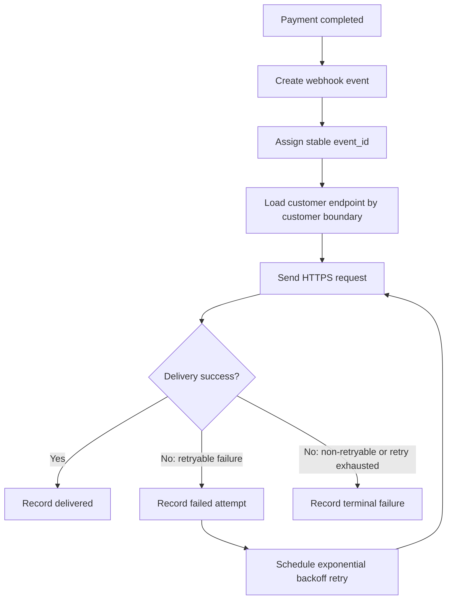

# 결제 완료 웹훅 전달 API PRD

## Applicability

| Contract | Required / N/A | Evidence |
|---|---|---|
| Pages/routes or screen IDs | N/A | 이번 범위에 UI 없음. endpoint 등록은 기존 내부 API가 담당 |
| Empty/loading/error/success/recovery state matrix | N/A | 사용자 노출 화면 없음 |
| Mermaid user or system flow | Required | 결제 완료부터 고객사 endpoint 전달, 실패 재시도까지의 시스템 lifecycle 존재 |

## Context and Problem

결제가 완료되면 등록된 고객사 HTTPS endpoint로 결제 완료 이벤트를 전달해야 한다. 네트워크 실패 가능성이 있으므로 전달은 최소 1회 보장되어야 하며, 고객사가 같은 이벤트를 여러 번 받을 수 있어 중복 처리를 식별할 수 있는 event ID가 필요하다.

보안 서명 방식과 secret rotation 정책은 아직 확정되지 않았으므로, 1차 구현은 해당 결정이 확정된 뒤 연결 가능한 구조를 갖추되 임의 정책을 만들지 않는다.

## Goals

- 결제 완료 이벤트를 고객사별 등록 HTTPS endpoint로 전달한다.
- 네트워크 실패 시 지수 백오프로 재시도한다.
- 최소 1회 전달을 보장한다.
- 모든 웹훅 payload에 안정적인 `event_id`를 포함한다.
- 고객사별 데이터 격리를 보장한다.
- 전달 성공, 실패, 재시도 상태를 시스템 내부에서 추적 가능하게 한다.

## Non-goals

- 고객사용 또는 운영자용 replay 대시보드
- 수동 재전송 기능
- UI 또는 화면 개발
- endpoint 등록 API 신규 개발
- 임의의 처리량, 지연 SLA 수치 정의
- 보안 서명 알고리즘 또는 secret rotation 주기 확정

## Users, Roles, and Permissions

- 결제 시스템: 결제 완료 사실을 발생시키는 내부 시스템
- 웹훅 전달 서비스: 결제 완료 이벤트를 생성, 저장, 전달, 재시도하는 내부 서비스
- 고객사 시스템: 등록된 HTTPS endpoint에서 이벤트를 수신하는 외부 시스템
- 내부 endpoint 등록 API: 고객사별 endpoint 정보를 관리하는 기존 내부 API

권한 원칙:
- 웹훅 전달 서비스는 이벤트의 고객사 소유권을 기준으로 해당 고객사의 endpoint에만 이벤트를 전달해야 한다.
- 다른 고객사의 결제 또는 endpoint 정보를 조회하거나 전달 대상으로 사용할 수 없어야 한다.

## Functional Requirements

| ID | Requirement | Priority |
|---|---|---|
| FR-001 | 결제 완료가 확정되면 고객사별 결제 완료 웹훅 이벤트를 생성한다. | Must |
| FR-002 | 각 이벤트에는 전역적으로 고유하고 재시도 간 변하지 않는 `event_id`를 부여한다. | Must |
| FR-003 | 웹훅 payload에는 고객사가 중복 수신을 식별할 수 있도록 `event_id`, 이벤트 유형, 결제 식별자, 고객사 식별자, 발생 시각을 포함한다. | Must |
| FR-004 | 등록된 고객사 HTTPS endpoint로 HTTP 요청을 전송한다. | Must |
| FR-005 | 성공 응답과 실패 응답을 구분해 전달 시도 결과를 기록한다. | Must |
| FR-006 | 네트워크 실패 또는 재시도 대상 HTTP 실패에는 지수 백오프로 재시도한다. | Must |
| FR-007 | 동일 이벤트 재시도 시 `event_id`와 이벤트 핵심 payload는 변경하지 않는다. | Must |
| FR-008 | 최소 1회 전달 모델을 명시적으로 지원하며, 고객사가 동일 이벤트를 여러 번 받을 수 있음을 API 계약에 반영한다. | Must |
| FR-009 | 고객사별 endpoint, secret, 결제 이벤트 데이터는 tenant/customer boundary를 넘어 조회, 혼합, 전달되지 않아야 한다. | Must |
| FR-010 | 서명 검증 방식과 secret rotation 주기가 확정되면 적용할 수 있도록 서명 관련 결정 지점을 구현 범위에서 분리해 둔다. | Should |
| FR-011 | 재시도 최대 기간, 최대 횟수, 재시도 대상 HTTP status 범위는 출시 전 확정해야 한다. | Must |
| FR-012 | replay 대시보드와 수동 재전송 기능은 1차 출시에서 제공하지 않는다. | Must |

## Pages and Routes

| Page or screen ID | Route, deep link, or explicit TBD + owner | Roles | Purpose |
|---|---|---|---|
| N/A | UI 없음 | N/A | 이번 범위 제외 |

## State Matrix

| Surface | Empty | Loading | Error | Success | Recovery |
|---|---|---|---|---|---|
| N/A | N/A | N/A | N/A | N/A | N/A |

## User or System Flow

## Authorization and Data Boundaries

- 모든 이벤트는 단일 고객사 소유로 생성되어야 한다.
- endpoint 조회는 이벤트의 고객사 식별자를 기준으로 제한해야 한다.
- 전달 worker는 한 고객사의 이벤트를 다른 고객사의 endpoint로 전송할 수 없어야 한다.
- 로그, 재시도 큐, 전달 이력에는 고객사 식별자가 포함되어야 하며 조회와 처리 시 tenant boundary를 강제해야 한다.
- 서명 secret이 도입되는 경우 고객사별로 분리 저장되어야 하며, 다른 고객사 이벤트 서명에 재사용되어서는 안 된다.

## Non-functional Requirements

- Delivery semantics: 최소 1회 전달. 정확히 한 번 전달은 보장하지 않는다.
- Retry: 네트워크 실패에는 지수 백오프를 사용한다.
- Idempotency support: 고객사는 `event_id` 기준으로 중복 수신을 처리할 수 있어야 한다.
- Security: 서명 방식과 secret rotation 주기는 보안 담당자 결정 후 확정한다.
- Observability: 이벤트 생성, 전달 시도, 성공, 실패, 재시도 예약, 최종 실패 상태는 내부 추적 가능해야 한다.
- Performance: 처리량과 지연 SLA는 현재 미측정 상태다. 1차 출시 전 측정 owner와 측정 시점을 정하되, 근거 없는 목표 수치는 정의하지 않는다.

## Acceptance Criteria

| ID | Requirement | Given | When | Then | Verification |
|---|---|---|---|---|---|
| AC-001 | FR-001 | 결제가 완료됨 | 결제 완료 이벤트가 수신됨 | 고객사 결제 완료 웹훅 이벤트가 생성됨 | 통합 테스트 |
| AC-002 | FR-002, FR-007 | 웹훅 이벤트가 생성됨 | 최초 전송 및 재시도가 수행됨 | 모든 시도에서 동일한 `event_id`가 사용됨 | 단위/통합 테스트 |
| AC-003 | FR-003 | 이벤트 payload가 생성됨 | 고객사 endpoint로 전송됨 | payload에 `event_id`, 이벤트 유형, 결제 식별자, 고객사 식별자, 발생 시각이 포함됨 | 계약 테스트 |
| AC-004 | FR-004, FR-005 | 고객사 HTTPS endpoint가 등록되어 있음 | 전달 요청이 수행됨 | HTTP 요청 결과가 성공 또는 실패로 기록됨 | 통합 테스트 |
| AC-005 | FR-006 | 네트워크 실패가 발생함 | 전달 시도가 실패함 | 지수 백오프에 따라 재시도가 예약됨 | 단위/통합 테스트 |
| AC-006 | FR-008 | 동일 이벤트가 재시도됨 | 고객사가 이벤트를 여러 번 수신함 | 각 수신 payload의 `event_id`가 같아 중복 식별 가능함 | 계약 테스트 |
| AC-007 | FR-009 | 고객사 A 이벤트가 생성됨 | endpoint를 조회하고 전달함 | 고객사 A의 endpoint만 사용되며 고객사 B 데이터는 접근되지 않음 | 권한/격리 테스트 |
| AC-008 | FR-011 | 재시도 정책이 필요한 상태 | 출시 전 설정 검토가 수행됨 | 최대 재시도 기간, 횟수, 재시도 대상 status가 확정되어 있음 | 출시 체크리스트 |
| AC-009 | FR-012 | 1차 출시 범위 확인 | 기능 검증을 수행함 | replay 대시보드와 수동 재전송 기능이 노출되지 않음 | 범위 검증 |

## Assumptions and Open Decisions

합리적 가정:
- 결제 완료 이벤트는 내부 결제 시스템에서 신뢰 가능한 방식으로 전달된다.
- 고객사 endpoint 등록과 조회는 기존 내부 API 또는 저장소를 통해 가능하다.
- 고객사 endpoint는 HTTPS URL이어야 한다.
- 고객사는 `event_id`를 이용해 idempotent 처리를 수행할 책임이 있다.
- 재시도 worker 또는 queue 기반 비동기 처리가 가능하다.

열린 결정:
- OD-001: 웹훅 서명 알고리즘과 헤더 형식
- OD-002: 고객사별 secret rotation 주기와 이전 secret 허용 기간
- OD-003: 재시도 최대 횟수와 최대 재시도 기간
- OD-004: 재시도 대상 HTTP status code 범위
- OD-005: terminal failure 이후 운영 대응 방식
- OD-006: 처리량과 지연 측정 방식, owner, 출시 기준
- OD-007: payload의 최종 schema와 versioning 방식

## Risks and Mitigations

| Risk | Impact | Mitigation |
|---|---|---|
| 서명 정책 미확정 | 보안 요구사항 누락 또는 재작업 가능 | 서명 관련 항목을 열린 결정으로 두고 출시 전 보안 담당자 승인 필요 |
| 최소 1회 전달로 인한 중복 수신 | 고객사 중복 처리 실패 가능 | 안정적인 `event_id` 제공 및 API 계약에 중복 가능성 명시 |
| 고객사 데이터 혼합 | 심각한 보안/신뢰 문제 | 이벤트, endpoint, 로그, retry job 모두 고객사 식별자 기준으로 격리 |
| 재시도 정책 미확정 | 실패 이벤트가 과도하게 누적되거나 너무 빨리 포기될 수 있음 | 출시 전 OD-003, OD-004 확정 |
| SLA 미측정 | 운영 기대치 불명확 | 근거 없는 수치 대신 측정 계획과 owner 확정 |

## Delivery

| Phase | Requirement IDs | Verifiable exit condition |
|---|---|---|
| Phase 1: Event contract | FR-001, FR-002, FR-003, FR-008 | 결제 완료 이벤트 schema와 `event_id` 중복 처리 계약이 테스트로 검증됨 |
| Phase 2: Delivery engine | FR-004, FR-005, FR-006, FR-007 | 성공, 실패, 네트워크 실패, 재시도 흐름이 통합 테스트로 검증됨 |
| Phase 3: Data boundary and security hooks | FR-009, FR-010 | 고객사별 endpoint/data 격리 테스트가 통과하고 서명 정책 적용 지점이 명확함 |
| Phase 4: Launch readiness | FR-011, FR-012 | 재시도 정책 열린 결정이 확정되고 replay/수동 재전송이 1차 범위에 없음을 검증함 |

검증 참고: 요청에 따라 파일을 만들지 않았으므로 PRD validator는 실행하지 않았습니다.