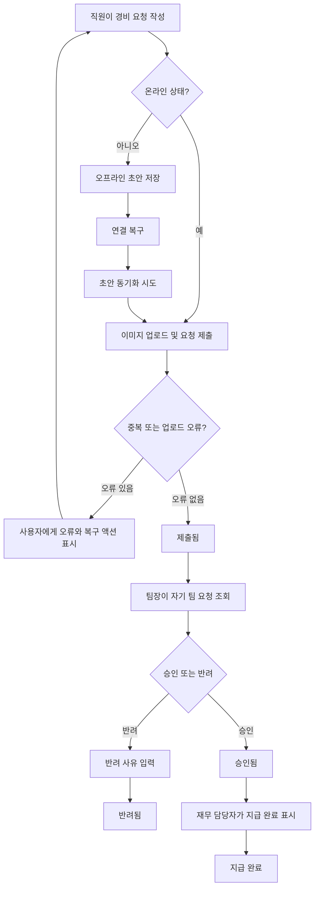

# 모바일 경비 승인 PRD

## Applicability

| Contract | Required / N/A | Evidence |
|---|---|---|
| Pages/routes or screen IDs | Required | 직원, 팀장, 재무 담당자가 모바일에서 제출·승인·지급 상태를 처리하는 사용자 화면이 필요함 |
| Empty/loading/error/success/recovery state matrix | Required | 오프라인 초안, 이미지 업로드 실패, 동기화 실패, 동시 수정 등 복구 가능한 상태가 명시됨 |
| Mermaid user or system flow | Required | 제출 → 팀장 승인/반려 → 재무 지급 완료의 다단계 생명주기가 있음 |

## Context and Problem

직원은 모바일에서 영수증 기반 경비 요청을 제출하고, 팀장은 자기 팀 요청을 승인 또는 반려하며, 재무 담당자는 승인된 요청을 지급 완료 처리해야 한다. 현재 브리프 기준으로 1차 출시는 모바일 경비 승인 핵심 흐름에 집중하며, 오프라인 초안 동기화와 중복·권한·동시 수정·업로드 실패 같은 운영 예외를 명시적으로 다룬다.

## Goals

- 직원이 모바일에서 영수증 사진, 금액, 카테고리를 포함한 경비 요청을 제출할 수 있다.
- 팀장이 자기 팀 소속 직원의 요청만 승인하거나 반려할 수 있다.
- 반려 시 팀장이 반려 사유를 필수 입력한다.
- 재무 담당자가 승인된 요청을 지급 완료로 표시할 수 있다.
- 오프라인에서 작성한 초안이 연결 복구 후 동기화된다.
- 중복 제출, 이미지 업로드 실패, 권한 변경, 승인 중 동시 수정 상태를 사용자에게 명확히 처리한다.
- WCAG 2.2 AA 접근성 기준을 목표로 설계·검증한다.

## Non-goals

- 1차 출시에서 다중 통화는 지원하지 않는다.
- 1차 출시에서 ERP 자동 연동은 지원하지 않는다.
- 성능 수치 목표는 이번 PRD에서 확정하지 않는다. 측정 후 별도 결정한다.
- 복잡한 경비 정책 엔진, 예산 한도 검증, 자동 OCR 금액 추출은 포함하지 않는다.
- 대량 지급 배치, 회계 전표 자동 생성은 포함하지 않는다.

## Users, Roles, and Permissions

| Role | Permissions |
|---|---|
| 직원 | 본인의 경비 요청 생성, 오프라인 초안 작성, 본인 요청 목록 및 상태 조회 |
| 팀장 | 자기 팀 직원의 요청 조회, 승인, 반려, 반려 사유 입력 |
| 재무 담당자 | 승인된 요청 조회, 지급 완료 표시 |
| 관리자 또는 권한 시스템 | 사용자 역할, 팀 소속, 권한 변경의 원천 데이터 제공 |

권한은 서버에서 최종 검증해야 한다. 모바일 UI에서 버튼을 숨기는 것은 권한 통제가 아니다.

## Functional Requirements

| ID | Requirement | Priority |
|---|---|---|
| FR-001 | 직원은 모바일에서 영수증 사진, 금액, 카테고리를 입력해 경비 요청을 제출할 수 있어야 한다. | Must |
| FR-002 | 경비 요청 제출 시 영수증 사진, 금액, 카테고리는 필수값이어야 한다. | Must |
| FR-003 | 직원은 연결이 없을 때 경비 요청을 초안으로 작성하고 기기에 저장할 수 있어야 한다. | Must |
| FR-004 | 오프라인 초안은 연결 복구 후 사용자의 명시적 또는 자동 동기화 트리거로 서버에 제출되어야 한다. | Must |
| FR-005 | 이미지 업로드 실패 시 요청은 제출 완료로 처리되지 않아야 하며, 사용자는 재시도하거나 초안으로 보존할 수 있어야 한다. | Must |
| FR-006 | 시스템은 동일 사용자의 중복 제출 가능성을 감지하고 중복 제출을 차단하거나 사용자 확인을 요구해야 한다. | Must |
| FR-007 | 팀장은 자기 팀 소속 직원의 경비 요청만 조회할 수 있어야 한다. | Must |
| FR-008 | 팀장은 자기 팀 요청 중 제출됨 상태의 요청을 승인할 수 있어야 한다. | Must |
| FR-009 | 팀장은 자기 팀 요청 중 제출됨 상태의 요청을 반려할 수 있어야 하며, 반려 사유는 필수 입력이어야 한다. | Must |
| FR-010 | 재무 담당자는 승인됨 상태의 요청만 지급 완료로 표시할 수 있어야 한다. | Must |
| FR-011 | 권한 또는 팀 소속이 변경된 사용자는 변경 이후 서버 검증 기준에 따라 접근·처리 가능 범위가 즉시 제한되어야 한다. | Must |
| FR-012 | 승인 또는 반려 처리 중 요청이 다른 사용자나 세션에서 수정·처리된 경우, 시스템은 충돌을 감지하고 최신 상태를 다시 보여줘야 한다. | Must |
| FR-013 | 경비 요청은 최소한 초안, 동기화 대기, 제출됨, 승인됨, 반려됨, 지급 완료, 동기화 실패 상태를 가져야 한다. | Must |
| FR-014 | 직원, 팀장, 재무 담당자는 자신에게 허용된 범위 내에서 요청의 현재 상태와 처리 이력을 볼 수 있어야 한다. | Should |
| FR-015 | 1차 출시의 금액 입력은 단일 기본 통화만 지원해야 한다. | Must |

## Pages and Routes

| Page or screen ID | Route, deep link, or explicit TBD + owner | Roles | Purpose |
|---|---|---|---|
| SCR-001 Expense List | TBD, Mobile App Owner | 직원, 팀장, 재무 담당자 | 역할별 경비 요청 목록과 상태 확인 |
| SCR-002 Expense Draft/Create | TBD, Mobile App Owner | 직원 | 영수증 사진, 금액, 카테고리 입력 및 제출 |
| SCR-003 Expense Detail | TBD, Mobile App Owner | 직원, 팀장, 재무 담당자 | 요청 상세, 이미지, 상태, 이력 확인 |
| SCR-004 Approval Action | TBD, Mobile App Owner | 팀장 | 승인 또는 반려 처리, 반려 사유 입력 |
| SCR-005 Finance Payment Action | TBD, Mobile App Owner | 재무 담당자 | 승인된 요청 지급 완료 처리 |
| SCR-006 Offline Drafts / Sync Queue | TBD, Mobile App Owner | 직원 | 오프라인 초안과 동기화 실패 항목 확인 및 재시도 |

## State Matrix

| Surface | Empty | Loading | Error | Success | Recovery |
|---|---|---|---|---|---|
| Expense List | 표시 가능한 요청 없음 | 목록 불러오는 중 | 목록 조회 실패 또는 권한 없음 | 역할별 요청 목록 표시 | 새로고침, 다시 로그인, 권한 변경 안내 |
| Expense Draft/Create | 입력 전 빈 양식 | 이미지 업로드 또는 제출 중 | 필수값 누락, 이미지 업로드 실패, 중복 의심 | 제출됨 또는 동기화 대기 표시 | 재시도, 초안 저장, 중복 확인 후 제출 |
| Expense Detail | 대상 요청 없음 | 상세 불러오는 중 | 요청 없음, 권한 없음, 최신 상태 충돌 | 상세와 처리 이력 표시 | 목록으로 이동, 최신 상태 다시 불러오기 |
| Approval Action | 처리 가능한 요청 없음 | 승인/반려 처리 중 | 권한 변경, 이미 처리됨, 반려 사유 누락 | 승인됨 또는 반려됨 표시 | 최신 상태 갱신 후 액션 재평가 |
| Finance Payment Action | 승인된 요청 없음 | 지급 완료 처리 중 | 권한 없음, 이미 변경됨 | 지급 완료 표시 | 최신 상태 갱신 |
| Offline Drafts / Sync Queue | 동기화 대기 항목 없음 | 동기화 중 | 네트워크 실패, 업로드 실패, 중복 감지 | 동기화 완료 | 항목별 재시도, 수정, 삭제 |

## User or System Flow

## Authorization and Data Boundaries

- 직원은 본인이 생성한 요청과 본인의 오프라인 초안만 접근할 수 있다.
- 팀장은 서버 기준 현재 팀 소속 직원의 요청만 접근하고 처리할 수 있다.
- 재무 담당자는 승인됨 상태의 요청을 지급 완료 처리할 수 있다.
- 모든 상태 변경 요청은 서버에서 사용자 역할, 팀 소속, 요청 상태, 요청 버전을 검증해야 한다.
- 승인·반려·지급 완료 API는 요청의 현재 버전 또는 갱신 토큰을 검증해 동시 수정 충돌을 감지해야 한다.
- 권한 변경 후 기존 화면에 남아 있는 사용자가 액션을 시도하면 서버는 거부하고 클라이언트는 최신 권한 상태를 반영해야 한다.
- 영수증 이미지는 해당 요청에 접근 권한이 있는 사용자에게만 표시되어야 한다.

## Non-functional Requirements

- 접근성: 모바일 화면과 주요 플로우는 WCAG 2.2 AA를 목표로 한다.
- 접근성 검증 범위: 키보드/스크린리더 탐색 가능성, 명도 대비, 폼 레이블, 오류 메시지 연결, 포커스 순서, 터치 타깃 크기를 포함한다.
- 성능: 구체적 응답 시간, 업로드 시간, 동기화 처리 시간 목표는 1차 측정 후 결정한다. 측정 책임자는 Product Owner와 Engineering Lead로 둔다.
- 보안: 권한 검증은 서버에서 수행하며, 영수증 이미지 접근 URL은 권한 없는 사용자에게 노출되지 않아야 한다.
- 신뢰성: 오프라인 초안은 앱 재시작 후에도 보존되어야 한다.

## Acceptance Criteria

| ID | Requirement | Given | When | Then | Verification |
|---|---|---|---|---|---|
| AC-001 | FR-001, FR-002 | 직원이 요청 작성 화면에 있음 | 영수증 사진, 금액, 카테고리를 입력하고 제출함 | 요청이 제출됨 상태로 생성됨 | 모바일 E2E 테스트 |
| AC-002 | FR-002 | 직원이 필수값 중 하나를 누락함 | 제출을 시도함 | 누락 필드가 표시되고 제출되지 않음 | UI 테스트 |
| AC-003 | FR-003 | 직원이 오프라인 상태임 | 요청 정보를 입력하고 저장함 | 요청이 로컬 초안으로 보존됨 | 오프라인 E2E 테스트 |
| AC-004 | FR-004 | 오프라인 초안이 있고 연결이 복구됨 | 동기화가 실행됨 | 서버 요청으로 제출되거나 실패 사유가 표시됨 | 통합 테스트 |
| AC-005 | FR-005 | 이미지 업로드가 실패함 | 직원이 제출을 시도함 | 요청은 제출 완료가 아니며 재시도 또는 초안 보존 액션이 표시됨 | 통합 테스트 |
| AC-006 | FR-006 | 동일 사용자, 유사 금액·카테고리·이미지의 최근 제출 후보가 있음 | 제출을 시도함 | 중복 의심 안내가 표시되거나 정책에 따라 차단됨 | API/UI 테스트 |
| AC-007 | FR-007 | 팀장이 다른 팀 직원의 요청에 접근함 | 목록 또는 상세를 요청함 | 서버가 접근을 거부함 | API 권한 테스트 |
| AC-008 | FR-008 | 팀장이 자기 팀의 제출됨 요청을 보고 있음 | 승인함 | 요청 상태가 승인됨으로 변경됨 | E2E 테스트 |
| AC-009 | FR-009 | 팀장이 반려 사유 없이 반려를 시도함 | 반려 버튼을 누름 | 반려되지 않고 사유 입력 오류가 표시됨 | UI 테스트 |
| AC-010 | FR-009 | 팀장이 반려 사유를 입력함 | 반려함 | 요청 상태가 반려됨이고 사유가 이력에 남음 | E2E/API 테스트 |
| AC-011 | FR-010 | 재무 담당자가 승인됨 요청을 보고 있음 | 지급 완료 처리함 | 요청 상태가 지급 완료로 변경됨 | E2E 테스트 |
| AC-012 | FR-011 | 팀장의 팀 소속 권한이 변경됨 | 기존에 열어둔 요청을 승인하려 함 | 서버가 거부하고 클라이언트가 권한 변경 안내를 표시함 | API/E2E 테스트 |
| AC-013 | FR-012 | 팀장이 요청 상세를 열어둔 사이 다른 사용자가 상태를 변경함 | 팀장이 승인 또는 반려를 시도함 | 충돌이 감지되고 최신 상태를 다시 불러오도록 안내됨 | 동시성 통합 테스트 |
| AC-014 | FR-013, FR-014 | 사용자가 요청 상세를 조회함 | 상태와 이력을 확인함 | 현재 상태와 처리 이력이 권한 범위 내에서 표시됨 | UI/API 테스트 |
| AC-015 | FR-015 | 사용자가 금액을 입력함 | 통화 선택을 찾음 | 단일 기본 통화만 표시되고 다중 통화 입력은 제공되지 않음 | UI 테스트 |
| AC-016 | NFR 접근성 | 주요 모바일 화면이 구현됨 | 접근성 검사를 수행함 | WCAG 2.2 AA 목표 항목의 위반이 없거나 예외가 기록됨 | 자동 검사 + 수동 점검 |

## Assumptions and Open Decisions

### 합리적 가정

- 기본 통화는 회사의 단일 운영 통화로 고정한다.
- 직원의 팀 소속과 팀장 권한은 기존 인사 또는 권한 시스템에서 제공된다.
- “자기 팀”은 요청 제출 시점이 아니라 처리 시점의 서버 기준 팀 소속으로 판단한다.
- 중복 제출 감지는 1차 출시에서 완전 자동 병합이 아니라 차단 또는 확인 UX 수준으로 제공한다.
- 오프라인에서는 신규 초안 작성만 지원하고, 이미 제출된 요청의 승인·반려·지급 처리는 온라인에서만 허용한다.
- 직원은 제출 후 요청을 수정할 수 없거나, 수정이 필요하면 별도 재제출 흐름을 사용한다.

### 열린 결정

- OD-001: 기본 통화를 무엇으로 설정할지 결정 필요. Owner: Product Owner.
- OD-002: 중복 제출 판정 기준이 필요하다. 예: 동일 사용자, 동일 금액, 동일 카테고리, 유사 이미지, 특정 시간 범위. Owner: Product Owner + Engineering Lead.
- OD-003: 연결 복구 시 자동 동기화와 사용자 수동 동기화 중 기본 동작을 결정해야 한다. Owner: Product Owner.
- OD-004: 반려 사유의 최소 길이, 허용 문자, 템플릿 제공 여부를 결정해야 한다. Owner: Product Owner.
- OD-005: 지급 완료 처리 시 지급일, 메모, 지급 수단 입력이 필요한지 결정해야 한다. Owner: Finance Owner.
- OD-006: 성능 목표 수치와 측정 기준을 실제 측정 후 확정해야 한다. Owner: Engineering Lead.
- OD-007: 직원이 제출 후 철회하거나 재제출할 수 있는지 결정해야 한다. Owner: Product Owner.

## Risks and Mitigations

| Risk | Impact | Mitigation |
|---|---|---|
| 오프라인 초안과 서버 제출 간 중복 발생 | 중복 지급 또는 중복 승인 가능 | 클라이언트 임시 ID와 서버 중복 감지 기준 적용 |
| 이미지 업로드 성공 여부와 요청 생성 상태 불일치 | 영수증 없는 요청 또는 유실 발생 | 이미지 업로드와 요청 생성 상태를 명확히 분리하고 실패 시 제출 완료 금지 |
| 권한 변경 지연 반영 | 퇴사·이동 사용자의 부적절한 접근 | 모든 API에서 서버 권한 재검증 |
| 동시 승인·반려 처리 | 잘못된 최종 상태 발생 | 요청 버전 검증과 충돌 응답 도입 |
| WCAG 2.2 AA 해석 범위 불명확 | 출시 직전 접근성 결함 발견 | 초기 디자인 단계부터 접근성 체크리스트와 자동 검사를 포함 |
| 성능 목표 미확정 | 출시 기준 모호 | 베타 또는 내부 테스트에서 기준 수집 후 별도 NFR 업데이트 |

## Delivery

| Phase | Requirement IDs | Verifiable exit condition |
|---|---|---|
| Phase 1: Core Submission | FR-001, FR-002, FR-013, FR-015 | 직원이 필수값 포함 요청을 제출하고 단일 통화 상태로 저장할 수 있음 |
| Phase 2: Offline and Upload Recovery | FR-003, FR-004, FR-005, FR-006 | 오프라인 초안, 동기화, 업로드 실패, 중복 의심 처리가 검증됨 |
| Phase 3: Approval Workflow | FR-007, FR-008, FR-009, FR-011, FR-012 | 팀장 권한 범위, 승인, 반려 사유, 권한 변경, 동시 수정 충돌이 검증됨 |
| Phase 4: Finance Completion | FR-010, FR-014 | 재무 담당자가 승인된 요청만 지급 완료 처리하고 이력을 확인할 수 있음 |
| Phase 5: Accessibility and Release Readiness | NFR 접근성, 전체 AC | WCAG 2.2 AA 목표 점검과 주요 수용 기준 테스트가 완료됨 |

검증기 실행: 사용자가 “파일을 만들거나 저장소를 탐색하지 말라”고 요청했기 때문에 PRD 파일 저장 및 validator 실행은 하지 않았습니다.