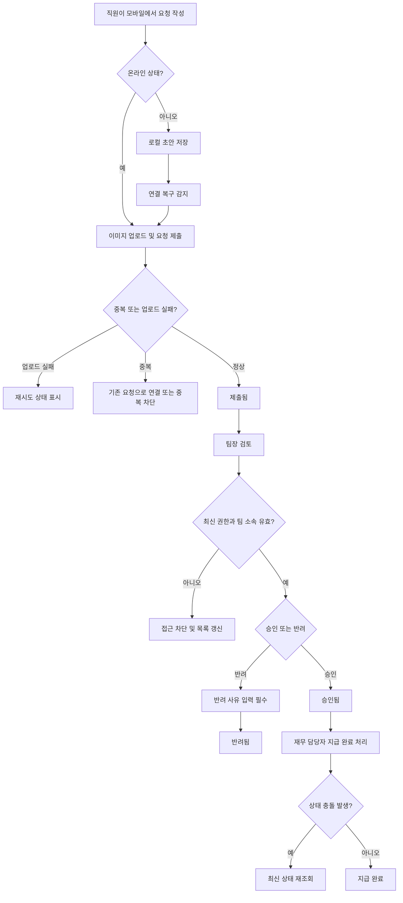

# 모바일 경비 승인 PRD

## Applicability

| Contract | Required / N/A | Evidence |
|---|---:|---|
| Pages/routes or screen IDs | Required | 직원, 팀장, 재무 담당자가 사용하는 모바일 사용자 화면이 필요함 |
| Empty/loading/error/success/recovery state matrix | Required | 오프라인 초안, 업로드 실패, 권한 변경, 동시 수정 등 사용자 가시 상태가 있음 |
| Mermaid user or system flow | Required | 제출 → 승인/반려 → 지급 완료의 다단계 생명주기가 있음 |

## Context and Problem

직원은 모바일에서 경비 영수증과 필수 정보를 제출하고, 팀장은 자기 팀의 요청만 검토하며, 재무 담당자는 승인된 요청을 지급 완료 처리해야 한다. 모바일 환경에서는 네트워크 단절, 이미지 업로드 실패, 중복 제출, 권한 변경, 동시 수정이 발생할 수 있으므로 상태 충돌과 복구 흐름을 명확히 정의해야 한다.

## Goals

- 직원이 모바일에서 영수증 사진, 금액, 카테고리를 입력해 경비 요청을 제출할 수 있다.
- 팀장이 자기 팀 소속 직원의 요청만 승인 또는 반려할 수 있다.
- 팀장은 반려 시 사유를 필수 입력한다.
- 재무 담당자가 승인된 요청을 지급 완료로 표시할 수 있다.
- 오프라인 작성 초안은 연결 복구 후 동기화된다.
- 중복 제출, 이미지 업로드 실패, 권한 변경, 승인 중 동시 수정 상태를 사용자에게 명확히 처리한다.
- 접근성 목표는 WCAG 2.2 AA로 한다.

## Non-goals

- 1차 출시에서는 다중 통화를 지원하지 않는다.
- 1차 출시에서는 ERP 자동 연동을 제공하지 않는다.
- 성능 수치 목표는 이번 PRD에서 확정하지 않는다. 측정 후 별도 결정한다.
- 경비 정책 자동 판정, 예산 한도 검증, 세금 계산 자동화는 범위에 포함하지 않는다.

## Users, Roles, and Permissions

| Role | Permissions |
|---|---|
| 직원 | 본인의 경비 요청 생성, 오프라인 초안 작성, 본인 요청 상태 조회 |
| 팀장 | 자기 팀 직원의 제출 요청 조회, 승인, 반려, 반려 사유 입력 |
| 재무 담당자 | 승인된 요청 조회, 지급 완료 표시 |
| 관리자 또는 권한 시스템 | 사용자 역할, 팀 소속, 권한 변경 관리. 실제 관리 화면은 1차 범위 밖 |

## Functional Requirements

| ID | Requirement | Priority |
|---|---|---:|
| FR-001 | 직원은 모바일에서 영수증 사진, 금액, 카테고리를 입력해 경비 요청을 제출할 수 있어야 한다. | P0 |
| FR-002 | 금액과 카테고리는 제출 전 필수 입력으로 검증되어야 한다. | P0 |
| FR-003 | 영수증 사진 업로드 실패 시 요청은 제출 완료로 처리되지 않아야 하며, 사용자는 재시도할 수 있어야 한다. | P0 |
| FR-004 | 직원은 오프라인 상태에서 경비 초안을 작성하고 로컬에 저장할 수 있어야 한다. | P0 |
| FR-005 | 오프라인 초안은 연결 복구 시 서버와 동기화되어야 하며, 성공/실패 상태가 사용자에게 표시되어야 한다. | P0 |
| FR-006 | 동일 사용자가 동일 영수증 또는 동일 제출 토큰으로 중복 제출하는 경우 서버는 중복 요청을 생성하지 않아야 한다. | P0 |
| FR-007 | 팀장은 자기 팀 소속 직원의 요청만 조회, 승인, 반려할 수 있어야 한다. | P0 |
| FR-008 | 팀장이 요청을 반려할 때 반려 사유 입력은 필수여야 한다. | P0 |
| FR-009 | 재무 담당자는 승인 상태의 요청만 지급 완료로 표시할 수 있어야 한다. | P0 |
| FR-010 | 권한 또는 팀 소속이 변경된 사용자는 다음 요청부터 최신 권한 기준으로 접근이 제한되어야 한다. | P0 |
| FR-011 | 승인 또는 반려 중 다른 사용자가 같은 요청을 수정하거나 상태 변경한 경우 충돌 상태를 표시하고 최신 상태를 다시 불러와야 한다. | P0 |
| FR-012 | 각 요청은 최소한 `초안`, `동기화 대기`, `제출됨`, `승인됨`, `반려됨`, `지급 완료`, `동기화 실패`, `업로드 실패` 상태를 가져야 한다. | P0 |
| FR-013 | 사용자는 본인에게 허용된 요청 목록과 상세 상태를 모바일에서 조회할 수 있어야 한다. | P1 |
| FR-014 | 모든 주요 입력, 오류, 상태 변경 UI는 WCAG 2.2 AA 목표에 맞춰 구현되어야 한다. | P0 |

## Pages and Routes

| Page or screen ID | Route, deep link, or explicit TBD + owner | Roles | Purpose |
|---|---|---|---|
| SCR-001 Expense List | TBD, 모바일 앱 라우팅 담당자 | 직원, 팀장, 재무 담당자 | 권한에 맞는 요청 목록과 상태 조회 |
| SCR-002 Expense Create/Edit Draft | TBD, 모바일 앱 라우팅 담당자 | 직원 | 영수증 사진, 금액, 카테고리 입력 및 오프라인 초안 작성 |
| SCR-003 Expense Detail | TBD, 모바일 앱 라우팅 담당자 | 직원, 팀장, 재무 담당자 | 요청 상세, 이미지, 상태, 이력 확인 |
| SCR-004 Manager Review | TBD, 모바일 앱 라우팅 담당자 | 팀장 | 승인 또는 반려 처리, 반려 사유 입력 |
| SCR-005 Finance Payment | TBD, 모바일 앱 라우팅 담당자 | 재무 담당자 | 승인된 요청을 지급 완료 처리 |
| SCR-006 Sync and Upload Recovery | TBD, 모바일 앱 라우팅 담당자 | 직원 | 오프라인 동기화 실패, 이미지 업로드 실패 재시도 |

## State Matrix

| Surface | Empty | Loading | Error | Success | Recovery |
|---|---|---|---|---|---|
| 요청 목록 | 표시 가능한 요청 없음 | 목록 불러오는 중 | 권한 없음, 네트워크 실패 | 요청 목록 표시 | 새로고침, 재로그인 유도 |
| 요청 작성 | 입력 전 빈 폼 | 이미지 업로드 또는 제출 중 | 필수값 누락, 업로드 실패, 중복 제출 | 제출 완료 또는 초안 저장 | 업로드 재시도, 초안 유지 |
| 오프라인 초안 | 저장된 초안 없음 | 동기화 중 | 동기화 실패 | 서버 제출 완료 | 연결 복구 후 재동기화 |
| 팀장 검토 | 검토할 요청 없음 | 상태 변경 중 | 권한 변경, 충돌, 서버 오류 | 승인 또는 반려 완료 | 최신 상태 다시 불러오기 |
| 재무 지급 처리 | 지급할 승인 요청 없음 | 지급 완료 처리 중 | 승인 상태 아님, 권한 없음, 충돌 | 지급 완료 | 최신 상태 다시 불러오기 |

## User or System Flow

## Authorization and Data Boundaries

- 서버는 모든 조회와 상태 변경 요청에서 사용자 역할과 팀 소속을 검증해야 한다.
- UI에서 버튼을 숨기는 것은 권한 통제로 간주하지 않는다.
- 팀장은 요청자의 현재 팀 소속이 본인 관리 범위에 포함될 때만 해당 요청을 검토할 수 있다.
- 재무 담당자는 승인된 요청만 지급 완료로 변경할 수 있다.
- 직원은 본인의 요청만 조회할 수 있다.
- 권한 또는 팀 소속 변경이 발생하면 이후 API 요청은 최신 권한 기준으로 처리되어야 한다.
- 상태 변경 API는 낙관적 잠금 또는 버전 검증을 통해 동시 수정 충돌을 감지해야 한다.
- 이미지 파일 접근은 해당 요청을 볼 권한이 있는 사용자에게만 허용되어야 한다.

## Non-functional Requirements

- 접근성: WCAG 2.2 AA를 목표로 한다.
- 성능: 목록 로딩 시간, 이미지 업로드 시간, 동기화 완료 시간은 계측 항목으로 정의하되 목표 수치는 실제 측정 후 결정한다.
- 신뢰성: 오프라인 초안은 앱 재시작 후에도 유지되어야 한다.
- 보안: 경비 요청, 영수증 이미지, 반려 사유는 권한이 있는 사용자에게만 노출되어야 한다.
- 감사 가능성: 승인, 반려, 지급 완료 상태 변경은 수행자, 시각, 이전 상태, 변경 후 상태를 기록해야 한다.

## Acceptance Criteria

| ID | Requirement | Given | When | Then | Verification |
|---|---|---|---|---|---|
| AC-001 | FR-001, FR-002 | 직원이 작성 화면에 있음 | 영수증 사진, 금액, 카테고리를 입력하고 제출함 | 요청이 `제출됨` 상태로 생성됨 | 모바일 E2E 테스트 |
| AC-002 | FR-002 | 직원이 금액 또는 카테고리를 비워둠 | 제출을 시도함 | 제출이 차단되고 필수 입력 오류가 표시됨 | 폼 검증 테스트 |
| AC-003 | FR-003 | 이미지 업로드가 실패함 | 직원이 제출함 | 요청은 제출 완료되지 않고 재시도 UI가 표시됨 | 업로드 실패 모킹 테스트 |
| AC-004 | FR-004, FR-005 | 직원이 오프라인 상태임 | 요청을 작성함 | 로컬 초안으로 저장되고 연결 복구 후 동기화됨 | 오프라인 E2E 테스트 |
| AC-005 | FR-006 | 동일 제출 토큰 요청이 이미 존재함 | 같은 요청이 다시 제출됨 | 새 요청이 생성되지 않고 기존 요청 상태가 반환됨 | API 중복 제출 테스트 |
| AC-006 | FR-007 | 팀장이 타 팀 직원 요청에 접근함 | 목록 조회 또는 상세 조회를 요청함 | 서버가 접근을 거부함 | 권한 API 테스트 |
| AC-007 | FR-008 | 팀장이 반려를 선택함 | 반려 사유 없이 저장함 | 저장이 차단되고 사유 입력 오류가 표시됨 | 모바일 E2E 테스트 |
| AC-008 | FR-009 | 재무 담당자가 승인된 요청을 보고 있음 | 지급 완료를 선택함 | 요청 상태가 `지급 완료`로 변경됨 | API 및 E2E 테스트 |
| AC-009 | FR-009 | 재무 담당자가 승인되지 않은 요청을 처리함 | 지급 완료를 요청함 | 서버가 상태 변경을 거부함 | 상태 전이 API 테스트 |
| AC-010 | FR-010 | 팀장의 권한 또는 팀 소속이 변경됨 | 기존에 보던 요청을 승인하려 함 | 서버가 최신 권한 기준으로 거부하고 화면은 목록을 갱신함 | 권한 변경 시나리오 테스트 |
| AC-011 | FR-011 | 팀장이 요청 상세를 열어둔 사이 요청 상태가 변경됨 | 팀장이 승인 또는 반려를 시도함 | 충돌 메시지가 표시되고 최신 상태를 다시 불러옴 | 동시 수정 API 테스트 |
| AC-012 | FR-014 | 사용자가 주요 화면을 이용함 | 스크린리더, 키보드 탐색, 명도 대비 검사를 수행함 | WCAG 2.2 AA 목표 위반이 출시 차단 항목으로 기록됨 | 접근성 점검 |

## Assumptions and Open Decisions

### 합리적 가정

- 1차 출시는 단일 통화만 지원하며, 통화는 조직 기본 통화로 고정한다.
- 직원은 제출 후 직접 수정할 수 없고, 수정이 필요하면 새 요청을 제출하거나 반려 후 재제출하는 방식으로 처리한다.
- 중복 제출 방지는 클라이언트 제출 토큰과 서버의 멱등성 처리로 구현한다.
- 영수증 이미지는 모바일 기기 카메라 또는 사진 라이브러리에서 첨부할 수 있다.
- 오프라인 상태에서의 초안은 서버 승인 흐름에 들어가지 않으며, 동기화 성공 후에만 제출 요청이 된다.
- 재무 담당자의 지급 완료 표시는 실제 송금 실행이 아니라 내부 상태 변경이다.

### 열린 결정

| Decision | Owner | Needed by | Impact |
|---|---|---|---|
| 단일 통화의 기본 통화 값 | 제품/재무 | 개발 시작 전 | 금액 표시, 검증, 문구 |
| 경비 카테고리 목록과 관리 주체 | 제품/재무 | 개발 시작 전 | 작성 폼, 필터, 검증 |
| 영수증 이미지 허용 형식과 최대 용량 | 제품/엔지니어링 | 업로드 구현 전 | 업로드 UX, 저장소 비용, 오류 처리 |
| 성능 목표 수치 | 제품/엔지니어링 | 베타 측정 후 | 출시 기준, 최적화 범위 |
| 반려 후 재제출을 기존 요청 업데이트로 볼지 새 요청으로 볼지 | 제품 | 상세 설계 전 | 이력, 중복 처리, 목록 표시 |
| 팀 소속 변경 시 이미 제출된 요청의 승인권자를 제출 시점 기준으로 할지 현재 기준으로 할지 | 제품/보안 | 권한 설계 전 | 권한 검증, 감사 정책 |

## Risks and Mitigations

| Risk | Impact | Mitigation |
|---|---|---|
| 오프라인 초안과 서버 상태 간 불일치 | 중복 제출 또는 사용자 혼란 | 제출 토큰, 동기화 상태 표시, 실패 재시도 제공 |
| 이미지 업로드 실패 | 요청 누락 또는 불완전 제출 | 업로드 성공 후에만 제출 완료 처리 |
| 권한 변경 타이밍 문제 | 잘못된 승인 또는 정보 노출 | 모든 API에서 최신 권한 서버 검증 |
| 승인 중 동시 수정 | 잘못된 상태 전이 | 요청 버전 검증과 충돌 복구 UI |
| 접근성 목표 미달 | 출시 품질 저하 | 주요 플로우에 WCAG 2.2 AA 점검을 출시 체크에 포함 |
| 성능 목표 미확정 | 출시 판단 기준 불명확 | 계측 우선 적용 후 베타 데이터로 목표 확정 |

## Delivery

| Phase | Requirement IDs | Verifiable exit condition |
|---|---|---|
| Phase 1: Core Submission | FR-001, FR-002, FR-003, FR-006, FR-012, FR-013 | 직원이 온라인에서 요청 제출, 업로드 실패, 중복 제출을 테스트로 검증 |
| Phase 2: Offline Draft Sync | FR-004, FR-005 | 오프라인 작성 후 연결 복구 시 동기화 성공/실패/재시도 플로우 검증 |
| Phase 3: Approval Workflow | FR-007, FR-008, FR-010, FR-011 | 팀장 권한, 반려 사유, 권한 변경, 동시 수정 충돌 검증 |
| Phase 4: Finance Completion | FR-009 | 재무 담당자가 승인된 요청만 지급 완료 처리 가능함을 검증 |
| Phase 5: Release Quality | FR-014 | 주요 화면 접근성 점검 완료, 성능 계측 항목 적용 |

검증기 실행: 파일을 만들지 말라는 요청에 따라 PRD 파일 저장 및 validator 실행은 하지 않았습니다.