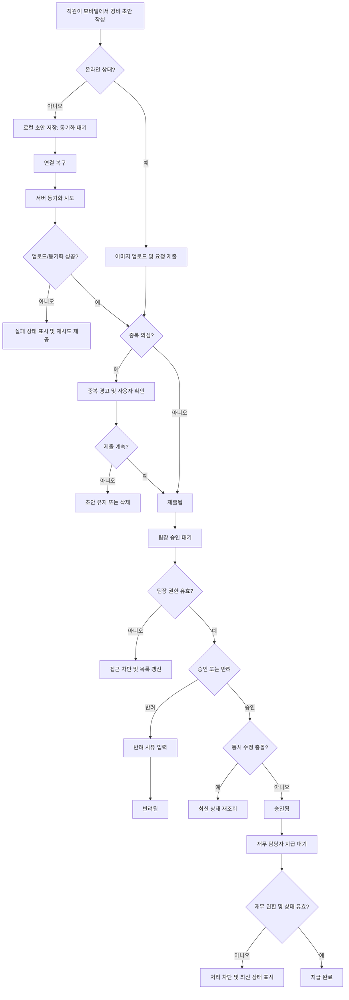

# 모바일 경비 승인 PRD

## Applicability

| Contract | Required / N/A | Evidence |
|---|---|---|
| Pages/routes or screen IDs | Required | 직원, 팀장, 재무 담당자가 모바일에서 서로 다른 화면으로 제출·승인·지급 처리 |
| Empty/loading/error/success/recovery state matrix | Required | 오프라인 초안, 이미지 업로드 실패, 중복 제출, 권한 변경, 동시 수정 등 사용자 노출 상태 필요 |
| Mermaid user or system flow | Required | 제출부터 승인, 반려, 지급 완료까지 다단계 생명주기 존재 |

## Context and Problem

직원은 모바일에서 영수증 기반 경비를 제출하고, 팀장은 자기 팀의 요청만 승인 또는 반려하며, 재무 담당자는 승인된 요청을 지급 완료 처리해야 한다. 모바일 환경 특성상 네트워크 단절, 이미지 업로드 실패, 중복 제출, 권한 변경, 승인 중 데이터 변경 같은 예외 상황을 명확히 처리해야 한다.

## Goals

- 직원이 모바일에서 영수증 사진, 금액, 카테고리를 입력해 경비 요청을 제출할 수 있다.
- 직원은 오프라인에서도 초안을 작성할 수 있고, 연결 복구 시 동기화할 수 있다.
- 팀장은 자기 팀 소속 직원의 요청만 승인 또는 반려할 수 있다.
- 반려 시 팀장은 반려 사유를 필수 입력한다.
- 재무 담당자는 팀장 승인 완료 요청만 지급 완료로 표시할 수 있다.
- 중복 제출, 이미지 업로드 실패, 권한 변경, 동시 수정 충돌을 사용자에게 명확히 안내하고 복구 경로를 제공한다.
- 접근성은 WCAG 2.2 AA 달성을 목표로 한다.

## Non-goals

- 1차 출시에서는 다중 통화를 지원하지 않는다.
- 1차 출시에서는 ERP 자동 연동을 지원하지 않는다.
- 법인카드 자동 매칭, 세금계산서 처리, 정산 회계 전표 생성은 범위 밖이다.
- 승인 단계 다중화, 위임 승인, 금액별 승인 라우팅은 범위 밖이다.
- 성능 수치 목표는 1차 출시 전 측정 후 별도 결정한다.

## Users, Roles, and Permissions

| Role | Description | Permissions |
|---|---|---|
| 직원 | 경비를 제출하는 사용자 | 본인 초안 작성, 본인 요청 제출, 본인 요청 상태 조회 |
| 팀장 | 팀원의 경비 요청을 검토하는 사용자 | 자기 팀 요청 목록 조회, 승인, 반려, 반려 사유 입력 |
| 재무 담당자 | 승인된 경비 지급 상태를 관리하는 사용자 | 승인 완료 요청 조회, 지급 완료 표시 |
| 관리자 또는 권한 시스템 | 사용자 역할과 팀 소속을 관리하는 외부 또는 내부 주체 | 권한·팀 소속 변경. 단, 본 기능 내 상세 관리 화면은 범위 밖 |

## Functional Requirements

| ID | Requirement | Priority |
|---|---|---|
| FR-001 | 직원은 모바일에서 영수증 사진, 금액, 카테고리를 포함한 경비 요청 초안을 작성할 수 있어야 한다. | Must |
| FR-002 | 직원은 필수 입력값이 유효할 때 경비 요청을 제출할 수 있어야 한다. | Must |
| FR-003 | 직원은 오프라인 상태에서도 초안을 저장할 수 있어야 한다. | Must |
| FR-004 | 오프라인 초안은 연결 복구 후 사용자의 확인 또는 자동 재시도 정책에 따라 서버와 동기화되어야 한다. | Must |
| FR-005 | 이미지 업로드 실패 시 요청 제출을 완료 처리하지 않고, 실패 원인과 재시도 경로를 제공해야 한다. | Must |
| FR-006 | 시스템은 동일 영수증 또는 동일 제출 의심 건에 대해 중복 가능성을 감지하고 사용자에게 안내해야 한다. | Must |
| FR-007 | 팀장은 자기 팀 구성원이 제출한 요청만 조회할 수 있어야 한다. | Must |
| FR-008 | 팀장은 자기 팀의 대기 중 요청을 승인할 수 있어야 한다. | Must |
| FR-009 | 팀장은 자기 팀의 대기 중 요청을 반려할 수 있으며, 반려 사유는 필수여야 한다. | Must |
| FR-010 | 재무 담당자는 팀장 승인 완료 상태의 요청만 지급 완료로 표시할 수 있어야 한다. | Must |
| FR-011 | 요청 상태는 최소 `초안`, `동기화 대기`, `제출 대기`, `제출됨`, `승인됨`, `반려됨`, `지급 완료`, `업로드 실패`, `동기화 실패`를 표현할 수 있어야 한다. | Must |
| FR-012 | 승인 또는 지급 처리 시점에 요청이 다른 사용자 또는 동기화에 의해 변경된 경우, 시스템은 동시 수정 충돌을 감지하고 최신 상태를 다시 표시해야 한다. | Must |
| FR-013 | 사용자의 역할 또는 팀 소속이 변경된 경우, 이후 조회·승인·지급 권한은 최신 권한 기준으로 평가되어야 한다. | Must |
| FR-014 | 직원은 본인이 제출한 요청의 현재 상태와 반려 사유를 확인할 수 있어야 한다. | Must |
| FR-015 | 모든 승인, 반려, 지급 완료 이벤트는 처리자, 처리 시각, 이전 상태, 변경 후 상태를 기록해야 한다. | Must |
| FR-016 | 금액은 1차 출시에서 단일 기준 통화로만 입력·표시되어야 한다. | Must |
| FR-017 | ERP 자동 전송 또는 자동 지급 연동 없이 앱 내부 상태 변경까지만 제공해야 한다. | Must |
| FR-018 | 주요 화면과 입력 컴포넌트는 WCAG 2.2 AA 목표에 맞춰 키보드 접근, 스크린리더 라벨, 명도 대비, 오류 안내를 제공해야 한다. | Should |

## Pages and Routes

| Page or screen ID | Route, deep link, or explicit TBD + owner | Roles | Purpose |
|---|---|---|---|
| SCR-001 Expense Draft Editor | TBD, Mobile App Owner | 직원 | 영수증 사진, 금액, 카테고리 입력 및 초안 저장 |
| SCR-002 My Expense Requests | TBD, Mobile App Owner | 직원 | 본인 요청 목록, 상태, 반려 사유 확인 |
| SCR-003 Team Approval Queue | TBD, Mobile App Owner | 팀장 | 자기 팀 제출 건 조회 |
| SCR-004 Approval Detail | TBD, Mobile App Owner | 팀장 | 요청 상세 확인, 승인, 반려 사유 입력 |
| SCR-005 Finance Payment Queue | TBD, Mobile App Owner | 재무 담당자 | 승인된 요청 목록 조회 |
| SCR-006 Payment Detail | TBD, Mobile App Owner | 재무 담당자 | 승인된 요청을 지급 완료 처리 |
| SCR-007 Sync Status Surface | TBD, Mobile App Owner | 직원 | 오프라인 초안, 동기화 대기, 동기화 실패 복구 |

## State Matrix

| Surface | Empty | Loading | Error | Success | Recovery |
|---|---|---|---|---|---|
| Expense Draft Editor | 입력값 없음, 사진 추가 CTA 표시 | 이미지 압축 또는 업로드 준비 중 | 필수값 누락, 지원하지 않는 이미지, 업로드 실패 | 초안 저장 또는 제출 완료 | 이미지 재선택, 업로드 재시도, 초안 유지 |
| My Expense Requests | 제출 내역 없음 | 목록 로딩 | 목록 조회 실패 | 상태별 요청 목록 표시 | 새로고침, 네트워크 복구 후 재시도 |
| Team Approval Queue | 승인 대기 요청 없음 | 팀 요청 로딩 | 권한 없음, 팀 정보 변경, 조회 실패 | 자기 팀 요청 목록 표시 | 권한 재확인, 목록 새로고침 |
| Approval Detail | 해당 요청 없음 또는 접근 불가 | 상세 로딩, 승인 처리 중 | 반려 사유 누락, 권한 변경, 동시 수정 충돌 | 승인 또는 반려 완료 | 최신 요청 다시 불러오기, 반려 사유 보완 |
| Finance Payment Queue | 지급 대기 요청 없음 | 승인 요청 로딩 | 권한 없음, 조회 실패 | 승인된 요청 목록 표시 | 새로고침, 권한 재확인 |
| Payment Detail | 해당 요청 없음 또는 접근 불가 | 지급 완료 처리 중 | 이미 변경된 상태, 권한 변경, 처리 실패 | 지급 완료 표시 | 최신 상태 다시 불러오기 |
| Sync Status Surface | 동기화 대기 초안 없음 | 동기화 진행 중 | 동기화 실패, 중복 의심, 업로드 실패 | 동기화 완료 | 재시도, 초안 수정, 중복 건 확인 후 제출 취소 또는 계속 |

## User or System Flow

## Authorization and Data Boundaries

- 서버는 모든 조회와 상태 변경 요청마다 현재 사용자 역할, 팀 소속, 요청 소유자, 요청 상태를 검증해야 한다.
- 직원은 본인 요청만 조회할 수 있다.
- 팀장은 현재 기준 자기 팀 소속 직원의 요청만 조회·승인·반려할 수 있다.
- 재무 담당자는 `승인됨` 상태 요청만 지급 완료 처리할 수 있다.
- 클라이언트 UI에서 버튼을 숨기는 것은 보조 수단이며, 권한 보장은 서버 검증으로 처리한다.
- 오프라인 초안은 해당 기기의 사용자 계정 범위에 격리되어야 하며, 로그아웃 또는 계정 전환 시 다른 사용자에게 노출되면 안 된다.
- 영수증 이미지는 요청 데이터와 연결되어야 하며, 업로드가 완료되지 않은 요청은 제출 완료 상태가 될 수 없다.
- 승인, 반려, 지급 완료는 상태 전이를 서버에서 원자적으로 처리해야 한다.
- 동시 수정 감지는 버전 번호, updated_at, ETag 등 하나의 일관된 충돌 감지 기준을 사용해야 한다.

## Non-functional Requirements

- 접근성: WCAG 2.2 AA를 목표로 한다.
- 성능: 목록 로딩 시간, 이미지 업로드 시간, 동기화 완료 시간, 승인/지급 처리 응답 시간은 측정 항목으로 정의하되 목표 수치는 베타 또는 내부 측정 후 결정한다.
- 신뢰성: 오프라인 초안은 앱 재시작 후에도 유지되어야 한다.
- 보안: 영수증 이미지와 경비 요청 데이터는 인증된 사용자에게만 접근 가능해야 한다.
- 감사성: 승인, 반려, 지급 완료 이벤트는 추적 가능해야 한다.

## Acceptance Criteria

| ID | Requirement | Given | When | Then | Verification |
|---|---|---|---|---|---|
| AC-001 | FR-001, FR-002 | 직원이 모바일 앱에 로그인함 | 영수증 사진, 금액, 카테고리를 입력하고 제출함 | 요청이 `제출됨` 상태로 생성된다 | 모바일 기능 테스트 |
| AC-002 | FR-002 | 필수 입력값 중 하나가 없음 | 직원이 제출을 시도함 | 제출이 차단되고 누락 항목 오류가 표시된다 | UI 테스트 |
| AC-003 | FR-003 | 기기가 오프라인임 | 직원이 경비 정보를 입력하고 저장함 | 초안이 로컬에 저장되고 `동기화 대기`로 표시된다 | 오프라인 테스트 |
| AC-004 | FR-004 | 동기화 대기 초안이 있음 | 네트워크 연결이 복구됨 | 초안이 서버 동기화 대상이 되고 결과 상태가 표시된다 | 네트워크 복구 테스트 |
| AC-005 | FR-005 | 이미지 업로드가 실패함 | 직원이 제출 또는 동기화를 시도함 | 요청은 제출 완료 처리되지 않고 `업로드 실패`와 재시도 액션이 표시된다 | 업로드 실패 시뮬레이션 |
| AC-006 | FR-006 | 동일 영수증 또는 동일 금액·카테고리·시점 기준 중복 의심 건이 있음 | 직원이 제출함 | 중복 가능성 경고가 표시되고 사용자는 제출 계속 또는 취소를 선택한다 | 중복 감지 테스트 |
| AC-007 | FR-007 | 팀장이 로그인함 | 승인 대기 목록을 조회함 | 자기 팀 요청만 표시된다 | 권한 테스트 |
| AC-008 | FR-008 | 팀장이 자기 팀의 `제출됨` 요청을 열람 중임 | 승인 버튼을 누름 | 요청 상태가 `승인됨`으로 변경되고 감사 이벤트가 기록된다 | API/UI 통합 테스트 |
| AC-009 | FR-009 | 팀장이 반려 사유 없이 반려를 시도함 | 반려를 제출함 | 반려가 차단되고 사유 입력 오류가 표시된다 | UI 테스트 |
| AC-010 | FR-009 | 팀장이 반려 사유를 입력함 | 반려를 제출함 | 요청 상태가 `반려됨`으로 변경되고 직원이 사유를 볼 수 있다 | 통합 테스트 |
| AC-011 | FR-010 | 재무 담당자가 `승인됨` 요청을 열람 중임 | 지급 완료를 선택함 | 요청 상태가 `지급 완료`로 변경된다 | 통합 테스트 |
| AC-012 | FR-010 | 요청 상태가 `제출됨` 또는 `반려됨`임 | 재무 담당자가 지급 완료를 시도함 | 서버가 처리를 거부하고 최신 상태를 반환한다 | API 테스트 |
| AC-013 | FR-012 | 팀장이 요청 상세를 연 뒤 다른 사용자가 상태를 변경함 | 팀장이 승인 또는 반려를 시도함 | 충돌이 감지되고 최신 상태 재조회 안내가 표시된다 | 동시성 테스트 |
| AC-014 | FR-013 | 사용자의 팀장 권한 또는 팀 소속이 변경됨 | 기존 화면에서 승인 처리를 시도함 | 서버가 최신 권한 기준으로 거부하거나 허용한다 | 권한 변경 테스트 |
| AC-015 | FR-014 | 직원의 요청이 반려됨 | 직원이 본인 요청 상세를 조회함 | `반려됨` 상태와 반려 사유가 표시된다 | UI 테스트 |
| AC-016 | FR-015 | 승인, 반려, 지급 완료 중 하나가 발생함 | 상태 변경이 성공함 | 처리자, 처리 시각, 이전 상태, 변경 후 상태가 기록된다 | DB/API 검증 |
| AC-017 | FR-016 | 직원이 금액을 입력함 | 요청을 저장 또는 제출함 | 단일 기준 통화로만 저장·표시된다 | 데이터 검증 |
| AC-018 | FR-017 | 요청이 지급 완료됨 | 외부 ERP 상태를 확인함 | 자동 ERP 전송은 발생하지 않는다 | 통합 범위 검증 |
| AC-019 | FR-018 | 사용자가 스크린리더 또는 키보드 탐색을 사용함 | 주요 화면을 탐색하고 오류를 확인함 | 주요 컨트롤과 오류 메시지가 접근 가능하게 노출된다 | 접근성 점검 |

## Assumptions and Open Decisions

### 합리적 가정

- 1차 출시 기준 통화는 조직의 기본 통화 1개로 고정한다.
- 영수증 사진은 모바일 카메라 촬영 또는 갤러리 선택을 모두 허용한다.
- 오프라인 상태에서는 최종 제출이 아니라 로컬 초안 저장 및 동기화 대기까지만 보장한다.
- 동기화 시점에 서버 검증을 다시 수행하며, 검증 실패 시 초안은 사용자 수정 가능 상태로 남긴다.
- 중복 제출 감지는 완전 차단이 아니라 경고와 사용자 확인을 기본 정책으로 한다.
- 팀 소속과 역할 정보는 본 기능 외부의 권한 시스템에서 제공된다.

### 열린 결정

| ID | Decision | Owner | Needed by |
|---|---|---|---|
| OD-001 | 1차 출시 기준 통화 | Product / Finance | 상세 설계 전 |
| OD-002 | 금액 입력 제한: 최소·최대 금액, 소수점 허용 여부 | Product / Finance | 개발 착수 전 |
| OD-003 | 카테고리 목록과 관리 주체 | Product / Finance | 개발 착수 전 |
| OD-004 | 중복 감지 기준: 이미지 해시, 금액·카테고리·날짜, OCR 사용 여부 | Product / Engineering | API 설계 전 |
| OD-005 | 오프라인 초안 동기화 방식: 자동 재시도, 사용자 확인, 또는 혼합 | Product / Engineering | 모바일 설계 전 |
| OD-006 | 이미지 파일 제한: 형식, 최대 용량, 압축 정책 | Engineering / Security | 개발 착수 전 |
| OD-007 | 성능 목표 수치와 측정 환경 | Engineering / Product | 출시 후보 전 |
| OD-008 | 감사 로그 보관 기간과 조회 권한 | Security / Finance | 출시 전 |

## Risks and Mitigations

| Risk | Impact | Mitigation |
|---|---|---|
| 오프라인 초안과 서버 데이터 간 충돌 | 중복 제출 또는 잘못된 상태 전이 | 동기화 시 서버 재검증, 충돌 상태 표시, 최신 상태 재조회 |
| 이미지 업로드 실패 | 직원이 제출 완료로 오해 | 업로드 성공 전 제출 완료 금지, 실패 상태와 재시도 제공 |
| 권한 변경 지연 반영 | 팀장이 더 이상 권한 없는 요청 처리 가능 | 모든 상태 변경에서 서버 최신 권한 검증 |
| 중복 감지 오탐 | 정상 제출 방해 | 1차 출시에서는 경고 후 사용자 선택 허용 |
| 중복 감지 미탐 | 이중 지급 위험 | 재무 지급 전 목록에서 중복 의심 표시를 검토 대상으로 포함하는 방안 검토 |
| 성능 목표 미정 | 출시 품질 기준 모호 | 측정 항목을 먼저 심고 베타 데이터로 목표 확정 |
| 접근성 목표 미달 | 일부 사용자 사용성 저하 | 주요 플로우 기준 WCAG 2.2 AA 체크리스트와 수동 점검 포함 |

## Delivery

| Phase | Requirement IDs | Verifiable exit condition |
|---|---|---|
| Phase 1: Core Submission | FR-001, FR-002, FR-005, FR-011, FR-016 | 직원이 온라인에서 이미지 포함 요청을 제출하고 실패 상태를 복구할 수 있다 |
| Phase 2: Offline Draft and Sync | FR-003, FR-004, FR-006, FR-012 | 오프라인 초안이 연결 복구 후 동기화되고 중복·충돌 상태가 표시된다 |
| Phase 3: Manager Approval | FR-007, FR-008, FR-009, FR-013, FR-014, FR-015 | 팀장이 자기 팀 요청만 승인·반려하고 직원이 결과와 사유를 확인한다 |
| Phase 4: Finance Payment | FR-010, FR-017 | 재무 담당자가 승인된 요청만 지급 완료 처리한다 |
| Phase 5: Accessibility and Release Hardening | FR-018, 관련 전체 FR | 주요 화면 접근성 점검 완료, 권한·동시성·실패 케이스 테스트 통과 |

검증 참고: 사용자가 파일 생성과 저장소 탐색을 금지했으므로 PRD 파일 저장 및 validator 실행은 하지 않았습니다.