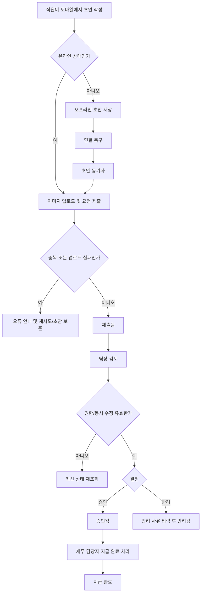

# 모바일 경비 승인 PRD

## Applicability

| Contract | Required / N/A | Evidence |
|---|---:|---|
| Pages/routes or screen IDs | Required | 직원 제출, 팀장 승인/반려, 재무 지급 완료 등 사용자별 화면이 필요함 |
| Empty/loading/error/success/recovery state matrix | Required | 오프라인 초안, 이미지 업로드 실패, 동기화, 승인 중 동시 수정 등 사용자-visible 상태가 있음 |
| Mermaid user or system flow | Required | 제출 → 승인/반려 → 지급 완료의 다단계 라이프사이클이 있음 |

## Context and Problem

직원이 모바일에서 영수증 사진과 경비 정보를 제출하고, 팀장은 자기 팀의 요청만 검토하며, 재무 담당자는 최종 승인된 요청을 지급 완료 처리해야 한다. 모바일 사용 환경에서는 오프라인 초안, 이미지 업로드 실패, 중복 제출, 권한 변경, 동시 수정 같은 실패 상태를 명확히 처리해야 한다.

## Goals

- 직원이 모바일에서 영수증 사진, 금액, 카테고리를 포함한 경비 요청을 제출할 수 있다.
- 팀장이 자기 팀 직원의 경비 요청만 승인 또는 반려할 수 있다.
- 반려 시 팀장이 반려 사유를 필수 입력한다.
- 재무 담당자가 승인된 요청을 지급 완료 상태로 변경할 수 있다.
- 오프라인에서 작성한 초안은 연결 복구 시 동기화된다.
- 중복 제출, 이미지 업로드 실패, 권한 변경, 동시 수정 상태를 사용자에게 명확히 안내하고 복구 경로를 제공한다.
- 1차 출시 접근성 목표는 WCAG 2.2 AA다.

## Non-goals

- 1차 출시에서 다중 통화는 지원하지 않는다.
- 1차 출시에서 ERP 자동 연동은 지원하지 않는다.
- 성능 수치 목표는 1차 출시 전 측정 후 결정하며, 본 PRD에서는 고정 수치를 정의하지 않는다.
- 영수증 OCR, 자동 카테고리 추천, 정책 위반 자동 판정은 범위에 포함하지 않는다.
- 복수 단계 승인 워크플로우는 범위에 포함하지 않는다.

## Users, Roles, and Permissions

| Role | Description | Permissions |
|---|---|---|
| 직원 | 경비를 제출하는 사용자 | 본인 초안 생성/수정/삭제, 본인 요청 제출, 본인 요청 상태 조회 |
| 팀장 | 팀원의 경비를 검토하는 사용자 | 자기 팀 요청 조회, 승인, 반려, 반려 사유 입력 |
| 재무 담당자 | 승인된 경비의 지급 상태를 관리하는 사용자 | 승인된 요청 조회, 지급 완료 처리 |
| 관리자 또는 권한 시스템 | 사용자 역할과 팀 소속을 관리하는 외부/내부 권한 주체 | 역할/팀 변경 제공. 본 기능 내 직접 관리 화면은 범위 제외 |

## Functional Requirements

| ID | Requirement | Priority |
|---|---|---:|
| FR-001 | 직원은 모바일에서 영수증 사진, 금액, 카테고리를 입력해 경비 요청 초안을 작성할 수 있어야 한다. | P0 |
| FR-002 | 직원은 필수값이 유효할 때 초안을 경비 요청으로 제출할 수 있어야 한다. | P0 |
| FR-003 | 제출 요청에는 서버에서 생성한 고유 요청 ID와 제출 시간이 기록되어야 한다. | P0 |
| FR-004 | 시스템은 동일 사용자, 동일 이미지 또는 동일 제출 토큰 기반의 중복 제출을 감지하고 중복 요청 생성을 방지해야 한다. | P0 |
| FR-005 | 이미지 업로드 실패 시 요청은 제출 완료로 처리되지 않아야 하며, 사용자는 재시도 또는 초안 보존을 선택할 수 있어야 한다. | P0 |
| FR-006 | 직원은 오프라인 상태에서 초안을 작성할 수 있어야 한다. | P0 |
| FR-007 | 오프라인 초안은 네트워크 연결 복구 시 자동 또는 사용자 확인 후 동기화되어야 한다. | P0 |
| FR-008 | 동기화 실패 시 초안 데이터와 영수증 이미지는 손실되지 않아야 하며 실패 사유와 재시도 경로를 제공해야 한다. | P0 |
| FR-009 | 팀장은 자기 팀 직원이 제출한 요청만 목록과 상세에서 볼 수 있어야 한다. | P0 |
| FR-010 | 팀장은 자기 팀 요청을 승인할 수 있어야 한다. | P0 |
| FR-011 | 팀장은 자기 팀 요청을 반려할 수 있어야 하며 반려 사유 입력은 필수여야 한다. | P0 |
| FR-012 | 팀장이 승인 또는 반려하는 시점에 권한이 변경되었거나 팀 소속이 달라진 경우 서버는 작업을 거부하고 최신 상태를 안내해야 한다. | P0 |
| FR-013 | 승인/반려 중 다른 사용자가 동일 요청을 변경한 경우 시스템은 동시 수정 충돌을 감지하고 최신 상태를 다시 불러오게 해야 한다. | P0 |
| FR-014 | 재무 담당자는 승인된 요청만 지급 완료로 표시할 수 있어야 한다. | P0 |
| FR-015 | 지급 완료된 요청은 팀장 또는 직원이 승인/반려/수정할 수 없어야 한다. | P0 |
| FR-016 | 직원, 팀장, 재무 담당자는 권한에 맞는 요청 상태를 조회할 수 있어야 한다. | P1 |
| FR-017 | 모든 상태 변경은 처리자, 처리 시각, 이전 상태, 이후 상태를 감사 가능하게 기록해야 한다. | P0 |
| FR-018 | 1차 출시 통화는 단일 기준 통화만 지원해야 한다. | P0 |
| FR-019 | 시스템은 WCAG 2.2 AA를 목표로 입력, 오류, 상태, 버튼, 이미지 대체 정보 흐름을 제공해야 한다. | P0 |
| FR-020 | 성능은 측정 항목을 정의하고 출시 전 실측해야 하며, 수치 목표는 측정 후 별도 결정한다. | P1 |

## Pages and Routes

| Page or screen ID | Route, deep link, or explicit TBD + owner | Roles | Purpose |
|---|---|---|---|
| EXP-MOB-001 | TBD, mobile app navigation owner | 직원 | 경비 요청 목록 및 상태 조회 |
| EXP-MOB-002 | TBD, mobile app navigation owner | 직원 | 경비 초안 작성 및 제출 |
| EXP-MOB-003 | TBD, mobile app navigation owner | 직원, 팀장, 재무 담당자 | 경비 요청 상세 조회 |
| EXP-MOB-004 | TBD, mobile app navigation owner | 팀장 | 자기 팀 요청 검토 목록 |
| EXP-MOB-005 | TBD, mobile app navigation owner | 팀장 | 승인/반려 처리 및 반려 사유 입력 |
| EXP-MOB-006 | TBD, mobile app navigation owner | 재무 담당자 | 승인 요청 목록 및 지급 완료 처리 |
| EXP-MOB-007 | TBD, mobile app navigation owner | 직원 | 오프라인 초안 및 동기화 상태 관리 |

## State Matrix

| Surface | Empty | Loading | Error | Success | Recovery |
|---|---|---|---|---|---|
| 직원 요청 목록 | 제출한 요청 없음 | 요청 목록 불러오는 중 | 목록 로드 실패 | 요청 상태별 목록 표시 | 다시 시도 |
| 초안 작성 | 입력 전 빈 양식 | 이미지 업로드 또는 제출 중 | 필수값 오류, 이미지 업로드 실패, 중복 제출 감지 | 제출 완료 또는 초안 저장 완료 | 이미지 재업로드, 초안 유지, 다시 제출 |
| 오프라인 초안 | 저장된 오프라인 초안 없음 | 연결 복구 후 동기화 중 | 동기화 실패 | 동기화 완료 | 실패 항목별 재시도 |
| 팀장 검토 목록 | 검토할 요청 없음 | 요청 불러오는 중 | 권한 없음, 목록 로드 실패 | 자기 팀 요청 표시 | 새로고침, 권한 확인 안내 |
| 승인/반려 처리 | 선택된 요청 없음 | 처리 중 | 권한 변경, 동시 수정, 반려 사유 누락 | 승인 또는 반려 완료 | 최신 상태 다시 불러오기 |
| 재무 지급 처리 | 승인된 요청 없음 | 처리 중 | 권한 없음, 이미 변경된 요청 | 지급 완료 | 최신 상태 다시 불러오기 |

## User or System Flow

## Authorization and Data Boundaries

- 모든 권한 검사는 서버에서 수행해야 한다. UI에서 버튼을 숨기는 것만으로 권한을 보장하지 않는다.
- 직원은 본인 요청과 본인 오프라인 초안만 조회/수정할 수 있다.
- 팀장은 요청 처리 시점의 최신 팀 소속 기준으로 자기 팀 직원의 요청만 조회하고 승인/반려할 수 있다.
- 재무 담당자는 승인 상태의 요청만 지급 완료로 변경할 수 있다.
- 권한 또는 팀 소속이 목록 조회 이후 변경될 수 있으므로, 승인/반려/지급 완료 같은 상태 변경 API는 매 요청마다 권한을 재검증해야 한다.
- 동시 수정 방지를 위해 상태 변경 요청은 요청 버전, 업데이트 시각, 또는 서버가 발급한 concurrency token 중 하나를 포함해야 한다.
- 영수증 이미지는 요청 소유자와 허용된 검토자만 접근할 수 있어야 한다.
- 감사 로그는 일반 사용자에게 직접 노출하지 않되 운영상 추적 가능해야 한다.

## Non-functional Requirements

- 접근성: WCAG 2.2 AA를 목표로 한다.
- 접근성 세부: 이미지 첨부 상태, 업로드 실패, 동기화 실패, 승인/반려 결과는 스크린 리더와 시각적 피드백 모두로 인지 가능해야 한다.
- 접근성 세부: 반려 사유 입력 오류와 필수값 오류는 필드 단위로 연결되어야 한다.
- 신뢰성: 오프라인 초안과 이미지 첨부 정보는 앱 재시작 후에도 보존되어야 한다.
- 보안: 서버 권한 검증, 요청 소유권 검증, 팀 경계 검증이 필수다.
- 감사성: 상태 변경 이력은 추적 가능해야 한다.
- 성능: 목록 로드 시간, 이미지 업로드 시간, 제출 완료 시간, 동기화 완료 시간을 측정한다. 목표 수치는 측정 후 결정한다.

## Acceptance Criteria

| ID | Requirement | Given | When | Then | Verification |
|---|---|---|---|---|---|
| AC-001 | FR-001, FR-002 | 직원이 필수값을 입력하고 영수증 사진을 첨부함 | 제출을 누름 | 요청이 제출 상태로 생성된다 | 모바일 E2E 테스트 |
| AC-002 | FR-002 | 금액, 카테고리, 영수증 중 하나가 없음 | 제출을 누름 | 누락 필드가 표시되고 제출되지 않는다 | 모바일 E2E 테스트 |
| AC-003 | FR-004 | 동일 제출 토큰의 요청이 이미 생성됨 | 사용자가 다시 제출함 | 새 요청이 중복 생성되지 않고 기존 결과가 안내된다 | API 테스트 |
| AC-004 | FR-005 | 이미지 업로드가 실패함 | 제출 과정이 진행됨 | 요청은 제출 완료 처리되지 않고 재시도 또는 초안 보존이 가능하다 | API + 모바일 E2E 테스트 |
| AC-005 | FR-006, FR-007 | 직원이 오프라인 상태임 | 초안을 작성함 | 초안이 로컬에 저장되고 연결 복구 후 동기화된다 | 모바일 E2E 테스트 |
| AC-006 | FR-008 | 연결 복구 후 동기화가 실패함 | 앱이 동기화를 시도함 | 초안과 이미지가 보존되고 실패 사유와 재시도 액션이 표시된다 | 모바일 E2E 테스트 |
| AC-007 | FR-009 | 팀장이 다른 팀 직원의 요청 ID에 접근함 | 상세 조회를 요청함 | 서버가 접근을 거부한다 | API 권한 테스트 |
| AC-008 | FR-010 | 팀장이 자기 팀 제출 요청을 보고 있음 | 승인함 | 요청 상태가 승인됨으로 변경되고 처리 이력이 남는다 | API + E2E 테스트 |
| AC-009 | FR-011 | 팀장이 반려 사유 없이 반려를 시도함 | 반려를 누름 | 반려되지 않고 사유 입력 오류가 표시된다 | 모바일 E2E 테스트 |
| AC-010 | FR-011 | 팀장이 반려 사유를 입력함 | 반려함 | 요청 상태가 반려됨으로 변경되고 사유가 저장된다 | API + E2E 테스트 |
| AC-011 | FR-012 | 팀장의 팀 권한이 조회 이후 제거됨 | 승인 또는 반려를 시도함 | 서버가 작업을 거부하고 최신 권한 상태 안내가 표시된다 | API 권한 테스트 |
| AC-012 | FR-013 | 요청이 다른 사용자에 의해 먼저 변경됨 | 팀장이 이전 버전으로 승인/반려함 | 충돌이 감지되고 최신 상태 재조회가 요구된다 | API concurrency 테스트 |
| AC-013 | FR-014 | 재무 담당자가 승인된 요청을 보고 있음 | 지급 완료 처리함 | 요청 상태가 지급 완료로 변경된다 | API + E2E 테스트 |
| AC-014 | FR-014 | 재무 담당자가 승인되지 않은 요청을 처리하려 함 | 지급 완료를 요청함 | 서버가 작업을 거부한다 | API 테스트 |
| AC-015 | FR-015 | 요청이 지급 완료 상태임 | 직원 또는 팀장이 수정/승인/반려를 시도함 | 서버가 작업을 거부한다 | API 테스트 |
| AC-016 | FR-017 | 요청 상태가 변경됨 | 상태 변경이 완료됨 | 처리자, 처리 시각, 이전/이후 상태가 기록된다 | DB/API 테스트 |
| AC-017 | FR-018 | 사용자가 금액을 입력함 | 요청을 제출함 | 단일 기준 통화로 저장되고 다중 통화 선택 UI는 없다 | E2E 테스트 |
| AC-018 | FR-019 | 사용자가 스크린 리더 또는 키보드 접근을 사용함 | 작성, 오류 확인, 승인/반려를 수행함 | 핵심 플로우가 WCAG 2.2 AA 목표에 맞게 접근 가능하다 | 접근성 점검 |
| AC-019 | FR-020 | 테스트 또는 베타 사용이 진행됨 | 성능 측정을 수집함 | 목록 로드, 업로드, 제출, 동기화 지표가 기록된다 | 계측 확인 |

## Assumptions and Open Decisions

### 합리적 가정

- 단일 기준 통화는 서비스 기본 통화로 고정된다.
- 모바일 앱 또는 모바일 웹 중 어느 형태든 사용자-visible 화면 ID는 동일하게 적용 가능하다.
- 팀 소속과 역할 정보는 기존 권한 시스템에서 제공된다.
- 오프라인 작성은 “초안”까지만 허용하고, 최종 제출은 서버 연결이 가능할 때 완료된다.
- 반려된 요청의 재제출 여부는 별도 기능으로 확장 가능하지만 1차 PRD의 핵심 범위는 반려 상태 저장과 사유 표시다.
- 영수증 사진은 최소 1장 제출을 기준으로 한다.

### 열린 결정

| ID | Decision | Owner | Needed by |
|---|---|---|---|
| OD-001 | 1차 출시 기준 통화 | Product/Finance | 금액 저장 및 표시 설계 전 |
| OD-002 | 모바일 구현 형태: 네이티브 앱, 모바일 웹, 또는 하이브리드 | Product/Engineering | 화면 라우팅 및 오프라인 저장 설계 전 |
| OD-003 | 중복 제출 판단 기준: 제출 토큰만 사용할지, 이미지 해시/금액/카테고리 조합까지 사용할지 | Engineering/Product | API 설계 전 |
| OD-004 | 오프라인 초안 동기화 방식: 자동 동기화 또는 사용자 확인 후 동기화 | Product/Design | 모바일 UX 설계 전 |
| OD-005 | 성능 목표 수치 | Engineering/Product | 측정 데이터 확보 후 출시 기준 확정 전 |
| OD-006 | 반려된 요청의 수정 후 재제출을 1차 출시에서 포함할지 | Product | 상세 플로우 확정 전 |

## Risks and Mitigations

| Risk | Impact | Mitigation |
|---|---|---|
| 권한 변경 후 오래된 화면에서 승인 가능 | 잘못된 승인/반려 | 상태 변경 API에서 매번 서버 권한 재검증 |
| 동시 수정으로 잘못된 상태 전이 | 데이터 불일치 | version 또는 concurrency token 기반 충돌 감지 |
| 이미지 업로드 실패로 요청만 생성 | 증빙 없는 경비 요청 | 이미지 업로드 성공 후 제출 완료 처리 |
| 오프라인 초안 손실 | 사용자 재작업 증가 | 로컬 영속 저장, 동기화 실패 시 초안 보존 |
| 중복 제출 | 중복 지급 위험 | idempotency token 및 중복 감지 |
| 접근성 미달 | 일부 사용자 핵심 업무 불가 | WCAG 2.2 AA 기준 설계/QA 포함 |
| 성능 목표 부재 | 출시 기준 모호 | 사전 계측 후 수치 목표 별도 결정 |

## Delivery

| Phase | Requirement IDs | Verifiable exit condition |
|---|---|---|
| Phase 1: 직원 제출 및 초안 | FR-001, FR-002, FR-003, FR-005, FR-006, FR-007, FR-008, FR-018, FR-019 | 직원이 온라인/오프라인에서 초안을 만들고, 업로드 실패를 복구하며, 단일 통화 요청을 제출할 수 있다 |
| Phase 2: 팀장 승인/반려 | FR-009, FR-010, FR-011, FR-012, FR-013, FR-016, FR-017 | 팀장이 자기 팀 요청만 승인/반려하고 권한 변경 및 동시 수정이 차단된다 |
| Phase 3: 재무 지급 완료 | FR-014, FR-015, FR-016, FR-017 | 재무 담당자가 승인된 요청만 지급 완료 처리하고 이후 변경이 차단된다 |
| Phase 4: 품질 및 출시 기준 | FR-004, FR-019, FR-020 | 중복 제출 방지, 접근성 점검, 성능 계측이 검증된다 |

검증 참고: 사용자가 파일 생성과 저장소 탐색을 금지했으므로 PRD 파일 저장 및 validator 실행은 수행하지 않았습니다.