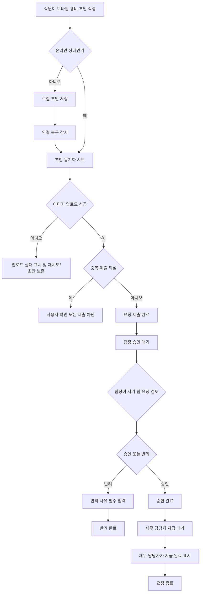

# 모바일 경비 승인 PRD

## Applicability

| Contract | Required / N/A | Evidence |
|---|---:|---|
| Pages/routes or screen IDs | Required | 직원, 팀장, 재무 담당자가 모바일에서 제출/승인/지급 완료를 수행하는 사용자 화면이 필요함 |
| Empty/loading/error/success/recovery state matrix | Required | 오프라인 초안, 이미지 업로드 실패, 중복 제출, 권한 변경, 동시 수정 등 복구 가능한 상태가 명시됨 |
| Mermaid user or system flow | Required | 제출 → 승인/반려 → 지급 완료의 다단계 라이프사이클이 있음 |

## Context and Problem

직원은 모바일에서 영수증 기반 경비를 제출하고, 팀장은 자기 팀의 요청만 검토하며, 재무 담당자는 승인된 요청을 지급 완료로 처리해야 한다. 모바일 환경 특성상 네트워크 단절, 이미지 업로드 실패, 중복 제출, 권한 변경, 동시 수정 충돌을 제품 동작으로 명확히 정의해야 한다.

## Goals

- 직원이 모바일에서 영수증 사진, 금액, 카테고리를 포함한 경비 요청을 제출할 수 있다.
- 오프라인에서 작성한 초안은 로컬에 보존되고, 연결 복구 후 동기화된다.
- 팀장은 자기 팀 직원의 요청만 승인 또는 반려할 수 있다.
- 반려 시 팀장은 반려 사유를 필수로 입력한다.
- 재무 담당자는 팀장 승인 완료 요청만 지급 완료로 표시할 수 있다.
- 중복 제출, 업로드 실패, 권한 변경, 동시 수정 충돌에 대해 사용자가 이해하고 복구할 수 있는 상태를 제공한다.
- 접근성은 WCAG 2.2 AA를 목표로 한다.

## Non-goals

- 1차 출시에서 다중 통화는 지원하지 않는다.
- 1차 출시에서 ERP 자동 연동은 지원하지 않는다.
- 법인카드 자동 매칭, OCR 자동 금액 추출, 회계 계정 자동 추천은 포함하지 않는다.
- 성능 목표 수치 확정은 포함하지 않는다. 측정 후 별도 결정한다.

## Users, Roles, and Permissions

| Role | Description | Permissions |
|---|---|---|
| 직원 | 경비를 제출하는 사용자 | 본인 초안 작성, 본인 요청 제출, 본인 요청 상태 조회 |
| 팀장 | 팀원의 경비 요청을 검토하는 사용자 | 자기 팀 요청 조회, 승인, 반려, 반려 사유 입력 |
| 재무 담당자 | 승인된 경비의 지급 상태를 관리하는 사용자 | 승인된 요청 조회, 지급 완료 표시 |
| 관리자 또는 권한 시스템 | 역할/소속 정보를 관리하는 외부 또는 내부 주체 | 사용자 역할과 팀 소속 변경 |

## Functional Requirements

| ID | Requirement | Priority |
|---|---|---:|
| FR-001 | 직원은 모바일에서 영수증 사진, 금액, 카테고리를 입력해 경비 요청을 제출할 수 있어야 한다. | P0 |
| FR-002 | 금액과 카테고리는 제출 전에 필수 검증되어야 한다. | P0 |
| FR-003 | 영수증 사진 업로드가 실패하면 요청은 제출 완료로 처리되지 않고, 사용자는 재시도하거나 초안으로 보존할 수 있어야 한다. | P0 |
| FR-004 | 오프라인 상태에서 작성한 요청은 로컬 초안으로 저장되어야 한다. | P0 |
| FR-005 | 연결이 복구되면 오프라인 초안은 사용자의 확인 또는 자동 재시도 정책에 따라 서버와 동기화되어야 한다. | P0 |
| FR-006 | 시스템은 동일 사용자의 중복 제출 가능성을 감지하고 차단 또는 확인 절차를 제공해야 한다. | P0 |
| FR-007 | 팀장은 자기 팀 소속 직원의 요청만 조회, 승인, 반려할 수 있어야 한다. | P0 |
| FR-008 | 팀장이 요청을 반려할 때 반려 사유 입력은 필수여야 한다. | P0 |
| FR-009 | 재무 담당자는 팀장 승인 상태의 요청만 지급 완료로 표시할 수 있어야 한다. | P0 |
| FR-010 | 승인, 반려, 지급 완료 같은 상태 변경은 서버에서 권한과 현재 상태를 재검증해야 한다. | P0 |
| FR-011 | 사용자의 역할 또는 팀 소속이 변경된 경우, 다음 서버 요청부터 변경된 권한이 적용되어야 한다. | P0 |
| FR-012 | 승인 중 다른 사용자가 동일 요청을 수정하거나 상태 변경한 경우, 시스템은 충돌을 감지하고 최신 상태를 보여줘야 한다. | P0 |
| FR-013 | 모든 주요 상태 변경은 요청자, 변경자, 변경 시각, 이전 상태, 변경 후 상태를 감사 기록으로 남겨야 한다. | P1 |
| FR-014 | 요청 목록과 상세 화면은 빈 상태, 로딩, 오류, 성공, 복구 상태를 제공해야 한다. | P0 |
| FR-015 | 모바일 UI는 WCAG 2.2 AA 접근성 기준을 목표로 설계 및 검증되어야 한다. | P0 |
| FR-016 | 성능은 1차 출시 전 실제 기기와 네트워크 조건에서 측정하고 목표 수치를 별도 확정해야 한다. | P1 |

## Pages and Routes

| Page or screen ID | Route, deep link, or explicit TBD + owner | Roles | Purpose |
|---|---|---|---|
| SCR-001 Expense Draft Form | TBD, Mobile App Owner | 직원 | 영수증 사진, 금액, 카테고리 입력 및 초안 저장 |
| SCR-002 My Expense Requests | TBD, Mobile App Owner | 직원 | 본인 요청 목록과 상태 확인 |
| SCR-003 Expense Request Detail | TBD, Mobile App Owner | 직원, 팀장, 재무 담당자 | 요청 상세, 영수증, 상태 이력 확인 |
| SCR-004 Team Approval Queue | TBD, Mobile App Owner | 팀장 | 자기 팀 요청 목록 검토 |
| SCR-005 Rejection Reason Modal | TBD, Mobile App Owner | 팀장 | 반려 사유 입력 |
| SCR-006 Finance Payment Queue | TBD, Mobile App Owner | 재무 담당자 | 승인된 요청 지급 완료 처리 |
| SCR-007 Sync Center 또는 Draft Recovery Sheet | TBD, Mobile App Owner | 직원 | 오프라인 초안 동기화 상태와 실패 복구 |

## State Matrix

| Surface | Empty | Loading | Error | Success | Recovery |
|---|---|---|---|---|---|
| Expense Draft Form | 입력 전 기본 폼 표시 | 이미지 업로드 또는 제출 진행 표시 | 필수값 누락, 업로드 실패, 네트워크 오류 표시 | 제출 완료 및 요청 상세로 이동 | 초안 저장, 업로드 재시도, 이미지 교체 |
| My Expense Requests | 제출한 요청 없음 | 목록 불러오는 중 | 목록 로드 실패 | 본인 요청 목록 표시 | 다시 시도 |
| Team Approval Queue | 검토할 요청 없음 | 팀 요청 로딩 | 권한 없음 또는 로드 실패 | 자기 팀 요청 목록 표시 | 새로고침, 권한 변경 안내 |
| Expense Request Detail | 해당 없음 | 상세 로딩 | 삭제됨, 접근 권한 없음, 충돌 발생 | 최신 요청 상세 표시 | 최신 상태 다시 불러오기 |
| Rejection Reason Modal | 사유 입력 전 | 반려 처리 중 | 사유 누락, 상태 변경 충돌 | 반려 완료 | 최신 상태 확인 후 재시도 |
| Finance Payment Queue | 지급 처리할 승인 요청 없음 | 승인 요청 로딩 | 권한 없음 또는 로드 실패 | 승인 요청 목록 표시 | 새로고침 |
| Sync Center / Draft Recovery | 동기화할 초안 없음 | 동기화 진행 | 동기화 실패, 중복 의심, 업로드 실패 | 동기화 완료 | 재시도, 초안 수정, 초안 삭제 |

## User or System Flow

## Authorization and Data Boundaries

- 권한 검사는 클라이언트 UI 표시 여부와 별개로 서버에서 수행해야 한다.
- 팀장은 서버 기준의 현재 팀 소속 정보를 기준으로 자기 팀 요청만 접근할 수 있다.
- 직원은 본인 요청과 본인 로컬 초안만 볼 수 있다.
- 재무 담당자는 승인 완료 상태의 요청만 지급 완료로 변경할 수 있다.
- 상태 변경 요청은 서버에서 현재 상태, 요청 버전, 사용자 권한을 모두 검증해야 한다.
- 권한 또는 팀 소속이 변경된 사용자는 기존 화면을 보고 있더라도 다음 조회/상태 변경 시 서버 응답 기준으로 접근이 제한되어야 한다.
- 영수증 이미지는 요청 레코드와 연결되어야 하며, 업로드 실패 이미지는 서버 제출 완료 데이터로 간주하지 않는다.
- 감사 기록은 일반 사용자 수정 대상이 아니며, 운영 또는 감사 목적으로 조회 권한을 분리한다.

## Non-functional Requirements

- NFR-001: 접근성 목표는 WCAG 2.2 AA이다.
- NFR-002: 모든 상태 변경 API는 멱등성 또는 중복 방지 키를 지원해야 한다.
- NFR-003: 오프라인 초안은 앱 재시작 후에도 유지되어야 한다.
- NFR-004: 성능 지표는 측정 후 결정한다. 후보 지표는 제출 완료 시간, 이미지 업로드 실패율, 목록 초기 로드 시간, 동기화 성공률이며, 오너는 Product Owner와 Engineering Lead로 한다.
- NFR-005: 요청 상태 변경과 지급 완료 처리는 감사 가능해야 한다.

## Acceptance Criteria

| ID | Requirement | Given | When | Then | Verification |
|---|---|---|---|---|---|
| AC-001 | FR-001, FR-002 | 직원이 모바일 경비 폼을 열었다 | 영수증 사진, 금액, 카테고리를 입력하고 제출한다 | 요청이 제출되고 승인 대기 상태가 된다 | 모바일 E2E 테스트 |
| AC-002 | FR-002 | 직원이 금액 또는 카테고리를 비웠다 | 제출을 누른다 | 제출되지 않고 누락 필드 오류가 표시된다 | 폼 검증 테스트 |
| AC-003 | FR-003 | 이미지 업로드가 실패한다 | 직원이 제출을 시도한다 | 요청은 제출 완료가 아니며 재시도 또는 초안 보존 옵션이 표시된다 | 업로드 실패 시나리오 테스트 |
| AC-004 | FR-004, FR-005 | 직원이 오프라인 상태다 | 경비 내용을 작성한다 | 로컬 초안으로 저장되고 연결 복구 후 동기화 대상이 된다 | 오프라인 E2E 테스트 |
| AC-005 | FR-006 | 동일 사용자, 동일 이미지 또는 동일 금액/카테고리/근접 제출 시각의 요청이 존재한다 | 직원이 다시 제출한다 | 시스템은 중복 의심 상태를 표시하고 정책에 따라 확인 또는 차단한다 | 중복 제출 테스트 |
| AC-006 | FR-007 | 팀장 A가 팀 B 직원 요청에 접근한다 | 목록 또는 상세를 조회한다 | 서버가 접근을 거부한다 | API 권한 테스트 |
| AC-007 | FR-008 | 팀장이 반려 사유 없이 반려를 누른다 | 반려 처리를 시도한다 | 반려되지 않고 사유 입력 오류가 표시된다 | E2E 테스트 |
| AC-008 | FR-009 | 재무 담당자가 승인된 요청을 보고 있다 | 지급 완료를 누른다 | 요청 상태가 지급 완료로 변경된다 | API 및 E2E 테스트 |
| AC-009 | FR-009, FR-010 | 재무 담당자가 승인되지 않은 요청에 지급 완료를 시도한다 | 상태 변경 API를 호출한다 | 서버가 요청을 거부한다 | API 상태 전이 테스트 |
| AC-010 | FR-011 | 팀장의 팀 소속 권한이 변경되었다 | 기존 화면에서 이전 팀 요청을 승인하려 한다 | 서버가 거부하고 최신 권한 상태를 안내한다 | 권한 변경 테스트 |
| AC-011 | FR-012 | 팀장이 상세 화면을 열어둔 동안 다른 사용자가 요청 상태를 변경했다 | 팀장이 승인 또는 반려를 시도한다 | 충돌이 감지되고 최신 상태를 다시 불러오도록 안내한다 | 버전 충돌 테스트 |
| AC-012 | FR-013 | 요청 상태가 변경된다 | 승인, 반려, 지급 완료 중 하나가 완료된다 | 감사 기록에 변경자, 시각, 이전/이후 상태가 저장된다 | DB/API 테스트 |
| AC-013 | FR-015 | 사용자가 스크린리더 또는 키보드/스위치 접근을 사용한다 | 주요 화면을 탐색하고 제출/승인/반려/지급 완료를 수행한다 | 핵심 작업이 WCAG 2.2 AA 목표에 맞게 가능하다 | 접근성 점검 및 수동 QA |
| AC-014 | FR-016 | 1차 출시 후보 빌드가 준비되었다 | 실제 기기와 네트워크 조건에서 측정한다 | 성능 기준 결정에 필요한 측정값이 수집된다 | 성능 측정 리포트 |

## Assumptions and Open Decisions

### 합리적 가정

- 단일 기본 통화만 사용하며, 통화 표시는 조직 기본 통화를 따른다.
- 카테고리 목록은 사전에 정의된 고정 목록으로 제공된다.
- 영수증 사진은 모바일 카메라 촬영 또는 갤러리 선택을 모두 허용한다.
- 직원은 제출 후 승인 전까지 요청을 수정할 수 없거나, 수정 시 기존 승인 프로세스를 무효화한다. 정확한 정책은 열린 결정으로 둔다.
- 오프라인 초안은 사용자 기기 내 앱 저장소에 저장된다.
- 중복 제출 감지는 완전한 회계 중복 판정이 아니라 사용자 실수를 줄이는 제품 보호 장치다.

### 열린 결정

| ID | Decision | Owner | Needed by |
|---|---|---|---|
| OD-001 | 오프라인 초안 동기화를 자동으로 할지, 사용자 확인 후 할지 결정 필요 | Product Owner | 개발 시작 전 |
| OD-002 | 중복 제출 기준과 처리 방식 결정 필요: 차단, 경고 후 진행, 기존 요청으로 이동 | Product Owner, Engineering Lead | API 설계 전 |
| OD-003 | 직원의 제출 후 수정 허용 여부와 수정 시 승인 상태 처리 정책 결정 필요 | Product Owner | 상태 모델 확정 전 |
| OD-004 | 반려 사유의 최소 길이, 템플릿 제공 여부 결정 필요 | Product Owner | UI 구현 전 |
| OD-005 | 성능 목표 수치와 측정 환경 결정 필요 | Product Owner, Engineering Lead | 출시 후보 검증 전 |
| OD-006 | 영수증 이미지 크기, 형식, 압축 정책 결정 필요 | Engineering Lead | 업로드 구현 전 |

## Risks and Mitigations

| Risk | Impact | Mitigation |
|---|---|---|
| 오프라인 초안과 서버 데이터 간 충돌 | 중복 제출 또는 잘못된 상태 표시 | 요청별 클라이언트 생성 ID, 서버 버전, 동기화 상태를 사용한다 |
| 이미지 업로드 실패 | 제출 누락 또는 사용자 혼란 | 요청 제출과 이미지 업로드 완료 조건을 분리해 명확한 실패/재시도 상태를 제공한다 |
| 권한 변경 지연 반영 | 이전 팀 요청의 부정 승인 가능 | 모든 상태 변경을 서버에서 현재 권한으로 재검증한다 |
| 동시 승인/반려 | 잘못된 상태 전이 | 상태 버전 또는 optimistic locking을 사용한다 |
| 중복 제출 오탐 | 정상 제출 방해 | 경고 후 진행 가능 여부를 정책으로 결정하고 사용자에게 근거를 표시한다 |
| 접근성 목표 미충족 | 일부 사용자의 핵심 작업 불가 | 핵심 플로우 기준으로 자동 점검과 수동 스크린리더 QA를 포함한다 |

## Delivery

| Phase | Requirement IDs | Verifiable exit condition |
|---|---|---|
| Phase 1: Core Submission | FR-001, FR-002, FR-003, FR-014 | 직원이 모바일에서 유효한 요청을 제출하고 업로드 실패를 복구할 수 있다 |
| Phase 2: Offline Draft Sync | FR-004, FR-005, FR-006 | 오프라인 초안이 보존되고 연결 복구 후 중복 방지와 함께 동기화된다 |
| Phase 3: Approval Workflow | FR-007, FR-008, FR-010, FR-011, FR-012 | 팀장이 자기 팀 요청만 승인/반려하고 권한 변경 및 충돌이 서버에서 차단된다 |
| Phase 4: Finance Completion | FR-009, FR-010, FR-013 | 재무 담당자가 승인 요청만 지급 완료 처리하고 감사 기록이 남는다 |
| Phase 5: Launch Readiness | FR-015, FR-016 | WCAG 2.2 AA 목표 기준 QA와 성능 측정 리포트가 완료된다 |

검증 참고: 요청대로 파일 생성 없이 이 응답에만 작성했으므로 PRD 파일 validator는 실행하지 않았습니다.