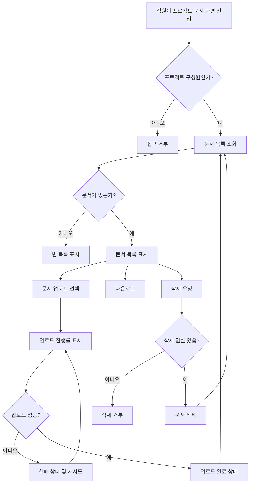

# 사내 프로젝트 문서 공유 PRD

## Applicability

| Contract | Required / N/A | Evidence |
|---|---:|---|
| Pages/routes or screen IDs | Required | 업로드, 목록, 다운로드, 삭제, 구성원 관리이 사용자 화면에서 수행됨 |
| Empty/loading/error/success/recovery state matrix | Required | 업로드 진행률, 빈 목록, 실패 후 재시도, 업로드 완료 상태가 명시됨 |
| Mermaid user or system flow | Required | 업로드부터 공유, 다운로드, 삭제까지 다단계 생명주기 존재 |

## Context and problem

사내 직원이 프로젝트별 문서를 업로드하고 같은 프로젝트 구성원에게 공유할 수 있는 내부용 문서 공유 기능을 제공한다. 현재 1차 출시는 문서 공유의 핵심 흐름인 업로드, 목록 조회, 다운로드, 삭제에 집중하며, 검색과 외부 공유는 제외한다.

4주 내 내부 베타 출시를 목표로 하므로 권한, 상태 처리, 실패 복구, 기본 성능 목표를 명확히 정의해 구현 범위를 통제한다.

## Goals

- 직원이 프로젝트 단위로 문서를 업로드할 수 있다.
- 프로젝트 구성원은 같은 프로젝트에 업로드된 문서 목록을 보고 다운로드할 수 있다.
- 프로젝트 관리자는 구성원 초대·제거와 프로젝트 문서 삭제를 할 수 있다.
- 일반 구성원은 본인이 업로드한 문서만 삭제할 수 있다.
- 업로드 진행률, 빈 목록, 실패 후 재시도, 업로드 완료 상태를 제공한다.
- 내부 베타 기준으로 4주 내 사용 가능한 1차 버전을 출시한다.

## Non-goals

- 문서 검색
- 외부 사용자 또는 외부 링크 공유
- 문서 미리보기
- 문서 버전 관리
- 폴더/태그/분류 체계
- 문서 공동 편집
- 감사 로그 리포트 UI
- 정식 SLA 보장

## Users, roles, and permissions

| Role | Description | Permissions |
|---|---|---|
| 직원 | 회사 내부 인증 사용자 | 자신이 속한 프로젝트 접근 가능 |
| 프로젝트 일반 구성원 | 특정 프로젝트에 소속된 직원 | 문서 업로드, 목록 조회, 다운로드, 본인이 올린 문서 삭제 |
| 프로젝트 관리자 | 특정 프로젝트의 관리 권한을 가진 직원 | 일반 구성원 권한 + 구성원 초대·제거 + 프로젝트 내 모든 문서 삭제 |

## Functional requirements

| ID | Requirement | Priority |
|---|---|---:|
| FR-001 | 사용자는 자신이 속한 프로젝트의 문서 목록을 볼 수 있어야 한다. | P0 |
| FR-002 | 문서 목록에는 최소한 문서명, 업로드한 사용자, 업로드 일시, 파일 크기, 다운로드 액션, 삭제 가능 여부가 표시되어야 한다. | P0 |
| FR-003 | 사용자는 자신이 속한 프로젝트에 문서를 업로드할 수 있어야 한다. | P0 |
| FR-004 | 업로드 중에는 진행률이 표시되어야 한다. | P0 |
| FR-005 | 업로드 실패 시 실패 상태와 재시도 액션이 제공되어야 한다. | P0 |
| FR-006 | 업로드 완료 시 완료 상태가 표시되고 문서 목록에 새 문서가 반영되어야 한다. | P0 |
| FR-007 | 프로젝트 구성원은 프로젝트 문서를 다운로드할 수 있어야 한다. | P0 |
| FR-008 | 프로젝트 관리자는 프로젝트 내 모든 문서를 삭제할 수 있어야 한다. | P0 |
| FR-009 | 일반 구성원은 본인이 업로드한 문서만 삭제할 수 있어야 한다. | P0 |
| FR-010 | 삭제 권한이 없는 사용자는 문서 삭제를 수행할 수 없어야 하며, 서버에서도 거부되어야 한다. | P0 |
| FR-011 | 프로젝트 관리자는 직원을 프로젝트 구성원으로 초대할 수 있어야 한다. | P1 |
| FR-012 | 프로젝트 관리자는 프로젝트 구성원을 제거할 수 있어야 한다. | P1 |
| FR-013 | 구성원에서 제거된 사용자는 해당 프로젝트의 문서 목록, 다운로드, 업로드, 삭제에 접근할 수 없어야 한다. | P0 |
| FR-014 | 문서가 없는 프로젝트는 빈 목록 상태를 표시해야 한다. | P0 |
| FR-015 | 목록 조회 실패 시 오류 상태와 재시도 액션을 제공해야 한다. | P0 |
| FR-016 | 1차 출시에는 검색과 외부 공유 진입점 또는 동작을 제공하지 않는다. | P0 |

## Pages and routes

| Page or screen ID | Route, deep link, or explicit TBD + owner | Roles | Purpose |
|---|---|---|---|
| SCR-001 Project Documents | TBD: 제품/프론트엔드 리드가 라우팅 규칙 확정 | 프로젝트 관리자, 일반 구성원 | 프로젝트 문서 목록 조회, 업로드, 다운로드, 삭제 |
| SCR-002 Member Management | TBD: 제품/프론트엔드 리드가 라우팅 규칙 확정 | 프로젝트 관리자 | 구성원 초대 및 제거 |

## State matrix

| Surface | Empty | Loading | Error | Success | Recovery |
|---|---|---|---|---|---|
| 문서 목록 | 문서가 없다는 빈 목록 표시 | 목록 로딩 상태 표시 | 조회 실패 메시지와 재시도 버튼 표시 | 문서 목록 표시 | 재시도 버튼으로 목록 재조회 |
| 문서 업로드 | 업로드 전 파일 선택 가능 상태 | 업로드 진행률 표시 | 업로드 실패 메시지와 재시도 버튼 표시 | 업로드 완료 상태 표시 후 목록 반영 | 동일 파일 재시도 또는 새 파일 선택 |
| 문서 다운로드 | N/A | 다운로드 요청 중 상태 표시 | 다운로드 실패 메시지 표시 | 파일 다운로드 시작 | 다시 다운로드 시도 |
| 문서 삭제 | 삭제 가능한 문서에만 액션 표시 | 삭제 처리 중 상태 표시 | 삭제 실패 메시지 표시 | 삭제된 문서가 목록에서 제거됨 | 다시 삭제 시도 또는 목록 새로고침 |
| 구성원 관리 | 구성원이 없을 경우 관리자 본인 또는 빈 상태 표시 정책 TBD | 구성원 목록 로딩 표시 | 조회/초대/제거 실패 메시지 표시 | 구성원 목록 및 관리 액션 표시 | 실패한 작업 재시도 |

## User or system flow

## Authorization and data boundaries

- 모든 프로젝트 문서 접근은 프로젝트 멤버십 기준으로 서버에서 검증해야 한다.
- UI에서 버튼을 숨기는 것은 보조 수단이며 권한 검증의 근거가 될 수 없다.
- 프로젝트 구성원이 아닌 사용자는 해당 프로젝트의 문서 메타데이터, 파일 다운로드 URL, 업로드, 삭제 API에 접근할 수 없어야 한다.
- 일반 구성원의 삭제 권한은 `document.uploaderId == currentUser.id` 조건과 프로젝트 멤버십을 모두 만족해야 한다.
- 프로젝트 관리자의 삭제 권한은 해당 프로젝트 관리자 권한과 프로젝트 멤버십을 모두 만족해야 한다.
- 구성원 제거 후에는 제거된 사용자의 기존 세션에서도 해당 프로젝트 문서 접근이 거부되어야 한다.
- 문서 데이터는 프로젝트 단위로 격리되어야 하며, 다른 프로젝트 문서가 목록 또는 다운로드 응답에 섞이면 안 된다.

## Non-functional requirements

| ID | Requirement | Priority |
|---|---|---:|
| NFR-001 | 문서 목록은 사용자가 화면에 진입한 후 2초 안에 보이는 것을 목표로 한다. 단, 정식 SLA 수치는 제품 책임자가 확정한다. | P1 |
| NFR-002 | 업로드 진행률은 사용자가 업로드가 진행 중임을 인지할 수 있을 정도로 갱신되어야 한다. 구체 갱신 주기는 구현 방식에 따라 결정한다. | P0 |
| NFR-003 | 다운로드와 문서 접근은 인증된 내부 사용자에게만 허용되어야 한다. | P0 |
| NFR-004 | 내부 베타에서는 장애 시 사용자가 재시도 가능한 상태를 볼 수 있어야 한다. | P0 |

## Acceptance criteria

| ID | Requirement | Given | When | Then | Verification |
|---|---|---|---|---|---|
| AC-001 | FR-001 | 프로젝트 구성원이 로그인한 상태 | 프로젝트 문서 화면에 진입하면 | 해당 프로젝트 문서 목록이 표시된다 | 통합 테스트 |
| AC-002 | FR-014 | 프로젝트에 문서가 없음 | 문서 목록을 조회하면 | 빈 목록 상태가 표시된다 | UI 테스트 |
| AC-003 | FR-003, FR-004 | 프로젝트 구성원이 파일을 선택함 | 업로드를 시작하면 | 업로드 진행률이 표시된다 | UI/통합 테스트 |
| AC-004 | FR-005 | 업로드 중 네트워크 또는 서버 오류 발생 | 업로드가 실패하면 | 실패 상태와 재시도 액션이 표시된다 | 통합 테스트 |
| AC-005 | FR-006 | 업로드가 성공함 | 완료 응답을 받으면 | 완료 상태가 표시되고 목록에 문서가 추가된다 | 통합 테스트 |
| AC-006 | FR-007 | 프로젝트 구성원이 문서 목록을 보고 있음 | 다운로드를 선택하면 | 파일 다운로드가 시작된다 | 통합 테스트 |
| AC-007 | FR-008 | 프로젝트 관리자가 문서를 보고 있음 | 임의 문서 삭제를 요청하면 | 문서가 삭제되고 목록에서 사라진다 | 권한 테스트 |
| AC-008 | FR-009 | 일반 구성원이 본인이 업로드한 문서를 보고 있음 | 삭제를 요청하면 | 문서가 삭제되고 목록에서 사라진다 | 권한 테스트 |
| AC-009 | FR-010 | 일반 구성원이 다른 사용자가 올린 문서에 삭제 요청을 보냄 | 서버가 요청을 처리하면 | 삭제가 거부되고 문서는 유지된다 | API 권한 테스트 |
| AC-010 | FR-011 | 프로젝트 관리자가 구성원 관리 화면에 있음 | 직원을 초대하면 | 해당 직원이 프로젝트 구성원으로 추가된다 | 통합 테스트 |
| AC-011 | FR-012, FR-013 | 프로젝트 관리자가 기존 구성원을 제거함 | 제거된 사용자가 프로젝트 문서에 접근하면 | 목록, 업로드, 다운로드, 삭제가 거부된다 | API 권한 테스트 |
| AC-012 | FR-015 | 목록 조회 실패 발생 | 문서 화면을 보면 | 오류 상태와 재시도 액션이 표시된다 | UI/통합 테스트 |
| AC-013 | FR-016 | 사용자가 1차 출시 범위를 사용함 | 문서 화면을 탐색하면 | 검색과 외부 공유 기능이 제공되지 않는다 | QA 체크 |

## Assumptions and open decisions

### 합리적 가정

- 사내 직원 인증 시스템은 이미 존재하며, 이 기능은 인증된 사용자만 사용한다.
- 프로젝트와 프로젝트 관리자 개념은 기존 시스템에 존재한다.
- 문서는 파일 단위로 업로드하며, 1차 출시에서는 문서 본문 파싱이나 미리보기를 하지 않는다.
- 삭제는 사용자 관점에서 즉시 목록에서 제거되는 동작으로 처리한다.
- 업로드 완료 후 목록은 자동 갱신되거나 새 문서가 즉시 삽입된다.
- 내부 베타에서는 고급 감사 로그 UI 없이 서버 로그 또는 기본 이벤트 기록으로 운영 대응한다.

### 열린 결정

| ID | Decision | Owner | Needed by |
|---|---|---|---|
| OD-001 | 문서 목록 2초 목표를 정식 SLA로 채택할지 여부 | 제품 책임자 | 베타 전 |
| OD-002 | 파일 최대 크기와 허용 확장자 | 제품 책임자, 보안/인프라 | 개발 착수 전 |
| OD-003 | 바이러스/악성 파일 검사 필요 여부와 방식 | 보안 | 개발 착수 전 |
| OD-004 | 구성원 초대 방식: 즉시 추가, 초대 수락, 이메일 알림 여부 | 제품 책임자 | 1주차 |
| OD-005 | 구성원 제거 시 해당 사용자가 업로드한 문서 유지/삭제 정책 | 제품 책임자 | 1주차 |
| OD-006 | 삭제 확인 모달 또는 즉시 삭제 후 되돌리기 방식 | 제품/디자인 | 2주차 |
| OD-007 | 문서 저장소와 다운로드 URL 만료 정책 | 엔지니어링 | 개발 착수 전 |

## Risks and mitigations

| Risk | Impact | Mitigation |
|---|---|---|
| 파일 크기/확장자 정책 미확정 | 업로드 구현과 QA 범위가 흔들릴 수 있음 | OD-002를 개발 착수 전 확정 |
| 문서 접근 권한 누락 | 프로젝트 간 정보 노출 가능 | 서버 API 권한 테스트를 P0로 포함 |
| 목록 성능 목표와 SLA 혼재 | 베타 수용 기준이 불명확해질 수 있음 | 2초는 목표로만 표기하고 SLA는 OD-001로 분리 |
| 4주 일정 내 구성원 관리까지 포함 | 핵심 문서 흐름 일정 위험 | 업로드/목록/다운로드/삭제를 P0, 구성원 관리 UI를 P1로 분리 |
| 업로드 실패 복구 미흡 | 베타 사용자가 문서 공유를 완료하지 못함 | 실패 상태와 재시도 AC를 필수로 검증 |

## Delivery

| Phase | Requirement IDs | Verifiable exit condition |
|---|---|---|
| Week 1: 정책·권한 기반 확정 | FR-001, FR-008, FR-009, FR-010, FR-013, OD-002, OD-003, OD-007 | 권한 규칙과 파일 정책이 확정되고 API 계약 초안이 준비됨 |
| Week 2: 문서 목록·업로드 구현 | FR-001, FR-002, FR-003, FR-004, FR-005, FR-006, FR-014, FR-015 | 목록, 빈 상태, 업로드 진행률, 실패 재시도, 완료 상태가 동작함 |
| Week 3: 다운로드·삭제·권한 테스트 | FR-007, FR-008, FR-009, FR-010, FR-013 | 역할별 다운로드/삭제 권한 테스트가 통과함 |
| Week 4: 구성원 관리·베타 안정화 | FR-011, FR-012, FR-016, NFR-001, NFR-004 | 내부 베타 시나리오 QA가 통과하고 검색/외부 공유가 노출되지 않음 |

검증 참고: 사용자가 파일 생성과 저장소 탐색을 금지했기 때문에 PRD validator는 실행하지 않았다.